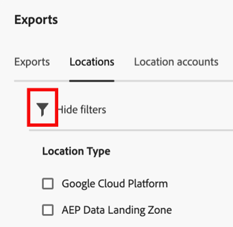
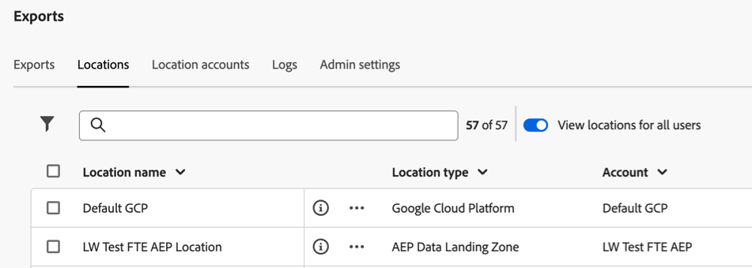
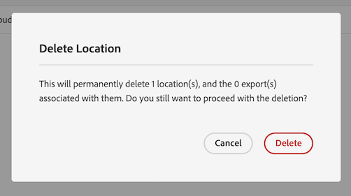
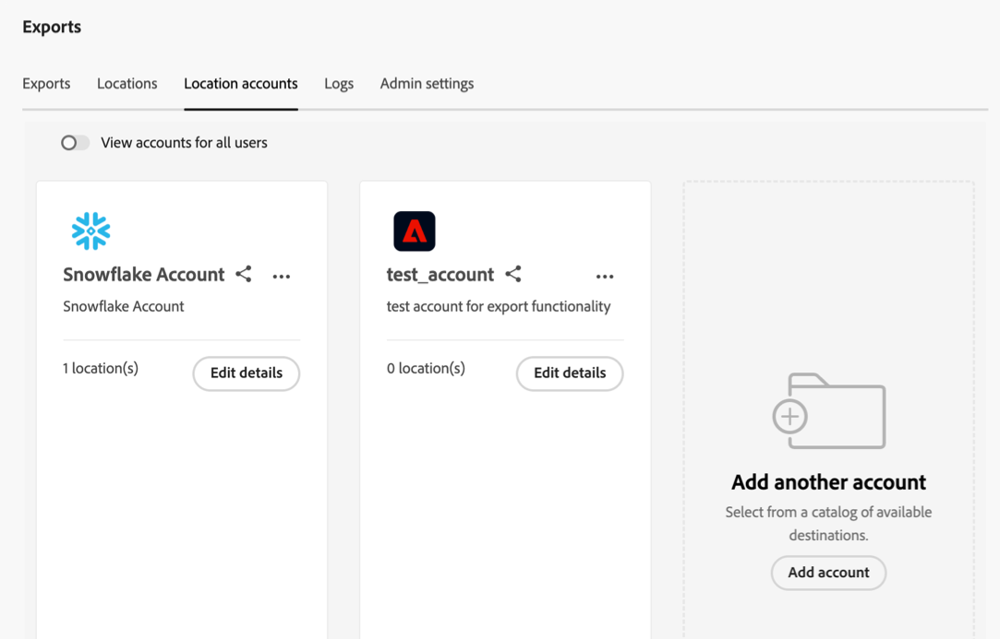
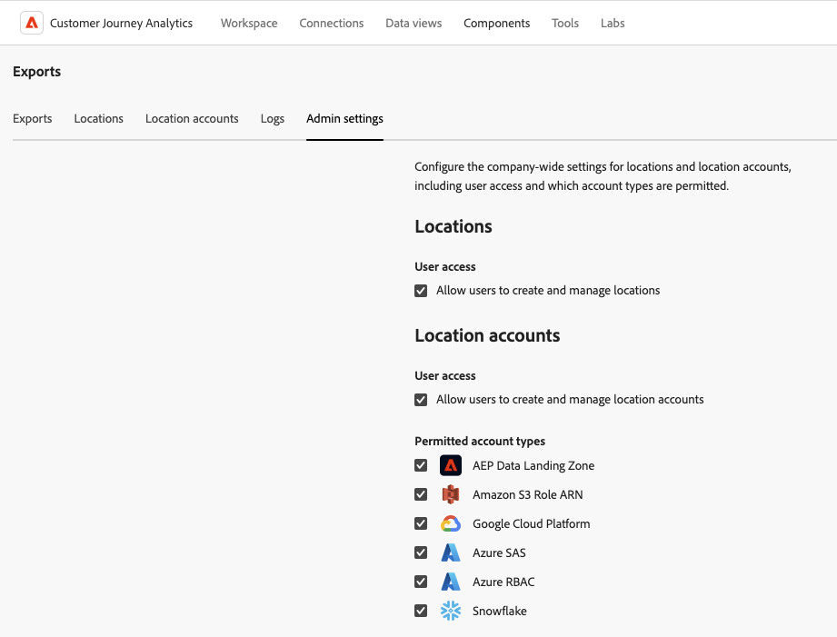

# クラウド書き出しの場所とアカウントの管理

クラウド書き出しの場所とアカウントを表示、編集、削除できます。

新しい場所の作成方法について詳しくは、[ クラウド書き出し場所の設定](/help/components/exports/cloud-export-locations.md)を参照してください。

## 場所のフィルタリングと検索

必要な情報を検索するには、場所のリストでフィルタリングするか、場所を検索します。

### 場所のリストをフィルタリング

1. Customer Journey Analyticsで、[!UICONTROL **コンポーネント**]/[!UICONTROL **書き出し**]&#x200B;を選択します。

1. 「[!UICONTROL **場所**]」タブを選択します。

1. 「**フィルター**」アイコンを選択します。

   

   次の条件でフィルタリングできます。

   | フィルター | 説明 |
   |---------|----------|
   | [!UICONTROL **場所の種類**]<!--should this be changed to Account type?--> | 場所が関連付けられているアカウントタイプ。 次のアカウントタイプを使用できます。 <ul><li>[!UICONTROL **AEP Data Landing Zone**]</li><li>[!UICONTROL **Amazon S3 Role ARN**]</li><li>[!UICONTROL **Azure SAS**]</li><li>[!UICONTROL **Azure RBAC**]</li><li>[!UICONTROL **Google Cloud Platform**]</li><li>[!UICONTROL **Snowflake**]</li></ul> |
   | [!UICONTROL **アカウント**] | 場所が関連付けられているアカウントの名前。 |
   | [!UICONTROL **作成者**] | 場所を作成したユーザーの電子メールアドレス。 |

   {style="table-layout:auto"}

### 場所の検索

1. Customer Journey Analyticsで、[!UICONTROL **コンポーネント**]/[!UICONTROL **書き出し**]&#x200B;を選択します。

1. 「[!UICONTROL **場所**]」タブを選択します。

   

1. （条件付き）システム管理者の場合は、[!UICONTROL **すべてのユーザーの場所を表示**] オプションを有効にして、組織内のすべてのユーザーが作成した場所を表示できます。

1. 検索フィールドで、検索先に関連付けられている情報の入力を開始します。 テーブルで使用可能な任意の列からデータを検索できます。

## 場所を編集

場所は、作成したユーザーまたはシステム管理者のみが編集できます。

場所を編集するには：

1. Customer Journey Analyticsで、[!UICONTROL **コンポーネント**]/[!UICONTROL **書き出し**]&#x200B;を選択します。

1. 「[!UICONTROL **場所**]」タブを選択します。

   

1. （条件付き）システム管理者の場合は、[!UICONTROL **すべてのユーザーの場所を表示**] オプションを有効にして、組織内のすべてのユーザーが作成した場所を表示できます。

1. 編集する場所を選択します。

1. 画面下部の「[!UICONTROL **編集**]」を選択します。

1. 必要に応じて変更を加え、[!UICONTROL **保存**]&#x200B;を選択します。

## 場所の削除

場所を削除すると、その場所を使用するすべての書き出しも削除されます。 削除時に確認ダイアログをチェックして、書き出しが場所に関連付けられていないことを確認します。

場所を削除するには：

1. Customer Journey Analyticsで、[!UICONTROL **コンポーネント**]/[!UICONTROL **書き出し**]&#x200B;を選択します。

1. 「[!UICONTROL **場所**]」タブを選択します。

   

1. （条件付き）システム管理者の場合は、[!UICONTROL **すべてのユーザーの場所を表示**] オプションを有効にして、組織内のすべてのユーザーが作成した場所を表示できます。

1. 削除する1つ以上の場所を選択します。

1. 画面下部の「[!UICONTROL **削除**]」を選択します。

   場所を削除ダイアログボックスが表示されます。

1. 場所を削除ダイアログボックスで、削除を確認する前に、場所が書き出しに関連付けられていないことを確認します。

   

1. 確認するには、[!UICONTROL **削除**]&#x200B;をもう一度選択します。

## アカウントを編集

アカウントは、作成したユーザーまたはシステム管理者のみが編集できます。

アカウントを編集するには：

1. Customer Journey Analyticsで、[!UICONTROL **コンポーネント**]/[!UICONTROL **書き出し**]&#x200B;を選択します。

1. 「[!UICONTROL **場所アカウント**]」タブを選択します。

   

1. （条件付き）システム管理者の場合は、[!UICONTROL **すべてのユーザーのアカウントを表示**] オプションを有効にして、組織内のすべてのユーザーが作成したアカウントを表示できます。

1. 編集するアカウントで「[!UICONTROL **詳細を編集**]」を選択します。

1. 必要に応じて変更を加え、[!UICONTROL **保存**]&#x200B;を選択します。

## アカウントキーの表示

アカウントを作成すると、そのアカウントに関連付けられているアカウントキーを表示できます。 この情報は、最初にアカウントを設定したときにクラウドプロバイダー[でアカウントの設定を完了しなかった場合に表示する必要がある場合があります](/help/components/exports/cloud-export-accounts.md)。

書き出しアカウントに関連付けられているキーを表示するには：

1. Customer Journey Analyticsで、[!UICONTROL **コンポーネント**]/[!UICONTROL **書き出し**]&#x200B;を選択します。

1. 「[!UICONTROL **場所アカウント**]」タブを選択します。

   

1. （条件付き）システム管理者の場合は、[!UICONTROL **すべてのユーザーのアカウントを表示**] オプションを有効にして、組織内のすべてのユーザーが作成したアカウントを表示できます。

1. 編集するアカウントの3 ドットアイコンを選択し、[!UICONTROL **キーを表示**]&#x200B;を選択します。

## アカウントの削除

1. Customer Journey Analyticsで、[!UICONTROL **コンポーネント**]/[!UICONTROL **書き出し**]&#x200B;を選択します。

1. 「[!UICONTROL **場所アカウント**]」タブを選択します。

   

1. （条件付き）システム管理者の場合は、[!UICONTROL **すべてのユーザーのアカウントを表示**] オプションを有効にして、組織内のすべてのユーザーが作成したアカウントを表示できます。

1. 削除するアカウントの3 ドットアイコンを選択し、[!UICONTROL **アカウントを削除**]&#x200B;を選択します。

1. 確認ダイアログで「[!UICONTROL **削除**]」を再度選択します。

## 会社全体の設定を行う（管理者のみ）

システム管理者は、ユーザーによるアカウントと場所の作成を制限したり、ユーザーが作成および使用できるアカウントの種類を制限したりできます。

### ユーザーがアカウントを作成および編集できるかどうかを設定します

デフォルトでは、組織内のすべてのユーザーは、[ クラウドエクスポートアカウントの設定](/help/components/exports/cloud-export-accounts.md)で説明されているように、Customer Journey Analytics環境で作成したアカウントを作成および編集できます。

アカウントの作成をユーザーに制限できます。 この操作を行うと、ユーザーは既に作成したアカウントを引き続き使用できますが、編集することはできません。 [ アカウントの削除](#delete-accounts)の説明に従って、ユーザーが作成したアカウントを削除できます。

アカウントの作成と編集を全ユーザーに制限するには、次の手順を実行します。

1. Customer Journey Analyticsで、「**[!UICONTROL コンポーネント]**」 > 「**[!UICONTROL 書き出し]**」を選択し、「[!UICONTROL **管理者設定**]」タブを選択します。

1. [!UICONTROL **場所アカウント**] セクションで、「[!UICONTROL **ユーザーが場所アカウントを作成および管理することを許可する**]」オプションの選択を解除します。

1. 「[!UICONTROL **保存**]」を選択します。

1. （オプション） [ アカウントの削除](#delete-accounts)で説明しているように、ユーザーが作成したアカウントのうち、ユーザーが使用しないアカウントを削除します。

### ユーザーが場所を作成および編集できるかどうかを設定します

デフォルトでは、組織内のすべてのユーザーは、[ クラウド書き出し場所の設定](/help/components/exports/cloud-export-locations.md)の説明に従って、Customer Journey Analytics環境で作成した場所を作成および編集できます。

場所の作成をユーザーに制限できます。 この操作を行うと、ユーザーは作成済みの場所を引き続き使用できますが、編集することはできません。 [場所の削除](#delete-locations)の説明に従って、ユーザーが作成した場所を削除できます。

すべてのユーザーが場所を作成および編集することを制限するには：

1. Customer Journey Analyticsで、「**[!UICONTROL コンポーネント]**」 > 「**[!UICONTROL 書き出し]**」を選択し、「[!UICONTROL **管理者設定**]」タブを選択します。

1. 「[!UICONTROL **場所**]」セクションで、「[!UICONTROL **ユーザーが場所を作成および管理することを許可する**]」オプションの選択を解除します。

1. 「[!UICONTROL **保存**]」を選択します。

1. （オプション）「[場所を削除](#delete-locations)」の説明に従って、ユーザーが作成した場所のうち、ユーザーが使用しない場所を削除します。

### ユーザーが作成および使用できるアカウントタイプを制限

ユーザーが表示するアカウントタイプは、次の状況で制限できます。

* [新規アカウントの作成時](/help/components/exports/cloud-export-accounts.md)。
* [ テーブルの書き出しを使用してファイルを書き出す際に使用するアカウントを選択する場合](/help/analysis-workspace/export/export-cloud.md)。

この節で説明するようにアカウントタイプを制限すると、制限するアカウントタイプのアカウントはユーザーには表示されなくなります。 つまり、そのタイプの新しいアカウントは作成できず、そのタイプの既存のアカウントは、テーブルの書き出しを使用してファイルを書き出す際に使用できません。

ただし、スケジュールされた書き出しに設定されている既存のアカウントを使用できないように制限する場合は、そのアカウントを削除する必要があります。

#### スケジュールされた書き出しにアカウントが使用されないようにします

アカウントタイプを制限すると、既存のアカウントは非表示になり、削除されません。

スケジュールが、制限するタイプのアカウントにデータを送信するように既に設定されている場合、アカウントタイプを制限した後もスケジュールは実行され続け、データは引き続きアカウントに送信されます。 例えば、テーブルの完全な書き出しが、制限したアカウントタイプにデータを送信するようにスケジュールされている場合、スケジュールは引き続き実行されます。

特定のタイプのアカウントがスケジュールされた書き出しで使用されないように確認する必要がある場合は、[ アカウントタイプを制限](#limit-the-account-types-that-are-available-to-users)する前にアカウントを削除できます。

アカウントを削除するには：

1. スケジュールされた書き出しに使用されている、制限するアカウントタイプのアカウントを探します。

1. 「[ アカウントを削除](#delete-accounts)」の説明に従って、アカウントを削除します。

1. 次のセクションに進みます。[ ユーザーが利用できるアカウントタイプを制限します](#limit-the-account-types-that-are-available-to-users)。

#### ユーザーが利用できるアカウントタイプを制限する

アカウントを作成および使用する際にユーザーが使用できるアカウントタイプを制限するには、次の手順に従います。

1. Customer Journey Analyticsで、「**[!UICONTROL コンポーネント]**」 > 「**[!UICONTROL 書き出し]**」を選択し、「[!UICONTROL **管理者設定**]」タブを選択します。

1. 「[!UICONTROL **許可されたアカウントタイプ**]」セクションを探します。

   次のアカウントタイプは、デフォルトでユーザーが使用できます。 ユーザーの使用を制限するアカウントタイプの選択を解除します。

   * [!UICONTROL **AEP Data Landing Zone**]

   * [!UICONTROL **Amazon S3 Role ARN**]

   * [!UICONTROL **Google Cloud Platform**]

   * [!UICONTROL **Azure SAS**]

   * [!UICONTROL **Azure RBAC**]

   * [!UICONTROL **Snowflake**]

1. 「[!UICONTROL **保存**]」を選択します。
