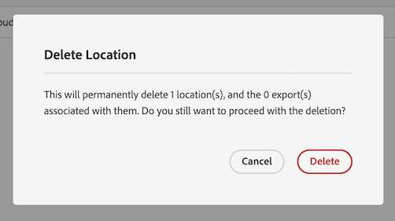

# クラウドの書き出し場所とアカウントの管理

クラウドの書き出し場所を表示、編集、削除できます。

新しい場所の作成方法については、を参照してください。 [クラウドの書き出し場所の設定](/help/components/exports/cloud-export-locations.md).

## フィルターと検索の場所

必要な情報を検索するには、場所のリストをフィルタリングするか、場所を検索します。

### 場所のリストのフィルタリング

1. Customer Journey Analyticsで、を選択します。 [!UICONTROL **Components**] > [!UICONTROL **エクスポート**].

1. 「」を選択します [!UICONTROL **場所**] タブ。

1. 「」を選択します **フィルター** アイコン。

   <!-- add screenshot -->

   次の条件でフィルタリングできます。

   | フィルター | 説明 |
   |---------|----------|
   | [!UICONTROL **場所タイプ**]<!--should this be changed to Account type?--> | 場所が関連付けられているアカウントタイプ。 次のアカウントタイプを使用できます。 <ul><li>[!UICONTROL **AEP データランディングゾーン**]</li><li>[!UICONTROL **Amazon S3 Role ARN**]</li><li>[!UICONTROL **Azure SAS**]</li><li>[!UICONTROL **Azure RBAC**]</li><li>[!UICONTROL **Google Cloud Platform**]</li><li>[!UICONTROL **Snowflake**]</li></ul> |
   | [!UICONTROL **アカウント**] | 場所が関連付けられているアカウントの名前。 |
   | [!UICONTROL **作成者**] | 場所を作成したユーザーのメールアドレス。 |

   {style="table-layout:auto"}

### 場所を検索

1. Customer Journey Analyticsで、を選択します。 [!UICONTROL **Components**] > [!UICONTROL **エクスポート**].

1. 「」を選択します [!UICONTROL **場所**] タブ。

1. （条件付き）システム管理者は、次を有効にできます [!UICONTROL **すべてのユーザーの場所を表示**] 組織内のすべてのユーザーが作成した事業所を表示するオプション。

1. 検索フィールドに、検索する場所に関連付けられている情報の入力を開始します。 テーブルで使用可能な任意の列からデータを検索できます。

## 場所を編集

1. Customer Journey Analyticsで、を選択します。 [!UICONTROL **Components**] > [!UICONTROL **エクスポート**].

1. 「」を選択します [!UICONTROL **場所**] タブ。

1. （条件付き）システム管理者は、次を有効にできます [!UICONTROL **すべてのユーザーの場所を表示**] 組織内のすべてのユーザーが作成した事業所を表示するオプション。

1. 編集する場所を選択します。

   

1. 「[!UICONTROL **編集**]」を選択します。

1. 必要な変更を加え、選択します。 [!UICONTROL **保存**].

## 場所を削除

場所を削除すると、その場所を使用する書き出しも削除されます。 削除時の確認ダイアログを確認して、書き出しが場所に関連付けられていないことを確認します。

場所を削除するには：

1. Customer Journey Analyticsで、を選択します。 [!UICONTROL **Components**] > [!UICONTROL **エクスポート**].

1. 「」を選択します [!UICONTROL **場所**] タブ。

1. （条件付き）システム管理者は、次を有効にできます [!UICONTROL **すべてのユーザーの場所を表示**] 組織内のすべてのユーザーが作成した事業所を表示するオプション。

1. 削除する場所を 1 つ以上選択します。

   

1. 「[!UICONTROL **削除**]」を選択します。

   [ 場所を削除 ] ダイアログ ボックスが表示されます。

1. 場所を削除ダイアログボックスで、削除を確認する前に、その場所が書き出しに関連付けられていないことを確認します。

   

1. を選択 [!UICONTROL **削除**] もう一度確認します。

## アカウントの編集

1. Customer Journey Analyticsで、を選択します。 [!UICONTROL **Components**] > [!UICONTROL **エクスポート**].

1. 「」を選択します [!UICONTROL **場所アカウント**] タブ。

   

1. （条件付き）システム管理者は、次を有効にできます [!UICONTROL **すべてのユーザーのアカウントの表示**] 組織内のすべてのユーザーが作成した事業所を表示するオプション。

1. を選択 [!UICONTROL **詳細を表示**] 編集するアカウント上で。

1. 必要な変更を加え、選択します。 [!UICONTROL **保存**].

## アカウントキーの表示

アカウントを作成すると、そのアカウントに関連付けられているアカウントキーを表示できます。 クラウドプロバイダーでアカウントの設定を完了していない場合は、この情報を表示する必要がある可能性があります [アカウントの初回設定時](/help/components/exports/cloud-export-accounts.md).

エクスポートアカウントに関連付けられているキーを表示するには：

1. Customer Journey Analyticsで、を選択します。 [!UICONTROL **Components**] > [!UICONTROL **エクスポート**].

1. 「」を選択します [!UICONTROL **場所アカウント**] タブ。

   

1. （条件付き）システム管理者は、次を有効にできます [!UICONTROL **すべてのユーザーのアカウントの表示**] 組織内のすべてのユーザーが作成した事業所を表示するオプション。

1. 編集するアカウント上の「。..」アイコンを選択し、次に選択します [!UICONTROL **アカウントキー**].

## アカウントの削除

1. Customer Journey Analyticsで、を選択します。 [!UICONTROL **Components**] > [!UICONTROL **エクスポート**].

1. 「」を選択します [!UICONTROL **場所アカウント**] タブ。

   

1. （条件付き）システム管理者は、次を有効にできます [!UICONTROL **すべてのユーザーのアカウントの表示**] 組織内のすべてのユーザーが作成した事業所を表示するオプション。

1. 編集するアカウント上の「。..」アイコンを選択し、次に選択します [!UICONTROL **アカウントを削除**].

1. を選択 [!UICONTROL **削除**] もう一度、確認ダイアログで確認します。
