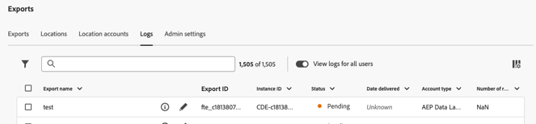
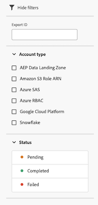

# 書き出しログの管理

エクスポートログは、各エクスポートの詳細を提供し、Analysis Workspace データがクラウドに書き出されるたびに生成されます。 （データをクラウドに書き出す方法について詳しくは、[Customer Journey Analytics レポートのクラウドへの書き出し ](/help/analysis-workspace/export/export-cloud.md) を参照してください。

スケジュールされた書き出しの場合、ログには、ログが送信されたときの書き出し設定が反映されます。 ログは削除できません。

## 書き出しログを表示

1. Customer Journey Analyticsで、[!UICONTROL **コンポーネント**]/[!UICONTROL **書き出し**] を選択します。

1. 「[!UICONTROL **ログ**]」タブを選択します。

   

   各ログの詳細は、使用可能な列に表示されます。

1. 次のいずれかの操作を行います。

   * システム管理者は、「**[!UICONTROL すべてのユーザーのログを表示]** オプションを有効にできます。 このオプションを有効にすると、書き出しを作成したユーザーに関係なく、すべてのログが表示されます。

   * 表示される [ 列をカスタマイズ ](#configure-columns) します。

   * ログ名の横にある **情報アイコン** を選択して、ログに関連付けられているエクスポートを表示します。

   * ログ名の横にある **エクスポートを編集アイコン** を選択して、ログに関連付けられているエクスポートを編集します。

     書き出しの編集について詳しくは、[Customer Journey Analytics レポートのクラウドへの書き出し ](/help/analysis-workspace/export/export-cloud.md) を参照してください。

## ログのフィルタリングと検索

必要な情報を見つけるには、ログのリストをフィルタリングするか、ログを検索します。

### ログのリストのフィルタリング

1. Customer Journey Analyticsで、[!UICONTROL **コンポーネント**]/[!UICONTROL **書き出し**] を選択します。

1. 「[!UICONTROL **ログ**]」タブを選択します。

1. **フィルター** アイコンを選択します。

   

   次の条件でフィルタリングできます。

   | フィルター | 説明 |
   |---------|----------|
   | [!UICONTROL **書き出し ID**] | 表示するエクスポートログのエクスポート ID を指定します。 |
   | [!UICONTROL **アカウントタイプ**] | ログが関連付けられているアカウントタイプ。 次のアカウントタイプを使用できます。 <ul><li>[!UICONTROL **AEP Data Landing Zone**]</li><li>[!UICONTROL **Amazon S3 Role ARN**]</li><li>[!UICONTROL **Azure SAS**]</li><li>[!UICONTROL **Azure RBAC**]</li><li>[!UICONTROL **Google Cloud Platform**]</li><li>[!UICONTROL **Snowflake**]</li></ul>。 |
   | [!UICONTROL **ステータス**] | エクスポートのステータス。 次のステータスを表示できます。 <ul><li>[!UICONTROL **保留中**]：書き出しの特定のインスタンスが開始されましたが、まだ完了していません。
ステータスが「保留中」のエクスポートを再実行すると、エクスポートプロセスが遅延します。
</li><li>[!UICONTROL **完了**]：書き出しの特定のインスタンスの処理が完了し、書き出しアカウントで使用できるようになりました。</li><li>[!UICONTROL **失敗**]
様々な状況で、書き出しが失敗する場合があります。 失敗ステータスの上にマウスポインターを置くと、失敗の詳細が表示されます。

失敗の考えられる理由について詳しくは、[ 失敗した書き出しのトラブルシューティング ](/help/components/exports/troubleshoot-exports.md) を参照してください。
</li></ul> |

   {style="table-layout:auto"}

### ログを検索

1. Customer Journey Analyticsで、[!UICONTROL **コンポーネント**]/[!UICONTROL **書き出し**] を選択します。

1. 「[!UICONTROL **ログ**]」タブを選択します。

1. 検索フィールドに、検索するログに関連付けられている情報の入力を開始します。 テーブルで使用可能な任意の列からデータを検索できます。

<!-- removed for MVP: Retry an export You can re-run the export associated with the selected log, using the data as it was on the day the log was originally exported. This is useful when selecting a log that show a failed export or when selecting a log that was accidentally deleted. 

Retrying an export that has a status of Pending will delay the export process.

This option is not available when selecting multiple logs. -->

<!-- 1. In Customer Journey Analytics, select [!UICONTROL **Components**] > [!UICONTROL **Exports**].

1. Select the [!UICONTROL **Logs**] tab, then select a log.

1. Select [!UICONTROL **Retry**]. -->

## 書き出しの編集

特定のログに関連付けられている書き出しを編集できます。

このオプションは、複数のログを選択している場合は使用できません。

1. Customer Journey Analyticsで、[!UICONTROL **コンポーネント**]/[!UICONTROL **書き出し**] を選択します。

1. 「[!UICONTROL **ログ**]」タブを選択します。

1. 編集するエクスポートに関連付けられているログを見つけます。

1. ログ名の横にある **エクスポートを編集** アイコン  を選択します。

   または

   ログの横にあるチェックボックスをオンにし、「[!UICONTROL **書き出しを編集**]」を選択します。

## 完了または失敗した書き出しを再実行

特定の書き出しログに関連付けられた 1 つ以上の書き出しを再実行できます。 書き出しを再実行するには、書き出しログのステータスが完了または失敗で、7 日以内である必要があります。

1. 再実行する 1 つ以上のエクスポートジョブの横にあるチェックボックスをオンにします。

1. 「**[!UICONTROL 再実行]**」を選択します。

## 列の設定

「[!UICONTROL  ログ ]」タブの列を追加または削除して、表示する情報を設定できます。

列ヘッダーを選択して、その列でログを並べ替えます。 デフォルトでは、ログは書き出しが開始された日時で並べ替えられます。

「[!UICONTROL  ログ ]」タブで列を設定するには：

1. Customer Journey Analyticsで、[!UICONTROL **コンポーネント**]/[!UICONTROL **書き出し**] を選択します。

1. 「[!UICONTROL **ログ**]」タブを選択します。

1. **ログ** ページの右上にある「」アイコン [!UICONTROL  テーブルをカスタマイズ ] を選択します。

   次の列を表示できます。

   | 使用可能な列 | 説明 |
   |---------|----------|
   | 書き出し名 | エクスポートの名前。 [Customer Journey Analytics レポートをクラウドに書き出す ](/help/analysis-workspace/export/export-cloud.md) で説明されているように、ユーザーは作成時に名前を付けます。 |
   | 書き出し ID | エクスポートの作成時にエクスポートに自動的に割り当てられた ID。<!-- True? --> |
   | インスタンス ID | Customer Journey Analytics インスタンスの ID。<!-- True? --> |
   | データビュー名 | エクスポートに関連付けられたデータビューの名前。 [Customer Journey Analytics レポートのクラウドへの書き出し ](/help/analysis-workspace/export/export-cloud.md) に示すように、書き出し時にデータビューを選択できます。 |
   | ファイル数 | エクスポートに含まれるファイルの数。 |
   | サイズ | 書き出しのサイズ。
ファイルサイズは 1024 のベースで計算されます。これは KiB および MiB として表されることがあります。 クラウドプロバイダーがベース 1000 を使用してサイズを計算すると、クラウドプロバイダーに表示されるサイズが、ここに表示されるサイズとは少し異なる場合があります。
 |
   | 場所 | データが書き出されたアカウント上の場所。 |
   | アカウント | データが書き出されたアカウント。 |
   | ステータス | エクスポートのステータス。 使用可能なステータスは、[!UICONTROL  保留中 ]、[!UICONTROL  完了 ]、[!UICONTROL  失敗 ] です。 |
   | 配信日 | エクスポートが行われた日付。 |
   | 開始日 | 書き出しが開始された日付。 |
   | アカウントタイプ | データが書き出されたクラウドアカウントのタイプ。 使用可能なアカウントタイプは、[!UICONTROL Amazon S3 Role ARN]、[!UICONTROL Google Cloud Platform]、[!UICONTROL Azure SAS]、[!UICONTROL Azure RBAC]、[!UICONTROL Snowflake]、[!UICONTROL AEP Data Landing Zone] です。 |
   | 行数 | エクスポートされたテーブルに含まれる行数。 |

   {style="table-layout:auto"}

1. 表示する列が選択されていることを確認します。選択した列は [!UICONTROL  ログ ] ページに表示され、関連情報が表示されます。

## 監査ログの表示

完全テーブルの書き出しは、[Customer Journey Analytics監査ログ ](/help/privacy/audit-log.md) でも追跡されます。<!-- Need to see what the Component Type for full-table export will be and add it here. Also, under "Event type captured by audit logs" there would be a new event type called "Full-table export". 4 actions would be "Create, Delete, Edit, Export" and "API_Request"? Also information about the locations. Probably have a different component for the location credentials.-->
