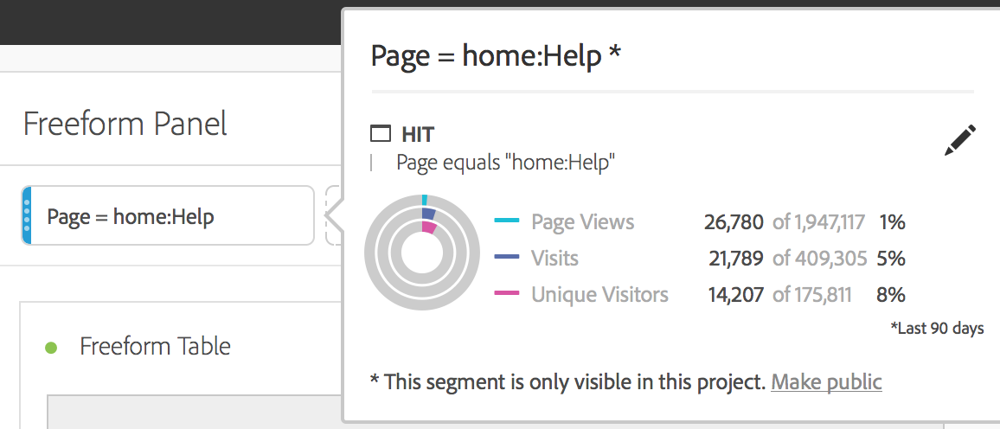

# フィルターの作成

フィルタービルダーのキャンバスに指標、ディメンション、フィルターおよびイベントをドラッグ＆ドロップすると、コンテナ階層の論理、ルールおよび演算子に基づいて訪問者をフィルタリングできます。この統合開発ツールを使用すると、訪問やページヒットを対象として訪問者の属性やアクションを識別する、簡単なフィルターや複雑なフィルターを作成して保存できます。

任意のコンポーネントタイプ（ディメンション、ディメンション項目、イベント、指標、フィルター、フィルターテンプレート、日付範囲）をパネルの上部にあるフィルタードロップゾーンにドロップすることで、フィルターを即座に作成できます。

コンポーネントタイプはフィルターに自動変換されます。また、「**[!UICONTROL フィルターを追加]**」ドロップボックスの「+」記号をクリックすることもできます。

次の点に注意してください。

* フィルターを作成できない計算指標およびディメンション／指標のコンポーネントタイプをフィルターゾーンにドロップすることは&#x200B;**できません**。
* Analysis Workspace では、すべてのディメンションおよびイベントに対して、「存在する」ヒットフィルターを作成します。例：「eVar1 が存在するヒット」または「event1 が存在するヒット」。
* 「未指定」または「なし」がフィルタードロップゾーンにドロップされると、フィルターで正しく扱えるように、自動的に「存在しない」フィルターに変換されます。

>[!NOTE]
>
>この方法で作成されたフィルターは、プロジェクト内部にあります。

次の手順に従うことで、これらのフィルターを公開（グローバル）できます。

1. ドロップゾーンのフィルターの上にマウスポインターを置いて、「i」アイコンをクリックします。
1. 表示される情報パネルで、「**[!UICONTROL 公開する]**」をクリックします。

   

## フィルターを適用するその他の方法

プロジェクトにフィルターを適用するには、他にもいくつかの方法があります。

| アクション | 説明 |
|--- |--- |
| 選択範囲からフィルターを作成 | インラインフィルターを作成します。行を選択して、選択範囲を右クリックし、インラインフィルターを作成します。このフィルターは、オープンプロジェクトにのみ適用し、CJA フィルターとして保存されません。1. 行を選択します。2. 選択範囲を右クリックします。3. 「*選択内容からフィルターを作成*」をクリックします。 |
| コンポーネント／新しいフィルター | フィルタービルダーを表示します。フィルタリングについて詳しくは、[フィルタービルダー](https://experienceleague.adobe.com/docs/analytics/components/segmentation/segmentation-workflow/seg-build.html)を参照してください。 |
| 共有／プロジェクトを共有または共有／プロジェクトデータをキュレート | [キュレーションおよび共有](https://experienceleague.adobe.com/docs/analytics/analyze/analysis-workspace/curate-share/curate.html#concept_4A9726927E7C44AFA260E2BB2721AFC6)では、プロジェクトに適用するフィルターを、受信者に共有された分析で使用する方法について学習します。 |
| フィルターをディメンションとして使用 | ビデオ：Analysis Workspace でフィルターをディメンションとして使用。 |

>[!VIDEO](https://video.tv.adobe.com/v/23974)
