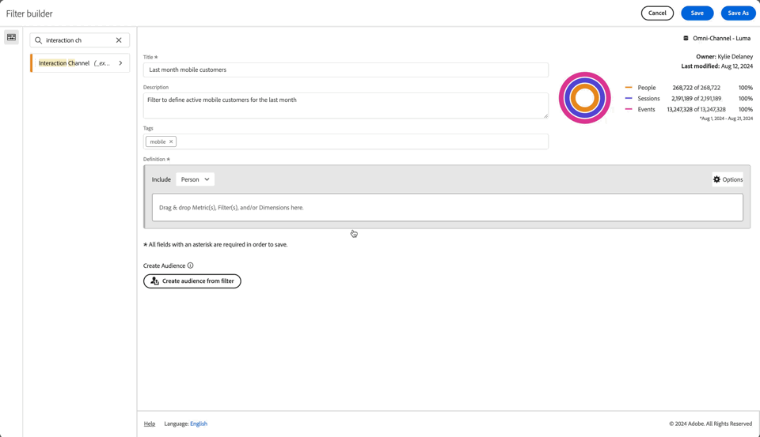

# フィルターの作成 {#build-filters}

<!-- markdownlint-disable MD034 -->

>[!CONTEXTUALHELP]
>id="cja_components_filters_createaudience"
>title="オーディエンスの作成"
>abstract="オーディエンスは、フィルターから作成して、アクティブ化するために Adobe Experience Platform と共有できます。"

<!-- markdownlint-enable MD034 -->

<!-- markdownlint-disable MD034 -->

>[!CONTEXTUALHELP]
>id="cja_components_filter_datapreview"
>title="データのプレビュー"
>abstract="このフィルターのデータをデータビューのデータと比較します。 プレビューの割合は、**過去 90 日間** のデータビューの合計数に基づきます。   プレビューが読み込まれない場合、接続がまだバックフィル中の可能性があります。"

<!-- markdownlint-enable MD034 -->

**[!UICONTROL フィルタービルダー]** ダイアログでは、新しいフィルターの作成や、既存のフィルターの編集を行えます。 このダイアログには、「**[!UICONTROL フィルター]** マネージャーから作成または管理するフィルターのタイトルが **** 新しいフィルター [[!UICONTROL  または ] フィルターを編集 ](/help/components/filters/manage-filters.md) と表示されます。

>[!BEGINTABS]

>[!TAB  フィルタービルダー ]

>[!TAB  フィルターの作成または編集 ]

>[!ENDTABS]

1. 次の詳細を指定します（は必須です）。

   | 要素 | 説明 |
   | --- | --- |
   | **[!UICONTROL データビュー]** | フィルターのデータ表示を選択できます。  定義したフィルターは、データビューの [ 設定 ](/help/data-views/create-dataview.md#settings-filters) タブでフィルターとして使用できます。 |
   | **[!UICONTROL プロジェクトのみのフィルター]** | フィルターが作成されたプロジェクトにのみ表示され、フィルターがコンポーネントリストに追加されないことを説明する情報ボックス。 **[!UICONTROL このフィルターをすべてのプロジェクトで使用できるようにして、コンポーネントリストに追加する]** を有効にして、その設定を変更します。 この情報ボックスは、[ クイックフィルター ](quick-filters.md) インターフェイスから **[!UICONTROL ビルダーを開く]** を使用して [!UICONTROL  クイックフィルター ] を作成し、クイックフィルター情報を標準フィルターに切り替えた場合にのみ表示されます。 |
   | **[!UICONTROL タイトル]**  | フィルターに名前を付けます（例：`Last month mobile customers`）。 |
   | **[!UICONTROL 説明]** | フィルターの説明（例：`Filter to define the mobile customers for the last month`）を指定します。 |
   | **[!UICONTROL タグ]** | 1 つ以上のタグを作成または適用して、フィルターを整理します。 入力を開始して、選択可能な既存のタグを検索します。または、**[!UICONTROL Enter]** キーを押して新しいタグを追加します。 「」を選択して、タグを削除します。 |
   | **[!UICONTROL 定義]**  | [ 定義ビルダー ](#definition-builder) を使用してフィルターを定義します。 |

   {style="table-layout:auto"}

1. フィルター定義が正しいかどうかを確認するには、右上のフィルターの結果の絶えず更新されるプレビューを使用します。
1. フィルターからオーディエンスを作成し、Experience Platformとオーディエンスを共有するには、「**[!UICONTROL フィルターからオーディエンスを作成]**」を選択します。 詳しくは、[ オーディエンスの作成と公開 ](/help/components/audiences/publish.md) を参照してください。
1. 選択：
   * **[!UICONTROL 保存]**：フィルターを保存します。
   * **[!UICONTROL 名前を付けて保存]**：フィルターのコピーを保存します。
   * **[!UICONTROL 削除]**：フィルターを削除します。
   * **[!UICONTROL キャンセル]**：フィルターに加えた変更をキャンセルしたり、新しいフィルターの作成をキャンセルしたりします。

## 定義ビルダー

定義ビルダーを使用して、フィルター定義を作成します。 この構成では、コンポーネント、コンテナ、演算子、ロジックを使用します。

定義のタイプと範囲を設定できます。

1. 定義のタイプを指定するには、ビルドにインクルード定義または除外定義を含めるかどうかを指定します。 **[!UICONTROL オプション]** を選択し、ドロップダウンの切り替え **[!UICONTROL 含める]** または **[!UICONTROL 除外]** から選択します。
1. 定義の範囲を指定するには、「**[!UICONTROL 含める]**」または **[!UICONTROL 除外]** ドロップダウンから、定義の範囲を **[!UICONTROL イベント]**、**[!UICONTROL セッション]**、**[!UICONTROL 人物]** のいずれにするかを選択します。

これらの設定は、後でいつでも変更できます。

### コンポーネント

フィルター定義の構成の重要な部分は、ディメンション、指標、既存のフィルターおよび日付範囲を使用することです。 これらのすべてのコンポーネントは、フィルタービルダーのコンポーネントパネルから使用できます。

{width=100%}

コンポーネントを追加するには、次の手順に従います。

1. コンポーネントパネルからコンポーネントを **[!UICONTROL ここに指標、フィルター、Dimensionをドラッグ&amp;ドロップ]** にドラッグ&amp;ドロップします。 コンポーネントバーの  を使用して、特定のコンポーネントを検索できます。
1. コンポーネントの詳細を指定します 例えば、「値を選択 **[!UICONTROL から値を選択し]** す。 または値を入力します。 1 つ以上の値を指定する内容と方法は、コンポーネントと演算子によって異なります。
1. 必要に応じて、デフォルトの演算子を変更します。 例えば、から **[!UICONTROL equals]** へ **[!UICONTROL equals any of]** へ。 使用可能な演算子の詳細な概要については、[ 演算子 ](operators.md) を参照してください。

コンポーネントを編集するには：

* 「演算子」ドロップダウンメニューからコンポーネントの新しい演算子を選択します。
* 必要に応じて、演算子に別の値を選択または指定します。
* コンポーネントタイプがディメンションの場合、アトリビューションモデルを定義できます。 詳しくは、[ アトリビューションモデル ](#attribution-models) を参照してください。

コンポーネントを削除するには：

* コンポーネントで  を選択します。

### コンテナ

複数のコンポーネントを 1 つ以上のコンテナにグループ化し、コンテナ内およびコンテナ間のロジックを定義できます。 コンテナを使用すると、フィルターの複雑な定義を作成できます。

{Width=100%}

* コンテナを追加するには、**[!UICONTROL 設定]****[!UICONTROL オプション  コンテナを追加]** を選択します。
* 既存のコンポーネントをコンテナに追加するには、コンポーネントをコンテナにドラッグ&amp;ドロップします。
* 別のコンポーネントをコンテナに追加するには、コンポーネントパネルからコンテナにコンポーネントをドラッグ&amp;ドロップします。 青い挿入ラインをガイドとして使用します。
* 別のコンポーネントをコンテナの外側に追加するには、コンポーネントパネルからコンテナの外側、メイン定義コンテナの内側にコンポーネントをドラッグ&amp;ドロップします。 青い挿入ラインをガイドとして使用します。
* コンテナ内のコンポーネント間、コンテナ間、コンテナとコンポーネント間のロジックを変更するには、適切な **[!UICONTROL And]**、**[!UICONTROL Or]**、**[!UICONTROL Then]** を選択します。 「次に」を選択すると、フィルターが順次フィルターに変わります。 詳しくは、[ 順次フィルターの作成 ](seg-sequential-build.md) を参照してください。
* コンテナレベルを切り替えるには、**[!UICONTROL Event]**、**[!UICONTROL Session]** または **[!UICONTROL Person]** を選択します。

以下の操作を行うために、コンテナで  を使用できます。

| コンテナアクション | 説明 |
|---|---|
| **[!UICONTROL コンテナを追加]** | コンテナにネストされたコンテナを追加します。 |
| **[!UICONTROL 除外]** | 結果をフィルター定義のコンテナから除外します。 薄い赤い左側のバーは、除外コンテナを示しています。 |
| **[!UICONTROL 含める]** | コンテナの結果をフィルター定義に含めます。 デフォルトは「含める」です。 薄いグレーの左バーは、インクルードコンテナを示します。 |
| **[!UICONTROL Name コンテナ]** | コンテナの名前をデフォルトの説明から変更します。 テキストフィールドに名前を入力します。 入力しない場合、デフォルトの説明が使用されます。 |
| **[!UICONTROL コンテナを削除]** | 定義からコンテナを削除します。 |

## 日付範囲

周期的な日付範囲を含むフィルターを作成できます。 そのため、実施中のキャンペーンやイベントに関する質問に答えることができます。 例えば、「過去 60 日間にオンライン購入を行った全員 *を含むフィルターを作成でき* す。

+++ 以下は、フィルターでの周期的な日付範囲の使用に関するビデオです

>[!VIDEO](https://video.tv.adobe.com/v/25403/?quality=12)

{{videoaa}}

+++

## フィルターを積み重ねる {#stack}

フィルターを使用してフィルターを作成できます。 フィルターでフィルターを使用すると、フィルターを最適化して複雑さを軽減できます。

デバイスタイプ（2）と米国状態（50）の組み合わせでフィルタリングするとします。 デバイスタイプ（携帯電話かタブレットか）と米国の州の独自の組み合わせに対して、それぞれ 100 個のフィルターを作成できます。 カリフォルニアのタブレットユーザーを取得するには、100 個のフィルターのいずれかを使用します。

または、52 個のフィルターを定義できます。米国の州用に 50 個、携帯電話用に 1 個、タブレット用に 1 個のフィルターです。 次に、フィルターを積み重ねて、同じ結果を取得します。 カリフォルニアのタブレットユーザーを取得するには、次の 2 つのフィルターを積み重ねます。

## アトリビューション {#attribution}

<!-- markdownlint-disable MD034 -->

>[!CONTEXTUALHELP]
>id="cja_components_filters_attribution_repeating"
>title="繰り返し"
>abstract="ディメンションのインスタンスと持続値を含みます。"

<!-- markdownlint-enable MD034 -->

<!-- markdownlint-disable MD034 -->

>[!CONTEXTUALHELP]
>id="cja_components_filters_attribution_instance"
>title="インスタンス"
>abstract="ディメンションのインスタンスと持続値を含みます。"

<!-- markdownlint-enable MD034 -->

<!-- markdownlint-disable MD034 -->

>[!CONTEXTUALHELP]
>id="cja_components_filters_attribution_nonrepeatinginstance"
>title="繰り返しなしインスタンス"
>abstract="ディメンション固有の（繰り返さない）インスタンスを含みます。"

<!-- markdownlint-enable MD034 -->

フィルタービルダーでディメンションを使用する場合、そのディメンションのアトリビューションモデルを指定するオプションがあります。 選択した属性モデルによって、データがディメンションコンポーネントに指定した条件に該当するかどうかが決まります。

ディメンションコンポーネント内で  を選択し、ポップアップからアトリビューションモデルの 1 つを選択します。

| モデル | 説明 |
|---|---|
| **[!UICONTROL 繰り返しモデル（デフォルト）]** | 検証を決定するために、ディメンションのインスタンスと持続値を含めます。 |
| **[!UICONTROL インスタンス]** | 検証を決定するために、ディメンションのインスタンス値のみを含めます。 |
| **[!UICONTROL 繰り返さないインスタンス]** | 選定を決定するために、ディメンションに一意のインスタンス（繰り返さない）値を含めます。 |

### 例

フィルター定義の一部として、条件「ページ名が女性に等しい」を指定しました。 上記の例と同様です。 他の 2 つのアトリビューションモデルを使用して、このフィルター定義を繰り返します。 したがって、3 つのフィルターがあり、それぞれに独自のアトリビューションモデルが設定されています。

* 女性ページ – アトリビューション – 繰り返し（デフォルト）
* 女性ページ – アトリビューション – インスタンス
* 女性ページ – アトリビューション – 繰り返さないインスタンス

次の表に、アトリビューションモデルごとに、その条件で認定される受信イベント  を示します。

| 女性ページ – アトリビューション -  *アトリビューションモデル* | イベント 1:  ページ名 equals Women | イベント 2:  ページ名 equals Men | イベント 3:  ページ名 equals Women | イベント 4:  ページ名が次と等しい   女性   （永続） | イベント 5:  ページ名が等しい   チェックアウト | イベント 6:  ページ名 equals Women | イベント 7:  ページ名が   ホームと等しい |
|---|:---:|:---:|:---:|:---:|:---:|:---:|:--:|
| 繰り返し（デフォルト） |  |  |  |  |  |  |  |
| インスタンス |  |  |  |  |  |  |  |
| 繰り返しなしインスタンス |  |  |  |  |  |  |  |

3 つのフィルターを使用したイベントに関するレポートの例を次に示します。

