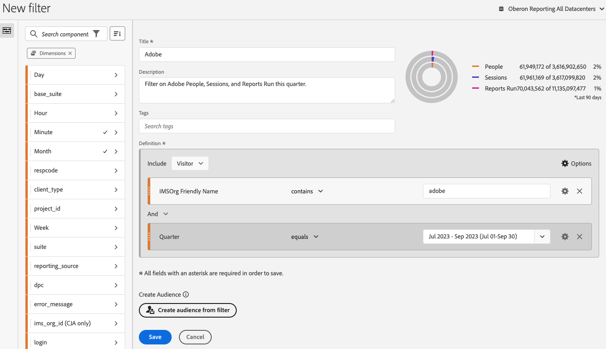

# フィルタービルダー

この [!UICONTROL フィルタービルダー] を使用すると、訪問やページヒットを対象として訪問者の属性やアクションを識別する、単純なフィルターや複雑なフィルターを作成できます。 指標ディメンション、イベントまたはその他のフィルターをドラッグ&amp;ドロップするキャンバスが表示され、階層ロジック、ルールおよび演算子に基づいて訪問者をフィルタリングできます。

作成先のプロジェクトにのみ適用されるクイックフィルターの作成方法について詳しくは、 [クイックフィルター](/help/components/filters/quick-filters.md).

## フィルタービルダーへのアクセス

フィルタービルダーには、次のいずれかの方法でアクセスできます。

* **Analytics 上部ナビゲーション**:クリック **[!UICONTROL Analytics]** > **[!UICONTROL コンポーネント]** > **[!UICONTROL フィルター]**.
* **[!UICONTROL Analysis Workspace]**:Analysis Workspaceでプロジェクトを開き、 **[!UICONTROL +コンポーネント]** > **[!UICONTROL フィルターを作成]**.
* **[!UICONTROL Reports &amp; Analytics]**:クリック **[!UICONTROL Analytics]** > **[!UICONTROL レポート]**&#x200B;をクリックし、既存のレポートを開いて、 **フィルター** 左側のナビゲーションのアイコンをクリックし、 **[!UICONTROL 追加]**.
* **[!UICONTROL Report Builder]**: [Report Builderでフィルターを追加または編集](https://experienceleague.adobe.com/docs/analytics/analyze/report-builder/data-requests/segmentation.html?lang=ja).

## ビルダー条件の概要 {#section_F61C4268A5974C788629399ADE1E6E7C}

ルールの定義とコンテナを追加して、フィルターを定義できます。 ( フィルタービルダーへのアクセスについて詳しくは、 [フィルタービルダーへのアクセス](#access-the-filter-builder).)

1. **[!UICONTROL タイトル]**:フィルターに名前を付けます。
1. **[!UICONTROL 説明]**:フィルターの説明を入力します。
1. **[!UICONTROL タグ]**: [フィルターのタグ付け](/help/components/filters/manage-filters.md) 既存のタグのリストから選択するか、新しいタグを作成して作成します。
1. **[!UICONTROL 定義]**:ここで、 [フィルターの作成と設定](/help/components/filters/filters-overview.md)、ルールを追加し、コンテナをネストして順に並べます。
1. **[!UICONTROL 表示]**：（上部のコンテナセレクター）トップレベルを選択できます [コンテナ](/help/components/filters/filters-overview.md) ( [!UICONTROL 人物], [!UICONTROL セッション], [!UICONTROL イベント]) をクリックします。 デフォルトの最上位コンテナはイベントコンテナです。
1. **[!UICONTROL オプション]**：（ギア）アイコン

   * **[!UICONTROL +コンテナを追加]**:新しいコンテナ（トップレベルのコンテナの下）をフィルター定義に追加できます。
   * **[!UICONTROL 除外]**:1 つ以上のディメンション、フィルターまたは指標を除外することで、フィルターを定義できます。

1. **[!UICONTROL ディメンション]**：コンポーネントがディメンションリスト（オレンジ色のサイドバー）からドラッグ&amp;ドロップされます。
1. **[!UICONTROL 演算子]**：選択した演算子を使用して値を比較および制限できます。
1. **[!UICONTROL 値]**:ディメンション、フィルターまたは指標のために入力または選択した値。
1. **[!UICONTROL アトリビューションモデル]**:ディメンションに対してのみ使用でき、これらのモデルは、フィルタリングするディメンションの値を決定します。 Dimensionモデルは、順次フィルターで特に役立ちます。

   * **[!UICONTROL 繰り返し]**（デフォルト）：ディメンションのインスタンスと持続値を含みます。
   * **[!UICONTROL インスタンス]**：ディメンションのインスタンスを含みます。
   * **[!UICONTROL 繰り返さないインスタンス]**：ディメンション固有の（繰り返さない）インスタンスを含みます。これは、繰り返しインスタンスが除外される場合にフローに適用されるモデルです。

   

   **例：eVar1 = A のイベントフィルター**

   | 例 | A | A | A（持続） | B | A | C |
   |---|---|---|---|---|---|---|
   | 繰り返し | X | X | X | - | X | - |
   | インスタンス | X | X | - | - | X | - |
   | 繰り返しなしインスタンス | X | - | - | - | X | - |
1. **[!UICONTROL And／Or／Then]**：コンテナまたはルールの間に [!UICONTROL AND／OR／THEN] 演算子を割り当てます。THEN 演算子を使用すると、 [順次フィルターの定義](/help/components/filters/filters-overview.md).
1. **[!UICONTROL 指標]**：（緑色のサイドバー）指標リストからドラッグ＆ドロップした指標。
1. **[!UICONTROL 比較]**&#x200B;演算子：選択した演算子を使用して値を比較および制限できます。
1. **[!UICONTROL 値]**:ディメンション、フィルターまたは指標のために入力または選択した値。
1. **[!UICONTROL X]**:（削除）フィルター定義のこの部分を削除できます。
1. **[!UICONTROL Experience Cloudの公開]**:Experience CloudにAdobe Analyticsフィルターを公開すると、 [!DNL Audience Manager] と他のアクティベーションチャネル内。 [詳細情報...](https://experienceleague.adobe.com/docs/analytics/components/segmentation/segmentation-workflow/seg-publish.html?lang=ja)
1. **[!UICONTROL オーディエンスライブラリ]**:Adobeのオーディエンスサービスは、訪問者データからオーディエンスフィルターへの変換を管理します。 したがって、オーディエンスを作成および管理することは、フィルターを作成および使用することに似ています。また、オーディエンスフィルターをExperience Cloudと共有することもできます。 [詳細情報...](https://experienceleague.adobe.com/docs/core-services/interface/audiences/audience-library.html?lang=ja)
1. **[!UICONTROL 検索]**:ディメンション、フィルターまたは指標のリストを検索します。
1. **[!UICONTROL ディメンション]**：（リスト）ヘッダーをクリックして展開します。
1. **[!UICONTROL 指標]**：ヘッダーをクリックして展開します。
1. **[!UICONTROL フィルター]**:ヘッダーをクリックして展開します。
1. **[!UICONTROL レポートスイートセレクター]**:このフィルターを保存するレポートスイートを選択できます。 その後も、すべてのレポートスイートでフィルターを利用できます。
1. **[!UICONTROL フィルタープレビュー]**:主要指標をプレビューして、有効なフィルターがあるかどうかと、フィルターの範囲を確認します。 このフィルターを適用した場合に表示されるデータセットの分類を表します。 3 つの同心円と、一致の数と割合を示すリストを表示します [!UICONTROL イベント], [!UICONTROL 人物]、および [!UICONTROL セッション] データセットに対してフィルターを実行する場合。 このグラフは、フィルター定義を作成または変更するとすぐに更新されます。
1. **[!UICONTROL 製品の互換性]**:どのAdobe Analytics製品 (Analysis Workspace、 [!UICONTROL Reports &amp; Analytics]、Data Warehouse) は、作成したフィルターと互換性があります。 ほとんどのフィルターは、すべての製品と互換性があります。 ただし、すべての演算子とディメンションが、特にすべての Analytics 製品と互換性があるわけではありません [Data Warehouse](https://experienceleague.adobe.com/docs/analytics/components/segmentation/segment-reference/seg-compatibility.html). このグラフは、フィルター定義を変更するとすぐに更新されます。
1. **[!UICONTROL 保存]** または **[!UICONTROL キャンセル]**:フィルタを保存またはキャンセルします。 クリック後 **[!UICONTROL 保存]**&#x200B;をクリックすると、フィルターを管理できるフィルターマネージャが表示されます。

日付範囲が埋め込まれたフィルターの動作は、引き続きAnalysis Workspaceと [!UICONTROL Reports &amp; Analytics]:Workspace では、日付範囲が埋め込まれたフィルターが、パネルの日付範囲より優先されます。 これに対して、 [!UICONTROL Reports &amp; Analytics] は、レポートの日付範囲とフィルターの埋め込みの日付範囲が重なる期間を示します。

## フィルターの作成 {#build-filters}

1. 左側のパネルからDimension、フィルターまたは指標イベントを [!UICONTROL 定義] フィールドに入力します。

   

1. ドロップダウンメニューから[演算子](https://experienceleague.adobe.com/docs/analytics/components/segmentation/segment-reference/seg-operators.html?lang=ja)を設定します。
1. 選択した項目に対して値を入力または選択します。
1. 必要に応じて他のコンテナを追加し、**[!UICONTROL AND]**、**[!UICONTROL OR]**、**[!UICONTROL THEN]** のルールを適用します。
1. コンテナを配置してルールを設定した後、右上の検証グラフでフィルターの結果を確認します。 バリデーターは、作成したフィルターに一致するページビュー数、訪問回数および個別訪問者の割合と絶対数を示します。
1. の下 **[!UICONTROL タグ]**, [タグ](/help/components/filters/manage-filters.md) 既存のタグを選択するか、新しいタグを作成することによって、コンテナを作成する。
1. クリック **[!UICONTROL 保存]** フィルターを保存します。

   これで、 [フィルターマネージャ](/help/components/filters/manage-filters.md)：複数の方法でフィルターにタグ付け、共有、管理できます。

## 追加コンテナ {#section_1C38F15703B44474B0718CEF06639EFD}

[コンテナのフレームワークを作成](/help/components/filters/filters-overview.md)し、論理ルールと演算子を配置できます。

1. クリック **[!UICONTROL オプション/コンテナを追加]**.

   新しい [!UICONTROL **イベント**] コンテナが開き、 [!UICONTROL **イベント**] （ページビュー）が特定されました。

   

1. 必要に応じて、コンテナタイプを変更します。
1. 左側のペインからDimension、フィルターまたはイベントをコンテナにドラッグします。
1. 定義の最上部にあるトップレベルの&#x200B;**[!UICONTROL オプション]**／**[!UICONTROL コンテナを追加]**&#x200B;を使用して、新しいコンテナの追加を続行するか、コンテナ内でコンテナを追加してロジックをネストします。

   **または**

   1 つ以上のルールを選択し、**[!UICONTROL オプション]**／**[!UICONTROL 選択項目からコンテナを追加]**&#x200B;をクリックします。選択した項目が別個のコンテナに変換されます。

## 日付範囲の使用 {#concept_252A83D43B6F4A4EBAB55F08AB2A1ACE}

実施中のキャンペーンやイベントに関する質問に回答するために、日付範囲の周期を含むフィルターを作成できます。

例えば、「過去 60 日間に購入したすべてのユーザー」を含むフィルターを簡単に作成できます。

セッションコンテナを作成し、その中に [!UICONTROL 過去 60 日間] 時間範囲と指標 [!UICONTROL 注文が 1 以上です]に、AND 演算子を付けます。

次に、フィルターでの周期的な日付範囲の使用に関するビデオを示します。

>[!VIDEO](https://video.tv.adobe.com/v/25403/?quality=12)

## フィルターを積み重ねる {#task_58140F17FFD64FF1BC30DC7B0A1B0E6D}

フィルターを積み重ねると、各フィルターの条件を「and」演算子で結合し、結合された条件を適用することで機能します。 これは、Workspace プロジェクトで直接実行するか、フィルタービルダーで実行できます。

例えば、「携帯電話ユーザー」フィルターと「米国の地域」フィルターを積み重ねると、米国の携帯電話ユーザーのデータのみが返されます。

これらのフィルターは、フィルターライブラリに組み込むことができる構成要素またはモジュールと考え、ユーザーが自由に使用できるようにします。 これにより、必要なフィルターの数を大幅に減らすことができます。 例えば、次の 40 個のフィルターがあるとします。

* 各国の携帯電話ユーザー用のセグメントが 20 個（米国の携帯電話、ドイツの携帯電話、フランスの携帯電話、ブラジルの携帯電話など）
* 各国のタブレットユーザー用のセグメントが 20 個（米国のタブレット、ドイツのタブレット、フランスのタブレット、ブラジルのタブレットなど）

フィルターの積み重ねを使用すると、フィルターの数を 22 個に減らし、必要に応じて積み重ねることができます。 次のフィルターを作成する必要があります。

* モバイルユーザー用の 1 つのフィルター
* タブレットユーザー用の 1 つのフィルター
* さまざまな地域に対して 20 個のフィルター

>[!NOTE]
>
>2 つのフィルターを積み重ねると、デフォルトで、それらのフィルターが AND ステートメントで結合されます。 これを OR ステートメントに変更することはできません。

1. フィルタービルダーに移動します。

1. フィルターのタイトルと説明を入力します。

1. クリック **[!UICONTROL フィルターを表示]** をクリックして、左のナビゲーションにフィルターのリストを表示します。

1. 積み重ねるフィルターをフィルター定義キャンバスにドラッグします。

1. 「[!UICONTROL **保存**]」を選択します。

## フィルターテンプレート {#concept_5098446CC78D441E93B8E4D1D1EA6558}

「初回訪問」や「モバイルデバイスからの訪問」など、一般的なフィルターの使用例に対してフィルターテンプレートが提供されます。 これらは、Workspace プロジェクトおよびフィルタービルダーで、新しいフィルターの構築ブロックとして使用できます。

テンプレートは、アドビの「A」ロゴで示されます。次に、テンプレートの例を示します。

<table id="table_98B87D807E9344C9BEBF072C65D87B1B"> 
 <thead> 
  <tr> 
   <th colname="col1" class="entry"> テンプレート名 </th> 
   <th colname="col2" class="entry"> 定義 </th> 
  </tr> 
 </thead>
 <tbody> 
  <tr> 
   <td colname="col1"> 買い物かごを放棄 </td> 
   <td colname="col2">商品を買い物かごに追加したが、何も注文しなかった訪問者のデータを表示します。フィルター定義では、コンテナは「訪問」です。 この順次フィルターのルールは次のとおりです。 
 「買い物かごへの追加数が null でない 
 
その場合 
 
注文数が 0 に等しい」です。 
 </td> 
  </tr> 
  <tr> 
   <td colname="col1"> 初回訪問回数 </td> 
   <td colname="col2">最大 1 回訪問した訪問者のデータを表示します。フィルター定義では、コンテナは「訪問」です。 ルールは 
訪問回数が 1 と等しい 
 </td> 
  </tr> 
  <tr> 
   <td colname="col1"> 非購入者 </td> 
   <td colname="col2">注文イベントに参加しなかった訪問者のデータを表示します。フィルター定義では、コンテナは訪問者です。 このフィルターでは、「除外」論理を使用します。 ルールは 
「注文数が null でない」です。 
 </td> 
  </tr> 
  <tr> 
   <td colname="col1"> 非直帰数（非バウンス） </td> 
   <td colname="col2">複数のページを訪問した訪問者のデータを表示します。フィルター定義では、コンテナは訪問者です。 このフィルターでは、「除外」論理を使用します。 ルールは 
「単一アクセスが null でない」です。 
 </td> 
  </tr> 
  <tr> 
   <td colname="col1"> 有料検索 </td> 
   <td colname="col2">有料検索から訪問した訪問者のデータを表示します。フィルター定義では、コンテナは「訪問」です。 ルールは 
「有料検索が 1」です。 
 </td> 
  </tr> 
  <tr> 
   <td colname="col1"> 購入者 </td> 
   <td colname="col2">注文イベントを発生させた訪問者のデータを表示します。フィルター定義では、コンテナは訪問者です。 ルールは 
「注文数が null でない」です。 
 </td> 
  </tr> 
  <tr> 
   <td colname="col1"> 再来訪 </td> 
   <td colname="col2">少なくとも 1 回訪問した訪問者のデータを表示します。フィルター定義では、コンテナは「訪問」です。 ルールは 
「訪問回数が 1 より大きい」です。 
 </td> 
  </tr> 
  <tr> 
   <td colname="col1"> 単一ページ訪問数 </td> 
   <td colname="col2"> 訪問時に複数のページビューを送信していても、単一のページ値を表示する訪問のデータを表示します。出口リンクイベントを持つ直帰数がフィルターに含まれます。 フィルター定義では、コンテナは「訪問」です。 ルールは 
単一ページ訪問が 1 です。 
 </td> 
  </tr> 
  <tr> 
   <td colname="col1"> 閲覧された製品が買い物かごに追加されなかった </td> 
   <td colname="col2">製品を閲覧したが、買い物かごに追加しなかった訪問者のデータを表示します。フィルター定義では、コンテナは「訪問」です。 この順次フィルターのルールは次のとおりです。 
「製品表示が null でない 
 
その場合 
 
 買い物かごへの追加数が 0 に等しい」です。 
 </td> 
  </tr> 
  <tr> 
   <td colname="col1"> キャンペーンからの訪問回数 </td> 
   <td colname="col2">キャンペーンから参照された訪問者のデータを表示します。フィルター定義では、コンテナは「訪問」です。 ルールは 
「トラッキングコードが null でない」です。 
 </td> 
  </tr> 
  <tr> 
   <td colname="col1"> モバイルデバイスからの訪問 </td> 
   <td colname="col2">モバイルデバイスを使用している訪問者のデータを表示します。フィルター定義では、コンテナは「訪問」です。 ルールは 
モバイルデバイスが null ではない。 
 </td> 
  </tr> 
  <tr> 
   <td colname="col1"> 自然検索からの訪問 </td> 
   <td colname="col2">有料検索から訪問していない訪問者のデータを表示します。フィルター定義では、コンテナは「訪問」です。 ルールは 
「有料検索が 0」です。 
 </td> 
  </tr> 
  <tr> 
   <td colname="col1"> モバイルデバイス以外からの訪問回数 </td> 
   <td colname="col2">モバイルデバイスを使用していない訪問者のデータを表示します。フィルター定義では、コンテナは「訪問」です。 このフィルターでは、「除外」論理を使用します。 ルールは 
「モバイルデバイスタイプが携帯電話に等しい」 
 
または 
 
「モバイルデバイスタイプがタブレットに等しい」です。 
 </td> 
  </tr> 
  <tr> 
   <td colname="col1"> 電話からの訪問回数 </td> 
   <td colname="col2">電話を使用している訪問者のデータを表示します。フィルター定義では、コンテナは「訪問」です。 ルールは 
「デバイスタイプが携帯電話に等しい」です。 
 </td> 
  </tr> 
  <tr> 
   <td colname="col1"> 検索エンジンからの訪問回数 </td> 
   <td colname="col2">検索エンジンから参照された訪問者のデータを表示します。フィルター定義では、コンテナは「訪問」です。 ルールは 
「リファラータイプが検索エンジンに等しい」です。 
 </td> 
  </tr> 
  <tr> 
   <td colname="col1"> ソーシャルサイトからの訪問件数 </td> 
   <td colname="col2">ソーシャルサイトから参照された訪問者のデータを表示します。フィルター定義では、コンテナは「訪問」です。 ルールは 
「リファラータイプがソーシャルネットワークに等しい」です。 
 </td> 
  </tr> 
  <tr> 
   <td colname="col1"> タブレットからの訪問回数 </td> 
   <td colname="col2">タブレットを使用している訪問者のデータを表示します。フィルター定義では、コンテナは「訪問」です。 ルールは 
「デバイスタイプがタブレットに等しい」です。 
 </td> 
  </tr> 
  <tr> 
   <td colname="col1"> 訪問者 ID cookie を使用した訪問 </td> 
   <td colname="col2">持続的 cookie が必要なサイトへの訪問者のデータを表示します。フィルター定義では、コンテナは「訪問」です。 ルールは 
永続的な Cookie が 1 に等しい。 
 </td> 
  </tr> 
 </tbody> 
</table>