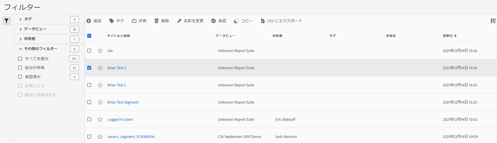

# フィルターの管理

フィルターマネージャでは、セグメントを様々な方法で管理できます。例えば、共有、タグ付け、承認、コピー、削除およびお気に入りへの登録が可能です。

フィルターマネージャには、自分が所有しているすべてのセグメントと、自分が共有しているフィルターが表示されます。管理者レベルのユーザーは、組織内のすべてのフィルターを表示できます。この概要では、フィルターマネージャのユーザーインターフェイスと機能について説明します。

上部のナビゲーションの&#x200B;**[!UICONTROL 顧客ジャーニー分析]** > **[!UICONTROL コンポーネント]** > **[!UICONTROL フィルター]**&#x200B;に移動して、フィルターマネージャーにアクセスします。

## フィルターマネージャ UI

| # | UI 機能 | 説明 |
|---|---|---|
| 1 | フィルター管理ツールバー | フィルターをチェックすると、このツールバーが表示されます。ほとんどの管理タスクをこのツールバーから完了できます。 |
| 2 | チェックボックス | 管理するフィルターにチェックマークを付けます。 |
| 4 | お気に入り | フィルターの横にある星をクリックすると、星が黄色に変わり、フィルターがお気に入りに登録されます。 |
| 5 | タイトルと説明 | フィルタービルダーで提供されます。タイトルと説明を編集するには、タイトルリンクをクリックします。タイトルリンクをクリックすると、フィルタービルダーに戻ります。 |
| 7 | 所有者 | フィルターの所有者が示されます。管理者以外のユーザーは、自分が所有しているまたは自分が共有していたフィルターのみを表示できます。 |
| 8 | タグ（列の選択でチェックされていないので、列は表示されていません） | 自分または自分とフィルターを共有しているユーザーによってフィルターに適用されたタグ。 |
| 9 | 共有先 | 自分がフィルターを共有している個人、グループまたは全員が表示されます。グループまたは全員を表示できるのは管理者のみです。 |
| 10 | 修正日 | フィルターが最後に修正された日付を表示します。 |
| 11 | 列の選択 | （右上）フィルターマネージャに表示する列を選択できます。 |
| 12 | 共有アイコン | このフィルターが自分が共有した、または自分と共有されていることを示します。 |
| 13 | 承認済みアイコン | このフィルターが管理者によって承認されていることを示します。 |
| 14 | その他のフィルター | タグ、データ表示、所有者およびその他（すべてを表示、自分が所有、自分と共有、承認済み、お気に入り）のフィルターを表示できます。 |

## プランフィルター

セグメントの計画は時間をかけておこない、組織にとって役立つセグメントを作成し、セグメントの数が適切になるように管理してください。

* オーディエンスを考慮します。どのような人がセグメントを使用しますか。どのような人とセグメントを共有しますか。このフィルターをどのようなグループで使用しますか。また、それに応じて、フィルターにどのようなタグを付ける必要がありますか。つまり、フィルターに適切な説明を付けるという意味でもあります。最低でも、説明には、次の質問に対する答えを反映する必要があります。

   * このフィルターはどのような分野で役立ちますか。

   * このフィルターはいつ使用する必要がありますか。

* フィルター範囲を決定します。範囲に最も適した[フィルターコンテナ](/help/components/filters/filters-overview.md)は、次のうちどれですか？できるだけ小さいコンテナを使用します。

* フィルター定義に含める要素と値を決定します。

* 承認プロセスの展開方法を検討します。フィルターの確認および承認は、1 人の担当者のみでおこないますか？それとも委員会で判定しますか？

* フィルターライブラリへのビューを使用してフィルターを定義します。フィルターライブラリを使用すると、部品としてのフィルターをモジュール形式で積み重ねおよび再利用できます。このライブラリを有益なものとするには、どのような「モジュール」を定義する必要がありますか。

### タグフィルター

フィルターマネージャでは、フィルターにタグを付けて管理できます。すべてのユーザーがフィルターにタグを付け、セグメントに 1 つ以上のタグを適用できます。ただし、自分が所有しているまたは自分が共有していたフィルターに対するタグのみを表示できます。

どのような種類のタグを作成する必要がありますか。次に、便利なタグのいくつかを示します。

* ソーシャルマーケティング、モバイルマーケティングなど、チーム名に基づくタグ。

* プロジェクトタグ（分析タグ）：入口ページ分析など。

* カテゴリタグ：メンズ、地域。

* ワークフロータグ：承認済み、（特定のビジネスユニット向けの）キュレーション。

フィルターをタグ付けするには、次の手順を実行します。

1. フィルターマネージャで、タグを付けるフィルターの横にあるチェックボックスを選択します。フィルター管理ツールバーが表示されます。

1. 「**[!UICONTROL タグ]**」をクリックし、次のいずれかの操作を行います。

   * 既存のタグから選択するか、

   * 新しいタグ名を入力し、**[!UICONTROL Enter]**&#x200B;を押します。

1. 「**[!UICONTROL タグ]**」を再度クリックしてセグメントにタグを付けます。

これで、タグが「タグ」列に表示されます（右上のギアアイコンをクリックして列を管理します）。また、**[!UICONTROL フィルター／タグ]**&#x200B;に移動すると、タグをフィルタリングできます。

### フィルターの承認

フィルターマネージャでは、アプリケーションの各種レベル向け、特定の部門またはグループ向け、およびレポーティングポリシーに合致したフィルターを承認するワークフローを設定できます。

次に、フィルターに承認フラグを設定する方法を示します。

1. フィルターマネージャで、フィルタータイトルの左側にあるチェックボックスを選択します。

1. フィルター管理タスクバーの「**[!UICONTROL 承認]**」をクリックします。

1. 承認済みセグメントを組織で共有することを検討します。

1. 「**[!UICONTROL OK]**」をクリックします。

   リスト内のフィルターの横には、承認アイコンがあります。

   

1. また、「**[!UICONTROL 未承認]**」をクリックすると、承認済みセグメントを未承認にすることもできます。

### フィルターの共有

権限に応じて、フィルターを組織全体、グループまたは個々のユーザーと共有できます。

| 管理者 | 管理者以外 |
|---|---|
| フィルターをすべてのユーザー、グループおよび特定のユーザーと共有できます。詳しくは、[Admin Console のドキュメント](https://helpx.adobe.com/jp/enterprise/using/manage-products-and-profiles.html)を参照してください。 | フィルターを個人ユーザーとのみ共有できます。 |

フィルターを会社全体で共有する必要があるのはどのような場合でしょうか。また、指標をユーザーグループまたは個々のユーザーとのみ共有する必要があるのはどのような場合でしょうか。次に、いくつかのベストプラクティスを示します。

* 管理者として、フィルターを会社全体およびすべてのユーザーで使用すると良いと判断される場合は、フィルターを全員で共有します。この場合、承認済みのフィルターにすることを検討してください。

* 管理者は、フィルタートによってチームに優れたビジネス価値がもたらされる場合、フィルターを特定の製品プロファイルと共有します。このようなフィルターは正式に承認しないでください。

* 管理者または個人ユーザーとして、フィルターを他の個人ユーザーと共有し、フィルターを入念に調べて確認します。役に立たないと判断される場合は破棄できます。このようなフィルターは正式に承認しないでください。

フィルターを共有するには、次の操作を実行します。

1. フィルターマネージャで、共有するフィルターの横にあるチェックボックスを選択します。

1. フィルタ管理ツールバーで、**[!UICONTROL 共有]**&#x200B;をクリックします。

1. 管理者は、「すべて」を選択できます。また、組織内のグループまたはユーザーを選択することもできます。管理者以外は、個々のユーザーのみを表示できます。検索フィールドを使用して、グループまたはユーザーを検索します。「**[!UICONTROL 共有]**」をクリックします。フィルターの横に共有アイコンが表示されます：

1. フィルター／その他のフィルター／自分と共有に移動して、自分と共有している指標をフィルタリングできます。

### フィルターのお気に入りへの登録

セグメントを使いやすく整理するための 1 つの方法として、セグメントをお気に入りに登録することができます。

1. フィルターマネージャで、お気に入りに登録するフィルターの横にある星をチェックします。星を選択すると星が黄色に変わります。

1. また、フィルター／その他のフィルター／お気に入りで、お気に入りをフィルタリングすることもできます。
