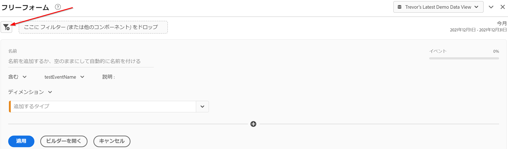
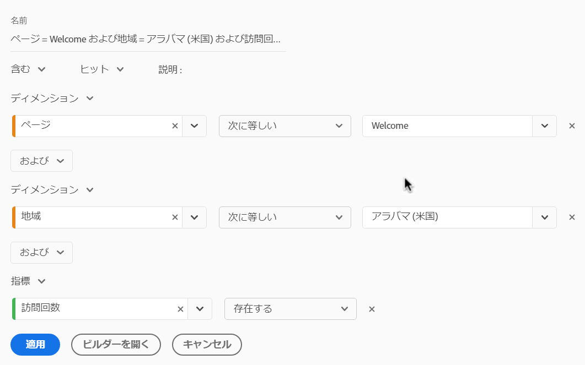
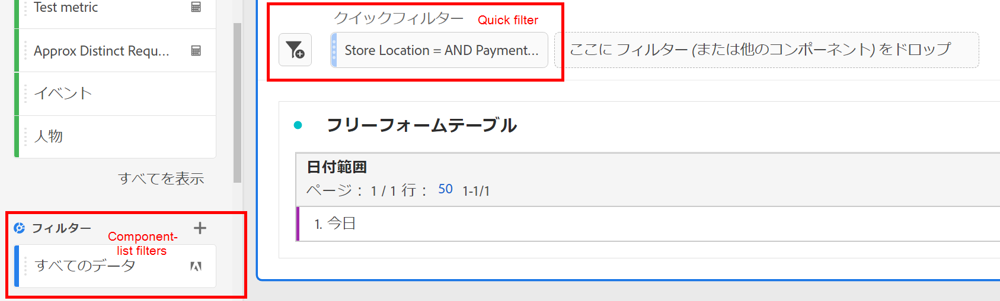
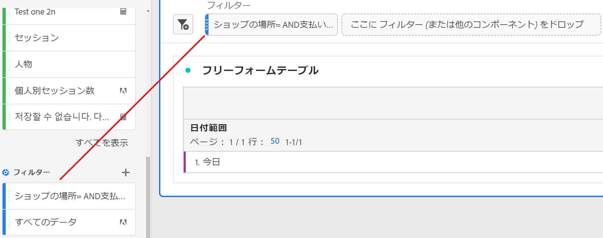
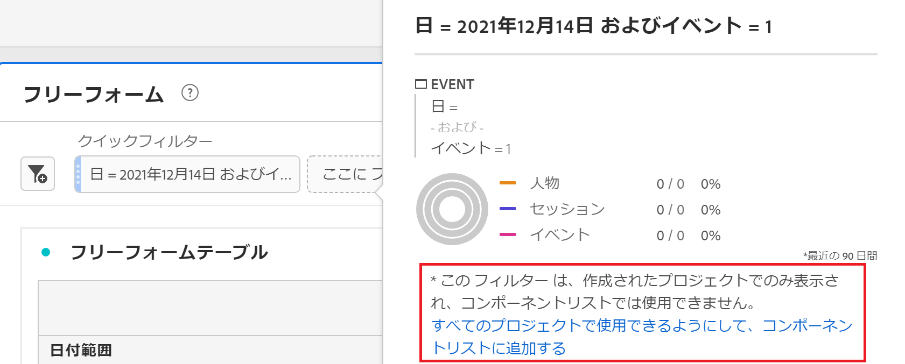

# クイックフィルター

プロジェクト内にクイックフィルターを作成して、[ フィルタービルダー ](/help/components/filters/create-filters.md) 全体の複雑さを回避できます。 クイックフィルター

* 作成されたプロジェクトにのみ適用します（変更可能）。
* 最大 3 つのルールを許可
* ネストされたコンテナや順次ルールに対応しない。
* 複数のレポートスイートを含むプロジェクトで作業する

本格的なコンポーネントリストフィルターとクイックフィルターの機能の比較については、[ ここ ](/help/components/filters/filters-overview.md) を参照してください。

>[!IMPORTANT]
> 現在、クイックフィルターは制限付きのテストで、まだ一般には利用できません。

## 前提条件 

クイックセグメントは誰でも作成できます。 ただし、クイックセグメントを保存したり、セグメントビルダーで開いたりするには、[Adobe Admin Console](https://experienceleague.adobe.com/docs/analytics/admin/admin-console/permissions/summary-tables.html?lang=en#analytics-tools) でセグメントの作成権限が必要です。

## クイックフィルターの作成

フリーフォームテーブルで、パネルヘッダーのフィルター + アイコンをクリックします。

| 設定 | 説明 |
| --- | --- |
| 名前 | フィルターのデフォルト名は、フィルター内のルール名の組み合わせです。 フィルターの名前を、わかりやすい名前に変更できます。 |
| 含む／除く | フィルター定義には、コンポーネントを含めるか除外するかを選択できますが、両方を除外することはできません。 |
| ヒット/訪問/訪問者コンテナ | クイックフィルターには、ディメンション/指標/日付範囲をフィルターに含める（または除外する）ことができる [ フィルターコンテナ ](https://experienceleague.adobe.com/docs/analytics-platform/using/cja-components/cja-filters/filters-overview.html?lang=ja#filter-containers) が 1 つだけ含まれます。  訪問者には、訪問およびページビュー全体で訪問者に固有の包括的なデータが含まれます。[!UICONTROL  訪問 ] コンテナでは訪問者のデータを訪問に基づいて分類するルールを設定でき、[!UICONTROL  ヒット ] コンテナでは訪問者情報を個々のページビューに基づいて分類できます。 デフォルトのコンテナは [!UICONTROL  ヒット ] です。 |
| コンポーネント (Dimension/指標/日付範囲 ) | コンポーネント（ディメンションや指標、日付範囲など）とその値を追加して、最大 3 つのルールを定義できます。 適切なコンポーネントを見つける方法は 3 つあります。<ul><li>入力を開始すると、[!UICONTROL  クイックフィルター ] ビルダーによって適切なコンポーネントが自動的に検索されます。</li><li>ドロップダウンリストを使用して、コンポーネントを検索します。</li><li>左パネルからコンポーネントをドラッグ＆ドロップします。</li></ul> |
| 演算子 | 標準演算子と [!UICONTROL  個別カウント ] 演算子を検索するには、ドロップダウンメニューを使用します。 [詳細情報](https://experienceleague.adobe.com/docs/analytics/components/filteration/segment-reference/seg-operators.html?lang=en) |
| プラス記号 (+) | 別のルールの追加 |
| AND/OR 修飾子 | 「AND」修飾子や「OR」修飾子をルールに追加できますが、単一のフィルター定義で「AND」と「OR」を混在させることはできません。 |
| 適用 | このフィルターをパネルに適用します。 フィルターにデータが含まれていない場合は、続行するかどうかを尋ねられます。 |
| ビルダーを開く | フィルタービルダーを開きます。 フィルタービルダーでフィルターを保存または適用すると、「クイックフィルター」とは見なされなくなります。 これは、コンポーネントリストフィルターライブラリの一部になります。 |
| キャンセル | このクイックフィルターを取り消します。適用しないでください。 |
| 日付範囲 | バリデーターは、データ参照にパネルの日付範囲を使用します。 ただし、クイックフィルターで適用した日付範囲は、パネルの上部にあるパネルの日付範囲より優先されます。 |
| プレビュー（右上） | 有効なフィルターがあるかどうか、およびフィルターの範囲を確認できます。 このフィルターを適用する際に期待できるデータセットの分類を表します。 このフィルターにデータがないことを示す通知が表示される場合があります。 この場合、フィルター定義を続行または変更できます。 |

次に、ディメンションと指標を組み合わせたフィルターの例を示します。

上部にフィルターが表示されます。 左側のフィルターライブラリにあるコンポーネントレベルのフィルターの青いサイドバーとは異なり、青い縞のサイドバーに注意してください。

## クイックフィルターの編集

1. クイックフィルターの上にマウスポインターを置いて、鉛筆アイコンを選択します。
1. フィルター定義またはフィルター名を編集します。

## クイックフィルターの保存

クイックフィルターは、[!UICONTROL  クイックフィルタービルダー ] または [!UICONTROL  フィルタービルダー ] で保存できます。

>[!IMPORTANT]
>フィルターを保存または適用すると、クイックフィルタービルダーでは編集できなくなり、通常のフィルタービルダーでのみ編集できます。

### クイックフィルタービルダーで保存

1. クイックフィルターを適用したら、その上にマウスポインターを置いて、情報 (「i」) アイコンを選択します。
1. **[!UICONTROL 「すべてのプロジェクトで使用可能にする」をクリックし、コンポーネントリスト]** に追加します。
1. （オプション）フィルターの名前を変更します。
1. 「**[!UICONTROL 保存]**」をクリックします。

フィルターの横棒が縞模様の青から薄い青に変わるのに注意してください。 これで、左側のレールのコンポーネントリストに表示されます。

### フィルタービルダーに保存

1. クイックフィルターの上にマウスポインターを置いて、情報 (「i」) アイコンを選択します。
1. 「**[!UICONTROL フィルターを保存]**」を選択します。
1. 名前はそのままにするか、フィルターの名前を変更します。

   Workspace に戻り、フィルターが明るい青のサイドバーになっていることを確認します。 これは、クイックフィルタービルダーで編集/開くことができなくなったことを示します。 保存すると、コンポーネントリストの一部になります。

   

フィルターを適用した後、フィルターコンポーネントリストに追加して、すべてのプロジェクトで使用できるようにします。

1. 保存したフィルターの上にマウスポインターを置いて、鉛筆アイコンを選択します。

1. フィルタービルダーの上部に、次のダイアログが表示されます。

   

1. 「**[!UICONTROL すべてのプロジェクトで使用可能にし、コンポーネントリストに追加」の横にあるチェックボックスを選択します。]**
1. 「**[!UICONTROL 保存]**」をクリックします。
1. フィルターが、すべてのプロジェクトのフィルターコンポーネントリストに表示されます。
1. また、[ フィルター ](/help/components/filters/manage-filters.md) を組織内の他のユーザーと共有することもできます。

## プロジェクトのみのフィルターとは

プロジェクトのみのフィルターは、クイックフィルターまたはアドホック Workspace プロジェクトフィルターです。 [!UICONTROL  フィルタービルダー ] で編集または開くと、プロジェクト専用のボックスが表示されます。

ビルダーでクイックフィルターを適用し、「使用可能にする」ボックスをオフにした場合、そのフィルターはまだプロジェクト専用のフィルターですが、[!UICONTROL  クイックフィルタービルダー ] では開けません。 このボックスをオンにして **[!UICONTROL 保存]** をクリックすると、このフィルターはコンポーネントリストフィルターになります。
