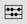

# コンポーネントの概要

コンポーネントは、レポートで使用したり、レポート機能を補完したりできる、Customer Journey Analytics の機能です。これらのコンポーネントは、次の手順で管理できます。

1. Adobe ID の資格情報を使用して [analytics.adobe.com](https://analytics.adobe.com) にログインします。
2. ヘッダーメニューで[!UICONTROL コンポーネント]／[!UICONTROL コンポーネント]に移動します。

次のコンポーネントを管理できます。

* [**注釈**](/help/components/annotations/overview.md)：コンテキストデータのニュアンスとインサイトを組織に伝えます。
* [**フィルター**](filters/filters-overview.md)：データの一部を除外して、共通のディメンション項目に焦点を当てる
* [**計算指標**](calc-metrics/calc-metr-overview.md)：レポートで使用する新しいコンポーネントとして指標と数式を使用する
* [**日付範囲**](date-ranges/overview.md)：日付範囲 Analysis Workspace オファーのカスタマイズと調整
* [**プロジェクト**](/help/analysis-workspace/home.md)：Analysis Workspace でのプロジェクトの整理と管理

## Analysis Workspace のコンポーネント

Analysis Workspace のコンポーネントは、プロジェクトにドラッグ＆ドロップできる指標、ディメンション、フィルターおよび時間精度で構成されています。カスタム日付範囲などの、作成したカスタムコンポーネントがこれらのパネルに追加されます。

コンポーネントパネルにアクセスするには、左側のパネルで&#x200B;**[!UICONTROL コンポーネント]**&#x200B;アイコンをクリックします。左側のパネルのアイコンを使用するか、[ホットキー](/help/analysis-workspace/build-workspace-project/fa-shortcut-keys.md)を使用して、パネル（空白パネル、[フリーフォームパネル](/help/analysis-workspace/visualizations/freeform-table/freeform-table.md)、[クイックインサイトパネル](/help/analysis-workspace/c-panels/quickinsight.md)、[Attribution IQ](/help/analysis-workspace/c-panels/attribution.md) パネルのいずれか）、[ビジュアライゼーション](/help/analysis-workspace/visualizations/freeform-analysis-visualizations.md)、コンポーネントを切り替えることができます。

プロジェクトでのコンポーネントの使用については、[ワークスペースプロジェクトの作成](/help/analysis-workspace/home.md)を参照してください。

## コンポーネントのアクション

コンポーネントは、様々な方法で（個別に、または複数選択して同時に）管理できます。コンポーネントを右クリックするか、コンポーネントリストの上部にある「**[!UICONTROL アクション]**」をクリックします。

>[!NOTE]
>
>これらのアクションは、時間コンポーネントには適用されません。

| コンポーネントのアクション | 説明 |
| --- | --- |
| タグ | コンポーネントにタグを適用して整理したり管理したりします。これらは、[!UICONTROL 分析]／[!UICONTROL コンポーネント]／[!UICONTROL フィルター]や[!UICONTROL 分析]／[!UICONTROL コンポーネント]／[!UICONTROL プロジェクト]などの各コンポーネントマネージャーに表示されます。 |
| お気に入り | コンポーネントをお気に入りのリストに追加します。これらは、[!UICONTROL 分析]／[!UICONTROL コンポーネント]／[!UICONTROL フィルター]や[!UICONTROL 分析]／[!UICONTROL コンポーネント]／[!UICONTROL プロジェクト]などの各コンポーネントマネージャーに表示されます。 |
| 承認 | コンポーネントを正規のものとして承認します。これらは、[!UICONTROL 分析]／[!UICONTROL コンポーネント]／[!UICONTROL フィルター]や[!UICONTROL 分析]／[!UICONTROL コンポーネント]／[!UICONTROL プロジェクト]などの各コンポーネントマネージャーに表示されます。 |
| 共有 | フィルターにのみ適用されます。 |
| 削除 | フィルターにのみ適用されます。 |

指標、フィルター、日付の作成に関するビデオを視聴してください。

>[!VIDEO](https://video.tv.adobe.com/v/23979)

## コンポーネントの管理 {#actions}

左側のパネルでコンポーネントを直接管理できます。

1. コンポーネントを右クリックします。

   または

   コンポーネントを選択してから、 **アクション** （3 ドット）アイコンを使用して、コンポーネントリストの上部に表示されます。

   >[!TIP]
   >
   >   Shift キーを押しながら複数のコンポーネントを選択するか、Command キー (Mac) または Ctrl キー (Windows) を押しながら複数のコンポーネントを選択できます。

   

   | コンポーネントのアクション | 説明 |
   |--- |--- |
   | [!UICONTROL **タグ**] | コンポーネントにタグを適用して整理したり管理したりします。次に、フィルターをクリックするか「#」を入力して、左側のレールのタグで検索できます。 タグは、コンポーネントマネージャーのフィルターとしても機能します。 |
   | [!UICONTROL **お気に入り**] | コンポーネントをお気に入りのリストに追加します。タグと同様に、左側のレールのお気に入りで検索し、コンポーネントマネージャーでフィルタリングできます。 |
   | [!UICONTROL **承認**] | コンポーネントを「承認済み」とマークして、コンポーネントが組織で承認されていることをユーザーに知らせます。 タグと同様に、左側のレールで「承認済み」を検索し、コンポーネントマネージャーでフィルタリングできます。 |
   | [!UICONTROL **共有**] | 組織内のユーザーとコンポーネントを共有します。 このオプションは、フィルターや計算指標などのカスタムコンポーネントでのみ使用できます。 |
   | [!UICONTROL **削除**] | 不要になったコンポーネントを削除します。 このオプションは、フィルターや計算指標などのカスタムコンポーネントでのみ使用できます。 |

カスタムコンポーネントは、それぞれのコンポーネントマネージャーを通じて管理することもできます。 例えば、 [フィルターの管理](/help/components/filters/manage-filters.md).

## コンポーネントリストの検索、フィルタリング、並べ替え

Analysis Workspaceの左側のパネルでコンポーネントリストを検索、フィルタリングおよび並べ替えて、特定のコンポーネントをすばやく見つけることができます。

### コンポーネントリストを検索

1. を選択します。 **コンポーネント** アイコン  をクリックします。

1. 検索フィールドに、プロジェクトで使用するコンポーネントの名前を入力します。

   コンポーネントの種類は、色とアイコンの両方で識別できます。 **Dimension**  オレンジ色です **フィルター**  青い **日付範囲**  紫色で **指標**  は緑です。 Adobeアイコン  は、計算指標テンプレートまたはフィルターテンプレート、および計算ツールアイコンを示します  は、組織の Analytics 管理者が作成した計算指標を示していました。

1. ドロップダウンリストに表示される場合に、コンポーネントを選択します。

### コンポーネントリストのフィルタリング

1. を選択します。 **コンポーネント** アイコン  をクリックします。

1. を選択します。 **フィルター** アイコン .

   または

   検索フィールドにシャープ記号 (#) を入力します。

1. 次のいずれかのフィルターオプションを選択して、コンポーネントのリストをフィルターします。

   | オプション | 関数 |
   |---------|----------|
   | [!UICONTROL **承認済み**] | 管理者が承認済みとしてマークしたコンポーネントのみを表示します。 |
   | [!UICONTROL **お気に入り**] | お気に入りのリストにあるコンポーネントのみを表示します。お気に入りのリストにコンポーネントを追加する方法については、 [コンポーネントの管理](#manage-components). |
   | [!UICONTROL **ディメンション**] | ディメンションであるコンポーネントのみを表示します |
   | [!UICONTROL **指標**] | 指標であるコンポーネントのみを表示します |
   | [!UICONTROL **フィルター**] | フィルターのコンポーネントのみを表示します。 |
   | [!UICONTROL **日付範囲**] | 日付範囲であるコンポーネントのみを表示します |
   | [!UICONTROL **すべてを表示**] | すべてのコンポーネントの表示。 このオプションは、管理者のみが使用できます。 |
   | [!UICONTROL **未承認**] | 管理者が承認済みとしてまだマークしていないコンポーネントのみを表示します。レビューと承認が必要なコンポーネントを管理者が識別する際に役立ちます。このオプションは、管理者のみが使用できます。 |

1. （オプション）リストをさらに絞り込むには、 [コンポーネントリストの並べ替え](#sort-the-component-list).

### コンポーネントリストの並べ替え

1. （オプション）コンポーネントリストに任意のフィルターを適用します。詳しくは、 [コンポーネントリストのフィルタリング](#filter-the-component-list).

1. を選択します。 **コンポーネント** アイコン  をクリックします。

1. を選択します。 **並べ替え** アイコン 次に、次のいずれかのフィルターオプションを選択して、コンポーネントのリストを並べ替えます。

   {{components-sort-options}}

## コンポーネントのアクセス権限

Analysis Workspace では、管理者はレポートでユーザーに公開するコンポーネントを[キュレート](/help/analysis-workspace/curate-share/curate.md)できます。
