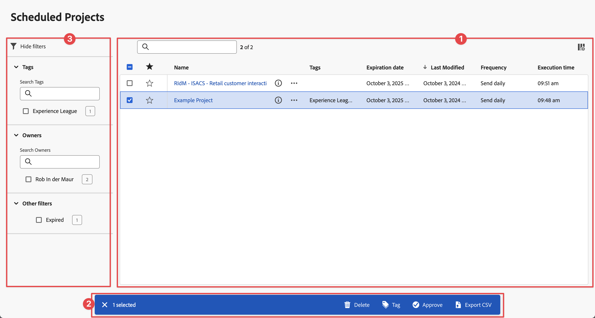
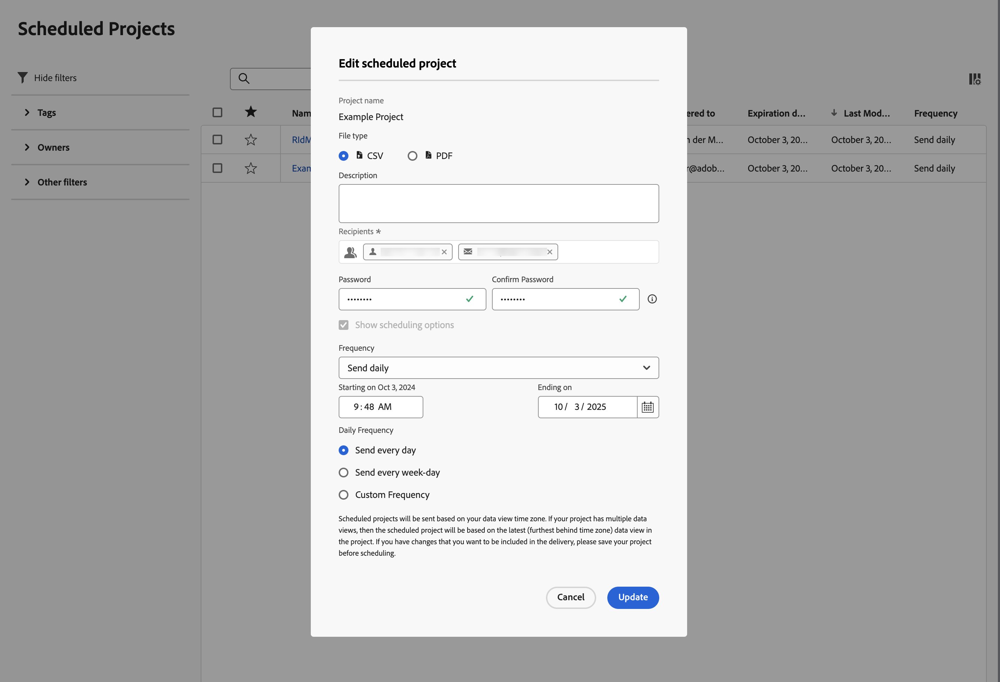

# スケジュールされたプロジェクト

スケジュールされたAnalysis Workspace プロジェクトは、**[!UICONTROL コンポーネント]**/**[!UICONTROL スケジュールされたプロジェクト]**&#x200B;を使用してCustomer Journey Analyticsで管理できます。

**[!UICONTROL スケジュール済みプロジェクト]**&#x200B;では、定期的なプロジェクト スケジュールを編集および削除できます。  [ スケジュール済みプロジェクトリスト ](#scheduled-project-list)には、特定のユーザーが作成したアイテムが表示されます。 アプリケーションでユーザーアカウントが無効になっている場合、スケジュールされたすべての配信が停止します。

## スケジュール済みプロジェクトリスト

スケジュール済みプロジェクト リスト ➊には、次の列が表示されます。

| 列 | 説明 |
| --- | --- |
|  | 1つ以上のスケジュール済みプロジェクトを選択すると、スケジュール済みプロジェクトインターフェイスの下部に青いアクションバーが表示されます。 詳しくは、[アクション](#actions)を参照してください。 |
|  | スケジュールされたプロジェクトでを優先するか、を優先しない場合に選択します。 |
| **[!UICONTROL スケジュール ID]** | 主にデバッグ目的で使用されるID。 |
| **[!UICONTROL 名前]** | このプロジェクトの名前。  スケジュールされたプロジェクトの詳細を表示するには、を選択します。  コンテキストメニューを開くには、を選択します。 このメニューから、次の操作を実行できます。<ul><li>削除&#x200B;**[!UICONTROL 削除]**&#x200B;します。</li><li>スケジュールされたプロジェクトの **[!UICONTROL タグ]**。</li><li> **[!UICONTROL スケジュールされたプロジェクトを]**&#x200B;承認します。</li><li> **[!UICONTROL CSV]**&#x200B;の書き出し：スケジュールされたプロジェクトをCSV ファイルに書き出します。</li></ul> |
| **[!UICONTROL 所有者]** | プロジェクトを作成し所有しているユーザー。 |
| **[!UICONTROL タグ]** | （任意）タグ付けは、プロジェクトを整理するのに適した方法です。 すべてのユーザーがタグを作成し、1 つ以上のタグをプロジェクトに適用できます。 ただし、タグを表示できるのは、自分が所有しているプロジェクトか、自分と共有されているプロジェクトに限られます。 |
| **[!UICONTROL 配信先]** | このスケジュールされたプロジェクトの受信者。 |
| **[!UICONTROL 有効期限]** | スケジュールの頻度に関係なく、有効期限を最大 1 年まで設定できます。 |
| **[!UICONTROL 頻度]** | このスケジュール プロジェクトを1人以上の受信者に送信する頻度。 |
| **[!UICONTROL 実行時刻]** | このスケジュールされたプロジェクトが送信される時刻。 |
| **[!UICONTROL クエリ数]** | このプロジェクトに対するクエリの数。 |
| **[!UICONTROL 最長の日付範囲]** | スケジュールされたプロジェクトに定義された最も長い日付範囲。 この値は、パフォーマンスの問題を調査するのに関連する場合があります。 詳しくは、[Reporting Activity Manager](/help/reporting-activity-manager/reporting-activity-overview.md)を参照してください。 |
| **[!UICONTROL クエリ数]** | スケジュールされたプロジェクトに対して実行されたクエリの数。 この値は、パフォーマンスの問題を調査するのに関連する場合があります。 詳しくは、[Reporting Activity Manager](/help/reporting-activity-manager/reporting-activity-overview.md)を参照してください。 |

を使用して、表示する列を設定できます。

を使用して、スケジュールされたプロジェクトを検索します。 また、フィルターパネルからフィルターが適用されているかどうかも確認できます。 フィルターを削除するには、フィルターのを選択します。 すべてのフィルターを削除するには、**[!UICONTROL すべてをクリア]**&#x200B;を選択します。

スケジュール済みプロジェクトを編集するには、スケジュール済みプロジェクトのタイトルを選択します。 スケジュールの詳細を更新するには、**[!UICONTROL スケジュール済みプロジェクトを編集]** ダイアログを使用します。 詳しくは、[他の](../analysis-workspace/export/t-schedule-report.md)へのファイルの送信を参照してください。

スケジュールを更新するには、**[!UICONTROL 更新]**&#x200B;を選択します。

## アクション

スケジュール済みプロジェクトマネージャーでの一般的な操作は次のとおりです。 1つ以上のスケジュール済みプロジェクトを選択する場合は、コンテキストメニューまたは青いアクションバーからアクションを選択できます。

| アイコン | アクション | 説明 |
|:---:|---|---|
|  | **[!UICONTROL *x *個を選択済み]** | 選択したスケジュール済みプロジェクトの選択を解除するには、を選択します。 |
|  | **[!UICONTROL 削除]** | プロジェクトに対して選択したスケジュール済みプロジェクトを削除します。プロジェクトは削除されません。  
プロジェクトの削除について詳しくは、[ プロジェクトの概要](/help/analysis-workspace/build-workspace-project/freeform-overview.md)を参照してください。
 |
|  | **[!UICONTROL タグ]** | 選択したスケジュール済みプロジェクトにタグ付けします。 **[!UICONTROL スケジュール済みプロジェクト]**&#x200B;でタグを選択し、**[!UICONTROL 保存]**&#x200B;を選択して保存します。 |
|  | **[!UICONTROL 承認]** | 選択したスケジュール済みプロジェクトを承認します。 |
|  | **[!UICONTROL CSV に書き出し]** | 選択したスケジュール済みプロジェクトを`Export Scheduled Projects List.csv`という名前のファイルに書き出します。 |

## フィルター

スケジュール済みプロジェクト [ スケジュール済みプロジェクトリスト ](#scheduled-project-list)は、フィルターパネル ➌を使用してフィルタリングできます。 フィルターパネルを表示または非表示にするには、 を使用します。

フィルターパネルは、次のセクションで構成されています。

### タグ

| タグ | 説明 |
|---|---|
| {width="300"} | 「**[!UICONTROL タグ]**」セクションでは、タグでフィルタリングできます。 <ul><li>フィルタリングに使用するタグを検索するには、 **[!UICONTROL タグを検索]**&#x200B;を使用します。</li><li>複数のタグを選択できます。 使用できるタグは、フィルターパネルの他のセクションでの選択によって異なります。</li><li>数値は次の内容を示します。<ul><li>7︎⃣：特定のタグに関連付けられているスケジュール済みプロジェクトの数。</li></ul></li></ul> |

### 所有者

| 所有者 | 説明 |
|---|---|
| {width="300"} | 「**[!UICONTROL 所有者]**」セクションでは、所有者でフィルタリングできます。 <ul><li>フィルタリングに使用する所有者を検索するには、 *所有者を検索*&#x200B;を使用します。</li><li>複数の所有者を選択できます。 使用できる所有者は、フィルターパネルの他のセクションでの選択によって異なります。</li><li>数値は次の内容を示します。<ul><li>4︎⃣：特定の所有者に関連付けられているスケジュール済みプロジェクトの数。</li></ul></li></ul> |

### その他のフィルター

| その他のフィルター | 説明 |
|---|---|
| {width="300"} | 「**[!UICONTROL その他のフィルター]**」セクションでは、他の定義済みフィルターでフィルタリングできます。<ul><li>次のオプションから 1 つ以上を選択できます。<ul><li> **[!UICONTROL 期限切れ]**：期限切れのスケジュール済みプロジェクトでフィルターを実行します。</li><li>**[!UICONTROL 失敗]**: スケジュールが失敗したスケジュール済みプロジェクトでフィルターを実行します。</li></ul>選択できる内容は、役割と権限によって異なります。</li><li>複数のフィルターを選択できます。 使用できるその他のフィルターは、フィルターパネルの他のセクションでの選択によって異なります。</li><li>数値は次の内容を示します。<ul><li>4︎⃣：特定の他のフィルターに関連付けられているスケジュール済みプロジェクトの数。</li></ul></li></ul> |
