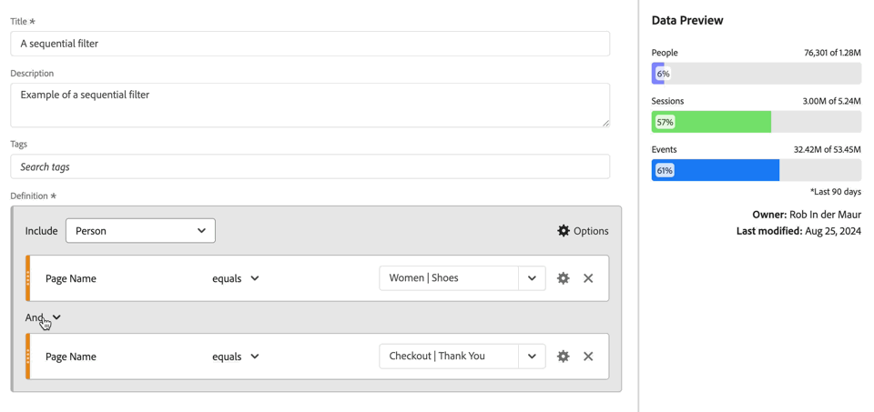
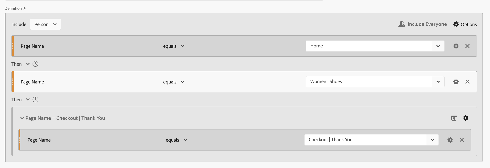
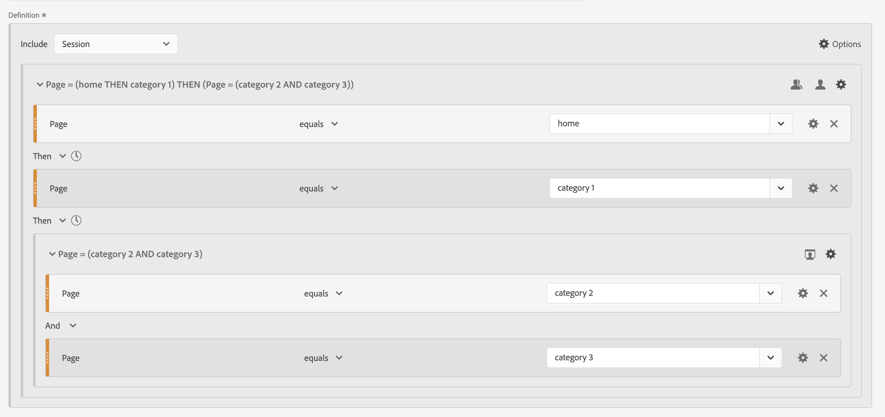
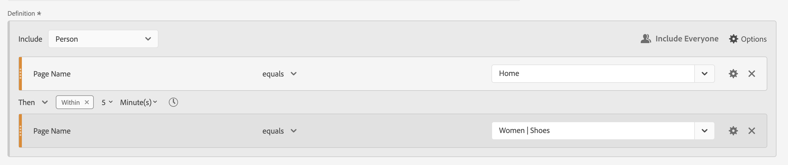
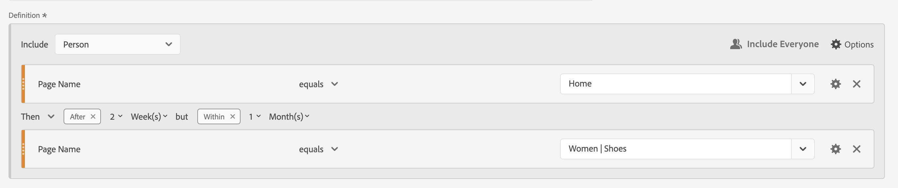
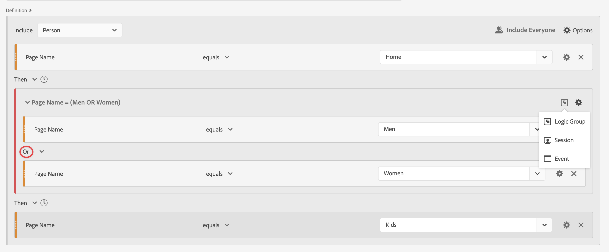
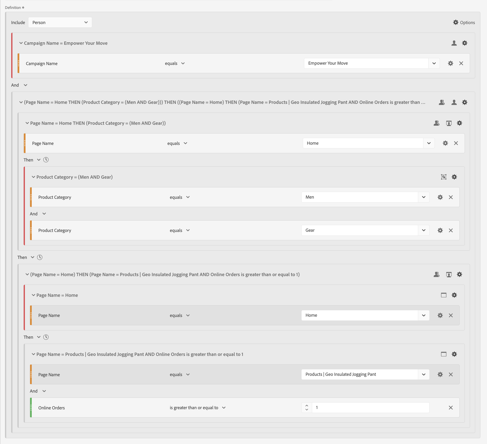

# 順次セグメント

コンポーネント、コンテナおよびコンポーネントまたはコンテナの間の [!UICONTROL Then] 論理演算子を使用して順次セグメントを作成します。 [!UICONTROL Then] 論理演算子は、セグメント条件が 1 つ、続いて別のセグメント条件が発生することを意味します。

>[!BEGINSHADEBOX]

デモビデオについては、 [ 順次セグメント化 ](https://video.tv.adobe.com/v/25405/?quality=12&learn=on){target="_blank"} を参照してください。

{{videoaa}}

>[!ENDSHADEBOX]

順次セグメントには、いくつかの [ 基本機能 ](#basics) と、順次セグメントにより多くの複雑さを追加するように設定できる追加のオプションがあります。

* シーケンスセグメント定義の Then ロジックの [After and within](#after-and-within) 制約：

* セグメント定義のシーケンス全体の一部として [ 含める ](#include) データ）。 コンテナの一部として定義されたシーケンスの場合は、または。 デフォルトでは、一致するすべてのデータが考慮されます。 そのデータは  [!UICONTROL Everyone を含める &#x200B;] で識別されます。

   * シーケンスの前のデータのみを考慮するには、「**[!UICONTROL シーケンスの前のみ]**」を選択します。
   * シーケンスの後のデータのみを考慮するには、「**[!UICONTROL Only After Sequence]**」を選択します。

* 順次セグメント定義の一部として [ 除外 ](#exclude) するデータ。

* 順次セグメント定義での条件の [ 論理的なグループ化 ](#logic-group) 方法。

## 基本

順次セグメントを作成する際の基本は、[ セグメントビルダー ](seg-builder.md) を使用して通常のセグメントを作成する場合と同じです。 [ 定義ビルダー ](seg-builder.md#definition-builder) を使用して、セグメント定義を作成できます。 この構成では、コンポーネント、コンテナ、演算子、ロジックを使用します。 通常のセグメントは、メイン定義または **[!UICONTROL 定義ビルダー]** 内で使用する任意のコンテナで [Then](seg-builder.md#definition-builder) 演算子を選択するとすぐに、順次セグメントになります。

### 例

以下の例は、様々なユースケースで順次セグメントを使用する方法を示しています。

#### 単純なシーケンス

ページを表示してから別のページを表示した人物を特定します。 イベントレベルのデータは、このシーケンスを使用してセグメント化されます。 前、過去、中間のユーザーのセッションや、セッション間で発生したページビューの時間や数には関係ありません。

#### セッション間のシーケンス

あるセッションでページを表示した後に別のセッションで別のページを表示したユーザーを識別します。 セッションを区別するには、コンテナを使用してシーケンスを作成し、コンテナごとに **[!UICONTROL セッション]** レベルを定義します。

#### 混合レベルシーケンス

特定されていないセッション数で 2 ページを閲覧したユーザーを特定してから、別のセッションで 3 ページ目を閲覧します。 この場合も、コンテナを使用してシーケンスを作成し、個別のセッションを定義するコンテナで  **[!UICONTROL セッション]** レベルを定義します。

#### 集計シーケンス

最初のセッションで特定のページにアクセスし、後で他のページにアクセスしたユーザーを特定します。 イベントのシーケンスを区別するには、コンテナを使用して **[!UICONTROL Session]** コンテナレベルでロジックを区切ります。

#### シーケンスをネスト

あるユーザーが別のページの前に訪問し、次に別の 2 ページを含むフォローアップセッションを行うすべてのセッションを特定します。 例えば、あるユーザーが最初にホームページを訪問したすべてのセッションを特定してから、カテゴリ 1 ページを訪問し、次に各セッションでカテゴリ 2 ページとカテゴリ 3 ページを訪問した他のセッションを識別します。

## [!UICONTROL After] and [!UICONTROL Within]

 演算子の **[!UICONTROL Clock]**  および **[!UICONTROL Clock]** **[!UICONTROL Within]** を使用して、追加の [ 時間制約 ](#time-constraints) または [ イベント、セッションまたはディメンションの制約 ](#event-session-and-dimension-constraints) を定義できます。

### 時間制約

**[!UICONTROL Then]** 演算子に時間制約を適用するには：

1.  を選択します。
1. コンテキストメニューから **[!UICONTROL Within]** または **[!UICONTROL After]** を選択します。
1. 期間（**[!UICONTROL 分]**、**[!UICONTROL 時間]** を **[!UICONTROL 年]**）まで指定します。
1.  **[!UICONTROL *number *]**&#x200B;を選択すると、**[!UICONTROL -]**&#x200B;または&#x200B;**[!UICONTROL +]**&#x200B;を使用して数値を入力または指定できるポップアップが開きます。

時間制約を削除するには、 を使用します。

時間制約演算子の詳細を次の表に示します。

| 演算子 | 説明 |
|--- |--- |
| **[!UICONTROL 後]** | [!UICONTROL After] 演算子は、2 つのチェックポイント間の時間の最小制限を指定するために使用されます。 「後」の値を設定すると、セグメントを適用した時点で制限時間が開始されます。 例えば、ページ A に訪問したユーザーを識別するコンテナに [!UICONTROL After] 演算子が設定されていて、1 日後までページ B に戻らない場合、訪問者がページ A を離れたところでその日が始まります。 訪問者をセグメントに含めるには、ページ A を離れた後、少なくとも 1440 分（1 日）経てページ B を表示する必要があります。 |
| **[!UICONTROL 内部]** | [!UICONTROL Within] 演算子は、2 つのチェックポイントの間隔の最大値を指定するために使用します。例えば、ページ A にアクセスしたユーザーを識別するコンテナに [!UICONTROL Within] 演算子が設定され、その後 1 日以内にページ B に戻った場合、その日はページ A を離れたところから始まります。セグメントに含める場合、ユーザーがページ B を開く前の最大時間は 1 日です。セグメントに含まれるユーザーの場合、ページ B を開くには、ページ A を離れてページ B を表示してから最大 1440 分（1 日）以内にページ B を開く必要があります。 |
| **[!UICONTROL 後だが中]** | [!UICONTROL After] 演算子と [!UICONTROL Within] 演算子の両方を使用する場合、両方の演算子は順番ではなく、並行して開始および終了します。   例えば、コンテナを `After = 1 Week(s) and Within = 2 Week(s)` に設定してセグメントを作成します。  このセグメントで訪問者を識別するための条件が満たされるのは、1 ～ 2 週間のみです。 どちらの条件も、最初のページビューの時点から適用されます。 |

#### 例

時間制約の使用例をいくつか示します。

##### [!UICONTROL After] 演算子

2 週間後にのみ、あるページを訪問したユーザーと別のページを訪問したユーザーを特定します。 例えば、ホームページを訪問した人は、女性は |靴ページは 2 週間後のみ。

ホームのページビューが 2024 年 6 月 1 日 00:01 に発生した場合、ページビューは Women に移動します | 2024 年 6 月 15 日（PT） 00:01 以降、ページビューが発生する限り、シューズは一致します。

##### [!UICONTROL Within] 演算子

5 分以内に、あるページを訪問したユーザーと別のページを訪問したユーザーを特定します。 例えば、ホームページにアクセスした訪問者が、次に女性ページにアクセスした訪問者です |5 分以内に靴ページ。

ホームのページビューが 2024 年 6 月 1 日 12:01 に発生した場合、ページビューは Women に移動します | 2024 年 6 月 15 日（PT） 12:16 より前にページビューが発生する限り、シューズは一致します。

##### [!UICONTROL After] but [!UICONTROL Within] 演算子

2 週間後から 1 か月以内に、あるページを訪問した後に別のページを訪問した人物を特定します。 例えば、ホームページにアクセスしてから 2 週間後、1 か月以内に女性を訪問した人物 |靴ページ。

2024 年 6 月 1 日にホームページにアクセスし、その女性を訪問するために戻っている人物 | 2019 年 6 月 15 日（PT）以降 00:01、ただし 2019 年 7 月 1 日（PT）より前のシューズページには該当するセグメントがあります。

### [!UICONTROL Event]、&lbrace;Session[!UICONTROL &#x200B; および &#x200B;]4&rbrace;Dimension[!UICONTROL &#x200B; の制約]

 **[!UICONTROL After]** 制約および  **[!UICONTROL Within]** 制約を使用すると、時間制約だけでなく、イベント、セッション、ディメンションの制約も指定できます。 「**[!UICONTROL イベント]**」、「**[!UICONTROL セッション]**」または「**[!UICONTROL その他のディメンション]** **[!UICONTROL *Dimension名&#x200B;*]**」を選択します。 「[!UICONTROL *検索*]」フィールドを使用して、ディメンションを検索できます。

#### 例

次に、1 つの製品カテゴリページ（女性）にアクセスした人物を検索する順次セグメントの例を示します |靴）、チェックアウトページ（チェックアウト） |ありがとうございました）を 1 ページに収めました。

次のシーケンス例は、一致するか一致しません。

| シーケンス |  |
|--- | :---: |
| ページ `Women \| Shoes` の後にページ `Checkout \| Thank You` |  |
| ページ `Women \| Shoes`、ページ `Women \| Tops`、ページ `Checkout \| Thank You` |  |

## [!UICONTROL 含める]

順次セグメントまたは順次セグメントの一部である順次コンテナに含めるデータを指定できます。

### [!UICONTROL &#x200B; 全員 &#x200B;] {#include_everyone}

全員を含む順次セグメントを作成するには、「**[!UICONTROL 全員を含める]** オプションを選択します。

順次セグメントは、全体として指定されたパターンに一致するデータを識別します。  以下は、1 つの製品カテゴリページ（女性）にアクセスした人を検索する基本的なシーケンスセグメントの例です |靴）、チェックアウトページ（チェックアウト） |ありがとうございました）。 セグメントは **[!UICONTROL Everyone を含める]** に設定されています。

次のシーケンス例は、一致するか一致しません。

| | シーケンス |  |
|---:|--- | --- |
| 1 | `Women \| Shoes` の後、同じセッションで `Checkout \| Thank You` |  |
| 2 | `Women \| Shoes` の後、`Men \| Shoes` の `Checkout \| Thank You` （異なるセッション間） |  |
| 3 | `Checkout \| Thank You`、`Women \| Shoes` |  |

### [!UICONTROL &#x200B; シーケンスの前のみ &#x200B;] および [!UICONTROL &#x200B; シーケンスの後のみ &#x200B;]

オプション **[!UICONTROL Only Before Sequence]** および **[!UICONTROL Only After Sequence]** は、指定したシーケンスの前または後にデータをサブセットにセグメント化します。

* **シーケンスの前のみ**：シーケンスの前のすべてのデータと、シーケンス自体の最初のデータを含みます。 シーケンスがデータの一部として複数回表示される場合、[!UICONTROL &#x200B; シーケンスの前のみ &#x200B;] には、シーケンスの最後の発生の最初のヒットとすべての前のヒットが含まれます。
* **Only After Sequence**：シーケンスとシーケンス自体の最後のデータの後のすべてのヒットを含みます。 シーケンスがデータの一部として複数回表示される場合、[!UICONTROL &#x200B; シーケンスの後にのみ &#x200B;] シーケンスの最初の発生の最後のヒットと、後続のすべてのヒットが含まれます。

B で識別される条件を持つコンポーネントのシーケンス、および D で識別される条件を持つコンポーネントの（Then）を指定する定義について考えてみます。3 つのオプションにより、データは次のように識別されます。

| B そして D | A | B | C | D | E | F |
|---|:---:|:---:|:---:|:---:|:---:|:---:|
| 全員を含む |  |  |  |  |  |  |
| シーケンスの前のみ |  |  |  |  |  |  |
| シーケンスの後のみ |  |  |  |  |  |  |

{style="table-layout:fixed"}

| B、D （複数回発生） | A | B | C | D | B | C | D | E |
|---|:---:|:---:|:---:|:---:|:---:|:---:|:---:|:---:|
| 全員を含む |  |  |  |  |  |  |  |  |
| シーケンスの前のみ |  |  |  |  |  |  |  |  |
| シーケンスの後のみ |  |  |  |  |  |  |  |  |

{style="table-layout:fixed"}

#### 例

サイトセクションに対して、3 つのバージョンの順次セグメントを定義しました。 オプション **[!UICONTROL Include Everyone]** を持つもの、オプション **[!UICONTROL Only Before Sequence]** を持つもの、オプション **[!UICONTROL Only After Sequence]** を持つもの。 3 つのセグメントに適切な名前を付けました。

これら 3 つのセグメントを使用してサイトセクションに関するレポートを作成する場合、フリーフォームテーブルの出力例は次のようになります。

## [!UICONTROL 除外]

セグメント定義には、 を使用して [!UICONTROL &#x200B; ユーザー &#x200B;]、[!UICONTROL &#x200B; 訪問 &#x200B;] または [!UICONTROL web ページ &#x200B;]&#x200B;**[!UICONTROL イベント]** データを特別に除外しない限り、すべてのデータが含まれます。

[!UICONTROL &#x200B; 除外 &#x200B;] を使用すると、一般的なデータを解除し、より焦点を当てたセグメントを作成できます。 除外を使用すると、特定の人物グループを除外するセグメントを作成することもできます。 例えば、注文した人物を指定するセグメントを定義し、そのグループを除外して *非購入者* を識別する場合などです。 ベストプラクティスは、特定の include 値に一致する特定のペルソナをターゲットに [!UICONTROL &#x200B; 除外 &#x200B;] を使用しようとするのではなく、幅広い定義を使用するルールを作成することです。

除外定義の例を次に示します。

* **ページの除外**。セグメント定義を使用して、レポートから特定のページ（*ホームページ* など）を除外し、ページが `Home Page` に等しいイベントルールを作成してから、ルールを除外します。 この定義には、「ホームページ *を除くすべてのページが自動的に含まれ* す。
* **参照ドメインの除外**。Google.comからの参照ドメインのみを含み、それ以外のドメインはすべて除外する定義を使用します。
* **非購入者の識別**。注文件数が 0 より大きい場合を識別し、[!UICONTROL &#x200B; 個人 &#x200B;] を除外します。

[!UICONTROL &#x200B; 除外 &#x200B;] を使用すると、ユーザーが特定のセッションに参加していない、または特定のイベントを実行していないシーケンスを識別できます。 [!UICONTROL &#x200B; 除外 &#x200B;] は、[!UICONTROL &#x200B; 論理グループ &#x200B;] に含めることもできます（以下を参照）。

コンテナは除外できますが、コンポーネントは除外できません。

### 例

[!UICONTROL &#x200B; 除外 &#x200B;] の使用例については、以下を参照してください。

#### [!UICONTROL &#x200B; 除外 &#x200B;] 内

あるページを訪問した人、別のページを訪問しなかった人、さらに別のページを訪問した人を特定します。  除外 [!UICONTROL &#x200B; を使用してコンテナを除外 &#x200B;] ます。 除外されたコンテナは、左側の薄い赤いバーで識別されます。

#### 開始時の [!UICONTROL &#x200B; 除外 &#x200B;]

別のページに移動せずに、あるページを訪問した人物を特定します。 例えば、これまでホームページを訪問したことがなく購入をチェックアウトした人などです。

#### 最後に [!UICONTROL &#x200B; 除外 &#x200B;]

あるページを訪問したが、他のページを訪問しなかった人物を特定します。 例えば、ホームページを訪問したが、チェックアウトページにはアクセスしなかったユーザーです。

## [!UICONTROL &#x200B; 論理グループ &#x200B;]

>[!NOTE]
>
>[!UICONTROL &#x200B; 論理グループ &#x200B;] は、順次セグメントでのみ定義できます。つまり、[!UICONTROL Then] 演算子がコンテナ内で使用されます。

論理グループを使用すると、条件を単一の順次セグメントチェックポイントにグループ化できます。シーケンスの一部として、論理グループとして識別されるコンテナ内で定義されるロジックは、先行する順次チェックポイントの後、後続する順次チェックポイントの前に評価されます。

論理グループ内の条件は、どのような順序でも満たすことができます。 これに対して、非順次コンテナ（イベント、セッション、人物）では、シーケンス全体で条件を満たす必要がないので、Then 演算子で使用すると直感的でない結果が生じる可能性があります。

[!UICONTROL &#x200B; 論理グループ &#x200B;] は、グループ化された条件の中で *複数の条件を、順序のないグループ* として扱うように設計されました。 それ以外の場合、論理グループ内の条件の順序は関係ありません。

論理グループを使用するためのベストプラクティスを次に示します。

* 順次チェックポイントをグループ化する。
* 順次セグメントの構成を簡単にする。

### 例

論理グループコンテナの使用例を以下に示します。

#### 任意の順序

あるページを訪問した人物を識別し、別のページのセットから各ページを任意の順序で表示しました。 例えば、ホームページを訪問した後、順序に関係なく、男性ページ、女性ページおよび子供ページを訪問したユーザーです。

[!UICONTROL &#x200B; 論理グループ &#x200B;] なしでこのセグメントを作成できますが、構築は複雑で面倒になります。 訪問者が表示できるページのシーケンスをすべて指定します。 わかりやすくするために、最初のコンテナのみ  開き、その他のコンテナは閉じます 。 他のコンテナの内容は、タイトルから導き出すことができます。

[!UICONTROL &#x200B; 論理グループ &#x200B;] を使用して、次に示すように、このセグメントの作成を簡略化できます。 コンテナには、必ず  **[!UICONTROL 論理グループ]** を選択します。

#### 最初の一致

あるページまたは別のページにアクセスしたユーザーを特定してから、さらに別のページにアクセスしたユーザーを特定します。 例えば、女性ページまたは男性ページにアクセスした後にチェックアウトにアクセスした人です |ありがとうページ。

#### [!UICONTROL Exclude][!UICONTROL And]

あるページを訪問したユーザーを識別し、他のページのセットには明示的に訪問しなかったが、さらに別のページには訪問したユーザーを識別します。 例えば、ホームページにアクセスしたユーザーは、男性ページや女性ページにはアクセスせず、子供ページにはアクセスしました。

#### [!UICONTROL Exclude][!UICONTROL Or]

あるページを訪問したユーザーを識別し、一連のページのどのページにも明示的に訪問しなかったが、さらに別のページにも訪問したユーザーを識別します。 例えば、ホームページにアクセスし、男性および女性ページにはアクセスせず、子供ページにはアクセスした人などです。

<!--
An example of a complex sequential segment if you want to find the persons that 

| Session One | Session Two | Session Three |
| --- | --- | --- |
| The person went to the main landing page A, excluded the campaign page B, and then viewed the Product page C.| The person again went to the main landing page A, excluded the campaign page B, and went again to the Product page C, and then to a new page D. | The person entered and followed that same path as in the first and second visits, then excluded page F to go directly to a targeted product on page G. |
-->

## 最後の例

最後の例として、特定の製品ページについて学習したユーザーを特定します。このユーザーが「あなたの力を与える」キャンペーンに影響を受けることはありません。 そして、あなたのオンラインストアへの彼らの最初の訪問では、ホームページを見ましたが、男性カテゴリからのフィットネス（ギア）製品についてはこれ以上見ませんでした。 しかし、その直後の次のセッションでは、製品ページに移動し、最初にホームページを経由せずにオンライン注文を行いました。

