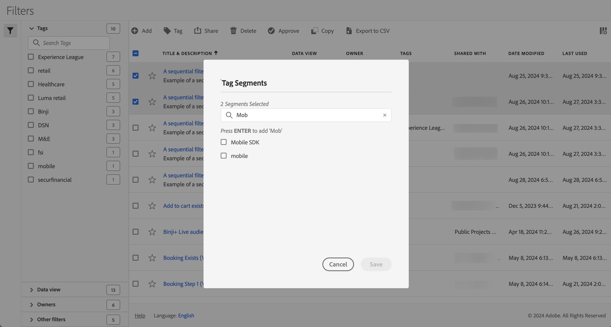

# セグメントのタグ設定

[&#x200B; セグメントマネージャー &#x200B;](seg-manage.md) では、タグを使用してセグメントを整理できます。 管理者はすべてのセグメントにタグを付けることができます。 管理者以外のユーザーは、自分が作成したセグメントまたは共有されているセグメントにのみタグを付けることができます。

1 つ以上のセグメントにタグを付けるには：

1. [&#x200B; セグメントマネージャー &#x200B;](seg-manage.md) で、タグ付けするセグメントを 1 つ以上選択します。
1. アクションバーから、「 **[!UICONTROL タグ]**」を選択します。
1. **[!UICONTROL セグメントをタグ付け]** ダイアログで、次の手順を実行します。

   

   1. （オプション）  を使用して、タグのリストを検索および制限します。

   2. タグのリストに基づく：

      * リストから 1 つ以上の既存のタグを選択する。または
      * 新しいタグを入力し、**[!UICONTROL Enter]** キーを押します。 繰り返して、複数の新しいタグを追加します。

1. 「**[!UICONTROL 保存]**」を選択して、セグメントのタグを保存します。 「**[!UICONTROL キャンセル]**」を選択すると、キャンセルします。

保存すると、タグは [!UICONTROL &#x200B; セグメントビルダー &#x200B;] で選択したセグメントの「[&#x200B; タグ &#x200B;](seg-builder.md)」フィールドにリストされます。

## 候補

以下に、に基づいてタグを整理する推奨事項を示します。

* **チーム**：ソーシャルマーケティング、モバイルマーケティングなど。

* **プロジェクト**：例：入口ページ分析。

* **カテゴリ**:. 例えば、男性、女性、子供。

* **Geography**：例：米国、カリフォルニア州。

* **ワークフロー**：例：承認を受ける、キュレーション済み

