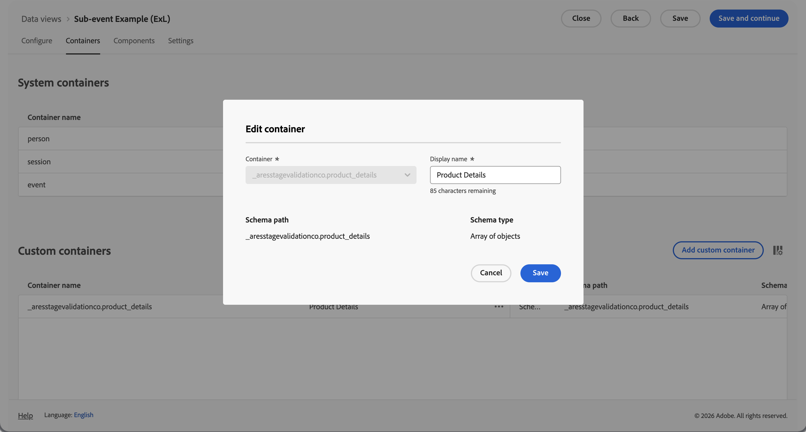

# サブイベント分析

{{release-limited-testing}}

サブイベント分析では、イベントレベルよりも詳細なレベルでイベントデータを分析できます。 イベント全体をフィルタリングするのではなく、イベント内の個々のコンテナでセグメント化できます。 例：

* 同じ順序で購入された他のすべての製品を含めずに、特定の製品カテゴリでセグメンテーションする。
* Content Analytics データ内の特定のアセットカテゴリに関するセグメンテーション。
* Media Analytics データ内の特定のメディアチャネルでのセグメンテーション。

Customer Journey Analyticsでは、サブイベント分析を使用するデータビュー内のコンテナを定義します。 サブイベント分析を使用しない場合、コンテナアイテム属性に対するセグメント化では、定義したイベント、セッション、人物、（グローバル）アカウント [!BADGE B2B edition]{type=Informative url="https://experienceleague.adobe.com/ja/docs/analytics-platform/using/cja-overview/cja-b2b/cja-b2b-edition" newtab=true tooltip="Customer Journey Analytics B2B Edition"}、購買グループ [!BADGE B2B edition]{type=Informative url="https://experienceleague.adobe.com/ja/docs/analytics-platform/using/cja-overview/cja-b2b/cja-b2b-edition" newtab=true tooltip="Customer Journey Analytics B2B Edition"}、商談[!BADGE B2B edition]{type=Informative url="https://experienceleague.adobe.com/ja/docs/analytics-platform/using/cja-overview/cja-b2b/cja-b2b-edition" newtab=true tooltip="Customer Journey Analytics B2B Edition"}、またはその他[ コンテナ ](/help/data-views/create-dataview.md#containers-1)がすべて返されます。 その結果、アトリビューションが誤り、収益指標が高騰してしまいます。 サブイベント分析では、フィルターをイベント内の個々のコンテナ行にスコープ付けし、これらの問題を解決します。

サブイベント分析では、除外ロジックは、コンテナに対する標準のイベントレベルの除外とは異なる動作をします。 コンテナ内で項目属性を除外すると、セグメントは、コンテナ内に&#x200B;**項目**&#x200B;を持つが、除外条件に一致しないイベントを返します。 セグメントは、項目がまったく含まれていないイベントを返しません。

## 例

プロフェッショナルスーツのカテゴリーのみの売上を測定したい場合。 サブイベント分析を使用しない場合、プロフェッショナルスーツのセグメントを適用すると、プロフェッショナルスーツのカテゴリを持つ製品が少なくとも1つ含まれている注文（イベント）の各製品からの収益が含まれます。 サブイベント分析では、フィルターを製品レベルにスコーピングし、プロフェッショナルスーツ カテゴリの製品に対してのみ収益を返します。

また、プロフェッショナルスーツのカテゴリーを除く、他のすべてのカテゴリーからのオンライン売上も測定する必要があります。

>[!BEGINTABS]

>[!TAB  イベント分析]

セグメンテーションビルダーで、または&#x200B;**[!UICONTROL クイックセグメント]**&#x200B;の一部として、**[!UICONTROL イベント]** コンテナで&#x200B;**[!UICONTROL Dimension]** **[!UICONTROL product_category]** **[!UICONTROL equals]** **[!UICONTROL Professional Suits]**&#x200B;を&#x200B;**[!UICONTROL Include]**&#x200B;に指定します。

その結果、少なくとも1つの&#x200B;**[!UICONTROL Professional Suits]** **[!UICONTROL product_category]**&#x200B;を含むすべての注文が考慮され、これらの注文の他の製品からの収益は&#x200B;**[!UICONTROL 収益]**指標に含まれます。
カテゴリについて報告すると、**[!UICONTROL 専門訴訟]** **[!UICONTROL product_category]**&#x200B;の製品を含む注文の一部である&#x200B;**[!UICONTROL product_category]**&#x200B;の他のすべての値が報告されます。

>[!TAB  サブイベント分析]

製品のサブイベント分析を目的として、データビューで&#x200B;**[!UICONTROL 製品詳細]** [ カスタムコンテナ ](/help/data-views/create-dataview.md#containers)を定義しました。

セグメンテーションビルダーで、または&#x200B;**[!UICONTROL クイックセグメント]**&#x200B;の一部として、**[!UICONTROL 商品の詳細]** コンテナの&#x200B;**[!UICONTROL Dimension]** **[!UICONTROL product_category]** **[!UICONTROL equals]** **[!UICONTROL Professional Suits]**&#x200B;を&#x200B;**[!UICONTROL Include]**&#x200B;に指定します。

その結果、少なくとも&#x200B;**[!UICONTROL プロフェッショナルスーツ]** **[!UICONTROL product_category]**&#x200B;を含むすべての注文が考慮され、**[!UICONTROL 収益]**&#x200B;指標には&#x200B;**[!UICONTROL プロフェッショナルスーツ]** **[!UICONTROL product_categorey]**に属する製品の収益のみが含まれます。
カテゴリについて報告する場合、**[!UICONTROL 専門訴訟]** **[!UICONTROL product_category]**&#x200B;のみが報告されます。

>[!TAB  サブイベント分析（除外） ]

製品のサブイベント分析を目的として、データビューで&#x200B;**[!UICONTROL 製品詳細]** [ カスタムコンテナ ](/help/data-views/create-dataview.md#containers)を定義しました。

セグメンテーションビルダーで、または&#x200B;**[!UICONTROL クイックセグメント]**&#x200B;の一部として、**[!UICONTROL 商品詳細]** コンテナで&#x200B;**[!UICONTROL Dimension]** **[!UICONTROL product_category]** **[!UICONTROL equals]** **[!UICONTROL Professional Suits]**&#x200B;を&#x200B;**[!UICONTROL Exclude]**&#x200B;に指定します。

製品レベルで除外するには、少なくとも1つの製品を含むイベントが含まれ、そのスコープ内でサブイベントレベルの除外が適用されます。 この除外は、イベント全体を除外するイベントレベルの除外とは異なります。

>[!ENDTABS]
