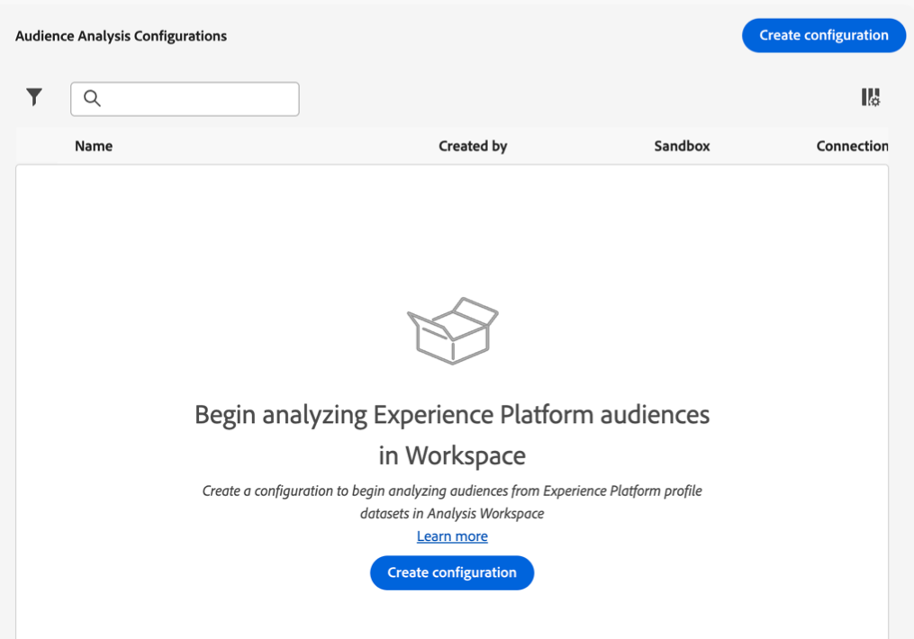
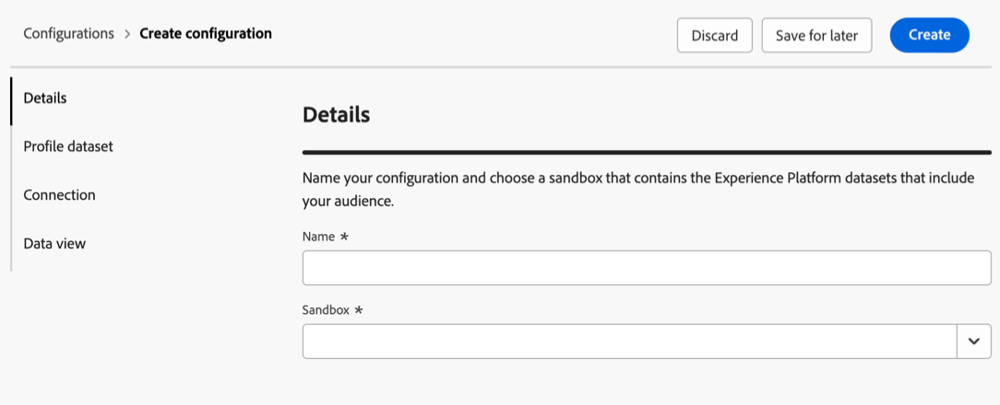
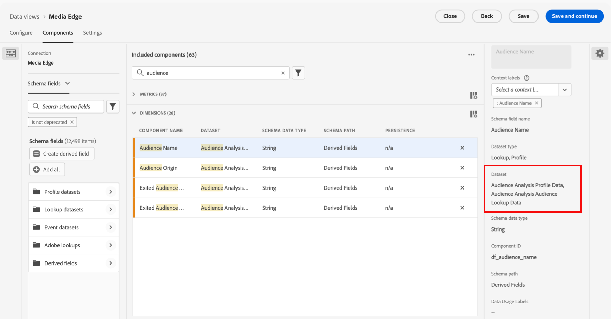

# オーディエンス分析の設定 {#configure-audience-analysis}

<!-- markdownlint-disable MD034 -->

>[!CONTEXTUALHELP]
>id="cja-audience-analysis-merge-policy"
>title="結合ポリシー"
>abstract="結合ポリシーは、複数のデータセットのプロファイルデータを、オーディエンスの作成に使用する統合顧客プロファイルに組み合わせます。 複数の結合ポリシーが表示されていて、どちらを選択すればよいかわからない場合は、「デフォルトの時間ベース」を選択します。 または、データチームに問い合わせて、各結合ポリシーに関連付けられているオーディエンスを確認します。"

<!-- markdownlint-enable MD034 -->

<!-- markdownlint-disable MD034 -->

>[!CONTEXTUALHELP]
>id="cja-audience-analysis-sandbox"
>title="サンドボックス"
>abstract="正しい Experience Platform プロファイルデータセットを含んだサンドボックスを選択します。 これらのデータセットには、Analysis Workspace でレポートするオーディエンスデータを含める必要があります。 "

<!-- markdownlint-enable MD034 -->

<!-- markdownlint-disable MD034 -->

>[!CONTEXTUALHELP]
>id="cja-audience-person-id"
>title="ユーザー ID"
>abstract="スキーマから、ユーザー ID を表すフィールドを選択します。 選択は、スキーマ内の、ID としてマークされ、ID 名前空間を持つフィールドのリストに制限されます。"

<!-- markdownlint-enable MD034 -->

<!-- markdownlint-disable MD034 -->

>[!CONTEXTUALHELP]
>id="cja-audience-namespace"
>title="プライマリ ID 名前空間を使用"
>abstract="Customer Journey Analytics で、primary=true 属性でマークされた ID マップ内の ID を検索し、その行のユーザー ID として使用する場合は、このオプションを有効にします。 この ID は、Experience Platform でパーティション分割に使用するプライマリキーです。  このオプションを無効のままにする場合は、下の ID 名前空間フィールドから名前空間を選択します。 Customer Journey Analytics は各行の ID マップでこの名前空間キーを検索し、その名前空間の ID をその行のユーザー ID として使用します。"

<!-- markdownlint-enable MD034 -->

Audience Analysisを使用すると、Experience Platform プロファイルデータセットからCustomer Journey Analytics接続にオーディエンスメンバーシップデータを取り込むことができます。 オーディエンスは、Analysis Workspaceで使用する新しいディメンションとして利用できるようになります。 オーディエンス分析について詳しくは、[&#x200B; オーディエンス分析の概要](/help/connections/audience-analysis/audience-analysis-overview.md)を参照してください。

>[!IMPORTANT]
>
>オーディエンスデータは毎晩再処理および生成され、前日（「昨日」）のみ分析できる正確なオーディエンスデータになります。
>
>オーディエンスは、audience analysis設定を作成した翌日にCustomer Journey Analytics データビューで使用できます。

## オーディエンス分析設定の作成

オーディエンス分析設定を作成する際に、分析するExperience Platform オーディエンスに関連付けられているサンドボックスと結合ポリシーを選択します。 Customer Journey Analyticsは新しいルックアップデータセットを作成し、選択した接続にルックアップデータセットとプロファイルデータセットを自動的に追加します。

オーディエンス分析設定を作成できるのはシステム管理者のみです。

オーディエンス分析設定を作成するには：

1. Customer Journey Analyticsで、**[!UICONTROL Data Management]** > **[!UICONTROL Audience analysis configuration]**&#x200B;を選択します。

   

1. 「**[!UICONTROL 設定を作成]**」を選択します。

   

1. 「**[!UICONTROL 詳細]**」セクションで、次の情報を指定します。

   | フィールド | 説明 |
   |---------|----------|
   | **[!UICONTROL 名前]** | 設定の名前を指定します。 |
   | **[!UICONTROL サンドボックス]** | 接続に追加するプロファイルデータセットを含むExperience Platform サンドボックスを選択します。 1つのサンドボックスで最大100個のオーディエンス分析設定をサポートできます。 
Adobe Experience Platform は、単一の Platform インスタンスを別々の仮想環境に分割して、デジタルエクスペリエンスアプリケーションの開発と発展を支援する仮想[サンドボックス](https://experienceleague.adobe.com/ja/docs/experience-platform/sandbox/home)を提供します。 サンドボックスは、データセットを含む「データサイロ」と考えることができます。 サンドボックスは、データセットへのアクセスを制御するために使用します。
 |

1. 「**[!UICONTROL プロファイルデータセット]**」セクションで、次の情報を指定します。

   | フィールド | 説明 |
   |---------|----------|
   | **[!UICONTROL 結合ポリシー]** | オーディエンス分析に使用するプロファイルデータセットに対応する、結合ポリシーを選択します。 
結合ポリシーは、Adobe Experience Platformが複数のデータセットからのプロファイルデータを、オーディエンス作成に使用される統合顧客プロファイルにどのように組み合わせるかを決定します。 選択した結合ポリシーは、オーディエンスに含まれるプロファイルの属性に影響します。 毎日、このデータのスナップショットがExperience Platformで生成されます。 このスナップショットは、特定の時点のデータの静的ビューを提供します。イベントデータは含まれません。

複数の結合ポリシーが表示されていて、どの結合ポリシーを選択すべきかわからない場合は、**[!UICONTROL デフォルトのタイムベース]**&#x200B;結合ポリシーを選択します。 また、データチームに相談して、各結合ポリシーに関連付けられているオーディエンスをより詳細に把握することもできます。
 |
   | **[!UICONTROL プロファイルデータセット]** | 選択した結合ポリシーに関連付けられているプロファイルデータセット。 このプロファイルデータセットには、分析するExperience Platform オーディエンスデータが含まれています。 このプロファイルデータセットは、選択した接続に追加されます。
結合ポリシーを選択すると、プロファイル スナップショットの書き出しが表示されます。 例：`Profile-Snapshot-Export-abbc7093-80f4-4b49-b96e-e743397d763f`。

詳しくは、Experience Platform ダッシュボードガイドの[&#x200B; プロファイル属性データセット &#x200B;](https://experienceleague.adobe.com/ja/docs/experience-platform/dashboards/query#profile-attribute-datasets)を参照してください。
 |

1. **[!UICONTROL 接続]** セクションで、**[!UICONTROL 接続を選択]**&#x200B;をクリックします。

1. 接続ダイアログで、プロファイルデータセットを追加する接続の横にあるチェックボックスを選択し、**[!UICONTROL 接続を使用]**&#x200B;を選択します。

   1つの接続は、1つのオーディエンス分析設定にのみ関連付けることができます。

1. 接続を設定するには、次の情報を指定します。

   | フィールド | 説明 |
   |---------|----------|
   | **[!UICONTROL ユーザー ID]** | スキーマから、ユーザー ID を表すフィールドを選択します。
選択は、IDとしてマークされ、ID名前空間を持つスキーマ内のフィールドのリストに限定されます。 **[!UICONTROL IdentityMap]**&#x200B;はデフォルトで選択されており、ほとんどの設定に適しています。 

選択する人物IDがない場合は、スキーマで1つ以上の人物IDが定義されていないことを意味します。 詳しくは、[UI で ID フィールドを定義](https://experienceleague.adobe.com/ja/docs/experience-platform/xdm/ui/fields/identity)を参照してください。
 |
   | **[!UICONTROL プライマリ ID名前空間を使用]** | このオプションは、人物IDに「**[!UICONTROL ID マップ]**」を選択した場合に表示されます。 
Customer Journey Analytics で、primary=true 属性でマークされた ID マップ内の ID を検索し、その行のユーザー ID として使用する場合は、このオプションを有効にします。 この ID は、Experience Platform でパーティション分割に使用するプライマリキーです。 また、この ID は、Customer Journey Analytics のユーザー ID として使用する主な候補でもあります（Customer Journey Analytics 接続でのデータセットの設定方法に応じて異なります）。
 |
   | **[!UICONTROL ID 名前空間]** | このオプションは、人物IDに「**[!UICONTROL ID マップ]**」を選択した場合に表示されます。 プライマリ ID名前空間を使用する場合、このオプションは無効になります。 
ID 名前空間は、[Experience Platform ID サービス](https://experienceleague.adobe.com/ja/docs/experience-platform/identity/features/namespaces)のコンポーネントです。 名前空間は、ID が関連付けられているコンテキストを示します。 名前空間を指定すると、Customer Journey Analyticsは、各行のID マップでこの名前空間キーを検索し、その名前空間のIDをその行の人物IDとして使用します。 Customer Journey Analyticsでは、すべての行に対して完全なデータセットスキャンを実行して、どの名前空間が存在するかを判断することはできないので、使用可能なすべての名前空間がドロップダウンメニューに表示されます。 データ内で指定されている名前空間を把握しておく必要があります。これらの名前空間は自動検出されません。
 |

   <!-- Add this when B2B releases for AuA **[!UICONTROL Account ID]** [!BADGE B2B Edition]{type=Informative url="https://experienceleague.adobe.com/ja/docs/analytics-platform/using/cja-overview/cja-b2b/cja-b2b-edition" newtab=true tooltip="Customer Journey Analytics B2B Edition"}|  (only displayed for account-based connections) The Account ID that is used to support account-based reporting for the dataset. -->

1. **[!UICONTROL データビュー]** セクションで、**[!UICONTROL データビューを選択]**&#x200B;をクリックします。

1. データビューダイアログで、Analysis Workspace内でExperience Platform オーディエンスデータを分析する際に使用する1つ以上のデータビューの横にあるチェックボックスをオンにします。 これらのデータビューは、レポート用にExperience Platformオーディエンスデータで自動的に設定されます。

1. 「**[!UICONTROL データビューを使用]**」を選択します。

1. **[!UICONTROL 作成]**&#x200B;を選択して、設定を作成します。

   >[!IMPORTANT]
   >
   >プロファイルデータセットは1日に1回更新されるので、オーディエンス分析コンフィギュレーションを作成した翌日に、Customer Journey Analytics データビューでオーディエンスを使用できます。

1. 24時間後、[&#x200B; オーディエンスディメンションをデータビューで表示](#view-audience-dimensions-in-the-data-view)し、選択したデータビューでオーディエンスディメンションが使用可能であることを確認します。

## データビューでのオーディエンスディメンションの表示

オーディエンス分析設定[&#128279;](#create-an-audience-analysis-configuration)を作成した後、設定中に選択したデータビューにオーディエンスディメンションが追加されたことを確認できます。

データビューでオーディエンスディメンションを表示するには、データビューが割り当てられている製品プロファイルの製品プロファイル管理者である必要があります。 詳しくは、[&#x200B; アクセス制御](/help/technotes/access-control.md)を参照してください。

データビューでオーディエンス分析ディメンションを表示するには：

1. Customer Journey Analytics で、**[!UICONTROL データ管理]**／**[!UICONTROL データビュー]**&#x200B;を選択します。

1. 「**[!UICONTROL ディメンション]**」セクションで、次のディメンションを使用できるようになりました。

   * **[!UICONTROL オーディエンス名]**

   * **[!UICONTROL オーディエンスの生成元]**

   * **[!UICONTROL オーディエンスの生成元]**&#x200B;を終了しました

   * **[!UICONTROL オーディエンス名]**&#x200B;を終了しました

   これらのディメンションはそれぞれ、オーディエンス分析の設定中に選択した結合ポリシーに関連付けられたプロファイルデータセットに追加され、作成された新しいルックアップデータセットに追加されたことに注意してください。

   データビューで利用可能な

1. Analysis Workspaceのオーディエンス分析ディメンションを使用します。

   Analysis Workspaceのデータビューを使用するアクセス権を持つユーザーは、新しいディメンションを表示し、分析で使用できるようになりました。 Analysis Workspaceでオーディエンス分析ディメンションを使用する方法について詳しくは、[Customer Journey AnalyticsでのExperience Platform オーディエンスの分析](/help/connections/audience-analysis/analyze-audiences.md)を参照してください。
