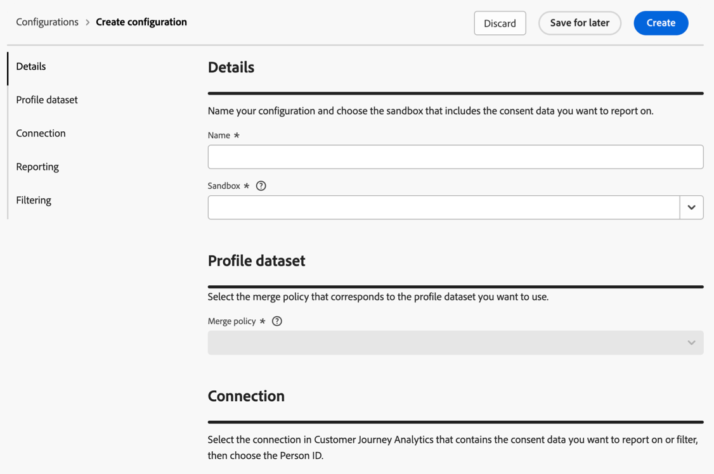

# 同意に関するレポートとフィルタリングの設定 {#configure-consent-reporting}

<!-- markdownlint-disable MD034 -->

>[!CONTEXTUALHELP]
>id="cja-consent-merge-policy"
>title="結合ポリシー"
>abstract="結合ポリシーは、複数のデータセットのプロファイルデータを、オーディエンスの作成に使用する統合顧客プロファイルに組み合わせます。 レポートする同意ポリシーメンバーシップデータ（`consentPoliciesIDMap` フィールド）を含むプロファイルデータセットに対応する結合ポリシーを選択します。 または、データチームに問い合わせて、各結合ポリシーに関連付けられているオーディエンスを確認します。"

<!-- markdownlint-enable MD034 -->

<!-- markdownlint-disable MD034 -->

>[!CONTEXTUALHELP]
>id="cja-consent-sandbox"
>title="サンドボックス"
>abstract="正しい Adobe Experience Platform プロファイルデータセットを含むサンドボックスを選択します。 これらのデータセットには、Analysis Workspaceでレポートする同意データが含まれている必要があります。"

<!-- markdownlint-enable MD034 -->

<!-- markdownlint-disable MD034 -->

>[!CONTEXTUALHELP]
>id="cja-consent-person-id"
>title="ユーザー ID"
>abstract="人物IDを表すモデルベースのスキーマからフィールドを選択します。 選択は、「ID」としてマークされ、ID名前空間を持つスキーマ内のフィールドのリストに制限されます。"

<!-- markdownlint-enable MD034 -->

<!-- markdownlint-disable MD034 -->

>[!CONTEXTUALHELP]
>id="cja-consent-identity-namespace"
>title="プライマリ ID 名前空間を使用"
>abstract="primary=true属性でマークされたID マップ内のIDをCustomer Journey Analyticsで検索し、そのIDをその行の人物IDとして使用する場合は、このオプションを有効にします。 この ID は、Adobe Experience Platform でのパーティション分割に使用されるプライマリキーです。  このオプションを無効のままにする場合は、下の ID 名前空間フィールドから名前空間を選択します。 Customer Journey Analytics は各行の ID マップでこの名前空間キーを検索し、その名前空間の ID をその行のユーザー ID として使用します。"

<!-- markdownlint-enable MD034 -->

<!-- markdownlint-disable MD034 -->

>[!CONTEXTUALHELP]
>id="cja-consent-enable-reporting"
>title="レポートを有効にする"
>abstract="Analysis Workspaceを使用して、接続で使用可能な同意データをレポートするには、このオプションを有効にします。 同意ポリシーのディメンションと指標は、選択したデータビューに追加されます。"

<!-- markdownlint-enable MD034 -->

<!-- markdownlint-disable MD034 -->

>[!CONTEXTUALHELP]
>id="cja-consent-enable-filtering"
>title="フィルタリングを有効にする"
>abstract="同意しない訪問者データをCustomer Journey Analyticsに取り込むのを除外するには、このオプションを有効にします。 有効にすると、訪問者のデータは、訪問者が以下で有効なすべての同意ポリシーに一致する場合にのみ取り込まれます。  このオプションは、取り込み時に同意しない訪問者データを除外する要件を持つ組織を対象としています。"

<!-- markdownlint-enable MD034 -->

システム管理者は、1つ以上の接続に対して、同意レポートおよびオプションで同意フィルタリングを有効にできます。 概要情報については、[同意レポートとフィルタリングの概要](/help/connections/consent-reporting-filtering/consent-overview.md)を参照してください。

>[!IMPORTANT]
>
>同意フィルタリングは、取り込み時に同意しない訪問者データを除外します。 フィルタリングによって除外されたデータはCustomer Journey Analyticsに保存されないため、過去の日付に対して復元できません。 フィルタリングを有効にする前に、マーケティングアクションの選択を注意深く確認してください。

## 設定の作成

同意レポートとフィルタリング用の設定を作成する場合、同意ポリシーメンバーシップデータを含むサンドボックスと結合ポリシーを選択し、設定する接続または接続を選択し、各マーケティングアクションのデータをフィルタリングするかどうかを選択します。 次に、Customer Journey Analyticsは同意ポリシー検索データセットと同意ポリシーコンポーネントを自動的に作成します。

同意レポートとフィルタリング設定を作成するには：

1. Customer Journey Analyticsで、**[!UICONTROL Data Management]** > **[!UICONTROL 同意レポートとフィルタリング]**&#x200B;を選択します。

1. 「**[!UICONTROL 設定を作成]**」を選択します。

   

1. 「**[!UICONTROL 詳細]**」セクションで、次の情報を指定します。

   | フィールド | 説明 |
   |---------|----------|
   | **[!UICONTROL 名前]** | 設定の名前を指定します。 |
   | **[!UICONTROL サンドボックス]** | プロファイルデータセットと同意ポリシーメンバーシップデータを含むExperience Platform サンドボックスを選択します。 
サンドボックスごとに最大1つの同意ポリシー検索データセットが存在します。 同じサンドボックス内の複数の設定が、同じルックアップデータセットを共有します。
 |

1. **[!UICONTROL プロファイルデータセット]** セクションの&#x200B;**[!UICONTROL 結合ポリシー]** フィールドで、レポート対象の同意ポリシーメンバーシップデータ（`consentPoliciesIDMap` フィールド）を含むプロファイルデータセットに対応する結合ポリシーを選択します。 同意レポートを有効にすると、このプロファイルデータセットが、まだ一部ではない場合に選択した接続に追加されます。
結合ポリシーは、Adobe Experience Platformが複数のデータセットからのプロファイルデータを、同意ポリシーメンバーシップデータに使用される統合顧客プロファイルにどのように組み合わせるかを決定します。 毎日、このデータのスナップショットがExperience Platformで生成されます。 このスナップショットは、特定の時点のデータの静的ビューを提供します。イベントデータは含まれません。

複数の結合ポリシーが表示されていて、どの結合ポリシーを選択すべきかわからない場合は、**[!UICONTROL デフォルトのタイムベース]**&#x200B;結合ポリシーを選択します。 また、データチームに相談して、各結合ポリシーに関連付けられている同意データをより詳細に把握することもできます。

1. **[!UICONTROL 接続]** セクションで、**[!UICONTROL 接続を選択]**&#x200B;し、設定する接続の横にあるチェックボックスを選択してから、**[!UICONTROL 接続を使用]**&#x200B;を選択します。

   同意レポートとフィルタリングは接続レベルで適用されます。 設定された接続のすべてのデータビューは、同じ動作を継承します。

1. **[!UICONTROL 人物ID]** フィールドで、人物IDを表すモデルベースのスキーマからフィールドを選択します。 選択は、「ID」としてマークされ、ID名前空間を持つスキーマ内のフィールドのリストに制限されます。

1. 同意データのレポートを有効にするかどうかを選択します。

   レポートを有効にするタイミングについて詳しくは、[同意レポートとフィルタリング &#x200B;](/help/connections/consent-reporting-filtering/consent-overview.md#consent-reporting-vs-filtering)を参照してください。

   レポートを有効にして設定するには：

   1. 「**[!UICONTROL レポート]**」セクションで、「**[!UICONTROL レポートを有効にする]**」を選択します。

   1. Analysis Workspace 内で Platform 同意データを分析する際に使用する、接続に関連付けられた任意のデータビューを選択します。 **[!UICONTROL データビュー]** セクションで、**[!UICONTROL データビューを選択]**&#x200B;をクリックします。

   1. データビューダイアログで、同意レポートに使用する1つ以上のデータビューの横にあるチェックボックスを選択します。 これらのデータビューは、レポート用にExperience Platformの同意データで自動的に設定されます。

   1. 「**[!UICONTROL データビューを使用]**」を選択します。

1. 取り込み時に同意しない訪問者を除外するフィルタリングを有効にするかどうかを選択します。

   フィルタリングが有効になっている場合、Customer Journey Analyticsは、訪問者が有効なすべての同意ポリシーに一致する場合にのみ、訪問者のデータを取り込みます。

   フィルタリングを有効にするタイミングについて詳しくは、[同意レポートとフィルタリング &#x200B;](/help/connections/consent-reporting-filtering/consent-overview.md#consent-reporting-vs-filtering)を参照してください。

   フィルタリングを有効にして設定するには：

   1. 「**[!UICONTROL フィルタリング]**」セクションで、「**[!UICONTROL フィルタリングを有効にする]**」を選択して、同意データをフィルタリングします。

   1. 次のマーケティングアクションの1つまたは両方のフィルタリングを有効にします。

      >[!NOTE]
      >
      >マーケティングアクションのフィルタリングが有効になっている場合、Customer Journey Analyticsは、訪問者がそのマーケティングアクションに適用される&#x200B;**all**&#x200B;同意ポリシーに一致する場合にのみ、訪問者のデータを取り込みます。 詳しくは、[同意レポートとフィルタリングの概要](/help/connections/consent-reporting-filtering/consent-overview.md)の[同意フィルタリング &#x200B;](/help/connections/consent-reporting-filtering/consent-overview.md#consent-filtering)を参照してください。

      マーケティングアクションは、Experience Platformで設定したデータ使用ラベルとポリシーに関連付けられます。 詳しくは、[&#x200B; ラベル、ポリシー、およびマーケティングアクション &#x200B;](/help/data-views/data-governance.md)を参照してください。

      | マーケティングアクション | 説明 |
      | --------- | ---------- |
      | **[!UICONTROL Analytics データ]** | Analysis Workspaceの標準Customer Journey Analytics レポートに使用されるフィルターデータ。 |
      | **[!UICONTROL データサイエンスデータ]** | 高度な分析、マシンラーニング、データサイエンスのユースケースに使用されるデータをフィルタリングします。 |

1. **[!UICONTROL 作成]**&#x200B;を選択して、設定を作成します。

   レポートを有効にすると、Customer Journey Analyticsは自動的に次の操作を行います。

   * 選択したプロファイルデータセットを接続に追加します。
   * サンドボックスの同意ポリシー参照データセットを作成し（サンドボックスが存在しない場合）、Experience Platformからポリシー名と説明を同期します。
   * 設定された接続内のデータビューに、同意ポリシーコンポーネント（ディメンション、指標、派生フィールド）を追加します。

1. 設定が完了したら、[同意ポリシーコンポーネントをデータビュー](#view-consent-policy-components-in-the-data-view)で表示して、使用可能であることを確認します。

## データビューでの同意ポリシーコンポーネントの表示

[設定を作成した後](#create-a-configuration)、設定された接続の下のデータビューに同意ポリシーコンポーネントが追加されたことを確認できます。

データビューで同意ポリシーコンポーネントを表示するには、データビューが割り当てられている製品プロファイルの製品プロファイル管理者である必要があります。 詳しくは、[&#x200B; アクセス制御](/help/technotes/access-control.md)を参照してください。

データビューで同意ポリシーコンポーネントを表示するには：

1. Customer Journey Analytics で、**[!UICONTROL データ管理]**／**[!UICONTROL データビュー]**&#x200B;を選択します。

1. 設定された接続に関連付けられているデータビューを開きます。

1. 「**[!UICONTROL ディメンション]**」セクションで、次のディメンションを使用できるようになりました。

   * **[!UICONTROL 同意ポリシーID]**

   * **[!UICONTROL ポリシー名]**

   * **[!UICONTROL ポリシーの説明]**

1. **[!UICONTROL 指標]** セクションで、次の指標を使用できるようになりました。

   * **[!UICONTROL 同意を得た訪問者]**

   * **[!UICONTROL 同意を得たイベント]**

   * **[!UICONTROL 一意の同意ポリシー]**

   <!-- TODO: Add a screenshot of the consent policy components in the data view (assets/consent-components-dataview.png). -->

1. Analysis Workspaceの同意ポリシーコンポーネントを使用します。

   Analysis Workspaceのデータビューにアクセスできるユーザーは、新しいコンポーネントを表示し、分析で使用できるようになりました。 Analysis Workspaceで同意ポリシーコンポーネントを使用する方法について詳しくは、[同意ポリシーデータの分析](/help/connections/consent-reporting-filtering/consent-analyze.md)を参照してください。
