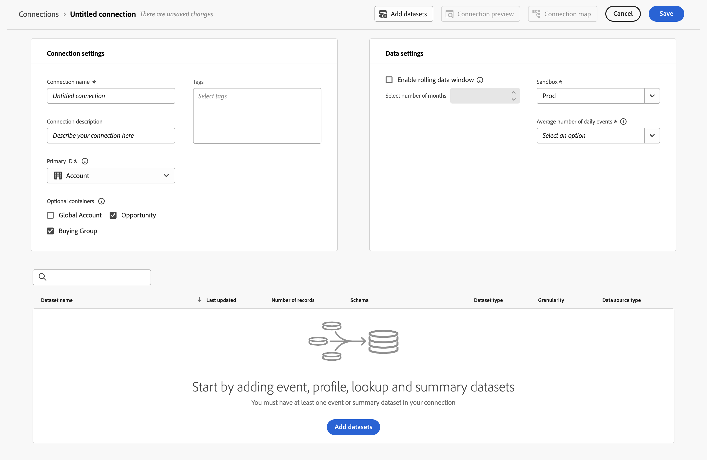
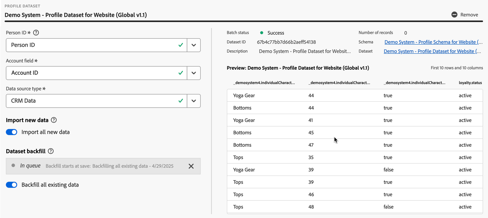

# 接続の作成または編集 {#create-or-edit-a-connection}

>[!CONTEXTUALHELP]
>id="cja_connections_recordsadded"
>title="追加されたレコード"
>abstract="選択したデータセットに関して、選択した時間間隔で接続に追加されたレコード（行）の数。"

>[!CONTEXTUALHELP]
>id="cja_connections_recordsskipped"
>title="スキップされたレコード"
>abstract="選択したデータセットに関して、選択した時間間隔で接続のデータ転送中にスキップされたレコード（行）の数。"

>[!CONTEXTUALHELP]
>id="cja_connections_recordsdeleted"
>title="削除されたレコード"
>abstract="選択したデータセットに関して、選択した時間間隔で接続から削除されたレコード（行）数。"

>[!CONTEXTUALHELP]
>id="cja_connection_lastadded"
>title="前回追加した日時"
>abstract="接続に転送された任意のデータセットからの最新のバッチのタイムスタンプ。"

>[!CONTEXTUALHELP]
>id="cja_connection_enablerollingdatawindow"
>title="周期的なデータ期間を有効にする"
>abstract="データ保持を月数で周期的な期間として接続レベルで定義します。"

>[!CONTEXTUALHELP]
>id="cja_connection_averagenumberofdailyuses"
>title="毎日の使用の平均数"
>abstract="接続全体で想定される毎日のイベント数の範囲を選択します。"

>[!CONTEXTUALHELP]
>id="connections_recordsadded"
>title="追加されたレコード"
>abstract="選択したデータセットに関して、選択した時間間隔で接続に追加されたレコード（行）の数。"

>[!CONTEXTUALHELP]
>id="connections_recordsskipped"
>title="スキップされたレコード"
>abstract="選択したデータセットに関して、選択した時間間隔で接続のデータ転送中にスキップされたレコード（行）の数。"

>[!CONTEXTUALHELP]
>id="connections_recordsdeleted"
>title="削除されたレコード"
>abstract="選択したデータセットに関して、選択した時間間隔で接続から削除されたレコード（行）の数。"

>[!CONTEXTUALHELP]
>id="connection_lastadded"
>title="前回追加した日時"
>abstract="接続に転送された任意のデータセットからの最新のバッチのタイムスタンプ。"

>[!CONTEXTUALHELP]
>id="connection_enablerollingdatawindow"
>title="周期的なデータ期間を有効にする"
>abstract="データ保持を月数で周期的な期間として接続レベルで定義します。"

>[!CONTEXTUALHELP]
>id="connection_averagenumberofdailyuses"
>title="毎日の使用の平均数"
>abstract="接続全体で想定される毎日のイベント数の範囲を選択します。"

>[!CONTEXTUALHELP]
>id="connection_change_personid"
>title="ID 設定の変更 "
>abstract="ID 設定を変更すると、接続インターフェイスで変更を保存した後、このデータセットの接続データが削除されます。 新しい設定に基づいて、データセットからデータを再度取り込む必要があります。<br/><br/> 削除プロセスが完了するまで、レポートが遅延する可能性があります。"

>[!CONTEXTUALHELP]
>id="connection_change_accountid"
>title="アカウント ID の変更"
>abstract="アカウント ID を変更すると、接続内の既存のデータがすべて削除され、新しいアカウント ID に基づいてデータセットからすべてのデータが再取得されます。このアクションは、コストに影響を与える場合があります。<br/><br/>「**[!UICONTROL 続行]**」を選択した場合、プロセスが完了するまでレポートが遅延する可能性があります。"

>[!CONTEXTUALHELP]
>id="connection_change_globalaccountid"
>title="グローバルアカウント ID の変更"
>abstract="グローバルアカウント ID を変更すると、接続内の既存のデータがすべて削除され、新しいグローバルアカウント ID に基づいてデータセットからすべてのデータが再取得されます。このアクションは、コストに影響を与える場合があります。<br/><br/>「**[!UICONTROL 続行]**」を選択した場合、プロセスが完了するまでレポートが遅延する可能性があります。"

>[!CONTEXTUALHELP]
>id="connection_change_opportunityid"
>title="商談 ID の変更"
>abstract="商談 ID を変更すると、接続内の既存のデータがすべて削除され、新しい商談 ID に基づいてデータセットからすべてのデータが再取得されます。このアクションは、コストに影響を与える場合があります。<br/><br/>「**[!UICONTROL 続行]**」を選択した場合、プロセスが完了するまでレポートが遅延する可能性があります。"

>[!CONTEXTUALHELP]
>id="connection_change_buyinggroupid"
>title="購買グループ ID の変更"
>abstract="購買グループ ID を変更すると、接続内の既存のデータがすべて削除され、新しい購買グループ ID に基づいてデータセットからすべてのデータが再取得されます。このアクションは、コストに影響を与える場合があります。<br/><br/>「**[!UICONTROL 続行]**」を選択した場合、プロセスが完了するまでレポートが遅延する可能性があります。"

>[!CONTEXTUALHELP]
>id="connection_change_persistentid"
>title="永続的 ID の変更"
>abstract="永続的 ID を変更すると、接続内の既存のデータがすべて削除され、新しい永続的 ID に基づいてデータセットからすべてのデータが再取り込みされます。このアクションは、コストに影響を与える場合があります。<br/><br/>「**[!UICONTROL 続行]**」を選択した場合、プロセスが完了するまでレポートが遅延する可能性があります。"


<!-- Start of contextual help entries for CJA connection dialogs -->

>[!CONTEXTUALHELP]
>id="connections_useincja_exl_ajo"
>title="Customer Journey Analytics でこの接続を使用"
>abstract="このオプションを使用すると、Journey Optimizer 接続で Customer Journey Analytics の高度なレポート機能を活用できます。これらの機能により、次の操作を実行できます。<ul><li>Customer Journey Analytics 内で Journey Optimizer データの詳細な分析を実行する。</li><li>Journey Optimizer の接続と関連データビューを編集する。</li><li>ジャーニーイベント、会話パスおよびキャンペーンのパフォーマンスを分析する。</li></ul>**このオプションを有効にすると、接続内の各データ行が Customer Journey Analytics の各月のライセンスデータ行数にカウントされ、接続の使用状況 UI 内に表示されます。**<br><br/> Customer Journey Analytics でデータ行を追加で使用しても問題がない場合にのみ、このオプションを探索してください。[詳細情報](https://experienceleague.adobe.com/ja/docs/analytics-platform/using/integrations/ajo){target="_blank"}。"

>[!CONTEXTUALHELP]
>id="connections_disableuseincja_exl_ajo"
>title="Customer Journey Analytics からこの接続を削除"
>abstract="この Journey Optimizer 接続は現在、Customer Journey Analytics で使用されています。接続では、次の操作を実行できます。<ul><li>Customer Journey Analytics 内で Journey Optimizer データの詳細な分析を実行する。</li><li>Journey Optimizer の接続と関連データビューを編集する。</li><li>ジャーニーイベント、会話パスおよびキャンペーンのパフォーマンスを分析する。</li></ul>**接続を削除すると、Customer Journey Analytics での詳細な分析はできなくなります。接続および関連するデータビューはデフォルトの状態にリセットされ、編集できなくなります。**<br/><br/>**Customer Journey Analytics でのこの接続の課金には、接続が削除された月の 1 か月分の料金が含まれます。**<br/><br/> Journey Optimizer では、接続は有効なままになります。[詳細情報](https://experienceleague.adobe.com/ja/docs/analytics-platform/using/integrations/ajo){target="_blank"}。"

>[!CONTEXTUALHELP]
>id="connections_useincja_exl_brand_concierge"
>title="Customer Journey Analytics でこの接続を使用"
>abstract="このオプションを使用すると、Brand Concierge 接続で Customer Journey Analytics の高度なレポート機能を活用できます。これらの機能により、次の操作を実行できます。<ul><li>Customer Journey Analytics 内で Brand Concierge データの詳細な分析を実行する。</li><li>Brand Concierge 接続と関連データビューを編集する。</li><li>会話のエンゲージメント、センチメントおよびコンバージョン指標を分析する。</li></ul>**このオプションを有効にする際、接続内の各データ行が Customer Journey Analytics の毎月のライセンスデータ行数にカウントされ、接続の使用状況 UI 内に表示されます。**<br><br/> Customer Journey Analytics でデータ行を追加で使用しても問題がない場合にのみ、このオプションを探索してください。[詳細情報](https://experienceleague.adobe.com/ja/docs/analytics-platform/using/cja-workspace/templates/use-templates#brand-concierge-templates){target="_blank"}。"

>[!CONTEXTUALHELP]
>id="connections_disableuseincja_exl_brand_concierge"
>title="Customer Journey Analytics からこの接続を削除"
>abstract="この Brand Concierge 接続は現在、Customer Journey Analytics で使用されています。接続では、次の操作を実行できます。<ul><li>Customer Journey Analytics 内で Brand Concierge データの詳細な分析を実行する。</li><li>Brand Concierge 接続と関連データビューを編集する。</li><li>会話のエンゲージメント、センチメントおよびコンバージョン指標を分析する。</li></ul>**接続を削除した場合、Customer Journey Analytics での詳細な分析はできなくなります。 接続および関連するデータビューはデフォルトの状態にリセットされ、編集できなくなります。**<br/><br/>**Customer Journey Analytics でのこの接続の課金には、接続が削除された 1 か月分の料金が含まれます。**<br/><br/> Brand Concierge では、接続は有効なままになります。[詳細情報](https://experienceleague.adobe.com/ja/docs/analytics-platform/using/cja-workspace/templates/use-templates#brand-concierge-templates){target="_blank"}。"

>[!CONTEXTUALHELP]
>id="connections_useincja_exl_product_usage"
>title="Customer Journey Analytics でこの接続を使用"
>abstract="このオプションを使用すると、製品の使用状況接続で Customer Journey Analytics の高度なレポート機能を活用できます。これらの機能により、次の操作を実行できます。<ul><li>Customer Journey Analytics 内で製品の使用状況データの詳細な分析を実行する。</li><li>製品の使用状況接続と関連データビューを編集する。</li></ul>**このオプションを有効にする際、接続内の各データ行が Customer Journey Analytics の毎月のライセンスデータ行数にカウントされ、接続の使用状況 UI 内に表示されます。**<br><br/> Customer Journey Analytics でデータ行を追加で使用しても問題がない場合にのみ、このオプションを探索してください。[詳細情報](https://experienceleague.adobe.com/ja/docs/analytics-platform/using/tools/product-usage/usage-overview){target="_blank"}。"

>[!CONTEXTUALHELP]
>id="connections_disableuseincja_exl_product_usage"
>title="Customer Journey Analytics からこの接続を削除"
>abstract="この製品の使用状況接続は現在、Customer Journey Analytics で使用されています。接続では、次の操作を実行できます。<ul><li>Customer Journey Analytics 内で製品の使用状況データの詳細な分析を実行する。</li><li>製品の使用状況接続と関連データビューを編集する。</li></ul>**接続を削除した場合、Customer Journey Analytics での詳細な分析はできなくなります。 接続および関連するデータビューはデフォルトの状態にリセットされ、編集できなくなります。**<br/><br/>**Customer Journey Analytics でのこの接続の課金には、接続が削除された 1 か月分の料金が含まれます。**<br/><br/>&#x200B;製品の使用状況では、接続は有効なままになります。[詳細情報](https://experienceleague.adobe.com/ja/docs/analytics-platform/using/tools/product-usage/usage-overview){target="_blank"}。"

>[!CONTEXTUALHELP]
>id="connections_useincja_legal_section_section"
>title="法的影響"
>abstract="Customer Journey Analytics の使用状況により、統合データの量に基づいて追加料金が発生する場合があります。詳しくは、[Customer Journey Analytics の課金と使用状況](https://experienceleague.adobe.com/ja/docs/analytics-platform/using/cja-connections/manage-connections#connections-usage)を参照してください。"


>[!CONTEXTUALHELP]
>id="connections_useincja_exl_ajo_learn_more"
>title="詳細情報"
>abstract="[詳細情報](https://experienceleague.adobe.com/ja/docs/analytics-platform/using/cja-connections/manage-connections#connections-usage)。"

>[!CONTEXTUALHELP]
>id="connections_useincja_exl_brand_concierge_learn_more"
>title="詳細情報"
>abstract="[詳細情報](https://experienceleague.adobe.com/ja/docs/analytics-platform/using/cja-workspace/templates/use-templates#brand-concierge-templates)。"

>[!CONTEXTUALHELP]
>id="connections_useincja_exl_product_usage_learn_more"
>title="詳細情報"
>abstract="[詳細情報](https://experienceleague.adobe.com/ja/docs/analytics-platform/using/tools/product-usage/usage-overview)。"

<!-- End of contextual help entries for CJA connection dialogs -->


接続の作成と編集ワークフローエクスペリエンスでは、すべてのデータセットと接続設定が、補助的なワークフローで画面の中央に表示されます。 詳細なデータセットの選択、設定、確認のエクスペリエンスを提供します。 また、[データセットのタイプ](#dataset-types)、サイズ、スキーマ、データセット ID、バッチステータス、バックフィルステータス、ID などの重要な情報を指定できるので、誤った接続設定のリスクを軽減できます。機能の概要を以下に示します。

* 接続を作成する際に、周期的なデータ保持時間枠を有効にすることができます。
* 接続からデータセットを追加および削除できます （データセットを削除すると、接続からデータセットが削除され、関連付けられたすべてのデータビューおよび基になる Analysis Workspace プロジェクトに影響します）。
* データセットごとにバックフィルデータを有効にしたり、リクエストしたりできます。
* （例えば、別のバックフィルをリクエストするために）データセットを編集できます。
* データセットごとに既存のデータ読み込むことができます。


>[!BEGINSHADEBOX]

デモビデオについては、 [&#x200B; データソースへの接続 &#x200B;](https://experienceleague.adobe.com/ja/docs/customer-journey-analytics-learn/tutorials/connections/connecting-customer-journey-analytics-to-data-sources-in-platform){target="_blank"} を参照してください。

>[!ENDSHADEBOX]


## 前提条件

接続に追加できるデータセットの最大数は 100 にキャップされています。組み合わせは、会社が購入した Customer Journey Analytics パッケージに応じて異なります。

使用している Customer Journey Analytics パッケージが不明な場合は、管理者にお問い合わせください。

| **選択**&#x200B;パッケージ | **基盤**&#x200B;パッケージ |
| --- | --- |
| イベント、プロファイル、ルックアップ、概要データセットの任意の組み合わせ（最大 100 個の追加） | 接続あたり 1 個のイベントデータセット |
|  | 接続あたり最大 99 個のプロファイル、ルックアップまたは概要データセット |

{style="table-layout:auto"}

## 接続の作成 {#create-connection}

接続を作成するには：

1. Customer Journey Analytics で、上部のメニューにある&#x200B;**[!UICONTROL データ管理]**&#x200B;から、オプションで「**[!UICONTROL 接続]**」を選択します。
1. 「**[!UICONTROL 新しい接続を作成]**」を選択します。

[接続の詳細を編集](#edit-a-connection)できるようになりました。

## 接続の編集 {#edit-connection}

接続の編集方法は、次のライセンスを取得した Customer Journey Analytics パッケージによって異なります。

* [Customer Journey Analytics](#customer-journey-analytics)
* [Customer Journey Analytics B2B Edition](#customer-journey-analytics-b2b-edition)

### Customer Journey Analytics

**[!UICONTROL 接続]**／**[!UICONTROL *接続の名前&#x200B;*]**&#x200B;画面で、次の手順を実行します。


1. 接続を設定します。

   | 設定 | 説明 |
   | --- | --- |
   | **[!UICONTROL 接続名]** | 接続の一意の名前を入力します。 |
   | **[!UICONTROL 接続の説明]** | この接続の目的を記述します。 |
   | **[!UICONTROL タグ]** | タグを指定して接続にタグを追加すると、後でこれらのタグを使用して接続を検索できるようになります。 |
   | **[!UICONTROL 周期的なデータ時間枠を有効にする]** | このチェックボックスをオンにすると、Customer Journey Analytics データ保持を接続レベルでの月単位（1 か月、3 か月、6 か月など）の周期的な時間枠として定義できます。<p>データ保持は、イベントデータセットのタイムスタンプに基づいており、イベントデータセットにのみ適用されます。 適用可能なタイムスタンプがないので、プロファイルまたはルックアップデータセットには、周期的なデータ時間枠設定は存在しません。 ただし、接続に（1 つ以上のイベントデータセットに加えて）プロファイルまたはルックアップデータセットが含まれる場合、そのデータは、同じ期間だけ保持されます。<p> 主な利点は、該当する有用なデータのみを保存またはレポートして、有用でなくなった古いデータを削除できるという点です。 契約上の上限を超えないようにし、超過コストのリスクを軽減します。<p><ul><li>デフォルト（オフ）のままにすると、Adobe Experience Platform のデータ保持設定によって保持期間が置き換えられます。 Experience Platform に 25 か月分のデータがある場合、Customer Journey Analytics はバックフィルを通じて 25 か月分のデータを取得します。 Experience Platform でこのうち 10 か月を削除すると、Customer Journey Analytics は残りの 15 か月を保持します。</li><li>周期的なデータ期間を有効にする場合は、「**[!UICONTROL 月数を選択]**」で周期的なデータ期間を有効にする月数を指定します。 |
   | **[!UICONTROL サンドボックス]** | 接続を作成するデータセットを含む Experience Platform のサンドボックスを選択します。<p>Adobe Experience Platform は、単一の Platform インスタンスを別々の仮想環境に分割して、デジタルエクスペリエンスアプリケーションの開発と発展を支援する仮想[サンドボックス](https://experienceleague.adobe.com/ja/docs/experience-platform/sandbox/home)を提供します。 サンドボックスは、データセットを含む「データサイロ」と考えることができます。 サンドボックスは、データセットへのアクセスを制御するために使用します。<p>サンドボックスを選択すると、左側のパネルに、取り出し元となるサンドボックス内のすべてのデータセットが表示されます。 |
   | **[!UICONTROL データセットを追加]** | データセットを追加するには、 **[!UICONTROL データセットを追加]** を選択します。接続にまだデータセットがない場合は、データセットテーブルで「**[!UICONTROL データセットを追加]**」を選択することもできます。 |


   設定したデータセットの場合は、データセットテーブルに次の列が表示されます。

   | 列 | 説明 |
   |---|---|
   | **[!UICONTROL データセット名]** | Customer Journey Analytics に取り込むデータセットを 1 つ以上選択して、「**[!UICONTROL 追加]**」を選択します。<p>（選択できるデータセットが多数ある場合は、データセットのリスト上部にある「データセットを検索」検索バーを使用して、適切なデータセットを検索できます）。 |
   |  |  を選択すると、選択したデータセットのコンテキストメニューが開きます。データセット（のタイプ）に基づいて、次の項目を選択できます。<ul><li>  **[!UICONTROL データセットを削除]** を選択すると、[データセットを削除](#delete-a-dataset)できます。</li><li> **[!UICONTROL データセットを編集]** を選択すると、[データセットを編集](#edit-a-dataset)できます。</li><li> **[!UICONTROL 過去のバックフィル]** を選択すると、[データセットの過去のバックフィル](#past-backfills)を表示できます。 |
   | **[!UICONTROL 最終更新日]** | イベントデータセットの場合のみ、この設定は、Experience Platform のイベントベースのスキーマからデフォルトのタイムスタンプフィールドに自動的に設定されます。 「該当なし」は、このデータセットにデータが含まれていないことを意味します。 |
   | **[!UICONTROL レコード数]** | Experience Platform 内のデータセットの先月の合計レコード数。 |
   | **[!UICONTROL スキーマ]** | Adobe Experience Platform で作成されたデータセット基づく[スキーマ](https://experienceleague.adobe.com/ja/docs/experience-platform/xdm/schema/composition)。 |
   | **[!UICONTROL データセットタイプ]** | Customer Journey Analytics は、この接続に追加した各データセットに対して、受信するデータに基づいて[データセットタイプ](#dataset-types)を自動的に設定します。 データセットには、イベントデータ、プロファイルデータおよびルックアップデータの 3 種類があります。 データセットのタイプについて詳しくは、次の表を参照してください。 |
   | **[!UICONTROL ステッチ]** | データセットが [&#x200B; 接続 UI でのステッチが有効 &#x200B;](/help/stitching/use-stitching-ui.md) になっている場合、値は **[!UICONTROL true]** です。 それ以外の場合、値は **[!UICONTROL false]** です。 [&#x200B; ステッチをリクエストする手順 &#x200B;](/help/stitching//use-stitching.md) の結果であるステッチされたデータセットは、このテーブルではステッチされたと識別されず、デフォルトの値は **[!UICONTROL false]** になっています。 |
   | **[!UICONTROL 精度]** | データセット内のデータの精度。概要データセットにのみ適用できます。 |
   | **[!UICONTROL データソースタイプ]** | データセットのデータソースタイプ。 概要データセットには適用できません。 |
   | **[!UICONTROL ユーザー ID]** | データセットのユーザーベースのレポートをサポートするために使用されるユーザー ID。 |
   | **[!UICONTROL キー]** | ルックアップデータセットに使用されるキー。 |
   | **[!UICONTROL 一致するキー]** | ルックアップデータセットに使用される一致するキー。 |
   | **[!UICONTROL 新しいデータをインポート]** | データセットの新しいデータの読み込みのステータス： <p> **[!UICONTROL _x _オン]**：データセットが新しいデータを読み込むように設定されている場合。<p> **[!UICONTROL _x オフ_]**：データセットが新しいデータを読み込むように設定されていない場合。 |
   | **[!UICONTROL データをバックフィル]** | データセットのバックフィルデータのステータス。<p> **[!UICONTROL _x _バックフィル失敗]**：失敗したバックフィルの数の場合。<p> **[!UICONTROL _x _バックフィル処理中]**：処理中のバックフィルの数の場合。<p> **[!UICONTROL _x _バックフィル完了]**：完了したバックフィルの数の場合。<p> **[!UICONTROL _オフ_]**：バックフィルが定義されていない場合。 |

   「」フィールドを使用して、特定のデータセットを検索できます。

### Customer Journey Analytics B2B Edition

[!BADGE B2B Edition]{type=Informative url="https://experienceleague.adobe.com/ja/docs/analytics-platform/using/cja-overview/cja-b2b/cja-b2b-edition" newtab=true tooltip="Customer Journey Analytics B2B Edition"}

**[!UICONTROL 接続]**／**[!UICONTROL *接続の名前&#x200B;*]**&#x200B;画面で、次の手順を実行します。



1. 接続を設定します。

   | 設定 | 説明 |
   | --- | --- |
   | **[!UICONTROL 接続名]** | 接続の一意の名前を入力します。 |
   | **[!UICONTROL 接続の説明]** | この接続の目的を記述します。 |
   | **[!UICONTROL タグ]** | タグを指定して接続にタグを追加すると、後でこれらのタグを使用して接続を検索できるようになります。 |
   | **[!UICONTROL プライマリ ID]** | 接続に適切なプライマリ ID を選択します。 <ul><li>B2C シナリオで通常使用されるユーザーベースの接続の  **[!UICONTROL ユーザー]**。</li><li> B2B シナリオで通常使用されるアカウントベースの接続の  **[!UICONTROL アカウント]**。</li></ul>接続に 1 つ以上のデータセットを追加するとすぐに、プライマリ ID を変更できなくなります。<br/>プライマリ ID の選択により、接続がユーザーベースかアカウントベースかが定義されます。接続ベースにより、特定のタイプのデータセットに使用可能な[設定](#dataset-settings)が決定されます。 |
   | **[!UICONTROL オプションのコンテナ]** | **[!UICONTROL プライマリ ID]** として  **[!UICONTROL アカウント]**&#x200B;を選択した場合は、追加のコンテナを選択します。<ul><li>**[!UICONTROL グローバルアカウント]**：接続内のグローバルアカウントの設定を有効にします。</li><li>**[!UICONTROL 商談]**：接続内の商談の設定を有効にします。</li><li>**[!UICONTROL 購買グループ]**：接続内の購買グループの設定を有効にします。</li><ul> |
   | **[!UICONTROL サンドボックス]** | 接続を作成するデータセットを含む Experience Platform のサンドボックスを選択します。<p>Adobe Experience Platform は、単一の Platform インスタンスを別々の仮想環境に分割して、デジタルエクスペリエンスアプリケーションの開発と発展を支援する仮想[サンドボックス](https://experienceleague.adobe.com/ja/docs/experience-platform/sandbox/home)を提供します。 サンドボックスは、データセットを含む「データサイロ」と考えることができます。 サンドボックスは、データセットへのアクセスを制御するために使用します。<p>サンドボックスを選択すると、左側のパネルに、取り出し元となるサンドボックス内のすべてのデータセットが表示されます。 |
   | **[!UICONTROL 周期的なデータ時間枠を有効にする]** | このチェックボックスをオンにすると、Customer Journey Analytics データ保持を接続レベルでの月単位（1 か月、3 か月、6 か月など）の周期的な時間枠として定義できます。<p>データ保持は、イベントデータセットのタイムスタンプに基づいており、イベントデータセットにのみ適用されます。 適用可能なタイムスタンプがないので、プロファイルまたはルックアップデータセットには、周期的なデータ時間枠設定は存在しません。 ただし、接続に（1 つ以上のイベントデータセットに加えて）プロファイルまたはルックアップデータセットが含まれる場合、そのデータは、同じ期間だけ保持されます。<p> 主な利点は、該当する有用なデータのみを保存またはレポートして、有用でなくなった古いデータを削除できるという点です。 契約上の上限を超えないようにし、超過コストのリスクを軽減します。<p><ul><li>デフォルト（オフ）のままにすると、Adobe Experience Platform のデータ保持設定によって保持期間が置き換えられます。 Experience Platform に 25 か月分のデータがある場合、Customer Journey Analytics はバックフィルを通じて 25 か月分のデータを取得します。 Platform でこのうち 10 か月を削除すると、Customer Journey Analytics は残りの 15 か月を保持します。</li><li>周期的なデータ期間を有効にする場合は、「**[!UICONTROL 月数を選択]**」で周期的なデータ期間を有効にする月数を指定します。 |
   | **[!UICONTROL データセットを追加]** | [データセットを追加](#add-datasets)するには、 **[!UICONTROL データセットを追加]** を選択します。接続にまだデータセットがない場合は、データセットテーブルで「**[!UICONTROL データセットを追加]**」を選択することもできます。 |


   設定したデータセットの場合は、データセットテーブルに次の列が表示されます。

   | 列 | 説明 |
   |---|---|
   | **[!UICONTROL データセット名]** | Customer Journey Analytics に取り込むデータセットを 1 つ以上選択して、「**[!UICONTROL 追加]**」を選択します。<p>（選択できるデータセットが多数ある場合は、データセットのリスト上部にある「データセットを検索」検索バーを使用して、適切なデータセットを検索できます）。 |
   |  |  を選択すると、選択したデータセットのコンテキストメニューが開きます。データセット（のタイプ）に基づいて、次の項目を選択できます。<ul><li>  **[!UICONTROL データセットを削除]** を選択すると、[データセットを削除](#delete-a-dataset)できます。</li><li> **[!UICONTROL データセットを編集]** を選択すると、[データセットを編集](#edit-a-dataset)できます。</li><li> **[!UICONTROL 過去のバックフィル]** を選択すると、[データセットの過去のバックフィル](#past-backfills)を表示できます。 |
   | **[!UICONTROL 最終更新日]** | イベントデータセットの場合のみ、この設定は、Experience Platform のイベントベースのスキーマからデフォルトのタイムスタンプフィールドに自動的に設定されます。 「該当なし」は、このデータセットにデータが含まれていないことを意味します。 |
   | **[!UICONTROL レコード数]** | Experience Platform 内のデータセットの先月の合計レコード数。 |
   | **[!UICONTROL スキーマ]** | Adobe Experience Platform で作成されたデータセット基づく[スキーマ](https://experienceleague.adobe.com/ja/docs/experience-platform/xdm/schema/composition)。 |
   | **[!UICONTROL データセットタイプ]** | Customer Journey Analytics は、この接続に追加した各データセットに対して、受信するデータに基づいて[データセットタイプ](#dataset-types)を自動的に設定します。 |
   | **[!UICONTROL 精度]** | データセット内のデータの精度。概要データセットにのみ適用できます。 |
   | **[!UICONTROL データソースタイプ]** | データセットのデータソースタイプ。 概要データセットには適用できません。 |
   | **[!UICONTROL アカウント ID]** | （アカウントベースの接続の場合でのみ表示）データセットのアカウントベースのレポートをサポートするために使用されるアカウント ID。 |
   | **[!UICONTROL グローバルアカウント ID]** | （アカウントベースの接続の場合でのみ表示）データセットのアカウントベースのレポートをサポートするために使用されるグローバルアカウント ID。 |
   | **[!UICONTROL 購買グループ ID]** | （アカウントベースの接続の場合でのみ表示）購買グループデータをルックアップするために使用される購買グループ ID。 |
   | **[!UICONTROL 商談 ID]** | （アカウントベースの接続の場合でのみ表示）商談データを参照するために使用される商談 ID。 |
   | **[!UICONTROL ユーザー ID]** | データセットのユーザーベースのレポートをサポートするために使用されるユーザー ID。 |
   | **[!UICONTROL キー]** | ルックアップデータセットに使用されるキー。 |
   | **[!UICONTROL 一致するキー]** | ルックアップデータセットに使用される一致するキー。 |
   | **[!UICONTROL 新しいデータをインポート]** | データセットの新しいデータの読み込みのステータス： <p> **[!UICONTROL _x _オン]**：データセットが新しいデータを読み込むように設定されている場合。<p> **[!UICONTROL _x オフ_]**：データセットが新しいデータを読み込むように設定されていない場合。 |
   | **[!UICONTROL データをバックフィル]** | データセットのバックフィルデータのステータス。<p> **[!UICONTROL _x _バックフィル失敗]**：失敗したバックフィルの数の場合。<p> **[!UICONTROL _x _バックフィル処理中]**：処理中のバックフィルの数の場合。<p> **[!UICONTROL _x _バックフィル完了]**：完了したバックフィルの数の場合。<p> **[!UICONTROL _オフ_]**：バックフィルが定義されていない場合。 |

   「」フィールドを使用して、特定のデータセットを検索できます。

## データセット {#datasets}

接続ワークフローの一部として、[1 つ以上のデータセットの追加](#add-datasets)または[既存のデータセットの編集](#edit-a-dataset)を行います。

>[!NOTE]
>
>任意のタイプのデータセットの行の日付および日時フィールドの 1900年より前の値は、行が取り込まれる前に `null` の値に置き換えられます。<br/>イベントデータセットまたは概要データセット内のタイムスタンプ値が 1900年より前の行は、取り込みからドロップされます。


{{relational-model-based}}


>[!CONTEXTUALHELP]
>id="cja_connection_primaryid"
>title="プライマリ ID"
>abstract="接続に適したプライマリ ID を選択します（B2C シナリオの場合は「ユーザー」）。B2B シナリオのアカウント。"

>[!CONTEXTUALHELP]
>id="cja_connection_optionalcontainers"
>title="オプションコンテナ"
>abstract="追加のコンテナを選択します。<br/><br/>**[!UICONTROL グローバルアカウント&#x200B;]**：接続内のグローバルアカウントの設定を有効にします。<br/>**[!UICONTROL 商談]**：接続内の商談の設定を有効にします。<br/>**[!UICONTROL 購買グループ&#x200B;]**：接続内の購買グループの設定を有効にします。"

>[!CONTEXTUALHELP]
>id="cja_connection_accountid"
>title="アカウント ID"
>abstract="Experience Platform のデータセットスキーマで定義されている使用可能な ID からアカウント ID（アカウントの一意の ID）を選択します。"

>[!CONTEXTUALHELP]
>id="cja_connection_accountfield"
>title="アカウントフィールド"
>abstract="アカウント ID（アカウントの一意の ID）を表すフィールドを選択します。"

>[!CONTEXTUALHELP]
>id="cja_connection_globalaccountid"
>title="グローバルアカウント ID"
>abstract="Experience Platform のデータセットスキーマで定義されている使用可能な ID からグローバルアカウント ID（グローバルアカウントの一意の ID）を選択します。"

>[!CONTEXTUALHELP]
>id="cja_connection_opportunityid"
>title="商談 ID"
>abstract="Experience Platform のデータセットスキーマで定義されている使用可能な ID から商談 ID（商談の一意の ID）を選択します。"

>[!CONTEXTUALHELP]
>id="cja_connection_buyinggroupid"
>title="購買グループ ID"
>abstract="Experience Platform のデータセットスキーマで定義されている使用可能な ID から購買グループ ID（購買グループの一意の ID）を選択します。"

>[!CONTEXTUALHELP]
>id="cja_connection_personid"
>title="ユーザー ID"
>abstract="Experience Platform のデータセットスキーマで定義されている使用可能な ID からユーザー ID（ユーザーの一意の ID）を選択します。"

>[!CONTEXTUALHELP]
>id="cja_connection_matchingkey"
>title="一致するキー"
>abstract="いずれかのイベントデータセットで結合するフィールドを選択します。このリストが空の場合は、イベントデータセットを追加または設定していない可能性があります。"

>[!CONTEXTUALHELP]
>id="cja_connection_importnewdata"
>title="新しいデータを読み込み"
>abstract="Experience Platform データセットに追加された新しいバッチは、自動的にこの接続に追加され、分析に使用できるようになります。"

>[!CONTEXTUALHELP]
>id="cja_connection_datasetbackfill"
>title="データセットのバックフィル"
>abstract="このオプションを選択すると、接続内のこのデータセットに対して、Experience Platform からの既存の（履歴）データがバックフィルされます。"

>[!CONTEXTUALHELP]
>id="cja_connection_transformdataset"
>title="データセットを変換"
>abstract="このオプションは、B2B シナリオでのユーザーベースの検索に使用できるようにデータセットを変換します。オンにすると、データセットの変換は元に戻すことはできません。"

>[!CONTEXTUALHELP]
>id="cja_connection_connectionmap"
>title="接続マップ"
>abstract="接続マップは、イベント、ユーザー、アカウントおよび関連するルックアップデータセット（商談、キャンペーンメンバーなど）間の関係を視覚化します。"

>[!CONTEXTUALHELP]
>id="connection_primaryid"
>title="プライマリ ID"
>abstract="接続に適したプライマリ ID を選択します（B2C シナリオの場合は「ユーザー」）。B2B シナリオのアカウント。"

>[!CONTEXTUALHELP]
>id="connection_optionalcontainers"
>title="オプションコンテナ"
>abstract="追加のコンテナを選択します。<br/><br/>**[!UICONTROL グローバルアカウント&#x200B;]**：接続内のグローバルアカウントの設定を有効にします。<br/>**[!UICONTROL 商談]**：接続内の商談の設定を有効にします。<br/>**[!UICONTROL 購買グループ&#x200B;]**：接続内の購買グループの設定を有効にします。"

>[!CONTEXTUALHELP]
>id="connection_personid"
>title="ユーザー ID"
>abstract="Experience Platform のデータセットスキーマで定義されている使用可能な ID からユーザー ID を選択します。"

>[!CONTEXTUALHELP]
>id="connection_accountid"
>title="アカウント ID"
>abstract="Experience Platform のデータセットスキーマで定義されている使用可能な ID からアカウント ID（アカウントの一意の ID）を選択します。"

>[!CONTEXTUALHELP]
>id="connection_accountfield"
>title="アカウントフィールド"
>abstract="アカウント ID（アカウントの一意の ID）を表すフィールドを選択します。"

>[!CONTEXTUALHELP]
>id="connection_globalaccountid"
>title="グローバルアカウント ID"
>abstract="Experience Platform のデータセットスキーマで定義されている使用可能な ID からグローバルアカウント ID（グローバルアカウントの一意の ID）を選択します。"

>[!CONTEXTUALHELP]
>id="connection_opportunityid"
>title="商談 ID"
>abstract="Experience Platform のデータセットスキーマで定義されている使用可能な ID から商談 ID（商談の一意の ID）を選択します。"

>[!CONTEXTUALHELP]
>id="connection_buyinggroupid"
>title="購買グループ ID"
>abstract="Experience Platform のデータセットスキーマで定義されている使用可能な ID から購買グループ ID（購買グループの一意の ID）を選択します。"

>[!CONTEXTUALHELP]
>id="connection_matchingkey"
>title="一致するキー"
>abstract="いずれかのイベントデータセットで結合するフィールドを選択します。このリストが空の場合は、イベントデータセットを追加または設定していない可能性があります。"

>[!CONTEXTUALHELP]
>id="connection_matchingkeytype"
>title="一致するキータイプ"
>abstract="一致するフィールドまたは一致するコンテナに基づいて、結合方法を選択します。<br/><br/>**[!UICONTROL フィールドによる一致&#x200B;]**：イベントデータセットの 1 つと結合するフィールドを選択します。このリストが空の場合は、イベントデータセットを追加または設定していない可能性があります。<br/>**[!UICONTROL 一致するコンテナ]**：イベントデータセットの 1 つと結合するために使用するコンテナを選択します。"

>[!CONTEXTUALHELP]
>id="connection_importnewdata"
>title="新しいデータを読み込み"
>abstract="Experience Platform データセットに追加された新しいバッチは、自動的にこの接続に追加され、分析に使用できるようになります。"

>[!CONTEXTUALHELP]
>id="connection_datasetbackfill"
>title="データセットのバックフィル"
>abstract="このオプションを選択すると、接続内のこのデータセットに対して、Experience Platform からの既存の（履歴）データがバックフィルされます。"

>[!CONTEXTUALHELP]
>id="connection_transformdataset"
>title="データセットを変換"
>abstract="このオプションは、B2B シナリオでのユーザーベースの検索に使用できるようにデータセットを変換します。オンにすると、データセットの変換は元に戻すことはできません。"

>[!CONTEXTUALHELP]
>id="connection_connectionmap"
>title="接続マップ"
>abstract="接続マップは、イベント、ユーザー、アカウントおよび関連するルックアップデータセット（商談、キャンペーンメンバーなど）間の関係を視覚化します。"

>[!CONTEXTUALHELP]
>id="connection_stitching_enable"
>title="ID ステッチを有効にする"
>abstract="ID ステッチを有効にして、クロスチャネル分析用にこのイベントデータセットを強化します。"
>additional-url="https://experienceleague.adobe.com/ja/docs/analytics-platform/using/stitching/overview" text="ステッチの概要"

>[!CONTEXTUALHELP]
>id="connection_stitching_dialog"
>title="ID ステッチを有効にする"
>abstract="ID ステッチを有効にすると、データセットまたは ID グラフからユーザー ID 情報が派生します。 このプロセスには、認証済みセッションと未認証セッションからのユーザーデータの結合が含まれる場合があります。<br/><br/>適用される法律および規制を遵守する責任は、お客様にあります。このコンプライアンスには、データセットに対してステッチをアクティブ化する前に、必要なエンドユーザー権限を取得することが含まれます。"
>additional-url="https://experienceleague.adobe.com/ja/docs/analytics-platform/using/stitching/overview" text="ステッチの概要"

>[!CONTEXTUALHELP]
>id="connection_persistentid"
>title="永続的 ID"
>abstract="使用可能な ID から永続的 ID を選択します。永続的 ID は、イベントデータセット内のすべてのイベントで使用できる識別子です。"
>additional-url="https://experienceleague.adobe.com/ja/docs/analytics-platform/using/stitching/overview" text="ステッチの概要"

>[!CONTEXTUALHELP]
>id="connection_lookbackwindow"
>title="再生ウィンドウ"
>abstract="ステッチで使用する再生ウィンドウの適切な期間を選択します。"
>additional-url="https://experienceleague.adobe.com/ja/docs/analytics-platform/using/stitching/overview" text="ステッチの概要"

>[!CONTEXTUALHELP]
>id="connection_namespace_map"
>title="名前空間 ID マップ"
>abstract="ID マップから識別子の選択に使用する名前空間を選択します。"
>additional-url="https://experienceleague.adobe.com/ja/docs/analytics-platform/using/stitching/overview" text="ステッチの概要"

>[!CONTEXTUALHELP]
>id="connection_namespace_graph"
>title="名前空間 ID グラフ"
>abstract="ID マップから識別子の選択に使用する名前空間を選択します。"
>additional-url="https://experienceleague.adobe.com/ja/docs/analytics-platform/using/stitching/overview" text="ステッチの概要"


### データセットタイプ {#dataset-types}

[!UICONTROL Customer Journey Analytics] は、この接続に追加した各データセットに対して、受信するデータに基づいてデータセットタイプを自動的に設定します。

>[!IMPORTANT]
>
>接続には、1 つ以上のイベントまたは概要データセット（標準、アドホック、リレーショナル）を追加します。

データセットには、[!UICONTROL イベント]データ、[!UICONTROL プロファイル]データ、[!UICONTROL ルックアップ]データおよび[!UICONTROL 概要]データなど、様々なタイプがあり、それぞれ対応する XDM ベースのスキーマに基づいています。

| データセットタイプ | 説明 | タイムスタンプ | スキーマ | ユーザー ID <br/> アカウント ID [!BADGE B2B Edition]{type=Informative url="https://experienceleague.adobe.com/ja/docs/analytics-platform/using/cja-overview/cja-b2b/cja-b2b-edition" newtab=true tooltip="Customer Journey Analytics B2B Edition"} |
|---|---|---|---|---|
| **[!UICONTROL イベント]** | イベントの時間を表すデータ。 例えば、web 訪問数、インタラクション、トランザクション、POS データ、サーベイデータ、広告インプレッションデータなどがあります。 このデータには、顧客 ID または cookie ID とタイムスタンプを含む一般的なクリックストリームデータを使用できます。 イベントデータを使用すると、ユーザー ID として使用する ID を柔軟に設定できます。 | [!UICONTROL Experience Platform] のイベントベースのスキーマからデフォルトのタイムスタンプフィールドへと設定されます。 | *時系列*&#x200B;動作を持つ XDM クラスに基づいたビルトインスキーマまたはカスタムスキーマ。例には、*XDM エクスペリエンスイベント*&#x200B;や *XDM 決定イベント*&#x200B;が含まれます。 | 含めるユーザー ID またはアカウント ID [!BADGE B2B Edition]{type=Informative url="https://experienceleague.adobe.com/ja/docs/analytics-platform/using/cja-overview/cja-b2b/cja-b2b-edition" newtab=true tooltip="Customer Journey Analytics B2B Edition"} を選択できます。Experience Platform で定義された各データセットのスキーマは、1 つ以上の定義済み ID のセットを持つことができ、ID 名前空間に関連付けられます。これらの ID はいずれも、ユーザー ID またはアカウント ID [!BADGE B2B Edition]{type=Informative url="https://experienceleague.adobe.com/ja/docs/analytics-platform/using/cja-overview/cja-b2b/cja-b2b-edition" newtab=true tooltip="Customer Journey Analytics B2B Edition"} として使用できます。例えば、cookie ID、ステッチ ID、ユーザー ID、トラッキングコード、アカウント ID [!BADGE B2B Edition]{type=Informative url="https://experienceleague.adobe.com/ja/docs/analytics-platform/using/cja-overview/cja-b2b/cja-b2b-edition" newtab=true tooltip="Customer Journey Analytics B2B Edition"} などがあります。 |
| **[!UICONTROL ルックアップ]** | すべてのデータセットタイプ（プロファイルデータセット、ルックアップデータセット、イベントデータセット）内のフィールドのルックアップとしてデータセットを追加できます（後者は常にサポートされていました）。 この追加機能により、B2B を含む複雑なデータモデルをサポートする Customer Journey Analytics の機能が拡張されます。 このデータは、イベント、プロファイルまたはルックアップデータにある値やキーを検索するために使用します。 最大 3 レベルのルックアップを追加できます（[派生フィールド](/help/data-views/derived-fields/derived-fields.md)は、接続内のルックアップに一致するキーとして使用できません）。例えば、イベントデータ内の数値 ID を製品名にマッピングするルックアップデータをアップロードできます。詳しくは、[B2B の例](/help/use-cases/b2b/example.md)を参照してください。 | 該当なし | *XDM 個別プロファイル*&#x200B;クラスを除いて、*レコード*&#x200B;動作を持つ XDM クラスに基づいたビルトインスキーマまたはカスタムスキーマ。 | 該当なし |
| **[!UICONTROL プロファイル]** | [!UICONTROL イベント]データ内のアカウント、ユーザーまたは顧客に適用されるデータ。例えば、顧客に関する CRM データをアップロードできます。 | 該当なし | *XDM 個別プロファイル*&#x200B;クラスに基づいたビルトインスキーマまたはカスタムスキーマ。 | 含めるユーザー ID／アカウント ID [!BADGE B2B Edition]{type=Informative url="https://experienceleague.adobe.com/ja/docs/analytics-platform/using/cja-overview/cja-b2b/cja-b2b-edition" newtab=true tooltip="Customer Journey Analytics B2B Edition"} を選択できます。[!DNL Experience Platform] で定義された各データセット（概要データセットを除く）には、1 つ以上のユーザー ID またはアカウント ID [!BADGE B2B Edition]{type=Informative url="https://experienceleague.adobe.com/ja/docs/analytics-platform/using/cja-overview/cja-b2b/cja-b2b-edition" newtab=true tooltip="Customer Journey Analytics B2B Edition"} セットが定義されています。例えば、cookie ID、ステッチ ID、ユーザー ID、トラッキングコード、アカウント ID などがあります。<br>**メモ**：異なる ID のデータセットを含む接続を作成すると、レポートに反映されます。データセットを結合するには、データセットをまたいで同じユーザー ID またはアカウント ID [!BADGE B2B Edition]{type=Informative url="https://experienceleague.adobe.com/ja/docs/analytics-platform/using/cja-overview/cja-b2b/cja-b2b-edition" newtab=true tooltip="Customer Journey Analytics B2B Edition"} を使用する必要があります。 |
| **概要** | 個々のユーザー ID に関連付けられていない時系列データ。 概要データは、キャンペーンなど、様々な集計レベルでの集計データを表します。 このデータを Customer Journey Analytics で使用して、様々なユースケースをサポートできます。 詳しくは、[概要データ](/help/data-views/summary-data.md)を参照してください。 | Experience Platform のイベントベースの概要指標スキーマからデフォルトのタイムスタンプフィールドへと自動的に設定されます。時間単位または日単位の精度のみがサポートされます。 | *XDM 概要指標*&#x200B;クラスに基づいたビルトインスキーマまたはカスタムスキーマ。 | 該当なし |

または、上記のデータセットタイプは、汎用の XDM ベースのスキーマではなく、アドホックまたはリレーショナルスキーマに基づくことができます。または、上記のデータセットタイプは、汎用 XDM ベースのスキーマではなく、アドホックスキーマまたはリレーショナルスキーマに基づくことができます。

| データセットタイプ | 説明 | タイムスタンプ | スキーマ | ユーザー ID |
|---|---|---|---|---|
| **[!UICONTROL アドホック]** | 単一のデータセットでのみ使用するために名前空間が設定されたフィールドを持つ[アドホックスキーマ](https://experienceleague.adobe.com/ja/docs/experience-platform/xdm/api/ad-hoc)に基づくアドホックデータ。 | アドホックデータセットに対して選択するデータセットタイプによって異なります。 | *アドホック*&#x200B;動作に基づくクラスに基づいたアドホックスキーマ | アドホックデータセットに対して選択するデータセットタイプによって異なります。 |
| **[!UICONTROL モデル]** | リレーショナルスキーマに基づいたリレーショナルデータ。 | リレーショナルデータセットに対して選択するデータセットタイプによって異なります。 | 任意のリレーショナルスキーマ。 | リレーショナルデータセットに対して選択するデータセットタイプによって異なります。 |


### データセットを追加

接続を作成または編集する際に、1 つ以上の Experience Platform データセットを追加できます。


1. **[!UICONTROL 接続]**／**[!UICONTROL _接続の名前_]**&#x200B;インターフェイスで、 **[!UICONTROL データセットを追加]** を選択します。

1. ➊ **[!UICONTROL データセットを選択]** 手順では、Experience Platform データセットのリストが表示されます。

   

   各データセットに対して、リストには次が表示されます。

   | 列 | 説明 |
   |---|---|
   | **[!UICONTROL データセット]** | データセットの名前。 名前を選択すると、Experience Platform のデータセットに移動します。 を選択すると、データセットの詳細を含むポップアップが表示されます。 「**[!UICONTROL Platform で編集]**」を選択すると、Experience Platform でデータセットを直接編集できます。 |
   | **[!UICONTROL データセットタイプ]** | データセットのタイプ：[イベント](#event-dataset)、[プロファイル](#profile-dataset)、[ルックアップ](#lookup-dataset)、[概要](#summary-dataset)、[アドホック](#ad-hoc-dataset)、[リレーショナル](#relational-dataset)。 |
   | **[!UICONTROL レコード数]** | Experience Platform 内のデータセットの先月の合計レコード数。 |
   | **[!UICONTROL スキーマ]** | データセットのスキーマ。 名前を選択すると、Experience Platform のスキーマに移動します。 |
   | **[!UICONTROL 前回のバッチ]** | Experience Platform で最後に取り込まれたバッチの状態。 詳しくは、[バッチの状態](https://experienceleague.adobe.com/ja/docs/experience-platform/ingestion/batch/troubleshooting#batch-states)を参照してください。 |
   | **[!UICONTROL データセット ID]** | データセットの ID。 |
   | **[!UICONTROL 最終更新日]** | データセットの最終更新日タイムスタンプ。 |

   * データセットのリストに表示される列を変更するには、「」をクリックし、[!UICONTROL テーブルをカスタマイズ]ダイアログで表示する列を選択します。
   * 特定のデータセットを検索するには、「」検索フィールドを使用します。
   * 選択したデータセットの表示や非表示を切り替えるには、「」、「**[!UICONTROL 選択した項目を非表示]**」または「**[!UICONTROL 選択した項目を表示]**」の順に選択します。
   * 選択したデータセットのリストからデータセットを削除するには、「」を使用します。 選択したすべてのデータセットを削除するには、「**[!UICONTROL すべてクリア]**」を選択します。
   * データセットの詳細を表示するには、 を選択します。


1. 1 つ以上のデータセットを選択して、「**[!UICONTROL 次へ]**」を選択します。少なくとも 1 つのイベントデータセットまたは概要データセットを接続に含める必要があります。

1. **[!UICONTROL データセットを追加]**&#x200B;ダイアログの ➋ **[!UICONTROL データセット設定]**&#x200B;手順で、[選択したデータセットごとに設定](#dataset-settings)を 1 つずつ設定します。

   

1. 「**[!UICONTROL データセットを追加]**」を選択して、設定したデータセットを接続に追加します。追加するデータセットごとに必要な設定がすべて指定されていない場合は、通知が表示されます。

   または、「**[!UICONTROL キャンセル]**」を選択して、接続へのデータセットの追加をキャンセルすることもできます。または、「**[!UICONTROL 戻る]**」を選択して、➊ **[!UICONTROL データセットを選択]**&#x200B;手順に戻ります。


### データセットを編集

接続用に既に設定されているデータセットを編集するには、**[!UICONTROL 接続]**／**[!UICONTROL _接続の名前_]**&#x200B;インターフェイスで、次の手順に従います。

1. 編編集するデータセットテーブルにリストされているデータセットの  を選択します。
1.  **[!UICONTROL データセットを編集]** を選択します。

1. **[!UICONTROL データセットを編集：_データセット名_]**&#x200B;ダイアログで[データセット設定](#dataset-settings)を指定します。

   

   >[!NOTE]
   >
   >保存した接続の一部である[アドホック](#ad-hoc-dataset)データセットまたは[リレーショナル](#relational-dataset)データセットの&#x200B;**[!UICONTROL データセットタイプ]**、**[!UICONTROL ユーザー ID]**、**[!UICONTROL ID 名前空間]**、**[!UICONTROL タイムスタンプ]**&#x200B;は編集できません。これらの設定を変更するには：
   >
   >1. 接続から既存のアドホックデータセットまたはリレーショナルデータセットを削除します。
   >1. 更新した設定を含む同じデータセットを接続に追加します。
   >

1. データセット設定を適用するには、「**[!UICONTROL 適用]**」を選択します。「**[!UICONTROL キャンセル]**」を選択すると、キャンセルします。


### データセット設定

データセットの追加や既存のデータセットの編集を行う場合は、データセットごとにデータセット設定を指定します。 使用可能な設定は、[データセットのタイプ](#dataset-types)によって異なり、一部のデータセットのタイプでは、接続のタイプ（ユーザーベースまたは [!BADGE B2B Edition]{type=Informative url="https://experienceleague.adobe.com/ja/docs/analytics-platform/using/cja-overview/cja-b2b/cja-b2b-edition" newtab=true tooltip="Customer Journey Analytics B2B Edition"} アカウントベース）によっても異なります。

すべてのデータセットとデータセットタイプには、新しいデータを読み込むかどうかや、バックフィルをリクエストするかどうかなどの[一般的な設定と詳細](#general-dataset-settings-and-details)があります。

#### イベントデータセット

イベントデータセットの特定の設定は、接続のタイプによって異なります。

##### ユーザーベースの接続


ユーザーベースの接続のイベントデータセットの場合は、次を指定できます。

| 設定 | 説明 |
| --- | --- |
| **[!UICONTROL ユーザー ID]** | 使用可能な ID のドロップダウンメニューからユーザー ID を選択します。これらの ID は、Experience Platform 内のデータセットスキーマで定義されています。ユーザー ID として ID マップを使用する方法について詳しくは、[ユーザー ID としての ID マップの使用](#use-identity-map-as-a-person-id)を参照してください。<p>選択するユーザー ID がない場合は、ユーザー ID がスキーマで定義されていないことを意味します。詳しくは、[UI で ID フィールドを定義](https://experienceleague.adobe.com/ja/docs/experience-platform/xdm/ui/fields/identity)を参照してください。 <p>選択したユーザー ID の値は、大文字と小文字が区別されると見なされます。 例えば、`abc123` と `ABC123` は 2 つの異なる値です。<p>イベントデータセットのユーザー ID として選択した ID の値がレコードに含まれていない場合、そのレコードはスキップされます。 |
| **[!UICONTROL ID ステッチを有効にする]** | このイベントデータセットに対して [ID ステッチを有効にする &#x200B;](/help/stitching/overview.md) を選択します。 |
| **[!UICONTROL タイムスタンプ]** | この設定は、Experience Platform のイベントベースのスキーマからデフォルトのタイムスタンプフィールドへと自動的に設定されます。 |
| **[!UICONTROL データソースタイプ]** | データソースのタイプを選択します。 データソースのタイプを以下に示します。 <ul><li>[!UICONTROL Web データ]</li><li>[!UICONTROL モバイルアプリデータ]</li><li>[!UICONTROL POS データ]</li><li>[!UICONTROL CRM データ]</li><li>[!UICONTROL サーベイデータ]</li><li>[!UICONTROL コールセンターデータ]</li><li>[!UICONTROL 製品データ]</li><li> [!UICONTROL アカウントデータ]</li><li> [!UICONTROL トランザクションデータ]</li><li>[!UICONTROL 顧客フィードバックデータ]</li><li> [!UICONTROL その他]</li></ul>このフィールドは、使用中のデータソースのタイプを調査するために使用します。 |
| **[!UICONTROL データソースの説明]** | データソースのタイプとして「その他」を選択した場合のデータソースの説明。 |


##### アカウントベースの接続

[!BADGE B2B Edition]{type=Informative url="https://experienceleague.adobe.com/ja/docs/analytics-platform/using/cja-overview/cja-b2b/cja-b2b-edition" newtab=true tooltip="Customer Journey Analytics B2B Edition"}

アカウントベースの接続のイベントデータセットの場合は、次を指定できます。


| 設定 | 説明 |
| --- | --- |
| **[!UICONTROL グローバルアカウント ID]** | Experience Platform のデータセットスキーマで定義されている使用可能な ID からグローバルアカウント ID（アカウントの一意の ID）を選択します。接続にコンテナとしてグローバルアカウントを追加した際に適用されます。 <p>イベントデータセットのアカウント ID として選択した ID の値がレコードに含まれていない場合、そのレコードはスキップされます。 |
| **[!UICONTROL アカウント ID]** | Experience Platform のデータセットスキーマで定義されている使用可能な ID からアカウント ID（アカウントの一意の ID）を選択します。接続にコンテナとしてグローバルアカウントを追加していない際に適用されます。 |
| **[!UICONTROL 商談 ID]** | Experience Platform のデータセットスキーマで定義されている使用可能な ID から商談 ID（商談の一意の ID）を選択します。 |
| **[!UICONTROL 購買グループ ID]** | Experience Platform のデータセットスキーマで定義されている使用可能な ID から購買グループ ID（購買グループの一意の ID）を選択します。 |
| **[!UICONTROL ユーザー ID]** | 使用可能な ID のドロップダウンメニューからユーザー ID を選択します。これらの ID は、Experience Platform 内のデータセットスキーマで定義されています。ユーザー ID として ID マップを使用する方法について詳しくは、[ユーザー ID としての ID マップの使用](#id-map)を参照してください。<p>選択するユーザー ID がない場合は、1 つ以上のユーザー ID がスキーマで定義されていないことを意味します。 詳しくは、[UI で ID フィールドを定義](https://experienceleague.adobe.com/ja/docs/experience-platform/xdm/ui/fields/identity)を参照してください。 <p>選択したユーザー ID の値は、大文字と小文字が区別されると見なされます。 例えば、`abc123` と `ABC123` は 2 つの異なる値です。 |
| **[!UICONTROL タイムスタンプ]** | この設定は、Experience Platform のイベントベースのスキーマからデフォルトのタイムスタンプフィールドへと自動的に設定されます。 |
| **[!UICONTROL データソースタイプ]** | データソースのタイプを選択します。 データソースのタイプを以下に示します。 <ul><li>[!UICONTROL Web データ]</li><li>[!UICONTROL モバイルアプリデータ]</li><li>[!UICONTROL POS データ]</li><li>[!UICONTROL CRM データ]</li><li>[!UICONTROL サーベイデータ]</li><li>[!UICONTROL コールセンターデータ]</li><li>[!UICONTROL 製品データ]</li><li> [!UICONTROL アカウントデータ]</li><li> [!UICONTROL トランザクションデータ]</li><li>[!UICONTROL 顧客フィードバックデータ]</li><li> [!UICONTROL その他]</li></ul>このフィールドは、使用中のデータソースのタイプを調査するために使用します。 |
| **[!UICONTROL データソースの説明]** | データソースのタイプとして「その他」を選択した場合のデータソースの説明。 |

#### Profile データセット

プロファイルデータセットの特定の設定は、接続のタイプによって異なります。

##### ユーザーベースの接続


ユーザーベースの接続のプロファイルデータセットの場合は、次を指定します。

| 設定 | 説明 |
| --- | --- |
| **[!UICONTROL ユーザー ID]** | 使用可能な ID のドロップダウンメニューからユーザー ID を選択します。これらの ID は、Experience Platform 内のデータセットスキーマで定義されています。ユーザー ID として ID マップを使用する方法について詳しくは、[ユーザー ID としての ID マップの使用](#id-map)を参照してください。<p>選択するユーザー ID がない場合は、ユーザー ID がスキーマで定義されません。詳しくは、[UI で ID フィールドを定義](https://experienceleague.adobe.com/ja/docs/experience-platform/xdm/ui/fields/identity)を参照してください。 <p>選択したユーザー ID の値は、大文字と小文字が区別されると見なされます。 例えば、`abc123` と `ABC123` は 2 つの異なる値です。 <p>プロファイルデータセットのユーザー ID として選択した ID の値がレコードに含まれていない場合、そのレコードはスキップされます。 |
| **[!UICONTROL データソースタイプ]** | データソースのタイプを選択します。 データソースのタイプを以下に示します。 <ul><li>[!UICONTROL Web データ]</li><li>[!UICONTROL モバイルアプリデータ]</li><li>[!UICONTROL POS データ]</li><li>[!UICONTROL CRM データ]</li><li>[!UICONTROL サーベイデータ]</li><li>[!UICONTROL コールセンターデータ]</li><li>[!UICONTROL 製品データ]</li><li> [!UICONTROL アカウントデータ]</li><li> [!UICONTROL トランザクションデータ]</li><li>[!UICONTROL 顧客フィードバックデータ]</li><li> [!UICONTROL その他]</li></ul>このフィールドは、使用中のデータソースのタイプを調査するために使用します。 |
| **[!UICONTROL データソースの説明]** | データソースのタイプとして「その他」を選択した場合のデータソースの説明。 |

#### アカウントベースの接続



アカウントベースの接続のプロファイルデータセットの場合は、次を指定します。

| 設定 | 説明 |
| --- | --- |
| **[!UICONTROL ユーザー ID]** | 使用可能な ID のドロップダウンメニューからユーザー ID を選択します。これらの ID は、Experience Platform 内のデータセットスキーマで定義されています。ユーザー ID として ID マップを使用する方法について詳しくは、[ユーザー ID としての ID マップの使用](#id-map)を参照してください。<p>選択するユーザー ID がない場合は、ユーザー ID がスキーマで定義されません。詳しくは、[UI で ID フィールドを定義](https://experienceleague.adobe.com/ja/docs/experience-platform/xdm/ui/fields/identity)を参照してください。 <p>選択したユーザー ID の値は、大文字と小文字が区別されると見なされます。 例えば、`abc123` と `ABC123` は 2 つの異なる値です。 <p>プロファイルデータセットのユーザー ID として選択した ID の値がレコードに含まれていない場合、そのレコードはスキップされます。 |
| **[!UICONTROL グローバルアカウントフィールド]** | 使用可能な ID のドロップダウンメニューから、データセットのアカウントベースのレポートをサポートするグローバルアカウントフィールドを選択します。接続にコンテナとしてグローバルアカウントを追加した際に適用されます。 |
| **[!UICONTROL アカウントフィールド]** | 使用可能な ID のドロップダウンメニューから、データセットのアカウントベースのレポートをサポートするアカウントフィールドを選択します。接続にコンテナとしてグローバルアカウントを追加していない際に適用されます。 |
| **[!UICONTROL データソースタイプ]** | データソースのタイプを選択します。 データソースのタイプを以下に示します。 <ul><li>[!UICONTROL Web データ]</li><li>[!UICONTROL モバイルアプリデータ]</li><li>[!UICONTROL POS データ]</li><li>[!UICONTROL CRM データ]</li><li>[!UICONTROL サーベイデータ]</li><li>[!UICONTROL コールセンターデータ]</li><li>[!UICONTROL 製品データ]</li><li> [!UICONTROL アカウントデータ]</li><li> [!UICONTROL トランザクションデータ]</li><li>[!UICONTROL 顧客フィードバックデータ]</li><li> [!UICONTROL その他]</li></ul>このフィールドは、使用中のデータソースのタイプを調査するために使用します。 |
| **[!UICONTROL データソースの説明]** | データソースのタイプとして「その他」を選択した場合のデータソースの説明。 |

#### ルックアップデータセット

ルックアップデータセットの特定の設定は、接続のタイプによって異なります。

##### ユーザーベースの接続


ユーザーベース接続のルックアップデータセットの場合は、次を指定します。

| 設定 | 説明 |
|---|---|
| **[!UICONTROL キー]** | ルックアップデータセットに使用するキーです。 <p>ルックアップデータセット用に選択したキーの値がレコードに含まれていない場合、そのレコードはスキップされます。 |
| **[!UICONTROL 一致するキー]** | いずれかのイベントデータセットで結合するための一致するキーです。このリストが空の場合は、イベントデータセットを追加または設定していない可能性があります。 |
| **[!UICONTROL データソースタイプ]** | データソースのタイプを選択します。 データソースのタイプを以下に示します。 <ul><li>[!UICONTROL Web データ]</li><li>[!UICONTROL モバイルアプリデータ]</li><li>[!UICONTROL POS データ]</li><li>[!UICONTROL CRM データ]</li><li>[!UICONTROL サーベイデータ]</li><li>[!UICONTROL コールセンターデータ]</li><li>[!UICONTROL 製品データ]</li><li> [!UICONTROL アカウントデータ]</li><li> [!UICONTROL トランザクションデータ]</li><li>[!UICONTROL 顧客フィードバックデータ]</li><li> [!UICONTROL その他]</li></ul>このフィールドは、使用中のデータソースのタイプを調査するために使用します。 |
| **[!UICONTROL データソースの説明]** | データソースのタイプとして「その他」を選択した場合のデータソースの説明。 |
| **[!UICONTROL データセットを変換]** | 特定の B2B ルックアップデータセットでは、適切な B2B ユーザーベースのレポートシナリオに対応するデータセットの変換を有効にすることができます。 詳しくは、[B2B ルックアップ用にデータセットを変換](transform-datasets-b2b-lookups.md)を参照してください。 |


##### アカウントベースの接続

[!BADGE B2B Edition]{type=Informative url="https://experienceleague.adobe.com/ja/docs/analytics-platform/using/cja-overview/cja-b2b/cja-b2b-edition" newtab=true tooltip="Customer Journey Analytics B2B Edition"}


アカウントベースの接続のルックアップデータセットの場合は、次を指定できます。

| 設定 | 説明 |
|---|---|
| **[!UICONTROL キー]** | ルックアップデータセットに使用するキーです。 <p>ルックアップデータセット用に選択したキーの値がレコードに含まれていない場合、そのレコードはスキップされます。 |
| **[!UICONTROL 一致するキータイプ]** | データセットを結合する方法として、「**[!UICONTROL フィールドによる一致]**」または「**[!UICONTROL コンテナによる一致]**」を選択します。詳しくは、[フィールドのコンテナによる一致](/help/getting-started/cja-b2b-concepts-features.md#match-by-container-or-field)を参照してください。 |
| **[!UICONTROL 一致するキー]** | いずれかのイベントデータセットで結合するための一致するキーです。このリストが空の場合は、イベントデータセットを追加または設定していない可能性があります。<br/><br/>選択した&#x200B;**[!UICONTROL 一致するキータイプ]**&#x200B;に基づいて、適切な値を選択します。<ul><li>**[!UICONTROL フィールドによる一致]**：<br/>**[!UICONTROL 一致するキー]**&#x200B;ドロップダウンメニューから、イベントデータセットの 1 つと結合するフィールドを選択します。このリストが空の場合は、イベントデータセットを追加または設定していない可能性があります。</li><li>**[!UICONTROL コンテナによる一致]**：<br/>**[!UICONTROL 一致するキー]**&#x200B;ドロップダウンメニューから、イベントデータセットの 1 つとの結合に使用するコンテナを選択します。接続の設定の一部として含めたコンテナによって、選択できるコンテナが決まります。</li></ul> |
| **[!UICONTROL グローバルアカウントフィールド]** | アカウントベースのレポートに使用するグローバルアカウント ID。 |


#### 概要データセット

概要データセットには次の特定の設定があります。

| 設定 | 説明 |
|---|---|
| **[!UICONTROL タイムスタンプ]** | この設定は、Experience Platform のイベントベースのスキーマからデフォルトのタイムスタンプフィールドへと自動的に設定されます。 |
| **[!UICONTROL タイムゾーン]** | 時系列の概要データに適したタイムゾーンを選択します。 |
| **[!UICONTROL 精度]** | 概要データを集計するために使用される時間枠を表します（現在は時間または日）。データセット内のデータから派生します。 |


#### アドホックデータセット

>[!NOTE]
>
>設定と選択は可能ですが、パフォーマンス上の理由から、時系列（イベント、概要）データにアドホックデータセットを使用することは回避してください。リレーショナルデータセットまたは汎用 XDM ベースのデータセットは、アドホックデータセットよりも時系列データにはるかに適しています。

アドホックデータセットには次の特定の設定があります。

| 設定 | 選択したデータセットタイプ | 説明 |
|---|---|---|
| **[!UICONTROL データセットタイプ]** | 該当なし | アドホックデータセット内のデータのタイプ。使用できる値は、**[!UICONTROL イベント]**、**[!UICONTROL プロファイル]**、**[!UICONTROL ルックアップ]**、**[!UICONTROL 概要]**&#x200B;です。 |
| **[!UICONTROL ユーザー ID]** | イベント、プロファイル | アドホックスキーマまたはリレーショナルスキーマから、ユーザー ID を表すフィールドを選択します。このフィールドには、データセット内の任意のフィールドを指定できます。**[!UICONTROL ID 名前空間フィールド]**&#x200B;または&#x200B;**[!UICONTROL 非 ID フィールド]**&#x200B;から選択します。<br/>アドホックスキーマ内の 1 つ以上のフィールドに ID としてラベル付けされ、ID 名前空間がある場合にのみ、**[!UICONTROL ID 名前空間]**&#x200B;から識別子を選択できます。 |
| **[!UICONTROL ID 名前空間]** | イベント | **[!UICONTROL 非 ID]** フィールドからユーザー ID を選択した場合は、ID 名前空間を選択します。 |
| **[!UICONTROL タイムスタンプ]** | イベント、概要 | タイムスタンプフィールドを表すアドホックスキーマからフィールドを選択します。このフィールドには、`DateTime` タイプの使用可能な任意のフィールドを指定できます。 |
| **[!UICONTROL キー]** | ルックアップ | ルックアップデータセットに使用するキーです。<br/>ルックアップデータセット用に選択したキーの値がレコードに含まれていない場合、そのレコードはスキップされます。 |
| **[!UICONTROL 一致するキー]** | ルックアップ | いずれかのイベントデータセットやルックアップデータセットで結合するための一致するキーです。このリストが空の場合は、イベントデータセットやルックアップデータセットを追加または設定していない可能性があります。 |


#### リレーショナルデータセット

>[!NOTE]
>
>リレーショナルデータセットは主に、今後の Customer Journey Analytics 用の Experience Platform データミラー機能をサポートするために使用されます。
>

リレーショナルデータセットには次の特定の設定があります。

| 設定 | 選択したデータセットタイプ | 説明 |
|---|---|---|
| **[!UICONTROL データセットタイプ]** | 該当なし | リレーショナルデータセット内のデータのタイプ。<br/> データセットに時系列データが含まれる場合、使用可能な値は&#x200B;**[!UICONTROL イベント]**&#x200B;と&#x200B;**[!UICONTROL 概要]**&#x200B;です。 <br/>データセットにレコードデータが含まれる場合、使用可能な値は&#x200B;**[!UICONTROL プロファイル]**&#x200B;と&#x200B;**[!UICONTROL ルックアップ]**&#x200B;です。 |
| **[!UICONTROL ユーザー ID]** | イベント、プロファイル | リレーショナルスキーマから、ユーザー ID を表すフィールドを選択します。選択は、リレーショナルスキーマ内の、ID としてマークされ、ID 名前空間を持つフィールドのリストに制限されます。 |
| **[!UICONTROL タイムスタンプ]** | イベント、概要 | スキーマのタイムスタンプ記述子として定義されるフィールド。このフィールドは自動的に入力されます。 |
| **[!UICONTROL キー]** | ルックアップ | ルックアップデータセットに使用するキーです。<br/>ルックアップデータセット用に選択したキーの値がレコードに含まれていない場合、そのレコードはスキップされます。 |
| **[!UICONTROL 一致するキー]** | ルックアップ | いずれかのイベントデータセットで結合するための一致するキーです。このリストが空の場合は、イベントデータセットやルックアップデータセットを追加または設定していない可能性があります。 |


#### 一般的なデータセット設定と詳細

それぞれ（データセットのタイプ）には、次の共通の設定があります。

{{common-dataset-settings}}


### 再取り込みデータ

場合によっては、1 つ以上のデータセットから接続にデータを再取り込みする必要があります。アドホックデータセットまたはリレーショナルデータセットの場合は、[データセットを削除してから再度追加](#edit-a-dataset)する必要があります。他のデータセットの場合は、設定を更新できます。それには、次の手順を実行します。

1. データを再取り込みするデータセットの場合：

   1. 次のいずれかを変更します。

      * 既に取り込まれたイベントデータセットの識別子（ユーザー ID、アカウント ID、その他の ID）。
      * 既に取り込まれたプロファイルまたはルックアップデータセットのキー、一致するキー、一致するキータイプ（フィールドまたはコンテナ）。

      または、データセットで&#x200B;**[!UICONTROL 既存のすべてのデータをバックフィル]**&#x200B;を切り替えることもできます。

   1. データセットに変更を&#x200B;**[!UICONTROL 適用]**&#x200B;します。


1. 接続を&#x200B;**[!UICONTROL 保存]**&#x200B;します。特定のデータセットのデータが再度取り込まれます。


### データセットの削除

データセットを削除すると、削除の影響について通知されます。データセットを削除すると、関連するすべての接続、データビュー、プロジェクトに影響を与える場合があります。また、接続内の 1 つのみのイベントまたは概要データセットを削除する場合は、別のイベントや概要データセットを追加するよう求めるプロンプトが表示されます。少なくとも 1 つのイベントまたは概要データセットを含む接続のみを保存できます。


### 過去のバックフィル

インターフェイスで  **[!UICONTROL 過去のバックフィル]** を選択すると、**[!UICONTROL 過去のバックフィル：_データセットの名前_]**&#x200B;ダイアログにデータセットからの最新のバックフィルが表示されます。


## 接続プレビュー {#preview}

作成した接続をプレビューするには、接続設定ダイアログの  **[!UICONTROL 接続プレビュー]** を選択します。


このプレビューには、接続設定の一覧を示す列がいくつか含まれています。 表示される列タイプは、個々のデータセットによって異なります。


## 接続マップ

接続の一部であるデータセット間の関係のマップを表示するには、接続設定ダイアログの  **[!UICONTROL 接続マップ]** を選択します。


このマップは、接続を定義した方法と、コンテナと識別子を使用してイベント、プロファイル、ルックアップデータセット、概要データセット間の関係を設定した方法をより深く理解するのに役立ちます。


## ルックアップキーおよびルックアップ値としての数値フィールドの使用 {#numeric}

このルックアップ機能は、文字列ベースのキーフィールドに、コストやマージンなどの数値フィールドを追加する場合に便利です。 この機能を使用すると、キーまたは値として、数値をルックアップの一部にすることができます。 ルックアップスキーマでは、例えば、製品名、COGS、キャンペーンマーケティングコスト、マージンなどに数値を関連付けることができます。 次に、Adobe Experience Platform のルックアップスキーマの例を示します。


これらの値を指標またはディメンションとして Customer Journey Analytics レポートに取り込むことができるようになりました。 接続を設定してルックアップデータセットを取り込む際に、データセットを編集して[!UICONTROL キー]と[!UICONTROL 一致するキー]を選択できます。


この接続に基づいてデータビューを設定すると、数値がコンポーネントとしてデータビューに追加されます。 このデータビューに基づくプロジェクトでは、これらの数値についてレポートできます。

## ユーザー ID としての ID マップの使用 {#id-map}

Customer Journey Analytics で、ユーザー ID に ID マップを使用する機能がサポートされます。 ID マップは、キーと値のペアをアップロードできるマップデータ構造です。キーは ID 名前空間で、値は ID 値を保持する構造体です。 アップロードされた各行／イベントに ID マップが存在し、それに応じて各行に対して値が設定されます。

ID マップは、[ExperienceEvent XDM](https://experienceleague.adobe.com/ja/docs/experience-platform/xdm/home) クラスに基づくスキーマを使用するデータセットで使用できます。 Customer Journey Analytics 接続に含めるデータセットを選択する場合、次のオプションを使用して、フィールドをプライマリ ID または ID マップとして選択できます。


「ID マップ」を選択すると、次の 2 つの追加の設定オプションが表示されます。

| オプション | 説明 |
|---|---|
| **[!UICONTROL プライマリ ID 名前空間を使用]** | このオプションでは、Customer Journey Analytics に対し、`primary=true` 属性でマークされた ID マップ内の ID を検索し、その行のユーザー ID として使用します。 この ID は、Experience Platform でパーティション分割に使用するプライマリキーです。 また、この ID は、Customer Journey Analytics のユーザー ID として使用する主な候補でもあります（Customer Journey Analytics 接続でのデータセットの設定方法に応じて異なります）。 |
| **[!UICONTROL 名前空間]** | （このオプションは、プライマリ ID 名前空間を使用しない場合にのみ使用できます）。ID 名前空間は、[Experience Platform ID サービス](https://experienceleague.adobe.com/ja/docs/experience-platform/identity/features/namespaces)のコンポーネントです。名前空間は、ID が関連付けられているコンテキストを示します。 名前空間を指定すると、Customer Journey Analytics は各行の ID マップでこの名前空間キーを検索し、その名前空間の ID をその行のユーザー ID として使用します。 Customer Journey Analytics は、すべての行の完全なデータセットスキャンを実行して、存在する名前空間を判断することはできません。そのため、使用可能なすべての名前空間がドロップダウンメニューに表示されます。データ内で指定されている名前空間を把握します。これらの名前空間は自動検出されません。 |

{style="table-layout:auto"}

### ID マップのエッジケース {#id-map-edge}

次の表に、エッジケースが存在する場合の 2 つの設定オプションと、その処理方法を示します。

| オプション | ID マップに ID が存在しない | 複数の ID、プライマリに指定されているものはない | 複数の ID がプライマリとして指定されている | 単一の ID、プライマリか非プライマリか指定されている | ID がプライマリとして指定されている無効な名前空間 |
|---|---|---|---|---|---|
| **[!UICONTROL 「プライマリ ID 名前空間を使用」 &#x200B;] オン**<br/> | Customer Journey Analytics によって行が削除されます。 | プライマリ ID が指定されていないので、Customer Journey Analytics によって行が削除されます。 | すべての名前空間の下で、プライマリと指定されたすべての ID がリストに抽出されます。 その後、アルファベット順に並べ替えられます。この新しい並べ替えでは、最初の ID を持つ最初の名前空間がユーザー ID として使用されます。 | 単一の ID がユーザー ID として使用されます。 | 名前空間が無効である（Adobe Experience Platform に存在しない）場合でも、Customer Journey Analytics は、その名前空間のプライマリ ID をユーザー ID として使用します。 |
| **[!UICONTROL 特定の ID マップ名前空間 &#x200B;] 選択**<br/> | Customer Journey Analytics によって行が削除されます。 | 選択した名前空間に属するすべての ID がリストに抽出され、最初の ID がユーザー ID として使用されます。 | 選択した名前空間に属するすべての ID がリストに抽出され、最初の ID がユーザー ID として使用されます。 | 選択した名前空間に属するすべての ID がリストに抽出され、最初の ID がユーザー ID として使用されます。 | 選択した名前空間に属するすべての ID がリストに抽出され、最初の ID がユーザー ID として使用されます。 （接続の作成時には有効な名前空間のみを選択できるので、無効な名前空間／ID をユーザー ID として使用することはできません）。 |

{style="table-layout:auto"}

## 毎日のイベントの平均数を計算する {#average-number}

この計算は、接続内のすべてのデータセットに対して実行されます。

1. [Adobe Experience Platform クエリサービス](https://experienceleague.adobe.com/ja/docs/experience-platform/query/home)に移動して、クエリを作成します。

   クエリは次のようになります：

   ```
   Select AVG(A.total_events) from (Select DISTINCT COUNT (*) as total_events, date(TIMESTAMP) from analytics_demo_data GROUP BY 2 Having total_events>0) A;
   ```

   この例では、「analytics_demo_data」がデータセットの名前です。

2. Adobe Experience Platform に存在するすべてのデータセットを表示するために、`Show Tables` クエリを実行します。


>[!MORELIKETHIS]
>
>* [データ取り込みの概要](/help/data-ingestion/data-ingestion.md)
>* ブログ：[Adobe Customer Journey Analytics でイベント、ルックアップ、プロファイルのデータセットを活用する方法](https://experienceleaguecommunities.adobe.com/t5/adobe-analytics-blogs/how-to-leverage-event-lookup-and-profile-datasets-in-adobe/ba-p/681478?profile.language=ja)

