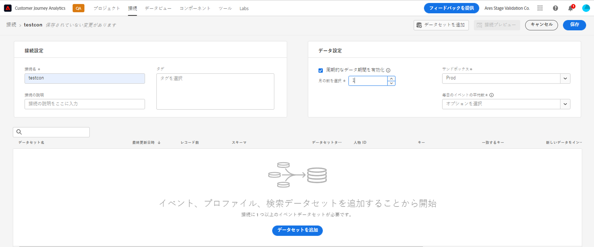
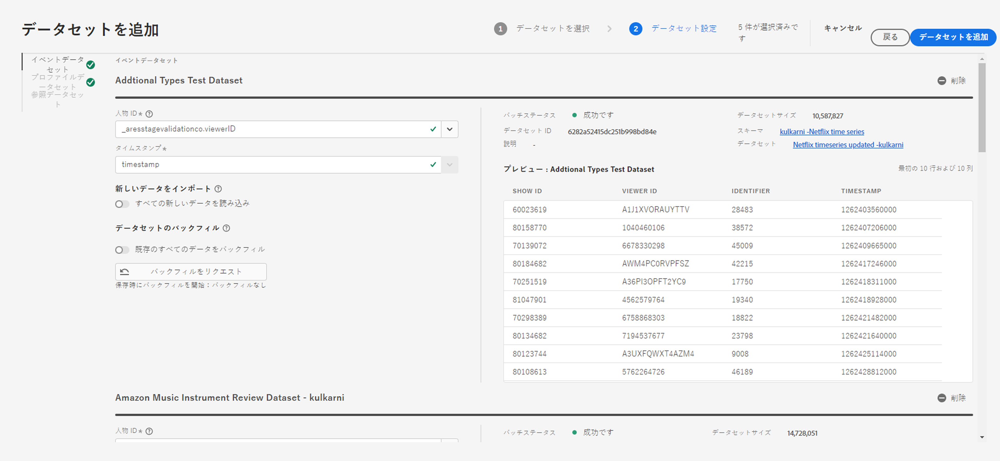
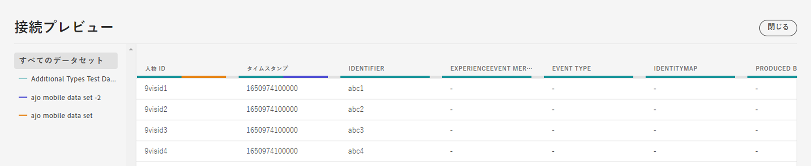
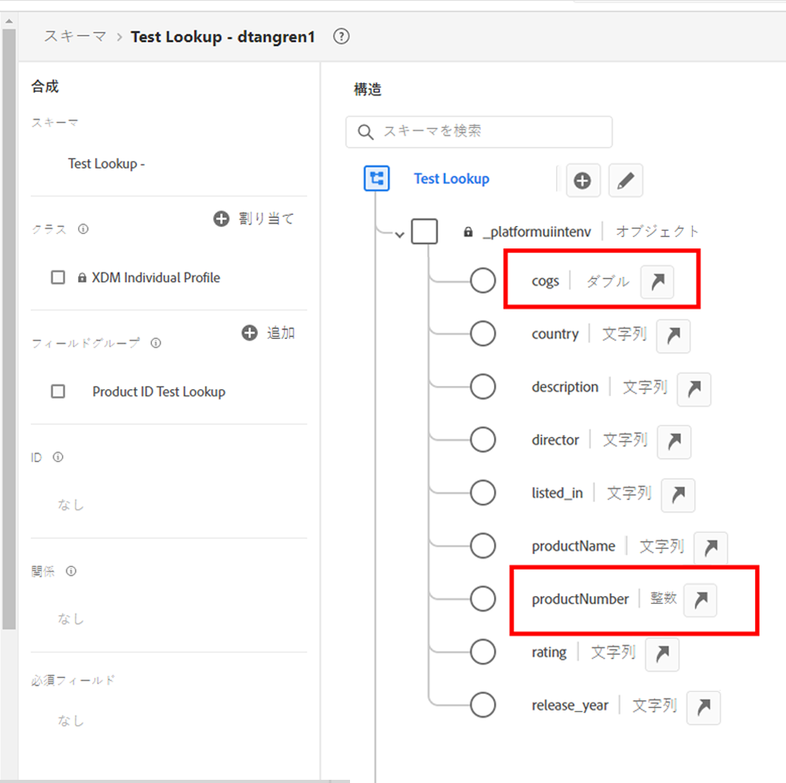
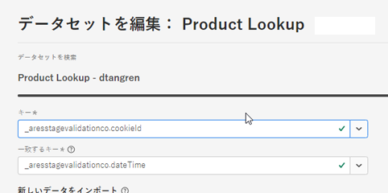

# 接続の作成

新しい接続ワークフローが、最近 Customer Journey Analytics（CJA）で開始されました。新しい接続の作成と編集ワークフローエクスペリエンスでは、すべてのデータセットと接続設定が、支援ワークフローで画面の中央に表示されます。データセットのタイプ、サイズ、スキーマ、データセット ID、バッチステータス、バックフィルステータス、ユーザー ID などの重要な情報を使用して、詳細なデータセット選択、設定、確認できるようにし、接続設定の誤りを防ぎました。次に、新しい機能の概要を示します。

* 接続を作成する際に、周期的なデータ保持時間枠を有効にすることができます。
* 接続からデータセットを追加および削除できます（データセットを削除すると、接続からデータセットが削除され、関連付けられたすべてのデータビューおよび基になる Analysis Workspace プロジェクトに影響します）。
* データセットごとにバックフィルデータを有効にしたり、リクエストしたりできます。
* （例えば、別のバックフィルをリクエストするために）データセットを編集できます。
* データセットごとに既存のデータ読み込むことができます。

>[!VIDEO](https://video.tv.adobe.com/v/343044/?quality=12&learn=on)

## 接続の作成と設定 {#create-connection}

1. CJA で、「**[!UICONTROL 接続]**」タブをクリックします。
1. **[!UICONTROL 新しい接続を作成]**&#x200B;をクリックします。

   

1. 接続を設定します。

   | 設定 | 説明 |
   | --- | --- |
   | **[!UICONTROL 接続名]** | 接続の一意の名前を入力します。 |
   | **[!UICONTROL 接続の説明]** | この接続の目的を記述します。 |
   | **[!UICONTROL サンドボックス]** | 接続を作成するデータセットを含む Experience Platform のサンドボックスを選択します。<p>Adobe Experience Platform は、単一の Platform インスタンスを別々の仮想環境に分割して、デジタルエクスペリエンスアプリケーションの開発と発展を支援する仮想[サンドボックス](https://experienceleague.adobe.com/docs/experience-platform/sandbox/home.html?lang=ja)を提供します。サンドボックスは、データセットを含む「データサイロ」と考えることができます。サンドボックスは、データセットへのアクセスを制御するために使用されます。<p>サンドボックスを選択すると、左側のパネルに、取り出し元となるサンドボックス内のすべてのデータセットが表示されます。 |
   | **[!UICONTROL 周期的なデータ時間枠を有効にする]** | このチェックボックスをオンにすると、CJA データ保持を接続レベルでの月単位（1 か月、3 か月、6 か月など）の周期的な時間枠として定義できます。<p>データ保持は、イベントデータセットのタイムスタンプに基づいており、イベントデータセットにのみ適用されます。適用可能なタイムスタンプがないので、プロファイルまたはルックアップデータセットには、周期的なデータ時間枠設定は存在しません。ただし、接続に（1 つ以上のイベントデータセットに加えて）プロファイルまたはルックアップデータセットが含まれる場合、そのデータは、同じ期間だけ保持されます。<p> 主な利点は、該当する有用なデータのみを保存またはレポートして、有用でなくなった古いデータを削除できるという点です。契約上の上限を超えないようにし、超過コストのリスクを軽減します。<p>デフォルト（オフ）のままにすると、Adobe Experience Platform のデータ保持設定によって保持期間が置き換えられます。Experience Platform に 25 か月分のデータがある場合、CJA はバックフィルを通じて 25 か月分のデータを取得します。Platform でこのうち 10 か月を削除すると、CJA は残りの 15 か月を保持します。 |
   | **[!UICONTROL データセットを追加]**（後述） | データセットリストにデータセットが表示されない場合は、データセットを追加します。 |
   | **[!UICONTROL データセット名]** | Customer Journey Analytics に取り込むデータセットを 1 つ以上選択して、「**[!UICONTROL 追加]**」をクリックします<p>（選択できるデータセットが多数ある場合は、データセットのリスト上部にある「データセットを検索」検索バーを使用して、適切なデータセットを検索できます）。 |
   | **[!UICONTROL 最終更新日]** | イベントデータセットの場合のみ、この設定は、Experience Platform のイベントベースのスキーマからデフォルトのタイムスタンプフィールドに自動的に設定されます。「該当なし」は、このデータセットにデータが含まれていないことを意味します。 |
   | **[!UICONTROL スキーマ]** | これは、Adobe Experience Platform で作成されたデータセットに基づく[スキーマ](https://experienceleague.adobe.com/docs/experience-platform/xdm/schema/composition.html?lang=ja)です。 |
   | **[!UICONTROL データセットタイプ]** | Customer Journey Analytics は、この接続に追加した各データセットに対して、受信するデータに基づいてデータセットタイプを自動的に設定します。データセットには、イベントデータ、プロファイルデータおよびルックアップデータの 3 種類があります。データセットのタイプについて詳しくは、次の表を参照してください。 |
   | **[!UICONTROL ユーザー ID]** | 使用可能な ID のドロップダウンリストからユーザー ID を選択します。これらの ID は、Experience Platform 内のデータセットスキーマで定義されています。ユーザー ID として ID マップを使用する方法については、次を参照してください。<p>重要：選択するユーザー ID がない場合は、スキーマで 1 つ以上のユーザー ID が定義されていないことを意味します。Experience Platform で ID を定義する方法については、[このビデオ](https://www.youtube.com/watch?v=G_ttmGl_LRU)をご覧ください。 |
   | **[!UICONTROL キー]** | データセットのルックアップのみ（as _id など）。 |
   | **[!UICONTROL 一致するキー]** | データセットのルックアップのみ（as _id など）。 |
   | **[!UICONTROL 新しいデータをインポート]** | オンまたはオフに設定します。 |
   | **[!UICONTROL データをバックフィル]** | イベントのタイムスタンプに基づいて、データセット内のデータをバックフィルするようリクエストできます。例えば、過去 7 日間のデータをバックフィルし、適切なユーザー ID を設定して、正しく設定できるよう接続をテストするようリクエストできます。問題がないようであれば、残りのすべてのデータを簡単にバックフィルできます。<p>また、データセット別に新しいデータのインポートを有効にすることもできます。例えば、ルックアップデータの新しいデータのインポートのみを有効にできます。 |
   | **[!UICONTROL バックフィルのステータス]** | バックフィルデータが処理中かどうかを示します。 |

   {style="table-layout:auto"}

## データセットの追加と設定 {#add-dataset}

新しいワークフローを使用すると、接続を作成する際に、Experience Platform データセットを追加できます。

1. 接続設定ダイアログで、「**[!UICONTROL データセットを追加]**」をクリックします。
1. 1 つ以上のデータセットを選択して、「**[!UICONTROL 次へ]**」をクリックします。

   少なくとも 1 つのイベントデータセットが接続に含まれている必要があることに注意してください。
1. 次に、データセットを 1 つずつ設定します。

   

   | 設定 | 説明 |
   | --- | --- |
   | **[!UICONTROL ユーザー ID]** | 使用可能な ID のドロップダウンリストからユーザー ID を選択します。これらの ID は、Experience Platform 内のデータセットスキーマで定義されています。ユーザー ID として ID マップを使用する方法については、次を参照してください。<p>選択するユーザー ID がない場合は、スキーマで 1 つ以上のユーザー ID が定義されていないことを意味します。Experience Platform で ID を定義する方法については、このビデオをご覧ください。 |
   | **[!UICONTROL タイムスタンプ]** | イベントデータセットの場合のみ、この設定は、Experience Platform のイベントベースのスキーマからデフォルトのタイムスタンプフィールドに自動的に設定されます。 |
   | **[!UICONTROL データソースタイプ]** | データソースのタイプは次のとおりです。 [!UICONTROL Web データ], [!UICONTROL モバイルアプリデータ], [!UICONTROL POS データ], [!UICONTROL CRM データ], [!UICONTROL 調査データ], [!UICONTROL コールセンターデータ], [!UICONTROL 製品データ], [!UICONTROL アカウントデータ], [!UICONTROL トランザクションデータ], [!UICONTROL 顧客フィードバックデータ]、および [!UICONTROL その他]. |
   | **[!UICONTROL 新しいデータをインポート]** | 継続的な接続を確立し、この接続のデータセットに追加される新しいデータバッチが自動的にワークスペースに送られるようにする場合は、このオプションを選択します。に設定できます。 [!UICONTROL オン] または [!UICONTROL オフ]. |
   | **[!UICONTROL データセットのバックフィル]** | **[!UICONTROL バックフィルをリクエスト]**&#x200B;をクリックして、履歴データをバックフィルします。<ul><li>各データセットを個別にバックフィルできます。</li><li>接続内のデータセットに追加された新しいデータが優先されるので、この新しいデータの待ち時間が最も短くなります。</li><li>バックフィル（履歴）データのインポートには時間がかかります。待ち時間は、履歴データの量の影響を受けます。</li><li>Adobe Analytics ソースコネクタでは、サイズに関係なく、最大 13 か月分のデータを読み込みます。</li></ul> |
   | **[!UICONTROL バックフィルのステータス]** | 次に、使用可能なステータスインジケーターを示します。<ul><li>成功</li><li>X 個のバックフィルが処理中</li><li>オフ</li></ul> |
   | **[!UICONTROL データセット ID]** | この ID は自動的に生成されます。 |
   | **[!UICONTROL 説明]** | 作成された際に、このデータセットに付与された説明。 |
   | **[!UICONTROL データセットサイズ]** | データセットのサイズ。 |
   | **[!UICONTROL スキーマ]** | これは、Adobe Experience Platform で作成されたデータセットに基づくスキーマです。 |
   | **[!UICONTROL データセット]** | データセットの名前。 |
   | **[!UICONTROL プレビュー]**：`<dataset name>` | 日付、自分の ID および識別子列と共にデータセットをプレビューします。 |
   | **[!UICONTROL 削除]** | 接続全体を削除しなくても、データセットを削除して、ユーザー ID を変更できます。これにより、データの取り込みに伴うコストと、接続全体および関連するデータビューを再作成する煩雑なプロセスが削減されます。 |

   {style="table-layout:auto"}

## 接続プレビュー {#preview}

作成した接続をプレビューするには、接続設定ダイアログの「**[!UICONTROL 接続プレビュー]**」をクリックします。



このプレビューには、接続設定をリストする多数の列が含まれます。表示される列タイプは、個々のデータセットによって異なります。

## データセットタイプ {#dataset-types}

[!UICONTROL Customer Journey Analytics] は、この接続に追加した各データセットに対して、受信するデータに基づいてデータセットタイプを自動的に設定します。

>[!IMPORTANT]
>
>少なくとも 1 つのイベントデータセットを接続の一部として追加する必要があります。

データセットには、[!UICONTROL イベント]データ、[!UICONTROL プロファイル]データおよび[!UICONTROL ルックアップ]データの 3 種類があります。

| データセットタイプ | 説明 | タイムスタンプ | スキーマ | ユーザー ID |
|---|---|---|---|---|
| **[!UICONTROL イベント]** | イベントの時間を表すデータ（web 訪問数、インタラクション、トランザクション、POS データ、調査データ、広告インプレッションデータなど）。例えば、顧客 ID または cookie ID とタイムスタンプを含む一般的なクリックストリームデータを使用できます。イベントデータを使用すると、ユーザー ID として使用する ID を柔軟に設定できます。 | [!UICONTROL Experience Platform] のイベントベースのスキーマからデフォルトのタイムスタンプフィールドへと自動的に設定されます。 | 「時系列」動作を持つ XDM クラスに基づいた組み込みスキーマまたはカスタムイベント。例として、「XDM エクスペリエンスイベント」や「XDM 決定イベント」などがあります。 | 含めるユーザー ID を選択できます。Experience Platform で定義された各データセットスキーマは、1 つ以上の定義済み ID のセットを持つことができ、ID 名前空間に関連付けられます。これらのいずれかを個人 ID として使用できます。例えば、Cookie ID、関連付け ID、ユーザー ID、トラッキングコードなどがあります。 |
| **[!UICONTROL ルックアップ]** | このデータは、イベントまたはプロファイルデータにある値やキーを検索するために使用されます。例えば、イベントデータ内の数値 ID を製品名にマッピングするルックアップデータをアップロードできます。詳しくは、[このユースケース](/help/use-cases/b2b/b2b.md)を参照してください。 | 該当なし | 「XDM 個別プロファイル」クラスを除いて、「レコード」動作を持つ XDM クラスに基づいた、組み込みまたはカスタムのスキーマです。 | 該当なし |
| **[!UICONTROL プロファイル]** | [!UICONTROL イベント]内の訪問者、ユーザーまたは顧客に適用されるデータ。例えば、顧客に関する CRM データをアップロードできます。 | 該当なし | 「XDM 個別プロファイル」クラスに基づいた組み込みスキーマまたはカスタムイベント。 | 含めるユーザー ID を選択できます。[!DNL Experience Platform] 内で定義される各データセットには、1 つ以上の個人 ID セット（Cookie ID、スティッチされた ID、ユーザー ID、トラッキングコードなど）があります。<br>**メモ**：異なる ID のデータセットを含む接続を作成すると、レポートに反映されます。データセットを実際に結合するには、同じユーザー ID を使用する必要があります。 |

{style="table-layout:auto"}

## ルックアップキーおよびルックアップ値としての数値フィールドの使用 {#numeric}

この機能は、文字列ベースのキーフィールドに、コストやマージンなどの数値フィールドを追加したい場合に便利です。この機能を使用すると、キーまたは値として、数値をルックアップの一部にすることができます。ルックアップスキーマでは、例えば、製品名、COGS、キャンペーンマーケティングコスト、マージンなどに数値を関連付けることができます。次に、Adobe Experience Platform のルックアップスキーマの例を示します。



これらの値を指標またはディメンションとして CJA レポートに取り込むことができるようになりました。接続を設定してルックアップデータセットを取り込む際に、データセットを編集して[!UICONTROL キー]と[!UICONTROL 一致するキー]を選択できます。



この接続に基づいてデータビューを設定すると、数値がコンポーネントとしてデータビューに追加されます。このデータビューに基づくプロジェクトでは、これらの数値についてレポートできます。

## ユーザー ID としての ID マップの使用 {#id-map}

Customer Journey Analytics で、ユーザー ID に ID マップを使用する機能がサポートされます。ID マップは、キーと値のペアをアップロードできるマップデータ構造です。キーは ID 名前空間で、値は ID 値を保持する構造体です。アップロードされた各行／イベントに ID マップが存在し、それに応じて各行に対して値が設定されます。

ID マップは、[ExperienceEvent XDM](https://experienceleague.adobe.com/docs/experience-platform/xdm/home.html?lang=ja) クラスに基づくスキーマを使用するデータセットで使用できます。CJA 接続に含めるデータセットを選択する場合、次のオプションを使用して、フィールドをプライマリ ID または ID マップとして選択できます。


「ID マップ」を選択すると、次の 2 つの追加の設定オプションが表示されます。

| オプション | 説明 |
|---|---|
| **[!UICONTROL プライマリ ID 名前空間を使用]** | CJA は行ごとに、primary=true 属性でマークされた ID を ID マップで検索し、その行のユーザー ID として使用します。これは、これがパーティションの Experience Platform で使用される主キーであることを意味します。また、CJA の訪問者 ID としての使用の主な候補でもあります（CJA 接続でのデータセットの設定方法に応じて異なります）。 |
| **[!UICONTROL 名前空間]** | （このオプションは、プライマリ ID 名前空間を使用しない場合にのみ使用できます）。ID 名前空間は [Adobe Experience Platform Identity Service](https://experienceleague.adobe.com/docs/experience-platform/identity/namespaces.html?lang=ja) のコンポーネントで、ID が関連付けられているコンテキストを示します。名前空間を指定すると、CJA は各行の ID マップでこの名前空間キーを検索し、その名前空間の ID を行のユーザー ID として使用します。CJA は、すべての行のデータセット全体をスキャンして、実際に存在する名前空間を特定することはできないので、ドロップダウンにすべての名前空間を示します。データに指定されている名前空間を把握する必要があります。 これは自動検出できません。 |

{style="table-layout:auto"}

### ID マップのエッジケース {#id-map-edge}

次の表に、エッジケースが存在する場合の 2 つの設定オプションと、その処理方法を示します。

| オプション | ID マップに ID が存在しない | 複数の ID、プライマリに指定されているものはない | 複数の ID がプライマリとして指定されている | 単一の ID、プライマリか非プライマリか指定されている | ID がプライマリとして指定されている無効な名前空間 |
|---|---|---|---|---|---|
| 「**[!UICONTROL プライマリ ID 名前空間を使用]」がオンになっている** | 行は CJA によってドロップされます。 | プライマリ ID が指定されていないので、行は CJA によってドロップされます。 | すべての名前空間の下で、プライマリと指定されたすべての ID がリストに抽出されます。その後、アルファベット順に並べ替えられます。この新しい並べ替えでは、最初の ID を持つ最初の名前空間がユーザー ID として使用されます。 | 単一の ID がユーザー ID として使用されます。 | 名前空間が無効（AEP に存在しない）場合でも、CJA はその名前空間のプライマリ ID をユーザー ID として使用します。 |
| 「**[!UICONTROL 特定の ID マップ名前空間]」が選択されている** | 行は CJA によってドロップされます。 | 選択した名前空間に属するすべての ID がリストに抽出され、最初の ID がユーザー ID として使用されます。 | 選択した名前空間に属するすべての ID がリストに抽出され、最初の ID がユーザー ID として使用されます。 | 選択した名前空間に属するすべての ID がリストに抽出され、最初の ID がユーザー ID として使用されます。 | 選択した名前空間に属するすべての ID がリストに抽出され、最初の ID がユーザー ID として使用されます。（接続の作成時には有効な名前空間のみを選択できるので、無効な名前空間／ID をユーザー ID として使用することはできません）。 |

{style="table-layout:auto"}

## 毎日のイベントの平均数を計算する

この計算は、接続内のすべてのデータセットに対して行う必要があります。

1. [Adobe Experience Platform Query Services](https://experienceleague.adobe.com/docs/experience-platform/query/home.html?lang=ja) に移動して、新しいクエリを作成します。

   クエリは次のようになります：

   ```
   Select AVG(A.total_events) from (Select DISTINCT COUNT (*) as total_events, date(TIMESTAMP) from analytics_demo_data GROUP BY 2 Having total_events>0) A;
   ```

   この例では、「analytics_demo_data」がデータセットの名前です。

1. `Show Tables` クエリを実行すると、AEP に存在するすべてのデータセットが表示されます。
