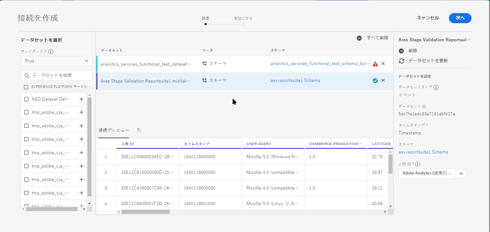
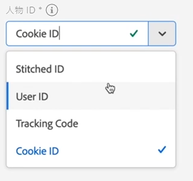
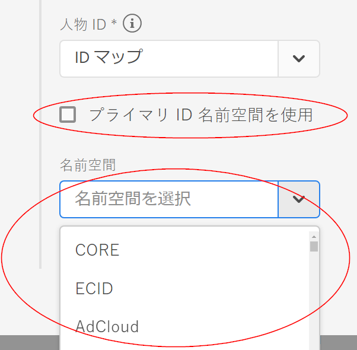
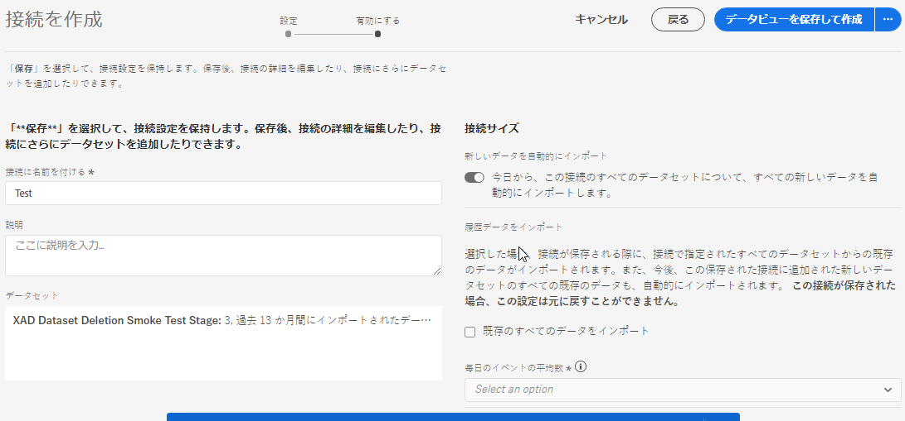

# 接続の作成

接続を使用すれば、[!DNL Adobe Experience Platform] のデータセットを [!UICONTROL Workspace] に統合できます。[!DNL Experience Platform] データセットに関するレポートを作成するには、まず [!DNL Experience Platform] と [!UICONTROL Workspace] のデータセット間で接続を確立する必要があります。

ビデオの概要については、[こちら](https://docs.adobe.com/content/help/en/platform-learn/tutorials/cja/connecting-customer-journey-analytics-to-data-sources-in-platform.html)をクリックしてください。

>[!IMPORTANT]
>
> 複数の [!DNL Experience Platform] データセットを 1 つの接続に組み合わせることができます。

## サンドボックスとデータセットの選択

1. [https://analytics.adobe.com](https://analytics.adobe.com) に移動します。

1. 「**[!UICONTROL 接続]**」タブをクリックします。

1. 右上の「**[!UICONTROL 新しい接続を作成]**」をクリックします。

   

1. 接続を作成するデータセットを含む Experience Platform のサンドボックスを選択します。

   Adobe Experience Platform は、単一の Platform インスタンスを別々の仮想環境に分割して、デジタルエクスペリエンスアプリケーションの開発と発展を支援する仮想[サンドボックス](https://docs.adobe.com/content/help/ja-JP/experience-platform/sandbox/home.html)を提供します。サンドボックスは、データセットを含む「データサイロ」と考えることができます。サンドボックスは、データセットへのアクセスを制御するために使用します。サンドボックスを選択すると、左側のパネルに、取り出し元となるサンドボックス内のすべてのデータセットが表示されます。

   >[!IMPORTANT]
   >
   >サンドボックス全体のデータにアクセスすることはできません。つまり、同じサンドボックス内にあるデータセットのみを組み合わせることができます。

1. [!UICONTROL Customer Journey Analytics] に取り込むデータセットを 1 つ以上選択し、［**[!UICONTROL 追加]**］をクリックします

   （選択できるデータセットが多数ある場合は、データセットのリスト上部にある&#x200B;**[!UICONTROL データセットの検索]**&#x200B;検索バーを使用して、適切なデータセットを検索できます）。

## データセットの設定

右側で、追加したデータセットを設定できるようになりました。

1. **[!UICONTROL データセットタイプ]**：次に、この接続に追加した各データセットに対し、[!UICONTROL Customer Journey Analytics] は受信するデータに基づいてデータセットのタイプを自動的に設定します。

   データセットには、[!UICONTROL イベント]データ、[!UICONTROL プロファイル]データおよび[!UICONTROL ルックアップ]データの 3 種類があります。

   | データセットタイプ | 説明 | タイムスタンプ | スキーマ | ユーザー ID |
   |---|---|---|---|---|
   | [!UICONTROL イベント] | イベントの時間を表すデータ（Web 訪問数、インタラクション、トランザクション、POS データ、調査データ、広告インプレッションデータなど）。例えば、顧客 ID または cookie ID とタイムスタンプを含む一般的なクリックストリームデータを使用できます。イベントデータを使用すると、ユーザー ID として使用する ID を柔軟に設定できます。 | [!UICONTROL Experience Platform] のイベントベースのスキーマからデフォルトのタイムスタンプフィールドへと自動的に設定されます。 | 「時系列」動作を持つ XDM クラスに基づいた組み込みスキーマまたはカスタムイベント。例として、「XDM エクスペリエンスのイベント」や「XDM 決定イベント」などがあります。 | 含める個人 ID を選択できます。Experience Platform で定義された各データセットスキーマは、1 つ以上の定義済み ID のセットを持つことができ、ID 名前空間に関連付けられます。これらのいずれかを個人 ID として使用できます。例えば、Cookie ID、関連付け ID、ユーザー ID、トラッキングコードなどがあります。 |
   | [!UICONTROL 参照] | （従来の Adobe Analytics の分類ファイルに類似）このデータは、イベントまたはプロファイルデータにある値やキーを検索するために使用されます。例えば、イベントデータ内の数値 ID を製品名にマッピングするルックアップデータをアップロードできます。詳しくは、[この使用例](/help/use-cases/b2b.md)をご覧ください。 | 該当なし | 「XDM 個別プロファイル」クラスを除いて、「レコード」動作を持つ XDM クラスに基づいた、組み込みまたはカスタムのスキーマです。 | 該当なし |
   | [!UICONTROL プロファイル] | 変更がなく、一時的でない属性の場合は[!UICONTROL 顧客属性]と似ています。[!UICONTROL イベント]内の訪問者、ユーザーまたは顧客に適用されるデータ。例えば、顧客に関する CRM データをアップロードできます。 | 該当なし | 「XDM 個別プロファイル」クラスに基づいた組み込みスキーマまたはカスタムイベント。 | 含める個人 ID を選択できます。[!DNL Experience Platform] 内で定義される各データセットには、1 つ以上の個人 ID セット（Cookie ID、スティッチされた ID、ユーザー ID、トラッキングコードなど）があります。 **メモ**：異なる ID のデータセットを含む接続を作成すると、レポートに反映されます。データセットを実際に結合するには、同じユーザー ID を使用する必要があります。 |

1. **[!UICONTROL データセット ID]**：この ID は自動的に生成されます。

1. **[!UICONTROL タイムスタンプ]**：イベントデータセットの場合のみ、この設定は、[!UICONTROL Experience Platform] のイベントベースのスキーマにある、デフォルトのタイムスタンプフィールドへと自動的に設定されます。

1. **[!UICONTROL スキーマ]**：これは、Adobe Experience Platform で作成されたデータセットに基づく[スキーマ](https://docs.adobe.com/content/help/ja-JP/experience-platform/xdm/schema/composition.html)です。

1. **[!UICONTROL 個人 Id]**：使用可能な ID のドロップダウンリストからユーザー ID を選択します。これらの ID は、Experience Platform 内のデータセットスキーマで定義されています。ユーザー ID として ID マップを使用する方法については、以下を参照してください。

   >[!IMPORTANT]
   >
   >選択するユーザー ID がない場合は、スキーマで 1 つ以上のユーザー ID が定義されていないことを意味します。Experience Platform で ID を定義する方法については[このビデオ](https://youtu.be/G_ttmGl_LRU)をご覧ください。

1. 「**[!UICONTROL 次へ]** 」をクリックして、「[!UICONTROL 接続を有効にする]」ダイアログに移動します。

### ユーザー ID としての ID マップの使用

Customer Journey Analytics で、ユーザー ID に ID マップを使用する機能がサポートされるようになりました。ID マップは、キー>値のペアをアップロードできるマップデータ構造です。キーは ID 名前空間で、値は ID 値を保持する構造体です。アップロードされた各行／イベントに ID マップが存在し、それに応じて各行に対して値が設定されます。

ID マップは、[ExperienceEvent XDM](https://docs.adobe.com/content/help/ja-JP/experience-platform/xdm/home.html) クラスに基づくスキーマを使用するデータセットで使用できます。CJA 接続に含めるデータセットを選択する場合、次のオプションを使用して、フィールドをプライマリ ID または ID マップとして選択できます。

「ID マップ」を選択すると、次の 2 つの追加の設定オプションが表示されます。

| オプション | 説明 |
|---|---|
| [!UICONTROL プライマリ ID 名前空間を使用] | CJA は行ごとに、primary=true 属性でマークされた ID を ID マップで検索し、その行のユーザー ID として使用します。これは、これがパーティションの Experience Platform で使用される主キーであることを意味します。また、CJA の訪問者 ID としての使用の主な候補でもあります（CJA 接続でのデータセットの設定方法に応じて異なります）。 |
| [!UICONTROL 名前空間] | （このオプションは、プライマリ ID 名前空間を使用しない場合にのみ使用できます）。ID 名前空間は [Adobe Experience Platform Identity Service](https://docs.adobe.com/content/help/ja-JP/experience-platform/identity/namespaces.html) のコンポーネントで、ID が関連付けられているコンテキストを示します。名前空間を指定すると、CJA は各行の ID マップでこの名前空間キーを検索し、その名前空間の ID を行のユーザー ID として使用します。CJA は、すべての行のデータセット全体をスキャンして、実際に存在する名前空間を特定することはできないので、ドロップダウンにすべての名前空間を示します。データに指定されている名前空間を把握する必要があります。 これは自動検出できません。 |

### ID マップのエッジケース

次の表に、エッジケースが存在する場合の 2 つの設定オプションと、その処理方法を示します。

| オプション | ID マップに ID が存在しない | プライマリとして指定されている ID が存在しない | 複数の ID がプライマリとして指定されている | 単一の ID がプライマリとして指定されている | ID がプライマリとして指定されている無効な名前空間 |
|---|---|---|---|---|---|
| **「プライマリ ID 名前空間を使用」がオンになっている** | 行は CJA によってドロップされます。 | プライマリ ID が指定されていないので、行は CJA によってドロップされます。 | すべての名前空間の下で、プライマリと指定されたすべての ID がリストに抽出されます。その後、アルファベット順に並べ替えられます。 この新しい並べ替えでは、最初の ID を持つ最初の名前空間がユーザー ID として使用されます。 | プライマリとして指定された単一の ID がユーザー ID として使用されます。 | 名前空間が無効（AEP に存在しない）場合でも、CJA はその名前空間のプライマリ ID をユーザー ID として使用します。 |
| **特定の ID マップ名前空間が選択されている** | 行は CJA によってドロップされます。 | 選択した名前空間に属するすべての ID がリストに抽出され、最初の ID がユーザー ID として使用されます。 | 選択した名前空間に属するすべての ID がリストに抽出され、最初の ID がユーザー ID として使用されます。 | 選択した名前空間に属するすべての ID がリストに抽出され、最初の ID がユーザー ID として使用されます。 | 選択した名前空間に属するすべての ID がリストに抽出され、最初の ID がユーザー ID として使用されます。（接続の作成時には有効な名前空間のみを選択できるので、無効な名前空間／ID をユーザー ID として使用することはできません）。 |

## 接続を有効化

1. 接続を有効にするには、接続全体（接続にあるすべてのデータセット）について次の設定を定義します。

   | オプション | 説明 |
   | --- | --- |
   | [!UICONTROL 名前接続] | 接続にわかりやすい名前を付けます。名前を指定しないと接続を保存できません。 |
   | [!UICONTROL 説明] | この接続を他の接続と区別するための詳細を追加します。 |
   | [!UICONTROL データセット] | この接続に含まれるデータセット。 |
   | [!UICONTROL 今日から、この接続のデータセットについて、すべての新しいデータを自動的にインポートします。] | 継続的な接続を確立し、この接続のデータセットに追加される新しいデータバッチが自動的に [!UICONTROL Workspace] へと送られるようにする場合は、このオプションを選択します。 |
   | [!UICONTROL 既存のすべてのデータをインポート] | このオプションを選択して接続を保存すると、この接続にあるすべてのデータセットについて、[!DNL Experience Platform] の既存（履歴）データがすべてインポートされるかバックフィルされます。今後、この保存済みの接続に追加された新しいデータセットの既存の履歴データもすべて自動的にインポートされるようになります。このあとの[履歴データのバックフィル](https://docs.adobe.com/content/help/ja-JP/analytics-platform/using/cja-connections/create-connection.html#backfill-historical-data)も参照してください。 **この接続を保存すると、この設定は変更できなくなります。** |
   | [!UICONTROL 毎日のイベントの平均数] | 接続にあるすべてのデータセットについて、インポートする毎日のイベント（新しいデータ&#x200B;**と**&#x200B;バックフィルデータ）の平均数を指定する必要があります。ドロップダウンメニューから 1 つのオプションを選択します。これにより、このデータに十分な領域を割り当てることができます。 会社で毎日インポートされるイベントの平均数が不明な場合は、[Adobe Experience Platform クエリサービス](https://docs.adobe.com/content/help/ja-JP/experience-platform/query/home.html)で簡単な SQL クエリを実行して調べることができます。 以下の「日別イベント数の平均計算」を参照してください。 |

1. 「**[!UICONTROL データビューを保存して作成]**」をクリックします。ドキュメントについては、[データビューの作成](/help/data-views/create-dataview.md)を参照してください。

### 履歴データのバックフィル

「**[!UICONTROL 既存のすべてのデータをインポート]**」を実行すると、履歴データをバックフィルできます。次の点に注意してください。

* バックフィル（履歴データのインポート）の制限が解除されました。以前は、ユーザー自身でバックフィルできるのは最大 25 億行までで、それ以上バックフィルするには、エンジニアリングチームの関与が必要でした。今後は、制限なく独自にデータをバックフィルできます。
* 接続内のデータセットに追加された新しいデータが優先されるので、この新しいデータの待ち時間が最も短くなります。
* バックフィル（履歴）データのインポートには時間がかかります。待ち時間は、現在の履歴データの量と、選択した「**[!UICONTROL 毎日のイベントの平均数]**」設定の両方に左右されます。例えば、1 日あたり 10 億行を超えるデータと 3 年分の履歴データがある場合は、インポートに数週間かかる可能性があります。一方、1 日あたり 100 万行未満のデータと 1 週間分の履歴データがある場合は、1 時間未満で済みます。
* バックフィルは、各データセットに個別に適用されるのではなく、接続全体に適用されます。
* [Adobe Analytics コネクタ](https://docs.adobe.com/content/help/en/platform-learn/tutorials/data-ingestion/ingest-data-from-adobe-analytics.html)では、サイズに関係なく、最大 13 か月分のデータをインポートします。

### 日別イベント数の平均を計算

この計算は、接続内のすべてのデータセットに対して行う必要があります。

1. 移動先 [Adobe Experience Platformクエリサービス](https://docs.adobe.com/content/help/en/experience-platform/query/home.html) 新しいクエリを作成します。

1. クエリは次のようになります。 `Select AVG(A.total_events) from (Select DISTINCT COUNT (*) as total_events, date(TIMESTAMP) from analytics_demo_data GROUP BY 2 Having total_events>0) A;`

* この例では、「analytics_demo_data」がデータセットの名前です。
* を実行します。 `Show Tables` AEPに存在するすべてのデータセットを表示するクエリ。
