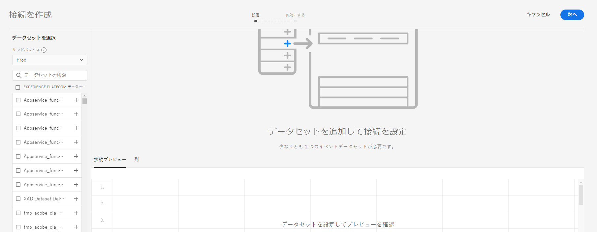

# 接続の作成

A connection lets you integrate datasets from [!DNL Adobe Experience Platform] into [!UICONTROL Workspace]. In order to report on [!DNL Experience Platform] datasets, you first have to establish a connection between datasets in [!DNL Experience Platform] and [!UICONTROL Workspace].

ビデオの概要については、[こちら](https://docs.adobe.com/content/help/en/platform-learn/tutorials/cja/connecting-customer-journey-analytics-to-data-sources-in-platform.html)をクリックしてください。

>[!IMPORTANT]
>
> 複数の [!DNL Experience Platform] データセットを 1 つの接続に組み合わせることができます。

1. [https://analytics.adobe.com](https://analytics.adobe.com) に移動します。

1. Click the **[!UICONTROL Connections]** tab.

1. 右上の **[!UICONTROL 「新しい接続を作成]** 」をクリックします。

   

1. 接続を作成するデータセットを含むExperience Platformーのサンドボックスを選択します。

   Adobe Experience Platform provides [sandboxes](https://docs.adobe.com/content/help/ja-JP/experience-platform/sandbox/home.html) which partition a single Platform instance into separate virtual environments to help develop and evolve digital experience applications. サンドボックスは、データセットを含む「データサイロ」と考えることができます。 サンドボックスは、データセットへのアクセスを制御するために使用します。 サンドボックス全体のデータにアクセスすることはできません。 サンドボックスを選択すると、左側のレールに、取り出し元となるサンドボックス内のすべてのデータセットが表示されます。

1. [!UICONTROL Customer Journey Analyticsに取り込む1つ以上のデータセットを選択し] 、 ****&#x200B;追加をクリックします。

   (If you have a lot of datasets to choose from, you can search for the right one(s) using the **[!UICONTROL Search datasets]** search bar above the list of datasets.)

## データセットの設定

右側で、追加したデータセットを設定できるようになりました。

1. **[!UICONTROL データセットタイプ]**: この接続に追加した各データセットに対して、 [!UICONTROL Customer Journey Analytics] は、受信するデータに基づいてデータセットのタイプを自動的に設定します。

   There are 3 different dataset types: [!UICONTROL Event] data, [!UICONTROL Profile] data, and [!UICONTROL Lookup] data.

   | データセットタイプ | 説明 | タイムスタンプ | スキーマ | ユーザー ID |
   |---|---|---|---|---|
   | [!UICONTROL イベント] | イベントの時間を表すデータ（Web 訪問数、インタラクション、トランザクション、POS データ、調査データ、広告インプレッションデータなど）。例えば、顧客 ID または cookie ID とタイムスタンプを含む一般的なクリックストリームデータを使用できます。イベントデータを使用すると、ユーザー ID として使用する ID を柔軟に設定できます。 | [UICONTROL Experience Platform] のイベントベースのスキーマからデフォルトのタイムスタンプフィールドへと自動的に設定されます。 | 「時系列」動作を持つ XDM クラスに基づいた組み込みスキーマまたはカスタムイベント。例として、「XDM エクスペリエンスのイベント」や「XDM 決定イベント」などがあります。 | 含める個人 ID を選択できます。Experience Platform で定義された各データセットスキーマは、1 つ以上の定義済み ID のセットを持つことができ、ID 名前空間に関連付けられます。これらのいずれかを個人 ID として使用できます。例えば、Cookie ID、関連付け ID、ユーザー ID、トラッキングコードなどがあります。 |
   | [!UICONTROL 参照] | 分類ファイルと似ています。このデータは、イベントまたはプロファイルデータにある値やキーを検索するために使用されます。例えば、イベントデータ内の数値 ID を製品名にマッピングする参照データをアップロードできます。 | 該当なし | 「XDM 個別プロファイル」クラスを除いて、「レコード」動作を持つ XDM クラスに基づいた、組み込みまたはカスタムのスキーマです。 | 該当なし |
   | [!UICONTROL プロファイル] | Analogous to [!UICONTROL Customer Attributes] - for non-changing and non-temporal attributes. Data that is applied to your visitors, users, or customers in the [!UICONTROL Event] data. 例えば、顧客に関する CRM データをアップロードできます。 | 該当なし | 「XDM 個別プロファイル」クラスに基づいた組み込みスキーマまたはカスタムイベント。 | 含める個人 ID を選択できます。[!DNL Experience Platform] 内で定義される各データセットには、1 つ以上の個人 ID セット（Cookie ID、スティッチされた ID、ユーザー ID、トラッキングコードなど）があります。 **メモ&#x200B;**：異なる ID のデータセットを含む接続を作成すると、レポートに反映されます。データセットを実際に結合するには、同じユーザー ID を使用する必要があります。 |

1. **[!UICONTROL データセットID]**: このIDは自動的に生成されます。

1. **[!UICONTROL タイムスタンプ]**: コンテンツをここに追加

1. **[!UICONTROL スキーマ]**: これは、Adobe Experience Platformで作成されたデータセットに基づく [スキーマ](https://docs.adobe.com/content/help/ja-JP/experience-platform/xdm/schema/composition.html) です。

1. **[!UICONTROL 個人ID]**: 使用可能なIDのドロップダウンリストから人物IDを選択します。 これらのIDは、Experience Platform内のデータセットスキーマで定義されています。 Person IDとしてIDマップを使用する方法については、以下を参照してください。

   >[!IMPORTANT]
   >
   >選択する個人IDがない場合は、スキーマで1つ以上の個人IDが定義されていないことを意味します。 Experience Platform [でIDを定義する方法についての表示](https://youtu.be/G_ttmGl_LRU) 。

1. 「 **[!UICONTROL 次へ]** 」をクリックして [!UICONTROL 、「接続を] 有効にする」ダイアログに移動します。

### 個人IDとしてのIDマップの使用

Customer Journey Analyticsで、Person IDにIDマップを使用する機能がサポートされるようになりました。 IDマップは、キー>値のペアをアップロードできるマップデータ構造です。 キーはID名前空間で、値はID値を保持する構造体です。 アップロードされた各行/イベントにIDマップが存在し、それに応じて各行に対して値が設定されます。

IDマップは、ExperienceEvent XDM  クラスに基づくスキーマを使用するデータセットで使用できます。 CJA接続に含めるデータセットを選択する場合、次のオプションを使用して、フィールドをプライマリIDまたはIDマップとして選択できます。

「Identity Map」を選択すると、次の2つの追加の設定オプションが表示されます。

| オプション | 説明 |
|---|---|
| [!UICONTROL プライマリ ID 名前空間を使用] | これにより、CJAは行ごとに、primary=true属性でマークされたIDをIDマップで検索し、その行の個人IDとして使用します。 これは、これが、パーティションのExperience Platformで使用される主キーであることを意味します。 また、CJAの訪問者IDとしての使用の主な候補でもあります（CJA接続でのデータセットの設定方法に応じて異なります）。 |
| [!UICONTROL 名前空間] | (このオプションは、プライマリID名前空間を使用しない場合にのみ使用できます)。 Identity namespaces are a component of [Adobe Experience Platform Identity Service](https://docs.adobe.com/content/help/en/experience-platform/identity/namespaces.html) that serve as indicators of the context to which an identity relates. 名前空間を指定すると、CJAは各行のIDマップでこの名前空間キーを検索し、その名前空間のIDを行の個人IDとして使用します。 CJAは、すべての行のデータセット全体をスキャンして、実際に存在する名前空間を特定することはできないので、ドロップダウンにすべての名前空間を示します。 データに指定されている名前空間を把握する必要があります。 これは自動検出できません。 |

### IDマップのエッジケース

次の表に、エッジケースが存在する場合の2つの設定オプションと、その処理方法を示します。

| オプション | IDマップにIDが存在しない | プライマリIDとしてマークされていない | 複数のIDがプライマリとしてマークされる | 単一のIDがプライマリとしてマークされる | IDがプライマリとしてマークされた無効な名前空間 |
|---|---|---|---|---|---|
| **「プライマリID名前空間を使用」がオン** | 行はCJAによってドロップされます。 | プライマリIDが指定されていないので、行はCJAによってドロップされます。 | すべての名前空間の下で、プライマリとマークされたすべてのIDがリストに抽出されます。 その後、アルファベット順に並べ替えられます。 この新しい並べ替えでは、最初のIDを持つ最初の名前空間が人物IDとして使用されます。 | プライマリとしてマークされた単一のIDが個人IDとして使用されます。 | 名前空間が無効（AEPに存在しない）場合でも、CJAはその名前空間のプライマリIDを個人IDとして使用します。 |
| **特定のIDマップ名前空間が選択されました** | 行はCJAによってドロップされます。 | 選択した名前空間に属するすべてのIDがリストに抽出され、最初のIDが人物IDとして使用されます。 | 選択した名前空間に属するすべてのIDがリストに抽出され、最初のIDが人物IDとして使用されます。 | 選択した名前空間に属するすべてのIDがリストに抽出され、最初のIDが人物IDとして使用されます。 | 選択した名前空間に属するすべてのIDがリストに抽出され、最初のIDが人物IDとして使用されます。 (「Connection creation（接続の作成時）」で有効な名前空間のみを選択できるので、無効な名前空間/IDをPerson IDとして使用することはできません) |

## 接続を有効化

1. 接続を有効にするには、次の設定を定義します。

   | オプション | 説明 |
   |---|---|
   | [!UICONTROL 名前接続] | 接続にわかりやすい名前を付けます。名前を指定しないと接続を保存できません。 |
   | [!UICONTROL 説明] | この接続を他の接続と区別するための詳細を追加します。 |
   | [!UICONTROL データセット] | この接続に含まれるデータセット。 |
   | [!UICONTROL この接続内のすべての新しいデータセットを、今日から自動的にインポートします。] | Select this option if you want to establish an ongoing connection, so that any new data batches that get added to the datasets in this connection automatically flow into [!UICONTROL Workspace]. |
   | [!UICONTROL 既存のすべてのデータをインポート] | このオプションを選択して接続を保存すると、この接続にあるすべてのデータセットについて、[!DNL Experience Platform] の既存（履歴）データがすべてへと読み込まれます。今後、この保存済みの接続に追加された新しいデータセットの既存の履歴データもすべて自動的に読み込まれるようになります。 **この接続を保存すると、この設定は変更できなくなります。** |

   **次の点に注意してください。**

   * 接続内にあるすべてのデータセットの履歴データを累積したサイズが 15 億行を超える場合、エラーメッセージに、この量の履歴データを読み込めない旨が示されます。ただし、10 億行の履歴データを含むデータセットを追加し、そのデータを読み込んでから、1週間後に同じサイズの別のデータセットを追加して履歴データを読み込むと、機能します。
   * 接続内のデータセットに追加される新しいデータを優先させるので、このデータの待ち時間は最も短くなります。
   * バックフィル（履歴）データの読み込みには時間がかかります。

1. 「**[!UICONTROL 保存]**」をクリックします。

ワークフローの次の手順は、[データ表示の作成](/help/data-views/create-dataview.md)です。
