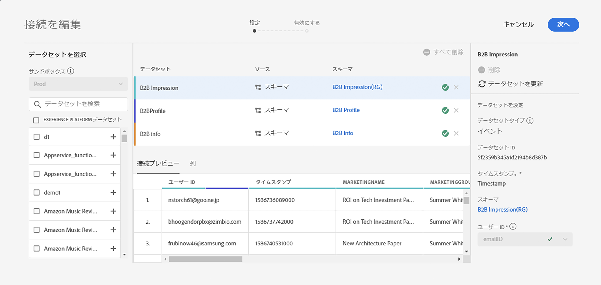
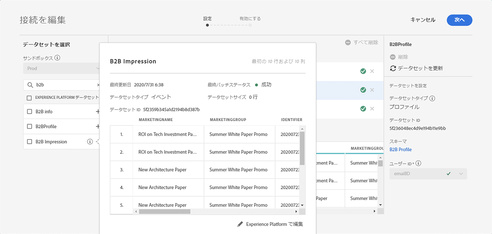
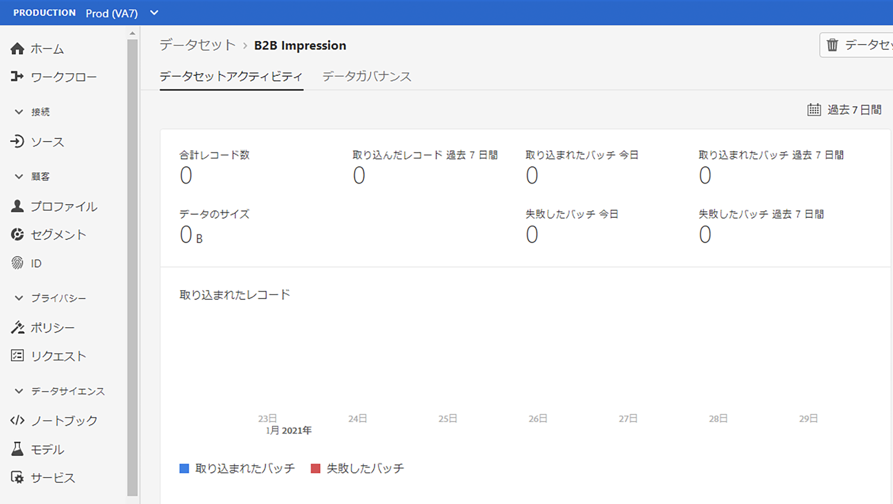
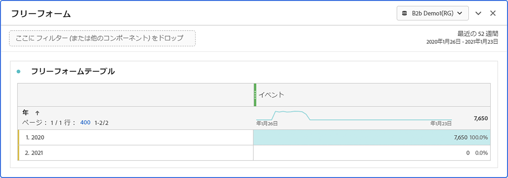

# 接続サイズの見積もり

現在[!UICONTROL Customer Journey Analytics]にあるデータの行数を知る必要がある場合があります。 このトピックの目的は、現在の[!UICONTROL Customer Journey Analytics]の使用状況を報告する方法を示すことです。

1. [!UICONTROL Customer Journey Analytics]で、「**[!UICONTROL 接続]**」タブをクリックします。
1. [!UICONTROL 接続]を編集画面で、使用状況/接続のサイズを決定する接続を選択します。

   

1. 左側のナビゲーションバーから、接続に使用するデータセットを選択します。 この場合、これは「B2Bインプレッション」データセットです。

   

1. 名前の横にある青い(i)アイコン（情報）をクリックします。 データセットの行数は3.8kで、イベント数は3.8kです。 また、行数を正確に指定するには、プレビューテーブルの下の&#x200B;**[!UICONTROL Experience Platform]**&#x200B;で編集をクリックします。 これにより、[!UICONTROL Adobe Experience Platform]のデータセットにリダイレクトされます。

   

1. このデータセットの&#x200B;**[!UICONTROL 合計レコード数]**&#x200B;は3.83kレコードで、データのサイズは388.59 KBです。

1. 接続内の他のデータセットに対して手順1 ～ 5を繰り返し、レコード数/行数を追加します。 最後の集計値は、接続の使用状況指標です。これは、[!UICONTROL Adobe Experience Platform]から取り込む接続のデータセットの行数です。

## 取り込む行数の確認

CJAで実際に取り込まれるイベントの数は、接続設定によって異なります。 また、誤った個人IDを選択した場合や、データセット内の一部の行でこのIDを使用できない場合は、[!UICONTROL Customer Journey Analytics]はそれらの行を無視します。 取り込むイベントの実際の行を確認するには、次の手順を実行します。

1. 接続を保存したら、フィルターを一切使用せずに、同じ接続のデータ表示を作成します。
1. Workspaceプロジェクトを作成し、正しいデータ表示を選択します。 フリーフォームテーブルを作成し、**[!UICONTROL 年]**&#x200B;ディメンションを持つ&#x200B;**[!UICONTROL イベント]**&#x200B;指標をドラッグ&amp;ドロップします。 日付選択カレンダーから十分な大きさの日付範囲を選択し、接続にすべてのデータをカプセル化します。 これにより、[!UICONTROL Customer Journey Analytics]に取り込まれているイベントの数を確認できます。

   

   >[!NOTE]
   >
   >これにより、イベントデータセットから取り込まれているイベントの数を確認できます。 プロファイルおよび参照タイプのデータセットは含まれません。 プロファイルおよび参照データセットの場合は、手順1 ～ 3に従って数値を追加し、この接続の合計行数を取得します。

## 診断の不一致

場合によっては、接続で取り込まれるイベントの合計数が、AEPのデータセットの行数と異なることに気付くことがあります。 この場合、データセット「B2B Impression」の行数は7650行ですが、データセットのAEPには3830行あります。 不一致が発生する理由はいくつかあり、次の手順を実行して診断できます。

1. このディメンションを&#x200B;**[!UICONTROL プラットフォームデータセットID]**&#x200B;で分類すると、同じサイズで異なる&#x200B;**[!UICONTROL プラットフォームデータセットID]**&#x200B;を持つ2つのデータセットが表示されます。 各データセットには3825件のレコードがあります。 つまり、[!UICONTROL Customer Journey Analytics]は、個人IDの欠落またはタイムスタンプの欠落が原因で、5件のレコードを無視しました。

   

1. さらに、[!UICONTROL Adobe Experience Platform]をチェックインすると、IDが「5f21c12b732044194bffc1d0」のデータセットがないので、誰かが最初の接続の作成時に[!UICONTROL Adobe Experience Platform]からこのデータセットを削除しました。 その後、[!UICONTROL Customer Journey Analytics]に再び追加されましたが、[!UICONTROL Adobe Experience Platform]によって、異なる[!UICONTROL プラットフォームデータセットID]が生成されました。

   [!UICONTROL Customer Journey Analytics]と[!UICONTROL Adobe Experience Platform]の[データセットと接続の削除](https://experienceleague.adobe.com/docs/analytics-platform/using/cja-overview/cja-faq.html?lang=en#implications-of-deleting-data-components)の意味について詳しくお読みください。
