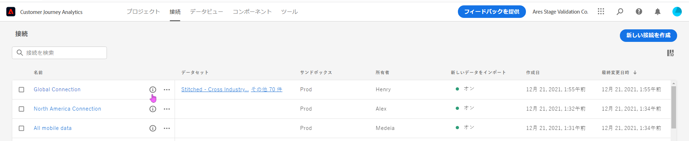
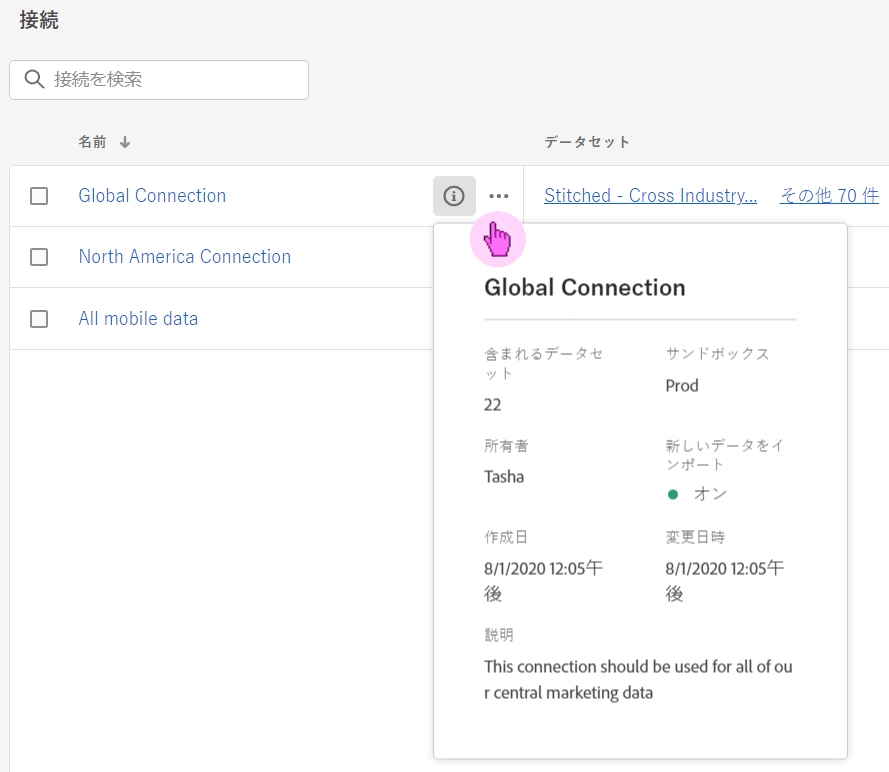
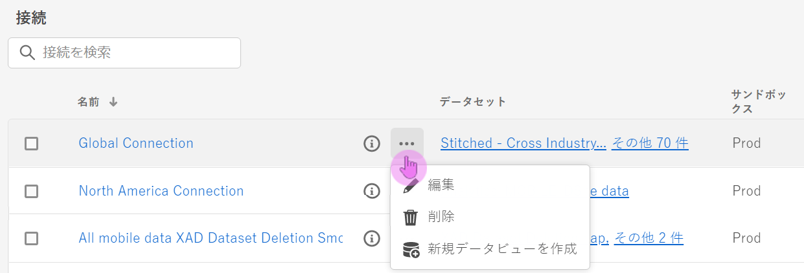
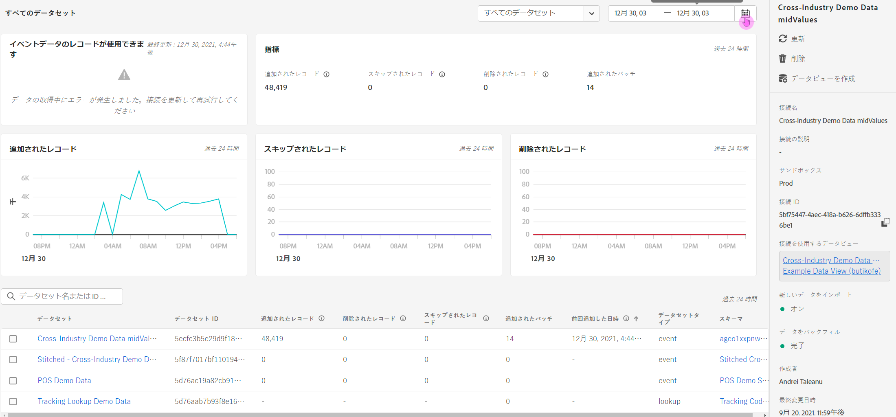

# 接続の管理

管理者ユーザーは、[1 つまたは複数の接続を作成](/help/connections/create-connection.md)したら、[!UICONTROL 接続]マネージャーでそれらを管理できます。接続エクスペリエンスの最新の更新では、接続の詳細ページに重要な機能が 2 つ追加されました。詳しくは、このページの後半で説明します。

* **接続データセットと取り込みプロセスのステータス**&#x200B;を確認できます。このステータスチェックを使用すると、データが使用可能になったタイミングを把握して、Analysis Workspace に移動して分析を開始できます。

* これにより、設定ミスに起因する&#x200B;**データの相違を識別**&#x200B;できます。欠落している行があるか。ある場合、欠落している行とその理由は何か。接続の設定の誤りが原因で CJA のデータが欠落したのか。

>[!NOTE]
> この機能は、2021年9月20日（PT）に一般公開される予定です。

## 接続マネージャー {#connections-manager}

接続マネージャーでは、次の操作を実行できます。

* すべての接続を、所有者、サンドボックス、作成日時や変更日時などとともに、一覧表示する。
* 接続内のすべてのデータセットを表示する。
* 接続のステータスを確認する。
* 接続を削除する。
* 接続名を変更する。
* 接続からデータビューを作成する。

| 設定 | 説明 |
| --- | --- |
| [!UICONTROL 名前] | 接続のわかりやすい名前です。ハイパーリンク名をクリックすると、以下に説明する接続の詳細ページに移動します。 |
| 接続情報 | 接続名の横にある情報アイコンをクリックして、次の情報を表示します。 |
| 接続の編集 | 接続名の横の省略記号（...）をクリックし、「[!UICONTROL 編集]」をクリックします。詳しくは、以下の「接続の編集」を参照してください。 |
| 接続の削除 | 接続名の横の省略記号（...）をクリックし、「[!UICONTROL 削除]」をクリックします。詳しくは、以下の「接続の削除」の見出しを参照してください。 |
| データビューを作成 | 接続名の横にある省略記号（...）をクリックし、「[!UICONTROL データビューを作成]」をクリックします。このアクションにより、この接続に基づいて新しいデータビューが作成されます。[詳細情報](https://experienceleague.adobe.com/docs/analytics-platform/using/cja-dataviews/data-views.html?lang=ja) |
| [!UICONTROL データセット] | 接続に含まれるデータセットです。ハイパーリンクをクリックすると、接続内のすべてのデータセットを表示できます。データセットをクリックすると、Adobe Experience Platform のそのデータセットが新しいタブで開きます。 |
| [!UICONTROL サンドボックス] | この接続がデータセットを取得する [Adobe Experience Platform サンドボックス](https://experienceleague.adobe.com/docs/experience-platform/sandbox/home.html?lang=ja)。このサンドボックスは、接続を初めて作成したときに選択されています。変更できません。 |
| [!UICONTROL 所有者] | 接続を作成したユーザー。 |
| [!UICONTROL データセットの読み込み] | 旧称「データストリーミング」の機能を有効または無効にできます。 |
| [!UICONTROL 作成日] | 接続が最初に作成された日付。 |
| [!UICONTROL 最終変更日] | 接続が最後に更新された日付。 |

### 接続の削除 {#connections-delete}

管理者のみが接続を削除できる権限を持っています。 このアクションは、管理者以外には表示されません。

1. 接続名の横にある省略記号（...）をクリックします。
1. [!UICONTROL 削除] をクリックします。

[!UICONTROL Customer Journey Analytics] で接続を削除すると、次の内容を示すエラーメッセージが表示されます。

* 削除した接続に基づいて作成されたデータビューは機能しなくなります。
* 同様に、削除した接続のデータビューに依存するワークスペースプロジェクトは動作しなくなります。

削除の影響についての[詳細情報](/help/getting-started/cja-deletion.md)。

### 接続またはデータセットの検索

上部の「[!UICONTROL 接続]」タイトルの下にある検索バーを使用して、接続を検索できます。

### 接続の並べ替え

各列のヘッダーをクリックすると、昇順または降順に接続を並べ替えることができます。

## 接続の詳細ページ {#connection-detail}

新しい接続の詳細ページでは、接続のステータスに関する詳細な情報が表示されます。

次の操作が可能です。

* 接続データセットのステータスと取り込みプロセスのステータスを確認します。
* レコードのスキップまたは削除につながる設定の問題を特定します。
* データをレポートに使用できるタイミングを確認します。

>[!IMPORTANT]
>2021年8月13日（PT）より前に取り込まれたデータは、この [!UICONTROL 接続] ダイアログには反映されません。

以下に、ウィジェットと設定の説明を示します。

| ウィジェットと設定 | 説明 |
| --- | --- |
| データセットセレクター | 接続内の 1 つまたはすべてのデータセットを選択できます。複数のデータセットを選択することはできません。 デフォルトは[!UICONTROL すべてのデータセット]です。 |
| カレンダーと日付範囲 | 日付範囲は、接続にデータを追加した時点を示します。 すべての標準カレンダーのプリセットが含まれています。 日付範囲はカスタマイズできますが、ドロップダウンにはカスタムの日付範囲は表示されません。 |
| [!UICONTROL 使用可能なイベントデータのレコード] ウィジェット | **接続全体について**、レポートに使用できるイベントデータセットの行の合計数を表します。この数は、カレンダーの設定とは無関係です。データセットセレクターからデータセットを選択するか、テーブル内のデータセットを選択すると、データセットが変わります。（データを追加すると、データがレポートに表示されるまでに 1 ～ 2 時間の遅延が生じます） |
| [!UICONTROL 指標]ウィジェット | **選択したデータセットと日付範囲に対して**、追加／スキップ／削除したイベントレコードと、追加したバッチ数の概要を示します。 |
| [!UICONTROL 追加レコード]ウィジェット | **選択したデータセットと日付範囲**&#x200B;に対して、選択した期間に追加された行数を示します。10 分ごとに更新されます。**メモ**：**[!UICONTROL 追加されたレコード]** のデータには、現時点でのイベントデータのみが含まれ、プロファイルまたはルックアップデータは含まれません。 |
| [!UICONTROL スキップされたレコード]ウィジェット | **選択したデータセットと日付範囲**&#x200B;に対して、選択した期間にスキップされた行数を示します。レコードをスキップする理由は次のとおりです。タイムスタンプの欠落、ユーザー ID の欠落、無効など。 10 分ごとに更新されます。
無効なユーザー ID （未定義、すべてゼロ）は、特定のユーザーまたは人物に関連付けることはできません。 これらはシステムに取り込むことができず、エラーが発生しやすい取り込みプロセスやレポートプロセスが発生します。 無効なユーザー ID を修正するには、次の 3 つのオプションがあります。<ul><li>ステッチを使用して、未定義またはゼロのユーザー ID に有効なユーザー ID を入力します。</li><li>ユーザー ID を空白にします。この ID は取り込み時にスキップされます（無効またはゼロのユーザー ID よりも望ましい）。</li><li>データを取り込む前に、システム内の無効なユーザー ID を修正します。</li></ul>
**注意**：**[!UICONTROL スキップされたレコード]** のデータは、現時点ではイベントデータのみを含み、プロファイルまたはルックアップデータは含まれません。 |
| [!UICONTROL 削除レコード]ウィジェット | **選択したデータセットと日付範囲**&#x200B;に対して、選択した期間に削除された行数を示します。たとえば、Experience Platform 内のデータセットが削除された可能性があります。10 分ごとに更新されます。**メモ**：**[!UICONTROL 削除されたレコード]** のデータには、現時点でのイベントデータのみが含まれ、プロファイルまたはルックアップデータは含まれません。 |
| データセット検索ボックス | データセット名または[!UICONTROL データセット ID] で検索できます。 |
| [!UICONTROL データセット] | 接続に含まれるデータセットを表示します。ハイパーリンクをクリックすると、接続内のすべてのデータセットを表示できます。 |
| [!UICONTROL データセット ID] | この ID は Adobe Experience Platform によって自動的に生成されます。 |
| [!UICONTROL バッチ] | このデータセットに追加されたデータバッチの数を示します。 |
| [!UICONTROL 前回追加した日時] | このデータセットに最後に追加されたバッチのタイムスタンプを表示します。 |
| [!UICONTROL データセットタイプ] | このデータセットのデータセットタイプは、[!UICONTROL イベント]、[!UICONTROL ルックアップ]、[!UICONTROL プロファイル]のいずれかです。 [詳細情報](https://experienceleague.adobe.com/docs/analytics-platform/using/cja-connections/create-connection.html?lang=ja#configure-dataset) |
| スキーマ | この接続のデータセットのベースとなる Adobe Experience Platform スキーマ。 |
| **接続レベルの右側パネル** |  |
| [!UICONTROL 更新] | 接続を更新して、最近追加したレコードを反映させます。 |
| [!UICONTROL 削除] | この接続を削除します。 |
| [!UICONTROL データビューを作成] | 接続に基づいて、新しいデータビューを作成します。[詳細情報](https://experienceleague.adobe.com/docs/analytics-platform/using/cja-dataviews/data-views.html?lang=en) |
| [!UICONTROL 接続名] | 接続のわかりやすい名前を表示します。 |
| [!UICONTROL 接続の説明] | この接続の目的についての詳細な説明を表示します。 |
| [!UICONTROL サンドボックス] | この接続がデータセットを取得する [Adobe Experience Platform サンドボックス](https://experienceleague.adobe.com/docs/experience-platform/sandbox/home.html?lang=en)。このサンドボックスは、接続を初めて作成したときに選択されています。変更できません。 |
| [!UICONTROL 接続 ID] | この ID は、Adobe Experience Platform システムが生成します。 |
| [!UICONTROL 接続を使用するデータビュー] | この接続を使用するすべてのデータビューを表示します。 |
| [!UICONTROL 新しいデータをインポート] | （オン/オフ）新しいデータバッチを履歴（バックフィル）データに追加するかどうかを示します。 |
| [!UICONTROL データをバックフィル] | バックフィル（履歴）データは、[!UICONTROL 待機中]、[!UICONTROL 処理中]（進捗の割合が示されます）、[!UICONTROL 完了]の 3 つの状態でトラッキングされます。 |
| [!UICONTROL 作成者] | 接続を作成する人物の名前を表示します。 |
| [!UICONTROL 最終変更日] | 接続に対する最後の変更の日時を表示します。 |
| [!UICONTROL 最終変更者] | 接続を最後に変更した人物を表示します。 |
| **データセットレベルの右側パネル** |  |
| [!UICONTROL ユーザー ID] | Experience Platform 内のデータセットのスキーマで定義された ID を表示します。接続の作成時に選択したユーザー ID です。異なる ID のデータセットを含む接続を作成すると、レポートにはそれが反映されます。データセットを実際に結合するには、データセット間で同じユーザー ID を使用する必要があります。 |
| [!UICONTROL 使用可能なレコード] | カレンダーで選択した特定の期間に、このデータセットに対して取り込まれた行の合計数を表します。データが追加されると、レポートに表示されるデータの取得に遅延は発生しません。（まったく新しい接続を作成する場合は例外であり、[遅延](https://experienceleague.adobe.com/docs/analytics-platform/using/cja-overview/cja-faq.html?lang=ja#3.-customer-journey-analytics-へのデータの取り込み)が発生します。 |
| [!UICONTROL 追加されたレコード] | 選択した期間に追加された行数を示します。 **メモ**：**[!UICONTROL 追加されたレコード]** のデータには、現時点でのイベントデータのみが含まれ、プロファイルまたはルックアップデータは含まれません。 |
| [!UICONTROL 削除されたレコード] | 選択した期間に削除されたレコード数を示します。 **メモ**：**[!UICONTROL 削除されたレコード]** のデータには、現時点でのイベントデータのみが含まれ、プロファイルまたはルックアップデータは含まれません。 |
| [!UICONTROL 追加されたバッチ] | このデータセットに追加されたデータバッチの数を示します。 |
| [!UICONTROL スキップされたレコード] | 選択した期間の取り込み中にスキップされた行数を示します。
無効なユーザー ID （未定義、すべてゼロ）は、特定のユーザーまたは人物に関連付けることはできません。 これらはシステムに取り込むことができず、エラーが発生しやすい取り込みプロセスやレポートプロセスが発生します。 無効なユーザー ID を修正するには、次の 3 つのオプションがあります。<ul><li>ステッチを使用して、未定義またはゼロのユーザー ID に有効なユーザー ID を入力します。</li><li>ユーザー ID を空白にします。この ID は取り込み時にスキップされます（無効またはゼロのユーザー ID よりも望ましい）。</li><li>データを取り込む前に、システム内の無効なユーザー ID を修正します。</li></ul>
**注意**：**[!UICONTROL スキップされたレコード]** のデータは、現時点ではイベントデータのみを含み、プロファイルまたはルックアップデータは含まれません。 |
| [!UICONTROL 前回追加した日時] | 最後のバッチが追加された日時を示します。 |
| [!UICONTROL データセットタイプ] | [!UICONTROL イベント]、[!UICONTROL ルックアップ]、[!UICONTROL プロファイル]のいずれかです。 [詳細情報](https://experienceleague.adobe.com/docs/analytics-platform/using/cja-connections/create-connection.html?lang=en#configure-dataset) |
| [!UICONTROL スキーマ] | このデータセットの基になっているAdobe Experience Platformスキーマを表示します。 |
| [!UICONTROL データセット ID] | この ID は、Adobe Experience Platform システムが生成します。 |

### 接続を編集

管理者は接続を編集できます。接続を選択して「[!UICONTROL 接続を編集]」をクリックし、ダイアログに移動します。ここでは、次の操作を実行できます。

* 新しいデータの読み込みを開始および停止する。このプロセスは、以前は「データストリーミング」と呼ばれていました。
* 接続名を変更する。
* データセットを更新します。
* 接続からデータセットを削除します。

## [!UICONTROL 接続] データ保持のローリングウインドウの設定

>[!IMPORTANT]
>この設定を実装するには、カスタマーケアまたはアドビのアカウントマネージャーにお問い合わせください。CJA UI からは、まだ使用できません。

この設定を使用すると、CJA データ保持を、[!UICONTROL 接続]レベル（[!UICONTROL データセット]レベルではない）での月単位（3 か月、6 か月など）のローリングウィンドウとして定義できます。データ保持は、イベントデータセットのタイムスタンプに基づいており、イベントデータセットにのみ適用されます。適用可能なタイムスタンプがないため、プロファイルまたは参照データセットのデータ保持設定は存在しません。主な利点は、該当する有用なデータのみを保存またはレポートして、有用でなくなった古いデータを削除できるという点です。契約上の上限を超えないようにし、超過コストのリスクを軽減します。