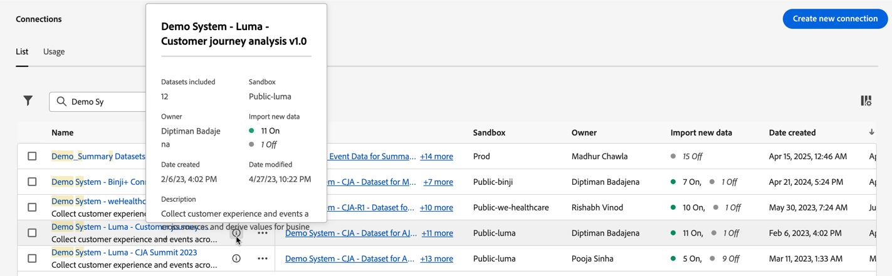
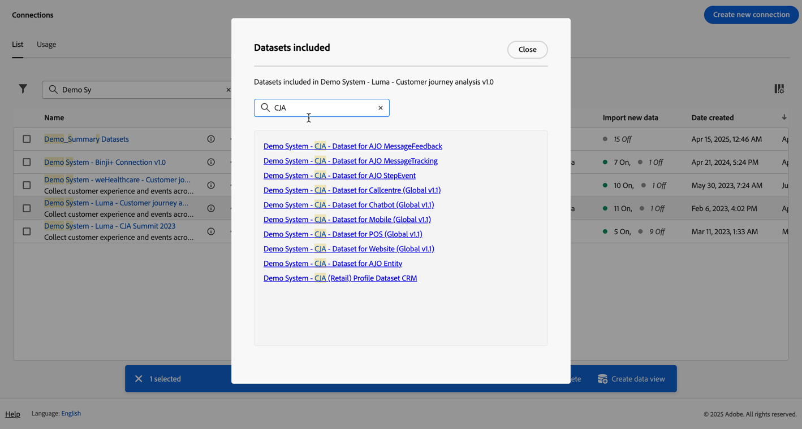

# 接続の管理

[1 つ以上の接続を作成または編集](/help/connections/create-connection.md)したら、**[!UICONTROL 接続]**&#x200B;で管理できます。[!UICONTROL  接続 ] インターフェイスでは、次のことが可能です。

* 所有者、サンドボックス、接続の作成日時や変更日時など、すべての接続を一覧表示する。
* 接続を編集する。
* 接続を削除する。
* 接続からデータビューを作成する。
* 接続内のすべてのデータセットを表示する。
* 接続のデータセットのステータスと取り込みプロセスのステータスを確認する。例えば、Analysis Workspace でレポート作成と分析を開始できるように、データが利用可能になるタイミングなどです。
* 誤った設定によるデータの不一致を識別する。欠落している行があるか。ある場合、欠落している行とその理由は何か。接続の設定の誤りが原因で Customer Journey Analytics のデータが欠落したのか。
* すべての接続をまたいで取り込まれた行とレポート可能な行の使用状況に関するインサイトを取得する。

[!UICONTROL 接続]には、[[!UICONTROL リスト]](#list)と[[!UICONTROL 使用状況]](#usage)の 2 つのインターフェイスがあります。

## リスト

**[!UICONTROL リスト]**&#x200B;インターフェイスは、接続のデフォルトのインターフェイスです。選択されていない場合は、「**[!UICONTROL リスト]**」タブを選択してインターフェイスにアクセスします。

[!UICONTROL リスト]インターフェイスには、使用可能なすべての接続のテーブルが表示されます。検索  ボックスを使用して、接続をすばやく検索できます。

テーブルでは、次の列またはアイコンを使用できます。

| 列またはアイコン | 説明 |
| --- | --- |
| **[!UICONTROL _名前_]** | 接続のわかりやすい名前です。ハイパーリンク名を選択して [ 接続の詳細 ](#connection-details) を表示します。 |
|  | [!UICONTROL 含まれるデータセット]、[!UICONTROL サンドボックス]、[!UICONTROL 所有者]などの情報を表示するには、接続名の横にある  を選択します。
ポップアップウィンドウにデータセットの詳細が表示されます。 
 |
|  |  を選択して、コンテキストメニューを開きます。 以下を選択できます。 
接続を **[!UICONTROL 編集]** して [ 編集 ](#edit-a-connection) します。
接続を **[!UICONTROL 削除]** して [ 削除 ](#delete-a-connection) します。
**[!UICONTROL 新しいデータビューを作成]** して、接続の [ 新しいデータビューを作成 ](#create-a-data-view) します。
 **[!UICONTROL Connection map]**：接続の [ 接続マップ ](#map-a-connection) を表示 |
| [!BADGE B2B edition]{type=Informative url="https://experienceleague.adobe.com/en/docs/analytics-platform/using/cja-overview/cja-b2b/cja-b2b-edition" newtab=true tooltip="Customer Journey AnalyticsB2B edition"} **[!UICONTROL  接続の種類 ]** | 接続のタイプ：**[!UICONTROL ユーザー]** ベースまたは **[!UICONTROL アカウント]** ベースの接続。 |
| **[!UICONTROL データセット]** | 接続の一部であるデータセットへの 1 つ以上のリンク。データセットのハイパーリンクを選択すると、接続内のデータセットを表示できます。選択した接続にさらにデータセットを含める場合は、「**[!UICONTROL +*x* 以上]**」を選択して、**[!UICONTROL 含まれるデータセット]**&#x200B;パネルを表示します。このパネルには、すべてのデータセットへのリンクと、接続の一部である特定のデータセットを  検索」するオプションが表示されます。

データセット名を選択して、Experience Platform インターフェイスの新しいタブでデータセットを開きます。 |
| **[!UICONTROL サンドボックス]** | この接続がデータセットを取得する [Experience Platform サンドボックス](https://experienceleague.adobe.com/ja/docs/experience-platform/sandbox/home)。このサンドボックスは、接続を作成した際に選択します。 接続が保存されると、サンドボックスを変更できなくなります。 |
| **[!UICONTROL 所有者]** | 接続を作成したユーザー。 |
| **[!UICONTROL 新しいデータをインポート]** | データセットの新しいデータの読み込みのステータス： 
   **[!UICONTROL _x _On]**：新しいデータを読み込むように設定されたデータセットの場合
 **[!UICONTROL _x オフ_]**：新しいデータを読み込むように設定されていないデータセットの場合。 |
| **[!UICONTROL 作成日]** | 接続が作成されたときのタイムスタンプ。 |
| **[!UICONTROL 最終変更日]** | 接続が最後に更新されたときのタイムスタンプ。 |
| **[!UICONTROL データをバックフィル]** | データセットをまたいだバックフィルデータのステータス。
 **[!UICONTROL _x _バックフィル失敗]**：データセットをまたいで失敗したバックフィルの数の場合。
 **[!UICONTROL _x _バックフィル処理中]**：データセットをまたいで処理中のバックフィルの数の場合。
 **[!UICONTROL _x _バックフィル完了]**：データセットをまたいで完了したバックフィルの数の場合。
 **[!UICONTROL _オフ_]**：接続内のデータセットに対してバックフィルが定義されていない場合。 |

テーブルに表示する列を設定するには、「」を選択します。 テーブルをカスタマイズダイアログで、表示する列を選択します。

### 接続の編集

接続を編集するには：

1. 接続名の横にある  を選択します
1. コンテキストメニューから  **[!UICONTROL 編集]** を選択します。

または、次の操作を実行できます。

1. 接続行を選択します。

1. 青いアクションバーから **[!UICONTROL 編集]** を選択します。

詳しくは、[接続の作成または編集](create-connection.md)を参照してください。

### 接続の削除 {#connections-delete}

接続を削除するには：

1. 接続名の横にある  を選択します。
1.  **[!UICONTROL 削除]** を選択します。

または、次の操作を実行できます。

1. 接続行を選択します。

1. 青いアクションバーから **[!UICONTROL 削除]** を選択します。

接続を削除すると、削除されたデータビューと影響を受けるワークスペースプロジェクトが&#x200B;**[!UICONTROL 接続を削除]**&#x200B;パネルに表示されます。

* **[!UICONTROL ➊Info]** に、接続が削除された場合の影響が表示されます。

  

  「**[!UICONTROL 続行]**」を選択して、削除を確定します。

* **[!UICONTROL 確認]**➋で「**[!UICONTROL 接続名を入力]**」に接続の名前を入力し、「**[!UICONTROL 削除]**」を選択して接続を削除します。 「**[!UICONTROL キャンセル]**」を選択すると、キャンセルします。

接続の削除について詳しくは、[削除の影響](/help/technotes/deletion.md)を参照してください。

### 接続のデータビューの作成

接続のデータビューを作成するには：

1. 接続名の横にある  を選択します。
1.  **[!UICONTROL 新しいデータビューを作成]** を選択します。

または、次の操作を実行できます。

1. 接続行を選択します。

1. 青いアクションバーから **[!UICONTROL データビューを作成]** を選択します。

詳しくは、[データビューの作成または編集](/help/data-views/create-dataview.md)を参照してください。

### 接続のマッピング

接続に含まれるデータセット間の関係の詳細を示す [ 接続マップ ](/help/connections/create-connection.md#connection-map) を表示するには、次の手順を実行します。

1. 接続名の横にある  を選択します。
1. **[!UICONTROL Connection map]** を選択します。

### 接続の詳細 {#connection-detail}

接続の詳細に移動するには、接続テーブルでハイパーリンクされた接続名を選択します。

接続の詳細インターフェイスでは、接続のステータスの詳細なビューが提供されます。次のことができます。

* 接続データセットのステータスと取り込みプロセスのステータスを確認します。
* レコードのスキップや削除の原因となる可能性のある設定の問題を識別します。
* データをレポートに使用できるタイミングを確認します。

| ユーザーインターフェイス | 説明 |
| --- | --- |
|  **[!UICONTROL 接続を編集]** | 接続の詳細を編集するには、 **[!UICONTROL 接続を編集]** を選択します。詳しくは、[接続の作成または編集](create-connection.md)を参照してください。 |
| **[!UICONTROL *データセットセレクター&#x200B;*]** | 接続の詳細を表示する 1 つまたはすべてのデータセットを選択します。 複数のデータセットを選択することはできません。デフォルトは&#x200B;**[!UICONTROL すべてのデータセット]**&#x200B;です。 |
| **[!UICONTROL *日付範囲セレクター&#x200B;*]** | 接続の詳細を表示するデータ範囲を選択します。 開始日、終了日を編集するか、 を選択して日付範囲セレクターを開きます。日付範囲セレクターで、定義済みの期間の 1 つ（例：**[!UICONTROL 過去 6 か月間]**）を使用して日付範囲を選択するか、カレンダーを使用して開始日と終了日を選択します。「**[!UICONTROL 適用]**」を選択して、新しい日付範囲を接続の詳細に適用します。 |
| **[!UICONTROL 使用可能なイベントデータのレコード]** | **接続全体について**、レポートに使用できるイベントデータセット行の合計数。この数は、日付範囲やデータセットの選択とは無関係です。 |
| [!UICONTROL **[!UICONTROL 指標]**] | 追加、スキップおよび削除されたイベント、ルックアップ、プロファイル、概要データセットレコードと、追加されたバッチの数を要約します。これらの指標は、**選択したデータセットと日付範囲** に基づいています。
「**[!UICONTROL 詳細を確認]**」を選択すると、**[!UICONTROL スキップされた詳細を確認]**&#x200B;ポップアップが表示されます。ポップアップには、すべてのイベントデータセットまたは選択したデータセットのスキップされたレコードの数と理由が一覧表示されます。

詳細情報が表示されている  ポップアップを選択します。[!UICONTROL  空の訪問者 ID] などの理由でスキップされた場合、ポップアップに **[!UICONTROL EQS のサンプル PSQL]** （クエリサービスのExperience Platform）が表示され、[ クエリサービス ](https://experienceleague.adobe.com/ja/docs/experience-platform/query/home) で使用して、データセット内のスキップされたレコードをクエリできます。  **[!UICONTROL EQS 用サンプル PSQL をコピー]** を選択して SQL をコピーします。 |
| **[!UICONTROL 追加されたレコード]** | **選択したデータセットと日付範囲に** して、選択した期間に追加された行数を示すビジュアライゼーション。 10 分ごとに更新されます。 |
| **[!UICONTROL スキップされたレコード]** | **選択したデータセットと日付範囲** で、選択した期間にスキップされた行数を示すビジュアライゼーション。 レコードをスキップした理由には、タイムスタンプの欠落、ユーザー ID またはアカウント ID [!BADGE B2B edition]{type=Informative url="https://experienceleague.adobe.com/en/docs/analytics-platform/using/cja-overview/cja-b2b/cja-b2b-edition" newtab=true tooltip="Customer Journey AnalyticsB2B edition"} の欠落または無効などがあります。 10 分ごとに更新されます。 
無効な ID （`undefined`、`00000000`、または特定の月において 100 万回を超えるイベントに存在する [!UICONTROL  ユーザー ID] の数字と文字の任意の組み合わせなど）は、特定のユーザーまたは人物に関連付けることができない ID です。 これらの行はシステムに取り込むことができないため、取り込みやレポートでエラーが発生しやすくなります。無効な人物 ID またはアカウント ID [!BADGE B2B edition]{type=Informative url="https://experienceleague.adobe.com/en/docs/analytics-platform/using/cja-overview/cja-b2b/cja-b2b-edition" newtab=true tooltip="Customer Journey AnalyticsB2B edition"} を修正するには、次の 3 つのオプションがあります。<ul><li>[ステッチ](/help/stitching/overview.md)を使用して、未定義またはすべてがゼロのユーザー ID に有効なユーザー ID を入力する。</li><li>ユーザー ID を空白にする。この ID は取り込み時にスキップされます（ユーザー ID が無効またはすべてゼロとなっているよりも望ましい）。</li><li>データを取り込む前に、システム内の無効なユーザー ID を修正する。</li></ul> |
| **[!UICONTROL 削除されたレコード]** | **選択したデータセットと日付範囲** で、選択した期間に削除された行数を示すビジュアライゼーション。 例えば、[!DNL Experience Platform] でデータセットが削除された可能性があるとします。10 分ごとに更新されます。
シナリオによっては、ステッチや一部のルックアップデータセットの更新などにより、この値に置き換えられたレコードが含まれる場合もあります。この例では、次を考慮します。
<ul><li>1 つのレコードを XDM 個人プロファイルデータセットにアップロードします。これにより、Customer Journey Analytics がプロファイルルックアップデータとして取り込むように設定されます。接続の詳細では、このデータセットには 1 つのレコードが追加されたと表示されます。</li><li>元のレコードの複製を同じ AEP データセットにアップロードします。これにより、2 つのレコードが含まれるようになります。 Customer Journey Analyticsは、プロファイルまたはアカウント [!BADGE B2B edition]{type=Informative url="https://experienceleague.adobe.com/en/docs/analytics-platform/using/cja-overview/cja-b2b/cja-b2b-edition" newtab=true tooltip="Customer Journey AnalyticsB2B edition"} ルックアップデータセットから追加のレコードを取り込みます。 プロファイルまたはアカウントレコードが、そのユーザー ID またはアカウント ID [!BADGE B2B edition]{type=Informative url="https://experienceleague.adobe.com/en/docs/analytics-platform/using/cja-overview/cja-b2b/cja-b2b-edition" newtab=true tooltip="Customer Journey AnalyticsB2B edition"} の接続に既に取り込まれているのを確認すると、Customer Journey Analyticsは以前のバージョンを削除して、新しいプロファイルデータを追加します。 Customer Journey Analyticsでは、取り込まれたユーザー ID またはアカウント ID [!BADGE B2B edition]{type=Informative url="https://experienceleague.adobe.com/en/docs/analytics-platform/using/cja-overview/cja-b2b/cja-b2b-edition" newtab=true tooltip="Customer Journey AnalyticsB2B edition"} の最新のプロファイル参照データのみが保持されるので、接続詳細では、このアクションは、追加されたレコード 1 件と削除されたレコード 1 件を表します。</li><li>合計すると、AEP データセットには同一の 2 つのレコードが含まれます。 これとは別に、Customer Journey Analytics 接続の詳細には、このプロファイルデータセットに対して 2 つのレコードが追加され、1 つのレコードが削除されました、という取り込まれたデータのステータスが表示されます。 </li></ul> |
|  | データセット検索フィールド。データセット名またはデータセット ID でデータセットテーブルを検索できます。 |
| [!UICONTROL データセットテーブル] | 接続に含まれるデータセットです。詳しくは、次の表を参照してください。 選択したデータセットの接続の詳細のみを表示するには、1 つのデータセットを  選択します。 これは、**[!UICONTROL _データセットセレクター_]** からデータセットを選択することに相当します。 |

データセットテーブルには、各データセットに関する次の列が表示されます。

| 列 | 説明 |
| --- | --- |
| **[!UICONTROL データセット]** | データセットの名前。 ハイパーリンクを選択すると、Experience Platform UI の新しいタブでデータセットを開くことができます。行を選択するか、チェックボックスをオンにすると、選択したデータセットの詳細のみを表示できます。 |
| **[!UICONTROL データセット ID]** | Experience Platformで生成されたデータセット ID。 |
| **[!UICONTROL 追加されたレコード]** | 選択した日付範囲で接続に追加されたデータセットレコード（行）の数。 |
| **[!UICONTROL スキップされたレコード]** | 選択した日付範囲で、接続のデータ転送中にスキップされたデータセットレコード （行）の数。 |
| **[!UICONTROL 削除されたレコード]** | 選択した日付範囲で接続から削除されたデータセットレコード （行）の数。 |
| **[!UICONTROL 追加されたバッチ]** | 選択した日付範囲内に接続に追加されたバッチの数。 |
| **[!UICONTROL 前回追加した日時]** | 接続に追加された最新のバッチのタイムスタンプ。 |
| **[!UICONTROL データソースタイプ]** | ソースタイプ。 ソースタイプは、データセットを接続に追加する際に定義します。 |
| **[!UICONTROL データセットタイプ]** | [ データセットタイプ ](create-connection.md#dataset-types)。 タイプは、[!UICONTROL  イベント ]、[!UICONTROL  プロファイル ]、[!UICONTROL  ルックアップ ]、[!UICONTROL  概要 ] のいずれかです。 |
| **[!UICONTROL スキーマ]** | データセットのベースとなる Experience Platform スキーマ。 |
| **[!UICONTROL 新しいデータをインポート]** | データセットの新しいデータの読み込みのステータス： 
 **[!UICONTROL _x _オン]**：データセットが新しいデータを読み込むように設定されている場合。
 **[!UICONTROL _x オフ_]**：データセットが新しいデータを読み込むように設定されていない場合。 |
| **[!UICONTROL データセットを変換]** | 適用可能な B2B ルックアップデータセットの変換ステータス。詳しくは、[B2B ルックアップ用にデータセットを変換](transform-datasets-b2b-lookups.md)を参照してください。
 **[!UICONTROL _x _オン]**：変換に対して有効である適用可能なデータセットの場合。 
 **[!UICONTROL _x オフ_]**：変換に対して有効でない適用可能なデータセットの場合。
**[!UICONTROL 該当なし]**：変換に対して適用可能でない他のすべてのデータセットの場合。 |
| **[!UICONTROL データをバックフィル]** | データセットのバックフィルデータのステータス。
 **[!UICONTROL _x _バックフィル失敗]**：失敗したバックフィルの数の場合。
 **[!UICONTROL _x _バックフィル処理中]**：処理中のバックフィルの数の場合。
 **[!UICONTROL _x _バックフィル完了]**：完了したバックフィルの数の場合。
 **[!UICONTROL _オフ_]**：バックフィルが定義されていない場合。 |

>[!IMPORTANT]
>
>2021年8月13日（PT）より前に取り込まれたデータは、[!UICONTROL 接続]インターフェイスに反映されません。
>

#### 接続パネル

データセットテーブルで個々のデータセットが選択されていない場合、右側のパネルには接続オプションと詳細が表示されます。

| オプション | 説明 |
| --- | --- |
|  **[!UICONTROL 更新]** | 接続を更新し、最近追加されたレコードを反映するには、 **[!UICONTROL 更新]** を選択します。 |
| 、**[!UICONTROL 削除]** | この接続を[削除](#delete-a-connection)します。 |
|  **[!UICONTROL データビューを作成]** | この接続に基づいて[データビューを作成します](#create-a-data-view)。詳しくは、[データビュー](https://experienceleague.adobe.com/ja/docs/analytics-platform/using/cja-dataviews/data-views)を参照してください。 |
| **[!UICONTROL 接続名]** | 接続のわかりやすい名前。 |
| **[!UICONTROL 接続の説明]** | 接続の説明。 |
| **[!UICONTROL サンドボックス]** | この接続がデータセットを取得する [Experience Platform サンドボックス](https://experienceleague.adobe.com/ja/docs/experience-platform/sandbox/home)。このサンドボックスは、接続を作成した際に選択します。 接続が保存されると、サンドボックスを変更できなくなります。 |
| **[!UICONTROL 接続 ID]** | 接続に対して生成された識別子。  を使用して、値をコピーできます。 |
| [!BADGE B2B edition]{type=Informative url="https://experienceleague.adobe.com/en/docs/analytics-platform/using/cja-overview/cja-b2b/cja-b2b-edition" newtab=true tooltip="Customer Journey AnalyticsB2B edition"} **[!UICONTROL プライマリID の種類 ]** | 接続のプライマリ ID タイプ：ユーザーベースの接続の場合は **[!UICONTROL Person]**、アカウントベースの接続の場合は **[!UICONTROL Account]**。 |
| [!BADGE B2B edition]{type=Informative url="https://experienceleague.adobe.com/en/docs/analytics-platform/using/cja-overview/cja-b2b/cja-b2b-edition" newtab=true tooltip="Customer Journey AnalyticsB2B edition"} **[!UICONTROL  コンテナ ]** | 接続に対して設定されたコンテナ。 |
| **[!UICONTROL 接続を使用するデータビュー]** | この接続を使用するデータビュー。 |
| **[!UICONTROL 新しいデータをインポート]** | データセットの新しいデータの読み込みのステータス： 
 **[!UICONTROL _x _オン]**：データセットの数が新しいデータを読み込むように設定されている場合。
 **[!UICONTROL _x オフ_]**：新しいデータ読み込みがオフになっているデータセットの数の場合。 |
| **[!UICONTROL データをバックフィル]** | データセットのバックフィルデータのステータス。
 **[!UICONTROL _x _バックフィル失敗]**：データセットをまたいで失敗したバックフィルの数の場合。
 **[!UICONTROL _x _バックフィル処理中]**：データセットをまたいで処理中のバックフィルの数の場合。
 **[!UICONTROL _x _バックフィル完了]**：データセットをまたいで完了したバックフィルの数の場合。
 **[!UICONTROL _オフ_]**：接続内のデータセットに対してバックフィルが定義されていない場合。 |
| **[!UICONTROL データセットを変換]** | 適用可能な B2B ルックアップデータセットの変換ステータス。詳しくは、[B2B ルックアップ用にデータセットを変換](transform-datasets-b2b-lookups.md)を参照してください。
 **[!UICONTROL _x _オン]**：変換に対して有効であるデータセットの数の場合。 |
| **[!UICONTROL 作成者]** | クエリを作成したユーザーの名前。 |
| **[!UICONTROL 最終変更日]** | 接続に対する最後の変更のタイムスタンプ。 |
| **[!UICONTROL 最終変更者]** | 接続を最後に変更したユーザーの名前。 |

#### データセットパネル

データセットテーブルでデータセット行が選択されると、接続インターフェイスの右側にあるパネルに、選択したデータセットの詳細が表示されます。

| 詳細 | 説明 |
| --- | --- |
| [!BADGE B2B edition]{type=Informative url="https://experienceleague.adobe.com/en/docs/analytics-platform/using/cja-overview/cja-b2b/cja-b2b-edition" newtab=true tooltip="Customer Journey AnalyticsB2B edition"} **[!UICONTROL  グローバルアカウント ID ]** | 接続のグローバルアカウント ID として指定した ID。 グローバルアカウントコンテナが設定されているアカウントベースの接続にのみ適用できます。 |
| [!BADGE B2B edition]{type=Informative url="https://experienceleague.adobe.com/en/docs/analytics-platform/using/cja-overview/cja-b2b/cja-b2b-edition" newtab=true tooltip="Customer Journey AnalyticsB2B edition"} **[!UICONTROL  アカウント ID ]** | 接続のアカウント ID として指定した ID。 グローバルアカウントコンテナが設定されていないアカウントベースの接続にのみ適用できます。 |
| **[!UICONTROL ユーザー ID]** | 接続のユーザー ID として指定した ID。 |
| **[!UICONTROL キー]** | ルックアップデータセットに指定したキー。 |
| **[!UICONTROL 一致するキー]** | ルックアップデータセットに指定した一致するキー。 |
| **[!UICONTROL タイムスタンプ]** | イベントデータセットに定義されたタイムスタンプ。 |
| **[!UICONTROL 使用可能なレコード]** | カレンダーを通じて選択された特定の期間に、このデータセットに対して取り込まれた行の合計数。データが追加されると、レポートに表示されるデータの取得に遅延は発生しません。ただし、最新の接続を作成すると、[遅延](https://experienceleague.adobe.com/en/docs/analytics-platform/using/cja-overview/cja-b2c-overview/cja-faq)が発生します。 |
| **[!UICONTROL 追加されたレコード]** | 選択した日付範囲で接続に追加されたデータセットレコード（行）の数。 |
| **[!UICONTROL スキップされたレコード]** | 選択した日付範囲で、接続のデータ転送中にスキップされたデータセットレコード （行）の数。 |
| **[!UICONTROL 追加されたバッチ]** | 接続に追加されたバッチの数。 |
| **[!UICONTROL 削除されたレコード]** | 選択した日付範囲で接続から削除されたデータセットレコード （行）の数。 |
| **[!UICONTROL 前回追加した日時]** | 接続に追加された最新のバッチのタイムスタンプ。 |
| **[!UICONTROL 新しいデータをインポート]** | データセットの新しいデータの読み込みのステータス： 
 **[!UICONTROL _x _オン]**：データセットが新しいデータを読み込むように設定されている場合。
 **[!UICONTROL _x オフ_]**：データセットが新しいデータを読み込むように設定されていない場合。 |
| **[!UICONTROL データをバックフィル]** | データセットのバックフィルデータのステータス。
 **[!UICONTROL _x _バックフィル失敗]**：失敗したバックフィルの数の場合。
 **[!UICONTROL _x _バックフィル処理中]**：処理中のバックフィルの数の場合。
 **[!UICONTROL _x _バックフィル完了]**：完了したバックフィルの数の場合。
 **[!UICONTROL _オフ_]**：バックフィルが定義されていない場合。
データセットの過去のバックフィルの概要を示すダイアログを表示するには、  **[!UICONTROL 過去のバックフィル]** を選択します。 |
| **[!UICONTROL データソースタイプ]** | データセットが接続に追加されたときに定義されたデータソースタイプ。 |
| **[!UICONTROL データセットタイプ]** | [ データセットタイプ ](create-connection.md#dataset-types)。 |
| **[!UICONTROL スキーマ]** | このデータセットのベースとなる Experience Platform スキーマ。 |
| **[!UICONTROL データセット ID]** | Experience Platformで生成されたデータセット ID。 |

## 使用状況 {#connections-usage}

<!-- markdownlint-disable MD034 -->

>[!CONTEXTUALHELP]
>id="cja_connections_usage_keyusagemetrics"
>title="主要な使用状況指標"
>abstract="コアおよび履歴のレポート可能行数の月別および合計データを指定します。"
<!-- markdownlint-enable MD034 -->

<!-- markdownlint-disable MD034 -->

>[!CONTEXTUALHELP]
>id="cja_connections_usage_monthlyingestedrows"
>title="月別の取り込み行数"
>abstract="月別にシステムに追加されるレコードの合計数を測定し、データの増加と取り込み率に関するインサイトを指定します。"
<!-- markdownlint-enable MD034 -->

<!-- markdownlint-disable MD034 -->

>[!CONTEXTUALHELP]
>id="cja_connections_usage_monthlyreportablerows"
>title="月別のレポート可能行数"
>abstract="レポートに使用できる行数を追跡します。 レポート可能な行は、取り込まれた行から、取り込み中にスキップおよび削除された行を引いたものです。 レポート可能行数は、課金とデータ使用量の主要な指標として機能します。"
<!-- markdownlint-enable MD034 -->

<!-- markdownlint-disable MD034 -->

>[!CONTEXTUALHELP]
>id="cja_connections_usage_detailbreakdown"
>title="詳細な分類。"
>abstract="データの CSV ファイルをダウンロードするオプションを使用して、接続別、データセット別、サンドボックス別、タグ別に詳細な指標を表示できます。"
<!-- markdownlint-enable MD034 -->

<!-- markdownlint-disable MD034 -->

>[!CONTEXTUALHELP]
>id="cja_connections_usage_otherdatasets"
>title="その他のデータセット"
>abstract="2024年9月より前の数か月間については、データはデータセットレベルで収集され、わかりやすくするために&#x200B;*その他のデータセット*&#x200B;として表示されます。2024 年 9 月以降、データはきめ細かいデータセットレベルで収集され、*その他のデータセット* は表示されなくなります。"
<!-- markdownlint-enable MD034 -->

<!-- markdownlint-disable MD034 -->

>[!CONTEXTUALHELP]
>id="cja_connections_usage_unknowndatasetsorconnections"
>title="不明なデータセットまたは接続"
>abstract="不明なデータセットまたは接続は、ID を使用して表示されます。"
<!-- markdownlint-enable MD034 -->

<!-- markdownlint-disable MD034 -->

>[!CONTEXTUALHELP]
>id="cja_connections_usage_datanotavailable"
>title="データは使用できません"
>abstract="システムの制限により、2024年9月より前の履歴データは使用できません。指標は、2024年9月以降に収集され、表示されます。グラフにはタイムラインの過去 18 か月が表示され、データが利用可能になると将来のデータが表示されます。"
<!-- markdownlint-enable MD034 -->

<!-- markdownlint-disable MD034 -->

>[!CONTEXTUALHELP]
>id="cja_connections_corereportablerows"
>title="コアのレポート可能な行数"
>abstract="過去 13 か月間に使用可能な行の合計数。 例えば、2024年2月1日（PT）の数は、2023年1月から 2024年1月までのイベントタイムスタンプで使用できる行の合計数を示します。"
<!-- markdownlint-enable MD034 -->

<!-- markdownlint-disable MD034 -->

>[!CONTEXTUALHELP]
>id="cja_connections_historicalreportablerows"
>title="履歴のレポート可能な行数"
>abstract="13 か月を超える期間で使用可能な行の合計数です。 例えば、2024年2月1日（PT）の数は、2023年1月より古いイベントタイムスタンプで使用できる行の合計数を示します。"

<!-- markdownlint-enable MD034 -->

<!-- markdownlint-disable MD034 -->

>[!CONTEXTUALHELP]
>id="connections_usage_keyusagemetrics"
>title="主要な使用状況指標"
>abstract="コアおよび履歴のレポート可能行数の月別および合計データを指定します。"
<!-- markdownlint-enable MD034 -->

<!-- markdownlint-disable MD034 -->

>[!CONTEXTUALHELP]
>id="connections_usage_monthlyingestedrows"
>title="月別の取り込み行数"
>abstract="月別にシステムに追加されるレコードの合計数を測定し、データの増加と取り込み率に関するインサイトを指定します。"
<!-- markdownlint-enable MD034 -->

<!-- markdownlint-disable MD034 -->

>[!CONTEXTUALHELP]
>id="connections_usage_monthlyreportablerows"
>title="月別のレポート可能行数"
>abstract="レポートに使用できる行数を追跡します。 レポート可能な行は、取り込まれた行から、取り込み中にスキップおよび削除された行を引いたものです。 レポート可能行数は、課金とデータ使用量の主要な指標として機能します。"
<!-- markdownlint-enable MD034 -->

<!-- markdownlint-disable MD034 -->

>[!CONTEXTUALHELP]
>id="connections_usage_detailbreakdown"
>title="詳細な分類。"
>abstract="データの CSV ファイルをダウンロードするオプションを使用して、接続別、データセット別、サンドボックス別、タグ別に詳細な指標を表示できます。"
<!-- markdownlint-enable MD034 -->

<!-- markdownlint-disable MD034 -->

>[!CONTEXTUALHELP]
>id="connections_usage_otherdatasets"
>title="その他のデータセット"
>abstract="2024年9月より前の数か月間については、データはデータセットレベルで収集され、わかりやすくするために&#x200B;*その他のデータセット*&#x200B;として表示されます。2024 年 9 月以降、データはきめ細かいデータセットレベルで収集され、*その他のデータセット* は表示されなくなります。"
<!-- markdownlint-enable MD034 -->

<!-- markdownlint-disable MD034 -->

>[!CONTEXTUALHELP]
>id="connections_usage_unknowndatasetsorconnections"
>title="不明なデータセットまたは接続"
>abstract="不明なデータセットまたは接続は、ID を使用して表示されます。"
<!-- markdownlint-enable MD034 -->

<!-- markdownlint-disable MD034 -->

>[!CONTEXTUALHELP]
>id="connections_usage_datanotavailable"
>title="データは使用できません"
>abstract="システムの制限により、2024年9月より前の履歴データは使用できません。指標は、2024年9月以降に収集され、表示されます。グラフにはタイムラインの過去 18 か月が表示され、データが利用可能になると将来のデータが表示されます。"
<!-- markdownlint-enable MD034 -->

<!-- markdownlint-disable MD034 -->

>[!CONTEXTUALHELP]
>id="connections_corereportablerows"
>title="コアのレポート可能な行数"
>abstract="過去 13 か月間に使用可能な行の合計数。 例えば、2024年2月1日（PT）の数は、2023年1月から 2024年1月までのイベントタイムスタンプで使用できる行の合計数を示します。"
<!-- markdownlint-enable MD034 -->

<!-- markdownlint-disable MD034 -->

>[!CONTEXTUALHELP]
>id="connections_historicalreportablerows"
>title="履歴のレポート可能な行数"
>abstract="13 か月を超える期間で使用可能な行の合計数です。 例えば、2024年2月1日（PT）の数は、2023年1月より古いイベントタイムスタンプで使用できる行の合計数を示します。"

<!-- markdownlint-enable MD034 -->

<!-- markdownlint-disable MD034 -->

>[!CONTEXTUALHELP]
>id="connections_breakdown_corereportablerows"
>title="コアのレポート可能な行数"
>abstract="コアレポート可能行数はスナップショット値であり、集計合計ではありません。これらの値は、選択した日付範囲の最後の月に基づいて動的に更新されます。お客様が 1 月から 3 月を選択した場合、値は 3 月のスナップショットを反映します。"

>[!CONTEXTUALHELP]
>id="connections_breakdown_historicalreportablerows"
>title="履歴のレポート可能な行数"
>abstract="履歴レポート可能行数はスナップショット値であり、集計合計ではありません。これらの値は、選択した日付範囲の最後の月に基づいて動的に更新されます。お客様が 1 月から 3 月を選択した場合、値は 3 月のスナップショットを反映します。"

>[!CONTEXTUALHELP]
>id="connections_breakdown_cumulativereportablerows"
>title="累積レポート可能行数"
>abstract="累積レポート可能行数はスナップショット値であり、集計合計ではありません。これらの値は、選択した日付範囲の最後の月に基づいて動的に更新されます。お客様が 1 月から 3 月を選択した場合、値は 3 月のスナップショットを反映します。"

<!-- markdownlint-enable MD034 -->

[!UICONTROL 使用状況]インターフェイスには、すべての接続で取り込まれた行とレポート可能な行の使用状況が表示されます。選択されていない場合は、「**[!UICONTROL 使用状況]**」タブを選択してインターフェイスにアクセスします。

このインターフェイスは、Customer Journey Analytics の使用状況が契約上の合意事項に準拠しているかどうかを判断するのに役立ちます。監視目的に加えて、使用状況インターフェイスを使用して、Customer Journey Analytics ライセンスの更新を計画することもできます。

使用状況インターフェイスでは、次の指標を使用します。

| Metric name | 説明 |
|---|---|
| 履歴のレポート可能な行数 | 13 か月を超える期間の行数。 |
| コアのレポート可能な行数 | 過去 13 か月間の行数。 |
| 取り込まれた行数 | 特定の期間に取り込まれた行数。 |
| レポート可能な行数 | 特定の期間の接続の一部として保持されるデータの行数。 |
| 累積行数 | 特定の月までに取り込まれた行数。 |

>[!NOTE]
>
>データは、2024年7月からコア、履歴、合計レコードについて収集されます。以前の履歴データについては、アドビ担当営業または販売店にお問い合わせください。
>

使用状況インターフェイスは、次の 2 つのパネルで構成されます。

* **[!UICONTROL 主要使用状況指標]**&#x200B;パネル：コアデータと履歴データのレポート可能な行数を示します。また、このパネルでは、コアデータと履歴データの行数の両方について、前月と比較した割合の変化も追跡します。

  このパネルには、以下を含むビジュアライゼーションが表示されます。

   * **[!UICONTROL コアデータのレポート可能な行数]**。

     過去 13 か月間でレポート可能な行の数。概要数値は、先月（例：2024年12月）のコアのレポート可能な行の数（例：741M）です。

   * **[!UICONTROL 履歴データのレポート可能な行数]**。

     13 か月を超える期間のレポート可能な行の数。概要数値は、先月（例：2024年12月）の履歴のレポート可能な行の数（例：127M）です。

  ビジュアライゼーション内の積み重ね棒グラフにポインタを合わせると、ポップアップに棒グラフの特定の部分の行数が表示されます（例）。

  

* 次の 3 つのサブパネルを表示する組み合わせパネル：

+++ 取り込まれた行数

  **[!UICONTROL 取り込まれた行数]**&#x200B;サブパネルは、月別でシステムに追加されるレコードの合計数を測定し、データの増加と取り込み率に関するインサイトを提供します。サブパネルには、今月取り込まれた行数の合計数と前月からの変化の概要が表示されます。

  

  ビジュアライゼーションのデータポイントにポインタを合わせると、詳細を含むポップアップが表示されます。

+++

+++ レポート可能な行数

  **[!UICONTROL レポート可能な行数]**&#x200B;のビジュアライゼーションでは、取り込んだ行からスキップされた行と削除された行を減算することで、レポートに使用できる行数を追跡します。これは、課金とデータ使用状況の主要指標として機能します。サブパネルには、次の 2 つの概要が表示されます。

   * **[!UICONTROL 先月の合計数]**：今月までのレポート可能な行数の合計数の概要。
   * **[!UICONTROL 今月]**：今月のレポート可能な行数の合計数と前月からの変化の概要。

  

  ビジュアライゼーションのデータポイントにポインタを合わせると、詳細を含むポップアップが表示されます。

+++

+++ 詳細分類

  **[!UICONTROL 詳細分類]**&#x200B;テーブルを使用すると、、接続別、データセット別別、サンドボックス別、タグ別に詳細な指標を表示できます。データセット名はレポート期間中に変更される場合があるので、データセットは名前ではなく ID を使用してレポートされます。不明なデータセットまたは接続は、ID を使用してレポートされます。

  2024年9月より前の数か月間については、データはデータセットレベルで収集され、わかりやすくするために[!UICONTROL その他のデータセット]として表示されます。2024 年 9 月以降、データはきめ細かいデータセットレベルで収集され、[!UICONTROL  その他のデータセット ] は表示されなくなります。

   * 分類を変更するには、「**[!UICONTROL 表示別]**」と「**[!UICONTROL 分類別]**」の組み合わせを選択します。

     | 「**[!UICONTROL 表示別]**」オプション | 「**[!UICONTROL 分類別]**」オプション |
     |---|---|
     | **[!UICONTROL 接続]** | **[!UICONTROL -]** および&#x200B;**[!UICONTROL データセット]** |
     | **[!UICONTROL データセット]** | **[!UICONTROL -]** |
     | **[!UICONTROL サンドボックス]** | **[!UICONTROL 接続]** |
     | **[!UICONTROL タグ]** | **[!UICONTROL 接続]** |

  

+++

  レポートする&#x200B;**[!UICONTROL 時間範囲]**&#x200B;を月単位で定義できます。時間範囲を選択するには、 を使用します。

>[!MORELIKETHIS]
>
>[接続設定の表示、トラブルシューティング、変更](https://experienceleague.adobe.com/ja/docs/customer-journey-analytics-learn/tutorials/connections/connections-details-experience-in-cja)チュートリアル。
>[Customer Journey Analyticsの使用状況の管理 ](/help/technotes/estimate-usage.md)
>
