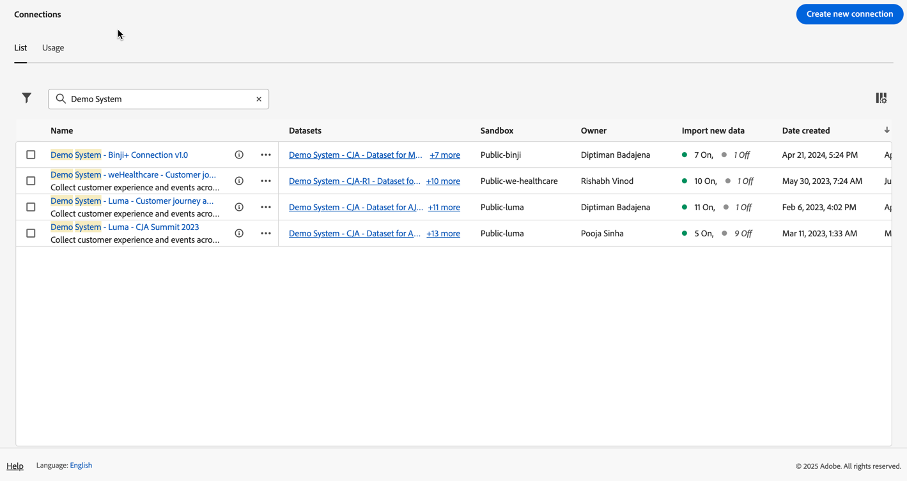

# 接続の管理

[1 つ以上の接続を作成または編集 ](/help/connections/create-connection.md) したら、**[!UICONTROL 接続]** で管理できます。 接続を使用すると、次のことができます。

* すべての接続を、所有者、サンドボックス、接続が作成および変更された日時を含め、一覧で表示します。
* 接続を編集します。
* 接続を削除する。
* 接続からデータビューを作成する。
* 接続内のすべてのデータセットを表示する。
* 接続データセットのステータスと取り込みプロセスのステータスを確認します。 例えば、Analysis Workspaceでレポートや分析を開始できるように、データが利用可能なタイミングです。
* 設定ミスに起因するデータの相違を識別します。 欠落している行があるか。その場合、欠落している行とその理由は何か。 接続の設定の誤りが原因でCustomer Journey Analyticsのデータが欠落したのか。
* すべての接続における、取り込まれた行とレポート可能な行の使用状況に関するインサイトを取得します。

[!UICONTROL Connections] には、[[!UICONTROL List]](#list) と [[!UICONTROL Usage]](#usage) の 2 つのインターフェイスがあります。

## リスト

[!UICONTROL  リスト ] インターフェイスは、接続のデフォルトのインターフェイスです。 選択されていない場合は、「**[!UICONTROL リスト]**」タブを選択して、インターフェイスにアクセスします。

[!UICONTROL  リスト ] インターフェイスには、使用可能なすべての接続のテーブルが表示されます。 「検索  ボックスを使用して、接続をすばやく検索できます。

テーブルでは、以下の列またはアイコンを使用できます。

| 列またはアイコン | 説明 |
| --- | --- |
| [!UICONTROL 名前] | 接続のわかりやすい名前です。接続の詳細を確認するには、ハイパーリンク名を選択します。 [ 接続の詳細 ](#connection-details) を参照してください。 |
|  | [!UICONTROL  含まれるデータセット ]、[!UICONTROL  サンドボックス ]、[!UICONTROL  所有者 ] などに関する情報を表示するには、接続名の横にある  を選択します。
ポップアップウィンドウに詳細が表示されます。 
 |
|  | 接続の [ データビューを作成する ](#create-a-data-view) には、 を選択します。 このアイコンは、接続に関連付けられているデータビューが既にない場合にのみ表示されます。 |
|  |  を選択して、次の操作を行います。 
[ 編集 ](#edit-a-connection) 接続。
[ 削除 ](#delete-a-connection) 接続。
[ 新しいデータビューを作成 ](#create-a-data-view)。 接続に追加のデータビューを作成する
 接続マップ 接続の接続マップを表示するには、次の手順に従います。 |
| **[!UICONTROL データセット]** | 接続に含まれるデータセットへの 1 つ以上のリンク。 データセットのハイパーリンクを選択して、接続内のデータセットを表示できます。 選択した接続に属するデータセットが他にもある場合は、「**[!UICONTROL +*x* more]**」を選択して **[!UICONTROL 含まれるデータセット]** パネルを表示します。 このパネルには、すべてのデータセットへのリンクと、接続の一部である特定のデータセットを検索するオプションが表示されます。

データセット名を選択すると、Experience Platform UI のデータセットが新しいタブで開きます。 |
| **[!UICONTROL サンドボックス]** | この接続がデータセットを取得する ](https://experienceleague.adobe.com/ja/docs/experience-platform/sandbox/home)0}Experience Platform サンドボックス。 [このサンドボックスは、接続を初めて作成したときに選択されています。変更できません。 |
| **[!UICONTROL 所有者]** | 接続を作成したユーザー。 |
| **[!UICONTROL 新しいデータをインポート]** | データセットの新しいデータの読み込みステータス： 
    **[!UICONTROL _x _On]**：新しいデータを読み込むように設定されたデータセットの場合
   新しいデータをインポートするように設定されていないデータセットの場合は **[!UICONTROL _x Off_]**。 |
| **[!UICONTROL 作成日]** | 接続が作成されたときのタイムスタンプ。 |
| **[!UICONTROL 最終変更日]** | 接続が最後に更新されたときのタイムスタンプ。 |
| **[!UICONTROL データをバックフィル]** | データセット間でのバックフィルデータのステータス。
   **[!UICONTROL _x _バックフィルに失敗しました]**データセット間で失敗したバックフィルの数
   **[!UICONTROL _x _件のバックフィル処理]**複数のデータセットをまたいだ処理バックフィルの数
   **[!UICONTROL _x _完了したバックフィル]**データセットの完了したバックフィルの数
   **[!UICONTROL _オフ_]** 接続内のデータセットに対してバックフィルが定義されていない場合。 |

表示する列を設定するには、「」ダイアログを表示する **列設定** を選択します。このダイアログでは、テーブルの列のオン/オフを切り替えることができます。

### 接続の編集

接続を編集するには：

1. 接続名の横にある  を選択します
1. コンテキストメニューから **[!UICONTROL 編集]** を選択します。

または、次の操作を実行できます。

1. 接続行を選択します。

1. 青いバーから **[!UICONTROL 編集]** を選択します。

接続を編集すると、次の操作を実行できます。

* 新しいデータの読み込みを開始および停止します。
* 接続名を変更する。
* データセットを更新します。
* 接続からデータセットを削除します。

詳しくは、[ 接続の作成または編集 ](create-connection.md) を参照してください。

### 接続の削除 {#connections-delete}

接続を削除するには：

1. 接続名の横にある  を選択します。
1. 「**[!UICONTROL 削除]**」を選択します。

または、次の操作を実行できます。

1. 接続行を選択します。

1. 青いバーから **[!UICONTROL 削除]** を選択します。

接続を削除すると、削除されるデータビューと影響を受けるワークスペースプロジェクトが **[!UICONTROL 接続を削除]** パネルに表示されます。

「**[!UICONTROL 続行]**」を選択して、接続を削除します。

接続の削除について詳しくは、[ 削除の影響 ](/help/technotes/deletion.md) を参照してください。

### 接続のデータビューの作成

接続の新しいデータビューを作成するには

* 接続に関連付けられているデータビューがない場合：

   1. 接続名の横にある「」を選択します。

* 接続に対して 1 つ以上のデータビューが既に作成されている場合：

   1. 接続名の横にある  を選択します。
   1. **[!UICONTROL 新しいデータビューを作成]** を選択します。

または、次の操作を実行できます。

1. 接続行を選択します。

1. 青いボタンバーから **[!UICONTROL データビューを作成]** を選択します。

詳しくは、[データビューの作成または編集](/help/data-views/create-dataview.md)を参照してください。

### 接続のマッピング

接続に含まれるデータセット間の関係の詳細を示す [ 接続マップ ](/help/connections/create-connection.md#connection-map) を表示するには、次の手順を実行します。

1. 接続名の横にある  を選択します。
1. **[!UICONTROL Connection map]** を選択します。

### 接続の詳細 {#connection-detail}

接続の詳細に移動するには、接続テーブルで接続名を選択します。

接続の詳細インターフェイスには、接続のステータスの詳細ビューが表示されます。 次のことができます。

* 接続データセットのステータスと取り込みプロセスのステータスを確認します。
* レコードのスキップまたは削除の原因となる可能性がある設定の問題を特定します。
* データをレポートに使用できるタイミングを確認します。

| ユーザーインターフェイス | 説明 |
| --- | --- |
| **[!UICONTROL 接続を編集]** | 接続の詳細を編集するには、 **[!UICONTROL 接続を編集]** を選択します。 詳しくは、[ 接続の作成または編集 ](create-connection.md) を参照してください。 |
| **[!UICONTROL *データセットセレクター&#x200B;*]** | 接続内の 1 つまたはすべてのデータセットを選択できます。複数のデータセットを選択することはできません。デフォルトは&#x200B;**[!UICONTROL すべてのデータセット]**&#x200B;です。 |
| **[!UICONTROL *日付範囲セレクター&#x200B;*]** | 開始日または終了日を編集するか、「」を選択して日付範囲セレクターを開きます。 日付範囲セレクターで、定義済みの期間の 1 つ（例：**[!UICONTROL 過去 6 か月]**）を使用して日付範囲を選択するか、カレンダーを使用して開始日と終了日を選択します。 「**[!UICONTROL 適用]**」を選択して、新しい日付範囲を適用します。 |
| **[!UICONTROL 使用可能なイベントデータのレコード]** | **接続全体について**、レポートに使用できるイベントデータセットの行の合計数。 この数は、カレンダーの設定とは無関係です。データセットセレクターからデータセットを選択するか、テーブル内のデータセットを選択すると、カウントが変わります。 データが追加されると、データがレポートに表示されるまで、1 ～ 2 時間の遅延が発生します。 |
| [!UICONTROL **[!UICONTROL 指標]**] | 追加、スキップ、および削除されたイベント、ルックアップ、プロファイル、および概要データセットレコードと、追加されたバッチ数を要約します。 これらの指標は、**選択したデータセットと日付範囲** に基づいています。
「**[!UICONTROL 詳細を確認]**」を選択して、「**[!UICONTROL スキップされた詳細を確認]** ポップアップを表示します。 ポップアップに、スキップされたレコード数と、すべてのイベントデータセットまたは選択したデータセットの理由が一覧表示されます。

詳細情報が表示されている  ポップアップを選択します。 [!UICONTROL  空の訪問者 ID] などの理由でスキップされた場合、ポップアップに EQS のサンプル PSQL （クエリサービスのExperience Platform）が表示されます。[ クエリサービス ](https://experienceleague.adobe.com/ja/docs/experience-platform/query/home) で使用すると、データセット内のスキップされたレコードをクエリできます。 「**[!UICONTROL EQS 用サンプル PSQL をコピー]**」を選択して、SQL をコピーします。 |
| **[!UICONTROL 追加されたレコード]** | **選択したデータセットと日付範囲**&#x200B;に対して、選択した期間に追加された行数を示します。10 分ごとに更新されます。 |
| **[!UICONTROL スキップされたレコード]** | **選択したデータセットと日付範囲**&#x200B;に対して、選択した期間にスキップされた行数を示します。レコードをスキップした理由には、タイムスタンプの欠落、欠落または無効、またはアカウント ID [!BADGE B2B edition]{type=Informative url="https://experienceleague.adobe.com/en/docs/analytics-platform/using/cja-overview/cja-b2b/cja-b2b-edition" newtab=true tooltip="Customer Journey AnalyticsB2B edition"} などがあります。 10 分ごとに更新されます。 
無効な ID （`undefined`、`00000000`、または特定の月において 100 万回を超えるイベントに存在する [!UICONTROL  ユーザー ID] の数字と文字の任意の組み合わせなど）は、特定のユーザーまたは人物に関連付けることができない ID です。 これらの行はシステムに取り込むことができないので、取り込みやレポートの際にエラーが発生しやすくなります。 無効なユーザー ID またはアカウント ID [!BADGE B2B edition]{type=Informative url="https://experienceleague.adobe.com/en/docs/analytics-platform/using/cja-overview/cja-b2b/cja-b2b-edition" newtab=true tooltip="Customer Journey AnalyticsB2B edition"} を修正するには、次の 3 つのオプションがあります。<ul><li>[ ステッチ ](/help/stitching/overview.md) を使用して、未定義またはすべてがゼロのユーザー ID の代わりに有効なユーザー ID を生成する。</li><li>ユーザー ID を空白にする。この ID は取り込み時にスキップされます（ユーザー ID が無効またはすべてゼロとなっているよりも望ましい）。</li><li>データを取り込む前に、システム内の無効なユーザー ID を修正する。</li></ul> |
| **[!UICONTROL 削除されたレコード]** | **選択したデータセットと日付範囲**&#x200B;に対して、選択した期間に削除された行数を示します。例えば、[!DNL Experience Platform] 内のデータセットが削除された可能性があります。 10 分ごとに更新されます。
場合によっては、ステッチやルックアップデータセットの更新など、置き換えられたレコードがこの値に含まれることもあります。 次の例をご覧ください。
<ul><li>1 つのレコードを XDM 個人プロファイルデータセットにアップロードします。このデータセットは、Customer Journey Analyticsがプロファイルルックアップデータとして取り込むように設定されています。 接続詳細では、このデータセットには 1 件のレコードが追加されて表示されます。</li><li>元のレコードの複製を、2 つのレコードを含む同じAEP データセットにアップロードします。 Customer Journey Analyticsは、プロファイルまたはアカウント [!BADGE B2B edition]{type=Informative url="https://experienceleague.adobe.com/en/docs/analytics-platform/using/cja-overview/cja-b2b/cja-b2b-edition" newtab=true tooltip="Customer Journey AnalyticsB2B edition"} ルックアップデータセットから追加のレコードを取り込みます。 プロファイルまたはアカウントレコードが、その人物 ID またはアカウント ID [!BADGE B2B edition]{type=Informative url="https://experienceleague.adobe.com/en/docs/analytics-platform/using/cja-overview/cja-b2b/cja-b2b-edition" newtab=true tooltip="Customer Journey AnalyticsB2B edition"} の接続に既に取り込まれているのを確認すると、Customer Journey Analyticsは以前のバージョンを削除して、新しいプロファイルデータを追加します。 Customer Journey Analyticsでは、取り込まれたユーザー ID またはアカウント ID [!BADGE B2B edition]{type=Informative url="https://experienceleague.adobe.com/en/docs/analytics-platform/using/cja-overview/cja-b2b/cja-b2b-edition" newtab=true tooltip="Customer Journey AnalyticsB2B edition"} の最新のプロファイル参照データのみが保持されるので、接続詳細では、このアクションは、追加されたレコード 1 件と削除されたレコード 1 件を表します。</li><li>AEP データセットには、合計で 2 つのレコードが含まれていますが、これらは同一です。 個別に、Customer Journey Analytics接続の詳細には、取り込んだデータのステータス（このプロファイルデータセットに対して追加された 2 つのレコードと削除された 1 つのレコード）が表示されます。 </li></ul> |
|  | データセット検索フィールド。 データセット名または [!UICONTROL  データセット ID] でデータセットテーブルを検索できます。 |
| [!UICONTROL  データセットテーブル ] | 接続に含まれるデータセットを表示します。詳しくは、以下のタブを参照してください。 |

データセットテーブルには、次の列が表示されます。

| 列 | 説明 |
| --- | --- |
| **[!UICONTROL データセット]** | 接続に含まれるデータセットの名前。 ハイパーリンクを選択すると、Experience Platform UI のデータセットを新しいタブで開くことができます。 行またはチェックボックスを選択して、選択したデータセットの詳細のみを表示できます。 |
| **[!UICONTROL データセット ID]** | Experience Platformによって自動生成されます。 |
| **[!UICONTROL 追加されたレコード]** | 選択した時間間隔で接続に追加されたデータセットレコード （行）の数。 |
| **[!UICONTROL スキップされたレコード]** | 選択した時間間隔で、接続のデータ転送中にスキップされたデータセットレコード （行）の数。 |
| **[!UICONTROL 削除されたレコード]** | 選択した時間間隔で接続から削除されたデータセットレコード （行）の数。 |
| **[!UICONTROL 追加されたバッチ]** | 接続に追加されたデータセットバッチの数。 |
| **[!UICONTROL 前回追加した日時]** | 接続に追加されたデータセットからの最新のバッチのタイムスタンプ。 |
| **[!UICONTROL データソースタイプ]** | データセットのソースタイプ。 接続を作成する際に、ソースタイプを定義します。 |
| **[!UICONTROL データセットタイプ]** | このデータセットのデータセットタイプ。 タイプは、[!UICONTROL  イベント ]、[!UICONTROL  プロファイル ]、[!UICONTROL  ルックアップ ]、[!UICONTROL  概要 ] のいずれかです。 [詳細情報](https://experienceleague.adobe.com/ja/docs/analytics-platform/using/cja-connections/create-connection) |
| **[!UICONTROL スキーマ]** | データセットのベースとなるExperience Platform スキーマ。 |
| **[!UICONTROL 新しいデータをインポート]** | データセットの新しいデータの読み込みステータス： 
   **[!UICONTROL _x _On]**新しいデータを読み込むようにデータセットが設定されている場合、および
   **[!UICONTROL _x オフ_]** 新しいデータインポートをインポートしないようにデータセットが設定されている場合。 |
| **[!UICONTROL データを変換]** | 適用可能な B2B ルックアップデータセットの変換ステータス。 詳しくは、[B2B ルックアップ用にデータセットを変換](transform-datasets-b2b-lookups.md)を参照してください。
   **[!UICONTROL _x _On]**変換が有効になっている該当するデータセットの場合、 
   変換が有効になっていない該当するデータセットの **[!UICONTROL _x オフ_]**
他のすべてのデータセットに対して **[!UICONTROL なし]**、変換には適用されません。 |
| **[!UICONTROL データをバックフィル]** | データセットのバックフィルデータのステータス。
   **[!UICONTROL _x _失敗したバックフィル]**失敗したバックフィルの数
   **[!UICONTROL _x _処理中のバックフィル]**処理のバックフィル数
   **[!UICONTROL _x _完了したバックフィル数]**完了したバックフィル数、
   **[!UICONTROL _オフ_]** バックフィルが設定されていない場合。 |
| **[!UICONTROL 新しいデータをインポート]** | データセットの新しいデータの読み込みステータス： 
   **[!UICONTROL _x _オン]**新しいデータを読み込むようにデータセットが設定されている場合。
   **[!UICONTROL _x オフ_]** 新しいデータを読み込まないようにデータセットが設定されている場合。 |
| **[!UICONTROL データをバックフィル]** | データセットのバックフィルデータのステータス。
   **[!UICONTROL _x _失敗したバックフィル]**失敗したバックフィルの数
   **[!UICONTROL _x _処理中のバックフィル]**処理のバックフィル数
   **[!UICONTROL _x _完了したバックフィル数]**完了したバックフィル数、
   **[!UICONTROL _オフ_]** バックフィルが設定されていない場合。 |

>[!IMPORTANT]
>
>2021 年 8 月 13 日（PT）より前に取り込まれたデータは、[!UICONTROL Connections] インターフェイスには反映されません。

#### 接続パネル

データセットテーブルでデータセットが選択されていない場合、接続インターフェイスの右側のパネルに接続オプションと詳細が表示されます。

| オプション | 説明 |
| --- | --- |
|  [!UICONTROL  更新 ] | 接続を更新し、最近追加したレコードを反映するには、「**[!UICONTROL 更新]**」を選択します。 |
| 、**[!UICONTROL 削除]** | [ 削除 ](#delete-a-connection) この接続。 |
| **[!UICONTROL データビューを作成]** | この接続に基づいて ](#create-a-data-view) データビューを作成 [ します。 詳しくは、[ データビュー ](https://experienceleague.adobe.com/ja/docs/analytics-platform/using/cja-dataviews/data-views) を参照してください。 |
| **[!UICONTROL 接続名]** | 接続のわかりやすい名前。 |
| **[!UICONTROL 接続の説明]** | この接続の目的を説明する、より詳細な説明。 |
| **[!UICONTROL サンドボックス]** | この接続がデータセットを取得する ](https://experienceleague.adobe.com/ja/docs/experience-platform/sandbox/home)0}Experience Platform サンドボックス。このサンドボックスは、接続を初めて作成したときに選択されています。 [変更できません。 |
| **[!UICONTROL 接続 ID]** | この ID はExperience Platformで生成されます。  を使用して、ID をコピーできます。 |
| **[!UICONTROL 接続を使用するデータビュー]** | この接続を使用するすべてのデータビューを表示します。 |
| **[!UICONTROL 新しいデータをインポート]** | データセットの新しいデータの読み込みステータス： 
   **[!UICONTROL _x _On]**新しいデータをインポートするように設定されているデータセットの数
   **[!UICONTROL _x オフ_]**：新しいデータの読み込みがオフになっているデータセットの数。 |
| **[!UICONTROL データをバックフィル]** | データセットのバックフィルデータのステータス。
   **[!UICONTROL _x _バックフィルに失敗しました]**データセット間で失敗したバックフィルの数
   **[!UICONTROL _x _件のバックフィル処理]**複数のデータセットをまたいだ処理バックフィルの数
   **[!UICONTROL _x _完了したバックフィル]**データセットの完了したバックフィルの数
   **[!UICONTROL _オフ_]** 接続内のデータセットに対してバックフィルが定義されていない場合。 |
| **[!UICONTROL データを変換]** | 適用可能な B2B ルックアップデータセットの変換ステータス。 詳しくは、[B2B ルックアップ用にデータセットを変換](transform-datasets-b2b-lookups.md)を参照してください。
   変換が有効になっているデータセットの数に対して **[!UICONTROL _x _On]**。 |
| **[!UICONTROL 作成者]** | 接続を作成したユーザーの名前。 |
| **[!UICONTROL 最終変更日]** | 接続に対する最後の変更のタイムスタンプ。 |
| **[!UICONTROL 最終変更者]** | 接続を最後に変更した人物。 |

#### データセットパネル

データセットテーブルでデータセット行が選択されると、接続インターフェイスの右側にあるパネルに、選択したデータセットの詳細が表示されます。

| 詳細 | 説明 |
| --- | --- |
| **[!UICONTROL ユーザー ID]** | Experience Platformのデータセットスキーマで定義された ID。 この ID は、接続の作成時に選択したユーザー ID です。 異なる ID のデータセットを含む接続を作成すると、レポートにはそれが反映されます。 データセットを結合するには、データセット間で同じユーザー ID を使用する必要があります。 |
| **[!UICONTROL キー]** | ルックアップデータセットに指定したキー。 |
| **[!UICONTROL 一致するキー]** | ルックアップデータセットに指定した、一致するキー。 |
| **[!UICONTROL タイムスタンプ]** | イベントデータセットに定義されたタイムスタンプ。 |
| **[!UICONTROL 使用可能なレコード]** | カレンダーで選択した特定の期間に、このデータセットに対して取り込まれた行の合計数です。 データが追加されると、レポートに表示されるデータの取得に遅延は発生しません。ただし、新しい接続を作成する場合は、[ 待ち時間 ](https://experienceleague.adobe.com/en/docs/analytics-platform/using/cja-overview/cja-faq) が発生します。 |
| **[!UICONTROL 追加されたレコード]** | 選択した期間に追加された行数。 |
| **[!UICONTROL 削除されたレコード]** | 選択した期間に削除されたレコードの数。 |
| **[!UICONTROL 追加されたバッチ]** | このデータセットに追加されたデータバッチの数。 |
| **[!UICONTROL スキップされたレコード]** | 選択した期間の取り込み中にスキップされた行数。
レコードをスキップした理由には、タイムスタンプの欠落、ユーザー ID またはアカウント ID [!BADGE B2B edition]{type=Informative url="https://experienceleague.adobe.com/en/docs/analytics-platform/using/cja-overview/cja-b2b/cja-b2b-edition" newtab=true tooltip="Customer Journey AnalyticsB2B edition"} の欠落または無効などがあります。 10 分ごとに更新されます。
無効な ID （`undefined`、`00000000`、または特定の月において 100 万回を超えるイベントに存在する [!UICONTROL  ユーザー ID] の数字と文字の任意の組み合わせなど）は、特定のユーザーまたは人物に関連付けることができない ID です。 これらの行はシステムに取り込むことができないので、取り込みやレポートの際にエラーが発生しやすくなります。 無効なユーザー ID またはアカウント ID を修正する方法として、次の 3 つのオプションがあります。<ul><li>[ ステッチ ](/help/stitching/overview.md) を使用して、未定義またはすべてがゼロのユーザー ID の代わりに有効なユーザー ID を生成する。</li><li>ユーザー ID を空白にする。この ID は取り込み中にスキップされます（ユーザー ID が無効またはすべてゼロとなっているよりも望ましい）。</li><li>データを取り込む前に、システム内の無効なユーザー ID を修正する。</li></ul> |
| **[!UICONTROL 前回追加した日時]** | 前回バッチが追加されたタイムスタンプ。 |
| **[!UICONTROL 新しいデータをインポート]** | データセットの新しいデータの読み込みステータス： 
   **[!UICONTROL _x _オン]**新しいデータを読み込むようにデータセットが設定されている場合。
   **[!UICONTROL _x オフ_]** 新しいデータを読み込まないようにデータセットが設定されている場合。 |
| **[!UICONTROL データをバックフィル]** | データセットのバックフィルデータのステータス。
   **[!UICONTROL _x _失敗したバックフィル]**失敗したバックフィルの数
   **[!UICONTROL _x _処理中のバックフィル]**処理のバックフィル数
   **[!UICONTROL _x _完了したバックフィル数]**完了したバックフィル数、
   **[!UICONTROL _オフ_]** バックフィルが設定されていない場合。
データセットの過去のバックフィルの概要を示すダイアログを表示するには、次を選択します  **[!UICONTROL 過去のバックフィル]**。 |
| **[!UICONTROL データソースタイプ]** | データセットを接続に追加する際に定義されるデータソースタイプ。 |
| **[!UICONTROL データセットタイプ]** | [!UICONTROL  イベント ]、[!UICONTROL  プロファイル ]、[!UICONTROL  ルックアップ ]、[!UICONTROL  概要 ] のいずれかです。 [詳細情報](https://experienceleague.adobe.com/ja/docs/analytics-platform/using/cja-connections/create-connection) |
| **[!UICONTROL スキーマ]** | このデータセットのベースとなるExperience Platform スキーマ。 |
| **[!UICONTROL データセット ID]** | このデータセット ID は、Experience Platformで生成されます。 |

## 用途 {#connections-usage}

<!-- markdownlint-disable MD034 -->

>[!CONTEXTUALHELP]
>id="cja_connections_usage_keyusagemetrics"
>title="主要な使用状況指標"
>abstract="コアおよび履歴のレポート可能行数の月別および合計データを指定します。"
<!-- markdownlint-enable MD034 -->

<!-- markdownlint-disable MD034 -->

>[!CONTEXTUALHELP]
>id="cja_connections_usage_monthlyingestedrows"
>title="月別の取り込み行数"
>abstract="月別にシステムに追加されるレコードの合計数を測定し、データの増加と取り込み率に関するインサイトを指定します。"
<!-- markdownlint-enable MD034 -->

<!-- markdownlint-disable MD034 -->

>[!CONTEXTUALHELP]
>id="cja_connections_usage_monthlyreportablerows"
>title="月別のレポート可能行数"
>abstract="レポートに使用できる行数を追跡します。 レポート可能行数は、取り込まれた行数から、取り込み中にスキップおよび削除された行数を除いたものです。レポート可能行数は、課金とデータ使用量の主要な指標として機能します。"
<!-- markdownlint-enable MD034 -->

<!-- markdownlint-disable MD034 -->

>[!CONTEXTUALHELP]
>id="cja_connections_usage_detailbreakdown"
>title="詳細な分類。"
>abstract="データの CSV ファイルをダウンロードするオプションを使用して、接続別、データセット別、サンドボックス別、タグ別に詳細な指標を表示できます。"
<!-- markdownlint-enable MD034 -->

<!-- markdownlint-disable MD034 -->

>[!CONTEXTUALHELP]
>id="cja_connections_usage_otherdatasets"
>title="その他のデータセット"
>abstract="2024年9月より前の数か月間については、データはデータセットレベルで収集され、わかりやすくするために&#x200B;*その他のデータセット*&#x200B;として表示されます。2024年9月以降、データは詳細なデータセットレベルで収集され、*その他のデータセット*&#x200B;は表示されなくなります。"
<!-- markdownlint-enable MD034 -->

<!-- markdownlint-disable MD034 -->

>[!CONTEXTUALHELP]
>id="cja_connections_usage_unknowndatasetsorconnections"
>title="不明なデータセットまたは接続"
>abstract="不明なデータセットまたは接続は、ID を使用して表示されます。"
<!-- markdownlint-enable MD034 -->

<!-- markdownlint-disable MD034 -->

>[!CONTEXTUALHELP]
>id="cja_connections_usage_datanotavailable"
>title="データは使用できません"
>abstract="システムの制限により、2024年9月より前の履歴データは使用できません。指標は、2024年9月以降に収集され、表示されます。グラフには過去 18 か月のタイムラインが表示され、今後のデータはデータが使用可能になると表示されます。"
<!-- markdownlint-enable MD034 -->

<!-- markdownlint-disable MD034 -->

>[!CONTEXTUALHELP]
>id="cja_connections_corereportablerows"
>title="コアレポート可能行数"
>abstract="過去 13 か月間に使用できる行の合計数を表示します。例えば、2024年2月1日（PT）の数は、2023年1月から 2024年1月までのイベントタイムスタンプで使用できる行の合計数を示します。"
<!-- markdownlint-enable MD034 -->

<!-- markdownlint-disable MD034 -->

>[!CONTEXTUALHELP]
>id="cja_connections_historicalreportablerows"
>title="履歴レポート可能行数"
>abstract="13 か月より前の期間に使用できる行の合計数を表示します。例えば、2024年2月1日（PT）の数は、2023年1月より古いイベントタイムスタンプで使用できる行の合計数を示します。"

<!-- markdownlint-enable MD034 -->

<!-- markdownlint-disable MD034 -->

>[!CONTEXTUALHELP]
>id="connections_usage_keyusagemetrics"
>title="主要な使用状況指標"
>abstract="コアおよび履歴のレポート可能行数の月別および合計データを指定します。"
<!-- markdownlint-enable MD034 -->

<!-- markdownlint-disable MD034 -->

>[!CONTEXTUALHELP]
>id="connections_usage_monthlyingestedrows"
>title="月別の取り込み行数"
>abstract="月別にシステムに追加されるレコードの合計数を測定し、データの増加と取り込み率に関するインサイトを指定します。"
<!-- markdownlint-enable MD034 -->

<!-- markdownlint-disable MD034 -->

>[!CONTEXTUALHELP]
>id="connections_usage_monthlyreportablerows"
>title="月別のレポート可能行数"
>abstract="レポートに使用できる行数を追跡します。 レポート可能行数は、取り込まれた行数から、取り込み中にスキップおよび削除された行数を除いたものです。レポート可能行数は、課金とデータ使用量の主要な指標として機能します。"
<!-- markdownlint-enable MD034 -->

<!-- markdownlint-disable MD034 -->

>[!CONTEXTUALHELP]
>id="connections_usage_detailbreakdown"
>title="詳細な分類。"
>abstract="データの CSV ファイルをダウンロードするオプションを使用して、接続別、データセット別、サンドボックス別、タグ別に詳細な指標を表示できます。"
<!-- markdownlint-enable MD034 -->

<!-- markdownlint-disable MD034 -->

>[!CONTEXTUALHELP]
>id="connections_usage_otherdatasets"
>title="その他のデータセット"
>abstract="2024年9月より前の数か月間については、データはデータセットレベルで収集され、わかりやすくするために&#x200B;*その他のデータセット*&#x200B;として表示されます。2024年9月以降、データは詳細なデータセットレベルで収集され、*その他のデータセット*&#x200B;は表示されなくなります。"
<!-- markdownlint-enable MD034 -->

<!-- markdownlint-disable MD034 -->

>[!CONTEXTUALHELP]
>id="connections_usage_unknowndatasetsorconnections"
>title="不明なデータセットまたは接続"
>abstract="不明なデータセットまたは接続は、ID を使用して表示されます。"
<!-- markdownlint-enable MD034 -->

<!-- markdownlint-disable MD034 -->

>[!CONTEXTUALHELP]
>id="connections_usage_datanotavailable"
>title="データは使用できません"
>abstract="システムの制限により、2024年9月より前の履歴データは使用できません。指標は、2024年9月以降に収集され、表示されます。グラフには過去 18 か月のタイムラインが表示され、今後のデータはデータが使用可能になると表示されます。"
<!-- markdownlint-enable MD034 -->

<!-- markdownlint-disable MD034 -->

>[!CONTEXTUALHELP]
>id="connections_corereportablerows"
>title="コアレポート可能行数"
>abstract="過去 13 か月間に使用できる行の合計数を表示します。例えば、2024年2月1日（PT）の数は、2023年1月から 2024年1月までのイベントタイムスタンプで使用できる行の合計数を示します。"
<!-- markdownlint-enable MD034 -->

<!-- markdownlint-disable MD034 -->

>[!CONTEXTUALHELP]
>id="connections_historicalreportablerows"
>title="履歴レポート可能行数"
>abstract="13 か月より前の期間に使用できる行の合計数を表示します。例えば、2024年2月1日（PT）の数は、2023年1月より古いイベントタイムスタンプで使用できる行の合計数を示します。"

<!-- markdownlint-enable MD034 -->

<!-- markdownlint-disable MD034 -->

>[!CONTEXTUALHELP]
>id="connections_breakdown_corereportablerows"
>title="コアレポート可能行数"
>abstract="コアレポート可能行数はスナップショット値であり、集計合計ではありません。これらの値は、選択した日付範囲の最後の月に基づいて動的に更新されます。お客様が 1 月から 3 月を選択した場合、値は 3 月のスナップショットを反映します。"

>[!CONTEXTUALHELP]
>id="connections_breakdown_historicalreportablerows"
>title="履歴レポート可能行数"
>abstract="履歴レポート可能行数はスナップショット値であり、集計合計ではありません。これらの値は、選択した日付範囲の最後の月に基づいて動的に更新されます。お客様が 1 月から 3 月を選択した場合、値は 3 月のスナップショットを反映します。"

>[!CONTEXTUALHELP]
>id="connections_breakdown_cumulativereportablerows"
>title="累積レポート可能行数"
>abstract="累積レポート可能行数はスナップショット値であり、集計合計ではありません。これらの値は、選択した日付範囲の最後の月に基づいて動的に更新されます。お客様が 1 月から 3 月を選択した場合、値は 3 月のスナップショットを反映します。"

<!-- markdownlint-enable MD034 -->

[!UICONTROL  使用状況 ] インターフェイスには、取り込んだ行とレポート可能な行の使用状況がすべての接続で表示されます。 選択されていない場合は、「**[!UICONTROL 使用状況]**」タブを選択してインターフェイスにアクセスします。

このインターフェイスを使用すると、Customer Journey Analyticsの使用状況が契約上の合意内容に準拠しているかどうかを判断できます。 監視の目的に加えて、使用状況インターフェイスを使用してCustomer Journey Analytics ライセンスの更新を計画できます。

使用状況インターフェイスでは、次の指標を使用します

| Metric name | 説明 |
|---|---|
| 履歴レポート可能行数 | 13 か月を超える期間の行数。 |
| コアレポート可能行数 | 過去 13 か月間の行数。 |
| 取り込まれた行数 | 特定の期間に取り込まれた行数。 |
| レポート可能な行数 | 特定の期間の接続の一部として持つデータの行数。 |
| 累積行 | 特定の月までに取り込まれた行数。 |

>[!NOTE]
>
>コアレコード、履歴レコードおよび合計レコードについて、2024 年 7 月からデータが収集されます。 以前の履歴データについては、担当のアカウントマネージャーにお問い合わせください。
>

使用状況インターフェイスは、次の 2 つのパネルで構成されます。

* **[!UICONTROL 主要な使用状況指標]** パネル：レポート可能なコアデータと履歴データの行が表示されます。 また、このパネルでは、コアと履歴の両方のデータ行について、前月と比較した変更率も追跡します。

  パネルがビジュアライゼーションに表示されます。

   * **[!UICONTROL コアデータのレポート可能な行]**。

     過去 13 ヶ月間にレポート可能な行の数。 概要番号は、先月（例：2024 年 12 月）のレポート可能なコア行の数（例：741M）です。

   * **[!UICONTROL 履歴データレポート可能な行]**。

     13 か月を超える期間のレポート可能な行の数。 概要番号は、先月（例：2024 年 12 月）のレポート可能な履歴行の数（例：127M）です。

  ビジュアライゼーション内の積み重ね棒の上にマウスポインターを置くと、棒の特定の部分の行数がポップアップに表示されます（例：）。

  

* 以下の 3 つのサブパネルを表示する組み合わせパネル。

+++ 取り込まれた行数

  **[!UICONTROL 取り込まれた行]** サブパネルは、毎月システムに追加されたレコードの合計数を測定し、データの増加と取り込み率に関するインサイトを提供します。 サブパネルには、取り込まれた当月の合計行の概要と前月からの変化が表示されます。

  

  ビジュアライゼーションのデータポイントにポインタを合わせると、詳細を含むポップアップが表示されます。

+++

+++ レポート可能な行数

  **[!UICONTROL レポート可能な行]** ビジュアライゼーションは、取り込まれた行からスキップされた行と削除された行を減算することで、レポートに使用できる行数を追跡し、請求とデータ使用の主要な指標として機能します。 サブパネルには、次の 2 つの概要が表示されます。

   * **[!UICONTROL 先月の合計]**：今月までのレポート可能な行の合計の概要。
   * **[!UICONTROL 今月]**：今月のレポート可能行の合計と先月の変化の概要。

  

  ビジュアライゼーションのデータポイントにポインタを合わせると、詳細を含むポップアップが表示されます。

+++

+++ 詳細分類

  **[!UICONTROL 詳細分類]** テーブルを使用すると、接続、データセット、サンドボックス、タグ別に詳細な指標を表示できます。 データセット名はレポート期間中に変更できるので、データセットは名前ではなく ID を使用してレポートされます。 不明なデータセットまたは接続が、ID を使用してレポートされます。

  2024年9月より前の数か月間については、データはデータセットレベルで収集され、わかりやすくするために[!UICONTROL その他のデータセット]として表示されます。2024 年 9 月以降、データはきめ細かいデータセットレベルで収集され、[!UICONTROL  その他のデータセット ] は表示されなくなります。

   * 分類を変更するには、「表示別 **[!UICONTROL と「分類]** の組み合わせ **[!UICONTROL を選択し]** す。

     | **[!UICONTROL 表示別]** オプション | **[!UICONTROL 分類]** オプション |
     |---|---|
     | **[!UICONTROL 接続]** | **[!UICONTROL -]** および **[!UICONTROL データセット]** |
     | **[!UICONTROL データセット]** | **[!UICONTROL -]** |
     | **[!UICONTROL サンドボックス]** | **[!UICONTROL 接続]** |
     | **[!UICONTROL タグ]** | **[!UICONTROL 接続]** |

  

+++

  レポートする **[!UICONTROL 時間範囲]** を月単位で定義できます。  を使用して、時間範囲を選択します。

>[!MORELIKETHIS]
>
>[ 接続設定の表示、トラブルシューティング、変更 ](https://experienceleague.adobe.com/en/docs/customer-journey-analytics-learn/tutorials/connections/connections-details-experience-in-cja) チュートリアル
