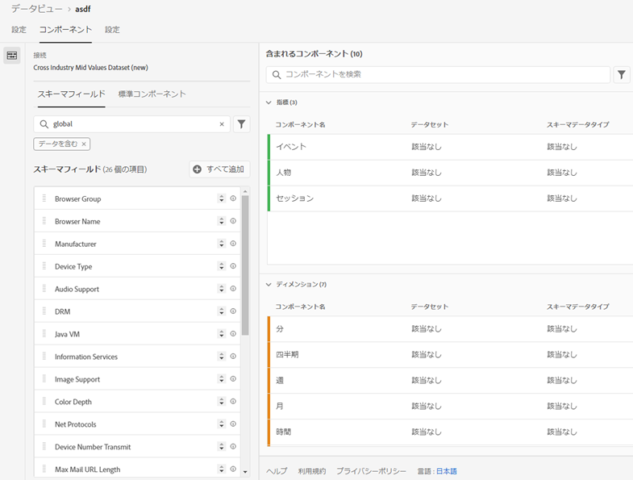
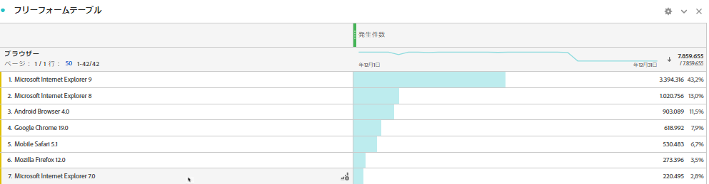

# データセットへの標準検索の追加

>[!IMPORTANT]
>標準検索は、CJA の Analytics Data Connector データソースでのみ使用できます。これらは、標準の Adobe Analytics 実装、[Adobe Experience Platform Web SDK](https://experienceleague.adobe.com/docs/experience-platform/edge/home.html?lang=ja)、または Experience Platform Data Collection API で使用できます。

標準検索（アドビ提供の検索とも呼ばれる）は、Customer Journey Analytics の機能を強化して、単体では役に立たなくても、他のデータと結合すると役立つディメンションや属性についてレポートします。例としては、モバイルデバイスの属性、OS ディメンションおよびブラウザーディメンションの属性（ブラウザーのバージョン番号など）があります。「標準検索」は検索データセットに似ています。標準検索は Experience Cloud 組織をまたいで適用できます。これらは、特定の XDM スキーマフィールドを含むすべてのイベントデータセットに自動的に適用されます（特定のフィールドについては、以下を参照してください）。標準の検索データセットは、アドビが分類しているスキーマの場所ごとに存在します。

従来の Adobe Analytics では、これらのディメンションは単独で表示されますが、CJA では、データビューを作成するときにこれらのディメンションを積極的に含める必要があります。接続ワークフローでは、標準検索用のキーを持つデータセットとしてフラグが付けられたデータセットを選択します。データビュー UI は、すべての標準検索ディメンションを自動的に認識し、レポートに使用可能として含めます。すべての地域およびすべてのアカウントにおいて、検索ファイルは自動的に最新の状態に保たれ、使用可能になります。これらは、顧客に関連付けられた地域固有の組織に保存されます。

## Adobe Data Connector データセットでの標準検索の使用

標準検索データセットは、レポート時に自動的に適用されます。Analytics Data Connector を使用して、アドビが標準検索を提供しているディメンションを取り込むと、この標準検索が自動的に適用されます。イベントデータセットに XDM フィールドが含まれている場合は、標準検索を適用できます。

<!--
### Specific IDs that need to be populated

The following IDs need to be populated in the specific XDM mixins for this functionality to work:

* Environment Details Mixin – device/typeID value populated - Must match Device Atlas IDs and will populate device data.
* Adobe Analytics ExperienceEvent Template Mixin or Adobe Analytics ExperienceEvent Full Extension Mixin with analytics/environment/browserIDStr and analytics/environment/operatingSystemIDStr. Both must match the Adobe IDs and  populate browser and OS data, respectively.

You need these mixins with the three IDs populated (device/typeID, environment/browserIDStr, and environment/operatingSystemIDStr). The lookup dimensions will then be pulled automatically by CJA and will be available in the Data View.

The catch here is that they can only populate those IDs today if they have a direct relationship with Device Atlas. They are Device Atlas IDs, and they provide an API to allow a customer to look them up. This is a significant hurdle, and we may just want to take the reference to this capability out of the product documentation until we have a productized way to expose the Device Atlas ID lookup functionality.
-->

### 使用可能な標準検索フィールド

* `browser`
   * `browser`、`group_id`、`id`
* `browser_group`
   * `browser_group`、`id`
* `os`
   * `os`、`group_id`、`id`
* `os_group`
   * `os_group`、`id`
* `mobile_audio_support - multi`
* `mobile_color_depth`
* `mobile_cookie_support`
* `mobile_device_name`
* `mobile_device_number_transmit`
* `mobile_device_type`
* `mobile_drm - multi`
* `mobile_image_support - multi`
* `mobile_information_services`
* `mobile_java_vm - multi`
* `mobile_mail_decoration`
* `mobile_manufacturer`
* `mobile_max_bookmark_url_length`
* `mobile_max_browser_url_length`
* `mobile_max_mail_url_length`
* `mobile_net_protocols - multi`
* `mobile_os`
* `mobile_push_to_talk`
* `mobile_screen_height`
* `mobile_screen_size`
* `mobile_screen_width`
* `mobile_video_support - multi`

## 標準検索ディメンションに関するレポート

標準検索ディメンションについてレポートするには、Customer Journey Analytics でデータビューを作成する際にそれらのディメンションを追加する必要があります。

そうすると、ワークスペースで検索データを確認できるようになります。

