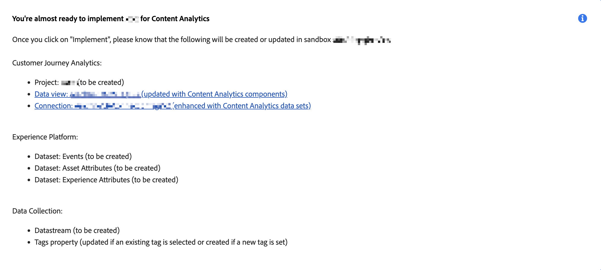

# Content Analytics ガイド付き設定

ガイド付き設定を使用すると、Content Analytics をすばやく簡単に設定できます。 ガイド付き設定では、ウィザードを使用して、組織の Content Analytics を自動的に設定するための要件を設定します。 **[!UICONTROL 設定]**&#x200B;画面で、新しい設定を作成するか、既存の設定を編集できます。

>[!IMPORTANT]
>
>組織のサンドボックスごとに 1 つの Content Analytics 設定のみを持つことができます。

>[!NOTE]
>
>設定ウィザードでは、複数のデータビューとチャネルがサポートされており、単一のデータビューとweb チャネルのみをサポートしていた以前のバージョンとは異なります。 [&#x200B; データビュー](#data-views) セクションで1つ以上のデータビューを選択する前に、サンドボックスと接続を選択する必要があります。 **[!UICONTROL Experience capture]**、**[!UICONTROL データ収集]**、**[!UICONTROL ヘッダーの上書き]**&#x200B;の設定はチャネルに依存しており、[&#x200B; チャネル &#x200B;](#channels) セクションで設定する各チャネルの一部です。

Content Analytics 設定にアクセスするには

* Customer Journey Analytics のメインメニューから&#x200B;**[!UICONTROL データ管理]**／**[!UICONTROL Content Analytics 設定]**&#x200B;を選択します。

**[!UICONTROL Content Analytics 設定]**&#x200B;画面に、既存の Content Analytics 設定のテーブルが表示されます。

各設定について、次の詳細を確認できます。

| 列 | 説明 |
|---|---|
| **[!UICONTROL 名前]** | 設定の名前。 |
| **[!UICONTROL 作成者]** | 設定を作成したテクニカルアカウント。 |
| **[!UICONTROL 作成日]** | 設定が作成されたときのタイムスタンプ。 |
| **[!UICONTROL 変更日]** | 設定が最後に変更されたときのタイムスタンプ。 |
| **[!UICONTROL サンドボックス]** | Content Analytics が（予定されて）設定および実装される、組織内のサンドボックス。 |
| **[!UICONTROL ステータス]** | 設定のステータス。 ステータスは、設定が完了した有効なチャネルの数を示します。 を使用して、より詳細な情報を含むポップアップを開きます。 |

 を使用して、テーブルをカスタマイズできます。 **[!UICONTROL テーブルをカスタマイズ]**&#x200B;ダイアログに表示する列を選択し、「**[!UICONTROL 適用]**」を選択して変更を適用します。

Content Analytics **[!UICONTROL 設定]**&#x200B;画面から、新しい設定を作成したり、既存の設定を編集したりできます。

新規フォルダーを作成するには：

* 「**[!UICONTROL 設定を作成]**」を選択します。 このアクションにより、[ガイド付き設定ウィザード](#guided-configuration-wizard)が開きます。

既存の設定を編集するには：

* 既存のコンテンツ分析設定に対して、「」を選択してから **[!UICONTROL 編集]**&#x200B;を選択します。 このアクションにより、[ガイド付き設定ウィザード](#guided-configuration-wizard)が開きます。

## ガイド付き設定ウィザード

ガイド付き設定ウィザードは、4つのセクション（[Details](#details)、[Connection](#connection)、[Data view](#data-view)、および[Channels](#channels)）で構成され、それぞれContent Analyticsを適切に設定および設定するために必要な詳細を求められます。 セクション内の一部の設定は、前のセクションの設定値に依存する場合があるので、次のセクションに進む前に各セクションを完了してください。

### 詳細 {#onboarding-details}

>[!CONTEXTUALHELP]
>id="aca_onboarding_details_button"
>title="詳細"
>abstract="接続の名前を指定します。 **[!UICONTROL データビュー]**、**[!UICONTROL エクスペリエンスのキャプチャと定義]**、**[!UICONTROL データ収集]**&#x200B;の各セクションでは、Content Analytics が正しく設定されるように詳細を指定します。"

>[!CONTEXTUALHELP]
>id="aca_onboarding_details_name_header"
>title="詳細"
>abstract="このガイドでは、コンテンツ分析を設定するために必要な要件を設定します。 この設定の名前を指定してください。"

>[!CONTEXTUALHELP]
>id="aca_onboarding_connection_boldheader"
>title="接続"
>abstract="**接続**"

>[!CONTEXTUALHELP]
>id="aca_onboarding_connection_header"
>title="接続"
>abstract="コンテンツ分析データを結合する Customer Journey Analytics の既存の接続を選択します。"

各設定には、一意の名前が必要です。 例えば、`Example Content Analytics configuration` のように設定します。 設定を保存または実装するには、名前が必須です。

また、設定ごとに、Content Analyticsを設定するサンドボックスを選択する必要があります。

* **[!UICONTROL 名前]**：各設定には一意の名前が必要です。 例えば、`Example Content Analytics configuration` のように設定します。 設定を保存または実装するには、名前が必須です。

* **[!UICONTROL サンドボックス]**：設定にはサンドボックスが必要です。 アクセス権があり、Content Analyticsに使用するデータが収集されるサンドボックスのリストから、サンドボックスを選択します。

  接続とオプションでデータビューを定義した設定サンドボックスを変更すると、接続とデータビューを再設定する必要があることが通知されます。

### 接続

Content Analytics data collectionを追加する接続を選択する必要があります。

設定の接続を選択していない場合：

1.  **[!UICONTROL 接続を選択]**&#x200B;して、サンドボックスで使用可能なすべての接続を一覧表示する&#x200B;**[!UICONTROL 接続を選択]** ダイアログを開きます。
1. **[!UICONTROL 接続を選択]** ダイアログで、使用する接続を選択します。 1つの接続のみを選択できます。
1. 「**[!UICONTROL 接続を使用]**」を選択します。

すでに接続を選択しているが、その接続を変更したい場合：

1.  **[!UICONTROL 編集]**&#x200B;を選択します。
1. **[!UICONTROL 接続を選択]** ダイアログで、使用する接続を変更します。
1. 「**[!UICONTROL 接続を使用]**」を選択します。

### データビュー {#onboarding-data-view}

>[!CONTEXTUALHELP]
>id="ac_onboarding_dataview_button"
>title="データビュー"
>abstract="Content Analytics を設定するには、既存のデータビューを選択する必要があります。 そのため、コンテンツ分析データを他のデータと結合できます。"

>[!CONTEXTUALHELP]
>id="aca_onboarding_dataview_header"
>title="データビュー"
>abstract="コンテンツ分析データを結合する Customer Journey Analytics の既存のデータビューを選択します。"

>[!CONTEXTUALHELP]
>id="aca_onboarding_dataview_header_alt"
>title="データビュー"
>abstract="コンテンツ分析データを結合する Customer Journey Analytics の既存のデータビューを選択します。 "

>[!CONTEXTUALHELP]
>id="aca_onboarding_dataview_change_dialog"
>title="新規データビュー"
>abstract="この設定用に新しいデータビューが選択されました。 新しいデータビューが更新され、コンテンツ分析指標とディメンションが含まれます。 これらの指標とディメンションは、最初に選択したデータビューから削除されます。  新しいデータビューに別の接続が関連付けられている場合、接続が更新され、コンテンツ分析データセットが含まれます。 コンテンツ分析データセットは、最初に選択した接続から削除されません。"

>[!CONTEXTUALHELP]
>id="aca_onboarding_dataview_current_cleanup_labels_dialog"
>title="選択したデータビューのクリーンアップ"
>abstract="Content Analytics 用に既にプロビジョニングしているデータビューが選択されました。 この既存の Content Analytics 設定は削除され、データビューが新しい設定でプロビジョニングされます。"

>[!CONTEXTUALHELP]
>id="aca_onboarding_dataview_prev_cleanup_labels_dialog"
>title="以前のデータビューのクリーンアップ"
>abstract="新しいデータビューが選択されました。 以前に選択したデータビューのContent Analytics設定が削除されます。"

>[!CONTEXTUALHELP]
>id="aca_onboarding_dataview_new_dialog"
>title="新規データビュー"
>abstract="この設定用に新しいデータビューが選択されました。 新しいデータビューが更新され、コンテンツ分析指標とディメンションが含まれます。 同様の指標とディメンションは、既存のデータビューから削除されます。 新しいデータビューに別の接続が関連付けられている場合、接続が更新され、コンテンツ分析データセットが含まれます。 なお、コンテンツ分析データセットは、既存の設定から削除されません。"

>[!CONTEXTUALHELP]
>id="ac_onboarding_dataviews_button"
>title="データビュー"
>abstract="コンテンツ分析の設定には、1 つ以上のデータビューを選択する必要があります。 そのため、コンテンツ分析データを他のデータと結合できます。"

>[!CONTEXTUALHELP]
>id="aca_onboarding_dataviews_header"
>title="データビュー"
>abstract="コンテンツ分析データを結合する Customer Journey Analytics の 1 つ以上の既存のデータビューを選択します。"

>[!CONTEXTUALHELP]
>id="aca_onboarding_dataviews_header_alt"
>title="データビュー"
>abstract="コンテンツ分析データを結合する Customer Journey Analytics の 1 つ以上の既存のデータビューを選択します。 "

>[!CONTEXTUALHELP]
>id="aca_onboarding_dataviews_new_dialog"
>title="選択したデータビュー"
>abstract="この設定用に選択したデータビューが変更されました。 選択したデータビューが更新され、コンテンツ分析指標とディメンションが含まれます。 これらの指標とディメンションは、選択されなくなった以前の選択したデータビューから削除されます。  選択したデータビューに別の接続が関連付けられている場合、接続は更新され、Content Analytics データセットが含まれます。 コンテンツ分析データセットは、最初に選択した接続から削除されません。  選択したすべてのデータビューでは、この設定の一部であるチャネルが継承されます。"

>[!CONTEXTUALHELP]
>id="aca_onboarding_dataviews_change_dialog"
>title="選択したデータビュー"
>abstract="この設定用に選択したデータビューが変更されました。 選択したデータビューが更新され、コンテンツ分析指標とディメンションが含まれます。 これらの指標とディメンションは、選択されなくなった以前の選択したデータビューから削除されます。  選択したデータビューに別の接続が関連付けられている場合、接続が更新され、コンテンツ分析データセットが含まれます。 コンテンツ分析データセットは、最初に選択した接続から削除されません。  選択したすべてのデータビューでは、この設定の一部であるチャネルが継承されます。"

>[!CONTEXTUALHELP]
>id="aca_onboarding_dataviews_current_cleanup_labels_dialog"
>title="選択したデータビュー"
>abstract="この設定用に選択したデータビューが変更されました。 選択したデータビューが更新され、コンテンツ分析指標とディメンションが含まれます。 これらの指標とディメンションは、選択されなくなった以前の選択したデータビューから削除されます。  選択したデータビューに別の接続が関連付けられている場合、接続が更新され、コンテンツ分析データセットが含まれます。 コンテンツ分析データセットは、最初に選択した接続から削除されません。  選択したすべてのデータビューでは、この設定の一部であるチャネルが継承されます。"

>[!CONTEXTUALHELP]
>id="aca_onboarding_dataviews_prev_cleanup_labels_dialog"
>title="選択したデータビュー"
>abstract="この設定用に選択したデータビューが変更されました。 選択したデータビューが更新され、コンテンツ分析指標とディメンションが含まれます。 これらの指標とディメンションは、選択されなくなった以前の選択したデータビューから削除されます。  選択したデータビューに別の接続が関連付けられている場合、接続が更新され、コンテンツ分析データセットが含まれます。 コンテンツ分析データセットは、最初に選択した接続から削除されません。  選択したすべてのデータビューでは、この設定の一部であるチャネルが継承されます。"

>[!CONTEXTUALHELP]
>id="aca_onboarding_channels_button"
>title="チャネル"
>abstract="設定用に 1 つ以上のチャネルを有効にして設定します。"

>[!CONTEXTUALHELP]
>id="aca_onboarding_channels_header"
>title="チャネル"
>abstract="設定用に 1 つ以上のチャネルを有効にして設定します。 設定の一部であるすべてのデータビューでは、有効なチャネルが継承されます。"

設定には、1つ以上の[&#x200B; データビュー](/help/data-views/data-views.md)を選択する必要があります。

設定にデータビューを選択していない場合：

1.  **[!UICONTROL Select data view]**&#x200B;を使用して、**[!UICONTROL Data view]** ダイアログを開きます。このダイアログには、Content Analytics用に設定した接続で使用可能なすべてのデータビューが一覧表示されます。
1. **[!UICONTROL データビュー]** ダイアログで、使用する1つ以上のデータビューを選択します。
1. 「**[!UICONTROL 保存]**」を選択します。

既に1つ以上のデータビューを選択しているが、その選択を変更する場合：

1.  **[!UICONTROL データビューの選択を編集]**&#x200B;を選択します。
1. **[!UICONTROL データビュー]** ダイアログで、使用するデータビューの選択を変更します。
1. 「**[!UICONTROL 保存]**」を選択します。

**[!UICONTROL Save]**&#x200B;を選択すると、**[!UICONTROL Selected data views]** ダイアログが表示され、選択したデータビューにContent Analyticsを含めることの意味について通知されます。 続行するには&#x200B;**[!UICONTROL 続行]**&#x200B;を選択し、キャンセルするには&#x200B;**[!UICONTROL キャンセル]**&#x200B;を選択します。

**[!UICONTROL データビュー]** ダイアログでは、次のアクションを使用できます。

* 特定のデータビューを検索するには、 フィールドを使用します。
* 使用可能なデータビューのリストをフィルタリングするには、「」を選択します。 [!UICONTROL 所有者]でリストをフィルタリングできます。 使用 **[!UICONTROL フィルターを非表示]** セグメント ペインを非表示にします。
* テーブルに表示する列を定義するには、「」を選択します。 **[!UICONTROL テーブルをカスタマイズ]**&#x200B;ダイアログに表示する列を選択し、「**[!UICONTROL 適用]**」を選択して変更を適用します。

### チャネル

「**[!UICONTROL チャネル]**」セクションで、Content Analyticsに対して有効にするチャネルを選択します。 **[!UICONTROL モバイル]**&#x200B;と&#x200B;**[!UICONTROL Web]**&#x200B;の間を選択できます。

* まだ設定していないチャネルを選択するには、**[!UICONTROL 有効]**&#x200B;を選択します。
* 既に設定されているものの、設定を変更するチャネルを選択するには、**[!UICONTROL 設定を編集]**&#x200B;を選択します。

その後、チャンネルをより詳細に設定できます。 この設定は、[mobile](#mobile)または[web](#web) チャネルの設定を有効にするか、または編集するかによって異なります。

#### モバイル {#mobile}

<!-- For updated ACA -->

>[!CONTEXTUALHELP]
>id="aca_onboarding_datacollection_mobile_experience_locations_boldheader"
>title="モバイルエクスペリエンスの場所のデータ収集"
>abstract="**除外するエクスペリエンスの場所**"

>[!CONTEXTUALHELP]
>id="aca_onboarding_datacollection_mobile_experience_locations_header"
>title="モバイルエクスペリエンスの場所のデータ収集"
>abstract="コンテンツ分析のデータを収集する際に、**除外する**&#x200B;エクスペリエンスの場所を指定します。 個人を特定できるエクスペリエンスの場所は除外する必要があります。"

>[!CONTEXTUALHELP]
>id="aca_onboarding_datacollection_mobile_asset_locations_boldheader"
>title="モバイルアセットの場所のデータ収集"
>abstract="**除外するアセットの場所**"

>[!CONTEXTUALHELP]
>id="aca_onboarding_datacollection_mobile_asset_locations_header"
>title="モバイルアセットの場所のデータ収集"
>abstract="コンテンツ分析のデータを収集する際に、**除外する**&#x200B;アセットの場所を指定します。 個人を特定できるアセットの場所は除外する必要があります。"

>[!CONTEXTUALHELP]
>id="aca_onboarding_datacollection_mobile_asset_urls_boldheader"
>title="モバイルアセットの URL のデータ収集"
>abstract="**除外するアセットの URL**"

>[!CONTEXTUALHELP]
>id="aca_onboarding_datacollection_mobile_asset_urls_header"
>title="モバイルアセットの URL のデータ収集"
>abstract="コンテンツ分析のデータを収集する際に、**除外する** URL の場所を指定します。 個人を特定できるアセット URLは除外する必要があります。"

モバイルチャネルの場合、[&#x200B; エクスペリエンスキャプチャと定義](#experience-capture-and-definition)、[&#x200B; データ収集](#data-collection)、[&#x200B; ヘッダーの上書き](#header-overrides)を設定できます。

##### エクスペリエンスのキャプチャと定義 {#mobile-experience-capture-and-definition}

このセクションでは、Content Analyticsで収集したモバイルデータにエクスペリエンスを含めるように選択できます。  モバイルチャネルのエクスペリエンスは、Adobe Experience Platform SDK Content Analytics版を使用してエクスペリエンスとして登録したものです。

デフォルトでは、**[!UICONTROL エクスペリエンスを含める]**&#x200B;は無効になっています。

モバイルアプリを実装してエクスペリエンスを登録し、エクスペリエンスビューとエクスペリエンスクリックを追跡する場合にのみ、エクスペリエンスを含めることを検討してください。

##### データ収集 {#mobile-data-collection}

Data Collection Settingsを使用すると、Content Analyticsで収集するデータ（エクスペリエンスの場所、アセットの場所、アセットのURL）を定義できます。 データ収集の一環として、個人を特定できる情報を収集しないようにします。

データ収集を設定するには：

* 既存のモバイルタグプロパティを使用するか、新しいモバイルタグプロパティを作成します。

   * 既存のモバイルタグプロパティを使用するには：

      1. 「**[!UICONTROL 既存のものを選択]**」を選択します。
      2. **[!UICONTROL タグプロパティ]**&#x200B;ドロップダウンメニューから既存のプロパティを選択します。 入力を開始して検索し、使用可能なオプションを制限できます。 別の実装されたContent Analytics設定で既に使用されているTags プロパティを選択することはできません。

   * 新しいモバイルタグプロパティを作成するには：

      1. 「**[!UICONTROL 新規作成]**」を選択します。
      1. 「**[!UICONTROL タグ名]**」を指定します（例：`ACA Test for Documentation`）。
      1. 「**[!UICONTROL ドメイン]**」を指定します（例：`example.com`）。

* Content Analyticsのデータを収集する際に除外するエクスペリエンスの場所を指定します。 個人を特定できるエクスペリエンスの場所は除外する必要があります。

  **を除外する** エクスペリエンスの場所に&#x200B;**[!UICONTROL 正規表現の文字列]**&#x200B;を指定します。  例：`^(?!.*documentation).*`：すべてのドキュメント エクスペリエンスの場所をContent Analyticsから除外します。

* Content Analyticsのデータを収集する際に除外するアセットの場所を指定します。 個人を特定できるアセットの場所は除外する必要があります。

  **[!UICONTROL アセットの場所]**&#x200B;を除外する&#x200B;**[!UICONTROL 正規表現の文字列]**&#x200B;を指定します。  例：`^(?!.*(logo\.jpg)).*$`：ロゴ付きのアセットの場所をすべてContent Analyticsから除外する場合。JPEGの画像を含むアセットの場所は除外されます。

* Content Analyticsのデータを収集する際に除外するアセット URLを指定します。 個人を特定できるアセット URLは除外する必要があります。

  **を除外する** アセット URLの&#x200B;**[!UICONTROL 正規表現の文字列]**&#x200B;を指定します。  例：`^(?!.*(logo\.jpg)).*$`:Content Analyticsからロゴ JPEG画像を参照するすべてのアセット URLを除外する

##### ヘッダーの上書き {#mobile-header-overrides}

<!-- needs modification for mobile channel -->

オプションとして、**[!UICONTROL ヘッダーの上書き]** セクションで、ヘッダー名とシークレットヘッダーの値を指定できます。  このヘッダーが設定を上書きすると、Content Analyticsがカスタム HTTP ヘッダーを送信して、ボット検出やトラフィックゲートテクノロジをバイパスしてモバイルアプリアセットを取得できるようになります。

を上書きします

1. **[!UICONTROL ヘッダーオーバーライドの設定]**&#x200B;を有効にします。
1. **[!UICONTROL ヘッダー名]**&#x200B;を入力します。 例：`x-asset-service`。
1. **[!UICONTROL ヘッダー値]**&#x200B;を入力します。 指定した内容は秘密鍵であり、ユーザーインターフェイスには表示されません（入力時に値を明示的に開示することを選択しない限り）。

##### 保存 {#mobile-save}

モバイルチャネルを設定したら、**[!UICONTROL 保存]**&#x200B;を選択して設定を保存します。 設定をキャンセルするには、**[!UICONTROL キャンセル]**&#x200B;を選択します。

#### Web {#web}

Web チャネルの場合、[&#x200B; エクスペリエンスキャプチャと定義](#experience-capture-and-definition-1)、[&#x200B; データ収集](#data-collection-1)、[&#x200B; ヘッダーの上書き](#header-overrides-1)を設定できます。

>[!CONTEXTUALHELP]
>id="aca_onboarding_experiences_button"
>title="エクスペリエンスのキャプチャと定義"
>abstract="Content Analytics で収集するデータにエクスペリエンスを含めるように選択できます。 選択した場合、エクスペリエンスを含める URL を定義するために、正規表現とクエリパラメーターの 1 つ以上の組み合わせを定義する必要があります。"

>[!CONTEXTUALHELP]
>id="aca_onboarding_experiences_header"
>title="エクスペリエンスのキャプチャと定義"
>abstract="Content Analytics でエクスペリエンスを収集"

>[!CONTEXTUALHELP]
>id="aca_onboarding_experiences_parameters_header"
>title="エクスペリエンスのキャプチャと定義"
>abstract="Web サイトでのコンテンツのレンダリング方法を決定するパラメーターを指定します。"

>[!CONTEXTUALHELP]
>id="aca_onboarding_experiencecapture_new_include_experiences"
>title="エクスペリエンスのキャプチャと定義"
>abstract="有効にすると、エクスペリエンスデータが収集され、エクスペリエンス属性が生成されて、エクスペリエンスレポートが使用可能になります。"

>[!CONTEXTUALHELP]
>id="aca_onboarding_experiencecapture_edit_include_experiences"
>title="エクスペリエンスのキャプチャと定義"
>abstract="有効にすると、エクスペリエンスデータが収集され、エクスペリエンス属性が生成されて、エクスペリエンスレポートが使用可能になります。   現在の設定に関連付けられているタグプロパティ内のエクスペリエンスのデータ収集設定を変更するには、 **[!UICONTROL 編集]** を使用します。"

>[!CONTEXTUALHELP]
>id="aca_onboarding_experiencecapture_edit_button"
>title="エクスペリエンスのキャプチャと定義"
>abstract="Adobe Content Analytics 拡張機能でエクスペリエンスデータ収集の設定を編集する必要があります。"

>[!CONTEXTUALHELP]
>id="aca_onboarding_datacollection_button"
>title="データ収集"
>abstract="使用するタグプロパティを定義するか、新しいタグプロパティを作成します。 また、正規表現を使用して、含めるまたは除外するページとアセットを定義します。  タグに依存しない実装の場合は、**[!UICONTROL 新規作成]**&#x200B;を選択します。  タグプロパティが作成されますが、使用する必要はありません。"
>additional-url="https://experienceleague.adobe.com/en/docs/analytics-platform/using/content-analytics/configuration/tags-agnostic" text="Content Analytics JavaScript library"

>[!CONTEXTUALHELP]
>id="aca_onboarding_datacollection_tag_header"
>title="データ収集"
>abstract="**タグプロパティの指定**"

>[!CONTEXTUALHELP]
>id="aca_onboarding_datacollection_pages_excluded_boldheader"
>title="データ収集"
>abstract="**含める／除外するページ**"

>[!CONTEXTUALHELP]
>id="aca_onboarding_datacollection_pages_excluded_header"
>title="データ収集"
>abstract="コンテンツ分析のデータを収集する際に、**含める**&#x200B;または&#x200B;**除外する**&#x200B;ページを指定します。 個人を特定できるページは除外します。"

>[!CONTEXTUALHELP]
>id="aca_onboarding_datacollection_assets_excluded_boldheader"
>title="データ収集"
>abstract="**含める／除外するアセット**"

>[!CONTEXTUALHELP]
>id="aca_onboarding_datacollection_assets_excluded_header"
>title="データ収集"
>abstract="コンテンツ分析のデータを収集する際に、**含める**&#x200B;または&#x200B;**除外する**&#x200B;アセットを指定します。 個人を特定できるアセットは除外します。"

>[!CONTEXTUALHELP]
>id="aca_onboarding_datacollection_experiences_edit_button"
>title="データ収集"
>abstract="現在の設定に関連付けられたタグプロパティの Adobe コンテンツ分析拡張機能のページの設定を編集できます。"

>[!CONTEXTUALHELP]
>id="aca_onboarding_datacollection_assets_edit_button"
>title="データ収集"
>abstract="現在の設定に関連付けられたタグプロパティの Adobe コンテンツ分析拡張機能のアセットの設定を編集できます。"

>[!CONTEXTUALHELP]
>id="aca_onboarding_datacollection_tags_disabled_description "
>title="タグプロパティが無効"
>abstract="コンテンツ分析拡張機能は既にアクティブです。"

<!-- For updated ACA -->

>[!CONTEXTUALHELP]
>id="aca_onboarding_datacollection_web_pages_boldheader"
>title="Web ページのデータ収集"
>abstract="**含める／除外するページ**"

>[!CONTEXTUALHELP]
>id="aca_onboarding_datacollection_web_pages_header"
>title="Web ページのデータ収集"
>abstract="コンテンツ分析のデータを収集する際に、**含める**&#x200B;または&#x200B;**除外する**&#x200B;ページを指定します。"

>[!CONTEXTUALHELP]
>id="aca_onboarding_datacollection_web_assets_boldheader"
>title="Web アセットのデータ収集"
>abstract="**含める／除外するアセット**"

>[!CONTEXTUALHELP]
>id="aca_onboarding_datacollection_web_assets_header"
>title="Web アセットのデータ収集"
>abstract="コンテンツ分析のデータを収集する際に、**含める**&#x200B;または&#x200B;**除外する**&#x200B;アセットを指定します。 個人を特定できるアセットは除外します。"

##### エクスペリエンスのキャプチャと定義 {#web-experience-capture-and-definition}

このセクションでは、Content Analyticsで収集したweb データにエクスペリエンスを含めるように選択できます。  エクスペリエンスは、最初のユーザー訪問のURLを使用して再現可能なweb ページ上のすべてのテキストで構成されます。

デフォルトでは、**[!UICONTROL エクスペリエンスを含める]**&#x200B;はオフになっています。 選択したら、エクスペリエンスを含めるURLを定義します。

次に該当する場合にのみ、エクスペリエンスを含めることを検討します。

* ページ URL を使用して、サイト上のページを再現できる必要があります。
* 特定のユーザーが表示するテキストコンテンツは、ページ URL を使用して再現でき、Cookie やその他のパーソナライゼーションメカニズムに依存しません。

>[!IMPORTANT]
>
>[Content Analytics のバージョン管理](manual.md#versioning)を実装して、Content Analytics の対象となるエクスペリエンス（ページ）に行った変更を収集します。

###### 新しい設定 {#new-experiences-configuration}

新しい設定や実装されていない設定にエクスペリエンスを含めるには：

1. 「**[!UICONTROL エクスペリエンスを含める]**」を有効にします。 エクスペリエンスを有効にする切替スイッチは、次の影響を受けます。

   * Content Analytics 拡張機能でのデータ収集
   * Content Analytics イベントデータからエクスペリエンス属性を生成するプロセス
   * Customer Journey Analytics のレポートテンプレート。

1. 「**[!UICONTROL 正規表現を追加]**」を選択して、ドメイン正規表現とクエリパラメーターの組み合わせを追加します。
1. ページのコンテンツに影響を与える&#x200B;**[!UICONTROL ドメインの正規表現]**&#x200B;と&#x200B;**[!UICONTROL クエリパラメーター]**&#x200B;の組み合わせを定義することで、web サイトでのコンテンツのレンダリング方法を指定します。
   1. **[!UICONTROL ドメイン正規表現]**（例：`/^(?!.*\b(store|help|admin)\b)/`）を入力します。 `/` を使用して、正規表現をエスケープする必要があります。 ドメイン正規表現は、これらのパラメーターが適用される URL を示します。 例えば、複数のサイトがあり、サイトごとに異なるパラメーターによってコンテンツが駆動される場合があります。 クエリパラメーターがすべてのページに適用される場合、`.*` を使用してすべてのページを示すことができます。
   1. **[!UICONTROL クエリパラメーター]**&#x200B;のコンマ区切りリスト（例：`outdoors, patio, kitchen`）を指定します。
1. ドメイン正規表現とクエリパラメーターの組み合わせを削除する場合は、「**[!UICONTROL 削除]**」を選択します。
1. 正規表現とクエリパラメーターの別の組み合わせを追加する場合は、「**[!UICONTROL 正規表現を追加]**」を選択します。

###### 実装された設定 {#implemented-experiences-configuration}

実装された設定に対して、既存のエクスペリエンスを編集するか新しいエクスペリエンスを含めるには：

* 「**[!UICONTROL エクスペリエンスを含める]**」を切り替えて有効または無効にします。

   * Content Analytics イベントデータからエクスペリエンス属性を生成するプロセス
   * Customer Journey Analytics のレポートテンプレート。

*  **[!UICONTROL 編集]**&#x200B;を選択して、Content Analyticsでのエクスペリエンスのデータ収集の設定をさらに編集します。 現在の設定に関連付けられたタグプロパティの [Adobe Content Analytics 拡張機能](https://experienceleague.adobe.com/ja/docs/experience-platform/tags/extensions/client/content-analytics/overview#configure-event-segmenting)にリダイレクトされます。

##### データ収集 {#web-data-collection}

Data Collection Settingsを使用すると、Content Analyticsで収集するデータ（ページ、アセット）を定義できます。 個人を特定できる情報をデータ収集の一環として収集しないでください。

データ収集を設定するには：

* 既存のweb タグプロパティを使用するか、新しいweb タグプロパティを作成します。

   * 既存のweb タグプロパティを使用するには：

      1. 「**[!UICONTROL 既存のものを選択]**」を選択します。
      2. **[!UICONTROL タグプロパティ]**&#x200B;ドロップダウンメニューから既存のプロパティを選択します。 入力を開始して検索し、使用可能なオプションを制限できます。 別の実装されたContent Analytics設定で既に使用されているTags プロパティを選択することはできません。

   * 新しいweb タグプロパティを作成するには：

      1. 「**[!UICONTROL 新規作成]**」を選択します。
      1. 「**[!UICONTROL タグ名]**」を指定します（例：`ACA Test for Documentation`）。
      1. 「**[!UICONTROL ドメイン]**」を指定します（例：`example.com`）。

     [Content Analytics Javascript ライブラリ &#x200B;](/help/content-analytics/config/tags-agnostic.md)を使用して、web チャネルに対してTagsに依存しない実装を作成する場合は、新しいTags プロパティを使用します。 Tags プロパティが作成されますが、非依存の実装ではプロパティを使用しません。 ただし、ガイド付き設定ウィザードを少なくとも1回実行する必要があります。

* Content Analytics 用のデータを収集する際に、どのページを含めるか除外するかを指定します。 個人を特定できるページは除外します。

  **[!UICONTROL ページに対して**&#x200B;[!UICONTROL &#x200B;正規表現の文字列&#x200B;]&#x200B;**を指定して、含める/除外します]**。  例：Content Analytics からすべてのドキュメントページを除外する `^(?!.*documentation).*`。

* Content Analytics 用のデータを収集する際に、どのアセットを含めるか除外するかを指定します。 個人を特定できるアセットは除外します。

  **[!UICONTROL アセットに含める/除外]**&#x200B;する&#x200B;**[!UICONTROL 正規表現の文字列]**&#x200B;を指定します。  例：`^(?!.*(logo\.jpg)).*$`コンテンツ分析からすべてのロゴ JPEG 画像を除外する。

##### ヘッダーの上書き {#web-header-overrides}

>[!CONTEXTUALHELP]
>id="aca_onboarding_datacollection_header_overrides_boldheader"
>title="ヘッダーの上書き"
>abstract="**ヘッダーの上書き**"

>[!CONTEXTUALHELP]
>id="aca_onboarding_datacollection_header_overrides_header"
>title="ヘッダーの上書き"
>abstract="ボット検出またはゲートトラフィックをバイパスする高度な機能。 コンテンツ分析には、エンドポイントの呼び出し時にカスタム HTTP ヘッダーが含まれます。"

<!-- needs modification for mobile channel -->

オプションとして、**[!UICONTROL ヘッダーの上書き]** セクションで、ヘッダー名とシークレットヘッダーの値を指定できます。  このヘッダーの上書き設定により、Content Analyticsがカスタム HTTP ヘッダーを送信して、実装したボット検出やトラフィックゲーティングテクノロジーをバイパスできるようになります。

を上書きします

1. **[!UICONTROL ヘッダーオーバーライドの設定]**&#x200B;を有効にします。
1. **[!UICONTROL ヘッダー名]**&#x200B;を入力します。 例：`x-asset-service`。
1. **[!UICONTROL ヘッダー値]**&#x200B;を入力します。 指定した内容は秘密鍵であり、ユーザーインターフェイスには表示されません（入力時に値を明示的に開示することを選択しない限り）。

#### 保存 {#web-save}

Web チャネルの詳細を指定したら、**[!UICONTROL 保存]**&#x200B;を選択して設定を保存します。 設定をキャンセルするには、**[!UICONTROL キャンセル]**&#x200B;を選択します。

### 概要 {#summary}

必要な詳細をすべて入力すると、作成または変更されたアーティファクトの詳細が概要に表示されます。

* 新しい設定を実装すると、**[!UICONTROL Content Analytics 用の&#x200B;_設定名_を実装する準備がほとんど整いました]**&#x200B;という概要が表示されます。

* 既に実装されている設定の場合は、**[!UICONTROL Content Analytics 用の&#x200B;_設定名_を実装しました]**&#x200B;という概要が表示されます。

### アクション {#actions}

>[!CONTEXTUALHELP]
>id="aca_onboarding_implementation_warning_dialog"
>title="実装の確認"
>abstract="「**[!UICONTROL 実装]**」を選択した場合は、このワークフローで指定した入力に基づいて Content Analytics を設定します。 コンテンツ分析に一般的に役立つ内容に基づいて、いくつかの設定がデフォルトで選択されていますが、ユーザー（データ管理者）は各アーティファクトの設定を確認し、プライバシーポリシー、契約上の権利と義務、適用法に基づく同意要件に従って設定が実装されていることを確認する必要があります。  この設定に関連付けられたタグライブラリを手動で公開するまで、データは収集されません。  画像やテキストの属性を取得するために、アドビでは、次を使用して属性を取得します。<ol><li>設定したデータ収集設定に従って、ユーザーのサイト訪問時に取得されるページの URL。</li><li>画像がホストされる URL。</li></ol>サードパーティのサイトでホストされる画像にタグを付けないでください。"

設定を作成または編集する際には、次のオプションがあります。

* **[!UICONTROL 破棄]**：設定の一環として行ったすべての変更は破棄されます。
* **[!UICONTROL 後のために保存]**：設定に行った変更が保存されます。 後のステージで設定を再度参照して、さらに変更を行ったり、設定を実装したりすることができます。 設定を保存するには、[!UICONTROL 名前]の値のみが必要です。
* **[!UICONTROL 実装]**：設定に行った設定または変更が保存および実装されます。 としてマークされたすべてのフィールドには、適切な値が必要です。 実装は次で構成されます。

   * **[!UICONTROL Customer Journey Analytics]** 設定：
      * 選択したデータビューが更新され、Content Analytics ディメンションと指標が含まれます。
      * 選択したデータビューに関連付けられた接続を変更すると、Content Analytics イベントと属性データセットが含まれます。
      * Content Analytics レポートテンプレートが Workspace に追加されます。

   * **[!UICONTROL Adobe Experience Platform]** 設定：
      * Content Analytics イベント、アセット属性および（設定した場合）エクスペリエンス属性をモデル化するスキーマの作成。
      * Content Analytics イベント、アセット属性および（設定した場合）エクスペリエンス属性を収集するデータセットの作成。
      * 機能サービスを使用して Content Analytics イベントからコンテンツ属性を生成および更新するデータフローの作成。

   * **[!UICONTROL データ収集]**&#x200B;設定：
      * 新しいまたは既存のタグプロパティを設定すると、Content Analytics データ収集がサポートされます。 つまり、この設定には、タグ用の Adobe Content Analytics 拡張機能が含まれます。
      * Content Analytics イベント用のデータストリームが作成されます。
      * Adobe Content Analytics 拡張機能を設定すると、Content Analytics イベントが Content Analytics 用のデータストリームに送信されます。
      * Web SDKまたはMobile SDKがTags プロパティ用に設定されていない場合は、新しいWeb SDKまたはMobile SDK設定が作成され、Content Analytics イベントのみが送信されます。
      * Web SDKまたはMobile SDKがTags プロパティ用に設定されている場合、既存のWeb SDKまたはMobile SDK設定は変更されません。

* **[!UICONTROL 保存]**：実装した設定に行った変更は保存され、実装が更新されます。
* **[!UICONTROL 終了]**。 ガイド付き設定を終了します。 実装した設定に行ったすべての変更は破棄されます。

## 公開 {#publish}

Content Analytics設定のデータ収集を開始するには、有効にしたチャネルの作成されたタグプロパティを[手動で](manual.md)公開する必要があります。

>[!MORELIKETHIS]
>
>[手動設定](manual.md)
>

