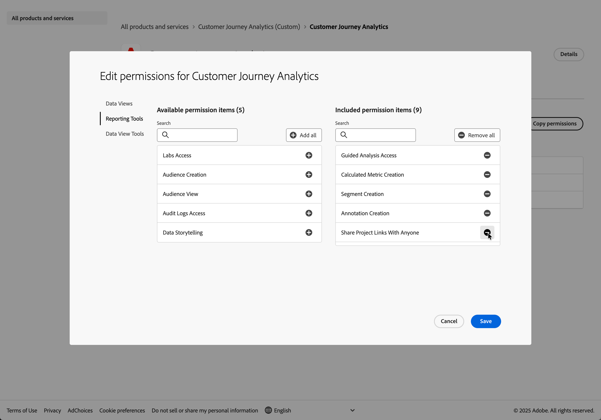

# スタンドアロン設定

>[!IMPORTANT]
>
>このコンフィギュレーションガイドは、スタンドアロンのAdobe Content Analytics パッケージのライセンスを取得したお客様向けです。 このガイドでは、Content Analyticsの機能と機能以外で、Customer Journey Analyticsまたはその他のExperience Platform アプリケーションを使用していない、または使用する予定がないことを前提としています。 既存のContent Analytics実装の一部としてContent Analyticsを設定して使用する場合は、[Customer Journey Analytics](configuration.md)を参照してください。
>

Content Analyticsはスタンドアロン製品としてライセンスされていますが、設定はExperience PlatformとCustomer Journey Analytics内で行われます。 これらのプラットフォームは、Content Analyticsに必要なデータ収集と分析のインフラストラクチャを提供します。 このガイドでは、Experience PlatformとCustomer Journey Analyticsを初めて使用する場合でも、必要な具体的な手順について説明します。

スタンドアロン Content Analyticsの設定を開始する前に、次のことをおこなう必要があります。

* webとモバイルの分析の概念、タグ管理システムの知識、JavaScriptの基本的な知識を習得している。 Content Analyticsのモバイルチャネル版は、モバイルアプリ開発のスキルが必要です。
* 初期設定の4～6時間と、設定のテストと検証にさらなる時間を計画します。

## 用語

このガイドでは、Experience PlatformやCustomer Journey Analyticsなど、いくつかの専門用語を使用します。これらの用語についてはあまり知られていないかもしれません。 以下は、Content Analyticsに関連する以下の用語（参照リンク付き）の説明です。

| 用語 | 説明 |
|---|---|
| **スキーマ** | [ スキーマ ](https://experienceleague.adobe.com/ja/docs/experience-platform/xdm/schema/composition)は、データの構造と形式を表し、検証する一連のルールです。 スキーマでは、web サイト上で発生するイベント（クリックなど）など、実際のオブジェクトの抽象的な定義を提供します。 そのオブジェクトの各インスタンスに含めるデータを定義できます。 |
| **データセット** | [ データセット ](https://experienceleague.adobe.com/ja/docs/experience-platform/catalog/datasets/overview)は、スキーマ（列）とフィールド（行）を含むデータのコレクション（通常はテーブル）のストレージおよび管理構造です。 データセットは、各行がweb サイトのイベントであるデータベーステーブルのようなものです。 |
| **データストリーム** | [datastream](https://experienceleague.adobe.com/ja/docs/experience-platform/datastreams/overview)は、web サイトからAdobe Experience Platformの正しいデータセットにデータをルーティングするサーバーサイド設定を表します。 データストリームは、サイトとストレージを接続するデータハイウェイとして機能します。 |
| **タグ** | Experience Platformの[ タグ ](https://experienceleague.adobe.com/en/docs/experience-platform/tags/home)は、Adobeが提供する次世代のタグ管理機能です。 タグを使用すると、適切な顧客体験を実現するために必要な分析、マーケティング、広告タグを簡単にデプロイおよび管理できます。 Content Analyticsなら、Adobeのタグ管理システムにより、あらゆるページを同様に編集することなく、web サイトにトラッキングコードを導入できます。 タグ機能は、Google Tag Managerで把握している機能と似ています。 |
| **サンドボックス** | Experience Platformでは、1つのExperience Platform インスタンスを個別の仮想環境に分割し、デジタルエクスペリエンスアプリケーションの開発と進化に役立つ[ サンドボックス ](https://experienceleague.adobe.com/ja/docs/experience-platform/sandbox/home)を提供しています。 Content Analyticsでは通常、*実稼動* サンドボックスを使用します。 |
| **接続** | [Connections](https://experienceleague.adobe.com/en/docs/analytics-platform/using/cja-connections/overview)は、取り込むExperience Platform データセットを定義します。 接続は、データセット（データがAEPに保存される場所）とCustomer Journey Analytics（分析される場所）の間のリンクを定義します。 接続により、収集したデータをレポートに利用できるようになります。 |
| **データビュー** | [ データビュー](https://experienceleague.adobe.com/ja/docs/analytics-platform/using/cja-dataviews/data-views)は、接続からデータを解釈する方法を決定できるコンテナです。 データビューとは、レポートで利用できるすべてのディメンションと指標を指定します。 データビューは、分析で使用できる行と列を決定する設定のようなものです。 |
| **Analysis Workspace** | [Analysis Workspace](https://experienceleague.adobe.com/ja/docs/analytics-platform/using/cja-workspace/home)は、Content Analytics レポートや分析の作成に使用するドラッグ&amp;ドロップ操作のブラウザーインターフェイスです。 |
| **エクスペリエンス** | Content Analyticsでは、[ エクスペリエンス ](https://experienceleague.adobe.com/en/docs/analytics-platform/using/content-analytics/content-analytics#terminology)とは、web ページ上のすべてのテキストコンテンツを指します。このコンテンツは、ページ URLに基づいてキャプチャおよび分析できます。 |
| **アセット** | Content Analyticsでは、[ アセット ](https://experienceleague.adobe.com/en/docs/analytics-platform/using/content-analytics/content-analytics#terminology)は、画像のような個別でユニークなコンテンツです。 |

## 設定の概要

この設定では、動作する&#x200B;**スタンドアロン** Content Analyticsの実装が必要なすべてのアプリケーションの設定をガイドします。 設定は3つのフェーズに分けることができ、各フェーズは前のフェーズに基づいて構築されます。

**フェーズ 1** - [環境の準備](#prepare-your-environment)。 この段階では、ユーザー権限を設定し、データインフラストラクチャを検証します。 これらの適切な権限とデータ構造を使用すると、残りの手順を完了できます。 必要な手順は次のとおりです。

1. **Content Analyticsの設定と実装をサポートするために、アクセス制御と権限**&#x200B;を設定します。
1. **スキーマとデータセット**&#x200B;を設定して、コンテンツ分析のインサイトを収集するデータのモデル（スキーマ）とそのデータ（データセット）を収集する場所を定義します。

**フェーズ 2** - [ データ収集の設定](#configure-data-collection)。 この段階では、web サイトからコンテンツデータを取り込むパイプラインを作成します。 つまり、Content Analyticsは訪問者がどのコンテンツに関心を持っているのかを把握しています。

1. **収集したデータをデータセットにルーティングする方法を設定するデータストリーム**&#x200B;を設定します。
1. **web サイト タグ**&#x200B;を使用して、web サイト上のデータ レイヤー内のデータに対するルールとデータ要素を設定し、設定されたデータストリームにデータが確実に送信されるようにします。
1. 実稼動環境に公開する前に、**テスト環境**&#x200B;に&#x200B;**をデプロイし、データ収集を**&#x200B;検証します。

**フェーズ 3** - [ レポートの設定](#set-up-reporting)。 この段階では、収集したデータをレポートで分析できるようにします。 つまり、Content Analyticsから取得したいコンテンツパフォーマンスに関するインサイトを実際に得ることができます。

1. **データセットへの接続**&#x200B;を設定します。
1. **指標とディメンションを定義するためのデータビュー**&#x200B;の設定。
1. **Content Analyticsを構成して実装します**。
1. **プロジェクトを設定**&#x200B;して、Content Analytics レポートとビジュアライゼーションを作成します。

## 環境の準備

この段階では、ユーザー権限を設定し、データインフラストラクチャを検証します。

### アクセス制御と権限の設定

この節では、製品、製品プロファイルに必要なアクセス権と、スタンドアロン Content Analyticsの設定と設定に必要な権限について説明します。 Content Analyticsの機能のみに関心がありますが、その機能を適切に動作させるには、他のExperience Platform製品へのアクセス権と権限が必要です。

#### アクセス制御

アクセス制御は、Experience Platform製品へのアクセスが許可されているかどうかを判断します。

製品または製品プロファイルの管理者として追加するには、システム管理者または製品管理者が必要です。 製品管理者は、管理製品（プロファイル）の管理者としてのみユーザーを追加でき、システム管理者は製品管理者を任意の製品（プロファイル）に追加できます。

>[!BEGINSHADEBOX]

デモ動画については、 [製品プロファイルのユーザーの管理](https://experienceleague.adobe.com/ja/docs/experience-platform/access-control/ui/users){target="_blank"}を参照してください。

>[!ENDSHADEBOX]

スタンドアロン Content Analyticsの次の製品および製品プロファイルの製品管理者である必要があります。

* Adobe Experience Platform
   * AEP-Default-All-Users （実稼動用サンドボックスへのアクセス用のデフォルトプロファイル）

* Adobe Experience Platform のデータ収集
   * デフォルトのデータ収集のすべてのアクセス

* Adobe Experience Platform Privacy Service

* Customer Journey Analytics （カスタム）
   * Customer Journey Analytics（またはその他のデフォルトのプロビジョニング済み製品プロファイル）

Admin Consoleを使用して、製品管理者のアクセス権を定義します。

1. [Admin Console](https://adminconsole.adobe.com)にアクセスします。
1. **[!UICONTROL 製品]**&#x200B;を選択します。
1. 特定の製品を選択します。
1. 「**[!UICONTROL 管理者]**」タブを選択します。
1. 「**[!UICONTROL 管理者を追加]**」を選択して、製品に管理者を追加します。
1. **[!UICONTROL 製品管理者を追加]** ダイアログに1つ以上の電子メールまたはユーザー名を入力します。 「**[!UICONTROL 保存]**」を選択して保存します。

Admin Consoleを使用して、製品プロファイル管理者のアクセス権を定義します。

1. [Admin Console](https://adminconsole.adobe.com)にアクセスします。
1. **[!UICONTROL 製品]**&#x200B;を選択します。
1. 特定の製品を選択します。 製品管理者のアクセス権が既にあることを確認します。
1. **[!UICONTROL 製品プロファイル]**&#x200B;を選択します。
1. 特定の製品プロファイルを選択します。
1. 「**[!UICONTROL 管理者]**」タブを選択します。
1. 「**[!UICONTROL 管理者を追加]**」を選択して、管理者を製品プロファイルに追加します。
1. **[!UICONTROL 製品プロファイル管理者を追加]** ダイアログに1つ以上の電子メールまたはユーザー名を入力します。 「**[!UICONTROL 保存]**」を選択して保存します。

#### 権限

権限は、製品にアクセスできるようになった後に、製品内で何ができるかを定義します。

Experience Platformの権限は[!UICONTROL 権限] インターフェイスで定義し、属性ベースのアクセス制御を使用します。 Customer Journey Analyticsの場合、[!UICONTROL Admin Console]を使用して権限を定義します。

##### Experience Platform

Experience Platformの[!UICONTROL 権限] インターフェイスは、ロールの定義に基づいています。 役割は、リソースベースの権限のコレクションです。 新しいプロビジョニング環境では、2つのデフォルトの役割を使用できます。**[!UICONTROL デフォルトの実稼動環境のすべてのアクセス]**&#x200B;と&#x200B;**[!UICONTROL サンドボックス管理者]**。

Content Analyticsの場合、以下のリソースと関連する権限がこれらの役割に追加されているかどうかを確認する必要があります。

* Default Production All Access role

   * データ収集
      * データストリームを表示
      * データストリームの管理

   * データ管理
      * データセットの表示
      * データセットの管理

   * データモデリング
      * スキーマの表示
      * スキーマの管理
      * ID メタデータの管理

* サンドボックス管理者の役割

   * サンドボックス
      * 製品
      * （Content Analyticsに使用するその他のサンドボックス）

   * サンドボックス管理
      * パッケージの管理
      * サンドボックスの管理
      * サンドボックスをリセット
      * サンドボックス表示

権限インターフェイスでは、役割と関連する権限の両方を確認できます。 このインターフェイスには、役割に属するユーザーも表示されます。

1. 自社のExperience Platformにアクセス。
1. ようこそ画面の&#x200B;**[!UICONTROL クイックアクセス]**&#x200B;で、**[!UICONTROL すべて表示]**&#x200B;を選択します。
1. **[!UICONTROL 権限]**&#x200B;のピン を有効にします。これにより、**[!UICONTROL 権限]**&#x200B;は&#x200B;**[!UICONTROL クイックアクセス]**&#x200B;内で利用できるようになります。
1. **[!UICONTROL 権限]**&#x200B;を選択します。
1.  **[!UICONTROL 役割]**&#x200B;を選択します。
1. 確認する特定の役割を選択します（例：**[!UICONTROL Default Production All Access]**）。 **[!UICONTROL すべてを表示]**&#x200B;を選択してすべての権限を表示します。
1. **[!UICONTROL Details]**&#x200B;画面で、次の操作を行います。
   1. **[!UICONTROL 権限]**&#x200B;にリストされている&#x200B;**[!UICONTROL リソース]**&#x200B;を確認します。
   1. **[!UICONTROL サンドボックス]**&#x200B;のサンドボックス名を確認します。

   更新を行うには、 **[!UICONTROL 編集]**&#x200B;を選択します。
   1. 不足しているリソースを追加するには、**[!UICONTROL リソース]** > **[!UICONTROL Adobe Experience Platform]**&#x200B;左レールから&#x200B;**[!UICONTROL リソース名]** を選択します。
   1. 見つからない権限を追加するには、メインパネルで権限が見つからないリソース内のを選択し、見つからない権限を選択します。

      

   **[!UICONTROL 保存]**&#x200B;を選択して、任意の更新を保存します。

1. ユーザーまたはユーザーグループ画面で、次の操作を行います。
   1. 適切な個々のユーザーまたはユーザーグループがこの役割の一部であることを確認します。
      1. 「 Add Users in Users」を選択して、Admin Consoleで定義した個々のユーザーを追加します。
      1. 「 Add Groups in Users groups」を選択して、Admin Consoleで定義したユーザーグループを追加します。

##### Customer Journey Analytics

Customer Journey Analyticsでは、属性ベースのアクセス制御はサポートされていません。 権限を指定するには、Admin Consoleを使用します。

Content Analyticsの場合、次のCustomer Journey Analytics製品プロファイル権限が含まれているかどうかを確認する必要があります。

* データビュー
   * 利用可能なすべてのデータビュー。

* レポートツール
   * 計算指標の作成
   * セグメントの作成
   * 注釈の作成
   * 監査ログへのアクセス
   * 他のユーザーとプロジェクトリンクを共有
   * 予測
   * AI アシスタント : 製品知識
   * Data Insights Agent
   * インテリジェントキャプション

* データビューツール
   * 完全なテーブルの書き出し

Customer Journey Analyticsに対するこれらの権限を確認して更新するには：

1. [Admin Console](https://adminconsole.adobe.com)にアクセスします。
1. **[!UICONTROL 製品]**&#x200B;を選択します。
1. 「**[!UICONTROL Customer Journey Analytics]**」商品を選択します。
1. **[!UICONTROL 製品プロファイル]**&#x200B;を選択します。
1. Customer Journey Analyticsで使用できるデフォルトのプロビジョニング済み製品プロファイルを選択します。 例：**[!UICONTROL Customer Journey Analytics]**。
1. 製品プロファイル画面で、**[!UICONTROL 権限]**&#x200B;を選択します。
1.  ボタンのいずれかを選択して、権限を編集します。 Customer Journey Analytics ]**の権限を編集ダイアログで、次の操作を行います。**[!UICONTROL 

   

   1. **[!UICONTROL データビュー]**&#x200B;を選択し、**[!UICONTROL 自動含める：]**&#x200B;を有効にします。 この切り替えにより、すべてのデータビューが&#x200B;**[!UICONTROL 含まれる権限項目]**&#x200B;に自動的に含まれるようになります。
   1. **[!UICONTROL レポートツール]**&#x200B;を選択し、上記のすべての権限が&#x200B;**[!UICONTROL 含まれる権限項目]**&#x200B;に含まれていることを確認します。
   1. **[!UICONTROL データ表示ツール]**&#x200B;を選択し、上記のすべての権限が&#x200B;**[!UICONTROL 含まれる権限項目]**&#x200B;に含まれていることを確認します。

   「**[!UICONTROL 保存]**」を選択します。

### スキーマとデータセットの設定

web サイトからデータを収集してContent Analyticsインサイトを入手するには、まず、収集するデータの種類を決定する必要があります。 また、データの保存方法を定義する必要があります。 両方の概念については、「[Adobe Experience Platform Web SDK](/help/data-ingestion/aepwebsdk.md)を介したデータの取り込み」および「[Adobe Experience Platform Mobile SDK](/help/data-ingestion/aepmobilesdk.md) クイックスタートガイド」の「[ スキーマとデータセットの設定](/help/data-ingestion/aepwebsdk.md#set-up-a-schema-and-dataset)」で説明しています。

## データ収集の設定

この段階では、web サイトからコンテンツデータを収集するパイプラインを作成します。

### データストリームの設定

収集するデータとそのデータの保存方法を定義しました。 次のステップは、web サイトから収集したデータがデータセットにルーティングされるようにすることです。 データストリームを設定して設定する必要があります。詳しくは、[Adobe Experience Platform Web SDK](/help/data-ingestion/aepwebsdk.md) クイックスタートガイドの「[ データストリームの設定](/help/data-ingestion/aepwebsdk.md#set-up-a-datastream)」を参照してください。

### タグの使用

収集するデータ（スキーマ）、そのデータの保存方法（データセット）、web サイトから収集したデータをデータセット（データストリーム）にルーティングする方法を定義しました。 次のステップでは、web サイトにタグを付けて、web サイト上のデータレイヤーのデータに対してルールとデータ要素を設定する必要があります。 web サイトにタグ付けすると、設定されたデータストリームにデータが確実に送信されます。 タグを使用したweb サイトへのタグ付けについては、[Web SDK](/help/data-ingestion/aepwebsdk.md#use-tags)および[ モバイル SDK](/help/data-ingestion/aepmobilesdk.md#use-tags)のクイックスタートガイドの「タグを使用」で説明しています。

### デプロイと検証

次に、web サイトの開発バージョンで、`<head>` タグをデプロイできます。 デプロイすると、web サイトは Adobe Experience Platform へのデータの収集を開始します。 その後、Content Analyticsの対象となります。

実装を検証し、必要に応じて修正したら、タグの公開ワークフロー機能を使用して、ステージング環境と本番環境にデプロイします。

## レポートの設定

この段階では、収集したデータをレポートで分析できるようにします。

### データセットへの接続の設定

収集したデータをレポートし、そのデータをContent Analytics用に設定するには、Customer Journey Analyticsで接続を設定する必要があります。 接続は、収集されたデータを含むデータセットに接続します。 [Web SDK](/help/data-ingestion/aepwebsdk.md)および[ モバイル SDK](/help/data-ingestion/aepmobilesdk.md#set-up-a-connection) クイックスタートガイドの[接続の設定](../../data-ingestion/aepwebsdk.md#set-up-a-connection)を参照してください。

### データ表示の設定

Content Analyticsを設定する前の最後の手順は、データビューを定義することです。 データ表示は、Customer Journey Analytics に特有のコンテナで、接続からデータを解釈する方法を決定できます。 データビューを使用すると、Customer Journey Analyticsが接続されている1つ以上のデータセットのデータから、指標とディメンションを定義できます。 [Web SDK](/help/data-ingestion/aepwebsdk.md)および[ モバイル SDK](/help/data-ingestion/aepmobilesdk.md#set-up-a-data-view)のクイックスタートガイドの[ データビューの設定](/help/data-ingestion/aepwebsdk.md#set-up-a-data-view)を参照してください。

### Content Analytics の設定

これで、Content Analyticsを設定するための準備はすべて整いました。

#### ガイド付き設定

[ ガイド付き設定ウィザード ](guided.md)を使用し、[ データビューの設定](#set-up-a-data-view)手順の一環として作成したデータビューを選択します。 これにより、web サイトやモバイルアプリケーションから収集したデータに基づいて、Content Analyticsを適切に設定および実装できます。

ガイド付き設定ウィザードでは、次の具体的なContent Analytics オブジェクトが設定されていることに注意してください。

* Content Analytics イベント用に自動的に設定される&#x200B;**データセット**。 このデータセットは、既に作成され、使用可能な特定のContent Analytics スキーマを使用します。
* **データストリーム**。Content Analytics イベントをContent Analytics データセットにストリーミングするように自動的に設定されます。
* **タグのプロパティ**。これは自動的に設定され、Content Analytics拡張機能で設定されます。 このタグプロパティを使用すると、web サイトからContent Analytics データがContent Analytics データストリームとContent Analytics データセットに確実に送信されます。

  >[!IMPORTANT]
  >
  >ウィザードの[ データ収集](guided.md#new-configuration-1) ステップの一部として、新しいタグプロパティを作成するオプションを選択していることを確認してください。
  >

#### 手動設定

Web サイトにContent Analyticsを実装するには、Content Analytics Tags プロパティ [を手動で公開する必要があります](manual.md)。

### プロジェクトの設定

Customer Journey Analyticsでプロジェクトを設定して、[Content Analytics レポートとビジュアライゼーション ](/help/content-analytics/report/report.md)を作成します。 または、[Content Analytics テンプレート ](/help/content-analytics/report/report.md#template)を使用して開始することもできます。
