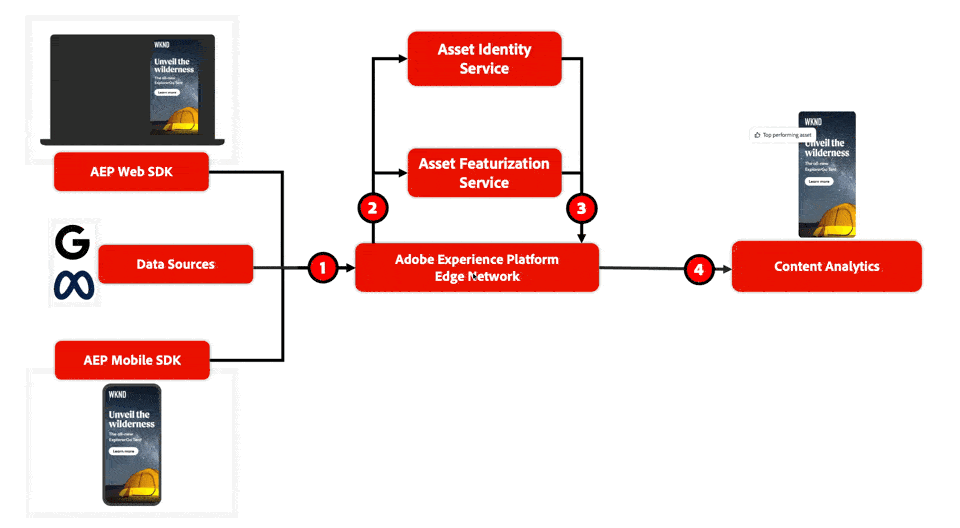

# Content Analytics の概要

Content Analytics は、ビジネスが定義した主要業績評価指標にコンテンツがどのような影響を与えるかをマーケターが理解するのに役立ちます。 Content Analyticsは、行動データに加えて、コンテンツがどのように消費され、コンテンツがどのように影響を与えるかについてのデータを収集します。 例えば、特定のトーン、特定のカラーパレット、特定のテーマに対するお客様の反応は良いですか？ この情報と、特別に設計されたレポートワークフローおよびテンプレートを組み合わせることで、Customer Journey Analytics でさらに優れた分析を実行し、カスタマージャーニーデータに関するより深いインサイトを得ることができます。

Content Analytics では、AI と機械学習ベースの&#x200B;**機能サービス**&#x200B;を使用して、コンテンツをコンポーネントと属性に分類します。 あらゆるコンテンツに対して構造化されたメタデータプロファイルを作成することで、そのコンテンツのどのコンテンツや属性がビジネス成果を促進しているのかを分析できます。

この構造化メタデータプロファイルの作成に加えて、Content Analytics では、単一の識別子を使用してアセットとエクスペリエンスを識別する **ID サービス**&#x200B;を提供します。 ID サービスは、まったく同じアセットが複数の場所に表示される場合に認識できます。 その場合、このアセットの各インスタンスは同じアセットとして扱われ、コンテンツの使用状況と消費をより総合的に把握できるようになります。

## 値

Content Analytics は、次のように段階的に価値を提供します。

1. コンテンツ&#x200B;**使用状況**：Content Analytics を使用すると、インプレッションを受信しているアセットと、インプレッションを受信しているアセットの場所に関するインサイトを得ることができます。 こうしたインサイトは、webやモバイルのプロパティでアセットが過小使用されているか、過剰に使用されているかを確認するのに役立ちます。
1. コンテンツ&#x200B;**エンゲージメント**：Content Analytics では、特定の属性を持つアセットの平均クリックスルー率などのエンゲージメントインサイトを提供できます。 これらのインサイトは、特定のタイプのエクスペリエンスが引き続き効果的かどうかを判断するのに役立ちます。
1. コンテンツジャーニー：さらに、Adobe Experience Platformに保管されているあらゆるデータと組み合わせることで、エンゲージメントだけでなく、特定のコンテンツがコンバージョンにつながるかどうかなど、コンテンツジャーニーに関するさらなるインサイトを獲得できます。 たとえば、特定のコンテンツがエンゲージメントだけでなくコンバージョンにつながるかどうかを確認します。 次に、その知識があれば、コンテンツのタイプに関する ROI を判断できます。
1. コンテンツ&#x200B;**パーソナライゼーション**：最終的に、Content Analytics により、インサイトに基づいて行動し、これらのインサイトを使用してコンテンツに費やす費用を決定できます。 例えば、特定のタイプのコンテンツを特定のオーディエンスに送信する必要があるでしょうか？ 高度なパーソナライゼーションの機会を提供してくれるコンテンツは何ですか？

## 用語

Content Analytics では、次の主要な用語を使用します。

* **エクスペリエンス**：エクスペリエンスは、最初のユーザーがweb ページにアクセスするために使用したURLを使用して再現可能なweb ページ上のすべてのテキストです。 モバイルアプリ内のアクションに対するテキスト、アセット、クリックの組み合わせから実行できます。 各エクスペリエンスには、一意の ID が付与されます。
* **アセット**：アセットとは、画像などの個別の一意のコンテンツです。 各アセットには、一意の ID と知覚的 ID も割り当てられます。 知覚的 ID は、視覚的に同一のアセットと共有される識別子です。 知覚的IDは、異なるアセット URLを持つ可能性があり、したがって異なるアセット IDを持つアセットの重複を排除するのに役立ちますが、知覚的には同じです。
* **属性**：属性とは、エクスペリエンスまたはアセットに関連付けられた説明的なメタデータ要素です。 属性の例としては、フォトのスタイル、読みやすさ、説得戦略、オブジェクトカラー、背景色などがあります。

## 仕組み

Content Analyticsでは、Experience Platform イベントデータセットからwebおよびモバイルの画像ビューデータと有料メディアデータを使用して、[&#x200B; コンテンツイベントデータを収集](config/datacollection.md)します。 これらのコンテンツエクスペリエンスイベントでは、Experience Platform Edge Network（Web SDK、モバイルSDK、サーバーAPI）またはExperience Platform ソースコネクタを通じてデータを収集する必要があります。

* 行動データは、Web SDK、モバイルSDK、Analytics Sourceコネクタを使用して収集できます。
* 有料メディアの場合、エクスペリエンスデータは、利用可能な有料メディアソースコネクタを通じてExperience Platformで収集された有料メディアイベントデータソースから再構築されます。

1. Content Analytics[&#128279;](config/configuration.md)用に設定された サイトまたはアプリにユーザーがアクセスすると、Experience Platform Webまたはモバイル SDKは、コンテンツに対するインプレッションとインタラクションを記録します。
有料メディアデータは、ソースコネクタ（GoogleやMetaなど）から毎日データセットに収集されます。 Content Analyticsは、新しいアセットやエクスペリエンスに対して[設定された有料メディアデータセット &#x200B;](config/configuration.md)を監視し、広告データセットのメタデータを使用してエクスペリエンスHTMLを構成します。 HTMLの体験は、有料メディア体験としてアセットの詳細と組み合わされています。

1. IDおよび特徴量化サービスは、これらのインタラクション（webおよびモバイル）およびエクスペリエンス（有料メディア）を処理します。 このプロセスは、インタラクションを定義する設定されたURLの公開向けバージョンと、エクスペリエンスを定義するHTMLを再訪問する取得サービスで構成されます。 取得したすべてのURLとHTMLについて、ID サービスはエクスペリエンスとアセットを一意に識別します。 また、特徴量化サービスは、AI/マシンラーニングサービスを適用して、エクスペリエンスとアセットのメタデータと属性を発見します。

1. IDおよび特徴量化サービス（[&#x200B; コンポーネント、属性、およびID](/help/content-analytics/report/components.md)）の結果は、Experience Platformで関連する特定のContent Analytics データセットを更新するために使用されます。

1. Customer Journey Analyticsの設定（[Connection](/help/connections/overview.md)、[Data view](/help/data-views/data-views.md)、[Workspace](/help/analysis-workspace/home.md)）では、Content Analytics データを行動データやその他のルックアップデータと組み合わせて使用できます。 この設定は、コンテンツに関する独自のマクロレベルのインサイトの基盤となります。  Content Analytics テンプレート [を使用して、Content Analytics レポートと分析をすばやく開始できます](/help/content-analytics/report/report.md#template)。

>[!NOTE]
>
>Content Analytics では AI／ML サービスを活用するので、不正確な結果や誤解を招く結果が生成される場合があります。 そのため、AI／ML で生成された出力を確認および検証する際には、自身の判断で行ってください。
>
>メインインターフェイスの  から使用可能な「**[!UICONTROL フィードバック]**」タブを使用して、AI／ML で生成された出力に関するフィードバックを提供できます。
>

>[!NOTE]
>
>Privacy and Security Shield アドオンのライセンスを取得している場合、DULE ラベルまたはCustomer Managed Keysは、Content Analyticsの対象となるエクスペリエンスやアセットをカバーしていないことに注意してください。 また、Content Analytics は HIPAA 対応のサービスではありません。
>

>[!IMPORTANT]
>
>Content Analyticsでは、英語での特徴化のみがサポートされています。
>

>[!MORELIKETHIS]
>
>[Content Analytics レポート](report/report.md)
>[Content Analytics の設定](config/configuration.md)
>[Customer Journey Analytics でのバウンス数とバウンス率の計算](https://experienceleaguecommunities.adobe.com/adobe-analytics-3/calculating-bounces-bounce-rate-in-adobe-customer-journey-analytics-options-and-implications-12722)
>

