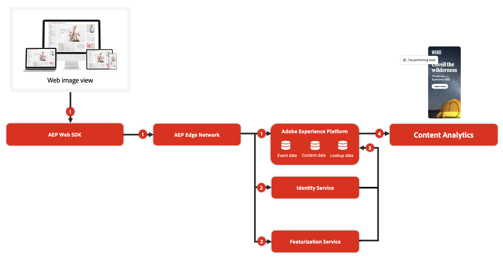

# コンテンツ分析の概要

>[!WARNING]
>
>この記事は、今後の最終バージョンの非公式ドラフトバージョンであり、コンテンツ分析ドキュメントの一部です。 すべてのコンテンツは変更される可能性があり、この記事の現在のバージョンから法的義務を引き出すことはできません。
>

{{release-limited-testing}}

コンテンツ分析は、マーケターが、コンテンツがビジネスが定義した主要業績評価指標にどのように影響するかを理解するのに役立ちます。 Content Analytics は、行動データに加えて、コンテンツの消費方法と、コンテンツが与える影響に関するデータを収集します。 例えば、特定のトーン、特定のカラーパレット、特定のテーマに対する顧客の反応は良いですか？ この情報を特別に設計されたレポートワークフローおよびテンプレートと組み合わせると、Customer Journey Analyticsでのより優れた分析を実行し、カスタマージャーニーデータに関するより深いインサイトを得ることができます。

コンテンツ分析は、AI と機械学習ベースの **機能サービス** を使用して、コンテンツをコンポーネントと属性に分類します。 すべてのコンテンツに対して構造化されたメタデータプロファイルを作成することで、どのコンテンツと、そのコンテンツの属性がビジネスの成果を促すかを分析できます。

コンテンツ分析では、このような構造化メタデータプロファイルの作成に加えて、アセットとエクスペリエンスを 1 つの識別子で識別する **ID サービス** も提供されます。 ID サービスは、まったく同じアセットが複数の場所に存在することを認識できます。 その場合、アセットの 2 つのインスタンスは同じものとして扱われ、コンテンツの使用状況と使用状況の全体像を把握できます。

## 値

コンテンツ分析は、次のような高いレベルで価値を提供します。

1. コンテンツ **使用状況**：コンテンツ分析を使用すると、インプレッションが届いているアセットと、インプレッションが届いているアセットの場所に関するインサイトを得ることができます。 これらのインサイトは、web プロパティでアセットが未使用か過剰使用かを確認するのに役立ちます。
1. コンテンツ **エンゲージメント**：コンテンツ分析では、特定の属性を持つアセットの平均クリックスルー率などのエンゲージメントインサイトを提供できます。 これらのインサイトは、特定のタイプのエクスペリエンスが引き続き有効かどうかを判断するのに役立ちます。
1. コンテンツ **ジャーニー**：さらに、Experience Platformで使用可能な他のすべてのデータと組み合わせると、コンテンツジャーニーに関してさらに多くのインサイトを得ることができます。 例えば、特定のコンテンツがエンゲージメントに加えてコンバージョンにつながるかどうか。 この知識により、コンテンツのタイプに関する ROI を判断できます。
1. コンテンツ **パーソナライゼーション**：最終的には、コンテンツ分析でインサイトに基づいて行動し、これらのインサイトを使用してコンテンツに費用を費やす方法を決定できます。 例えば、特定のタイプのコンテンツを特定のオーディエンスに送信する必要はありますか？ パーソナライゼーションの高い機会を提供するコンテンツはどれですか？

## 用語

Content Analytics では、次のような主要な用語を使用します。

* **エクスペリエンス**：エクスペリエンスとは、web ページに初めてアクセスするユーザーが使用する URL を使用して再現可能な、web ページ上のすべてのテキストです。 各エクスペリエンスには一意の ID が割り当てられます。
* **アセット**：アセットは、画像などの個別の一意のコンテンツです。 各アセットには、一意の ID も割り当てられます。
* **属性**：属性は、エクスペリエンスまたはアセットに関連付けられた説明的なメタデータ要素です。 属性の例としては、写真スタイル、読みやすさ、説得の方法、オブジェクトカラー、背景色があります。

## 仕組み

コンテンツ分析では、Experience Platformのイベントデータセットで収集された web 画像ビューデータを使用します。 このデータは、Experience Platform Edge Network（Web SDK、Server API）、Analytics ソースコネクタなど、使用可能な様々なメソッドを通じて収集されます。

1. ユーザーがサイトを訪問すると、コンテンツ分析用に設定された Experience Platform Web SDKは、コンテンツとのインタラクションを記録します。
1. 再訪問されたデータは、機能 Assembler サービスと ID サービスで処理されます。
1. これらのサービスの結果（コンポーネント、属性、ID）は、Experience Platformの関連する特定のコンテンツ分析データセットの更新に使用されます。
1. コンテンツ分析データは、行動データやその他のルックアップデータセットと共に、Customer Journey Analytics設定（接続、データビュー、Workspace）で使用できます。 この設定は、コンテンツに関する独自のマクロレベルのインサイトの基盤となります。

>[!NOTE]
>
>コンテンツ分析では AI/ML を活用します。 結果（エクスペリエンスやアセットの機能に対する結果）が不正確な場合があります。
>

>[!MORELIKETHIS]
>
>[ コンテンツ分析レポート ](report/report.md)
>[Content Analytics の設定 ](config/configuration.md)
