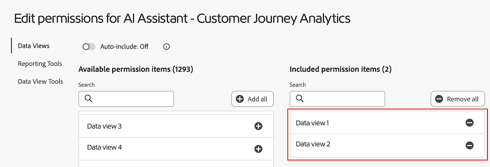

# Data Insights Agentでのデータの視覚化

>[!AVAILABILITY]
>
>この記事で説明されている機能は、2025 年 5 月 28 日（PT）以降の段階的リリースの一部として適格なすべての顧客が利用できますが、お使いの環境ではまだ利用できない場合があります。 機能が一般公開されたら、このメモは削除されます。Customer Journey Analytics リリースプロセスについて詳しくは、[Customer Journey Analytics 機能リリース](/help/release-notes/releases.md)を参照してください。

>[!AVAILABILITY]
>
>Data Insights Agentは、対象となるお客様が期間限定で利用できます。 Data Insights Agentへのアクセスは 2025 年 11 月 30 日（PT）に終了します。 Data Insights Agentを引き続き使用する場合は、Adobe アカウント担当者に連絡して、Data Insights Agentのライセンスについて詳しく問い合わせてください。

Customer Journey Analytics の AI アシスタントからアクセス可能な Data Insights エージェントは、データに関する質問に迅速かつ効率的に回答する生成 AI 会話エージェントです。データビューのコンポーネントと実際のデータを使用して、Analysis Workspace で関連するビジュアライゼーションを作成します。

Data Insights エージェントを使用して Analysis Workspace のデータ中心の質問に回答することで、Analysis Workspace でビジュアライゼーションを手動で作成し、データビューコンポーネントに慣れるのに費やすことになる時間を大幅に削減できます。

## 範囲内の機能と範囲外の機能。

| 機能 | 範囲内 | 範囲外 |
| --- | --- | --- |
| **ビジュアライゼーションのタイプ** | <ul><li>行</li><li>複数行</li><li>フリーフォームテーブル</li><li>棒グラフ</li><li>ドーナツ</li><li>数値の概要</li></ul> | <ul><li>フロー</li><li>フォールアウト</li><li>コホートテーブル</li><li>面グラフ、積み重ね面グラフ</li><li>積み重ね棒グラフ</li><li>ブレット</li><li>コンボ</li><li>ヒストグラム</li><li>横棒グラフ、積み重ね横棒グラフ</li><li>主要指標の概要</li><li>散布図</li><li>変更の概要</li><li>テキスト</li><li>ツリーマップ</li><li>ベン図</li><li>ガイド付き分析：アクティブな増加、コンバージョンのトレンド、エンゲージメント、初回使用の影響、頻度、ファネル、純増加、リリースの影響、リテンション、タイムライン、トレンド</li></ul> |
| **Workspace のアクションとエージェントの機能** | <ul><li>ビジュアライゼーションの作成と更新
フリーフォームテーブルおよび関連するビジュアライゼーション（線、棒グラフ、ドーナツなど）を作成します。
例：*2 月から 5 月の SKU 全体の利益は？*
</li><li>フォローアップの質問をする
以前のプロンプトからコンテキスト内のプロンプトに応答します。 例：
 <ul><li>プロンプト 1：*3 月からのイベントのトレンド*。</li><li>プロンプト 2：*代わりに 3 月から 4 月のデータを表示する*</li></ul> </li><li>範囲外のプロンプト検出
*このプロジェクトを書き出す*&#x200B;などの範囲外のプロンプトを送信すると、Data Insights エージェントは、質問が範囲外であることを伝える応答を返します。
</li></ul> | <ul><li>共有</li><li>書き出し</li><li>ダウンロード</li><li>ユーザー環境設定の管理</li><li>データビューの管理</li><li>Analytics ダッシュボードアプリ</li><li>アトリビューション</li><li>インラインの概要または応答
Data Insights エージェントは、ユーザーからのプロンプトに対する回答の概要をチャットパネルのインラインで返すことはできません。範囲外プロンプトの例として、*前回のプロンプトのインサイトの概要を入力する*、*折れ線グラフのビジュアライゼーションのハイライトをまとめる*&#x200B;などがあります。
</li></ul> |
| **質問の明確化** | Data Insights エージェントが回答するのに十分なコンテキストがない、または一般的すぎる質問をした場合、Data Insights エージェントは明確な質問を返すか、候補となるオプションを提示します。 
以下は、コンポーネント関連の明確な質問の例です。
<ul><li>指標：*どの「売上高」指標のことですか？*</li><li>ディメンション：*以下のどの「地域」に集中しますか？*</li><li>セグメント：*どの「アカウント」セグメントを適用しますか？*</li><li>日付範囲：*「先月」とは、過去 1 か月間のことですか、それとも過去 30 日間のことですか？*</li></ul>
以下は、ディメンション項目に関する明確な質問の例です。
 <ul><li>どの「ストア名」のことですか？（例えば、ストア #5274、ストア #2949 などがあります。）</li></ul> | 質問を明確にするのは、コンポーネントとディメンション項目に限られます。Data Insights エージェントは、データビュー、ビジュアライゼーション、データの精度、比較、範囲などを明確にすることはできません。質問を明確にできない場合、エージェントは、ユーザーから受ける可能性が最も高い質問にデフォルトで対応します。予期しないビジュアライゼーションまたはデータの精度が返された場合は、フォローアップの質問をしたり、ビジュアライゼーションやデータを調整したりできます。 |
| **データの検証可能性と正確性** | データの検証可能性と正確性は、生成されたフリーフォームテーブルとデータビジュアライゼーションを表示することで確認できます。 
例えば、Data Insights エージェントに&#x200B;*先月の注文のトレンド*&#x200B;を依頼すると、新しく生成されたパネル、データビジュアライゼーションおよびフリーフォームテーブルで正しい指標（「注文」）と日付範囲（「先月」）が選択されていることを確認できます。 | Data Insights エージェントは、どのコンポーネントやビジュアライゼーションが追加されたかについての応答はしません。
 |
| **フィードバックのメカニズム** | <ul><li>親指を上に向ける</li><li>親指を下に向ける</li><li>フラグ</li></ul> |  |

## Data Insights Agentへのアクセスの管理

次のパラメーターは、Customer Journey Analytics の Data Insights エージェントへのアクセスを制御します。

* **ソリューションアクセス**:Data Insights Agentは、2025 年 11 月 30 日（PT）まで、限定アクセスプログラムの一環として、すべてのCustomer Journey Analyticsのお客様が利用できます。 Adobe Analytics では利用できません。

* **契約によるアクセス**：AI アシスタントで Data Insights エージェントを使用できない場合は、組織の管理者またはアドビアカウントチームにお問い合わせください。組織が Data Insights エージェントの使用を開始する前に、生成 AI に関連する特定の法的条項に同意する必要があります。

* **権限**：ユーザーが Data Insights エージェントにアクセスするには、必要な権限が Adobe Admin Console で付与されている必要があります。

  権限を付与するには、[製品プロファイル管理者](https://helpx.adobe.com/enterprise/using/manage-product-profiles.html)が [!UICONTROL Admin Console] で次の手順を実行する必要があります。
   1. **[!UICONTROL Admin Console]** で、「**[!UICONTROL 製品]**」タブを選択して&#x200B;**[!UICONTROL すべての製品とサービス]**&#x200B;ページを表示します。
   1. 「**[!UICONTROL Customer Journey Analytics]**」を選択します。
   1. 「**[!UICONTROL 製品プロファイル]**」タブで、[!UICONTROL AI アシスタント：製品知識]へのアクセス権を付与する製品プロファイルのタイトルを選択します。
   1. 特定の製品プロファイルで、「**[!UICONTROL 権限]**」タブを選択します。

      

   1. 提供されたテーブルの&#x200B;**[!UICONTROL レポートツール]**&#x200B;行で、編集アイコン  を選択します。
   1. 「**[!UICONTROL AI アシスタント：製品知識]**」までスクロールするか、それを検索し、この権限の横にあるプラスアイコン  を選択します。

      **[!UICONTROL AI アシスタント：製品知識]**&#x200B;権限が、**[!UICONTROL 含まれる権限項目]**&#x200B;列に追加されます。

      。

   1. 「**[!UICONTROL データビューツール]**」タブを選択し、**Data Insights エージェントAddCircle** を選択します。

      **[!UICONTROL Data Insights エージェント]**&#x200B;権限が、**[!UICONTROL 含まれる権限項目]**&#x200B;列に追加されます。

      。

   1. 「**[!UICONTROL データビュー]**」タブを選択して、Data Insights エージェントで有効にするデータビューを選択します。

      >[!IMPORTANT]
      >
      >データビューを有効にする場合は、次の点を考慮してください。
      >* IMS 組織ごとに最大 50 個のデータビューを有効にできます。 特定の組織のすべての製品プロファイルで 50 を超えるデータビューを有効にした場合、Data Insights Agentは最も使用されている 50 のデータビューを使用します。
      >* Data Insights エージェントは、Admin Console で有効にしたその日のうちに、含まれるデータビューを参照できます。

   1. 有効にするデータビューを検索またはスクロールし、各データビューの名前の横にあるプラスアイコン  を選択します。

      追加した各データビューが、**[!UICONTROL 含まれる権限項目]**&#x200B;列に表示されます。

      。

   1. 「**[!UICONTROL 保存]**」を選択して権限を保存します。

  アクセス制御について詳しくは、[アクセス制御](/help/technotes/access-control.md#access-control)を参照してください。

## AI アシスタントの Data Insights エージェントへのアクセス

1. [experience.adobe.com](https://experience.adobe.com/) に移動し、Adobe ID でログインします。

2. Experience Cloud ホームから **Customer Journey Analytics** を選択します。

3. プロジェクトページ上部のバナーで「**[!UICONTROL 空のプロジェクト]**」を選択して、新しい空のプロジェクトを開きます。

4. [Customer Journey Analytics での Data Insights エージェントへのアクセスの管理](#manage-access-to-data-insights-agent-in-customer-journey-analytics)の説明に従って、パネル用に選択したデータビューが、Data Insights エージェントで有効になっているデータビューであることを確認します。

5. ページの右上にある AI アシスタントチャットアイコンを選択します。

   チャットアイコンが表示されない場合は、管理者に問い合わせて、Admin Console で次の機能を有効にするよう依頼してください。

   * レポートツール：**[!UICONTROL AI アシスタント：製品知識]**

   * データビューツール：**[!UICONTROL Data Insights エージェント]**

   詳しくは、[Customer Journey Analytics での Data Insights エージェントへのアクセスの管理](#manage-access-to-data-insights-agent-in-customer-journey-analytics)を参照してください。

   

6. ページ下部の **[!UICONTROL Customer Journey Analytics について尋ねる]**&#x200B;ダイアログで、Data Insights エージェントを使用してデータビジュアライゼーションに関する質問をします。

   詳しくは、次の例を参照してください。

### 例 1

例えば、7 月に受けた注文に興味があるとします。

**プロンプト：***「7 月の注文のトレンド」*&#x200B;と入力します。

**応答：** Data Insights エージェントは、指標やコンポーネントを含むデータビューでデータを調べ、インサイトを収集します。これにより、プロンプトがデータ範囲内の適切なディメンションと指標に変換されます。

以下のように、7 月の注文を表示する折れ線グラフとフリーフォームテーブルが自動的に生成されました。

### 例 2

次に、売上高を地域別に比較した結果を確認します。

**プロンプト：**&#x200B;プロンプトウィンドウに、*「地域別の売上高を表示」*&#x200B;と入力します。

**応答：** Data Insights エージェントは、「地域」が「お客様の地域」を意味していることをインテリジェントに理解しています。次のように、地域別の売上高を最も適切に表す棒グラフが生成されます。

### 例 3

次に、地域別の売上高を把握するだけでなく、地域別の利益のデータも確認する必要があります。前のプロンプトを繰り返す代わりに、Data Insights エージェントに最新のビジュアライゼーションとフリーフォームテーブルを更新するように依頼できます。

**プロンプト：**&#x200B;プロンプトウィンドウに&#x200B;*「利益を追加」*&#x200B;と入力します。

**応答：**&#x200B;**[!UICONTROL 棒グラフ]**&#x200B;を使った最も簡潔な回答を提供し、利益指標をフリーフォームテーブルの列として追加しています。

### 例 4

最後に、売上高を製品カテゴリ別に確認してみましょう。

**プロンプト：**&#x200B;プロンプトウィンドウに、*「製品カテゴリ別売上高の割合」*&#x200B;と入力します。

**応答：** Data Insights エージェントは、最も適切なビジュアライゼーション（この場合は&#x200B;**[!UICONTROL ドーナツ]**&#x200B;ビジュアライゼーション）を選択して、質問に回答します。

## データビジュアライゼーションのプロンプトの例

以下に示すのは、一般的なプロンプトと、Data Insights エージェントがプロンプトの応答で使用するビジュアライゼーションの例です。

| プロンプトの例 | 期待されるビジュアライゼーション |
| --- | --- |
| [月]の利益を表示してください | 行
デフォルトでは、特定の期間内のトレンドや指標を尋ねると、折れ線グラフのビジュアライゼーションが返されます。 |
| [月]の注文のトレンド | 行 |
| [月]の売上高を地域別に表示してください | 棒グラフ |
| 売上高の製品カテゴリ別の内訳 | ドーナツ |
| 1 月から 5 月までの曜日別の注文数 | 棒グラフ |
| 3 月から 6 月までの性別別の注文数を表示してください | 棒グラフ |
| 2 月から 5 月までの全 SKU の利益は？ | 棒グラフ |
| [月]の店舗名別の売上高 | 棒グラフ |
| [月]の利益別の上位 10 SKU は？ | 棒グラフ |
| 月別の購入率 | ドーナツ |
| [月]の合計利益 | 数値の概要
特定の期間にわたる指標の「合計」を尋ねると、数値の概要のビジュアライゼーションが返されます。 |

## プロンプト記述のベストプラクティス

Data Insights エージェントは、各ユーザープロンプトによって提供されるコンテキストを処理し、最も適切なビジュアライゼーションとフリーフォームテーブルのコンポーネントを用いてインテリジェントに回答しようと試みます。

回答は、プロンプトで使用される特定の単語やフレーズに応じて異なることがあり、言葉づかいがわずかに変わっただけで異なる結果が生じる場合があります。

最適な結果を得るには、次のガイドラインを考慮してください。

* **具体的に：**&#x200B;回答を絞り込むために、正確な用語を含めます。以下は、「カリフォルニアでの先月の売上」という具体的なプロンプトの例です。

* **明確な指標、ディメンション、セグメントを使用する：**&#x200B;特定の指標（「売上高」など）、ディメンション（「web サイト名」など）、セグメント（「iPhone ユーザー」など）および日付範囲（「過去 3 か月」など）を追加すると、Data Insights エージェントが適切なデータに的を絞るのに役立ちます。

* **単刀直入に質問する：**&#x200B;単刀直入な言い回しの質問を使用すると、Data Insights エージェントが明確で関連性の高いインサイトを提供しやすくなります。以下は、「今年の製品カテゴリ別平均売上高は？」というプロンプトで単刀直入に質問した例です。

Data Insights エージェントのプロンプトで使用できる用語とフレーズの例を、想定される回答のタイプと共に、次の表で確認します。

これらの例は、特定の単語や構造が Data Insight エージェントの出力にどのような影響を与えるかを把握し、より正確で役に立つインサイトを得られるようになることを目的としています。Data Insights エージェントは生成 AI を使用するので、類似したプロンプトであっっても、ビジュアライゼーションや選択したデータが若干異なる可能性があります。

| 望ましい結果 | 用語とフレーズの例 |
| --- | --- |
| 数値の概要ビジュアライゼーション | <ul><li>合計</li></ul> |
| コンポーネントの比較 | <ul><li>比較</li><li>と</li><li>コントラスト</li><li>週ごと</li><li>前月比</li><li>前四半期比</li><li>前年比</li></ul> |
| ドーナツグラフのビジュアライゼーション | <ul><li>割合</li><li>シェア</li><li>分布</li><li>パーセンテージ</li><li>貢献度</li><li>構成要素</li><li>部分</li></ul> |
| 折れ線グラフビジュアライゼーション | <ul><li>トレンド</li><li>[時間範囲]の[指標]</li></ul> |
| 棒グラフのビジュアライゼーション | <ul><li>[ディメンション]別の[指標]</li></ul> |

<!--

## Beta testing expectations and requested feedback

After posing each question, carefully review the assistant's provided answer. It's crucial to evaluate the generated visualizations comprehensively before providing feedback. 

Consider the following when evaluating a response from Data Insights Agent: 

* Chat rail response or template: Evaluate the textual response provided. Is the response appropriate given the context of your prompt? 

* Visualization/chart: Evaluate the visualization. Is it the appropriate or expected visualization for your question, or would you have expected a different visualization?  

* Freeform table: Evaluate the freeform table. Is the freeform table data correct? Is it breaking down data where requested? Are the applied segments those that you requested or expected? 

* Error Message / Out-of-Scope: If a generic error message is given stating the question is out of scope, provide feedback on whether you think the out-of-scope message is appropriate, given your prompt. Was your prompt actually in scope? 

**For every response, give a thumbs up or thumbs down, based on the response.**

Following the thumbs up or thumbs down selection, please make a selection for the relevant multi-select feedback boxes. If you want to provide additional feedback, add notes in the open text box.

## Questions and Contact

* Send questions and feedback in the Beta Slack channel: #data-insights-agent-in-cja-beta

-->

## 設定のベストプラクティス

以下は、Customer Journey Analyticsの設定（データビュー、計算指標、セグメントなど）に関するベストプラクティスで、Data Insights Agentが正しいコンポーネントを見つけて、追加情報を求められることなく、より明確な回答を返せるようにします。

* **必要なコンポーネントのバランスを取**。 データセットのすべてのフィールドを指標またはディメンションコンポーネントとしてデータビューに追加しないでください。 特に、あなたが最も確かに分析で使用しないもの。 一方、分析に必要なフィールドのみに厳密に制限しないでください。 データビューが制限されすぎると、分析の柔軟性や Data Insight エージェントの機能が制限されます。
* **常にわかりやすい表示名を使用する**。 指標またはディメンションコンポーネントのいずれかとしてデータビューで定義するすべてのフィールドに、わかりやすいコンポーネント名があることを確認します。 わかりやすい名前を付けてフィールドの名前を変更するプロセスは、特にAdobe Analytics ソースコネクタデータセットのフィールドに関連します。 多くの場合、これらのフィールドには、`eVar41` や `prop25` など、わかりやすい名前は付けられていません。
* **独特の名前を使用**。 特徴的な名前は、データビューでフィールドを指標およびディメンションコンポーネントの両方として使用する場合に特に関連します。 または、複数のコンポーネントでフィールドを使用する場合、コンポーネント設定がそれぞれ異なります。
* **コンポーネントの命名規則を使用** します。 コンポーネント命名規則を使用して、コンポーネントをグループ化できます。 例：**[!UICONTROL Orders |製品]** および **[!UICONTROL 注文 |顧客]** データに存在する可能性のある様々な注文指標を区別します。
* **データディクショナリの使用**。 データ要素でコンポーネントの説明やその他の関連データを追加します。 Data Insight エージェントでは現在、説明とタグを使用しません。 ただし、今後はデータ要素の説明とタグを使用する可能性があります。
* **承認済みの計算指標を使用** します。 承認された計算指標のみをデータビューのコンポーネントとして使用するプロセスに同意し、実験的な計算指標を使用しないようにします。
* **必要なセグメントを共有**. セグメントを共有し、データインサイトエージェントプロンプトに必要なセグメントを表示します。
* **データビュー間でコンポーネント名を標準化する**。 複数のデータビューでコンポーネントと同じフィールドを使用する場合は、そのコンポーネントに単一のわかりやすい名前と単一の識別子を使用する必要があります。 単一の名前と識別子を使用すると、データインサイトエージェントはコンテキストを失うことなくデータビューを切り替えることができます。

>[!MORELIKETHIS]
>
>[コンポーネント設定](/help/data-views/component-settings/overview.md)
>&#x200B;>[データディクショナリ ](/help/components/data-dictionary/data-dictionary-overview.md)
>&#x200B;>[計算指標を承認 ](/help/components/calc-metrics/cm-workflow/cm-approving.md)
>&#x200B;>[セグメント ](/help/components/segments/seg-share.md) 共有
>
