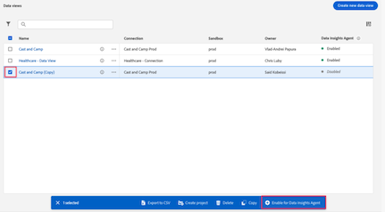
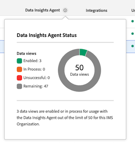

# Data Insights Agent でのデータの視覚化

>[!AVAILABILITY]
>
>Data Insights Agent は、対象となる顧客が期間限定で使用できます。Data Insights Agent へのアクセスは、2026年2月28日（PT）まで利用できます。Data Insights Agent をこの日付以降も中断することなく引き続き使用するには、アドビアカウント担当者に連絡して、Adobe Experience Platform Agent Orchestrator のライセンスの詳細を確認してください。

Customer Journey Analytics の [AI アシスタント](/help/ai-assistant.md)からアクセス可能な Data Insights Agent は、データに関する質問に迅速かつ効率的に回答する生成 AI 会話エージェントです。データビューのコンポーネントと実際のデータを使用して、Analysis Workspace で関連するビジュアライゼーションを作成します。

Data Insights Agent を使用して Analysis Workspace のデータ中心の質問に回答することで、Analysis Workspace でビジュアライゼーションを手動で作成し、データビューコンポーネントに慣れるのに費やすことになる時間を大幅に削減できます。

## 範囲内の機能と範囲外の機能。

| 機能 | 範囲内 | 範囲外 |
| --- | --- | --- |
| **ビジュアライゼーションのタイプ** | <ul><li>行</li><li>複数行</li><li>フリーフォームテーブル</li><li>棒グラフ</li><li>ドーナツ</li><li>数値の概要</li></ul> | <ul><li>フロー</li><li>フォールアウト</li><li>コホートテーブル</li><li>面グラフ、積み重ね面グラフ</li><li>積み重ね棒グラフ</li><li>ブレット</li><li>コンボ</li><li>ヒストグラム</li><li>横棒グラフ、積み重ね横棒グラフ</li><li>主要指標の概要</li><li>散布図</li><li>変更の概要</li><li>テキスト</li><li>ツリーマップ</li><li>ベン図</li><li>ガイド付き分析：アクティブな増加率、コンバージョンのトレンド、エンゲージメント、初回使用の影響、頻度、ファネル、純増加率、リリースの影響、リテンション、タイムライン、トレンド</li></ul> |
| **Workspace のアクションとエージェントの機能** | <ul><li>ビジュアライゼーションの作成と更新
フリーフォームテーブルおよび関連するビジュアライゼーション（線、棒グラフ、ドーナツなど）を作成します。
例：*2 月から 5 月の SKU 全体の利益は？*
</li><li>フォローアップの質問をする
前回のプロンプトからコンテキスト内のプロンプトに応答します。例：
 <ul><li>プロンプト 1：*3 月からのイベントのトレンド*。</li><li>プロンプト 2：*代わりに 3 月から 4 月のデータを表示する*</li></ul> </li><li>範囲外のプロンプト検出
*このプロジェクトを書き出す*&#x200B;などの範囲外のプロンプトを送信すると、Data Insights Agent は、質問が範囲外であることを伝える応答を返します。
</li></ul> | <ul><li>共有</li><li>書き出し</li><li>ダウンロード</li><li>ユーザー環境設定の管理</li><li>データビューの管理</li><li>Analytics ダッシュボードアプリ</li><li>アトリビューション</li><li>インラインの概要または応答
Data Insights Agent は、ユーザーからのプロンプトに対する回答の概要をチャットパネルのインラインで返すことはできません。範囲外プロンプトの例として、*前回のプロンプトのインサイトの概要を入力する*、*折れ線グラフのビジュアライゼーションのハイライトをまとめる*&#x200B;などがあります。
</li></ul> |
| **質問の明確化** | Data Insights Agent が回答するのに十分なコンテキストがない、または一般的すぎる質問をした場合、Data Insights Agent は明確な質問を返すか、候補となるオプションを提示します。 
以下は、コンポーネント関連の明確な質問の例です。
<ul><li>指標：*どの「売上高」指標のことですか？*</li><li>ディメンション：*以下のどの「地域」に集中しますか？*</li><li>セグメント：*どの「アカウント」セグメントを適用しますか？*</li><li>日付範囲：*「先月」とは、過去 1 か月間のことですか、それとも過去 30 日間のことですか？*</li></ul>
以下は、ディメンション項目に関する明確な質問の例です。
 <ul><li>どの「ストア名」のことですか？（例えば、ストア #5274、ストア #2949 などがあります。）</li></ul> | 質問を明確にするのは、コンポーネントとディメンション項目に限られます。Data Insights Agent は、データビュー、ビジュアライゼーション、データの精度、比較、範囲などを明確にすることはできません。質問を明確にできない場合、エージェントは、ユーザーから受ける可能性が最も高い質問にデフォルトで対応します。予期しないビジュアライゼーションまたはデータの精度が返された場合は、フォローアップの質問をしたり、ビジュアライゼーションやデータを調整したりできます。 |
| **データの検証可能性と正確性** | データの検証可能性と正確性は、生成されたフリーフォームテーブルとデータビジュアライゼーションを表示することで確認できます。 
例えば、Data Insights Agent に&#x200B;*先月の注文のトレンド*&#x200B;を依頼すると、新しく生成されたパネル、データビジュアライゼーションおよびフリーフォームテーブルで正しい指標（「注文」）と日付範囲（「先月」）が選択されていることを確認できます。 | Data Insights Agent は、どのコンポーネントやビジュアライゼーションが追加されたかについての応答はしません。
 |
| **フィードバックのメカニズム** | <ul><li>親指を上に向ける</li><li>親指を下に向ける</li><li>フラグ</li></ul> |  |

## Data Insights Agent へのアクセスの管理 {#manage-access}

<!-- markdownlint-disable MD034 -->

>[!CONTEXTUALHELP]
>id="cja-enable-data-insights-data-view"
>title="Data Insights Agent を有効にする"
>abstract="このオプションを選択すると、Data Insights Agent で使用するためにこのデータビューが有効になります。Data Insights Agent は、Customer Journey Analytics の AI アシスタントからアクセスできる生成 AI 会話エージェントです。テキストプロンプトを使用してデータをすばやく分析するのに役立ちます。データビューのコンポーネントと実際のデータを使用して、Analysis Workspace で関連するビジュアライゼーションを作成します。"

<!-- markdownlint-enable MD034 -->

次のパラメーターは、Customer Journey Analytics の Data Insights Agent へのアクセスを制御します。

* **ソリューションへのアクセス**：Data Insights Agent は、2025年11月30日（PT）まで、限定アクセスプログラムの一部として、すべての Customer Journey Analytics のお客様が使用できます。Adobe Analytics では利用できません。

* **契約によるアクセス**：AI アシスタントで Data Insights Agent を使用できない場合は、組織の管理者またはアドビアカウントチームにお問い合わせください。組織が Data Insights Agent の使用を開始する前に、生成 AI に関連する特定の法的条項に同意する必要があります。

* **権限**：ユーザーが Data Insights Agent にアクセスするには、必要な権限が ]Adobe Admin Console[!UICONTROL  で付与されている必要があります。

  権限を付与するには、[製品プロファイル管理者](https://helpx.adobe.com/jp/enterprise/using/manage-product-profiles.html)が [!UICONTROL Admin Console] で次の手順を実行する必要があります。
   1. **[!UICONTROL Admin Console]** で、「**[!UICONTROL 製品]**」タブを選択して&#x200B;**[!UICONTROL すべての製品とサービス]**&#x200B;ページを表示します。
   1. 「**[!UICONTROL Customer Journey Analytics]**」を選択します。
   1. 「**[!UICONTROL 製品プロファイル]**」タブで、[!UICONTROL AI アシスタント：製品知識]へのアクセス権を付与する製品プロファイルのタイトルを選択します。
   1. 特定の製品プロファイルで、「**[!UICONTROL 権限]**」タブを選択します。

      

   1. 提供されたテーブルの&#x200B;**[!UICONTROL レポートツール]**&#x200B;行で、編集アイコン  を選択します。
   1. 「**[!UICONTROL AI アシスタント：製品知識]**」までスクロールするか、それを検索し、この権限の横にあるプラスアイコン  を選択します。
   1. 「**[!UICONTROL Data Insights Agent]**」までスクロールするか、これを検索し、この権限の横にあるプラスアイコン  を選択します。

      **[!UICONTROL AI アシスタント：製品知識]**&#x200B;権限と **[!UICONTROL Data Insights Agent]** 権限が、**[!UICONTROL 含まれる権限項目]**&#x200B;列に追加されます。

      。

   1. 「**[!UICONTROL 保存]**」を選択して権限を保存します。

  アクセス制御について詳しくは、[アクセス制御](/help/technotes/access-control.md#access-control)を参照してください。

* **データビューアクセス**：Data Insights Agent に対してデータビューを有効にする必要があります。

  >[!IMPORTANT]
  >
  >データビューを有効にする際は、次の点を考慮してください。
  >* IMS 組織ごとに最大 50 個のデータビューを有効にできます。特定の組織のすべての製品プロファイルで 50 個を超えるデータビューを有効にした場合、Data Insights Agent は最もよく使用されている 50 個のデータビューを使用します。
  >* Data Insights Agent は、有効にしたその日のうちに、含まれるデータビューを参照できます。

  Data Insights Agent に対してデータビューを有効にするには：

   1. Customer Journey Analytics で、**[!UICONTROL データ管理]**／**[!UICONTROL データビュー]**&#x200B;を選択します。

   1. Data Insights Agent に対して有効にする 1 つ以上のデータビューを選択して、「**[!UICONTROL Data Insights Agent に対して有効にする]**」を選択します。

      

  IMS 組織の Data Insights Agent トに対して有効なデータビューの数を表示するには：

   1. Customer Journey Analytics で、**[!UICONTROL データ管理]**／**[!UICONTROL データビュー]**&#x200B;を選択します。

   1. **[!UICONTROL Data Insights Agent]** 列の上部にある情報アイコンを選択します。

      

## AI アシスタントの Data Insights Agent へのアクセス

1. [experience.adobe.com](https://experience.adobe.com/) に移動し、Adobe ID でログインします。

2. Experience Cloud ホームから **Customer Journey Analytics** を選択します。

3. プロジェクトページ上部のバナーで「**[!UICONTROL 空のプロジェクト]**」を選択して、新しい空のプロジェクトを開きます。

4. [Customer Journey Analytics での Data Insights Agent へのアクセスの管理](#manage-access-to-data-insights-agent-in-customer-journey-analytics)の説明に従って、パネル用に選択したデータビューが、Data Insights Agent で有効になっているデータビューであることを確認します。

5. ページの右上にある AI アシスタントチャットアイコンを選択します。

   チャットアイコンが表示されない場合は、管理者に問い合わせて、Admin Console で次の機能を有効にするよう依頼してください。

   * レポートツール：**[!UICONTROL AI アシスタント：製品知識]**

   * データビューツール：**[!UICONTROL Data Insights Agent]**

   詳しくは、[Customer Journey Analytics での Data Insights Agent へのアクセスの管理](#manage-access-to-data-insights-agent-in-customer-journey-analytics)を参照してください。

   

6. ページ下部の **[!UICONTROL Customer Journey Analytics について尋ねる]**&#x200B;ダイアログで、Data Insights Agent を使用してデータビジュアライゼーションに関する質問をします。

   詳しくは、次の例を参照してください。

### 例 1

例えば、7 月に受けた注文に興味があるとします。

**プロンプト：***「7 月の注文のトレンド」*&#x200B;と入力します。

**応答：** Data Insights Agent は、指標やコンポーネントを含むデータビューでデータを調べ、インサイトを収集します。これにより、プロンプトがデータ範囲内の適切なディメンションと指標に変換されます。

以下のように、7 月の注文を表示する折れ線グラフとフリーフォームテーブルが自動的に生成されました。

### 例 2

次に、売上高を地域別に比較した結果を確認します。

**プロンプト：**&#x200B;プロンプトウィンドウに、*「地域別の売上高を表示」*&#x200B;と入力します。

**応答：** Data Insights Agent は、「地域」が「お客様の地域」を意味していることをインテリジェントに理解しています。次のように、地域別の売上高を最も適切に表す棒グラフが生成されます。

### 例 3

次に、地域別の売上高を把握するだけでなく、地域別の利益のデータも確認する必要があります。前のプロンプトを繰り返す代わりに、Data Insights Agent に最新のビジュアライゼーションとフリーフォームテーブルを更新するように依頼できます。

**プロンプト：**&#x200B;プロンプトウィンドウに&#x200B;*「利益を追加」*&#x200B;と入力します。

**応答：****[!UICONTROL 棒グラフ]**&#x200B;を使った最も簡潔な回答を提供し、利益指標をフリーフォームテーブルの列として追加しています。

### 例 4

最後に、売上高を製品カテゴリ別に確認してみましょう。

**プロンプト：**&#x200B;プロンプトウィンドウに、*「製品カテゴリ別売上高の割合」*&#x200B;と入力します。

**応答：** Data Insights Agent は、最も適切なビジュアライゼーション（この場合は&#x200B;**[!UICONTROL ドーナツ]**&#x200B;ビジュアライゼーション）を選択して、質問に回答します。

## Experience Cloud アプリケーションをまたいだ Data Insights Agent へのアクセス

Adobe Experience Platform エージェントオーケストレーターを使用すると、Adobe Journey Optimizer や Real-Time CDP など、複数の Adobe Experience Cloud アプリケーションで Data Insights Agent の機能にアクセスできます。

エージェントオーケストレーターは、リクエストを解釈してどの専門エージェントが必要かを判断し、適切な応答を提供するようにエージェントを調整します。マルチターンのインタラクションをまたいでコンテキストを追跡するので、以前のクエリに基づいて自然に構築できます。

詳しくは、[Adobe Experience Platform エージェントオーケストレーター](http://www.adobe.com/go/agent-orchestrator-home_jp)を参照してください。

## データビジュアライゼーションのプロンプトの例

以下に示すのは、一般的なプロンプトと、Data Insights Agent がプロンプトの応答で使用するビジュアライゼーションの例です。

| プロンプトの例 | 期待されるビジュアライゼーション |
| --- | --- |
| [月]の利益を表示してください | 行
デフォルトでは、特定の期間内のトレンドや指標を尋ねると、折れ線グラフのビジュアライゼーションが返されます。 |
| [月]の注文のトレンド | 行 |
| [月]の売上高を地域別に表示してください | 棒グラフ |
| 売上高の製品カテゴリ別の内訳 | ドーナツ |
| 1 月から 5 月までの曜日別の注文数 | 棒グラフ |
| 3 月から 6 月までの性別別の注文数を表示してください | 棒グラフ |
| 2 月から 5 月までの全 SKU の利益は？ | 棒グラフ |
| [月]の店舗名別の売上高 | 棒グラフ |
| [月]の利益別の上位 10 SKU は？ | 棒グラフ |
| 月別の購入率 | ドーナツ |
| [月]の合計利益 | 数値の概要
特定の期間にわたる指標の「合計」を尋ねると、数値の概要のビジュアライゼーションが返されます。 |

## プロンプト記述のベストプラクティス

Data Insights Agent は、各ユーザープロンプトによって提供されるコンテキストを処理し、最も適切なビジュアライゼーションとフリーフォームテーブルのコンポーネントを用いてインテリジェントに回答しようと試みます。

回答は、プロンプトで使用される特定の単語やフレーズに応じて異なることがあり、言葉づかいがわずかに変わっただけで異なる結果が生じる場合があります。

最適な結果を得るには、次のガイドラインを考慮してください。

* **具体的に：**&#x200B;回答を絞り込むために、正確な用語を含めます。以下は、「カリフォルニアでの先月の売上」という具体的なプロンプトの例です。

* **明確な指標、ディメンション、セグメントを使用する：**&#x200B;特定の指標（「売上高」など）、ディメンション（「Web サイト名」など）、セグメント（「iPhone ユーザー」など）および日付範囲（「過去 3 か月」など）を追加すると、Data Insights Agent が適切なデータに的を絞るのに役立ちます。

* **単刀直入に質問する：**&#x200B;単刀直入な言い回しの質問を使用すると、Data Insights Agent が明確で関連性の高いインサイトを提供しやすくなります。以下は、「今年の製品カテゴリ別平均売上高は？」というプロンプトで単刀直入に質問した例です。

Data Insights Agent のプロンプトで使用できる用語とフレーズの例を、想定される回答のタイプと共に、次の表で確認します。

これらの例は、特定の単語や構造が Data Insight エージェントの出力にどのような影響を与えるかを把握し、より正確で役に立つインサイトを得られるようになることを目的としています。Data Insights Agent は生成 AI を使用するので、類似したプロンプトであっっても、ビジュアライゼーションや選択したデータが若干異なる可能性があります。

| 望ましい結果 | 用語とフレーズの例 |
| --- | --- |
| 数値の概要ビジュアライゼーション | <ul><li>合計</li></ul> |
| コンポーネントの比較 | <ul><li>比較</li><li>と</li><li>コントラスト</li><li>週ごと</li><li>前月比</li><li>前四半期比</li><li>前年比</li></ul> |
| ドーナツグラフのビジュアライゼーション | <ul><li>割合</li><li>シェア</li><li>分布</li><li>パーセンテージ</li><li>貢献度</li><li>構成要素</li><li>部分</li></ul> |
| 折れ線グラフビジュアライゼーション | <ul><li>トレンド</li><li>[時間範囲]の[指標]</li></ul> |
| 棒グラフのビジュアライゼーション | <ul><li>[ディメンション]別の[指標]</li></ul> |

<!--

## Beta testing expectations and requested feedback

After posing each question, carefully review the assistant's provided answer. It's crucial to evaluate the generated visualizations comprehensively before providing feedback. 

Consider the following when evaluating a response from Data Insights Agent: 

* Chat rail response or template: Evaluate the textual response provided. Is the response appropriate given the context of your prompt? 

* Visualization/chart: Evaluate the visualization. Is it the appropriate or expected visualization for your question, or would you have expected a different visualization?  

* Freeform table: Evaluate the freeform table. Is the freeform table data correct? Is it breaking down data where requested? Are the applied segments those that you requested or expected? 

* Error Message / Out-of-Scope: If a generic error message is given stating the question is out of scope, provide feedback on whether you think the out-of-scope message is appropriate, given your prompt. Was your prompt actually in scope? 

**For every response, give a thumbs up or thumbs down, based on the response.**

Following the thumbs up or thumbs down selection, please make a selection for the relevant multi-select feedback boxes. If you want to provide additional feedback, add notes in the open text box.

## Questions and Contact

* Send questions and feedback in the Beta Slack channel: #data-insights-agent-in-cja-beta

-->

## 設定のベストプラクティス

Data Insights Agent が正しいコンポーネントを見つけて、追加情報を求めることなく、より明確な回答を返すことができるようにする、Customer Journey Analytics 設定（データビュー、計算指標、セグメントなど）に関するベストプラクティスを以下に示します。

* **必要なコンポーネントのバランスを取ります**。データセットのすべてのフィールドを指標またはディメンションコンポーネントとしてデータビューに追加しないでください。特に、分析で使用しないフィールドは追加しないでください。一方、分析に必要になると予想されるフィールドにのみ厳密に制限しないでください。データビューを制限しすぎると、分析の柔軟性と Data Insights Agent の機能が制限されます。
* **常にわかりやすい表示名を使用します**。データビューで定義するすべてのフィールド（指標またはディメンションコンポーネントのいずれか）に、わかりやすいコンポーネント名が付けられていることを確認します。フィールド名をわかりやすい名前に変更するプロセスは、Adobe Analytics ソースコネクタデータセットのフィールドに特に関連します。多くの場合、これらのフィールドには、`eVar41` や `prop25` など、特定しにくい名前が付けられています。
* **独特の名前を使用します**。独特の名前は、データビューで同じフィールドを指標とディメンションコンポーネントの両方として使用する場合に特に関連します。また、同じタイプの複数のコンポーネント（2 つの異なる指標など）でフィールドを使用し、それぞれコンポーネント設定が異なる場合にも関連します。
* **コンポーネントの命名規則を使用します**。コンポーネントの命名規則を使用してコンポーネントをグループ化できます。例えば、**[!UICONTROL 注文 | 製品]**&#x200B;と&#x200B;**[!UICONTROL 注文 | 顧客]**&#x200B;を使用すると、データに存在する可能性のある様々な注文指標を区別できます。
* **データ辞書を使用します**。データ辞書でコンポーネントの説明やその他の関連データを追加します。Data Insights エージェントは現在、データ辞書の説明とタグを使用していませんが、今後使用する可能性があります。
* **承認済みの計算指標を使用します**。データビューのコンポーネントとして承認済みの計算指標のみを使用するプロセスに同意し、実験的な計算指標の使用は回避します。
* **必要なセグメントを共有します**。セグメントを共有し、Data Insights Agent のプロンプトに必要なセグメントが表示されるようにします。
* **データビュー間でコンポーネント名を標準化します**。複数のデータビューでコンポーネントとして同じフィールドを使用する場合は、そのコンポーネントに対して単一のわかりやすい名前と単一の識別子を使用する必要があります。単一の名前と識別子を使用すると、Data Insights Agent はコンテキストを失うことなくデータビューを切り替えることができます。

>[!MORELIKETHIS]
>
>[コンポーネント設定](/help/data-views/component-settings/overview.md)
>[データ辞書](/help/components/data-dictionary/data-dictionary-overview.md)
>[計算指標の承認](/help/components/calc-metrics/cm-workflow/cm-approving.md)
>[セグメントの共有](/help/components/segments/seg-share.md)
>
