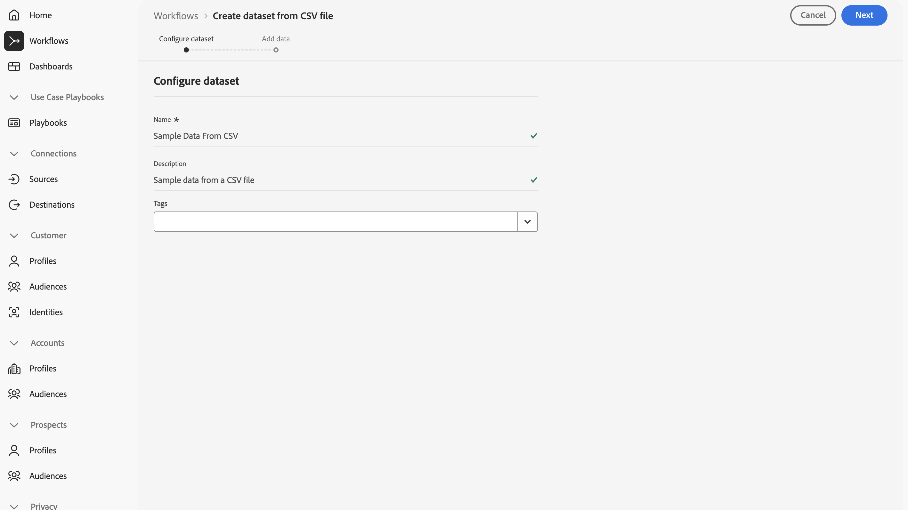
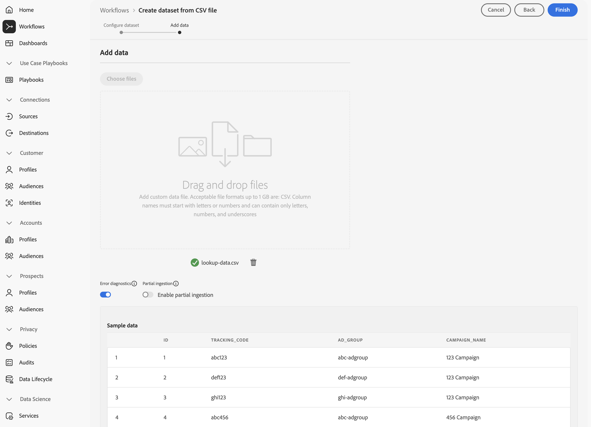
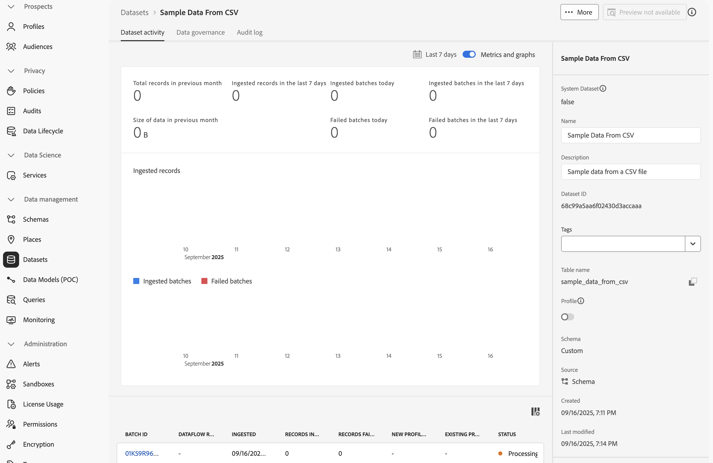
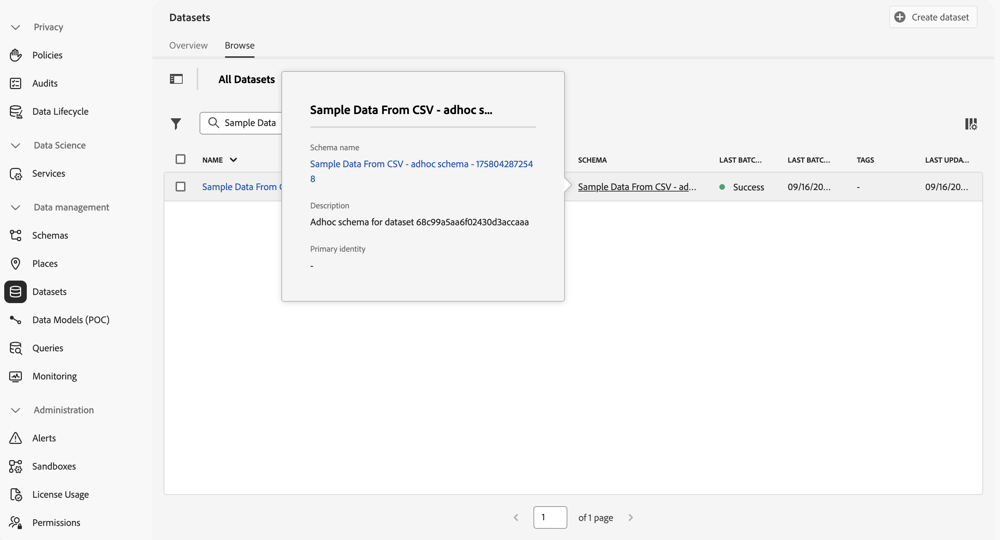
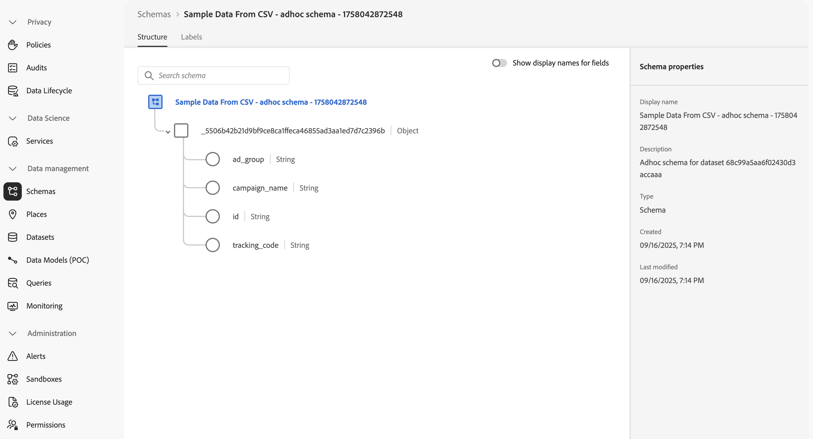
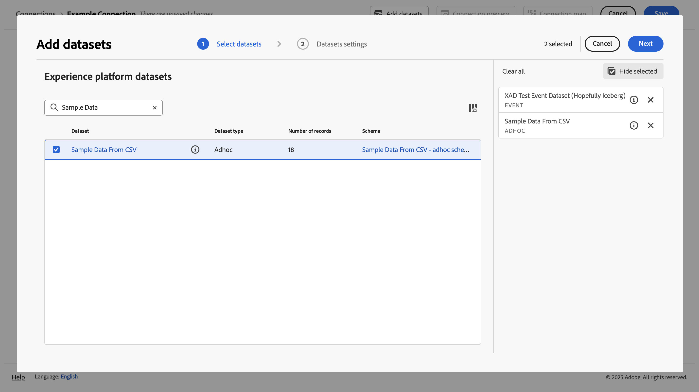
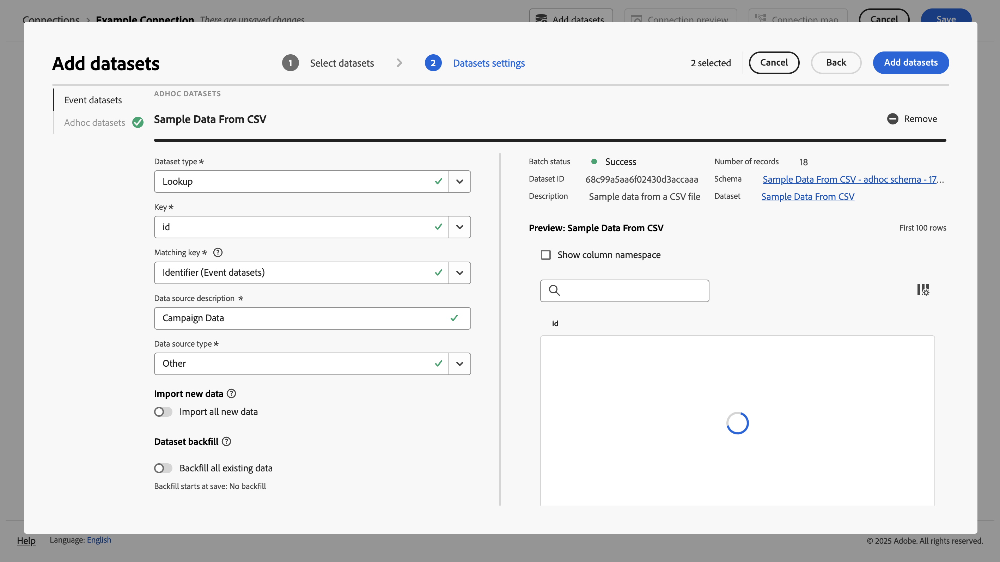
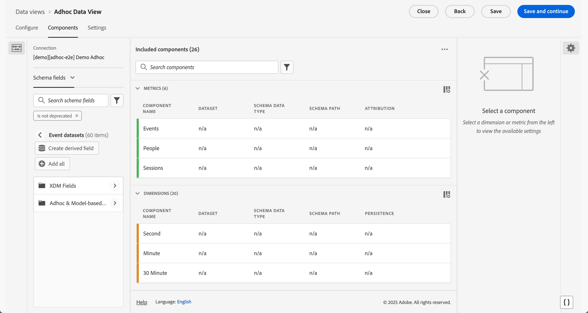

# アドホックデータの取り込みと使用

このクイックスタートガイドでは、Experience Platformにアドホックデータを取り込み、そのデータをCustomer Journey Analyticsで使用する方法について説明します。

これには、次の手順を実行する必要があります。

- **Experience PlatformでCSV ファイル**&#x200B;を使用してデータセットを作成します。 このワークフローでは、収集するデータのモデル（スキーマ）と、データ（データセット）を収集する場所を定義します。

- Customer Journey Analytics で、**接続を設定**&#x200B;します。 この接続には、（少なくとも）Experience Platform アドホックデータセットを含める必要があります。

- **Customer Journey Analyticsでデータビュー**&#x200B;を設定し、Analysis Workspaceで使用するアドホックデータのフィールドから指標とディメンションを定義します。

- Customer Journey Analytics で&#x200B;**プロジェクトを設定**&#x200B;して、レポートとビジュアライゼーションを作成します。

>[!NOTE]
>
>このクイックスタートガイドでは、を使用してアドホックデータをExperience Platformに取り込み、そのアドホックデータをCustomer Journey Analyticsで使用する方法について簡単に説明します。 参照する際には、追加情報を調べることを強くお勧めします。

## CSV ファイルを使用したデータセットの作成

このクイックスタートでは、ルックアップデータを表すCSV ファイルを使用し、次に示すような情報を含める必要があります。

| _id | tracking_code | ad_group | campaign_name |
| ---: | :---          | :---        | :---          |
| 1 | abc123 | abc-adgroup | 123 キャンペーン |
| 2 | def123 | def-adgroup | 123 キャンペーン |
| 3 | ghi123 | ghi-adgroup | 123 キャンペーン |
| 4 | abc456 | abc-adgroup | 456 キャンペーン |
| 5 | def456 | def-adgroup | 456 キャンペーン |

>[!NOTE]
>
>レコードベース（ルックアップ、プロファイル）のデータに対して、アドホックデータセットとスキーマを使用します。 アドホックデータセットとスキーマはあまり適しておらず、時系列（イベント、概要）データでは考慮しないでください。

アドホックデータのXDM スキーマを作成する必要はありません。 Experience Platformでは、CSV ファイル内のデータに基づいて次のワークフローをサポートしています。

1. アドホックスキーマを自動的に作成します。 このスキーマはCSV ファイルの列に準拠しています。
1. CSV ファイルのデータを含むデータセットを作成します。

ワークフローを開始するには：

1. Experience Platform インターフェイスの左側のパネルで、**[!UICONTROL ワークフロー]**&#x200B;を選択します。
1. 「 **[!UICONTROL CSV ファイルからデータセットを作成]**」を選択します。
1. 右側のパネルから「**[!UICONTROL Launch]**」を選択します。
1. **[!UICONTROL ワークフロー]** > **[!UICONTROL CSV ファイルからデータセットを作成]** ウィザードで、次の操作を行います。
   1. **[!UICONTROL データセットの設定]**&#x200B;手順で、次の操作を行います。
      1. データセットの&#x200B;**[!UICONTROL 名前]**&#x200B;を入力します。 例：`Sample Data From CSV`。
      1. オプションの&#x200B;**[!UICONTROL 説明]**&#x200B;を追加します。 例：`Sample data from a CSV file`。
      1. 1つ以上のオプションの&#x200B;**[!UICONTROL タグ]**&#x200B;を追加するか、1つ以上の既存の&#x200B;**[!UICONTROL タグ]**&#x200B;を選択します。

         

      1. 「**[!UICONTROL 次へ]**」を選択します。
   1. **[!UICONTROL データを追加]** ステップで：
      1. 「**[!UICONTROL ファイルを選択]**」を選択して、コンピューターまたはネットワークからCSV ファイルを選択します。 または、ファイルをコンピューターまたはネットワーク上の場所から&#x200B;**[!UICONTROL ファイルをドラッグ&amp;ドロップ]**&#x200B;します。 ファイルがアップロードされ、**[!UICONTROL サンプルデータ]**&#x200B;が表示されます。
      1. **[!UICONTROL エラー診断]**&#x200B;と&#x200B;**[!UICONTROL 部分取り込み]**&#x200B;を環境設定に従って有効または無効にします。 **[!UICONTROL 部分取り込みを有効にする]**&#x200B;場合、**[!UICONTROL エラーしきい値%]**&#x200B;を定義できます。

         

      1. 「**[!UICONTROL 完了]**」を選択します。

データの準備とアップロードが完了すると、Experience Platform インターフェイスの&#x200B;**[!UICONTROL データセット]**&#x200B;にリダイレクトされます。  ステータスが **[!UICONTROL Processing]**&#x200B;の&#x200B;**[!UICONTROL Sample Data from CSV]** データセットの&#x200B;**[!UICONTROL データセットアクティビティ]**&#x200B;が表示されます。

アドホックデータを検査するには：

1. Experience Platform インターフェイスの左側のパネルで、**[!UICONTROL データセット]**&#x200B;を選択します。
1. **[!UICONTROL データセット]**&#x200B;の「**[!UICONTROL 参照]**」タブを選択します。 データセットが一覧表示されます。
1. **[!UICONTROL スキーマ]**&#x200B;列からスキーマの名前を選択します。 例：**[!UICONTROL CSVからのサンプルデータ…]**

   

1. ポップアップで、**[!UICONTROL スキーマ名]**&#x200B;を選択します。 例：**[!UICONTROL CSVからのサンプルデータ – アドホックスキーマ - XXXXXXXXXXX]**。 **[!UICONTROL スキーマ]** > **[!UICONTROL CSVからのサンプルデータ – アドホックスキーマ - XXXXXXXXXXXXX]** インターフェイスにリダイレクトされます。

**[!UICONTROL スキーマ]** > **[!UICONTROL CSVからのサンプルデータ – アドホックスキーマ - XXXXXXXXXXXXX]** インターフェイス：

- **[!UICONTROL スキーマ]**/**[!UICONTROL CSVからのサンプルデータ – アドホックスキーマ - XXXXXXXXXXX]**&#x200B;の下にある最も上位のテナント名オブジェクトを選択して、オブジェクト内のフィールドを表示します。 オブジェクト内のフィールドは、CSV ファイルの構造を表します。 スキーマは、アドホックデータのアップロードに基づいて自動的に作成されます。

  

  >[!NOTE]
  >
  >ワークフローでは、スキーマ内のすべてのフィールドを文字列型に定義します。 このタイプは、後の段階で変更することはできません。 アドホックスキーマの定義に柔軟性が必要な場合は、[APIを使用してアドホックスキーマを作成し](https://experienceleague.adobe.com/ja/docs/experience-platform/xdm/tutorials/ad-hoc)、[&#x200B; スキーマからデータセットを作成](https://experienceleague.adobe.com/ja/docs/experience-platform/catalog/datasets/user-guide#schema) ワークフローを使用することを検討してください。
  > 

## 接続の設定

Customer Journey AnalyticsでExperience Platform データセットを使用するには、[&#x200B; ワークフロー](#create-a-dataset-with-a-csv-file)から得られるアドホックデータセットを含む接続を作成します

Adobe Analyticsとの連携により、Experience PlatformのデータセットをWorkspaceに統合できます。 これらのデータセットについてレポートを作成するには、まずExperience PlatformとWorkspaceのデータセット間の接続を確立する必要があります。

接続を作成するには：

1. Customer Journey Analytics UIの上部メニューで、**[!UICONTROL Data management]**&#x200B;から&#x200B;**[!UICONTROL Connections]**&#x200B;を選択します（オプション）。

1. 「**[!UICONTROL 新しい接続を作成]**」を選択します。

1. **[!UICONTROL 名称未設定の接続]**&#x200B;画面で、次の手順を実行します。

   1. 「**[!UICONTROL 接続設定]**」で接続に名前を付けて説明します。

   1. **[!UICONTROL データ設定]**&#x200B;の&#x200B;**[!UICONTROL サンドボックス]**&#x200B;リストから適切なサンドボックスを選択し、**[!UICONTROL 毎日のイベントの平均数]**&#x200B;リストから日次イベントの数を選択します。

      

   1. 「**[!UICONTROL データセットを追加]**」を選択します。

1. 「**[!UICONTROL データセットを追加]**」の「**[!UICONTROL データセットを選択]**」手順で、次の操作を行います。

   1. 先ほど作成したデータセット（例：**[!UICONTROL CSVからのデータのサンプル]**）と、接続に含めるその他のデータセットを選択します。 アドホックデータセットには、**[!UICONTROL Adhoc]** [!UICONTROL &#x200B; データセットの種類]があります。

      

   1. 「**[!UICONTROL 次へ]**」を選択します。

1. 「**[!UICONTROL データセットを追加]**」の「**[!UICONTROL データセット設定]**」手順で、次の操作を行います。

   アドホックデータセットの場合：

   1. アドホックデータセットのタイプを選択します。 例：**[!UICONTROL Lookup]**。
   1. アドホックスキーマで定義された使用可能なキーから&#x200B;**[!UICONTROL キー]**&#x200B;を選択します。
   1. 接続の一部として追加したイベントデータセットから&#x200B;**[!UICONTROL 一致するキー]**&#x200B;を選択します。
   1. **[!UICONTROL データソースタイプ]**&#x200B;リストから正しいデータソースを選択します。 「**[!UICONTROL その他]**」を指定している場合は、データソースの説明を追加します。

   1. 必要に応じて&#x200B;**[!UICONTROL すべての新しいデータを読み込み]**&#x200B;および&#x200B;**[!UICONTROL データセットの既存データのバックフィル]**&#x200B;を選択します。

      

   1. 「**[!UICONTROL データセットを追加]**」を選択します。

   1. 「**[!UICONTROL 保存]**」を選択します。

アドホックデータセットで使用できる設定について詳しくは、[&#x200B; アドホックデータセット設定](/help/connections/create-connection.md#adhoc-dataset)を参照してください。

>[!IMPORTANT]
>
>時系列データにアドホックデータセットとスキーマを使用しない一般的な推奨事項に加えて、時系列データに&#x200B;**[!UICONTROL CSV]**&#x200B;からデータセットを作成ワークフローを使用することはできません。 このワークフローでは、すべてのフィールドを後で変更できない文字列型に定義します。 時系列ベースのデータセット（イベントまたは概要）を接続に追加する場合、このタイプのデータセットには、DateTime タイプの少なくとも1つのフィールドの定義が必要です。  アドホック時系列データを使用する必要がある場合は、[APIを使用してアドホックスキーマを作成し](https://experienceleague.adobe.com/ja/docs/experience-platform/xdm/tutorials/ad-hoc#token_type=bearer&expires_in=43197438)、次に[&#x200B; スキーマからデータセットを作成](https://experienceleague.adobe.com/ja/docs/experience-platform/catalog/datasets/user-guide#schema) ワークフローを使用することを検討してください。

[接続](/help/connections/overview.md)を作成すると、[&#x200B; データセットの選択と結合](/help/connections/combined-dataset.md)、[接続のデータセットのステータスとデータ取り込みのステータス &#x200B;](/help/connections/manage-connections.md)など、様々な管理タスクを実行できます。

## データ表示の設定

データ表示は、Customer Journey Analytics に特有のコンテナで、接続からデータを解釈する方法を決定できます。 Analysis Workspace で使用可能なすべてのディメンションと指標、およびこれらのディメンションと指標からデータを取得する列を指定します。 データ表示は、Analysis Workspace でレポートの準備を行う際に定義します。

データ表示を作成するには：

1. Customer Journey Analytics UIの上部メニューで、**[!UICONTROL データビュー]** （オプションで&#x200B;**[!UICONTROL データ管理]**&#x200B;から）を選択します。

1. 「**[!UICONTROL 新しいデータ表示を作成]**」を選択します。

1. **[!UICONTROL 設定]**&#x200B;手順で、次の操作を行います。

   1. **[!UICONTROL 接続]** リストから[接続](#set-up-a-connection)を選択します。

   1. 接続に名前を付け、（オプションで）説明します。

      

   1. 「**[!UICONTROL 保存して続行]**」を選択します。

1. **[!UICONTROL コンポーネント]**&#x200B;手順で、次の操作を行います。

   1. **[!UICONTROL 指標]**&#x200B;または&#x200B;**[!UICONTROL ディメンション]**&#x200B;コンポーネントボックスに含めるスキーマフィールドや標準コンポーネントを追加します。 アドホックデータを含むデータセットから関連フィールドを追加することを確認します。 これらのフィールドにアクセスするには：

      1. **[!UICONTROL イベントデータセット]**&#x200B;を選択します。
      1. 「**[!UICONTROL アドホックおよびリレーショナルフィールド]**」を選択します。

         

      1. アドホックスキーマから&#x200B;**[!UICONTROL 指標]**&#x200B;または&#x200B;**[!UICONTROL ディメンション]**&#x200B;にフィールドをドラッグ&amp;ドロップします。

   1. オプションで、[派生フィールド &#x200B;](/help/data-views/derived-fields/derived-fields.md)を使用して、アドホックフィールドをデフォルトの文字列タイプおよび形式から別のタイプまたは形式に変更します。

   1. 「**[!UICONTROL 保存して続行]**」を選択します。

1. **[!UICONTROL 設定]**&#x200B;手順で、次の操作を行います。

   設定をそのままにし、「**[!UICONTROL 保存して終了]**」を選択します。

データビューの作成および編集方法について詳しくは、[&#x200B; データビューの概要](../data-views/data-views.md)を参照してください。 また、データビューで使用できるコンポーネントや、セグメントとセッションの設定の使用方法についても説明します。

## プロジェクトの設定

Analysis Workspaceは、データにもとづいて分析データを迅速に構築し、インサイトを共有できる柔軟なブラウザーツールです。 ワークスペースプロジェクトでは、データコンポーネント、テーブル、およびビジュアライゼーションを組み合わせて、分析を作成し、組織内の任意のユーザーと共有できます。

プロジェクトを作成するには：

1. Customer Journey Analytics UIで、上部メニューの「**[!UICONTROL プロジェクト]**」を選択します。

1. 左側のナビゲーションの「**[!UICONTROL プロジェクト]**」を選択します。

1. 「**[!UICONTROL プロジェクトを作成]**」を選択します。

1. 「**[!UICONTROL 空のプロジェクト]**」を選択します。

1. リストから[&#x200B; データビュー](#set-up-a-data-view)を選択します。

1. 最初のレポートを作成するには、[!UICONTROL &#x200B; パネル &#x200B;]の[!UICONTROL 自由形式テーブル &#x200B;]で、ディメンションと指標のドラッグ&amp;ドロップを開始します。 高度なデータにもとづいた指標やディメンションを含めることができます。

コンポーネント、ビジュアライゼーション、パネルを使用してプロジェクトを作成し、分析を構築する方法について詳しくは、[Analysis Workspace の概要](../analysis-workspace/home.md)を参照してください。

>[!SUCCESS]
>
>すべての手順が完了しました。 まず、収集するアドホックデータ（CSV ファイル）を定義します。 ワークフローを使用して、そのCSV ファイルからアドホックデータセットとスキーマを作成しました。 取り込んだアドホックデータやその他のデータを使用するように、Customer Journey Analyticsで接続を定義しました。 データ表示の定義では、使用するディメンションと指標を指定でき、最後に、最初のプロジェクトを作成し、データを視覚化および分析します。
