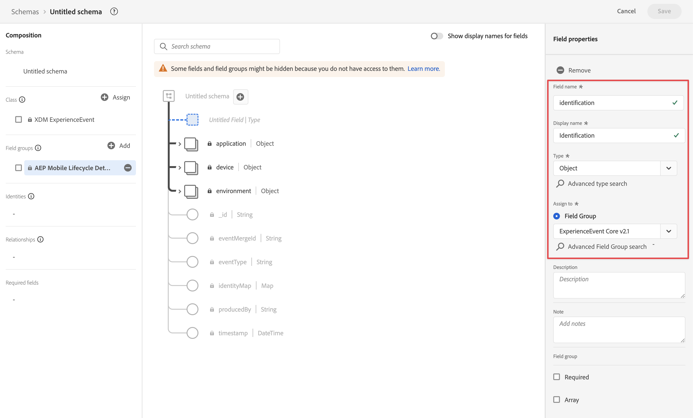

# Mobile SDKを介したデータの取り込み

このクイックスタートガイドでは、Adobe Experience Platform Mobile SDKとEdge Networkを使用して、モバイルアプリのトラッキングデータをAdobe Experience Platformに直接取り込む方法について説明します。 次に、そのデータをCustomer Journey Analyticsで使用します。

これには、次の手順を実行する必要があります。

- Adobe Experience Platform で&#x200B;**スキーマとデータセットを設定**&#x200B;し、収集するデータのモデル（スキーマ）と、実際にデータ（データセット）を収集する場所を定義します。

- **データストリームの設定**：収集したデータを Adobe Experience Platform で設定したデータセットにルーティングするように Adobe Experience Platform Edge Network を設定します。

- **タグを使用**：モバイルアプリケーションのデータに対してルールやデータ要素を簡単に設定できます。 次に、データが Adobe Experience Platform Edge Network 上に設定されたデータストリームに送信されることを確認します。

- **デプロイと検証**&#x200B;を行います。タグの開発を繰り返し実行し、すべての検証が完了したら、実稼動環境で公開できる環境を構築します。

- Customer Journey Analytics で、**接続を設定**&#x200B;します。この接続には、（少なくとも）Adobe Experience Platform データセットを含める必要があります。

- Customer Journey Analytics で&#x200B;**データ表示を設定**&#x200B;し、Analysis Workspace で使用する指標とディメンションを定義します。

- Customer Journey Analytics で&#x200B;**プロジェクトを設定**&#x200B;して、レポートとビジュアライゼーションを作成します。

>[!NOTE]
>
>このクイックスタートガイドは、アプリケーションから収集されたデータをAdobe Experience Platformに取り込み、Customer Journey Analyticsで使用する方法を説明する簡単なガイドです。 参照する際には、追加情報を調べることを強くお勧めします。

## スキーマとデータセットの設定

データを Adobe Experience Platform に取り込むには、まず収集するデータを定義する必要があります。ダウンストリームの機能で認識し、処理するには、Adobe Experience Platform に取り込まれるすべてのデータが、標準的な非正規化された構造に準拠する必要があります。エクスペリエンスデータモデル（XDM）は、スキーマの形式で構造を提供する標準フレームワークです。

スキーマを定義したら、1 つ以上のデータセットを使用して、データの収集を保存および管理します。データセットは、スキーマ（列）とフィールド（行）を含んだデータのコレクション（通常はテーブル）のストレージおよび管理用の構成体です。

Adobe Experience Platform に取り込まれるすべてのデータは、データセットとして保持する前に、事前定義済みのスキーマに準拠している必要があります。

### スキーマの設定

モバイルアプリを使用して、プロファイルからの最小限のデータ（シーン名、ID など）を追跡する場合。
まず、このデータをモデル化するスキーマを定義する必要があります。

スキーマを設定するには：

1. Adobe Experience Platform UI の左パネルの「[!UICONTROL データ管理]」で、「**[!UICONTROL スキーマ]**」を選択します。

1. **[!UICONTROL スキーマを作成]** を選択します。
.
1. スキーマ作成ウィザードの「クラスを選択」手順で、次の操作を行います。

   1. 「**[!UICONTROL エクスペリエンスイベント]**」を選択します。

      

      >[!INFO]
      >
      >    エクスペリエンスイベントスキーマを使用すると、プロファイルの&#x200B;_動作_（シーン名、買い物かごに追加するプッシュボタンなど）をモデル化できます。個々のプロファイルスキーマは、プロファイル&#x200B;_属性_（名前、メール、性別など）のモデル化に使用されます。

   1. 「**[!UICONTROL 次へ]**」を選択します。

1. [!UICONTROL スキーマを作成]ウィザードの[!UICONTROL 名前とレビューの手順]で、次の操作を行います。

   1. スキーマの&#x200B;**[!UICONTROL スキーマ表示名]**&#x200B;と&#x200B;**[!UICONTROL 説明]**（オプション）を入力します。

      

   1. 「**[!UICONTROL 完了]**」を選択します。

1. 「スキーマ例の構造」タブで、次の操作を行います。

   1. 「[!UICONTROL フィールドグループ]」で「**[!UICONTROL + 追加]**」を選択します。

      

      フィールドグループは、スキーマを簡単に拡張できる、再利用可能なオブジェクトと属性のコレクションです。

   1. [!UICONTROL  フィールドグループを追加 ] ダイアログで、リストから「**[!UICONTROL AEP Mobile SDK ExperienceEvent]**」フィールドグループを選択します。

      

      「プレビュー」ボタンを選択すると、このフィールドグループに属するフィールド（`application > name` など）のプレビューを表示できます。

      

      「**[!UICONTROL 戻る]**」を選択してプレビューを閉じます。

   1. 「**[!UICONTROL フィールドグループを追加]**」を選択します。

1. [!UICONTROL 構造]パネルで、スキーマ名の隣にある「**[!UICONTROL +]**」をクリックします。

   

1. 「[!UICONTROL  フィールドプロパティ ]」パネルで、`identification` フィールド名 [!UICONTROL  に ] と入力し、**[!UICONTROL 表示名]** に [!UICONTROL ID] と入力し、**[!UICONTROL タイプ]** で [!UICONTROL  オブジェクト ] を選択し、**[!UICONTROL フィールドグループ]** で [!UICONTROL ExperienceEvent Core v2.1] を選択します。

   >[!NOTE]
   >
   >このフィールドグループが使用できない場合は、ID フィールドを含む別のフィールドグループを検索します。または、フィールドグループに[新しいフィールドグループを作成](https://experienceleague.adobe.com/docs/experience-platform/xdm/ui/resources/field-groups.html?lang=ja)し、（`ecid`、`crmId` など）[新しい ID フィールドを追加](https://experienceleague.adobe.com/docs/experience-platform/xdm/ui/fields/identity.html?lang=ja#define-a-identity-field)して、この新しいフィールドグループを選択します。

   

   ID オブジェクトは、スキーマに ID 機能を追加します。この場合、Experience Cloud ID とメールアドレスを使用して、モバイルアプリを使用してプロファイルを識別します。 ユーザーの ID を追跡するために使用できる属性は他にも多数あります（例：顧客 ID、ロイヤルティ ID）。

   「**[!UICONTROL 適用]**」を選択して、このオブジェクトをスキーマに追加します。

1. 先ほど追加した ID オブジェクトで「**[!UICONTROL ecid]**」フィールドをクリックし、右パネルの [!UICONTROL ID 名前空間]リストから **[!UICONTROL ID]**、**[!UICONTROL プライマリ ID]** および **[!UICONTROL ECID]** を選択します。

   

   Experience Cloud ID を、Adobe Experience Platform Identity Service が同じ ECID を持つプロファイルの動作を組み合わせる（ステッチする）ために使用するプライマリ ID として指定します。

   「**[!UICONTROL 適用]**」を選択します。ecid 属性にフィンガープリントアイコンが表示されます。

1. 先ほど追加した ID オブジェクトで「**[!UICONTROL メール]**」フィールドをクリックし、[!UICONTROL フィールドプロパティ]パネルの[!UICONTROL ID 名前空間]リストから **[!UICONTROL ID]** と&#x200B;**[!UICONTROL メール]**&#x200B;を選択します。

   

   メールアドレスを、Adobe Experience Platform Identity Service がプロファイルの動作を組み合わせる（ステッチする）ために使用するもう一つの ID として指定します。

   「**[!UICONTROL 適用]**」を選択します。メール属性にフィンガープリントアイコンが表示されます。

   「**[!UICONTROL 保存]**」を選択します。

1. スキーマの名前を表示しているスキーマのルート要素を選択してから、**[!UICONTROL プロファイル]**&#x200B;スイッチをクリックします。

   プロファイルのスキーマを有効にするよう求められます。有効にすると、このスキーマに基づくデータセットにデータが取り込まれたときに、そのデータをリアルタイム顧客プロファイルと結合します。

   詳しくは、[リアルタイム顧客プロファイルで使用するスキーマを有効にする](https://experienceleague.adobe.com/docs/experience-platform/xdm/tutorials/create-schema-ui.html?lang=ja#profile)を参照してください。

   >[!IMPORTANT]
   >
   >    プロファイルで有効にしたスキーマを保存すると、そのスキーマはプロファイルで無効にできなくなります。

   

1. 「**[!UICONTROL 保存]**」を選択してスキーマを保存します。

モバイルアプリケーションから取得できるデータをモデル化する、最小限のスキーマを作成しました。 このスキーマを使用することで、Experience Cloud ID とメールアドレスを使用してプロファイルを識別できます。プロファイルのスキーマを有効にすることで、モバイルアプリケーションから取り込んだデータをリアルタイム顧客プロファイルへと確実に追加できます。

行動データの横にある、モバイルアプリケーションからプロファイル属性データ（ニュースレターを購読したプロファイルの詳細など）を取り込むこともできます。

プロファイルデータを取得するには、次を実行します。

- XDM Individual Profile クラスに基づいてスキーマを作成します。

- Profile Core v2 フィールドグループをスキーマに追加します。

- Profile Core v2 フィールドグループに基づいて ID オブジェクトを追加します。

- Experience Cloud ID をプライマリ識別子として定義し、メールを識別子として定義します。

- プロファイルでスキーマを有効にする

フィールドグループと個々のフィールドをスキーマに追加、またはスキーマから削除する方法について詳しくは、[UI でのスキーマの作成と編集](https://experienceleague.adobe.com/docs/experience-platform/xdm/ui/resources/schemas.html?lang=ja)を参照してください。

### データセットの設定

スキーマを使用して、データモデルを定義しました。次に、データセットを使用して、そのデータを保存および管理する構成を定義する必要があります。

データセットを設定するには：

1. Adobe Experience Platform UI の左パネルの「[!UICONTROL データ管理]」で、「**[!UICONTROL データセット]**」を選択します。

2. 「**[!UICONTROL データセットを作成]**」を選択します。

   

3. 「**[!UICONTROL スキーマからデータセットを作成]**」をクリックします。

   

4. 作成したスキーマを選択し、「**[!UICONTROL 次へ]**」を選択します。

5. データセットに名前を付け、（オプション）説明を入力します。

   

6. 「**[!UICONTROL 完了]**」を選択します。

7. 「**[!UICONTROL プロファイル]**」スイッチを選択します。

   プロファイルのデータセットを有効にするよう求められます。有効にすると、データセットは、取り込んだデータを使用してリアルタイム顧客プロファイルを強化します。

   >[!IMPORTANT]
   >
   >    プロファイルのデータセットを有効にできるのは、データセットが準拠するスキーマがプロファイルに対しても有効になっている場合のみです。

   

データセットの表示、プレビュー、作成、削除の方法について詳しくは、[データセット UI ガイド](https://experienceleague.adobe.com/docs/experience-platform/catalog/datasets/user-guide.html?lang=ja)を参照してください。リアルタイム顧客プロファイルのデータセットを有効にする方法について説明します。

## データストリームの設定

データストリームは、Adobe Experience Platform Web および Mobile SDK を実装する際のサーバーサイド設定を表します。Adobe Experience Platform SDK を使用してデータを収集する際、データはAdobe Experience Platform Edge Network に送信されます。これは、データの転送先となるサービスを決定するデータストリームです。

設定では、モバイルアプリから収集したデータをAdobe Experience Platformのデータセットに送信する必要があります。

データストリームを設定するには：

1. Adobe Experience Platform UI の左パネルで、「[!UICONTROL データ収集]」から「**[!UICONTROL データストリーム]**」を選択します。

2. **[!UICONTROL 新しいデータストリーム]**&#x200B;を選択します。

3. データストリームに名前を付けて説明します。[!UICONTROL イベントスキーマ]リストからスキーマを選択します。

   

4. 「**[!UICONTROL 保存]**」を選択します。

5. 「**[!UICONTROL サービスを追加]**」を選択します。

6. [!UICONTROL サービスを追加画面]で、次の操作を行います。

   1. [!UICONTROL サービス]リストから&#x200B;**[!UICONTROL Adobe Experience Platform]** を選択します。

   2. 「**[!UICONTROL 有効]**」が選択されていることを確認します。

   3. [!UICONTROL イベントデータセット]リストからお使いのデータセットを選択します。

      

   4. その他の設定はそのままにし、「**[!UICONTROL 保存]**」を選択してデータストリームを保存します。

これで、モバイルアプリから収集したデータをAdobe Experience Platformでデータセットに転送するように、データストリームが設定されました。

データストリームの設定方法と機密データの処理方法について詳しくは、[データストリームの概要](https://experienceleague.adobe.com/docs/experience-platform/edge/datastreams/overview.html?lang=ja)を参照してください。

## タグの使用

データを収集するためのコードをサイトに実装するには、Adobe Experience Platformのタグ機能を使用します。 このタグ管理ソリューションを使用すると、他のタグ要件と共にコードをデプロイできます。タグは、Adobe Experience Platform Mobile SDK拡張機能を使用して、Adobe Experience Platformとのシームレスな統合を提供します。

### タグを作成する

1. Adobe Experience Platform UI の左パネルの「[!UICONTROL データ収集]」で、「**[!UICONTROL タグ]**」を選択します。

2. 「**[!UICONTROL 新しいプロパティ]**」を選択します。

   タグに名前を付け、「**[!UICONTROL モバイル]**」を選択します。 「**[!UICONTROL 保存]**」を選択して続行します。

   

### タグの設定

タグを作成したら、適切な拡張機能を使用してタグを設定し、サイトを追跡して Adobe Experience Platform にデータを送信する方法に応じて、データ要素とルールを設定する必要があります。

を設定するには、[!UICONTROL  タグのプロパティ ] のリストから、新しく作成したタグを選択します。

#### **拡張機能**

Adobe Platform Edge Network拡張機能をタグに追加して、（データストリームを介して）Adobe Experience Platformにデータを送信できるようにします。

Adobe Experience Platform Mobile SDK拡張機能を作成および設定するには：

1. 左パネルで **[!UICONTROL 拡張機能]** を選択します。 Mobile Core 拡張機能とプロファイル拡張機能は既に使用可能です。

1. 上部のバーで「**[!UICONTROL カタログ]**」をクリックします。

1. **[!UICONTROL Adobe Experience Platform Edge Network]** 拡張機能を検索またはスクロールし、右側のパネルで「**[!UICONTROL インストール]**」を選択してインストールします。

1. サンドボックスと、以前に作成した[!UICONTROL 実稼動環境]、（オプション）[!UICONTROL ステージング環境]および[!UICONTROL 開発環境]用のデータストリームを選択します。

   

1. **[!UICONTROL ドメイン設定]** の下に [!UICONTROL 0}Edge Network ドメイン } を入力します。 ]通常、`<organizationName>.data.adobedc.net` を使用します。

1. 「**[!UICONTROL 保存]**」を選択します。

詳しくは [Adobe Experience Platform Edge Network拡張機能の設定 ](https://developer.adobe.com/client-sdks/documentation/edge-network) を参照してください。

また、カタログから次の追加拡張機能も設定する必要があります。

- ID。
- AEPAssurance。
- 同意。

拡張機能とその設定について詳しくは、Experience Platform 用モバイルアプリチュートリアルの [ タグプロパティの設定 ](https://experienceleague.adobe.com/docs/platform-learn/implement-mobile-sdk/initial-configuration/configure-tags.html?lang=ja) を参照してください。

#### **データ要素**

データ要素は、データ辞書（またはデータマップ）の構築要素です。データ要素を使用して、マーケティングおよび広告テクノロジー全体でデータを収集、整理、配信します。タグで、モバイルアプリのデータやイベントから読み取り、Adobe Experience Platformにデータを配信するために使用できるデータ要素を設定します。

例えば、モバイルアプリから通信事業者名を収集するとします。

通信事業者名データ要素を定義するには：

1. 左パネルで「**[!UICONTROL データ要素]**」を選択します。

2. 「**[!UICONTROL データ要素を追加]**」を選択します。

3. [!UICONTROL データ要素を作成]ダイアログで、次の手順を実行します。

   - データ要素に名前を付けます（例：`Carrier Name`）。

   - **[!UICONTROL 拡張機能]** リストから [!UICONTROL Mobile Core] を選択します。

   - **[!UICONTROL データ要素タイプ]** リストから [!UICONTROL  通信事業者名 ] を選択します。

     

   - 「**[!UICONTROL 保存]**」を選択します。

必要な数のデータ要素を作成し、それらをルールで使用できます。

#### **ルール**

Adobe Experience Platform のタグは、ルールベースのシステムに従います。ユーザーの操作と関する各種データを参照します。ルールで設定された条件が満たされると、ルールは、特定した拡張機能、スクリプトまたはクライアント側コードをトリガーします。ルールを使用し、XDM オブジェクトなどのデータを、Adobe Experience Platform Edge Network拡張機能を使用してAdobe Experience Platformに送信できます。

例えば、モバイルアプリが使用された場合（フォアグラウンドで）や、使用されなかった（バックグラウンドにプッシュされた）場合にイベントデータを送信するとします。

ルールを定義するには：

1. 左パネルで「**[!UICONTROL ルール]**」を選択します。

2. 「**[!UICONTROL 新規ルールを作成]**」を選択します。

3. [!UICONTROL ルールを作成]ダイアログで、次の手順を実行します。

   - ルールに名前を付けます（例：`Application Status`）。

   - 「[!UICONTROL イベント]」の下の「**[!UICONTROL + 追加]**」を選択します。

   - [!UICONTROL イベント設定]ダイアログで、次の手順を実行します。

      - **[!UICONTROL 拡張機能]** リストから [!UICONTROL Mobile Core] を選択します。

      - **[!UICONTROL イベントタイプ]** リストから [!UICONTROL  フォアグラウンド ] を選択します。

      - 「**[!UICONTROL 変更を保持]**」を選択します。

   -  の横にある「[!UICONTROL  プラス ]」をクリックします。

      - **[!UICONTROL 拡張機能]** リストから [!UICONTROL Mobile Core] を選択します。

      - **[!UICONTROL イベントタイプ]** リストから [!UICONTROL  背景 ] を選択します。

      - 「**[!UICONTROL 変更を保持]**」を選択します。

   -  の下の「[!UICONTROL  プラス ] 追加」をクリックします。 [!UICONTROL アクション設定]ダイアログで、次の手順を実行します。

      - 「拡張機能 **[!UICONTROL 」リストから]** 0}Adobe Experience Platform Edge Network[!UICONTROL  を選択します。]

      - **[!UICONTROL アクションタイプ]** リストから [!UICONTROL Edge Networkにイベントを転送 ] を選択します。

      - 「**[!UICONTROL 変更を保持]**」を選択します。

   - ルールは次のようになります。

     

   - 「**[!UICONTROL 保存]**」を選択します。

上記は、アプリケーションステータスを含む XDM データを Adobe Edge Network とAdobe Experience Platformに送信するルールを定義する例にすぎません。

タグ内で様々な方法でルールを使用して、（データ要素を使用して）変数を操作できます。

詳しくは、[ルール](https://developer.adobe.com/client-sdks/documentation/lifecycle-for-edge-network/#configure-a-rule-to-forward-lifecycle-metrics-to-platform)を参照してください。

### タグを作成して公開する

データ要素とルールを定義したら、タグを作成して公開する必要があります。ライブラリビルドを作成する場合は、そのビルドを環境に割り当てる必要があります。ビルドの拡張機能、ルール、およびデータ要素がコンパイルされ、割り当てられた環境に配置されます。各環境は、割り当てられたビルドをサイトに統合できる、一意の埋め込みコードを提供します。

タグを構築して公開するには、次の手順に従います。

1. 左パネルから「**[!UICONTROL 公開フロー]**」をクリックします。

2. **[!UICONTROL 作業ライブラリを選択]**／**[!UICONTROL ライブラリを追加…]**&#x200B;を選択します。

3. [!UICONTROL ライブラリを作成]ダイアログで、次の手順を実行します。

   - ライブラリに名前を付けます。

   - [!UICONTROL 環境]リストから「**[!UICONTROL 開発（開発）]**」を選択します。

   - 「**[!UICONTROL + 変更されたリソースをすべて追加]**」を選択します。

     

   - 「**[!UICONTROL 開発用に保存およびビルド]**」を選択します。

   タグが保存され、開発環境用に作成されます。緑のドットは、開発環境でタグが正常に作成されたことを示します。

4. **[!UICONTROL ...]** を選択してライブラリを再構築するか、ライブラリをステージング環境または実稼動環境に移動することができます。

Adobe Experience Platform タグは、Adobe Experience Platform Edge Networkのデプロイメントに対応する必要がある、シンプルな公開ワークフローから複雑な公開ワークフローをサポートします。

詳しくは、[公開の概要](https://developer.adobe.com/client-sdks/documentation/getting-started/create-a-mobile-property/#publish-the-configuration)を参照してください。

### タグコードの取得

最後に、追跡するモバイルアプリ内でタグを使用する必要があります。

モバイルアプリを設定し、アプリでタグを使用する方法を説明するコード手順を取得するには：

1. 左パネルで「**[!UICONTROL 環境]**」を選択します。

2. 環境のリストから、正しいインストール  ボタンを選択します。

   [!UICONTROL  モバイルインストール手順 ] ダイアログで、適切なプラットフォーム（[!UICONTROL iOS]、[!UICONTROL Android]）を選択します。 次に、モバイルアプリの設定と初期化に使用する関連コードスニペットの横にある「コピー 」ボタンを使用します。

   

3. 「**[!UICONTROL 閉じる]**」を選択します。

開発環境用のコードの代わりに、Adobe Experience Platform Mobile SDKをデプロイするプロセスの場所に基づいて、別の環境（ステージング、実稼動）を選択することもできます。

詳しくは、[環境](https://experienceleague.adobe.com/docs/experience-platform/tags/publish/environments/environments.html?lang=ja)を参照してください。

## デプロイと検証

これで、モバイルアプリ内にコードをデプロイできます。 デプロイすると、モバイルアプリがAdobe Experience Platformへのデータ収集を開始します。

実装を検証し、必要に応じて修正したら、タグの公開ワークフロー機能を使用して、ステージング環境と実稼動環境にデプロイします。

詳しくは、[ モバイルアプリでのAdobe Experience Cloudの実装チュートリアル ](https://experienceleague.adobe.com/docs/platform-learn/implement-mobile-sdk/overview.html?lang=ja) を参照してください。

## 接続の設定

Adobe Experience Platform データを Customer Journey Analytics で使用するには、接続（スキーマ、データセット、ワークフローの設定によって生成されたデータを含む）を作成します。

接続を使用すれば、Adobe Experience Platform のデータセットをワークスペースに統合できます。これらのデータセットに関するレポートを作成するには、まずAdobe Experience PlatformとWorkspaceのデータセット間で接続を確立する必要があります。

接続を作成するには：

1. Customer Journey Analytics UI で、必要に応じて **[!UICONTROL データ管理]** から「**[!UICONTROL 接続]**」を選択します。

2. 「**[!UICONTROL 新しい接続を作成]**」を選択します。

3. [!UICONTROL 名称未設定の接続]画面で、次の手順を実行します。

   「[!UICONTROL 接続設定]」で接続に名前を付けて説明します。

   [!UICONTROL データ設定]の[!UICONTROL サンドボックス]リストから適切なサンドボックスを選択し、[!UICONTROL 毎日のイベントの平均数]リストから日次イベントの数を選択します。

   

   「**[!UICONTROL データセットを追加]**」を選択します。

   「[!UICONTROL データセットを追加]」の「[!UICONTROL データセットを選択]」手順で、次の操作を行います。

   - 以前に作成したデータセットや、接続に含める他の関連データセット（例：Adobe Journey Optimizerのプッシュトラッキングエクスペリエンスイベントデータやプッシュプロファイルデータ）を選択します

     

   - 「**[!UICONTROL 次へ]**」を選択します。

   「[!UICONTROL データセットを追加]」の「[!UICONTROL データセット設定]」手順で、次の操作を行います。

   - 各データセットに対して、次の手順を行います。

      - Adobe Experience Platform のデータセットスキーマで定義されている使用可能な ID から[!UICONTROL ユーザー ID] を選択します。

      - [!UICONTROL データソースタイプ]リストから正しいデータソースを選択します。「**[!UICONTROL その他]**」を指定している場合は、データソースの説明を追加します。

      - 必要に応じて&#x200B;**[!UICONTROL すべての新しいデータを読み込み]**&#x200B;および&#x200B;**[!UICONTROL データセットの既存データのバックフィル]**&#x200B;を選択します。

     

   - 「**[!UICONTROL データセットを追加]**」を選択します。

   「**[!UICONTROL 保存]**」を選択します。

接続を作成および管理する方法、およびデータセットを選択して組み合わせる方法について詳しくは、[接続の概要](../connections/overview.md)を参照してください。

## データ表示の設定

データ表示は、Customer Journey Analytics に特有のコンテナで、接続からデータを解釈する方法を決定できます。Analysis Workspace で使用可能なすべてのディメンションと指標、およびこれらのディメンションと指標からデータを取得する列を指定します。データ表示は、Analysis Workspace でレポートの準備を行う際に定義します。

データ表示を作成するには：

1. Customer Journey Analytics UI で、必要に応じて **[!UICONTROL データ管理]** から「**[!UICONTROL データビュー]**」を選択します。

2. 「**[!UICONTROL 新しいデータ表示を作成]**」を選択します。

3. [!UICONTROL 設定]手順で、次の操作を行います。

   [!UICONTROL 接続]リストで接続を選択します。

   接続に名前を付け、（オプションで）説明します。

   

   「**[!UICONTROL 保存して続行]**」を選択します。

4. [!UICONTROL コンポーネント]手順で、次の操作を行います。

   [!UICONTROL 指標]または[!UICONTROL ディメンション]コンポーネントボックスに含めるスキーマフィールドや標準コンポーネントを追加します。

   

   「**[!UICONTROL 保存して続行]**」を選択します。

5. [!UICONTROL 設定]手順で、次の操作を行います。

   

   設定をそのままにし、「**[!UICONTROL 保存して終了]**」を選択します。

データ表示の作成および編集方法、データ表示で使用できるコンポーネント、セグメントおよびセッションの設定の使用方法について詳しくは、[ データ表示の概要 ](../data-views/data-views.md) を参照してください。

## プロジェクトの設定

Analysis Workspace は、データに基づき、分析をすばやく構築してインサイトを共有できる、柔軟なブラウザーツールです。ワークスペースプロジェクトでは、データコンポーネント、テーブル、およびビジュアライゼーションを組み合わせて、分析を作成し、組織内の任意のユーザーと共有できます。

プロジェクトを作成するには：

1. Customer Journey Analytics UI で、上部メニューの「**[!UICONTROL プロジェクト]**」をクリックします。

2. 左側のナビゲーションの「**[!UICONTROL プロジェクト]**」を選択します。

3. 「**[!UICONTROL プロジェクトを作成]**」を選択します。

   

   「**[!UICONTROL 空のプロジェクト]**」を選択します。

   

4. リストからデータ表示を選択します。

   します。

5. 最初のレポートを作成するには、[!UICONTROL  パネル ] の [!UICONTROL  フリーフォームテーブル ] でディメンションと指標のドラッグ&amp;ドロップを開始します。 例えば、`Events` を指標、`Push Title` をディメンションにドラッグし、`Event Type` ごとに分類して、モバイルアプリのプッシュ通知の概要と通知に何が起こったかを取得します。

   

コンポーネント、ビジュアライゼーション、パネルを使用してプロジェクトを作成し、分析を構築する方法について詳しくは、[Analysis Workspace の概要](../analysis-workspace/home.md)を参照してください。

>[!SUCCESS]
>
>すべての手順が完了しました。Adobe Experience Platform でどのデータ（スキーマ）を収集するか、どこにそのデータセットを保存するかを定義することから開始して、データセットにデータを転送できるよう、Edge ネットワークでデータストリームを設定しました。次に、拡張機能（Adobe Experience Platform Edge Networkなど）、データ要素、ルールを含むタグを定義してデプロイし、モバイルアプリからデータを取得してデータストリームに送信します。 モバイルアプリのプッシュ通知トラッキングデータやその他のデータを使用するように、Customer Journey Analyticsで接続を定義しました。 データ表示の定義では、使用するディメンションと指標を指定でき、最後に、最初のプロジェクトを作成し、モバイルアプリデータを視覚化および分析します。
