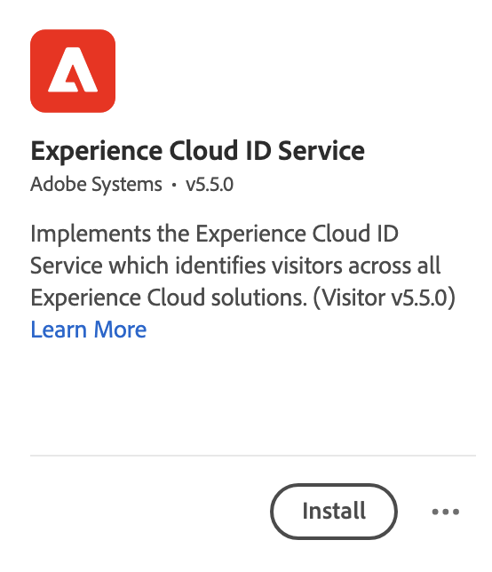

# Adobe Experience Platform Web SDK と Edge Network を介したデータの取り込み

このクイックスタートガイドでは、Adobe Experience Platform Web SDK と Edge Network を使用して、Web サイトトラッキングデータをAdobe Experience Platformに直接取り込み、Customer Journey Analyticsで使用する方法について説明します。

これをおこなうには、次の操作が必要です。

- **スキーマとデータセットの設定** Adobe Experience Platformで、収集するデータのモデル（スキーマ）と、実際にデータ（データセット）を収集する場所を定義します。

- **データストリームの設定** を使用して、収集したデータをAdobe Experience Platformで設定したデータセットにルーティングするようにAdobe Experience Platform Edge Network を設定します。

- **タグを使用** web サイト上のデータレイヤーのデータに対して、ルールやデータ要素を簡単に設定できます。 次に、データがAdobe Experience Platform Edge ネットワーク上に設定されたデータストリームに送信されることを確認します。

- **デプロイと検証**. タグの開発を繰り返し実行し、すべての検証が完了したら、実稼動環境で公開できる環境を構築します。

- **接続の設定** Customer Journey Analytics この接続には、少なくともAdobe Experience Platformデータセットを含める必要があります。

- **データビューの設定** 「 」Customer Journey Analyticsで、Analysis Workspaceで使用する指標とディメンションを定義します。

- **プロジェクトの設定** ( レポートおよびビジュアライゼーションを作成するためのCustomer Journey Analytics)

>[!NOTE]
>
>これは、サイトから収集されたデータをAdobe Experience Platformに取り込み、Customer Journey Analyticsで使用する方法を簡単に説明するガイドです。 を参照する際に、追加情報を調べることを強くお勧めします。


## スキーマとデータセットの設定

データをAdobe Experience Platformに取り込むには、まず収集するデータを定義する必要があります。 Adobe Experience Platformに取り込まれるすべてのデータを、標準的で非正規化された構造に準拠させ、ダウンストリームの機能によって認識され、処理されるようにする必要があります。 エクスペリエンスデータモデル (XDM) は、この構造をスキーマの形式で提供する標準フレームワークです。

スキーマを定義したら、1 つ以上のデータセットを使用して、データの収集を保存および管理します。 データセットは、スキーマ（列）とフィールド（行）を含んだデータコレクション（通常はテーブル）のストレージおよび管理用の構成体です。

Adobe Experience Platformに取り込まれるすべてのデータは、データセットとして保持する前に、事前定義済みのスキーマに準拠している必要があります。

### スキーマの設定

Web サイトを訪問するプロファイルからの最小限のデータ（ページ名、ID など）を追跡する場合。
この場合、まず、このデータをモデル化するスキーマを定義する必要があります。

スキーマを設定するには：

1. Adobe Experience Platform UI の左側のレールで、を選択します。 **[!UICONTROL スキーマ]** 範囲 [!UICONTROL データ管理].

2. 選択 **[!UICONTROL スキーマを作成]**. 選択 **[!UICONTROL XDM ExperienceEvent]** を選択します。

   

   >[!INFO]
   >
   >    エクスペリエンスイベントスキーマは、 _動作_ プロファイルの（ページビューなど）を買い物かごに追加できます。 個々のプロファイルスキーマは、プロファイルのモデル化に使用されます _属性_ （名前、E メール、性別など）。


3. 内 [!UICONTROL 名称未設定のスキーマ] 画面：

   1. スキーマの表示名と説明（オプション）を入力します。

      

   2. 選択 **[!UICONTROL +追加]** in [!UICONTROL フィールドグループ].

      

      フィールドグループは、スキーマを簡単に拡張できる、再利用可能なオブジェクトや属性のコレクションです。

   3. 内 [!UICONTROL フィールドグループを追加] ダイアログで、 **[!UICONTROL AEP Web SDK ExperienceEvent]** フィールドグループを選択します。

      

      「プレビュー」ボタンを選択すると、次のように、このフィールドグループに属するフィールドのプレビューを表示できます。 `web > webPageDetails > name`.

      

      選択 **[!UICONTROL 戻る]** プレビューを閉じます。

   4. 選択 **[!UICONTROL フィールドグループを追加]**.

4. 選択 **[!UICONTROL +]** をクリックします。 [!UICONTROL 構造] パネル。

   

5. 内 [!UICONTROL フィールドプロパティ] パネル、入力 `Identification` 名前として **[!UICONTROL 識別]** を [!UICONTROL 表示名]を選択します。 **[!UICONTROL オブジェクト]** を [!UICONTROL タイプ] を選択し、 **[!UICONTROL ExperienceEvent Core v2.1]** を [!UICONTROL フィールドグループ].

   

   これにより、スキーマに識別機能が追加されます。 この場合、Experience CloudID と電子メールアドレスを使用して、サイトを訪問しているプロファイルを識別します。 訪問者の ID を追跡するために使用できる属性は他にも多数あります（例えば、顧客 ID、ロイヤリティ ID）。

   選択 **[!UICONTROL 適用]** をクリックして、このオブジェクトをスキーマに追加します。

6. を選択します。 **[!UICONTROL ecid]** 先ほど追加した識別オブジェクト内のフィールドを選択し、 **[!UICONTROL ID]** および **[!UICONTROL プライマリID]** および **[!UICONTROL ECID]** から [!UICONTROL ID 名前空間] リストを右側のパネルに表示します。

   

   Experience CloudID を、Adobe Experience Platform Identity Service が同じ ECID を持つプロファイルの動作を組み合わせる（ステッチする）ために使用できるプライマリ ID として指定します。

   選択 **[!UICONTROL 適用]**. ecid 属性にフィンガープリントアイコンが表示されます。

7. を選択します。 **[!UICONTROL 電子メール]** 先ほど追加した識別オブジェクト内のフィールドを選択し、 **[!UICONTROL ID]** および **[!UICONTROL 電子メール]** から [!UICONTROL ID 名前空間] リスト [!UICONTROL フィールドプロパティ] パネル。

   

   電子メールアドレスを、Adobe Experience Platform ID サービスがプロファイルの動作を組み合わせる（ステッチする）ために使用できる別の ID として指定する場合。

   選択 **[!UICONTROL 適用]**. email 属性にフィンガープリントアイコンが表示されます。

   「**[!UICONTROL 保存]**」を選択します。

8. スキーマの名前を表示しているスキーマのルート要素を選択し、 **[!UICONTROL プロファイル]** スイッチ

   プロファイルのスキーマを有効にするよう求められます。 有効にすると、このスキーマに基づくデータセットにデータが取り込まれると、そのデータがリアルタイム顧客プロファイルに結合されます。

   詳しくは、 [リアルタイム顧客プロファイルでのスキーマ使用の有効化](https://experienceleague.adobe.com/docs/experience-platform/xdm/tutorials/create-schema-ui.html?lang=en#profile) を参照してください。

   >[!IMPORTANT]
   >
   >    プロファイルで有効にしたスキーマを保存すると、プロファイルで無効にできなくなります。

   

9. 選択 **[!UICONTROL 保存]** スキーマを保存します。

Web サイトから取得できるデータをモデル化する最小限のスキーマを作成した。 このスキーマを使用すると、Experience CloudID と電子メールアドレスを使用してプロファイルを識別できます。 プロファイルのスキーマを有効にすると、Web サイトから取り込んだデータをリアルタイム顧客プロファイルに確実に追加できます。

行動データの横にある、サイトからプロファイル属性データ（例えば、ニュースレターを購読したプロファイルの詳細）を取り込むこともできます。

このプロファイルデータを取り込むには、次の操作を行います。

- XDM Individual Profile クラスに基づいてスキーマを作成します。

- プロファイルコア v2 フィールドグループをスキーマに追加します。

- 「 Profile Core v2 」フィールドグループに基づいて識別オブジェクトを追加します。

- ecid をプライマリ識別子として定義し、電子メールを識別子として定義します。

- プロファイルのスキーマの有効化

詳しくは、 [UI でのスキーマの作成と編集](https://experienceleague.adobe.com/docs/experience-platform/xdm/ui/resources/schemas.html?lang=jal) フィールドグループと個々のフィールドをスキーマに追加または削除する方法について詳しくは、を参照してください。

### データセットの設定

スキーマを使用して、データモデルを定義しました。 次に、そのデータを保存および管理するための構成を定義する必要があります。 これは、データセットを通じておこなわれます。

データセットを設定するには：

1. Adobe Experience Platform UI の左側のレールで、を選択します。 **[!UICONTROL データセット]** 範囲 [!UICONTROL データ管理].

2. 選択 **[!UICONTROL データセットを作成]**.

   

3. 「**[!UICONTROL スキーマからデータセットを作成]**」をクリックします。

   

4. 作成したスキーマを選択し、「 」を選択します。 **[!UICONTROL 次へ]**.

5. データセットに名前を付け、（オプション）説明を入力します。

   

6. 選択 **[!UICONTROL 完了]**.

7. を選択します。 **[!UICONTROL プロファイル]** スイッチ

   プロファイルのデータセットを有効にするよう求められます。 有効にすると、データセットは、取り込んだデータを使用してリアルタイムの顧客プロファイルを強化します。

   >[!IMPORTANT]
   >
   >    プロファイルのデータセットを有効にできるのは、データセットが準拠するスキーマがプロファイルに対しても有効になっている場合だけです。

   

詳しくは、 [データセット UI ガイド](https://experienceleague.adobe.com/docs/experience-platform/catalog/datasets/user-guide.html?lang=ja) データセットの表示、プレビュー、作成、削除の方法について詳しくは、こちらを参照してください。 リアルタイム顧客プロファイルのデータセットを有効にする方法について説明します。

## データストリームの設定

データストリームは、Adobe Experience Platform Web および Mobile SDK を実装する際のサーバーサイド設定を表します。Adobe Experience Platform SDK を使用してデータを収集する場合、データはAdobe Experience Platform Edge Network に送信されます。 データが転送されるサービスを決定するデータストリームです。

設定では、Web サイトから収集したデータをAdobe Experience Platformのデータセットに送信する必要があります。

データストリームを設定するには：

1. Adobe Experience Platform UI で、 **[!UICONTROL データストリーム]** から [!UICONTROL データ収集] をクリックします。

2. 選択 **[!UICONTROL 新規データストリーム]**.

3. データストリームに名前を付け、説明します。 次からスキーマを選択します。 [!UICONTROL イベントスキーマ] リスト。

   

4. 「**[!UICONTROL 保存]**」を選択します。

5. 選択 **[!UICONTROL サービスを追加]**.

6. 内 [!UICONTROL サービスを追加画面]:

   1. 選択 **[!UICONTROL Adobe Experience Platform]** から [!UICONTROL サービス] リスト。

   2. 確認 **[!UICONTROL 有効]** が選択されている。

   3. データセットを [!UICONTROL イベントデータセット] リスト。

      

   4. その他の設定をそのままにし、「 」を選択します。 **[!UICONTROL 保存]** データストリームを保存します。

これで、Web サイトから収集したデータをAdobe Experience Platformのデータセットに転送するようにデータストリームが設定されました。

詳しくは、 [データストリームの概要](https://experienceleague.adobe.com/docs/experience-platform/edge/datastreams/overview.html?lang=ja) データストリームの設定方法と機密データの処理方法の詳細。


## タグを使用

Adobe Experience Platformのタグ機能を使用して、実際にデータを収集するためのコードをサイトに実装します。 このタグ管理ソリューションを使用すると、他のタグ要件と共に コードを導入できます。タグは、Adobe Experience Platform Web SDK 拡張機能を使用して、Adobe Experience Platformとのシームレスな統合を提供します。

### タグを作成する

1. Adobe Experience Platform UI の左側のレールで、を選択します。 **[!UICONTROL タグ]** 範囲 [!UICONTROL データ収集].

2. 「**[!UICONTROL 新しいプロパティ]**」を選択します。

   タグに名前を付け、「 」を選択します。 **[!UICONTROL Web]** ドメイン名を入力します。 選択 **[!UICONTROL 保存]** をクリックして続行します。

   

### タグの設定

タグを作成したら、適切な拡張機能を使用してタグを設定し、サイトを追跡してAdobe Experience Platformにデータを送信する方法に応じて、データ要素とルールを設定する必要があります。

新しく作成したタグを [!UICONTROL タグのプロパティ] をクリックして開きます。


#### **拡張機能**

タグにAdobePlatform Web SDK 拡張機能を追加して、（データストリームを介して）Adobe Experience Platformにデータを送信できるようにします。

Adobe Experience Platform Web SDK 拡張機能を作成して設定するには、次の手順を実行します。

1. 選択 **[!UICONTROL 拡張機能]** をクリックします。

2. 選択 **[!UICONTROL カタログ]** をクリックします。

3. Adobe Experience Platform Web SDK 拡張機能を検索するか、スクロールして選択します。 **[!UICONTROL インストール]** をクリックしてインストールします。

   

4. サンドボックスと、以前に作成したデータストリームを [!UICONTROL 実稼動環境] および（オプション） [!UICONTROL ステージング環境] および [!UICONTROL 開発環境].

   

   「**[!UICONTROL 保存]**」を選択します。

詳しくは、 [Adobe Experience Platform Web SDK 拡張機能の設定](https://experienceleague.adobe.com/docs/experience-platform/edge/extension/web-sdk-extension-configuration.html) を参照してください。

また、Experience CloudID を簡単に使用できるように、Experience CloudID サービス拡張を設定する必要もあります。 Experience CloudID サービスは、すべてのAdobe Experience Cloudソリューションをまたいで訪問者を識別します。

Experience CloudID サービス拡張機能を作成および設定するには：

1. 選択 **[!UICONTROL 拡張機能]** をクリックします。

2. 選択 **[!UICONTROL カタログ]** をクリックします。

3. 「Experience CloudID サービス拡張」を検索するか、スクロールして選択します。 **[!UICONTROL インストール]** をクリックしてインストールします。

   

4. すべての設定はデフォルトのままにします。

5. 「**[!UICONTROL 保存]**」を選択します。

#### **データ要素**

データ要素は、データディクショナリ（またはデータマップ）の構築ブロックです。データ要素を使用して、マーケティングおよび広告テクノロジー全体でデータを収集、整理、配信します。タグでデータレイヤーから読み取り、Adobe Experience Platformにデータを配信するために使用できるデータ要素を設定します。

データ要素には様々なタイプがあります。 最初にデータ要素を設定して、サイトで訪問者が表示しているページ名を取り込みます。

ページ名データ要素を定義するには：

1. 選択 **[!UICONTROL データ要素]** をクリックします。

2. 選択 **[!UICONTROL データ要素を追加]**.

3. 内 [!UICONTROL データ要素を作成] ダイアログ：

   - データ要素に名前を付けます（例： ）。 `Page Name`.

   - 選択 **[!UICONTROL コア]** から [!UICONTROL 拡張] リスト。

   - 選択 **[!UICONTROL ページ情報]** から [!UICONTROL データ要素タイプ] リスト。

   - 選択 **[!UICONTROL タイトル]** から [!UICONTROL 属性] リスト。

      

      または、例えば、データレイヤーの変数の値を使用していたとします。 `pageName` そして [!UICONTROL JavaScript 変数] データ要素を定義するデータ要素タイプ。

      

   - 「**[!UICONTROL 保存]**」を選択します。

次に、Adobe Experience Platform Web SDK によって自動的に提供され、Experience CloudID サービス拡張機能を通じて使用できるExperience CloudID を参照するデータ要素を設定します。

ECID データ要素を定義するには：

1. 選択 **[!UICONTROL データ要素]** をクリックします。

2. 選択 **[!UICONTROL データ要素を追加]**.

3. 内 [!UICONTROL データ要素を作成] ダイアログ：

   - データ要素に名前を付けます（例： ）。 `ECID`.

   - 選択 **[!UICONTROL Experience CloudID サービス]** から [!UICONTROL 拡張] リスト。

   - 選択 **[!UICONTROL ECID]** から [!UICONTROL データ要素タイプ] リスト。

      

   - 「**[!UICONTROL 保存]**」を選択します。

最後に、特定のデータ要素を、前に定義したスキーマにマッピングします。 XDM スキーマを表す別のデータ要素を定義します。

XDM オブジェクトデータ要素を定義するには：

1. 選択 **[!UICONTROL データ要素]** をクリックします。

2. 選択 **[!UICONTROL データ要素を追加]**.

3. 内 [!UICONTROL データ要素を作成] ダイアログ：

   - データ要素に名前を付けます（例： ）。 `XDM - Page View`.

   - 選択 **[!UICONTROL Adobe Experience Platform Web SDK]** から [!UICONTROL 拡張] リスト。

   - 選択 **[!UICONTROL XDM オブジェクト]** から [!UICONTROL データ要素タイプ] リスト。

   - サンドボックスを [!UICONTROL サンドボックス] リスト。

   - 次からスキーマを選択します。 [!UICONTROL スキーマ] リスト。

   - を `identification > core > ecid` 属性（スキーマ内で定義）を ECID データ要素に追加します。 円柱アイコンを選択すると、データ要素のリストから ECID データ要素を簡単に選択できます。

      

      


   - を `web > webPageDetails > name` 属性（スキーマ内で定義）をページ名データ要素に追加します。

      

   - 「**[!UICONTROL 保存]**」を選択します。


#### **ルール**

Adobe Experience Platform のタグは、ルールベースのシステムに従います。 ユーザーの操作と関する各種データを参照します。ルールで設定された条件が満たされると、ルールは、特定した拡張機能、スクリプトまたはクライアント側コードをトリガーします。ルールを使用し、Adobe Experience Platform Web SDK 拡張機能を使用して、XDM オブジェクトなどのデータをAdobe Experience Platformに送信できます。

ルールを定義するには：

1. 選択 **[!UICONTROL ルール]** をクリックします。

2. 選択 **[!UICONTROL 新規ルールの作成]**.

3. 内 [!UICONTROL ルールを作成] ダイアログ：

   - ルールに名前を付けます（例： ）。 `Page View`.

   - 選択 **[!UICONTROL +追加]** underthen [!UICONTROL イベント].

   - 内 [!UICONTROL イベント設定] ダイアログ：

      - 選択 **[!UICONTROL コア]** から [!UICONTROL 拡張] リスト。

      - 選択 **[!UICONTROL Window Loaded]** から [!UICONTROL イベントタイプ] リスト。

         

      - 「**[!UICONTROL 変更を保持]**」を選択します。
   - 選択 **[!UICONTROL +追加]** underthen [!UICONTROL アクション].

   - 内 [!UICONTROL アクションの設定] ダイアログ：

      - 選択 **[!UICONTROL Adobe Experience Platform Web SDK]** から [!UICONTROL 拡張] リスト。

      - 選択 **[!UICONTROL イベントの送信]** から [!UICONTROL アクションタイプ] リスト。

      - 選択 **[!UICONTROL web.webpagedetails.pageViews]** から [!UICONTROL タイプ] リスト。

      - の横にある円柱アイコンを選択します。  [!UICONTROL XDM データ] とを選択します。 **[!UICONTROL XDM — ページビュー]** データ要素のリストから。

         

      - 「**[!UICONTROL 変更を保持]**」を選択します。
   - ルールは次のようになります。

      

   - 「**[!UICONTROL 保存]**」を選択します。


これは、他のデータ要素の値を含む XDM データをAdobe Experience Platformに送信するルールを定義する例に過ぎません。

タグ内で様々な方法でルールを使用して、（データ要素を使用して）変数を操作できます。

詳しくは、 [ルール](https://experienceleague.adobe.com/docs/experience-platform/tags/ui/rules.html?lang=ja) を参照してください。

### タグを作成して公開します。

データ要素とルールを定義したら、タグを作成して公開する必要があります。 ライブラリビルドを作成する場合は、そのビルドを環境に割り当てる必要があります。ビルドの拡張機能、ルール、およびデータ要素がコンパイルされ、割り当てられた環境に配置されます。各環境は、割り当てられたビルドをサイトに統合できる、一意の埋め込みコードを提供します。

タグを構築して公開するには、次の手順に従います。

1. 選択 **[!UICONTROL 公開フロー]** をクリックします。

2. 選択 **[!UICONTROL 作業ライブラリを選択]**&#x200B;に続いて **[!UICONTROL ライブラリを追加…]**.

3. 内 [!UICONTROL ライブラリを作成] ダイアログ：

   - ライブラリに名前を付けます。

   - 選択 **[!UICONTROL 開発（開発）]** から [!UICONTROL 環境] リスト。

   - 選択 **[!UICONTROL +変更されたすべてのリソースを追加]**.

      

   - 選択 **[!UICONTROL 開発用に保存およびビルド]**.

   これにより、開発環境用のタグを保存し、構築します。 緑の点は、開発環境でのタグの正常なビルドを示します。

4. 次を選択できます。 **[!UICONTROL ...]** ライブラリを再構築するか、ライブラリをステージング環境または実稼動環境に移動する場合。

   

Adobe Experience Platformタグは、Adobe Experience Platform Web SDK のデプロイに対応する必要がある、シンプルな公開ワークフローから複雑な公開ワークフローをサポートします。

詳しくは、 [公開の概要](https://experienceleague.adobe.com/docs/experience-platform/tags/publish/overview.html) を参照してください。


### タグコードの取得

最後に、追跡する Web サイトにタグをインストールする必要があります。 これは、Web サイトのテンプレートのヘッダータグにコードを配置することを意味します。

タグを参照するコードを取得するには：

1. 選択 **[!UICONTROL 環境]** をクリックします。

2. 環境のリストから、正しいインストール（ボックス）ボタンを選択します。

   内 [!UICONTROL Web インストール手順] ダイアログで、次のように読み込むスクリプトコードの横にある「コピー」ボタンを選択します。

   ```javascript
   <script src="https://assets.adobedtm.com/2a518741ab24/806645a0b9bb/launch-716db315b4e2-development.min.js" async></script>
   ```

   

3. 選択 **[!UICONTROL 閉じる]**.

開発環境用のコードの代わりに、Adobe Experience Platform Web SDK をデプロイするプロセスの場所に基づいて、別の環境（ステージング、実稼動）を選択することもできます。

詳しくは、 [環境](https://experienceleague.adobe.com/docs/experience-platform/tags/publish/environments/environments.html?lang=ja?) を参照してください。

## デプロイと検証

これで、Web サイトの開発バージョンで、 `<head>` タグを使用します。 デプロイすると、Web サイトがAdobe Experience Platformへのデータの収集を開始します。

実装を検証し、必要に応じて修正したら、タグの公開ワークフロー機能を使用して、ステージング環境と実稼動環境にデプロイします。

## 接続の設定

Adobe Experience PlatformデータをCustomer Journey Analyticsで使用するには、スキーマ、データセット、ワークフローの設定によって生成されたデータを含む接続を作成します。

接続を使用すれば、Adobe Experience Platform のデータセットをワークスペースに統合できます。これらのデータセットに関するレポートを作成するには、まずAdobe Experience Platformと Workspace のデータセット間で接続を確立する必要があります。

接続を作成するには：

1. Customer Journey AnalyticsUI で、 **[!UICONTROL 接続]** 」をクリックします。

2. 選択 **[!UICONTROL 新しい接続を作成]**.

3. 内 [!UICONTROL 無題の接続] 画面：

   で接続に名前を付け、説明します。 [!UICONTROL 接続設定].

   次の中から適切なサンドボックスを選択します。 [!UICONTROL サンドボックス] リスト [!UICONTROL データ設定] 「 」で、「 [!UICONTROL 毎日のイベントの平均数] リスト。

   

   選択 **[!UICONTROL データセットを追加]**.

   内 [!UICONTROL データセットを選択] 足を踏み入れる [!UICONTROL データセットを追加]:

   - 前に作成したデータセット (`Example dataset`) や、接続に含める他のデータセットに関連付けます。

      

   - 「**[!UICONTROL 次へ]**」を選択します。
   内 [!UICONTROL データセット設定] 足を踏み入れる [!UICONTROL データセットを追加]:

   - 各データセットに対して、次の操作を実行します。

      - を選択します。 [!UICONTROL 人物 ID] Adobe Experience Platformのデータセットスキーマで定義された使用可能な id から。

      - 次の中から正しいデータソースを選択します： [!UICONTROL データソースタイプ] リスト。 次を指定した場合： **[!UICONTROL その他]**&#x200B;次に、データソースの説明を追加します。

      - 設定 **[!UICONTROL すべての新しいデータをインポート]** および **[!UICONTROL データセットの既存データのバックフィル]** 好みに応じて。

      

   - 選択 **[!UICONTROL データセットを追加]**.
   「**[!UICONTROL 保存]**」を選択します。

詳しくは、 [接続の概要](../connections/overview.md) 接続を作成および管理する方法、およびデータセットを選択して組み合わせる方法に関する詳細。

## データビューの設定

データビューは、Customer Journey Analytics に特有のコンテナで、接続からデータを解釈する方法を決定できます。Analysis Workspace で使用可能なすべてのディメンションと指標、およびこれらのディメンションと指標からデータを取得する列を指定します。データビューは、Analysis Workspace でのレポート作成の準備の際に定義します。

データビューを作成するには：

1. Customer Journey AnalyticsUI で、 **[!UICONTROL データビュー]** 」をクリックします。

2. 選択 **[!UICONTROL 新しいデータビューを作成]**.

3. 内 [!UICONTROL 設定] 手順：

   接続を [!UICONTROL 接続] リスト。

   接続に名前を付け、（オプションで）説明します。

   

   選択 **[!UICONTROL 保存して続行]**.

4. 内 [!UICONTROL コンポーネント] 手順：

   に含めるスキーマフィールドや標準コンポーネントを追加します。 [!UICONTROL 指標] または [!UICONTROL Dimension] コンポーネントボックス

   

   選択 **[!UICONTROL 保存して続行]**.

5. 内 [!UICONTROL 設定] 手順：

   

   設定をそのままにし、「 」を選択します。 **[!UICONTROL 保存して終了]**.

詳しくは、 [データビューの概要](../data-views/data-views.md) データビューの作成および編集方法、データビューで使用できるコンポーネント、フィルターおよびセッションの設定の使用方法に関する詳細。


## プロジェクトの設定

Analysis Workspaceは、データに基づいて分析をすばやく構築し、インサイトを共有できる、柔軟なブラウザーツールです。 Workspace プロジェクトを使用して、データのコンポーネント、テーブルおよびビジュアライゼーションを組み合わせ、分析を作成し、組織内の任意のユーザーと共有します。

プロジェクトを作成するには：

1. Customer Journey AnalyticsUI で、 **[!UICONTROL プロジェクト]** 」をクリックします。

2. 選択 **[!UICONTROL プロジェクト]** をクリックします。

3. 選択 **[!UICONTROL プロジェクトを作成]**.

   

   選択 **[!UICONTROL 空のプロジェクト]**.

   

4. リストからデータビューを選択します。

   .

5. ディメンションと指標のドラッグ&amp;ドロップを [!UICONTROL フリーフォームテーブル] 内 [!UICONTROL パネル] をクリックして最初のレポートを作成します。 例えば、 `Program Points Balance` および `Page View` 指標として `email` をディメンションとして使用すると、Web サイトを訪問し、ロイヤルティポイントを収集するロイヤルティプログラムの一部であるプロファイルの概要をすばやく把握できます。

   

詳しくは、 [Analysis Workspaceの概要](../analysis-workspace/home.md) プロジェクトの作成方法、およびコンポーネント、ビジュアライゼーション、パネルを使用した分析の構築方法に関する詳細。

>[!SUCCESS]
>
>すべての手順が完了しました。 収集するデータ（スキーマ）と、そのデータセットをAdobe Experience Platform内のどこに保存するか（データセット）を定義することから、まず、データがそのデータセットに転送できるように Edge ネットワーク上にデータストリームを設定しました。 次に、拡張機能 (Adobe Experience Platform Web SDK、Experience CloudID サービス )、データ要素、ルールを含むタグを定義してデプロイし、Web サイトからデータを取得してデータストリームに送信します。 Web サイトトラッキングデータやその他のCustomer Journey Analyticsを使用するために接続を定義しました。 データビュー定義では、使用するディメンションと指標を指定でき、最後に、最初のプロジェクトを作成し、データを視覚化および分析します。
