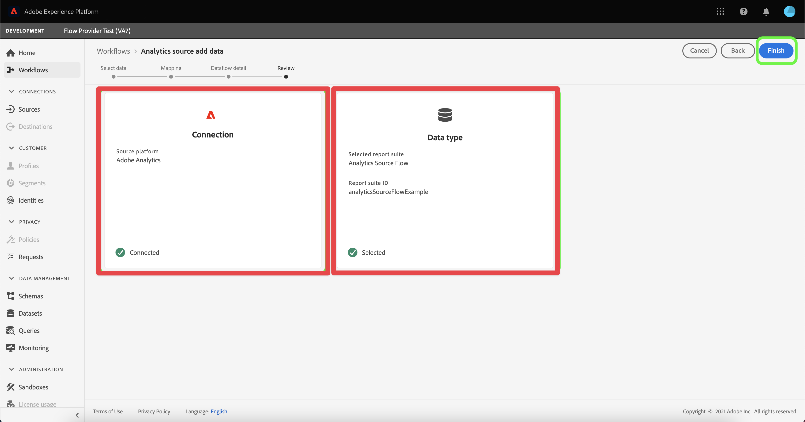
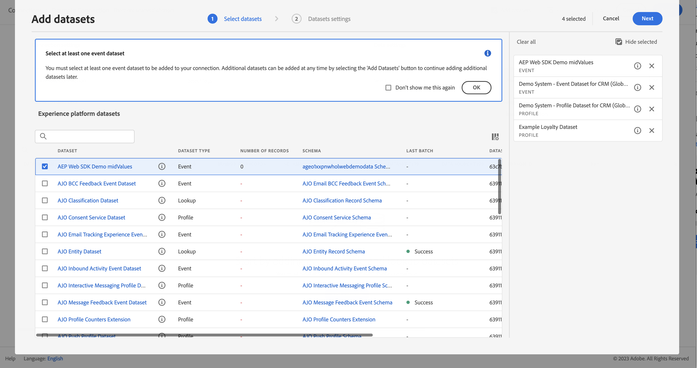
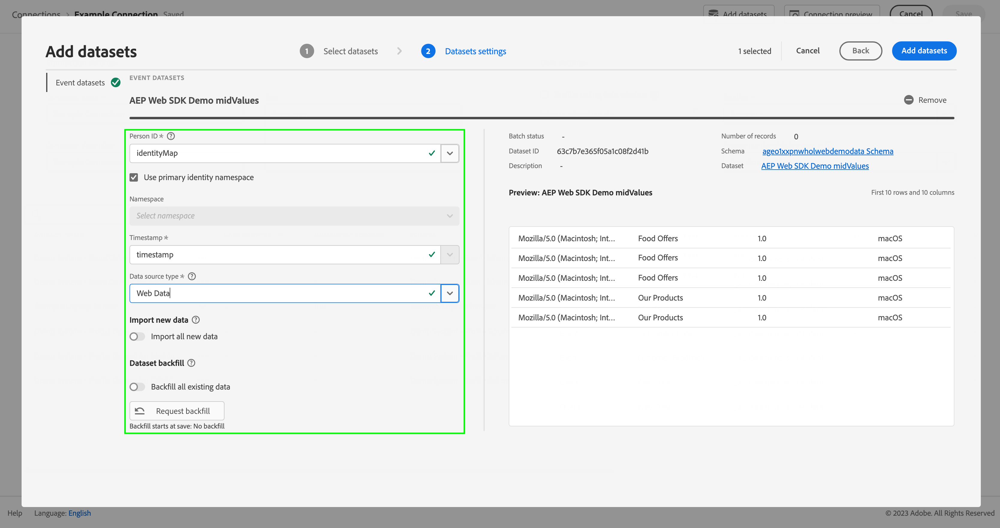
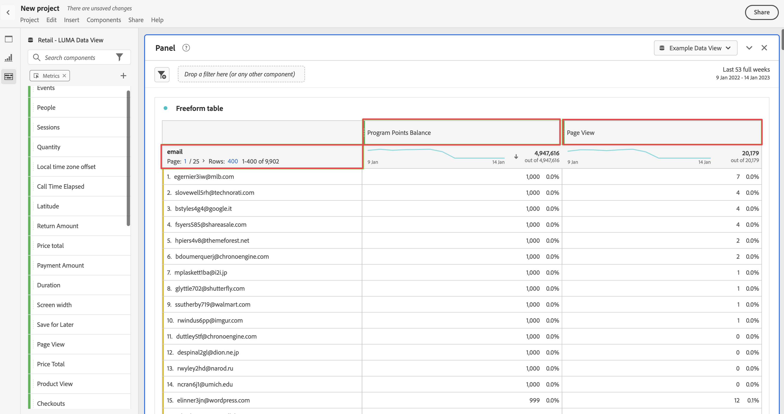

# Adobe Analyticsからのデータの取り込みと活用

このクイックスタートガイドでは、Adobe Analytics が収集したデータを Customer Journey Analytics で使用する方法について説明します。

>[!PREREQUISITES]
>
>Adobe Analytics がライセンスを取得しており、以下に記載された実装方法のいずれかを使用して、1 つ以上の web サイトにデプロイしている。
>
>- [Analytics Edge を使用した Experience Platform の実装](https://experienceleague.adobe.com/docs/analytics/implementation/aep-edge/overview.html?lang=ja)
>
>- [Adobe Analytics 拡張機能を使用した Analytics の実装](https://experienceleague.adobe.com/docs/analytics/implementation/launch/overview.html?lang=ja)
>
>- [JavaScript を使用した Analytics の実装](https://experienceleague.adobe.com/docs/analytics/implementation/js/overview.html?lang=ja)

これには、次の手順を実行する必要があります。

- Adobe Experience Platform で **Adobe Analytics ソースコネクタを設定**&#x200B;します。 ソースコネクタでは、現在のAdobe Analytics データをAdobe Experience Platformのデータセットに取り込みます。

- Customer Journey Analytics で、**接続を設定**&#x200B;します。 接続には、少なくともAdobe Experience Platform データセットを含める必要があります。

- Customer Journey Analytics で&#x200B;**データ表示を設定**&#x200B;し、Analysis Workspace で使用する指標とディメンションを定義します。

- Customer Journey Analytics で&#x200B;**プロジェクトを設定**&#x200B;して、レポートとビジュアライゼーションを作成します。

>[!NOTE]
>
>このクイックスタートガイドでは、Adobe Analytics ソースコネクタを使用してデータを取り込み、そのデータをCustomer Journey Analyticsで使用する方法について簡単に説明します。 参照する際には、追加情報を調べることを強くお勧めします。

## Adobe Analytics ソースコネクタの設定

Adobe Analytics ソースコネクタを使用すると、Adobe Analytics レポートスイートデータを Adobe Experience Platform に取り込むことができます。

Adobe Analytics ソースコネクタを作成するには：

1. Platform UI の左パネルで「**[!UICONTROL ソース]**」をクリックします。

2. [!UICONTROL カテゴリ]のリストから、**[!UICONTROL Adobe アプリケーション]**&#x200B;を選択します。

3. Adobe Analytics タイル内で「**[!UICONTROL 設定]**」または「**[!UICONTROL データを追加]**」を選択します。

   

4. **[!UICONTROL レポートスイート]**&#x200B;を選択します。 レポートスイートのリストから、使用するレポートスイートを選択します。  または、 **[!UICONTROL _検索_]**&#x200B;を使用して、レポートスイートを検索することもできます。

   

   「**[!UICONTROL 次へ]**」を選択します。

5. 「**[!UICONTROL デフォルトのスキーマ]**」を[!UICONTROL ターゲットスキーマ]として選択します。 Adobe Experience Platform は、選択した Adobe Analytics レポートスイートのすべての標準フィールドをマッピングするために、スキーマと対応するデータセットを自動的に作成します。

   デフォルトスキーマが選択された

   「**[!UICONTROL 次へ]**」を選択します。

6. データフローに名前を付け、（オプションで）説明を入力します。

   

   「**[!UICONTROL 次へ]**」を選択します。

7. 接続を確認し、「**[!UICONTROL 終了]**」を選択します。

   

接続が作成されると、データフローが自動的に作成され、レポートスイートのデータセットにAdobe Analytics データが入力されます。 データフローでは、実稼動用サンドボックスの最大 13 か月分の履歴データを取り込みます。 非実稼動用サンドボックスのバックフィルは、3 か月に制限されています。

初回の取り込みが完了すると、Adobe Analytics レポートスイートのデータが Customer Journey Analytics で使用できる状態になります。

詳しくは、[UI での Adobe Analytics ソース接続の作成](https://experienceleague.adobe.com/docs/experience-platform/sources/ui-tutorials/create/adobe-applications/analytics.html?lang=ja)を参照してください。

## 接続の設定

Adobe Experience Platform データを Customer Journey Analytics で使用するには、接続（スキーマ、データセット、ワークフローの設定によって生成されたデータを含む）を作成します。

接続を使用すれば、Adobe Experience Platform のデータセットをワークスペースに統合できます。 これらのデータセットについてレポートを作成するには、まずAdobe Experience PlatformとWorkspaceのデータセット間の接続を確立する必要があります。

接続を作成するには：

1. Customer Journey Analytics UIの上部メニューで、**[!UICONTROL Data management]**&#x200B;から&#x200B;**[!UICONTROL Connections]**&#x200B;を選択します（オプション）。

2. 「**[!UICONTROL 新しい接続を作成]**」を選択します。

3. [!UICONTROL 名称未設定の接続]画面で、次の手順を実行します。

   「[!UICONTROL 接続設定]」で接続に名前を付けて説明します。

   [!UICONTROL データ設定]の[!UICONTROL サンドボックス]リストから適切なサンドボックスを選択し、[!UICONTROL 毎日のイベントの平均数]リストから日次イベントの数を選択します。

   

   「**[!UICONTROL データセットを追加]**」を選択します。

   「[!UICONTROL データセットを追加]」の「[!UICONTROL データセットを選択]」手順で、次の操作を行います。

   - Adobe Analytics ソースコネクタによって自動的に作成されたデータセットと、接続に含める他のデータセットを選択します。

     

   - 「**[!UICONTROL 次へ]**」を選択します。

   「[!UICONTROL データセットを追加]」の「[!UICONTROL データセット設定]」手順で、次の操作を行います。

   - 各データセットに対して、次の手順を行います。

      - Adobe Experience Platform のデータセットスキーマで定義されている使用可能な ID から[!UICONTROL ユーザー ID] を選択します。

      - [!UICONTROL データソースタイプ]リストから正しいデータソースを選択します。 「**[!UICONTROL その他]**」を指定している場合は、データソースの説明を追加します。

      - 必要に応じて&#x200B;**[!UICONTROL すべての新しいデータを読み込み]**&#x200B;および&#x200B;**[!UICONTROL データセットの既存データのバックフィル]**&#x200B;を選択します。

     

   - 「**[!UICONTROL データセットを追加]**」を選択します。

   「**[!UICONTROL 保存]**」を選択します。

接続を作成および管理する方法、およびデータセットを選択して組み合わせる方法について詳しくは、[接続の概要](../connections/overview.md)を参照してください。

## データ表示の設定

データ表示は、Customer Journey Analytics に特有のコンテナで、接続からデータを解釈する方法を決定できます。 Analysis Workspace で使用可能なすべてのディメンションと指標、およびこれらのディメンションと指標からデータを取得する列を指定します。 データ表示は、Analysis Workspace でレポートの準備を行う際に定義します。

データ表示を作成するには：

1. Customer Journey Analytics UIの上部メニューで、**[!UICONTROL データビュー]** （オプションで&#x200B;**[!UICONTROL データ管理]**&#x200B;から）を選択します。

2. 「**[!UICONTROL 新しいデータ表示を作成]**」を選択します。

3. [!UICONTROL 設定]手順で、次の操作を行います。

   [!UICONTROL 接続]リストで接続を選択します。

   接続に名前を付け、（オプションで）説明します。

   

   「**[!UICONTROL 保存して続行]**」を選択します。

4. [!UICONTROL コンポーネント]手順で、次の操作を行います。

   [!UICONTROL 指標]または[!UICONTROL ディメンション]コンポーネントボックスに含めるスキーマフィールドや標準コンポーネントを追加します。

   

   「**[!UICONTROL 保存して続行]**」を選択します。

5. [!UICONTROL 設定]手順で、次の操作を行います。

   

   設定をそのままにし、「**[!UICONTROL 保存して終了]**」を選択します。

データビューの作成と編集方法、データビューで使用できるコンポーネント、セグメントとセッションの設定の使用方法について詳しくは、[&#x200B; データビューの概要](../data-views/data-views.md)を参照してください。

## プロジェクトの設定

Analysis Workspace は、データに基づき、分析をすばやく構築してインサイトを共有できる、柔軟なブラウザーツールです。 ワークスペースプロジェクトでは、データコンポーネント、テーブル、およびビジュアライゼーションを組み合わせて、分析を作成し、組織内の任意のユーザーと共有できます。

プロジェクトを作成するには：

1. Customer Journey Analytics UIで、上部メニューの「**[!UICONTROL プロジェクト]**」を選択します。

2. 左側のナビゲーションの「**[!UICONTROL プロジェクト]**」を選択します。

3. 「**[!UICONTROL プロジェクトを作成]**」を選択します。

   

   「**[!UICONTROL 空のプロジェクト]**」を選択します。

   

4. リストからデータ表示を選択します。

   します。

5. 最初のレポートを作成するには、[!UICONTROL &#x200B; パネル &#x200B;]の[!UICONTROL 自由形式テーブル &#x200B;]にディメンションと指標をドラッグ&amp;ドロップします。 例えば、`Program Points Balance` および `Page View` 指標、`email` をディメンションにドラッグすると、web サイトを訪問し、ロイヤルティポイントを収集するロイヤルティプログラムに参加しているプロファイルの概要をすばやく把握できます。

   

コンポーネント、ビジュアライゼーション、パネルを使用してプロジェクトを作成し、分析を構築する方法について詳しくは、[Analysis Workspace の概要](../analysis-workspace/home.md)を参照してください。

>[!SUCCESS]
>
>すべての手順が完了しました。 まず、Adobe Analytics データソースコネクタを設定し、レポートスイート用にそのコネクタを設定すると、Adobe Analytics データが Adobe Experience Platform に自動的にアップロードされます。 取り込んだAdobe Analytics データやその他のデータを使用するように、Customer Journey Analyticsで接続を定義しました。 データ表示の定義では、使用するディメンションと指標を指定でき、最後に、最初のプロジェクトを作成し、データを視覚化および分析します。

