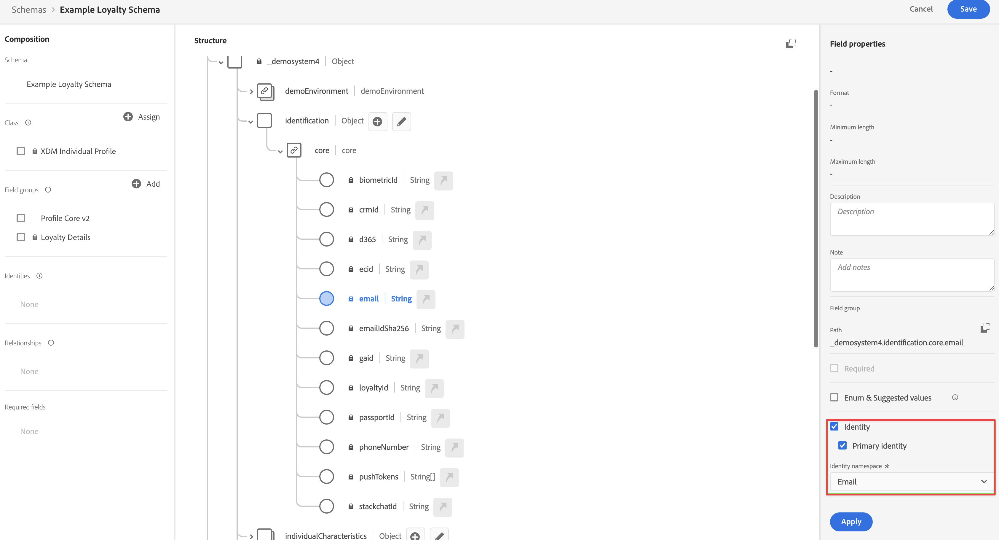

# バッチデータの取り込みと使用

このクイックスタートガイドでは、バッチデータをAdobe Experience Platformに取り込み、そのデータをCustomer Journey Analyticsで使用する方法について説明します。

これをおこなうには、次の操作が必要です。

- **スキーマとデータセットの設定** Adobe Experience Platformで、収集するデータのモデル（スキーマ）と、実際にデータ（データセット）を収集する場所を定義します。

- **ワークフローの使用** を使用すると、バッチデータをAdobe Experience Platformで設定したデータセットに簡単にアップロードできます。

- **接続の設定** Customer Journey Analytics この接続には、少なくともAdobe Experience Platformデータセットを含める必要があります。

- **データビューの設定** (Analysis Workspaceで使用する指標とディメンションを定義する場合 )

- **プロジェクトの設定** ( レポートおよびビジュアライゼーションを作成するためのCustomer Journey Analytics)

>[!NOTE]
>
>これは、バッチデータをAdobe Experience Platformに取り込み、Customer Journey Analyticsで使用する方法を簡単に説明するガイドです。  を参照する際には、追加情報を調べることを強くお勧めします。

## スキーマとデータセットの設定

データをAdobe Experience Platformに取り込むには、まず収集するデータを定義する必要があります。 Adobe Experience Platformに取り込まれるすべてのデータを、標準的な非正規化された構造に準拠させて、ダウンストリームの機能によって認識され、処理されるようにする必要があります。 エクスペリエンスデータモデル (XDM) は、この構造をスキーマの形式で提供する標準フレームワークです。

スキーマを定義したら、1 つ以上のデータセットを使用して、データの収集を保存および管理します。 データセットは、スキーマ（列）とフィールド（行）を含んだデータコレクション（通常はテーブル）のストレージおよび管理用の構成体です。

Adobe Experience Platformに取り込まれるすべてのデータは、データセットとして保持する前に、事前定義済みのスキーマに準拠している必要があります。

### スキーマの設定

このクイックスタートでは、ロイヤリティ ID、ロイヤルティポイント、ロイヤリティステータスなど、一部のロイヤリティデータを収集すると想定しています。
この場合、まず、このデータをモデル化するスキーマを定義する必要があります。

スキーマを設定するには：

1. Adobe Experience Platform UI の左側のレールで、を選択します。 **[!UICONTROL スキーマ]** 範囲 [!UICONTROL データ管理].

2. 選択 **[!UICONTROL スキーマを作成]**. 選択 **[!UICONTROL XDM 個人プロファイル]** を選択します。

   

   >[!INFO]
   >
   >    個々のプロファイルスキーマは、プロファイルのモデル化に使用されます _属性_ （電子メール、ロイヤリティステータス、ロイヤルティポイントなど）。 エクスペリエンスイベントスキーマは、 _動作_ プロファイルの（ページビューなど）を買い物かごに追加できます。


3. 内 [!UICONTROL 名称未設定のスキーマ] 画面：

   1. スキーマの表示名と説明（オプション）を入力します。

      

   2. 選択 **[!UICONTROL +追加]** in [!UICONTROL フィールドグループ].

      

      フィールドグループは、スキーマを簡単に拡張できる、再利用可能なオブジェクトや属性のコレクションです。

   3. 内 [!UICONTROL フィールドグループを追加] ダイアログで、 **[!UICONTROL ロイヤルティの詳細]** フィールドグループを選択します。

      

      「プレビュー」ボタンを選択すると、このフィールドグループに属するフィールドのプレビューを確認できます。

      

      選択 **[!UICONTROL 戻る]** プレビューを閉じます。

   4. 選択 **[!UICONTROL フィールドグループを追加]**.

4. 選択 **[!UICONTROL +]** をクリックします。 [!UICONTROL 構造] パネル。

   

5. 内 [!UICONTROL フィールドプロパティ] パネル、入力 `Identification` 名前として **[!UICONTROL 識別]** を [!UICONTROL 表示名]を選択します。 **[!UICONTROL オブジェクト]** を [!UICONTROL タイプ] を選択し、 **[!UICONTROL プロファイル Core v2]** を [!UICONTROL フィールドグループ].

   

   これにより、スキーマに識別機能が追加されます。 その場合、バッチデータの電子メールアドレスを使用してロイヤルティ情報を識別します。

   選択 **[!UICONTROL 適用]** をクリックして、このオブジェクトをスキーマに追加します。

6. を選択します。 **[!UICONTROL 電子メール]** 先ほど追加した識別オブジェクト内のフィールドを選択し、 **[!UICONTROL ID]** および **[!UICONTROL 電子メール]** から [!UICONTROL ID 名前空間] 内 [!UICONTROL フィールドプロパティ] パネル。

   

   Adobe Experience Platform ID サービスがプロファイルを組み合わせる（ステッチする）ために使用できる ID として電子メールアドレスを指定する場合。

   選択 **[!UICONTROL 適用]**. 電子メール属性にフィンガープリントアイコンが表示されます。

   「**[!UICONTROL 保存]**」を選択します。

7. スキーマのルートレベル（スキーマ名を含む）を選択し、 **[!UICONTROL プロファイル]** スイッチ

   プロファイルのスキーマを有効にするよう求められます。 有効にすると、このスキーマに基づいてデータがデータセットに取り込まれると、そのデータがリアルタイム顧客プロファイルに結合されます。

   詳しくは、 [リアルタイム顧客プロファイルでのスキーマ使用の有効化](https://experienceleague.adobe.com/docs/experience-platform/xdm/tutorials/create-schema-ui.html?lang=en#profile) を参照してください。

   >[!IMPORTANT]
   >
   >    プロファイルで有効にしたスキーマを保存すると、プロファイルで無効にできなくなります。

   

8. 選択 **[!UICONTROL 保存]** スキーマを保存します。

Adobe Experience Platformに取り込むロイヤルティデータをモデル化する最小限のスキーマを作成しました。 このスキーマを使用すると、電子メールアドレスを使用してプロファイルを識別できます。 プロファイルのスキーマを有効にすると、バッチファイルのデータがリアルタイム顧客プロファイルに確実に追加されます。

詳しくは、 [UI でのスキーマの作成と編集](https://experienceleague.adobe.com/docs/experience-platform/xdm/ui/resources/schemas.html?lang=jal) フィールドグループと個々のフィールドをスキーマに追加または削除する方法について詳しくは、を参照してください。

### データセットの設定

スキーマでデータモデルを定義しました。 次に、そのデータを保存および管理するための構成を定義する必要があります。 これは、データセットを通じておこなわれます。

データセットを設定するには：

1. Adobe Experience Platform UI の左側のレールで、を選択します。 **[!UICONTROL データセット]** 範囲 [!UICONTROL データ管理].

2. 選択 **[!UICONTROL データセットを作成]**.

   

3. 「**[!UICONTROL スキーマからデータセットを作成]**」をクリックします。

   

4. 作成したスキーマを選択し、「 」を選択します。 **[!UICONTROL 次へ]**.

5. データセットに名前を付け、（オプション）説明を入力します。

   

6. 選択 **[!UICONTROL 完了]**.

7. を選択します。 **[!UICONTROL プロファイル]** スイッチ

   プロファイルのデータセットを有効にするよう求められます。 有効にすると、データセットは、取り込んだデータを使用して、リアルタイムの顧客プロファイルを強化します。

   >[!IMPORTANT]
   >
   >    プロファイルのデータセットを有効にできるのは、データセットが準拠するスキーマがプロファイルに対しても有効になっている場合のみです。

   

詳しくは、 [データセット UI ガイド](https://experienceleague.adobe.com/docs/experience-platform/catalog/datasets/user-guide.html?lang=ja) データセットの表示、プレビュー、作成、削除の方法について詳しくは、こちらを参照してください。 リアルタイム顧客プロファイルのデータセットを有効にする方法について説明します。


## ワークフローの使用

ワークフロー機能を使用して、バッチデータをAdobe Experience Platformにアップロードします。 使用しているバッチファイルの例は、次の内容を含む CSV ファイルです。

```
email,loyaltyID,points,status
abrocking0@blog.com,793406,82.16,Silver
wnichol1@ycombinator.com,988654,40.39,Gold
paisbett2@slideshare.net,444897,91.25,Bronze
bdiamant3@xinhuanet.com,239658,57.87,Gold
ppales4@nsw.gov.au,365384,82.71,Silver
...
```

ワークフローを使用するには：

1. Platform UI で、「 **[!UICONTROL ワークフロー]** をクリックします。

2. 選択 **[!UICONTROL CSV を XDM スキーマにマッピング]**. 選択 **[!UICONTROL 起動]**.

   

3. 内 [!UICONTROL CSV を XDM スキーマにマッピング] 画面、 [!UICONTROL データフローの詳細] 手順：

   選択 **[!UICONTROL 既存のデータセット]**&#x200B;を選択し、データセットリストからを選択して、 [!UICONTROL データフロー名].

   

   「**[!UICONTROL 次へ]**」を選択します。

4. 内 [!UICONTROL データを選択] 手順：

   ドラッグ&amp;ドロップまたは選択 **[!UICONTROL ファイルを選択]** をクリックして、ロイヤルティデータを含む CSV ファイルを選択します。 ロイヤルティデータのプレビューが表示されます。

   

   「**[!UICONTROL 次へ]**」を選択します。

5. 内 [!UICONTROL マッピング] 手順：

   CSV ファイルのデータをスキーマのデータにマッピングします。 AI を使用して、ワークフロー機能はバッチデータフィールドをスキーマフィールドに自動的にマッピングしようとします。

   

   以下を使用できます。 **[!UICONTROL データをプレビュー]** をクリックして、マッピングされたデータのプレビューを確認します。

   

6. 選択 **[!UICONTROL 完了]** をクリックして、バッチデータの Adobe Experience Platform への取り込みを開始します。

詳しくは、 [CSV ファイルの既存の XDM スキーマへのマッピング](https://experienceleague.adobe.com/docs/experience-platform/ingestion/tutorials/map-csv/existing-schema.html) 受信データと XDM スキーマとの互換性がない場合のデータのマッピング方法に関する詳細は、マッピングテンプレートを使用し、計算フィールドを使用して、バッチデータがスキーマで期待される内容に適合するようにします。


## 接続の設定

Adobe Experience PlatformデータをCustomer Journey Analyticsで使用するには、スキーマ、データセット、ワークフローの設定によるデータを含む接続を作成します。

接続を使用すれば、Adobe Experience Platform のデータセットをワークスペースに統合できます。これらのデータセットに関するレポートを作成するには、まずAdobe Experience Platformと Workspace のデータセット間で接続を確立する必要があります。

接続を作成するには：

1. Customer Journey AnalyticsUI で、 **[!UICONTROL 接続]** 」をクリックします。

2. 選択 **[!UICONTROL 新しい接続を作成]**.

3. 内 [!UICONTROL 無題の接続] 画面：

   で接続に名前を付け、説明します。 [!UICONTROL 接続設定].

   次の中から適切なサンドボックスを選択します。 [!UICONTROL サンドボックス] リスト [!UICONTROL データ設定] 「 」で、「 [!UICONTROL 毎日のイベントの平均数] リスト。

   

   選択 **[!UICONTROL データセットを追加]**.

   内 [!UICONTROL データセットを選択] 足を踏み入れる [!UICONTROL データセットを追加]:

   - 前に作成したデータセット (`Example Loyalty Dataset`) や、接続に含める他のデータセットに関連付けます。

      

   - 「**[!UICONTROL 次へ]**」を選択します。
   内 [!UICONTROL データセット設定] 足を踏み入れる [!UICONTROL データセットを追加]:

   - 各データセットに対して、次の操作を実行します。

      - を選択します。 [!UICONTROL 人物 ID] Adobe Experience Platformのデータセットスキーマで定義された使用可能な id から。

      - 次の中から正しいデータソースを選択します： [!UICONTROL データソースタイプ] リスト。 次を指定した場合： **[!UICONTROL その他]** 次に、データソースの説明を追加します。

      - 設定 **[!UICONTROL すべての新しいデータをインポート]** および **[!UICONTROL データセットの既存データのバックフィル]** 好みに応じて。

      

   - 選択 **[!UICONTROL データセットを追加]**.
   「**[!UICONTROL 保存]**」を選択します。

詳しくは、 [接続の概要](../connections/overview.md) 接続を作成および管理する方法、およびデータセットを選択して組み合わせる方法に関する詳細。

## データビューの設定

データビューは、Customer Journey Analytics に特有のコンテナで、接続からデータを解釈する方法を決定できます。Analysis Workspace で使用可能なすべてのディメンションと指標、およびこれらのディメンションと指標からデータを取得する列を指定します。データビューは、Analysis Workspace でのレポート作成の準備の際に定義します。

データビューを作成するには：

1. Customer Journey AnalyticsUI で、 **[!UICONTROL データビュー]** 」をクリックします。

2. 選択 **[!UICONTROL 新しいデータビューを作成]**.

3. 内 [!UICONTROL 設定] 手順：

   接続を [!UICONTROL 接続] リスト。

   接続に名前を付け、（オプションで）説明します。

   

   選択 **[!UICONTROL 保存して続行]**.

4. 内 [!UICONTROL コンポーネント] 手順：

   に含めるスキーマフィールドや標準コンポーネントを追加します。 [!UICONTROL 指標] または [!UICONTROL Dimension] コンポーネントボックス

   

   選択 **[!UICONTROL 保存して続行]**.

5. 内 [!UICONTROL 設定] 手順：

   

   設定をそのままにし、「 」を選択します。 **[!UICONTROL 保存して終了]**.

詳しくは、 [データビューの概要](../data-views/data-views.md) データビューの作成および編集方法、データビューで使用できるコンポーネント、フィルターおよびセッションの設定の使用方法に関する詳細。


## プロジェクトの設定

Analysis Workspaceは、データに基づいて分析をすばやく構築し、インサイトを共有できる、柔軟なブラウザーツールです。 Workspace プロジェクトを使用して、データのコンポーネント、テーブルおよびビジュアライゼーションを組み合わせ、分析を作成し、組織内の任意のユーザーと共有します。

プロジェクトを作成するには：

1. Customer Journey AnalyticsUI で、 **[!UICONTROL プロジェクト]** 」をクリックします。

2. 選択 **[!UICONTROL プロジェクト]** をクリックします。

3. 選択 **[!UICONTROL プロジェクトを作成]**.

   

   選択 **[!UICONTROL 空のプロジェクト]**.

   

4. リストからデータビューを選択します。

   .

5. ディメンションと指標のドラッグ&amp;ドロップを [!UICONTROL フリーフォームテーブル] 内 [!UICONTROL パネル] をクリックして最初のレポートを作成します。 例えば、 `Program Points Balance` および `Page View` 指標として `email` をディメンションとして使用すると、Web サイトを訪問したプロファイルの概要をすばやく把握し、ロイヤルティポイントを収集するロイヤルティプログラムの一部になります。

   

詳しくは、 [Analysis Workspaceの概要](../analysis-workspace/home.md) プロジェクトを作成し、コンポーネント、ビジュアライゼーション、パネルを使用して分析を構築する方法に関する詳細。

>[!SUCCESS]
>
>すべての手順が完了しました。 収集するロイヤルティデータ（スキーマ）と、Adobe Experience Platform内のどこにそのデータセットを保存するか（データセット）を定義することから、まず、ロイヤルティデータをデータセットにバッチアップロードするワークフローを設定しました。 取り込んだロイヤルティデータと他のCustomer Journey Analyticsを利用するために接続を定義しました。 データビュー定義では、使用するディメンションと指標を指定でき、最後に、最初のプロジェクトを作成し、データを視覚化および分析します。
