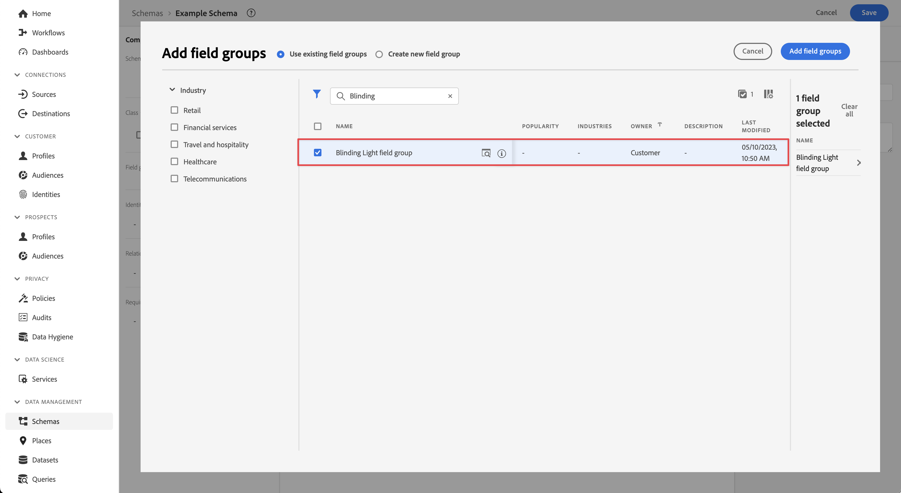
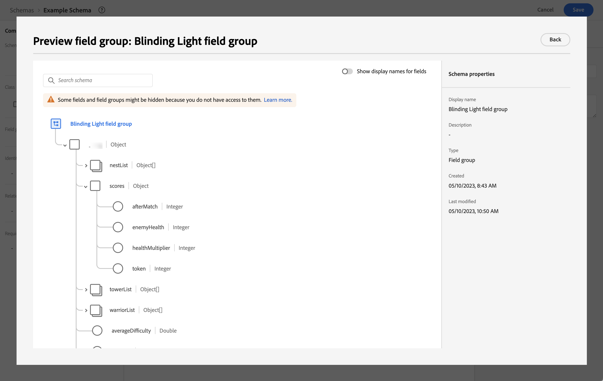
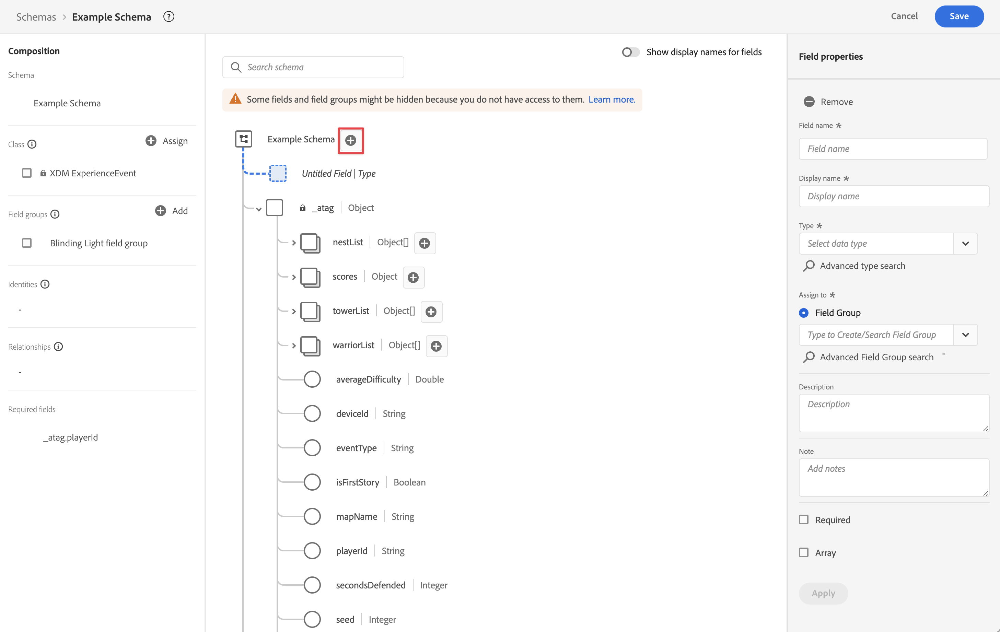
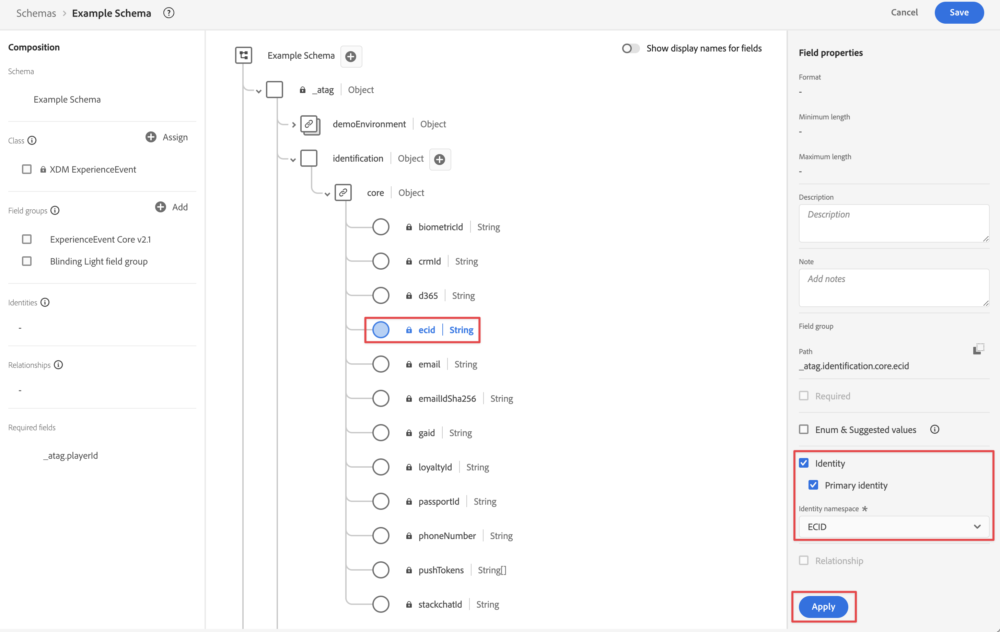
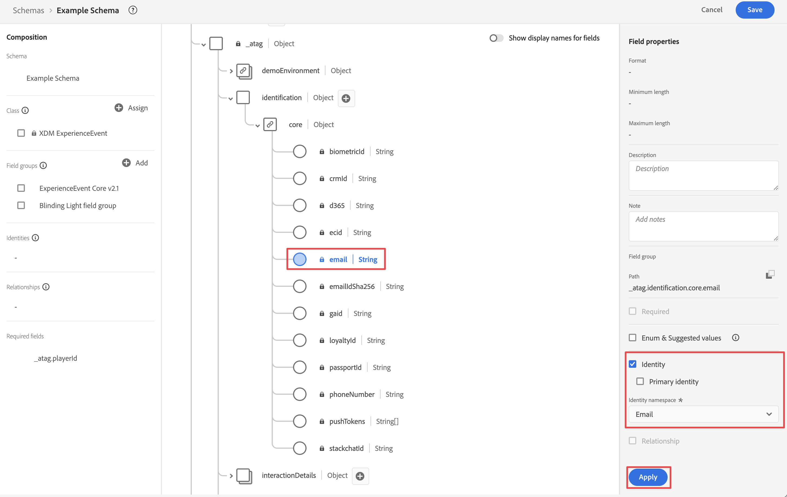

# Edge Network Server APIを介したデータの取り込み

このクイックスタートガイドでは、Adobe Experience Platform Edge Network Server APIとEdge Networkを使用して、IoT デバイス、セットトップボックス、ゲーム機、デスクトップアプリケーションなどのデバイスからAdobe Experience Platformにトラッキングデータを直接取り込む方法について説明します。 そのデータをCustomer Journey Analyticsで使用し。

これを実現するには、次の操作を実行する必要があります。

- Adobe Experience Platform で&#x200B;**スキーマとデータセットを設定**&#x200B;し、収集するデータのモデル（スキーマ）と、実際にデータ（データセット）を収集する場所を定義します。

- **データストリームの設定**：収集したデータを Adobe Experience Platform で設定したデータセットにルーティングするように Adobe Experience Platform Edge Network を設定します。

- **サーバーAPI**&#x200B;を使用して、デスクトップ、ゲーム コンソール、IoT デバイス、またはセットトップボックスで実行されているアプリケーションまたはゲームから直接データストリームにデータを送信します。

- **デプロイと検証**&#x200B;を行います。 開発作業を繰り返し実行し、すべての検証が完了したら、本番環境で公開できます。

- Customer Journey Analytics で、**接続を設定**&#x200B;します。 この接続には、（少なくとも）Adobe Experience Platform データセットを含める必要があります。

- Customer Journey Analytics で&#x200B;**データ表示を設定**&#x200B;し、Analysis Workspace で使用する指標とディメンションを定義します。

- Customer Journey Analytics で&#x200B;**プロジェクトを設定**&#x200B;して、レポートとビジュアライゼーションを作成します。

>[!NOTE]
>
>このクイックスタートガイドでは、IoT デバイス、セットトップボックス、ゲーム機、デスクトップで動作するアプリケーションやゲームから収集したデータをAdobe Experience Platformに取り込み、Customer Journey Analyticsで使用する方法について簡単に説明します。 参照する際には、追加情報を調べることを強くお勧めします。


## スキーマとデータセットの設定

Adobe Experience Platformにデータを取り込むには、まず、収集するデータを定義する必要があります。 ダウンストリームの機能で認識し、処理するには、Adobe Experience Platform に取り込まれるすべてのデータが、標準的な非正規化された構造に準拠する必要があります。 Experience Data Model （XDM）は、スキーマの形式で構造を提供する標準フレームワークです。

スキーマを定義したら、1 つ以上のデータセットを使用して、データの収集を保存および管理します。 データセットは、スキーマ（列）とフィールド（行）を含むデータのコレクション（通常はテーブル）のストレージおよび管理構造です。

Adobe Experience Platform に取り込まれるすべてのデータは、データセットとして保持する前に、事前定義済みのスキーマに準拠している必要があります。

### スキーマの設定

コンソールでゲームをプレイしているプロファイルから、識別、スコア、進行状況などの最小限のデータを追跡する必要があります。
まず、このデータをモデル化するスキーマを定義する必要があります。

スキーマを設定するには：

1. Adobe Experience Platform UI の左パネルの「[!UICONTROL データ管理]」で、「**[!UICONTROL スキーマ]**」を選択します。

1. 「**[!UICONTROL スキーマを作成]**」を選択します。
.
1. スキーマを作成ウィザードの「クラスを選択」ステップで、次の操作を行います。

   1. 「**[!UICONTROL エクスペリエンスイベント]**」を選択します。

      

      >[!INFO]
      >
      >    エクスペリエンスイベントスキーマを使用すると、プロファイルの&#x200B;_動作_（シーン名、買い物かごに追加するプッシュボタンなど）をモデル化できます。 個々のプロファイルスキーマは、プロファイル&#x200B;_属性_（名前、メール、性別など）のモデル化に使用されます。

   1. 「**[!UICONTROL 次へ]**」を選択します。


1. [!UICONTROL スキーマを作成]ウィザードの[!UICONTROL 名前とレビューの手順]で、次の操作を行います。

   1. スキーマの&#x200B;**[!UICONTROL スキーマ表示名]**&#x200B;と&#x200B;**[!UICONTROL 説明]**（オプション）を入力します。

      

   1. 「**[!UICONTROL 完了]**」を選択します。

1. 「スキーマの例」の「構造」タブで、次の操作を行います。

   1. 「[!UICONTROL フィールドグループ]」で「**[!UICONTROL + 追加]**」を選択します。

      

      フィールドグループは、スキーマを簡単に拡張できる、再利用可能なオブジェクトと属性のコレクションです。

   1. [!UICONTROL &#x200B; フィールドグループを追加] ダイアログで、リストから&#x200B;**[!UICONTROL ブラインドライト]** フィールドグループを選択します。 このフィールドグループは、コンソールで「Blinding Light」というタイトルの架空のゲームをプレイしているユーザーの進捗状況を追跡するために作成されました。

      

      「プレビュー」ボタンを選択すると、このフィールドグループに属するフィールド（`scores > afterMatch` など）のプレビューを表示できます。

      

      「**[!UICONTROL 戻る]**」を選択してプレビューを閉じます。

   1. 「**[!UICONTROL フィールドグループを追加]**」を選択します。

1. スキーマ名の横にある&#x200B;**[!UICONTROL +]**&#x200B;を選択します。

   

1. [!UICONTROL &#x200B; フィールドプロパティ &#x200B;] パネルで、`identification`を[!UICONTROL &#x200B; フィールド名]として、**[!UICONTROL 識別]**&#x200B;を[!UICONTROL 表示名]として入力し、**[!UICONTROL オブジェクト]**&#x200B;を[!UICONTROL &#x200B; タイプ &#x200B;]として選択し、**[!UICONTROL ExperienceEvent Core v2.1]**&#x200B;を[!UICONTROL &#x200B; フィールドグループ &#x200B;]として選択します。

   >[!NOTE]
   >
   >このフィールドグループが使用できない場合は、ID フィールドを含む別のフィールドグループを検索します。 または、フィールドグループに[新しいフィールドグループを作成](https://experienceleague.adobe.com/docs/experience-platform/xdm/ui/resources/field-groups.html?lang=ja)し、（`ecid`、`crmId` など）[新しい ID フィールドを追加](https://experienceleague.adobe.com/docs/experience-platform/xdm/ui/fields/identity.html?lang=ja#define-a-identity-field)して、この新しいフィールドグループを選択します。

   

   ID オブジェクトは、スキーマに ID 機能を追加します。 この場合、ゲームをプレイしているプロフィールを、ゲーム機へのログインに使用するExperience Cloud IDとメールアドレスを使用して特定する必要があります。 個人の識別を追跡するために使用できる他の多くの属性があります。

   「**[!UICONTROL 適用]**」を選択して、このオブジェクトをスキーマに追加します。

1. 先ほど追加した ID オブジェクトで「**[!UICONTROL ecid]**」フィールドをクリックし、右パネルの [!UICONTROL ID 名前空間]リストから **[!UICONTROL ID]**、**[!UICONTROL プライマリ ID]** および **[!UICONTROL ECID]** を選択します。

   

   Experience Cloud ID を、Adobe Experience Platform Identity Service が同じ ECID を持つプロファイルの動作を組み合わせる（ステッチする）ために使用するプライマリ ID として指定します。

   「**[!UICONTROL 適用]**」を選択します。 ecid 属性にフィンガープリントアイコンが表示されます。

1. 先ほど追加した ID オブジェクトで「**[!UICONTROL メール]**」フィールドをクリックし、[!UICONTROL フィールドプロパティ]パネルの[!UICONTROL ID 名前空間]リストから **[!UICONTROL ID]** と&#x200B;**[!UICONTROL メール]**&#x200B;を選択します。

   

   メールアドレスを、Adobe Experience Platform Identity Service がプロファイルの動作を組み合わせる（ステッチする）ために使用するもう一つの ID として指定します。

   「**[!UICONTROL 適用]**」を選択します。 メール属性にフィンガープリントアイコンが表示されます。

   「**[!UICONTROL 保存]**」を選択します。

1. スキーマの名前を表示しているスキーマのルート要素を選択してから、**[!UICONTROL プロファイル]**&#x200B;スイッチをクリックします。

   プロファイルのスキーマを有効にするよう求められます。 有効にすると、このスキーマに基づくデータセットにデータが取り込まれたときに、そのデータをリアルタイム顧客プロファイルと結合します。

   詳しくは、[リアルタイム顧客プロファイルで使用するスキーマを有効にする](https://experienceleague.adobe.com/docs/experience-platform/xdm/tutorials/create-schema-ui.html?lang=ja#profile)を参照してください。

   >[!IMPORTANT]
   >
   >    プロファイルで有効にしたスキーマを保存すると、そのスキーマはプロファイルで無効にできなくなります。

   

1. 「**[!UICONTROL 保存]**」を選択してスキーマを保存します。

ゲームから取得できるデータをモデル化する最小限のスキーマを作成しました。 このスキーマを使用することで、Experience Cloud ID とメールアドレスを使用してプロファイルを識別できます。 プロファイルのスキーマを有効にすると、コンソールゲームからキャプチャしたデータがリアルタイム顧客プロファイルに追加されます。

ビヘイビアーデータの横に、コンソールからプロファイル属性データを取り込むこともできます（コンソールにサインインしているプロファイルの詳細など）。

プロファイルデータをキャプチャするには、次のことをおこないます。

- XDM Individual Profile クラスに基づいてスキーマを作成します。

- Profile Core v2 フィールドグループをスキーマに追加します。

- Profile Core v2 フィールドグループに基づいて ID オブジェクトを追加します。

- Experience Cloud ID をプライマリ識別子として定義し、メールを識別子として定義します。

- プロファイルでスキーマを有効にする

フィールドグループと個々のフィールドをスキーマに追加、またはスキーマから削除する方法について詳しくは、[UI でのスキーマの作成と編集](https://experienceleague.adobe.com/docs/experience-platform/xdm/ui/resources/schemas.html?lang=ja)を参照してください。

### データセットの設定

スキーマを使用して、データモデルを定義しました。 データセットを使用して、そのデータを保存および管理するための構造を定義する必要があります。

データセットを設定するには：

1. Adobe Experience Platform UI の左パネルの「[!UICONTROL データ管理]」で、「**[!UICONTROL データセット]**」を選択します。

2. 「**[!UICONTROL データセットを作成]**」を選択します。

   

3. 「**[!UICONTROL スキーマからデータセットを作成]**」をクリックします。

   

4. 作成したスキーマを選択し、「**[!UICONTROL 次へ]**」を選択します。

5. データセットに名前を付け、（オプション）説明を入力します。

   

6. 「**[!UICONTROL 完了]**」を選択します。

7. 「**[!UICONTROL プロファイル]**」スイッチを選択します。

   プロファイルのデータセットを有効にするよう求められます。 有効にすると、データセットは、取り込んだデータを使用してリアルタイム顧客プロファイルを強化します。

   >[!IMPORTANT]
   >
   >    プロファイルのデータセットを有効にできるのは、データセットが準拠するスキーマがプロファイルに対しても有効になっている場合のみです。

   

データセットの表示、プレビュー、作成、削除の方法について詳しくは、[データセット UI ガイド](https://experienceleague.adobe.com/docs/experience-platform/catalog/datasets/user-guide.html?lang=ja)を参照してください。 リアルタイム顧客プロファイルのデータセットを有効にする方法について説明します。

## データストリームの設定

データストリームは、Adobe Experience Platform WebおよびMobile SDKとAdobe Experience Platform Edge Network Server APIを実装する際のサーバーサイド設定を表します。 Adobe Experience Platform SDKとEdge Network Server APIを使用してデータを収集すると、データはAdobe Experience Platform Edge Networkに送信されます。 これは、データの転送先となるサービスを決定するデータストリームです。

設定では、ゲームから収集したデータをAdobe Experience Platformのデータセットに送信する必要があります。

データストリームを設定するには：

1. Adobe Experience Platform UI の左パネルで、「[!UICONTROL データ収集]」から「**[!UICONTROL データストリーム]**」を選択します。

2. **[!UICONTROL 新しいデータストリーム]**&#x200B;を選択します。

3. データストリームに名前を付けて説明します。 [!UICONTROL イベントスキーマ]リストからスキーマを選択します。

   

4. 「**[!UICONTROL 保存]**」を選択します。

5. 「**[!UICONTROL サービスを追加]**」を選択します。

6. [!UICONTROL サービスを追加画面]で、次の操作を行います。

   1. [!UICONTROL サービス]リストから&#x200B;**[!UICONTROL Adobe Experience Platform]** を選択します。

   2. 「**[!UICONTROL 有効]**」が選択されていることを確認します。

   3. [!UICONTROL イベントデータセット]リストからお使いのデータセットを選択します。

      

   4. その他の設定はそのままにし、「**[!UICONTROL 保存]**」を選択してデータストリームを保存します。

これで、ゲームから収集したデータをAdobe Experience Platformのデータセットに転送するようにデータストリームが設定されました。

データストリームの設定方法と機密データの処理方法について詳しくは、[データストリームの概要](https://experienceleague.adobe.com/docs/experience-platform/datastreams/overview.html?lang=ja)を参照してください。

## Edge Network Server APIの使用

ゲームの開発では、必要に応じてAdobe Experience Platform Edge Network Server APIに関連する呼び出しを追加できます。

例えば、プレーヤーのスコアを更新するには、次を使用します。

```
curl -X POST "https://server.adobedc.net/ee/v2/interact?dataStreamId={DATASTREAM_ID}"
-H "Authorization: Bearer {TOKEN}"
-H "x-gw-ims-org-id: {ORG_ID}"
-H "x-api-key: {API_KEY}"
-H "Content-Type: application/json"
-d '{
   "event": {
      "xdm": {
         "identityMap": {
            "Email_LC_SHA256": [
               {
                  "id": "0c7e6a405862e402eb76a70f8a26fc732d07c32931e9fae9ab1582911d2e8a3b",
                  "primary": true
               }
            ]
         },
         "eventType": "game.scoreUpdate",
         "{sandbox}": {
            "scores": {
               "afterMatch": 132391",
            }
         },
         "timestamp": "2021-08-09T14:09:20.859Z"
      }
   }
}'
```

POST リクエストの例では、`{DATASTREAM_ID}`は先ほど設定したデータストリームの例の識別子を指します。 `{sandbox}`は、カスタムブラインドライトフィールドグループへのパスを識別するサンドボックスの一意の名前です。

Edge Network Server APIの使用方法について詳しくは、[&#x200B; インタラクティブデータ収集](https://experienceleague.adobe.com/docs/experience-platform/edge-network-server-api/data-collection/interactive-data-collection.html?lang=ja)および[非インタラクティブデータ収集](https://experienceleague.adobe.com/docs/experience-platform/edge-network-server-api/data-collection/non-interactive-data-collection.html?lang=ja)を参照してください。

## 接続の設定

Adobe Experience Platform データを Customer Journey Analytics で使用するには、接続（スキーマ、データセット、ワークフローの設定によって生成されたデータを含む）を作成します。

接続を使用すれば、Adobe Experience Platform のデータセットをワークスペースに統合できます。 これらのデータセットについてレポートを作成するには、まずAdobe Experience PlatformとWorkspaceのデータセット間の接続を確立する必要があります。

接続を作成するには：

1. Customer Journey Analytics UIの上部メニューで、**[!UICONTROL Data management]**&#x200B;から&#x200B;**[!UICONTROL Connections]**&#x200B;を選択します（オプション）。

2. 「**[!UICONTROL 新しい接続を作成]**」を選択します。

3. [!UICONTROL 名称未設定の接続]画面で、次の手順を実行します。

   「[!UICONTROL 接続設定]」で接続に名前を付けて説明します。

   [!UICONTROL データ設定]の[!UICONTROL サンドボックス]リストから適切なサンドボックスを選択し、[!UICONTROL 毎日のイベントの平均数]リストから日次イベントの数を選択します。

   

   「**[!UICONTROL データセットを追加]**」を選択します。

   「[!UICONTROL データセットを追加]」の「[!UICONTROL データセットを選択]」手順で、次の操作を行います。

   - 以前に作成したデータセットや、接続に含める関連データセットを選択します

   - 「**[!UICONTROL 次へ]**」を選択します。

   「[!UICONTROL データセットを追加]」の「[!UICONTROL データセット設定]」手順で、次の操作を行います。

   - 各データセットに対して、次の手順を行います。

      - Adobe Experience Platform のデータセットスキーマで定義されている使用可能な ID から[!UICONTROL ユーザー ID] を選択します。

      - [!UICONTROL データソースタイプ]リストから正しいデータソースを選択します。 「**[!UICONTROL その他]**」を指定している場合は、データソースの説明を追加します。

      - 必要に応じて&#x200B;**[!UICONTROL すべての新しいデータを読み込み]**&#x200B;および&#x200B;**[!UICONTROL データセットの既存データのバックフィル]**&#x200B;を選択します。

   - 「**[!UICONTROL データセットを追加]**」を選択します。

   「**[!UICONTROL 保存]**」を選択します。

接続を作成および管理する方法、およびデータセットを選択して組み合わせる方法について詳しくは、[接続の概要](../connections/overview.md)を参照してください。

## データ表示の設定

データ表示は、Customer Journey Analytics に特有のコンテナで、接続からデータを解釈する方法を決定できます。 Analysis Workspace で使用可能なすべてのディメンションと指標、およびこれらのディメンションと指標からデータを取得する列を指定します。 データ表示は、Analysis Workspace でレポートの準備を行う際に定義します。

データ表示を作成するには：

1. Customer Journey Analytics UIの上部メニューで、**[!UICONTROL データビュー]** （オプションで&#x200B;**[!UICONTROL データ管理]**&#x200B;から）を選択します。

2. 「**[!UICONTROL 新しいデータ表示を作成]**」を選択します。

3. [!UICONTROL 設定]手順で、次の操作を行います。

   [!UICONTROL 接続]リストで接続を選択します。

   接続に名前を付け、（オプションで）説明します。

   

   「**[!UICONTROL 保存して続行]**」を選択します。

4. [!UICONTROL コンポーネント]手順で、次の操作を行います。

   [!UICONTROL 指標]または[!UICONTROL ディメンション]コンポーネントボックスに含めるスキーマフィールドや標準コンポーネントを追加します。

   「**[!UICONTROL 保存して続行]**」を選択します。

5. [!UICONTROL 設定]手順で、次の操作を行います。

   

   設定をそのままにし、「**[!UICONTROL 保存して終了]**」を選択します。

データビューの作成と編集方法、データビューで使用できるコンポーネント、セグメントとセッションの設定の使用方法について詳しくは、[&#x200B; データビューの概要](../data-views/data-views.md)を参照してください。


## プロジェクトの設定

Analysis Workspace は、データに基づき、分析をすばやく構築してインサイトを共有できる、柔軟なブラウザーツールです。 ワークスペースプロジェクトでは、データコンポーネント、テーブル、およびビジュアライゼーションを組み合わせて、分析を作成し、組織内の任意のユーザーと共有できます。

プロジェクトを作成するには：

1. Customer Journey Analytics UIで、上部メニューの「**[!UICONTROL プロジェクト]**」を選択します。

2. 左側のナビゲーションの「**[!UICONTROL プロジェクト]**」を選択します。

3. 「**[!UICONTROL プロジェクトを作成]**」を選択します。

   

   「**[!UICONTROL 空のプロジェクト]**」を選択します。

   

4. リストからデータ表示を選択します。

   します。

5. 最初のレポートを作成するには、[!UICONTROL &#x200B; パネル &#x200B;]の[!UICONTROL 自由形式テーブル &#x200B;]で、ディメンションと指標のドラッグ&amp;ドロップを開始します。

コンポーネント、ビジュアライゼーション、パネルを使用してプロジェクトを作成し、分析を構築する方法について詳しくは、[Analysis Workspace の概要](../analysis-workspace/home.md)を参照してください。

>[!SUCCESS]
>
>すべての手順が完了しました。 まず、収集するデータ（スキーマ）と、Adobe Experience Platformでのデータの保存場所（データセット）を定義します。 Edge Networkでデータストリームを設定して、そのデータセットにデータを確実に転送できるようにします。 そして、Edge Network Server APIを使用して、そのデータをデータストリームに送信しました。 ゲームデータやその他のデータを使用するために、Customer Journey Analyticsでコネクションを定義しました。 データビュー定義を使用して、使用するディメンションと指標を指定し、ゲームデータを視覚化および分析する最初のプロジェクトを作成しました。
