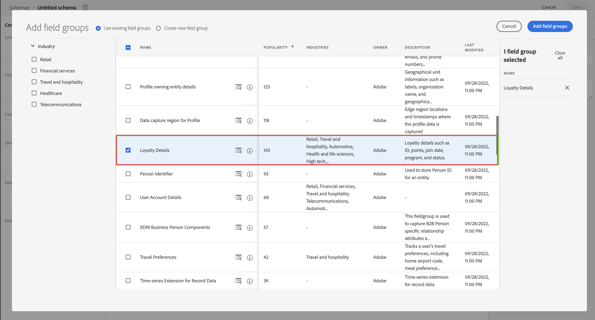

# ソースコネクタを使用してデータを取り込み、使用します。

このクイックスタートガイドでは、ソースコネクタを使用して Adobe Experience Platform にデータを取り込み、そのデータを Customer Journey Analytics で使用する方法について説明します。

これには、次の手順を実行する必要があります。

- Adobe Experience Platform で&#x200B;**スキーマとデータセットを設定**&#x200B;し、収集するデータのモデル（スキーマ）と、実際にデータ（データセット）を収集する場所を定義します。

- Adobe Experience Platform で&#x200B;**ソースコネクタを使用**&#x200B;して、設定したデータセットにデータを取り込みます。

- Customer Journey Analytics で、**接続を設定**&#x200B;します。この接続には、（少なくとも）Adobe Experience Platform データセットを含める必要があります。

- Customer Journey Analytics で&#x200B;**データ表示を設定**&#x200B;し、Analysis Workspace で使用する指標とディメンションを定義します。

- Customer Journey Analytics で&#x200B;**プロジェクトを設定**&#x200B;して、レポートとビジュアライゼーションを作成します。

>[!NOTE]
>
>これは、ソースコネクタを使用して Adobe Experience Platform にデータを取り込み、Customer Journey Analytics で使用する方法を説明する簡単なガイドです。参照する際には、追加情報を調べることを強くお勧めします。

## スキーマとデータセットの設定

データを Adobe Experience Platform に取り込むには、まず収集するデータを定義する必要があります。ダウンストリームの機能で認識し、処理するには、Adobe Experience Platform に取り込まれるすべてのデータが、標準的な非正規化された構造に準拠する必要があります。エクスペリエンスデータモデル（XDM）は、この構造をスキーマの形式で提供する標準フレームワークです。

スキーマを定義したら、1 つ以上のデータセットを使用して、データの収集を保存および管理します。データセットは、スキーマ（列）とフィールド（行）を含んだデータコレクション（通常はテーブル）のストレージおよび管理用の構成体です。

Adobe Experience Platform に取り込まれるすべてのデータは、データセットとして保持する前に、事前定義済みのスキーマに準拠している必要があります。

### スキーマの設定

このクイックスタートでは、ロイヤルティ ID、ロイヤルティポイント、ロイヤルティステータスなど、一部のロイヤルティデータを収集します。
この場合、まず、このデータをモデル化するスキーマを定義する必要があります。

スキーマを設定するには：

1. Adobe Experience Platform UI の左パネルの「[!UICONTROL データ管理]」で、「**[!UICONTROL スキーマ]**」を選択します。

2. 「**[!UICONTROL スキーマを作成]**」を選択します。オプションのリストから、「**[!UICONTROL XDM 個人プロファイル]**」を選択します。

   

   >[!INFO]
   >
   >    個々のプロファイルスキーマは、プロファイル&#x200B;_属性_（名前、メール、性別など）のモデル化に使用されます。エクスペリエンスイベントスキーマは、プロファイルの&#x200B;_動作_（ページ表示や買い物かごに追加など）をモデル化するために使用できます。

3. [!UICONTROL 名称未設定スキーマ]画面で、次の手順を実行します。

   1. スキーマの表示名と説明（オプション）を入力します。

      

   2. 「[!UICONTROL フィールドグループ]」で「**[!UICONTROL + 追加]**」を選択します。

      

      フィールドグループは、スキーマを簡単に拡張できる、再利用可能なオブジェクトと属性のコレクションです。

   3. [!UICONTROL フィールドグループを追加]ダイアログで、リストから「**[!UICONTROL ロイヤルティの詳細]**」フィールドグループを選択します。

      

      「プレビュー」ボタンを選択すると、このフィールドグループに属するフィールドのプレビューを確認できます。

      

      「**[!UICONTROL 戻る]**」を選択してプレビューを閉じます。

   4. 「**[!UICONTROL フィールドグループを追加]**」を選択します。

4. [!UICONTROL 構造]パネルで、スキーマ名の隣にある「**[!UICONTROL +]**」をクリックします。

   

5. 「[!UICONTROL フィールドプロパティ]」パネルで、名前に `Identification`、[!UICONTROL 表示名]に&#x200B;**[!UICONTROL ID]** と入力し、[!UICONTROL タイプ]で&#x200B;**[!UICONTROL オブジェクト]**、[!UICONTROL フィールドグループ]で **[!UICONTROL Profile Core v2]** を選択します。

   

   スキーマに ID 機能を追加します。その場合は、バッチデータのメールアドレスを使用してロイヤルティ情報を識別します。

   「**[!UICONTROL 適用]**」を選択して、このオブジェクトをスキーマに追加します。

6. 先ほど追加した ID オブジェクトで「**[!UICONTROL メール]**」フィールドをクリックし、[!UICONTROL フィールドプロパティ]パネルの[!UICONTROL ID 名前空間]から **[!UICONTROL ID]** と&#x200B;**[!UICONTROL メール]**&#x200B;を選択します。

   

   メールアドレスを、Adobe Experience Platform Identity Service がプロファイルの動作を組み合わせる（ステッチする）ために使用する ID として指定します。

   「**[!UICONTROL 適用]**」を選択します。メール属性にフィンガープリントアイコンが表示されます。

7. （スキーマ名を使用して）スキーマのルートレベルを選択してから、**[!UICONTROL プロファイル]**&#x200B;スイッチをクリックします。

   プロファイルのスキーマを有効にするよう求められます。有効にすると、このスキーマに基づくデータセットにデータが取り込まれたときに、そのデータをリアルタイム顧客プロファイルと結合します。

   詳しくは、[リアルタイム顧客プロファイルで使用するスキーマを有効にする](https://experienceleague.adobe.com/docs/experience-platform/xdm/tutorials/create-schema-ui.html?lang=ja#profile)を参照してください。

   >[!IMPORTANT]
   >
   >    プロファイルで有効にしたスキーマを保存すると、そのスキーマはプロファイルで無効にできなくなります。

   

8. 「**[!UICONTROL 保存]**」を選択してスキーマを保存します。

Adobe Experience Platform に取り込むことができるロイヤルティデータをモデル化する、最小限のスキーマを作成しました。このスキーマを使用すると、メールアドレスを使用してプロファイルを識別できます。プロファイルのスキーマを有効にすると、ストリーミングソースのデータがリアルタイム顧客プロファイルへと確実に追加されます。

フィールドグループと個々のフィールドをスキーマに追加、またはスキーマから削除する方法について詳しくは、[UI でのスキーマの作成と編集](https://experienceleague.adobe.com/docs/experience-platform/xdm/ui/resources/schemas.html?lang=ja)を参照してください。

### データセットの設定

スキーマを使用して、データモデルを定義しました。次に、そのデータを保存および管理するための構成を定義する必要があります。この処理は、データセットを通じて行います。

データセットを設定するには：

1. Adobe Experience Platform UI の左パネルの「[!UICONTROL データ管理]」で、「**[!UICONTROL データセット]**」を選択します。

2. 「**[!UICONTROL データセットを作成]**」を選択します。

   

3. 「**[!UICONTROL スキーマからデータセットを作成]**」をクリックします。

   

4. 作成したスキーマを選択し、「**[!UICONTROL 次へ]**」を選択します。

5. データセットに名前を付け、（オプション）説明を入力します。

   

6. 「**[!UICONTROL 完了]**」を選択します。

7. 「**[!UICONTROL プロファイル]**」スイッチを選択します。

   プロファイルのデータセットを有効にするよう求められます。有効にすると、データセットは、取り込んだデータを使用してリアルタイム顧客プロファイルを強化します。

   >[!IMPORTANT]
   >
   >    プロファイルのデータセットを有効にできるのは、データセットが準拠するスキーマがプロファイルに対しても有効になっている場合のみです。

   

データセットの表示、プレビュー、作成、削除の方法について詳しくは、[データセット UI ガイド](https://experienceleague.adobe.com/docs/experience-platform/catalog/datasets/user-guide.html?lang=ja)を参照してください。リアルタイム顧客プロファイルのデータセットを有効にする方法について説明します。

## ソースコネクタの使用

ロイヤルティデータをどこで受け取るかに応じて、Adobe Experience Platform で使用可能な関連するソースコネクタを選択します。

ソースコネクタを設定するには：

1. Adobe Experience Platform UI の左パネルで、「[!UICONTROL 接続]」から「**[!UICONTROL ソース]**」を選択します。

2. 使用可能なソースコネクタのリストからソースコネクタを選択します。各コネクタは、同様のワークフローに従います。

   - **[!UICONTROL 認証]**：認証の詳細を指定して、データのソースにアクセスします。

   - **[!UICONTROL データを選択]**：取り込むソースデータを選択します。

   - **[!UICONTROL データフローの詳細]**：データフローに関する追加の詳細（名前、使用するデータセットなど）を指定します。

   - **[!UICONTROL マッピング]**：受け取ったソースデータフィールドを、選択したデータセットに関連付けられたスキーマ内の属性にマッピングします。

   - **[!UICONTROL スケジュール]**：可能な場合は、データの取り込みをスケジュールできます。

   - **[!UICONTROL レビュー]**：ソースコネクタの定義のレビューが表示されます。

   各コネクタには、詳細なドキュメントが用意されています。

   このドキュメントにアクセスするには：

   - コネクタタイルで、「[!UICONTROL 設定]」または「[!UICONTROL データを追加]」の隣にある「**[!UICONTROL ...]**」を選択します。

      

   - 「**[!UICONTROL ドキュメントを表示]**」を選択します。

Adobe Analytics ソースコネクタの使用方法について詳しくは、[従来の Adobe Analytics からのデータの取り込みと使用](./analytics.md)を参照してください。

HTTP API ソースコネクタの使用方法について詳しくは、[ストリーミングデータの取り込みと使用](./streaming.md)を参照してください。

ソースコネクタの概要（各コネクタの詳細情報へのリンクを含む）については、[ソースコネクタの概要](https://experienceleague.adobe.com/docs/experience-platform/sources/home.html?lang=ja#terms-and-conditions)を参照してください。

## 接続の設定

Adobe Experience Platform データを Customer Journey Analytics で使用するには、接続（スキーマ、データセット、ワークフローの設定によって生成されたデータを含む）を作成します。

接続を使用すれば、Adobe Experience Platform のデータセットをワークスペースに統合できます。これらのデータセットに関するレポートを作成するには、まず Experience Platform とワークスペースのデータセット間で接続を確立する必要があります。

接続を作成するには：

1. Customer Journey Analytics UI で、「**[!UICONTROL 接続]**」をクリックします。

2. 「**[!UICONTROL 新しい接続を作成]**」を選択します。

3. [!UICONTROL 名称未設定の接続]画面で、次の手順を実行します。

   「[!UICONTROL 接続設定]」で接続に名前を付けて説明します。

   [!UICONTROL データ設定]の[!UICONTROL サンドボックス]リストから適切なサンドボックスを選択し、[!UICONTROL 毎日のイベントの平均数]リストから日次イベントの数を選択します。

   

   「**[!UICONTROL データセットを追加]**」を選択します。

   「[!UICONTROL データセットを追加]」の「[!UICONTROL データセットを選択]」手順で、次の操作を行います。

   - 先ほど作成したデータセット（`Example Loyalty Dataset`）や、接続に含める他のデータセットに関連付けます。

      

   - 「**[!UICONTROL 次へ]**」を選択します。
   「[!UICONTROL データセットを追加]」の「[!UICONTROL データセット設定]」手順で、次の操作を行います。

   - 各データセットに対して、次の手順を行います。

      - Adobe Experience Platform のデータセットスキーマで定義されている使用可能な ID から[!UICONTROL ユーザー ID] を選択します。

      - [!UICONTROL データソースタイプ]リストから正しいデータソースを選択します。「**[!UICONTROL その他]**」を指定している場合は、データソースの説明を追加します。

      - 必要に応じて&#x200B;**[!UICONTROL すべての新しいデータを読み込み]**&#x200B;および&#x200B;**[!UICONTROL データセットの既存データのバックフィル]**&#x200B;を選択します。

      

   - 「**[!UICONTROL データセットを追加]**」を選択します。
   「**[!UICONTROL 保存]**」を選択します。

接続を作成および管理する方法、およびデータセットを選択して組み合わせる方法について詳しくは、[接続の概要](../connections/overview.md)を参照してください。

## データ表示の設定

データ表示は、Customer Journey Analytics に特有のコンテナで、接続からデータを解釈する方法を決定できます。Analysis Workspace で使用可能なすべてのディメンションと指標、およびこれらのディメンションと指標からデータを取得する列を指定します。データ表示は、Analysis Workspace でレポートの準備を行う際に定義します。

データ表示を作成するには：

1. Customer Journey Analytics UI の上部ナビゲーションで、「**[!UICONTROL データ表示]**」をクリックします。

2. 「**[!UICONTROL 新しいデータ表示を作成]**」を選択します。

3. [!UICONTROL 設定]手順で、次の操作を行います。

   [!UICONTROL 接続]リストで接続を選択します。

   接続に名前を付け、（オプションで）説明します。

   

   「**[!UICONTROL 保存して続行]**」を選択します。

4. [!UICONTROL コンポーネント]手順で、次の操作を行います。

   [!UICONTROL 指標]または[!UICONTROL ディメンション]コンポーネントボックスに含めるスキーマフィールドや標準コンポーネントを追加します。

   

   「**[!UICONTROL 保存して続行]**」を選択します。

5. [!UICONTROL 設定]手順で、次の操作を行います。

   

   設定をそのままにし、「**[!UICONTROL 保存して終了]**」を選択します。

データ表示の作成および編集方法、データ表示で使用できるコンポーネント、フィルターおよびセッションの設定の使用方法について詳しくは、[データ表示の概要](../data-views/data-views.md)を参照してください。

## プロジェクトの設定

Analysis Workspace は、データに基づき、分析をすばやく構築してインサイトを共有できる、柔軟なブラウザーツールです。ワークスペースプロジェクトでは、データコンポーネント、テーブル、およびビジュアライゼーションを組み合わせて、分析を作成し、組織内の任意のユーザーと共有できます。

プロジェクトを作成するには：

1. Customer Journey Analytics UI で、「**[!UICONTROL プロジェクト]**」をクリックします。

2. 左側のナビゲーションの「**[!UICONTROL プロジェクト]**」を選択します。

3. 「**[!UICONTROL プロジェクトを作成]**」を選択します。

   

   「**[!UICONTROL 空のプロジェクト]**」を選択します。

   

4. リストからデータ表示を選択します。

   します。

5. [!UICONTROL パネル]の[!UICONTROL フリーフォームテーブル]でディメンションと指標のドラッグ＆ドロップを開始し、最初のレポートを作成します。例えば、`Program Points Balance` および `Page View` 指標、`email` をディメンションにドラッグすると、web サイトを訪問し、ロイヤルティポイントを収集するロイヤルティプログラムに参加しているプロファイルの概要をすばやく把握できます。

   

コンポーネント、ビジュアライゼーション、パネルを使用してプロジェクトを作成し、分析を構築する方法について詳しくは、[Analysis Workspace の概要](../analysis-workspace/home.md)を参照してください。

>[!SUCCESS]
>
>すべての手順が完了しました。どのロイヤルティデータ（スキーマ）を収集するか、Adobe Experience Platform 内のどこにそのデータセットを保存するかを定義することで、まず適切なソースコネクタを設定し、ロイヤルティデータを提供します。取り込んだロイヤルティデータと他のデータを使用するよう、Customer Journey Analytics で接続を定義しました。データ表示の定義では、使用するディメンションと指標を指定でき、最後に、最初のプロジェクトを作成し、データを視覚化および分析します。
