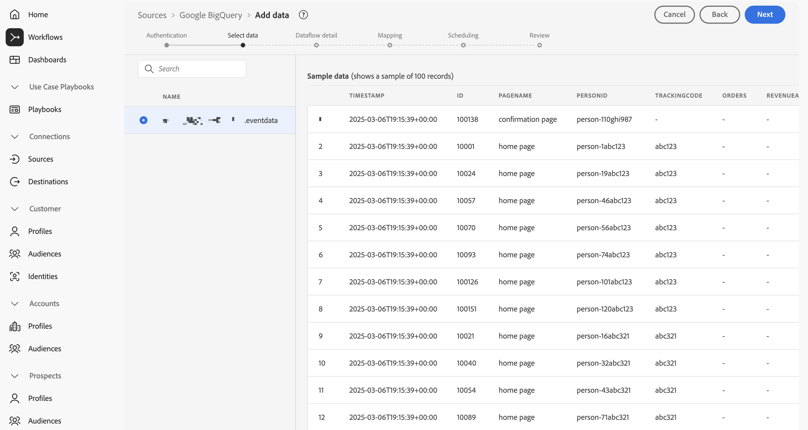
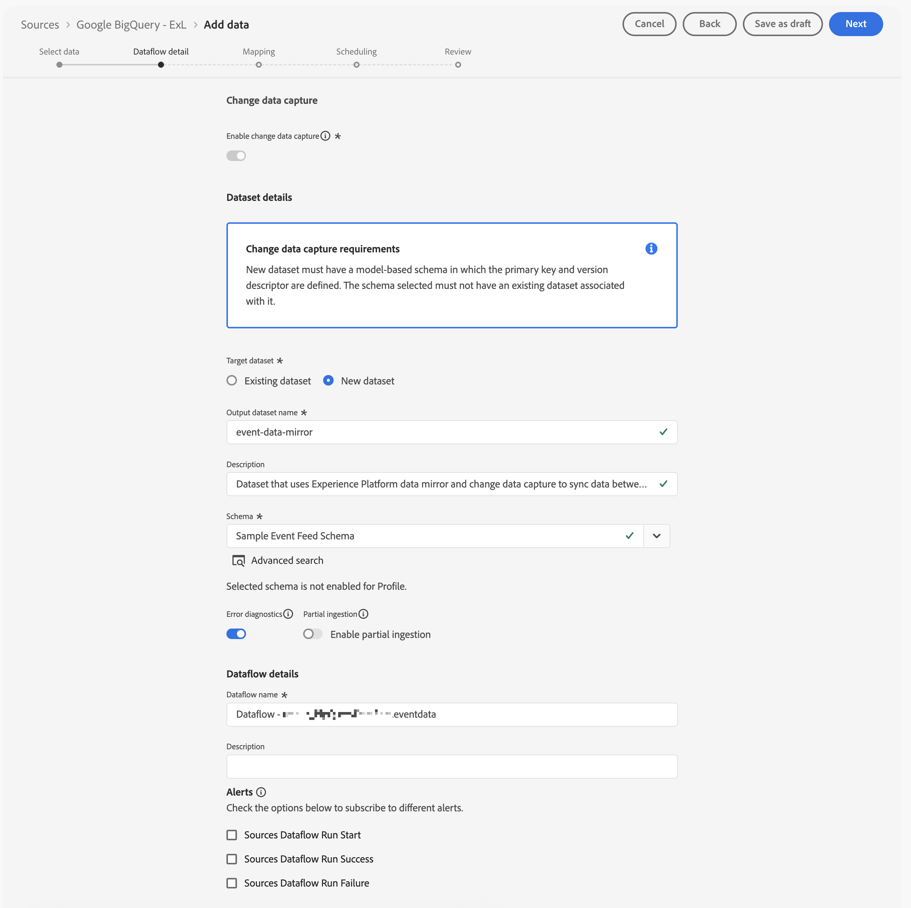

# モデルベースのデータのミラーリングと使用

{{release-limited-testing}}

このクイックスタートガイドでは、[Customer Journey Analytics用Experience Platform Data Mirror](data-mirror.md) を使用して、Adobe Experience Platformの Data Warehouse ネイティブソリューションからモデルベースのデータをミラーリングする方法について説明します。 そして、そのデータをCustomer Journey Analyticsで使用します。

このユースケースを実現するには、次の操作が必要です。

* **Data Warehouse ネイティブソリューションを使用** して、Experience Platformにミラーリングするデータを保存します。 次に、そのデータをCustomer Journey Analyticsで使用して、レポートと分析をおこないます。

* Experience Platformで **スキーマを設定** し、ミラー化するデータのモデル（スキーマ）を定義します。

* Experience Platformで **ソースコネクタを使用** して、ミラーデータをデータセットに取り込みます。

* Customer Journey Analytics で、**接続を設定**&#x200B;します。この接続には、（少なくとも）Experience Platform モデルベースのデータセットを含める必要があります。

* Customer Journey Analytics で&#x200B;**データ表示を設定**&#x200B;し、Analysis Workspace で使用する指標とディメンションを定義します。

* Customer Journey Analytics で&#x200B;**プロジェクトを設定**&#x200B;して、レポートとビジュアライゼーションを作成します。

Customer Journey Analytics用Experience Platform Data Mirrorには、モデルベースのスキーマが必要です。


>[!NOTE]
>
>このクイックスタートガイドは、モデルベースのデータをAdobe Experience Platformにミラーリングし、そのデータをCustomer Journey Analyticsで使用する方法について説明する簡単なガイドです。 参照する際には、追加情報を調べることを強くお勧めします。


## Data Warehouse ネイティブソリューションの使用

このクイックスタートガイドでは、[[!DNL Google BigQuery]](datawarehouse.md#google-bigquery) を Data Warehouse のネイティブソリューションとして使用します。 その他の [ サポートされているソリューション ](datawarehouse.md) は、[[!DNL Snowflake]](datawarehouse.md#snowflake) と [[!DNL Azure Databricks]](datawarehouse.md#azure-databricks) です。

[!DNL Google BigQuery] 内では、次のサンプルデータが、**[!UICONTROL eventdata]** という名前のテーブルに定期的に保存および更新されます。

+++ サンプルイベントデータの詳細

| タイムスタンプ | ID | pagename | personid | trackingcode | 注文件数 | revenueamount |
| :---                      |  ---: | :---              | :---            | :---          |   ---: | :---           |
| 2025-03-06T19:15:39+00:00 | 10001 | ホームページ | person-1abc123 | abc123 |        |                |
| 2025-03-06T19:15:39+00:00 | 10002 | 確認ページ | person-1abc123 |               | 1 | 174.25 |
| 2025-03-06T19:15:39+00:00 | 10003 | ホームページ | person-2def123 | def123 |        |                |
| 2025-03-06T19:15:39+00:00 | 10004 | ホームページ | person-3ghi123 | ghi123 |        |                |
| 2025-03-06T19:15:39+00:00 | 10005 | 確認ページ | person-3ghi123 |               | 1 | 149.25 |
| 2025-03-06T19:15:39+00:00 | 10006 | ホームページ | person-4abc456 | abc456 |        |                |
| 2025-03-06T19:15:39+00:00 | 10007 | ホームページ | person-5def456 | def456 |        |                |
| 2025-03-06T19:15:39+00:00 | 10008 | ホームページ | person-6ghi456 | ghi456 |        |                |
| 2025-03-06T19:15:39+00:00 | 10009 | 確認ページ | person-6ghi456 |               | 1 | 159.25 |
| 2025-03-06T19:15:39+00:00 | 10010 | ホームページ | person-7abc789 | abc789 |        |                |
| 2025-03-06T19:15:39+00:00 | 10011 | ホームページ | person-8def789 | def789 |        |                |
| 2025-03-06T19:15:39+00:00 | 10012 | ホームページ | person-9ghi789 | ghi789 |        |                |
| 2025-03-06T19:15:39+00:00 | 10013 | 確認ページ | person-9ghi789 |               | 1 | 124.25 |
| 2025-03-06T19:15:39+00:00 | 10014 | ホームページ | person-10abc987 | abc987 |        |                |
| 2025-03-06T19:15:39+00:00 | 10015 | ホームページ | person-11def987 | def987 |        |                |
| 2025-03-06T19:15:39+00:00 | 10016 | ホームページ | person-12ghi987 | ghi987 |        |                |
| 2025-03-06T19:15:39+00:00 | 10017 | ホームページ | person-13abc654 | abc654 |        |                |
| 2025-03-06T19:15:39+00:00 | 10018 | ホームページ | person-14def654 | def654 |        |                |
| 2025-03-06T19:15:39+00:00 | 10019 | ホームページ | person-15ghi654 | ghi654 |        |                |
| 2025-03-06T19:15:39+00:00 | 10020 | 確認ページ | person-15ghi654 |               | 1 | 174.25 |

+++

データは、関連付けられたスキーマと共にデータベーステーブルに保存されます。 データベーステーブルを検査するには：

1. Google BigQuery にログインします。
1. **[!UICONTROL BigQuery]**/**[!UICONTROL Studio]** を選択します。
1. プロジェクト、データセット、テーブルを選択します。 「**[!UICONTROL スキーマ]**」タブには、イベントデータのスキーマの概要が表示されます。

   

データを検査するには：

1. **[!UICONTROL クエリ]** を選択します。
1. クエリエディターでサンプルクエリを実行します。`project` はプロジェクトの名前で、`datasets` はデータセットの名前です。

   ```sql
   SELECT * FROM `project.datasets.eventdata` LIMIT 100
   ```

   

Customer Journey AnalyticsのExperience Platform Data Mirrorの場合、データウェアハウスネイティブソリューションのテーブルを変更履歴に対して有効にする必要があります。 テーブルで変更履歴が有効になっていることを確認するには、次の手順に従います。

1. クエリエディターで次の SQL ステートメントを実行して、設定を確認します。ここで、`project` はプロジェクトの名前で、`datasets` はデータセットの名前です。

   ```sql
   SELECT
      table_name,
      MAX(CASE WHEN option_name = 'enable_change_history' THEN option_value END) AS enable_change_history
   FROM `project.datasets.INFORMATION_SCHEMA.TABLE_OPTIONS`
   WHERE table_name = 'eventdata'
   GROUP BY table_name
   ORDER BY table_name;
   ```

1. 結果が **[!UICONTROL TRUE]** でない場合は、次の SQL 文を使用して変更履歴を有効にします。`project` はプロジェクトの名前、`datasets` はデータセットの名前です。

   ```sql
   ALTER TABLE `project.datasets.eventdata` 
   SET OPTIONS (enable_change_history = TRUE);
   ```

Data Warehouse ネイティブソリューションのテーブルのデータが、Customer Journey AnalyticsのExperience Platform Data Mirrorに対応しました。


## スキーマの設定

Experience Platformでデータをミラーリングするには、まずデータのスキーマを定義する必要があります。 Experience Platformでミラーリングし、Customer Journey Analytics用にExperience Platform Data Mirrorを使用するすべてのデータは、モデルベースのスキーマに従う必要があります。

このデータをモデル化するスキーマを定義します。 スキーマを設定するには：

1. Adobe Experience Platform UI の左パネルの「**[!UICONTROL Data Management]**」で、「**[!UICONTROL スキーマ]**」を選択します。

1. 「**[!UICONTROL スキーマを作成]**」を選択します。
1. ドロップダウンメニューから、「**[!UICONTROL モデルベース]**」を選択します。
1. **[!UICONTROL 手動で作成]** または **[!UICONTROL DDL ファイルをアップロード]** のいずれかを選択するオプションを含むポップアップが表示される場合：
   1. 「**[!UICONTROL 手動で作成を選択]**」を選択します。

      

   1. 「**[!UICONTROL 次へ]**」を選択します。
1. **[!UICONTROL スキーマ]**/**[!UICONTROL モデルベースのスキーマを作成]** インターフェイスで、
   1. **[!UICONTROL スキーマ表示名]** を入力します。 例：`Sample Event Feed Schema`。
   1. **[!UICONTROL 説明]** を入力します。 例：`Sample event feed schema for a model-based schema`。
   1. **[!UICONTROL スキーマの動作]** として **[!UICONTROL 時系列]** を選択します。 時系列ベースのデータには **[!UICONTROL 時系列]** を選択し、レコードベースのデータには **[!UICONTROL レコード]** を選択します。 動作は、スキーマの構造と含まれるプロパティを定義します。

      Customer Journey Analytics用Experience Platform Data Mirrorは、ほとんどの場合、時系列データ（イベントデータなど）に使用されます。

      

   1. 「**[!UICONTROL 完了]**」を選択します。

1. **[!UICONTROL スキーマ]**/**[!UICONTROL サンプルイベントフィードスキーマ]** インターフェイスに、モデルベースのスキーマが変更行としての取り込みをサポートしているという警告が表示されます。

   

   変更行としての取り込みは、change data capture （CDC）とも呼ばれます。 CHANGE DATA CAPTURE をサポートするには、スキーマに次の項目が必要です。

   * プライマリキー。
   * バージョン記述子。
   * 時系列データのタイムスタンプ記述子。

1.  の横にある「**[!UICONTROL AddCircle]**」を選択して、スキーマへのフィールドの追加を開始します。 データタイプを含む次のフィールドと追加の属性をスキーマに追加します。

   | フィールド名 | 表示名 | タイプ | 追加の属性 |
   |---|---|---|---|
   | `id` | `Id` | **[!UICONTROL 整数]** |  バージョン記述子 |
   | `orders` | `Orders` | **[!UICONTROL 整数]** | |
   | `pagename` | `Page Name` | **[!UICONTROL 文字列]** | |
   | `personid` | `Person Id` | **[!UICONTROL 文字列]** | プライマリキー <br/>ID<br/>ID 名前空間の CRMID を選択します。 |
   | `revenueamount` | `Revenue Amount` | **[!UICONTROL 倍精度浮動小数点]** | |
   | `timestamp` | `Timestamp` | **[!UICONTROL 日時]** |  タイムスタンプ記述子 |
   | `trackingcode` | `Tracking Code` | **[!UICONTROL 文字列]** | |


   * **[!UICONTROL id]** フィールドは **[!UICONTROL バージョン記述子]** として設定されます。

     

   * **[!UICONTROL personid]** フィールドは、{timestamp **[!UICONTROL と共に]** 4}プライマリキー **[!UICONTROL として設定されます。]**「**[!UICONTROL 複合プライマリキーを作成]**」を選択して、複合キーを作成します。

     

     また、「**[!UICONTROL personid]**」フィールドは「**[!UICONTROL ID]** としても設定され、「**[!UICONTROL ID 名前空間]** として **[!UICONTROL CRMID]** が使用されます。

     

   * **[!UICONTROL timestamp]** フィールドは、{personid **[!UICONTROL フィールドと共に]** 4}プライマリキー **[!UICONTROL として設定されます。]**&#x200B;**[!UICONTROL timestamp]** フィールドは **[!UICONTROL Timestamp 記述子]** としても設定されます。 時系列モデルベースのデータの場合、フィールドを **[!UICONTROL タイムスタンプ記述子]** として定義するだけで済みます。

     


   **[!UICONTROL プライマリキー]**、**[!UICONTROL バージョン記述子]** および **[!UICONTROL タイムスタンプ記述子]** を正しく定義している場合、スキーマ定義の上部にある警告が表示されなくなります。

1. 「**[!UICONTROL 保存]**」を選択してスキーマを保存します。


## ソースコネクタの使用

ソースコネクタを使用して、Data Warehouse ネイティブソリューションをExperience Platformに接続します。

Experience Platform インターフェイスで以下を実行します。

1. **[!UICONTROL ソース]** を選択します。
1. 「**[!UICONTROL Google BigQuery]**」を選択または検索します。
1. **[!UICONTROL データを追加]** を選択します。

データを追加ウィザードは、次の手順に従って、[!DNL Google BigQuery] のテーブルのデータをExperience Platformに接続します。

### 認証

**[!UICONTROL 認証]** 手順で、次を選択します。

* **[!UICONTROL 既存のアカウント]** Google BigQuery のアカウント設定が既にある場合。 [ データを選択 ](#select-data) の手順に進みます。
* Google BigQuery に接続する必要がある場合は **[!UICONTROL 新規アカウント]**。
   1. **[!UICONTROL アカウント名]** および（オプション） **[!UICONTROL 説明]** を指定します。
   1. **[!UICONTROL 認証タイプ]**&#x200B;**[!UICONTROL 基本認証]** または **[!UICONTROL サービス認証]** を選択します。 選択内容に応じて、必要な情報を入力します。
   1. 「**[!UICONTROL ソースに接続]**」を選択します。

      

      接続が確認されました。 **[!UICONTROL Connected]** は、接続が成功したことを示しています。

   1. 「**[!UICONTROL 次へ]**」を選択します。

  [Azure Databricks](https://experienceleague.adobe.com/ja/docs/experience-platform/sources/connectors/databases/databricks) または [Snowflake](https://experienceleague.adobe.com/ja/docs/experience-platform/sources/connectors/databases/snowflake) コネクタを使用する場合の接続および認証方法の詳細については、Experience Platformのドキュメントを参照してください。


### データを選択

**[!UICONTROL データを選択]**&#x200B;手順で、次の操作を行います。

1. テーブルのリストからテーブルを選択します。 例：**[!UICONTROL eventdata]**。

   

   検証用に表示されたデータのサンプルが確認できます。

1. 「**[!UICONTROL 次へ]**」をクリックして続行します。


### データフローの詳細

**[!UICONTROL データフローの詳細]** 手順で、次の操作を行います。

1. **[!UICONTROL Enable change data capture]** を選択します。 **[!UICONTROL データ キャプチャ要件を変更]** 情報ボックスが表示され、詳細情報が表示されます。
1. **[!UICONTROL ターゲットデータセット]** の **[!UICONTROL 新しいデータセット]** を選択して、ミラー化されたデータを含む新しいデータセットを作成します。
1. **[!UICONTROL 出力データセット名]** を入力します。 例：`event-data-mirror`。
1. **[!UICONTROL スキーマ]** ドロップダウンメニューから、前に作成したモデルベースのスキーマを選択します。 例：**[!UICONTROL サンプルイベントフィードスキーマ]**。

   

1. その他の詳細を指定します。
1. 「**[!UICONTROL 次へ]**」を選択します。


### マッピング

**[!UICONTROL マッピング]**&#x200B;手順で、以下を行います。

1. フィールドをマッピングします Google BigQuery のスキーマ（**[!UICONTROL Source data]**）から、Experience Platformで定義したスキーマ内のフィールド（**[!UICONTROL Target フィールド]**）へ。

   

1. すべてのフィールドが正しくマッピングされている場合は、「**[!UICONTROL 次へ]**」を選択して続行します。


### スケジュール設定

**[!UICONTROL スケジュール設定]** 手順で、次の操作を行います。

1. **[!UICONTROL 頻度]** と **[!UICONTROL 間隔]** を指定して、ミラーデータの同期をスケジュールします。
1. スケジュールの **[!UICONTROL 開始時刻]** を指定します。

   

1. 「**[!UICONTROL 次へ]**」をクリックして続行します。


### レビュー

**[!UICONTROL レビュー]** 手順で以下を行います。

1. ソースコネクタの設定を確認します。

   

1. 「**[!UICONTROL 終了]**」を選択します。 設定済みのデータフローに移動します。

   


## 接続の設定

このクイックスタートガイドでは、Experience Platformのミラーデータを使用する新しい接続を作成します。 または、ミラーデータを既存の接続に追加することもできます。

Customer Journey Analytics インターフェイスで以下を実行します。

1. **[!UICONTROL データ管理]** メニューから **[!UICONTROL 接続]** を選択します。
1. 「**[!UICONTROL 新しい接続を作成]**」を選択します。
1. 必要な **[!UICONTROL 接続名]**、**[!UICONTROL サンドボックス]**、**[!UICONTROL 1 日のイベントの平均数]** およびその他のオプションのパラメーターを指定します。
1. 「**[!UICONTROL データセットを追加]**」を選択します。

   1. **[!UICONTROL データセットを追加]** の **[!UICONTROL データセットを選択]** 手順で、次の操作を行います。

      1. ミラーデータを含むデータセットを選択します。 例：**[!UICONTROL event-data-mirror]**。 データセットには **[!UICONTROL データセットタイプ]** として **[!UICONTROL モデル]** があります。

         

      1. 接続に関連する追加のデータセットがあれば追加します。
      1. 「**[!UICONTROL 次へ]**」を選択します。

   1. **[!UICONTROL データセットを追加]** の **[!UICONTROL データセット設定]** 手順で、次の操作を行います。

      **[!UICONTROL event-data-mirror]** モデルベースのデータセットの場合

      1. **[!UICONTROL イベント]** を **[!UICONTROL データセットタイプ]** として選択します。
      1. 「**[!UICONTROL PersonId]**」フィールドを **[!UICONTROL Person ID]** として選択します。
      1. **[!UICONTROL タイムスタンプ]** は、自動的に **[!UICONTROL タイムスタンプ]** として入力されます。
      1. **[!UICONTROL データソースタイプ]** として **[!UICONTROL その他]** を選択します。
      1. `Google BigQuery Event Data` データソースの説明 **[!UICONTROL として]** を入力します。
      1. **[!UICONTROL すべての新しいデータをインポート]**、**[!UICONTROL すべての既存データをバックフィル]** など、その他の詳細を指定します。

         

      オプションで、他のデータセットの詳細を指定します。

   1. 「**[!UICONTROL データセットを追加]**」を選択します。
1. 「**[!UICONTROL 保存]**」を選択します。

[ 接続 ](/help/connections/overview.md) を作成したら、様々な管理タスクを実行できます。 [ データセットの選択と組み合わせ ](/help/connections/combined-dataset.md)、[ 接続データセットのステータスおよびデータ取り込みのステータスの確認 ](/help/connections/manage-connections.md) など。


## データ表示の設定

データ表示を作成するには：

1. Customer Journey Analytics インターフェイスの上部メニューで、必要に応じて **[!UICONTROL データ管理]** から「**[!UICONTROL データビュー]**」を選択します。

2. 「**[!UICONTROL 新しいデータ表示を作成]**」を選択します。

3. **[!UICONTROL 設定]**&#x200B;手順で、次の操作を行います。

   1. **[!UICONTROL 接続]**&#x200B;リストで接続を選択します。

   1. 接続に名前を付け、（オプションで）説明します。

   1. 「**[!UICONTROL 保存して続行]**」を選択します。

4. **[!UICONTROL コンポーネント]**&#x200B;手順で、次の操作を行います。

   1. **[!UICONTROL 指標]** または **[!UICONTROL ディメンション]** コンポーネントボックスに含めるスキーマフィールドや標準コンポーネントを追加します。 ミラーデータを含むデータセットから関連フィールドを必ず追加してください。 これらのフィールドにアクセスするには：

      1. **[!UICONTROL イベントデータセット]** を選択します。
      1. **[!UICONTROL アドホックおよびモデルベースのフィールド]** を選択します。
      1. モデルベースのスキーマから **[!UICONTROL METRICS]** または **[!UICONTROL DIMENSIONS]** にフィールドをドラッグ&amp;ドロップします。

         

   1. 適切なタイプがない、適切な形式でない、または他の理由で変更するフィールドの派生フィールドを定義します。 例えば、**[!UICONTROL 売上高]** の場合は次のようになります。

      1. 「**[!UICONTROL 派生フィールドを作成]**」を選択します。
      1. 派生フィールドエディターで、次の操作を行います。
         1. 以下のように、新しい `Revenue Amount (Numeric)` フィールドを定義します。

            

         1. 「**[!UICONTROL 保存]**」を選択します。
      1. 新しい **[!UICONTROL 収益額（数値）]** 派生フィールドをドラッグして、**[!UICONTROL 指標]** のフィールドをドロップします。

         

   1. 「**[!UICONTROL 保存して続行]**」を選択します。

5. **[!UICONTROL 設定]**&#x200B;手順で、次の操作を行います。

   設定をそのままにし、「**[!UICONTROL 保存して終了]**」を選択します。

データビューの作成および編集方法について詳しくは、[ データビューの概要 ](../data-views/data-views.md) を参照してください。 および、データビューで使用できるコンポーネントと、セグメントとセッションの設定の使用方法について説明します。


## プロジェクトの設定

Analysis Workspaceは、分析をすばやく構築し、データに基づいてインサイトを共有できる、柔軟なブラウザーツールです。 ワークスペースプロジェクトでは、データコンポーネント、テーブル、およびビジュアライゼーションを組み合わせて、分析を作成し、組織内の任意のユーザーと共有できます。

プロジェクトを作成するには：

1. Customer Journey Analyticsのインターフェイスで、上部のメニューの「**[!UICONTROL Workspace]**」を選択します。

2. 左側のナビゲーションの「**[!UICONTROL プロジェクト]**」を選択します。

3. **[!UICONTROL プロジェクトを作成]** を選択します。 ポップアップで、


   1. **[!UICONTROL 空のWorkspace プロジェクト]** を選択します。

   1. 「**[!UICONTROL 作成]**」を選択します。


4. **[!UICONTROL 新規プロジェクト]** ワークスペースで、[ データビュー ](#set-up-a-data-view) が選択されていることを確認します。 そのデータビューは、ミラーデータを含む [ 接続 ](#set-up-a-connection) にリンクしています。

5. 最初のレポートを作成するには、**[!UICONTROL フリーフォーム]** パネルの **[!UICONTROL フリーフォームテーブル]** にディメンションと指標をドラッグ&amp;ドロップします。 例えば、**[!UICONTROL 売上高（数値）]** を **[!UICONTROL _指標をここにドラッグ_]** にドラッグします。 **[!UICONTROL PersonId]** をドラッグして、フィールドを最初の列ヘッダーにドロップします。 必要に応じて、他の調整も行います。

   最終的には、Googleの BigQuery テーブルから取得したミラーデータに基づいて、プロファイルとその売上高の概要を示します。

   

コンポーネント、ビジュアライゼーション、パネルを使用してプロジェクトを作成し、分析を構築する方法について詳しくは、[Analysis Workspace の概要](../analysis-workspace/home.md)を参照してください。

>[!SUCCESS]
>
>すべての手順が完了しました。最初に、データウェアハウスネイティブソリューションから（スキーマを）収集したいミラーデータを定義しました。 そして、そのデータ（データセット）をExperience Platformのどこに保存するか。 適切なソースコネクタを設定し、Experience Platformでミラーデータを提供していること。 ミラーリングされたイベントデータと（オプションで）他のデータを使用するように、Customer Journey Analyticsで接続を定義しました。 データビューの定義では、ミラーデータから使用するディメンションおよび指標を指定できます。 最後に、最初のプロジェクトを作成し、ミラーデータを視覚化して分析します。
