# リレーショナルデータのミラー化と使用

{{release-limited-testing}}

このクイックスタートガイドでは、[Experience Platform Data Mirror for Customer Journey Analytics](data-mirror.md)を使用して、Adobe Experience Platformのデータウェアハウスネイティブソリューションからリレーショナルデータをミラーリングする方法について説明します。 そのデータをCustomer Journey Analyticsで使用する必要があります。

このユースケースを実現するには、次のことが必要です。

* **データウェアハウスネイティブソリューション**&#x200B;を使用して、Experience Platformにミラーリングするデータを保存します。 Customer Journey Analyticsでそのデータを使用してレポートや分析を行います。

* **Experience Platformでスキーマ**&#x200B;を設定して、ミラーするデータのモデル（スキーマ）を定義します。

* **Experience Platformのソースコネクタ**&#x200B;を使用して、ミラーデータをデータセットに取り込みます。

* Customer Journey Analytics で、**接続を設定**&#x200B;します。 この接続には、（少なくとも）Experience Platform リレーショナルデータセットを含める必要があります。

* Customer Journey Analytics で&#x200B;**データ表示を設定**&#x200B;し、Analysis Workspace で使用する指標とディメンションを定義します。

* Customer Journey Analytics で&#x200B;**プロジェクトを設定**&#x200B;して、レポートとビジュアライゼーションを作成します。

Experience Platform Data Mirror Customer Journey Analytics版には、リレーショナルスキーマが必要です。


>[!NOTE]
>
>このクイックスタートガイドは、Adobe Experience Platformでリレーショナルデータをミラーリングし、そのデータをCustomer Journey Analyticsで使用する方法に関する簡略化されたガイドです。 参照する際には、追加情報を調べることを強くお勧めします。

{{relational-model-based}}

## データウェアハウスネイティブソリューションの使用

このクイック スタート ガイドでは、[[!DNL Google BigQuery]](datawarehouse.md#google-bigquery)をデータ ウェアハウス ネイティブ ソリューションとして使用します。 その他[&#x200B; サポートされているソリューション &#x200B;](datawarehouse.md)は[[!DNL Snowflake]](datawarehouse.md#snowflake)と[[!DNL Azure Databricks]](datawarehouse.md#azure-databricks)です。

[!DNL Google BigQuery]内では、次の例のデータが&#x200B;**[!UICONTROL eventdata]**&#x200B;という名前のテーブルに定期的に保存および更新されます。

+++ サンプルイベントデータの詳細

| タイムスタンプ | ID | pagename | personid | トラッキングコード | 注文件数 | 売上高 |
| :---                      |  ---: | :---              | :---            | :---          |   ---: | :---           |
| 2025-03-06T19:15:39+00:00 | 10001 | ホームページ | person-1abc123 | abc123 |        |                |
| 2025-03-06T19:15:39+00:00 | 10002 | 確認ページ | person-1abc123 |               | 1 | 174.25 |
| 2025-03-06T19:15:39+00:00 | 10003 | ホームページ | person-2def123 | def123 |        |                |
| 2025-03-06T19:15:39+00:00 | 10004 | ホームページ | person-3ghi123 | ghi123 |        |                |
| 2025-03-06T19:15:39+00:00 | 10005 | 確認ページ | person-3ghi123 |               | 1 | 149.25 |
| 2025-03-06T19:15:39+00:00 | 10006 | ホームページ | person-4abc456 | abc456 |        |                |
| 2025-03-06T19:15:39+00:00 | 10007 | ホームページ | person-5def456 | def456 |        |                |
| 2025-03-06T19:15:39+00:00 | 10008 | ホームページ | person-6ghi456 | ghi456 |        |                |
| 2025-03-06T19:15:39+00:00 | 10009 | 確認ページ | person-6ghi456 |               | 1 | 159.25 |
| 2025-03-06T19:15:39+00:00 | 10010 | ホームページ | person-7abc789 | abc789 |        |                |
| 2025-03-06T19:15:39+00:00 | 10011 | ホームページ | person-8def789 | def789 |        |                |
| 2025-03-06T19:15:39+00:00 | 10012 | ホームページ | person-9ghi789 | ghi789 |        |                |
| 2025-03-06T19:15:39+00:00 | 10013 | 確認ページ | person-9ghi789 |               | 1 | 124.25 |
| 2025-03-06T19:15:39+00:00 | 10014 | ホームページ | person-10abc987 | abc987 |        |                |
| 2025-03-06T19:15:39+00:00 | 10015 | ホームページ | person-11def987 | def987 |        |                |
| 2025-03-06T19:15:39+00:00 | 10016 | ホームページ | person-12ghi987 | ghi987 |        |                |
| 2025-03-06T19:15:39+00:00 | 10017 | ホームページ | person-13abc654 | abc654 |        |                |
| 2025-03-06T19:15:39+00:00 | 10018 | ホームページ | person-14def654 | def654 |        |                |
| 2025-03-06T19:15:39+00:00 | 10019 | ホームページ | person-15ghi654 | ghi654 |        |                |
| 2025-03-06T19:15:39+00:00 | 10020 | 確認ページ | person-15ghi654 |               | 1 | 174.25 |

+++

データは、関連するスキーマを持つデータベーステーブルに格納されます。 データベース・テーブルを検査するには、次の手順に従います。

1. Google BigQueryにログインします。
1. **[!UICONTROL BigQuery]** > **[!UICONTROL Studio]**&#x200B;を選択します。
1. プロジェクト、データセット、テーブルを選択します。 「**[!UICONTROL スキーマ]**」タブに、イベントデータのスキーマの概要が表示されます。

   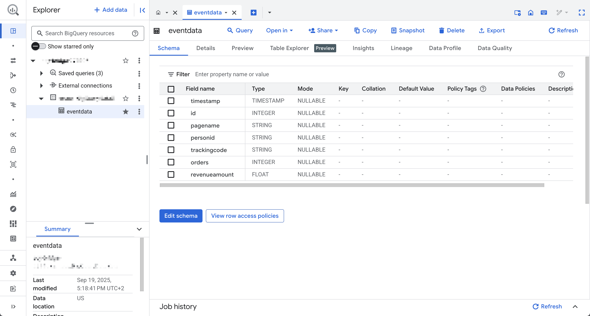

データを検査するには：

1. **[!UICONTROL クエリ]**&#x200B;を選択します。
1. クエリエディターでサンプルクエリを実行します。`project`はプロジェクトの名前、`datasets`はデータセットの名前です。

   ```sql
   SELECT * FROM `project.datasets.eventdata` LIMIT 100
   ```

   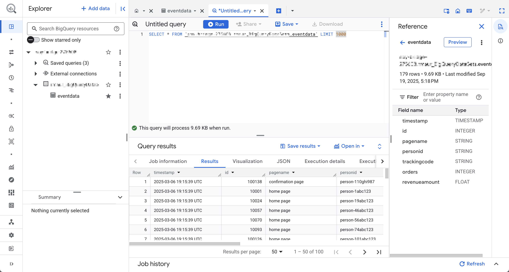

Experience Platform Data Mirror Customer Journey Analytics版の場合、データウェアハウスネイティブソリューションのテーブルを変更履歴に対して有効にする必要があります。 テーブルが変更履歴に対して有効になっていることを確認するには：

1. クエリエディターで次のSQL ステートメントを実行して、設定を確認します。`project`はプロジェクトの名前、`datasets`はデータセットの名前です。

   ```sql
   SELECT
      table_name,
      MAX(CASE WHEN option_name = 'enable_change_history' THEN option_value END) AS enable_change_history
   FROM `project.datasets.INFORMATION_SCHEMA.TABLE_OPTIONS`
   WHERE table_name = 'eventdata'
   GROUP BY table_name
   ORDER BY table_name;
   ```

1. 結果が&#x200B;**[!UICONTROL TRUE]**&#x200B;でない場合は、次のSQL ステートメントを使用して変更履歴を有効にします。ここで、`project`はプロジェクトの名前、`datasets`はデータセットの名前です。

   ```sql
   ALTER TABLE `project.datasets.eventdata` 
   SET OPTIONS (enable_change_history = TRUE);
   ```

データウェアハウスネイティブソリューションのテーブルにあるデータは、Customer Journey Analytics向けExperience Platform Data Mirrorの準備が整っています。


## スキーマの設定

Experience Platformでデータをミラーリングするには、まずデータのスキーマを定義する必要があります。 Customer Journey Analyticsでミラーリングするデータと、Experience PlatformにExperience Platform Data Mirrorを使用するデータはすべて、リレーショナルスキーマに準拠している必要があります。

このデータをモデル化するスキーマを定義します。 スキーマを設定するには：

1. Adobe Experience Platform UIの左側のパネルで、**[!UICONTROL Data Management]**&#x200B;内の&#x200B;**[!UICONTROL Schemas]**&#x200B;を選択します。

1. 「**[!UICONTROL スキーマを作成]**」を選択します。
1. ドロップダウンメニューから、**[!UICONTROL リレーショナル]**&#x200B;を選択します。
1. **[!UICONTROL 手動で作成]**&#x200B;または&#x200B;**[!UICONTROL DDL ファイルをアップロード]**&#x200B;のいずれかを選択するオプションを含むポップアップが表示される場合：
   1. 「**[!UICONTROL 手動作成を選択]**」を選択します。

      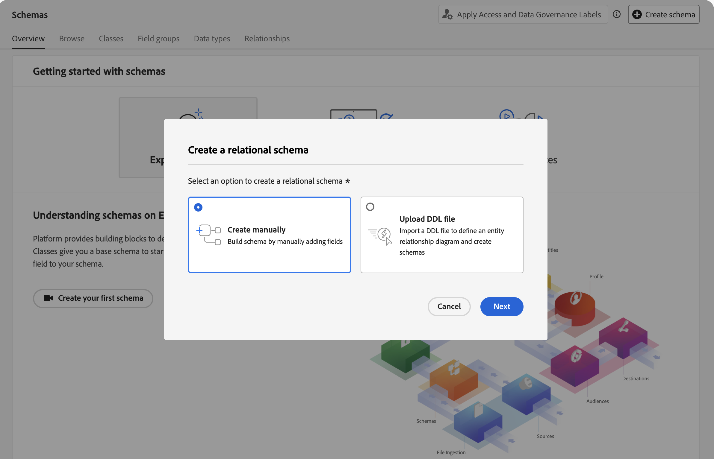

   1. 「**[!UICONTROL 次へ]**」を選択します。
1. **[!UICONTROL スキーマ]** / **[!UICONTROL リレーショナルスキーマ]** インターフェイスで、次の操作を行います。
   1. **[!UICONTROL スキーマの表示名]**&#x200B;を入力します。 例：`Sample Event Feed Schema`。
   1. **[!UICONTROL 説明]**&#x200B;を入力します。 例：`Sample event feed schema for a relational schema`。
   1. **[!UICONTROL 時系列]**&#x200B;を&#x200B;**[!UICONTROL スキーマ動作]**&#x200B;として選択します。 時系列ベース データには&#x200B;**[!UICONTROL 時系列]**&#x200B;を、レコードベース データには&#x200B;**[!UICONTROL レコード]**&#x200B;を選択します。 ビヘイビアーは、スキーマの構造と含まれるプロパティを定義します。

      Customer Journey Analytics用Experience Platform Data Mirrorは、主に時系列データ（イベントデータなど）に使用されます。

      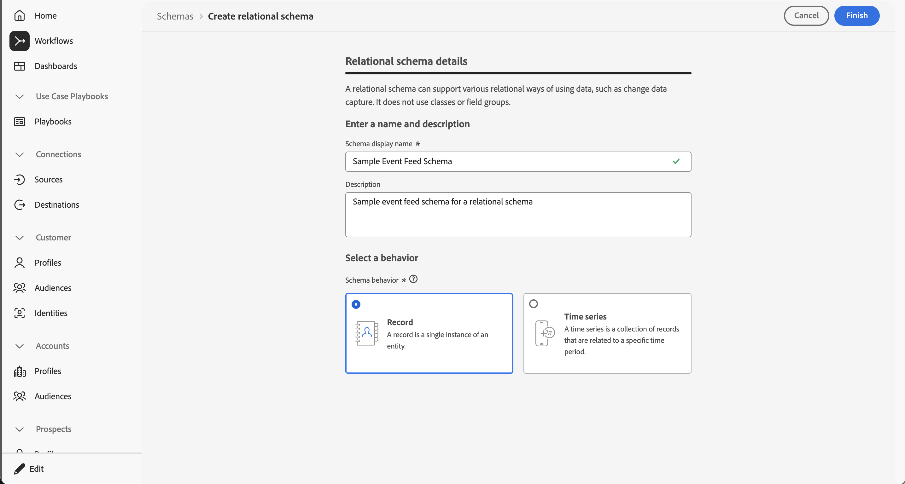

   1. 「**[!UICONTROL 完了]**」を選択します。

1. **[!UICONTROL スキーマ]** > **[!UICONTROL サンプルイベントフィードスキーマ]** インターフェイスで、リレーショナルスキーマが変更行としての取り込みをサポートしているという警告が表示されます。

   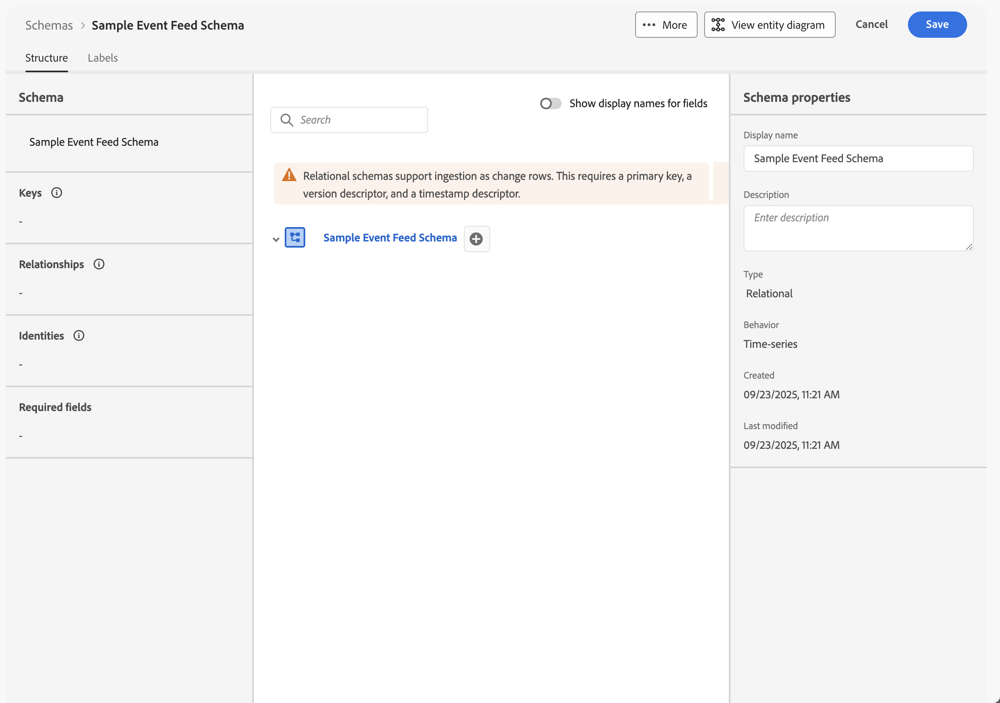

   変更行としての取り込みは、change data capture （CDC）とも呼ばれます。 変更データキャプチャをサポートするには、スキーマに次のものが必要です。

   * プライマリキー。
   * バージョン記述子。
   * 時系列データのタイムスタンプ記述子。

1. **[!UICONTROL サンプルイベントフィードスキーマ]**&#x200B;の横にあるを選択して、スキーマにフィールドを追加します。 データタイプと追加属性を含む次のフィールドをスキーマに追加します。

   | フィールド名 | 表示名 | タイプ | 追加属性 |
   |---|---|---|---|
   | `id` | `Id` | **[!UICONTROL 整数]** |  バージョン記述子 |
   | `orders` | `Orders` | **[!UICONTROL 整数]** | |
   | `pagename` | `Page Name` | **[!UICONTROL 文字列]** | |
   | `personid` | `Person Id` | **[!UICONTROL 文字列]** | プライマリキー<br/> ID<br/>ID名前空間にCRMIDを選択します。 |
   | `revenueamount` | `Revenue Amount` | **[!UICONTROL 倍精度浮動小数点]** | |
   | `timestamp` | `Timestamp` | **[!UICONTROL 日時]** |  タイムスタンプ記述子 |
   | `trackingcode` | `Tracking Code` | **[!UICONTROL 文字列]** | |


   * **[!UICONTROL id]** フィールドは&#x200B;**[!UICONTROL バージョン記述子]**&#x200B;として設定されています。

     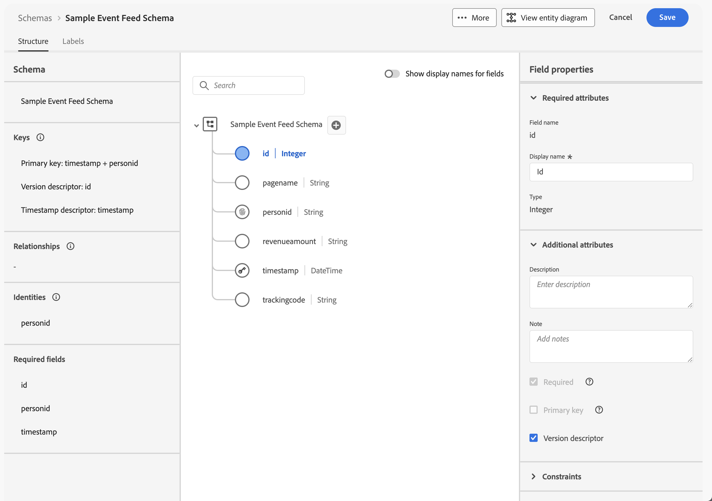

     実際のシナリオでは、[&#x200B; バージョン記述子](aep.md#schema)としてより適切なフィールドを使用することをお勧めします。 例えば、最終更新時間を追跡するフィールドがあります。

   * **[!UICONTROL personid]** フィールドが設定され、さらに&#x200B;**[!UICONTROL timestamp]**&#x200B;が&#x200B;**[!UICONTROL プライマリキー]**&#x200B;として設定されています。  **[!UICONTROL 複合プライマリキーを作成]**&#x200B;を選択して、複合キーを作成します。

     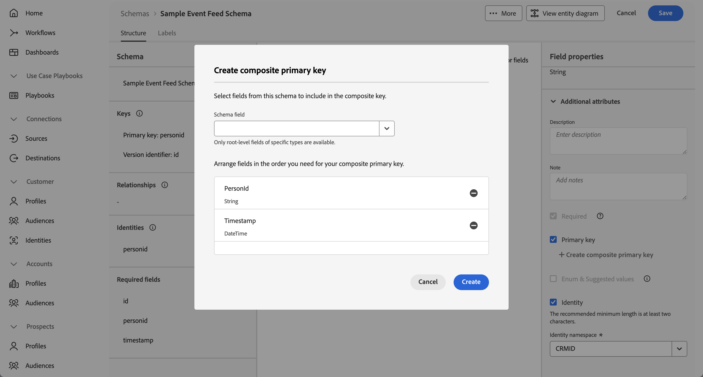

     **[!UICONTROL personid]** フィールドも&#x200B;**[!UICONTROL ID]**&#x200B;として設定され、**[!UICONTROL CRMID]**&#x200B;が&#x200B;**[!UICONTROL ID名前空間]**&#x200B;として使用されます。

     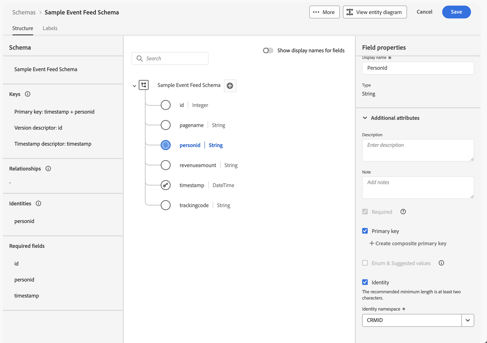

     **[!UICONTROL personid]** フィールドが&#x200B;**[!UICONTROL プライマリキー]**&#x200B;である必要はありません。 実際のシナリオでは、**[!UICONTROL personid]**&#x200B;とは別に、プライマリキーを追跡するための異なるフィールドを持っている可能性が高いです。

   * **[!UICONTROL タイムスタンプ]** フィールドが設定され、さらに&#x200B;**[!UICONTROL personid]** フィールドが&#x200B;**[!UICONTROL プライマリキー]**&#x200B;として設定されています。 **[!UICONTROL タイムスタンプ]** フィールドも&#x200B;**[!UICONTROL タイムスタンプ記述子]**&#x200B;として設定されます。 時系列リレーショナルデータのフィールドを&#x200B;**[!UICONTROL タイムスタンプ記述子]**&#x200B;として定義するだけで済みます。

     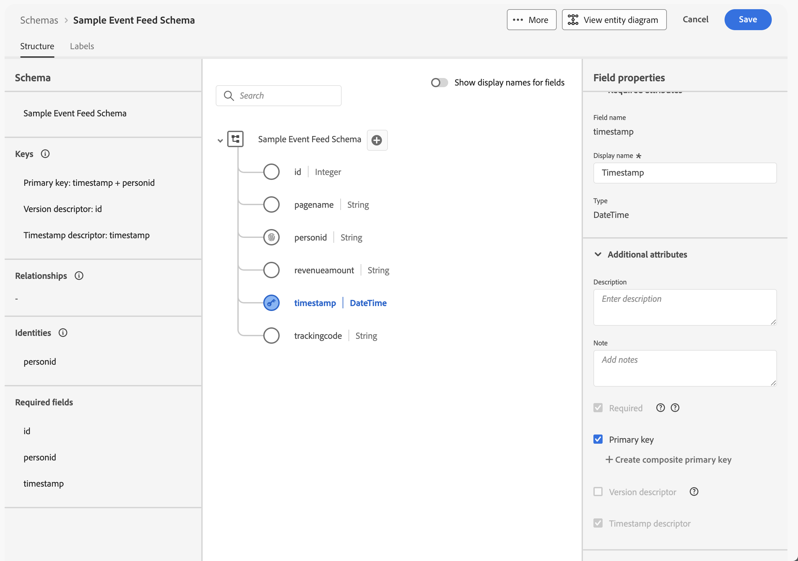


   **[!UICONTROL プライマリキー]**、**[!UICONTROL バージョン記述子]**、**[!UICONTROL タイムスタンプ記述子]**&#x200B;を正しく定義すると、スキーマ定義の上の警告が消えます。

1. 「**[!UICONTROL 保存]**」を選択してスキーマを保存します。

同様に、レコードベースのリレーショナル [&#x200B; スキーマ &#x200B;](aep.md#schema)を設定できます。 例えば、プロファイルとルックアップデータを含めるには。


## ソースコネクタの使用

ソースコネクタを使用して、データウェアハウスネイティブソリューションをExperience Platformに接続します。

Experience Platformのインターフェイスで、次の操作を行います。

1. 「**[!UICONTROL ソース]**」を選択します。
1. **[!UICONTROL Google BigQuery]**&#x200B;を選択または検索します。
1. 「**[!UICONTROL データを追加]**」を選択します。

データの追加ウィザードでは、次の手順に従って、[!DNL Google BigQuery]のテーブルからExperience Platformにデータを接続します。

### 認証

**[!UICONTROL 認証]** ステップで、次を選択します。

* **[!UICONTROL Google BigQueryのアカウント設定が既にある場合の既存アカウント]**。 「[&#x200B; データを選択](#select-data)」手順に進みます。
* Google BigQueryに接続する必要がある場合は、**[!UICONTROL 新しいアカウント]**&#x200B;を作成します。
   1. **[!UICONTROL アカウント名]**&#x200B;と（オプション） **[!UICONTROL 説明]**&#x200B;を指定します。
   1. **[!UICONTROL 認証タイプ]**&#x200B;を選択：**[!UICONTROL 基本認証]**&#x200B;または&#x200B;**[!UICONTROL サービス認証]**。 選択内容に基づいて、必要な情報を入力します。
   1. 「**[!UICONTROL ソースに接続]**」を選択

      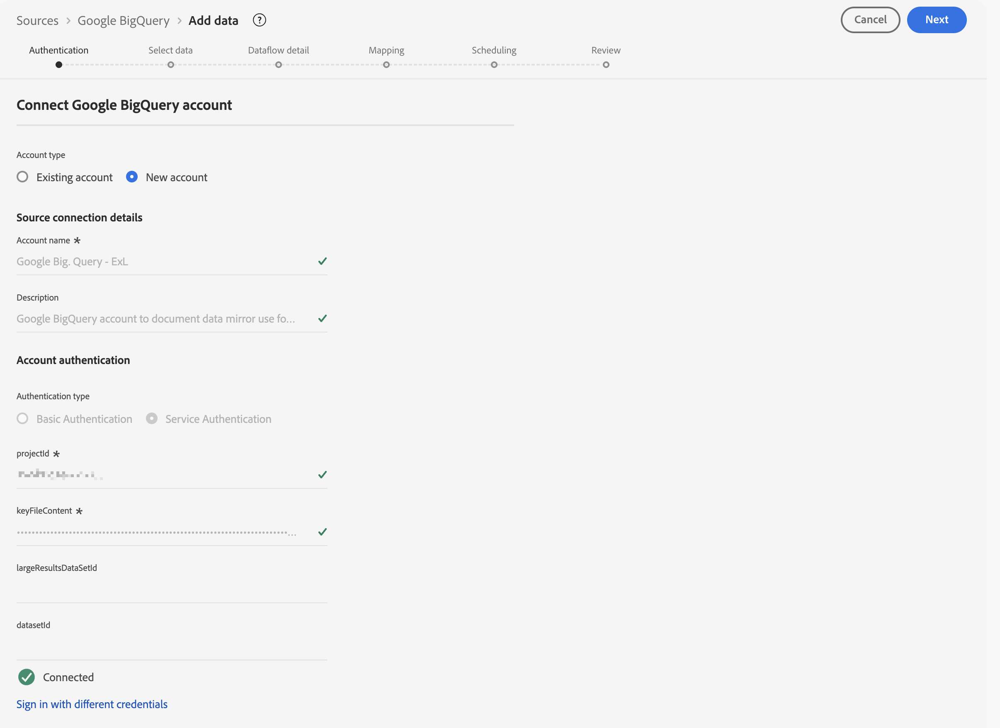

      接続が確認されました。  **[!UICONTROL Connected]**&#x200B;は、接続が成功したことを示します。

   1. 「**[!UICONTROL 次へ]**」を選択します。

  [Snowflake Databricks](https://experienceleague.adobe.com/ja/docs/experience-platform/sources/connectors/databases/databricks)または[Azure](https://experienceleague.adobe.com/ja/docs/experience-platform/sources/connectors/databases/snowflake) コネクタを使用する場合の接続方法と認証方法について詳しくは、Experience Platformのドキュメントを参照してください。


### データを選択

**[!UICONTROL データを選択]**&#x200B;手順で、次の操作を行います。

1. テーブルのリストからテーブルを選択します。 例：**[!UICONTROL eventdata]**。

   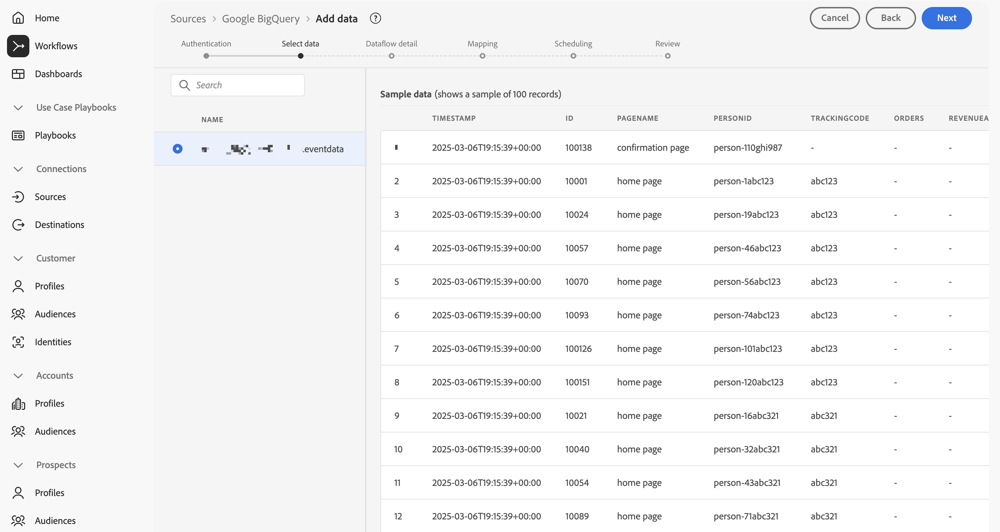

   確認のために表示されたデータのサンプルが表示されます。

1. 「**[!UICONTROL 次へ]**」をクリックして続行します。


### データフローの詳細

**[!UICONTROL データフローの詳細]** ステップで、次の操作を行います。

1. 「**[!UICONTROL 変更データキャプチャを有効にする]**」を選択します。 詳細が記載された「**[!UICONTROL データキャプチャ要件の変更]**」情報ボックスが表示されます。
1. **[!UICONTROL ターゲットデータセット]**&#x200B;の&#x200B;**[!UICONTROL 新しいデータセット]**&#x200B;を選択して、ミラーデータを含む新しいデータセットを作成します。
1. **[!UICONTROL 出力データセット名]**&#x200B;を入力します。 例：`event-data-mirror`。
1. **[!UICONTROL スキーマ]** ドロップダウンメニューから、以前に作成したリレーショナルスキーマを選択します。 例：**[!UICONTROL サンプル イベント フィード スキーマ]**。

   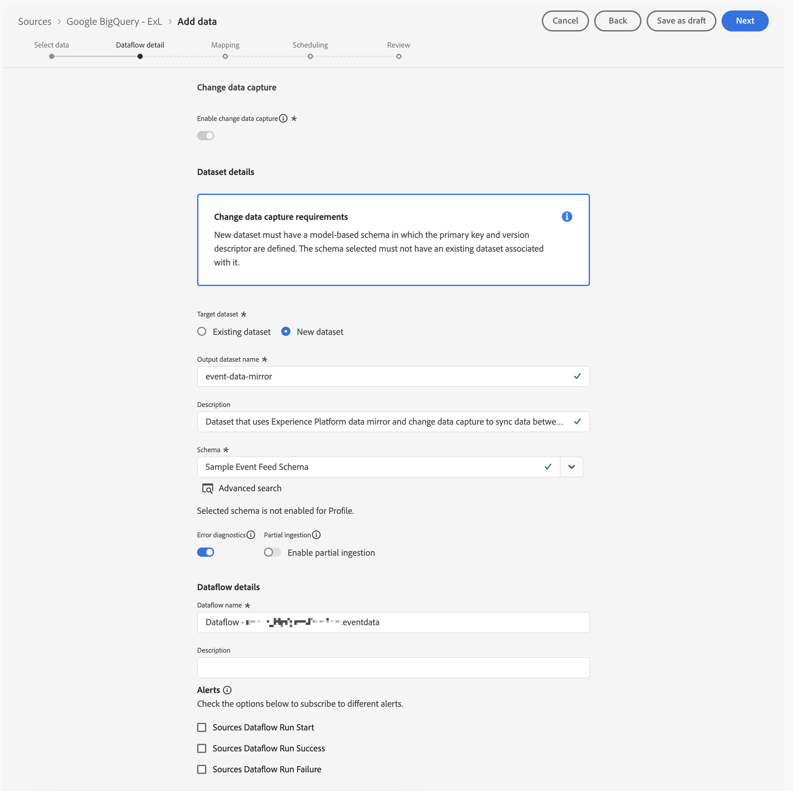

1. その他の詳細を指定してください。
1. 「**[!UICONTROL 次へ]**」を選択します。


### マッピング

**[!UICONTROL マッピング]**&#x200B;手順で、以下を行います。

1. Google BigQuery （**[!UICONTROL Source data]**）のスキーマのフィールドを、Experience Platform （**[!UICONTROL Target フィールド]**）で定義したスキーマのフィールドにマッピングします。

   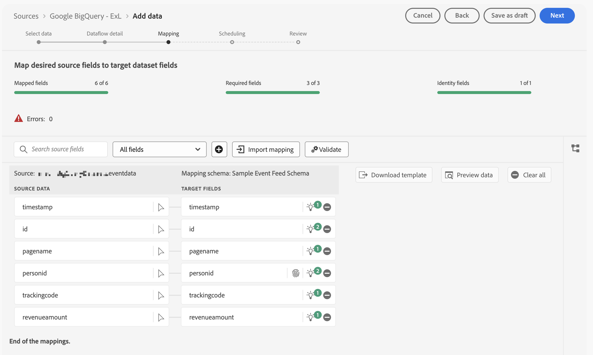

1. すべてのフィールドが正しくマッピングされている場合は、**[!UICONTROL 次へ]**&#x200B;を選択して続行します。


### スケジュール設定

**[!UICONTROL スケジュール設定]** ステップで、次の手順を実行します。

1. **[!UICONTROL 頻度]**&#x200B;と&#x200B;**[!UICONTROL 間隔]**&#x200B;を指定して、ミラーデータの同期をスケジュールします。
1. スケジュールの&#x200B;**[!UICONTROL 開始時間]**&#x200B;を指定します。

   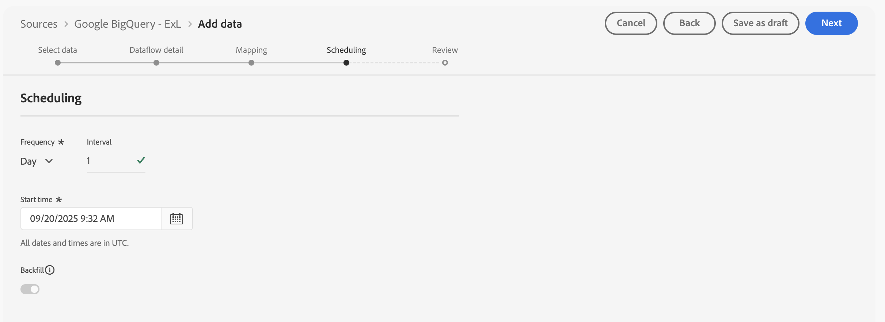

1. 「**[!UICONTROL 次へ]**」をクリックして続行します。


### レビュー

**[!UICONTROL レビュー]**&#x200B;の手順で。

1. ソースコネクタの設定を確認します。

   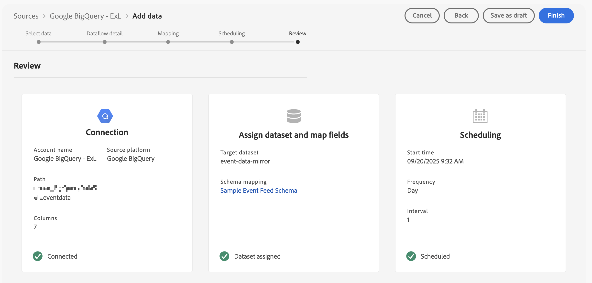

1. 「**[!UICONTROL 完了]**」を選択します。 設定されたデータフローに移動します。

   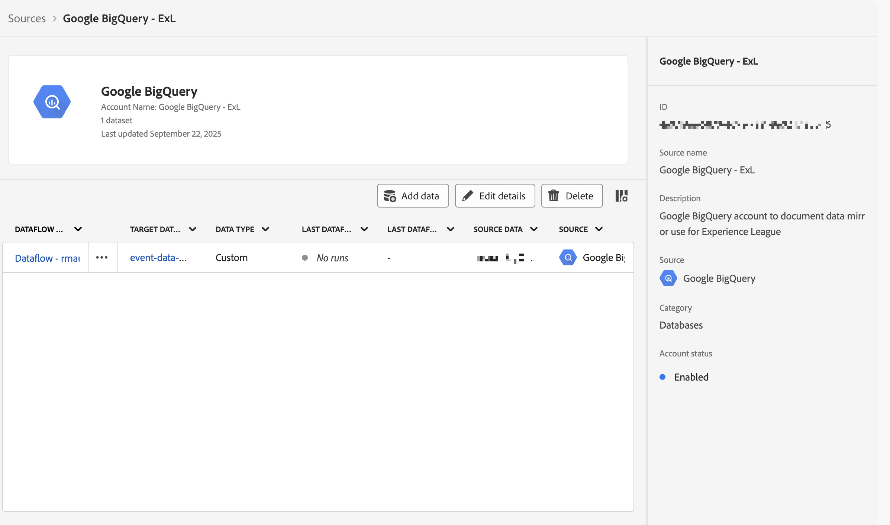


## 接続の設定

このクイックスタートガイドでは、Experience Platformのミラーデータを使用する新しい接続を作成します。 または、ミラー化されたデータを既存の接続に追加することもできます。

Customer Journey Analyticsのインターフェイスで、次の操作を行います。

1. 「**[!UICONTROL データ管理]**」メニューから「**[!UICONTROL 接続]**」を選択します。
1. 「**[!UICONTROL 新しい接続を作成]**」を選択します。
1. 必要な&#x200B;**[!UICONTROL 接続名]**、**[!UICONTROL サンドボックス]**、**[!UICONTROL 1日のイベントの平均数]**&#x200B;およびその他のオプションのパラメーターを指定します。
1. 「**[!UICONTROL データセットを追加]**」を選択します。

   1. **[!UICONTROL データセットを追加]**&#x200B;の&#x200B;**[!UICONTROL データセットを選択]** ステップで：

      1. ミラーデータを含むデータセットを選択します。 例：**[!UICONTROL event-data-mirror]**。 データセットには&#x200B;**[!UICONTROL リレーショナル]**&#x200B;が&#x200B;**[!UICONTROL データセットタイプ]**&#x200B;として含まれています。

         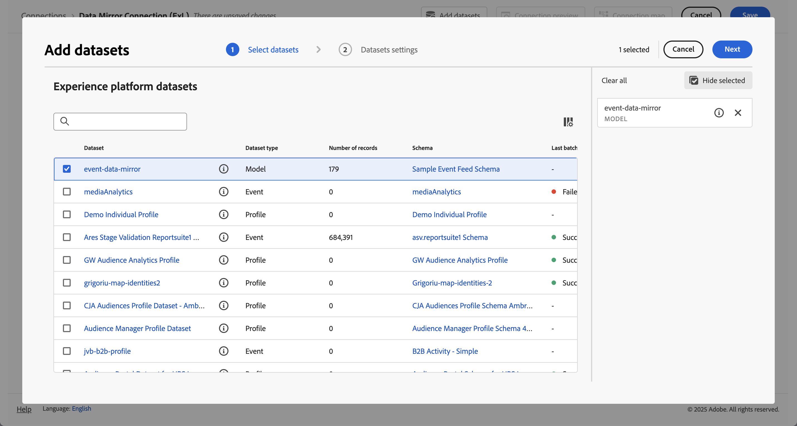

      1. 接続に関連する追加のデータセットを追加します。
      1. 「**[!UICONTROL 次へ]**」を選択します。

   1. **[!UICONTROL データセットを追加]**&#x200B;の&#x200B;**[!UICONTROL データセット設定]** ステップで：

      **[!UICONTROL event-data-mirror]** リレーショナルデータセット

      1. **[!UICONTROL イベント]**&#x200B;を&#x200B;**[!UICONTROL データセットタイプ]**&#x200B;として選択します。
      1. **[!UICONTROL PersonId]** フィールドを&#x200B;**[!UICONTROL Person ID]**&#x200B;として選択します。
      1. **[!UICONTROL タイムスタンプ]**&#x200B;は、**[!UICONTROL タイムスタンプ]**&#x200B;として自動的に入力されます。
      1. **[!UICONTROL その他]**&#x200B;を&#x200B;**[!UICONTROL データソースタイプ]**&#x200B;として選択します。
      1. `Google BigQuery Event Data`を&#x200B;**[!UICONTROL データソースの説明]**&#x200B;として入力します。
      1. **[!UICONTROL すべての新しいデータの読み込み]**、**[!UICONTROL すべての既存データのバックフィル]**&#x200B;など、その他の詳細を指定します。

         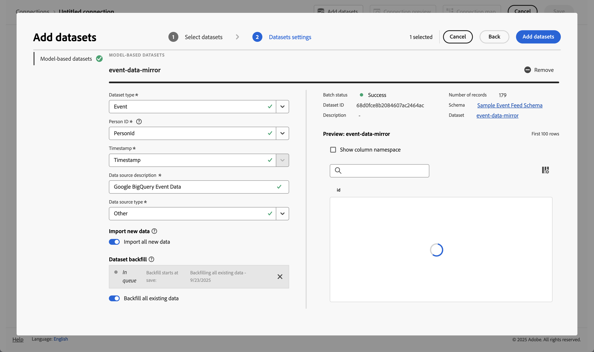

      オプションで、他のデータセットの詳細を指定します。

   1. 「**[!UICONTROL データセットを追加]**」を選択します。
1. 「**[!UICONTROL 保存]**」を選択します。

[接続](/help/connections/overview.md)を作成した後、様々な管理タスクを実行できます。 [&#x200B; データセットの選択と結合](/help/connections/combined-dataset.md)、[接続のデータセットのステータスとデータ取り込みのステータス &#x200B;](/help/connections/manage-connections.md)など。


## データ表示の設定

データ表示を作成するには：

1. Customer Journey Analytics インターフェイスの上部メニューで、**[!UICONTROL Data views]**、オプションで&#x200B;**[!UICONTROL Data management]**&#x200B;を選択します。

2. 「**[!UICONTROL 新しいデータ表示を作成]**」を選択します。

3. **[!UICONTROL 設定]**&#x200B;手順で、次の操作を行います。

   1. **[!UICONTROL 接続]**&#x200B;リストで接続を選択します。

   1. 接続に名前を付け、（オプションで）説明します。

   1. 「**[!UICONTROL 保存して続行]**」を選択します。

4. **[!UICONTROL コンポーネント]**&#x200B;手順で、次の操作を行います。

   1. **[!UICONTROL 指標]**&#x200B;または&#x200B;**[!UICONTROL ディメンション]**&#x200B;コンポーネントボックスに含めるスキーマフィールドや標準コンポーネントを追加します。 ミラーデータを含むデータセットから関連フィールドを追加します。 これらのフィールドにアクセスするには：

      1. **[!UICONTROL イベントデータセット]**&#x200B;を選択します。
      1. 「**[!UICONTROL アドホックおよびリレーショナルフィールド]**」を選択します。
      1. リレーショナルスキーマから&#x200B;**[!UICONTROL 指標]**&#x200B;または&#x200B;**[!UICONTROL ディメンション]**&#x200B;にフィールドをドラッグ&amp;ドロップします。

         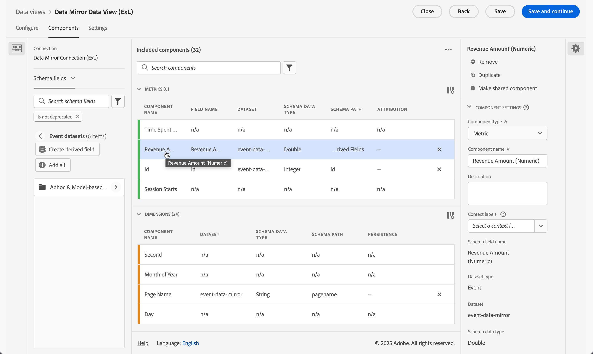

   1. 適切なタイプを持たないフィールド、適切な形式でないフィールド、または他の理由で変更したいフィールドに対して、派生フィールドを定義します。 例えば、**[!UICONTROL 収益金額]**&#x200B;の場合です。

      1. **[!UICONTROL 派生フィールドを作成を選択します。]**
      1. 派生フィールドエディターで、次の操作を行います。
         1. 以下のように、新しい`Revenue Amount (Numeric)` フィールドを定義します。

            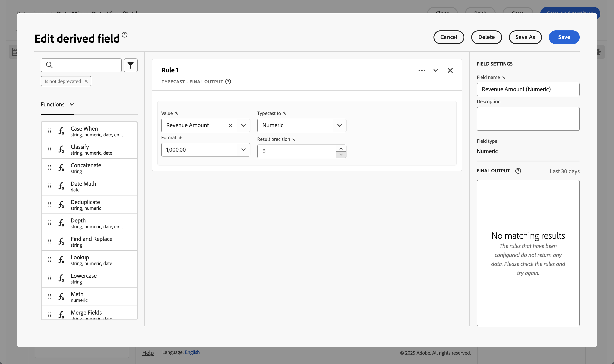

         1. 「**[!UICONTROL 保存]**」を選択します。
      1. 新しい&#x200B;**[!UICONTROL 売上額（数値）]**&#x200B;派生フィールドをドラッグし、**[!UICONTROL 指標]**&#x200B;にフィールドをドロップします。

         

   1. 「**[!UICONTROL 保存して続行]**」を選択します。

5. **[!UICONTROL 設定]**&#x200B;手順で、次の操作を行います。

   設定をそのままにし、「**[!UICONTROL 保存して終了]**」を選択します。

データビューの作成および編集方法について詳しくは、[&#x200B; データビューの概要](../data-views/data-views.md)を参照してください。 また、データビューで使用できるコンポーネントや、セグメントとセッションの設定の使用方法についても説明します。


## プロジェクトの設定

Analysis Workspaceは、データにもとづいて分析データを迅速に構築し、インサイトを共有できる柔軟なブラウザーツールです。 ワークスペースプロジェクトでは、データコンポーネント、テーブル、およびビジュアライゼーションを組み合わせて、分析を作成し、組織内の任意のユーザーと共有できます。

プロジェクトを作成するには：

1. Customer Journey Analytics インターフェイスで、上部メニューの&#x200B;**[!UICONTROL Workspace]**&#x200B;を選択します。

2. 左側のナビゲーションの「**[!UICONTROL プロジェクト]**」を選択します。

3. 「**[!UICONTROL プロジェクトを作成]**」を選択します。 ポップアップで以下を行います。


   1. **[!UICONTROL 空白のWorkspace プロジェクト]**&#x200B;を選択します。

   1. 「**[!UICONTROL 作成]**」を選択します。


4. **[!UICONTROL 新規プロジェクト]** ワークスペースで、[&#x200B; データビュー](#set-up-a-data-view)が選択されていることを確認します。 このデータビューは、ミラー化されたデータを含む[接続](#set-up-a-connection)にリンクしています。

5. 最初のレポートを作成するには、**[!UICONTROL 自由形式]** パネルの&#x200B;**[!UICONTROL 自由形式テーブル]**&#x200B;にディメンションと指標をドラッグ&amp;ドロップします。 例えば、**[!UICONTROL 売上額（数値）]**&#x200B;を&#x200B;**[!UICONTROL _指標をここにドラッグ_]**&#x200B;します。 **[!UICONTROL PersonId]**&#x200B;をドラッグして、最初の列ヘッダーにフィールドをドロップします。 その他の調整も必要に応じて行います。

   最終的な結果は、Google BigQuery テーブルからのミラーデータに基づくプロファイルとその収益の概要です。

   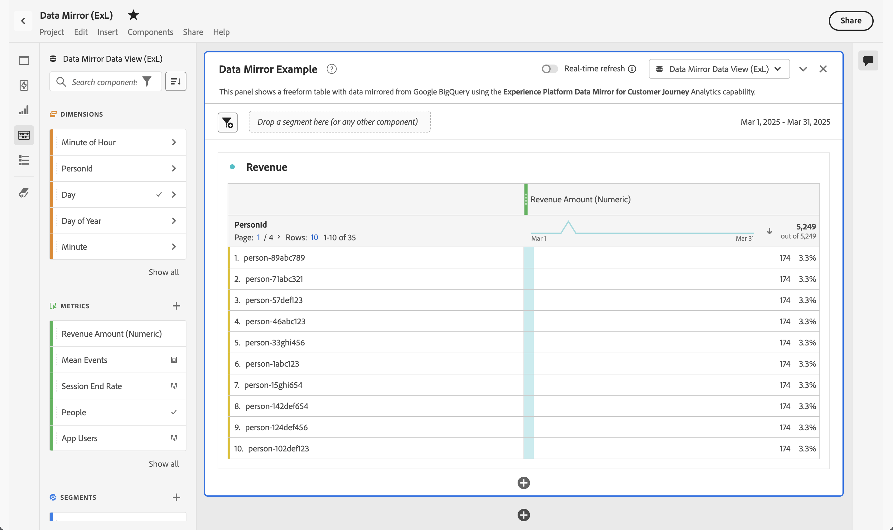

コンポーネント、ビジュアライゼーション、パネルを使用してプロジェクトを作成し、分析を構築する方法について詳しくは、[Analysis Workspace の概要](../analysis-workspace/home.md)を参照してください。

>[!SUCCESS]
>
>すべての手順が完了しました。 まず、データウェアハウスネイティブソリューションから収集するミラーデータ（スキーマ）を定義することから始めました。 Experience Platformのどこにデータ（データセット）を保存するのかを指定できます。 適切なソースコネクタを設定して、Experience Platformのミラーデータを提供しました。 Customer Journey Analyticsで接続を定義して、ミラー化されたイベントデータと（オプションで）その他のデータを使用します。 データビュー定義では、ミラーデータから使用するディメンションと指標を指定できます。 そして、最初のプロジェクトは、ミラーデータの可視化と分析でした。
