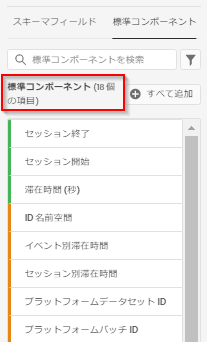

# 標準コンポーネントリファレンス

CJA のほとんどのディメンションと指標は、Adobe Experience Platform データセットのスキーマ要素に基づいています。ただし、使用する接続に関係なく、データビューに追加できるコンポーネントがいくつかあります。

[!UICONTROL 標準] コンポーネントとは、データセットスキーマフィールドから生成されるのではなく、システムによって生成されるコンポーネントを指します。Analysis Workspace でのレポート機能を強化するために必要なシステムコンポーネントもあれば、オプションのシステムコンポーネントもあります。

## 必要な標準コンポーネント {#required}

これら必須の標準コンポーネントは、デフォルトで各データビューに追加されます。これらは、Customer Journey Analytics が提供するレポート機能に不可欠です。

| コンポーネント名 | ディメンションまたは指標 | メモ |
| --- | --- | --- |
| [!UICONTROL 人物] | 指標 | 「[!UICONTROL 接続]」で指定された個人 ID に基づいています。 |
| [!UICONTROL セッション] | 指標 | データビューのセッション設定に基づいています。 |
| [!UICONTROL イベント] | 指標 | 「[!UICONTROL 接続]」内のすべてのイベントデータセットの行数。 |
| [!UICONTROL 分] | ディメンション | 特定のイベントが発生した時刻の分（切り捨て）。最初のディメンション項目は日付範囲の最初の分で、最後のディメンション項目は日付範囲の最後の分です。 |
| [!UICONTROL 時間] | ディメンション | 特定のイベントが発生した時刻の時間（切り捨て）。 最初のディメンション項目は日付範囲の最初の時間で、最後のディメンション項目は日付範囲の最後の時間です。 |
| [!UICONTROL 日] | ディメンション | 特定のイベントが発生した日。 最初のディメンション項目は日付範囲の最初の日で、最後のディメンション項目は日付範囲の最後の日です。 |
| [!UICONTROL 週] | ディメンション | 特定のイベントが発生した週。最初のディメンション項目は日付範囲の最初の週で、最後のディメンション項目は日付範囲の最後の週です。 |
| [!UICONTROL 月] | ディメンション | 特定のイベントが発生した月。最初のディメンション項目は日付範囲の最初の月で、最後のディメンション項目は日付範囲の最後の月です。 |
| [!UICONTROL 四半期] | ディメンション | 特定のイベントが発生した四半期。最初のディメンション項目は日付範囲の最初の四半期で、最後のディメンション項目は日付範囲の最後の四半期です。 |
| [!UICONTROL 年] | ディメンション | 特定のイベントが発生した年。最初のディメンション項目は日付範囲の最初の年で、最後のディメンション項目は日付範囲の最も新しい年です。 |

## 標準コンポーネント（オプション） {#optional}

オプションの標準コンポーネントは、 **[!UICONTROL データビュー]**／ **[!UICONTROL データビューを編集]**／ **[!UICONTROL コンポーネント]**&#x200B;タブ／ **[!UICONTROL 標準コンポーネント]** タブにあります。

| コンポーネント名 | ディメンションまたは指標 | メモおよび値 |
| --- | --- | --- |
| [!UICONTROL 午前／午後] | 時間分割ディメンション | 午前または午後 |
| [!UICONTROL バッチ ID] | ディメンション | [!UICONTROL イベント]が含まれていた Experience Platform バッチを表します。 |
| [!UICONTROL データセット ID] | ディメンション | [!UICONTROL イベント]が含まれていた Experience Platform データセットを表します。 |
| [!UICONTROL 日付] | 時間分割ディメンション | 1 ～ 31 |
| [!UICONTROL 曜日] | 時間分割ディメンション | 月曜日、火曜日、水曜日、木曜日、金曜日、土曜日、日曜日 |
| [!UICONTROL 年間通算日] | 時間分割ディメンション | 1 ～ 366 |
| [!UICONTROL 時刻] | 時間分割ディメンション | 0 ～ 23 |
| [!UICONTROL 月] | 時間分割ディメンション | 1 月 ～ 12 月 |
| [!UICONTROL 新しいセッション] | 指標 | レポートウィンドウ内での人物の定義された最初のセッション。 [詳細情報](https://experienceleague.adobe.com/docs/analytics-platform/using/cja-dataviews/data-views-usecases.html?lang=en#new-repeat) |
| [!UICONTROL ユーザー ID] | ディメンション | Experience Platform で定義された各データセットスキーマは、1 つ以上の定義済み ID のセットを持つことができ、ID 名前空間に関連付けられます。これらのいずれかを個人 ID として使用できます。例えば、cookie ID、関連付け ID、ユーザー ID、トラッキングコードなどがあります。[!UICONTROL ユーザー ID] ディメンションは、データセットを組み合わせ、CJA での一意の訪問者を識別する際の基礎となります。
考えられるユースケースは次のとおりです。<ul><li>特定のユーザー ID 値に対してフィルターを作成し、そのユーザーの行動に至るまですべてをフィルタリングします。</li><li>デバッグ：特定の cookie ID（または特定の顧客 ID）のデータが存在することを確認します。</li><li>コールセンターに電話をかけたユーザーを特定します。</li></ul> |
| [!UICONTROL ユーザー ID 名前空間] | ディメンション | [!UICONTROL ユーザー ID] を構成している ID のタイプ。例：`email address`、`cookie ID`、`Analytics ID` など |
| [!UICONTROL 四半期] | 時間分割ディメンション | 第 1 四半期、第 2 四半期、第 3 四半期、第 4 四半期 |
| [!UICONTROL セッションを繰り返し] | 指標 | 人物の初めてのセッションではなかったセッションの数。 [詳細情報](https://experienceleague.adobe.com/docs/analytics-platform/using/cja-dataviews/data-views-usecases.html?lang=en#new-repeat) |
| [!UICONTROL セッション開始] | 指標 | セッションの最初のイベントとなったイベントの数。フィルター定義で使用する場合（例：「[!UICONTROL セッション開始]が存在する」）、各セッションの最初のイベントのみにフィルターされます。 |
| [!UICONTROL セッション終了] | 指標 | セッションの最後のイベントとなったイベントの数。「[!UICONTROL セッション開始]」と同様、これをフィルター定義で使用してフィルタリングし、各セッションの最後のイベントだけを残すこともできます。 |
| [!UICONTROL セッションタイプ] | ディメンション | このディメンションには次の 2 つの値があります。1) [!UICONTROL 初回] (2) 戻る。 この [!UICONTROL 初回] 行項目には、個人の定義された最初のセッションと判断されたセッションのすべての動作（このディメンションに対する指標）が含まれます。 その他すべては、 [!UICONTROL リピート] 行項目（すべてがセッションに属すると仮定）。 指標がどのセッションにも含まれていない場合、このディメンションの「該当なし」バケットに含まれます。 [詳細情報]([詳細情報](https://experienceleague.adobe.com/docs/analytics-platform/using/cja-dataviews/data-views-usecases.html?lang=en#new-repeat)) |
| [!UICONTROL 滞在時間 (秒)] | 指標 | あるディメンションについて、2 つの異なる値の間の時間を合計します。 |
| [!UICONTROL イベント別滞在時間] | ディメンション | [!UICONTROL 滞在時間] 指標を [!UICONTROL イベント] グループ別にまとめたものです。 |
| [!UICONTROL セッション別滞在時間] | ディメンション | [!UICONTROL 滞在時間] 指標を [!UICONTROL セッション] 別にまとめたものです。 |
| [!UICONTROL ユーザー別滞在時間] | ディメンション | [!UICONTROL 滞在時間] 指標を [!UICONTROL 個人] グループ別にまとめたものです。 |
| [!UICONTROL 週末]／[!UICONTROL 平日] | 時間分割ディメンション | 週末または平日 |

