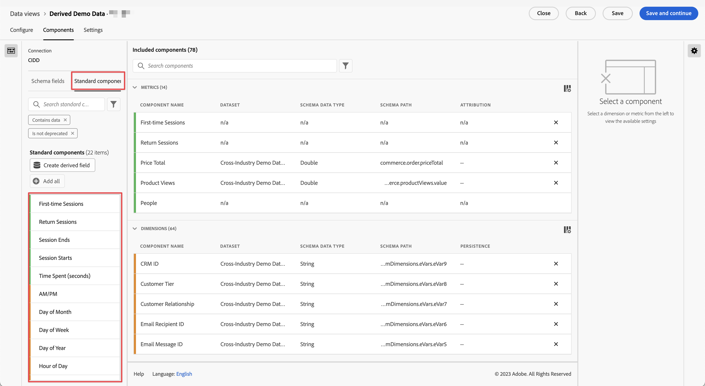

# 標準コンポーネントリファレンス

Customer Journey Analytics のほとんどのディメンションと指標は、Adobe Experience Platform データセットのスキーマ要素に基づいています。ただし、使用する接続に関係なく、データビューに追加できるコンポーネントがいくつかあります。

[!UICONTROL 標準] コンポーネントとは、データセットスキーマフィールドから生成されるのではなく、システムによって生成されるコンポーネントを指します。Analysis Workspace でのレポート機能を強化するために必要なシステムコンポーネントもあれば、オプションのシステムコンポーネントもあります。

## 必要な標準コンポーネント {#required}

これら必須の標準コンポーネントは、デフォルトで各データビューに追加されます。これらは、Customer Journey Analytics が提供するレポート機能に不可欠です。

| コンポーネント名 | ディメンションまたは指標 | メモ |
| --- | --- | --- |
| [!UICONTROL 人物] | 指標 | 「[!UICONTROL 接続]」で指定された個人 ID に基づいています。 |
| [!BADGE B2B edition]{type=Informative url="https://experienceleague.adobe.com/en/docs/analytics-platform/using/cja-overview/cja-b2b/cja-b2b-edition" newtab=true tooltip="Customer Journey AnalyticsB2B edition"} [!UICONTROL &#x200B; アカウント &#x200B;] | 指標 | 「[!UICONTROL &#x200B; 接続 &#x200B;]」で指定されたアカウント ID に基づいています。 |
| [!BADGE B2B edition]{type=Informative url="https://experienceleague.adobe.com/en/docs/analytics-platform/using/cja-overview/cja-b2b/cja-b2b-edition" newtab=true tooltip="Customer Journey AnalyticsB2B edition"} [!UICONTROL &#x200B; グローバルアカウント &#x200B;] | 指標 | [!UICONTROL &#x200B; 接続 &#x200B;] で指定されたグローバルアカウント ID に基づいています。 |
| [!BADGE B2B edition]{type=Informative url="https://experienceleague.adobe.com/en/docs/analytics-platform/using/cja-overview/cja-b2b/cja-b2b-edition" newtab=true tooltip="Customer Journey AnalyticsB2B edition"} [!UICONTROL &#x200B; 商談 &#x200B;] | 指標 | 商談。「接続 [!UICONTROL &#x200B; で指定した商談 ID に基づ &#x200B;] ています。 |
| [!BADGE B2B edition]{type=Informative url="https://experienceleague.adobe.com/en/docs/analytics-platform/using/cja-overview/cja-b2b/cja-b2b-edition" newtab=true tooltip="Customer Journey AnalyticsB2B edition"} [!UICONTROL &#x200B; 購買グループ &#x200B;] | 指標 | [!UICONTROL &#x200B; 接続 &#x200B;] で指定された購入グループ ID に基づく購入グループ。 |
| [!UICONTROL セッション] | 指標 | データビューのセッション設定に基づいています。 |
| [!UICONTROL イベント] | 指標 | 「[!UICONTROL 接続]」内のすべてのイベントデータセットの行数。 |
| [!UICONTROL 秒] | ディメンション | 特定のイベントが発生した時刻の秒（切り捨て）。最初のディメンション項目は日付範囲の最初の秒、最後のディメンション項目は日付範囲の最後の秒です。 |
| [!UICONTROL 分] | ディメンション | 特定のイベントが発生した時刻の分（切り捨て）。最初のディメンション項目は日付範囲の最初の分で、最後のディメンション項目は日付範囲の最後の分です。 |
| [!UICONTROL 時間] | ディメンション | 特定のイベントが発生した時刻の時間（切り捨て）。 最初のディメンション項目は日付範囲の最初の時間で、最後のディメンション項目は日付範囲の最後の時間です。 |
| [!UICONTROL 日] | ディメンション | 特定のイベントが発生した日。 最初のディメンション項目は日付範囲の最初の日で、最後のディメンション項目は日付範囲の最後の日です。 |
| [!UICONTROL 週] | ディメンション | 特定のイベントが発生した週。最初のディメンション項目は日付範囲の最初の週で、最後のディメンション項目は日付範囲の最後の週です。 |
| [!UICONTROL 月] | ディメンション | 特定のイベントが発生した月。最初のディメンション項目は日付範囲の最初の月で、最後のディメンション項目は日付範囲の最後の月です。 |
| [!UICONTROL 四半期] | ディメンション | 特定のイベントが発生した四半期。最初のディメンション項目は日付範囲の最初の四半期で、最後のディメンション項目は日付範囲の最後の四半期です。 |
| [!UICONTROL 年] | ディメンション | 特定のイベントが発生した年。最初のディメンション項目は日付範囲の最初の年で、最後のディメンション項目は日付範囲の最も新しい年です。 |
| イベントの深度 | ディメンション | セッション内の各イベントインタラクションに連続した数値（1、2、3 など）を割り当てます。 このディメンションを使用すると、制限されたセッション内でのイベントの進行を開始から終了まで追跡できます。 例えば、セッション コンテナ内で **[!UICONTROL イベントの深さ]**&#x200B;**[!UICONTROL 次に等しい]**`1` と定義されたルールを使用してセグメント定義で使用する場合、各セッションの最初のイベントのみにセグメント化するセグメントを定義します。 |
| [!UICONTROL セッション開始] | 指標 | セッションの最初のイベントとなったイベントの数。セグメント定義で使用する場合（「[!UICONTROL &#x200B; セッション開始 &#x200B;] が存在する」など）、セグメントは各セッションの最初のイベントのみに分類されます。
次の[計算指標](/help/components/calc-metrics/default-calcmetrics.md)を Workspace で使用可能にするには、このコンポーネントをデータビューに含める必要があります。 <ul><li>セッション開始率</li>
 |
| [!UICONTROL セッション終了] | 指標 | セッションの最後のイベントとなったイベントの数。[!UICONTROL &#x200B; セッション開始 &#x200B;] と同様、これをセグメント定義で使用して各セッションの最後のイベントまでセグメント化することもできます。
次の[計算指標](/help/components/calc-metrics/default-calcmetrics.md)を Workspace で使用可能にするには、このコンポーネントをデータビューに含める必要があります。 <ul><li>セッション終了率</li>
 |
| [!UICONTROL 滞在時間 (秒)] | 指標 | あるディメンションについて、2 つの異なる値の間の時間を合計します。
次の[計算指標](/help/components/calc-metrics/default-calcmetrics.md)を Workspace で使用可能にするには、このコンポーネントをデータビューに含める必要があります。 <ul><li>ユーザー別滞在時間</li><li>セッションごとの滞在時間</li>
 |

{style="table-layout:auto"}

## 標準コンポーネント（任意） {#optional}

オプションの標準コンポーネントは、 **[!UICONTROL データビュー]**／ **[!UICONTROL データビューを編集]**／ **[!UICONTROL コンポーネント]**&#x200B;タブ／ **[!UICONTROL 標準コンポーネント]** タブにあります。

| コンポーネント名 | ディメンションまたは指標 | メモおよび値 |
| --- | --- | --- |
| [!UICONTROL 午前／午後] | 時間分割ディメンション | 午前または午後 |
| [!UICONTROL バッチ ID] | ディメンション | [!UICONTROL &#x200B; イベント &#x200B;] が含まれていたExperience Platform バッチの識別子。 |
| [!UICONTROL データセット ID] | ディメンション | [!UICONTROL &#x200B; イベント &#x200B;] が含まれていたExperience Platform データセットの識別子。 |
| [!UICONTROL 日付] | 時間分割ディメンション | 1 ～ 31 |
| [!UICONTROL 曜日] | 時間分割ディメンション | 月曜日、火曜日、水曜日、木曜日、金曜日、土曜日、日曜日 |
| [!UICONTROL 年間通算日] | 時間分割ディメンション | 1 ～ 366 |
| [!UICONTROL 時刻] | 時間分割ディメンション | 0 ～ 23 |
| [!UICONTROL 月] | 時間分割ディメンション | 1 月 ～ 12 月 |
| [!UICONTROL 初回セッション] | 指標 | レポートウィンドウ内での個人の定義された最初のセッション。[詳細情報](https://experienceleague.adobe.com/docs/analytics-platform/using/cja-dataviews/data-views-usecases.html?lang=ja#new-repeat) |
| [!UICONTROL セッションを返す] | 指標 | 個人の初めてのセッションではなかったセッションの数。[詳細情報](https://experienceleague.adobe.com/docs/analytics-platform/using/cja-dataviews/data-views-usecases.html?lang=ja#new-repeat) |
| [!UICONTROL ユーザー ID] | ディメンション | Experience Platform で定義された各データセットスキーマは、1 つ以上の定義済み ID のセットを持つことができ、ID 名前空間に関連付けられます。これら ID のいずれかをユーザー ID として使用できます。 例えば、cookie ID、関連付け ID、ユーザー ID、トラッキングコードなどがあります。[!UICONTROL ユーザー ID] ディメンションは、データセットを組み合わせ、Customer Journey Analytics での一意のユーザーを識別する際の基礎となります。
考えられるユースケースは次のとおりです。<ul><li>特定のユーザー ID 値にセグメントを作成して、そのユーザーの行動に至るまですべてをセグメント化します。</li><li>デバッグ：特定の cookie ID（または特定の顧客 ID）のデータが存在することを確認します。</li><li>コールセンターに電話をかけたユーザーを特定します。</li></ul> |
| [!UICONTROL ユーザー ID 名前空間] | ディメンション | [!UICONTROL ユーザー ID] を構成している ID のタイプ。例：`email address`、`cookie ID`、`Analytics ID` |
| [!BADGE B2B edition]{type=Informative url="https://experienceleague.adobe.com/en/docs/analytics-platform/using/cja-overview/cja-b2b/cja-b2b-edition" newtab=true tooltip="Customer Journey AnalyticsB2B edition"} [!UICONTROL &#x200B; グローバルアカウント ID] | ディメンション | 接続でグローバルアカウントコンテナを使用する場合の [!UICONTROL &#x200B; グローバルアカウント ID]。 |
| [!BADGE B2B edition]{type=Informative url="https://experienceleague.adobe.com/en/docs/analytics-platform/using/cja-overview/cja-b2b/cja-b2b-edition" newtab=true tooltip="Customer Journey AnalyticsB2B edition"} [!UICONTROL &#x200B; アカウント ID] | ディメンション | 接続でアカウントコンテナを使用する場合の [!UICONTROL &#x200B; アカウント ID]。 |
| [!BADGE B2B edition]{type=Informative url="https://experienceleague.adobe.com/en/docs/analytics-platform/using/cja-overview/cja-b2b/cja-b2b-edition" newtab=true tooltip="Customer Journey AnalyticsB2B edition"} [!UICONTROL &#x200B; オポチュニティ ID] | ディメンション | 接続で商談コンテナを使用する場合の [!UICONTROL &#x200B; 商談 ID]。 |
| [!BADGE B2B edition]{type=Informative url="https://experienceleague.adobe.com/en/docs/analytics-platform/using/cja-overview/cja-b2b/cja-b2b-edition" newtab=true tooltip="Customer Journey AnalyticsB2B edition"} [!UICONTROL &#x200B; 購入グループ ID] | ディメンション | 接続で購入グループコンテナを使用する場合の [!UICONTROL &#x200B; 購入グループ ID]。 |
| [!UICONTROL 四半期] | 時間分割ディメンション | 第 1 四半期、第 2 四半期、第 3 四半期、第 4 四半期 |
| [!UICONTROL リピートセッション] | 指標 | 個人の初めてのセッションではなかったセッションの数。[詳細情報](https://experienceleague.adobe.com/docs/analytics-platform/using/cja-dataviews/data-views-usecases.html?lang=ja#new-repeat) |
| [!UICONTROL セッションタイプ] | ディメンション | このディメンションには次の 2 つの値があります。1. [!UICONTROL &#x200B; 初回 &#x200B;] と 2. 再来訪。 [!UICONTROL 初回]行項目には、個人の定義された最初のセッションと判断されたセッションのすべての動作（このディメンションに対する指標）が含まれます。その他すべては、[!UICONTROL 再来訪]行項目に含まれます（すべてがセッションに属すると仮定）。指標がどのセッションにも含まれていない場合、このディメンションの「該当なし」バケットに入ります。[詳細情報](https://experienceleague.adobe.com/docs/analytics-platform/using/cja-dataviews/data-views-usecases.html?lang=ja#new-repeat) |
| [!UICONTROL イベント別滞在時間] | ディメンション | [!UICONTROL 滞在時間] 指標を [!UICONTROL イベント] グループ別にまとめたものです。 |
| [!UICONTROL セッション別滞在時間] | ディメンション | [!UICONTROL 滞在時間] 指標を [!UICONTROL セッション] 別にまとめたものです。 |
| [!UICONTROL ユーザー別滞在時間] | ディメンション | [!UICONTROL 滞在時間] 指標を [!UICONTROL 個人] グループ別にまとめたものです。 |
| [!UICONTROL 週末]／[!UICONTROL 平日] | 時間分割ディメンション | 週末または平日 |

{style="table-layout:auto"}
