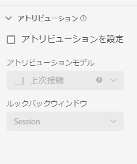

# アトリビューションコンポーネントの設定

アトリビューションを使用すると、指標のデフォルトのアトリビューションモデルを設定できます。 Analysis Workspaceでの作業中に、特定の指標のアトリビューションモデルを上書きできます。

| 設定 | 説明／使用例 |
| --- | --- |
| [!UICONTROL アトリビューションを設定] | この指標が使用される場合に、デフォルトのアトリビューションモデルを有効にします。 このデフォルトは、[!UICONTROL フリーフォームテーブル]または計算指標で上書きできます。 |
| [!UICONTROL アトリビューションモデル] | 使用するデフォルトの[アトリビューションモデル](/help/analysis-workspace/attribution/models.md)を指定できます。 デフォルトは「[!UICONTROL ラストタッチ]」です。オプションは、ラストタッチ、ファーストタッチ、リニア、パーティシペーション、同じタッチ、U 字型、J 曲線、逆 J、時間減衰、カスタム、アルゴリズムです。 これらのオプションの一部は、「カスタム」や「時間減衰」など、入力が必要な追加フィールドを作成します。同じフィールドを使用して複数の指標を作成できます。つまり、1 つの「[!UICONTROL ラストタッチ]」売上高指標と 1 つの「[!UICONTROL ファーストタッチ]」売上高指標を持つことができますが、これらはスキーマ内の同じ売上高フィールドに基づきます。 |
| [!UICONTROL ルックバックウィンドウ] | 指標に対するデフォルトのルックバックウィンドウを指定できます。 オプションは、[!UICONTROL 個人]（レポートウィンドウ）、[!UICONTROL セッション]、[!UICONTROL カスタム]です。「[!UICONTROL カスタム]」を選択すると、日数／週数／月数などを選択するオプションも提供されます。（最長 90 日間）[!UICONTROL Attribution IQ] と同様です。同じスキーマフィールドを使用して複数の指標を設定できますが、指標ごとに別々のルックバックウィンドウがあります。 |
