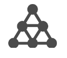

# アトリビューションコンポーネントの設定

アトリビューションを使用すると、成功イベントのクレジットをディメンション項目がどのように取得するかをカスタマイズできます。 次に例を示します。

1. サイトの訪問者が、いずれかの商品ページへの有料検索リンクをクリックします。顧客は商品を買い物かごに追加しますが、購入しません。
2. 次の日、人々は友人の 1 人からのソーシャルメディアの投稿を見る。 顧客がリンクをクリックし、購入を完了します。

一部のレポートでは、注文を有料検索に関連付けることが望まれるかもしれません。他のレポートでは、注文を「ソーシャル」に関連付けることが望まれるかもしれません。アトリビューションを使用すると、レポートのこのような側面を制御できます。

このデータビューコンポーネント設定を使用すると、指標のデフォルトのアトリビューションモデルを設定できます。 Analysis Workspace での作業中に、特定の指標のアトリビューションモデルを上書きできます。

組織で指標に複数のアトリビューション設定が必要な場合は、次のいずれかを実行できます。

* データビューの指標をコピーし、必要なアトリビューション設定をそれぞれ追加します。 1 つのデータビューに同じ指標を複数回含めることができ、各指標に異なる設定を指定できます。 レポートを生成する際に、アナリストがこれらの指標の違いを把握できるように、各指標に適切なラベルを付けてください。
* Analysis Workspaceで指標を上書きします。 指標の [列設定](/help/analysis-workspace/visualizations/freeform-table/column-row-settings/column-settings.md)を選択します。 **[!UICONTROL デフォルト以外のアトリビューションモデルを使用]** を使用して、指標のアトリビューションモデルと、その特定のレポートのルックバックウィンドウを変更できます。

## アトリビューションモデル

アトリビューションモデルは、指標のルックバックウィンドウ内に複数の値が表示される場合に、指標のクレジットを受け取るディメンション項目を決定します。 アトリビューションモデルは、ルックバックウィンドウ内に複数のディメンション項目が設定されている場合にのみ適用されます。 単一のディメンション項目のみが設定されている場合、使用されているアトリビューションモデルに関係なく、そのディメンション項目には 100%のクレジットが与えられます。

| アイコン | アトリビューションモデル | 定義 |
| :---: | :--- | --- |
|  | ラストタッチ | コンバージョンの直前に発生したタッチポイントに 100％のクレジットが与えられます。このアトリビューションモデルは、通常、アトリビューションモデルが特に指定されていない指標のデフォルト値です。 組織は通常、内部検索キーワードの分析など、コンバージョンまでの時間が比較的短いこのモデルを使用します。 |
|  | ファーストタッチ | アトリビューションのルックバックウィンドウ内で最初に確認されたタッチポイントに 100%のクレジットが与えられます。 通常、組織はこのモデルを使用して、ブランド認知度や顧客獲得を把握します。 |
|  | 線形 | コンバージョンにつながるすべてのタッチポイントに対して、同等のクレジットが与えられます。コンバージョンサイクルが長くなる場合や、より頻繁な顧客エンゲージメントが必要な場合に便利です。 組織は通常、モバイルアプリ通知の有効性やサブスクリプションベースの製品を測定する際に、このアトリビューションモデルを使用します。 |
|  | パーティシペーション | 一意のタッチポイントすべてに 100％のクレジットが与えられます。各タッチポイントが 100%のクレジットを受け取るので、指標データは通常、100%を超えるクレジットを加算します。 ディメンション項目がコンバージョンにつながる複数の個別の時間で表示される場合、値は 100%に重複除外されます。 このアトリビューションモデルは、顧客に最も接触しているタッチポイントを把握したい場合に最適です。 メディア組織は通常、このモデルを使用してコンテンツの速度を計算します。 小売組織は通常、このモデルを使用して、サイトのどの部分がコンバージョンに重要かを把握します。 |
|  | 同じタッチ | コンバージョンが発生したヒットと同じヒットに 100%のクレジットが与えられます。 コンバージョンと同じヒットでタッチポイントが発生しない場合、「なし」の下にグループ化されます。このアトリビューションモデルは、アトリビューションモデルがまったくないと見なされる場合があります。 指標がディメンション項目にクレジットを与える方法に影響する他のヒットの値を必要としないシナリオで役立ちます。 製品またはデザインチームは、このモデルを使用して、コンバージョンが発生したページの有効性を評価できます。 |
|  | U 字型 | 最初のインタラクションに 40％のクレジット、最後のインタラクションに 40％のクレジットが与えられ、残りの 20％がその間のタッチポイントに割り振られます。タッチポイントが 1 つのコンバージョンの場合、100％のクレジットが与えられます。タッチポイントが 2 つのコンバージョンの場合、両方に 50％のクレジットが与えられます。このアトリビューションモデルは、最初と最後のインタラクションを最も重視し、その間の追加のインタラクションを完全に却下しない場合に最も適しています。 |
|  | J カーブ | 最後のインタラクションに 60％のクレジット、最初のインタラクションに 20％のクレジットが与えられ、残りの 20％がその間のタッチポイントに割り振られます。タッチポイントが 1 つのコンバージョンの場合、100％のクレジットが与えられます。タッチポイントが 2 つのコンバージョンの場合、最後のインタラクションに 75％のクレジットが与えられ、最初のインタラクションに 25％のクレジットが与えられます。U 字型と同様、このアトリビューションモデルは、最初と最後のインタラクションに優先しますが、最後のインタラクションに大きく優先します。 |
|  | 逆 J 形 | 最初のタッチポイントに 60％のクレジット、最後のタッチポイントに 20％のクレジットが与えられ、残りの 20％がその間のタッチポイントに割り振られます。タッチポイントが 1 つのコンバージョンの場合、100％のクレジットが与えられます。タッチポイントが 2 つのコンバージョンの場合、最初のインタラクションに 75％のクレジット、最後のインタラクションに 25％のクレジットが与えられます。J 字形と同様、このアトリビューションモデルは、最初と最後のインタラクションに優先しますが、最初のインタラクションにはより優先します。 |
|  | タイムディケイ | カスタムの半減期パラメーター（デフォルトは 7 日）で指定される指数関数的減衰に従います。各チャネルの重みは、タッチポイントの開始から最終的なコンバージョンまでの経過時間によって異なります。クレジットの決定に使用される式は `2^(-t/halflife)` です。ここで、`t` は、タッチポイントからコンバージョンまでの時間を表します。その後、すべてのタッチポイントが 100％に正規化されます。特定の重要なイベントに対してアトリビューションを測定するシナリオに最適です。 このイベント後にコンバージョンが発生する時間が長いほど、クレジットは少なくなります。 |
|  | カスタム | ファーストタッチポイント、ラストタッチポイントおよびその間の任意のタッチポイントに与える重みを指定できます。 指定された値は、入力したカスタムの数値の合計が 100 にならなくても、100％に正規化されます。タッチポイントが 1 つのコンバージョンの場合、100％のクレジットが与えられます。タッチポイントが 2 つのインタラクションの場合、中間のパラメーターは無視されます。ファーストタッチポイントとラストタッチポイントは 100％に正規化され、それに応じてクレジットが割り当てられます。このモデルは、アトリビューションモデルを完全に制御し、他のアトリビューションモデルで満たさない特定のニーズを持つアナリストに最適です。 |
|  | アルゴリズム | 統計的手法を使用して、選択した指標の最適なクレジット配分を動的に決定します。アトリビューションに使用されるアルゴリズムは、協同ゲーム理論のハルサニ配当に基づきます。ハルサニ配当は、結果への貢献度が等しくないゲーム内のプレーヤー間でクレジットを分配するためのシャープレイ値ソリューション（ノーベル賞受賞者のエコノミスト、ロイドシャープレイにちなんで名付けられました）の一般化です。 高いレベルでは、アトリビューションは、余剰が平等に分配される必要があるプレーヤーの連合として計算されます。 各連合の余剰分配は、各サブ連合（または以前に参加したディメンション項目）によって以前に再帰的に作成された余剰に従って決定されます。 詳しくは、John Harsanyi と Lloyd Shapley の元の論文を参照してください。 ロイド・S・シェイプリー(1953)。 n 人用ゲームの値&#x200B;*Contributions to the Theory of Games, 2(28)*, 307-317. Harsanyi, John C. (1963).n 人用協力ゲームのシンプル版安価モデル。*International Economic Review 4(2)*, 194-220. |

{style="table-layout:auto"}

## ルックバックウィンドウ

ルックバックウィンドウは、タッチポイントを含めるようにコンバージョンをルックバックする期間です。ディメンション項目がルックバックウィンドウ外で設定されている場合、その値はアトリビューションの計算に含まれません。

* **14 日**:コンバージョンが発生してから最大 14 日間遡ります。
* **30 日**:コンバージョンが発生してから最大 30 日間遡ります。
* **60 日**:コンバージョンが発生してから 60 日まで遡ります。
* **90 日**:コンバージョンが発生してから最大 90 日をさかのぼります。
* **セッション**:コンバージョンが発生したセッションの最初にさかのぼります。 セッションのルックバックウィンドウは変更された [セッションタイムアウト](../create-dataview.md#session-settings).
* **担当者（レポートウィンドウ）**:現在の日付範囲の月の最初までのすべての訪問を調べます。 例えば、レポートの日付範囲が 9 月 15 日から 9 月 30 日までの場合、訪問者のルックバックの日付範囲は 9 月 1 日から 9 月 30 日になります。このルックバックウィンドウを使用すると、ディメンション項目がレポートウィンドウ外の日付に関連付けられていることが時々確認できます。
* **カスタム時間：** コンバージョンが発生した時点からカスタムのルックバックウィンドウを設定できます。 分、時間、日、週、月または四半期の数を指定できます。 例えば、2 月 20 日にコンバージョンが発生した場合、5 日のルックバックウィンドウでは、アトリビューションモデルの 2 月 15 日から 2 月 20 日までのすべてのディメンションタッチポイントが評価されます。

## 例

次の例をご覧ください。

1. 9 月 15 日に、訪問者が有料検索広告を通じてサイトに訪れ、その後退出します。
2. 9 月 18 日には、訪問者は友人から得たソーシャルメディアリンクを通じて再びサイトにアクセスします。訪問者は買い物かごに複数の品目を追加しますが、何も購入しません。
3. 9 月 24 日に、マーケティングチームはこれらのユーザーに対し、買い物かご内の一部の品目に対するクーポンが記載された電子メールを送信します。ユーザーはクーポンを適用しますが、他の複数のサイトを訪問して、利用可能なクーポンがあるかどうかを確認します。ディスプレイ広告で別の広告を見つけ、最終的に 50 ドルで購入します。

ルックバックウィンドウとアトリビューションモデルに応じて、チャネルは異なるクレジットを受け取ります。次に、主な例を示します。

* 使用 **ファーストタッチ** および **セッションルックバックウィンドウ**&#x200B;の場合、アトリビューションは 3 回目の訪問のみを調べます。 電子メールとディスプレイ広告では、電子メールが先だったので、50 ドルの購入に対して 100％のクレジットが電子メールに与えられます。
* 使用 **ファーストタッチ** および **ユーザーのルックバックウィンドウ**&#x200B;の場合、アトリビューションは 3 回の訪問すべてを確認します。 有料検索が最初なので、50 ドルの購入に対して 100％のクレジットが与えられます。
* 使用 **線形** および **セッションルックバックウィンドウ**&#x200B;の場合、クレジットは電子メールとディスプレイ広告で分割されます。 これらのチャネルはどちらも 25 ドルのクレジットを受け取ります。
* 使用 **線形** および **ユーザーのルックバックウィンドウ**、有料検索、ソーシャル、電子メールおよびディスプレイ広告でクレジットが分割されます。 各チャネルは、この購入に対して 12.50 ドルのクレジットを受け取ります。
* 使用 **J 字形** および **ユーザーのルックバックウィンドウ**、有料検索、ソーシャル、電子メールおよびディスプレイ広告でクレジットが分割されます。
   * 60％のクレジット（30 ドル）がディスプレイ広告に与えられます。
   * 20％のクレジット（10 ドル）が有料検索に与えられます。
   * 残りの 20％はソーシャルと電子メールの間で分割され、それぞれに 5 ドルが与えられます。
* 使用 **タイムディケイ** および **ユーザーのルックバックウィンドウ**、有料検索、ソーシャル、電子メールおよびディスプレイ広告でクレジットが分割されます。 デフォルトである 7 日間の半減期を使用する場合：
   * ディスプレイのタッチポイントとコンバージョンの間のギャップが 0 日間。 `2^(-0/7) = 1`
   * 電子メールのタッチポイントとコンバージョンの間のギャップが 0 日間。 `2^(-0/7) = 1`
   * ソーシャルのタッチポイントとコンバージョンの間のギャップが 6 日間。 `2^(-6/7) = 0.552`
   * 有料検索のタッチポイントとコンバージョンの間のギャップが 9 日間。 `2^(-9/7) = 0.41`
   * これらの値を正規化すると、次の結果になります。
      * ディスプレイ広告：33.8％、16.88 ドル
      * 電子メール：33.8％、16.88 ドル
      * ソーシャル：18.6％、9.32 ドル
      * 有料検索：13.8％、6.92 ドル

クレジットが複数のチャネルに属する場合は、通常、整数を持つコンバージョンイベントが分割されます。 例えば、2 つのチャネルが線形アトリビューションモデルを使用して 1 つの注文に貢献する場合、両方のチャネルはその注文の 0.5 を受け取ります。 これらの部分指標は、すべてのユーザーに対して合計され、レポートに最も近い整数に丸められます。
