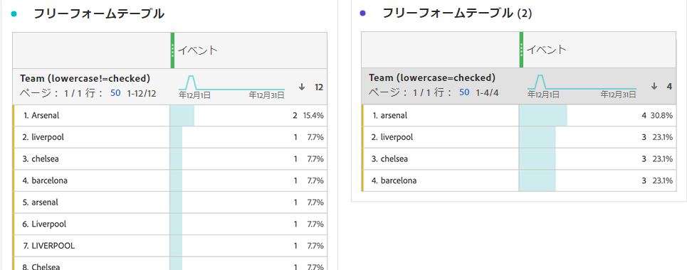

# 動作コンポーネントの設定

動作の設定は、ディメンションと指標の両方で使用できます。使用可能な設定は、コンポーネントタイプやスキーマデータタイプによって異なります。

## ディメンションの動作の設定

| 設定 | 説明 |
| --- | --- |
| [!UICONTROL 小文字] | 値は同じで大文字と小文字が異なる行の重複を排除します。有効にすると、同じ値を持つディメンションのすべてのインスタンスが小文字としてレポートされます。例えば、文字列ディメンションに `"liverpool"`、`"Liverpool"`、`"LIVERPOOL"` の値がデータに含まれているとします。[!UICONTROL 小文字] が有効になっている場合、3 つの値すべてが `"liverpool"` に結合されます。無効にした場合、3 つの値すべてが異なる値として扱われます。 |

>[!NOTE]
>
>ルックアップデータセットディメンションで [!UICONTROL 小文字] を有効にした場合、同じ識別子に対して複数のルックアップ値が存在する可能性があります。この競合が発生した場合、CJA は最初の ASCII 照合値を使用します（大文字の値は小文字の値の前に付きます）。アドビでは、 [!UICONTROL 小文字] が有効になっている場合、同じ値を含むルックアップデータセットの使用はお勧めしません。

## 指標の動作の設定

| 設定 | 説明／使用例 |
| --- | --- |
| [!UICONTROL 値をカウント] | 整数および倍精度スキーマのデータタイプに表示されます。指定した量だけ指標を増やします。例えば、列の値が `50` の場合は、指標の値を 50 増やします。 |
| [!UICONTROL インスタンスをカウント] | 整数および倍精度スキーマのデータタイプに表示されます。値に関係なく、指標を 1 増やします。任意の値が存在すると、指標が増加します。例えば、列の値が `50` の場合は、指標の値を 1 増やします。 |
| [!UICONTROL カウントする値] | ブールスキーマデータタイプに表示されます。`true`、`false`またはその両方をカウントすることで、指標の増加を判断できます。 |

異なる動作をする同じイベントデータセット列を使用して、Analysis Workspace で「注文件数」と「売上高」の両方の指標を生成できます。「売上高」データセット列をデータビューに 2 回ドラッグし、1 つを「カウント値」に、もう 1 つを「カウントインスタンス」に設定します。「注文件数」指標はインスタンス、「売上高」指標は値をカウントします。
