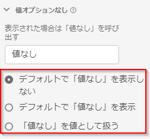

# 値なしオプションコンポーネントの設定 {#no-value-options-component-settings}

<!-- markdownlint-disable MD034 -->

>[!CONTEXTUALHELP]
>id="dataview_component_dimension_novalueoptions"
>title="値なしオプション"
>abstract="ディメンションに値がない場合のデフォルトの動作を設定します。"

<!-- markdownlint-enable MD034 -->

[!UICONTROL 値なしオプション]により、データセット内のイベントに指標が含まれているが、ディメンションに値が含まれていない場合に、Analysis Workspace がどのように処理するかを決定できます。 このディメンション項目の名前を選択したり、完全に非表示にしたり、実際の値として扱ったりできます。

## 設定 {#settings}

| 設定 | 説明 |
| --- | --- |
| **[!UICONTROL 表示された場合は「値なし」を呼び出す]** | **[!UICONTROL 値なし]** ディメンション項目の名前を別の項目に変更できるテキストフィールド。 |
| **[!UICONTROL デフォルトで「値なし」を表示しない]** | レポートでこの値を表示しません。 このディメンションに結び付けられていない指標の回数は、レポートに表示されません。 |
| **[!UICONTROL デフォルトで「値なし」を表示する]** | この値をレポートに表示します。 |
| **[!UICONTROL 「値なし」を値として扱う]** | （数値ディメンションではサポートされません）データ内の空白の値を[!UICONTROL 表示された場合は「値なし」を呼び出す]で指定したテキストに置き換えます。 例えば、モバイルデバイスのタイプをディメンションとして指定した場合、「 **[!UICONTROL 値なし]** 」項目の名前を「デスクトップ」に変更できます。 このフィールドをカスタム値に変更すると、そのカスタム値は正当な文字列値として扱われます。 したがって、このフィールドに「Red」と入力した場合、データそのものに「Red」という文字列が出現すると、指定した同じ行項目に分類されます。 |

## 数値ディメンションでの「値なし」のサポート {#numeric}

数値をディメンションとして使用する場合、次の操作を実行できます。

* データビューで「値なし」オプションを設定する。 上記のすべての設定は、**[!UICONTROL 「値なし」を値として扱うこと]**&#x200B;を除いてサポートされています。
* Workspace のフリーフォームテーブルの数値ディメンションに&#x200B;**[!UICONTROL 「値なし」を含める]**&#x200B;を使用する。
* セグメントビルダーで、**[!UICONTROL exists]**&#x200B;または&#x200B;**[!UICONTROL not exist]**&#x200B;の演算子を使用して、数値ディメンションを指定します。

>[!MORELIKETHIS]
>
>[Adobe Customer Journey Analyticsで「値なし」を処理するための完全なプレイブック &#x200B;](https://experienceleaguecommunities.adobe.com/t5/adobe-analytics-blogs/the-complete-playbook-for-handling-no-value-in-adobe-cja/ba-p/756696?profile.language=ja#M598)。

