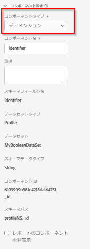

# コンポーネント設定

データビューコンポーネントが使用するコア設定です。

| 設定 | 説明／使用例 |
| --- | --- |
| [!UICONTROL コンポーネントの種類] | 必須。コンポーネントを指標からディメンションに、またはその逆に変更できます。このドロップダウンを変更すると、コンポーネントがそれぞれに含まれているコンポーネント領域に移動します。 |
| [!UICONTROL コンポーネント名] | 必須。Analysis Workspace に表示されるわかりやすい名前を指定できます。コンポーネントの名前を変更して、データビューに固有の名前を付けることができます。 |
| [!UICONTROL 説明] | オプション（推奨）。 コンポーネントに関する情報を他のユーザーに提供します。 |
| [!UICONTROL タグ] | （オプション。Analysis Workspace UI で検索／フィルタリングを行いやすくするために、カスタムタグまたは標準搭載のタグでコンポーネントにタグを付けることができます。 |
| [!UICONTROL フィールド名] | スキーマフィールドの名前。 |
| [!UICONTROL データセットタイプ] | 必須。コンポーネントの元となるデータセットタイプ（イベント、参照、プロファイル）を示す編集不可のフィールド。 |
| [!UICONTROL データセット] | コンポーネントの元のデータセットを示す編集不可のフィールド。 このフィールドには、複数のデータセットを含めることができます。 |
| [!UICONTROL スキーマデータタイプ] | コンポーネントのデータタイプを示す編集不可のフィールド。 Platform では、サポートされているスキーマフィールドタイプを使用できますが、CJA でサポートされていないフィールドタイプもあります。 次のデータタイプがサポートされています。`Integer`、`Int`、`Long`、`Double`、`Float`、`Number`、`Short`、`Byte`、`String` および `Boolean` です。 現時点では、ルックアップデータセットでは `String` スキーマデータタイプのみを使用できます。 |
| [!UICONTROL コンポーネント ID] | 必須。[CJA API](https://adobe.io/cja-apis/docs)は、このフィールドを使用してコンポーネントを参照します。データビューの各コンポーネントは、一意である必要があります。アドビは、各コンポーネントの ID を自動的に生成します。ただし、編集アイコンをクリックして、コンポーネント ID を変更することはできます。コンポーネント ID を変更すると、このコンポーネントを含む既存のワークスペースプロジェクトがすべて機能しなくなります。単一のデータビュー内では各コンポーネントに一意の ID が必要ですが、他のデータビュー内では同じコンポーネント ID を使用できます。 他のデータビューで同じコンポーネント ID を使用すると、データビューをまたいでワークスペースプロジェクトに互換性を持たせることができます。 |
| [!UICONTROL スキーマのパス] | 必須。コンポーネントの元となるスキーマパスを示す編集不可のフィールド。 |
| [!UICONTROL レポートのコンポーネントを非表示] | 管理者以外のユーザー向けデータビューからコンポーネントをキュレートできます。 管理者は、Analysis Workspace プロジェクトで「[!UICONTROL すべてのコンポーネントを表示]」をクリックしてアクセスできます。 |
