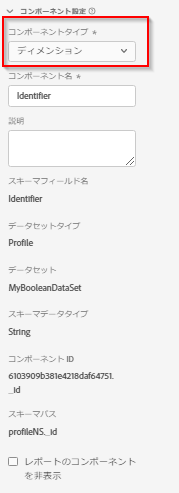

# コンポーネント設定 {#component-settings}

<!-- markdownlint-disable MD034 -->

>[!CONTEXTUALHELP]
>id="dataview_component_settings"
>title="コンポーネント設定"
>abstract="名前、説明、コンポーネントに関連するその他の設定を表示および設定します。 このボックスをオンにすると、レポートで管理者以外のユーザーに対してこのコンポーネントが非表示になります。 管理者は、Workspace プロジェクトで「**[!UICONTROL すべてのコンポーネントを表示]**」を選択して、コンポーネントにアクセスできます。"

<!-- markdownlint-enable MD034 -->

<!-- markdownlint-disable MD034 -->

>[!CONTEXTUALHELP]
>id="dataview_component_contextlabels"
>title="コンテキストラベル"
>abstract="コンテキストラベルを削除すると、コンポーネントが必要な特定のパネルまたはレポートに影響を与える可能性があります。"

<!-- markdownlint-enable MD034 -->

次の情報では、データビューコンポーネントが使用する設定について説明します。

| 設定 | 説明／使用例 |
| --- | --- |
| [!UICONTROL コンポーネントの種類] | 必須。 コンポーネントを指標からDimensionまたはその逆に変更できます。 このドロップダウンの選択を変更すると、コンポーネントがそれぞれに含まれているコンポーネント領域で変更します。 |
| [!UICONTROL &#x200B; コンポーネント名] | 必須。 Analysis Workspace に表示されるわかりやすい名前を指定できます。 コンポーネントの名前を変更して、データビューに固有の名前を付けることができます。 |
| [!UICONTROL 説明] | オプション（推奨）。 コンポーネントに関する情報を他のユーザーに提供します。 |
| [!UICONTROL タグ] | （任意）。 Analysis Workspace UIでの検索やフィルタリングを容易にするために、カスタムタグまたは標準のタグを使用してコンポーネントにタグを付けることができます。 |
| [!UICONTROL コンテキストラベル] | （任意）。 コンポーネントに適用できる、利用可能なシステム定義[&#x200B; コンテキストラベル &#x200B;](#context-labels)のドロップダウンメニュー。 |
| [!UICONTROL スキーマフィールド名] | スキーマフィールドの名前。 |
| [!UICONTROL データセットタイプ] | 必須。 コンポーネントの元となるデータセットタイプ（イベント、参照、プロファイル）を示す編集不可のフィールド。 |
| [!UICONTROL データセット] | コンポーネントの元のデータセットを示す編集不可のフィールド。 このフィールドには、複数のデータセットを含めることができます。 |
| [!UICONTROL スキーマタイプ] | コンポーネントのデータタイプを示す編集不可のフィールド。 Platform では、サポートされているスキーマフィールドタイプを使用できますが、Customer Journey Analytics でサポートされていないフィールドタイプもあります。 次のデータタイプがサポートされています。`Integer`、`Int`、`Long`、`Double`、`Float`、`Number`、`Short`、`Byte`、`String` および `Boolean` です。 現在、ルックアップデータセットでは `String` スキーマデータタイプのみを使用できます。 |
| [!UICONTROL コンポーネント ID] | 必須。 [Customer Journey Analytics API](https://www.adobe.io/cja-apis/docs) は、このフィールドを使用してコンポーネントを参照します。 データビューの各コンポーネントは、一意である必要があります。 アドビは、各コンポーネントの ID を自動的に生成します。ただし、編集アイコンをクリックして、コンポーネント ID を変更することはできます。 コンポーネント ID を変更すると、このコンポーネントを含む既存の Workspace プロジェクトがすべて機能しなくなります。 単一のデータビュー内では各コンポーネントに一意の ID が必要ですが、他のデータビュー内では同じコンポーネント ID を使用できます。 他のデータビューで同じコンポーネント ID を使用すると、データビューをまたいで Workspace プロジェクトに互換性を持たせることができます。  プロファイルとルックアップベースのコンポーネントの場合、コンポーネント ID には、データセット ID に基づく ID 接頭辞が付きます（例：`642b28fcc1f0ee1c074265a0.person.name.firstName`）。 Workspace プロジェクトでプロファイルやルックアップベースのコンポーネント（`person.name.firstName` など）を再利用し、このコンポーネントを様々なデータビューで設定する場合は、データビュー全体で確実にコンポーネント ID を一意の名前に変更します（`myUniqueID.person.name.firstName` など）。 |
| [!UICONTROL パス] | 必須。 コンポーネントの元となるスキーマパスを示す編集不可のフィールド。 |
| [!UICONTROL データ使用状況ラベル] | Adobe Experience Platformでこのコンポーネントに割り当てられているデータ使用ラベル。 [詳細情報](/help/data-views/data-governance.md)。 |
| [!UICONTROL レポートでコンポーネントを非表示] | 管理者以外のユーザーのデータビューからコンポーネントをキュレートできます。 管理者は、Analysis Workspace プロジェクトで「[!UICONTROL すべてのコンポーネントを表示]」をクリックしてアクセスできます。 |

{style="table-layout:auto"}

>[!BEGINSHADEBOX]

デモビデオについて詳しくは、 [コンポーネントタイプ設定](https://experienceleague.adobe.com/en/docs/customer-journey-analytics-learn/tutorials/data-views/component-type-settings-in-data-views){target="_blank"}を参照してください。

>[!ENDSHADEBOX]

## コンテキストラベル

コンテキストラベルは、データビュー内のコンポーネントに適用されるシステム定義のタグです。 コンテキストラベルがコンポーネント（ディメンションまたは指標）に適用される場合、Customer Journey Analyticsは、特定のビジュアライゼーションまたは機能で、これらのコンテキストラベル付きコンポーネントを自動的に使用するように指示されます。

コンテキストラベルを使用すると、個々のデータにセマンティックコンテキストを提供できます。  一般的に、Customer Journey Analyticsは、分析を実行するためにディメンションまたは指標のセマンティックな意味を知る必要はありません。  ただし、一部の状況（プロジェクトテンプレートと一部の選択したビジュアライゼーション）では、Customer Journey Analyticsが何らかの種類の分析を実行する際にセマンティックな意味を理解する必要があります。 このような状況にはコンテキストラベルが作成されます。

コンテキストラベルはコンポーネント（ディメンションまたは指標）レベルで動作し、顧客のデータビュー内で大きな柔軟性を実現します。 例えば、複数の後処理変換をフィールドに適用した後で、コンテキストラベルをディメンションに割り当てることができます。 派生フィールドに基づくディメンションにも適用できます。  コンテキストラベルは、コンポーネントとフィールドの上に抽象化のレイヤーを提供します。

利便性のために、特定のXDM パスを持つフィールドに基づいて、スマートデフォルトのコンテキストラベルがコンポーネントに自動的に適用されます。 例えば、**[!UICONTROL Commerce:Product Category]** コンテキストラベルは、`productListItems.productCategories.categoryName` スキーマパスに基づく&#x200B;**[!UICONTROL Category name]** ディメンションに自動的に適用されます。 ただし、コンテキストラベルは問題なく別のコンポーネントに移動できます。

Adobeが提供するプロジェクトテンプレートを合理化するために、Journey OptimizerやContent Analyticsなどの複数の統合機能が、すぐに利用できるコンポーネントを特定の方法で構築するデータビューを設定します。 適切なコンテキストラベルが自動的に適用されます。 繰り返しますが、これらのコンテキストラベルをデータビューで作成された他のコンポーネントに移動するだけで、カスタムコンポーネントが代わりに使用されます。

コンテキストラベルは、プロジェクトテンプレートの公開にも関連しています。 プロジェクトテンプレートを利用すれば、いくつかの用途に特化したユースケースのレポート基盤をすばやく構築できます。 ただし、すべてのテンプレートがあらゆるデータビューに対して意味があるわけではなく、該当しないテンプレートを表示しないようにします。 コンテキストラベルは、選択したデータビューにコンテキストラベルが含まれているかどうかに基づいてテンプレートを表示するために使用されます。  データビュー（コンポーネント）にさらにコンテキストラベルを追加するだけで、より多くのテンプレートが利用できるようになります。 特定のテンプレートを非表示にすることもできます。

>[!NOTE]
>
>1つのコンポーネントに複数のコンテキストラベルを適用することはできますが、1つのデータビュー内の複数のコンポーネントに1つのコンテキストラベルを適用することはできません。
>

コンテキストラベルの利点は次のとおりです。

* **利便性**：すべてのパネルまたはビジュアライゼーションで同じコンポーネントを再選択する必要はありません。
* **機能のロックを解除**：一部のビジュアライゼーション（[&#x200B; マップ &#x200B;](/help/analysis-workspace/visualizations/map.md)など）では、どのコンポーネントが緯度と経度であるかに関する知識が必要です。 コンテキストラベルを割り当てると、その情報がビジュアライゼーションに公開されます。
* **一貫性**：組織内で、コンテキストラベルを使用するデータビューに基づく1つ以上のプロジェクトで作業する全員が、同じ動作を得ます。
* **機能とテンプレートの表示**：特定のビジュアライゼーションと機能は、適切なコンテキストラベルが割り当てられている場合にのみ表示されます。 次に例を示します。

   * Customer Journey Analyticsが緯度と経度を表すコンポーネントを認識している場合にのみ、[&#x200B; マップ &#x200B;](/help/analysis-workspace/visualizations/map.md)のビジュアライゼーションが適切に表示されます。
   * 特定の[&#x200B; テンプレート &#x200B;](/help/analysis-workspace/templates/use-templates.md)は、正しいコンテキストラベルが適用され、関連するコンポーネントが使用可能になった場合にのみ表示されます。

コンテキストラベルは、次の状況で必要になる場合があります。

* コンポーネントのセットを定義するには、Analysis Workspace プロジェクトの[実験パネル &#x200B;](/help/analysis-workspace/c-panels/experimentation.md)を使用して実験レポートで使用できます。

  詳しくは、[Journey Optimizer との統合](/help/integrations/ajo.md#data-view)および[ターゲットレポート](/help/integrations/at.md)を参照してください。

* コンポーネントのセットを定義するには、Analysis Workspace プロジェクトの[Map](/help/analysis-workspace/visualizations/map.md) ビジュアライゼーション内で使用できます。

  詳しくは、[Map](/help/analysis-workspace/visualizations/map.md)の「[&#x200B; データビューにコンテキストラベルを追加](/help/analysis-workspace/visualizations/map.md#add-context-labels-in-data-views)」を参照してください。

  **注意**: マップ ビジュアライゼーションはリリースの限定テスト フェーズにあり、お使いの環境ではまだ利用できない可能性があります。

* Adobe[&#128279;](/help/analysis-workspace/templates/use-templates.md)が提供する テンプレートを表示します。 Adobeが提供する一部のテンプレートは、特定のコンポーネントがデータビューに表示されないため、機能しない場合があります。

  欠落している各コンポーネントに対して、一致するコンテキストラベルがデータビューで使用できます。 一致するコンテキストラベルを、既にデータビューにあるコンポーネントに追加する必要があります。 または、新しいコンポーネントをデータビューに追加し、コンテキストラベルをコンポーネントに追加する必要があります（まだ自動的に指定されていない場合）。

  詳しくは、[テンプレートの作成と管理](/help/analysis-workspace/templates/create-templates.md)の記事の[特定のテンプレートのデータビューへの欠落しているコンポーネントの追加](/help/analysis-workspace/templates/create-templates.md#add-missing-components-to-the-data-view-for-a-given-template)を参照してください。

次のコンテキストラベルのグループを使用できます。各グループには、特定のコンテキストラベルのリストが含まれています。

+++ キャンペーン

| 名前 | 説明 |
|------|-------------|
| トラッキングコード | トラッキングコード。 |
| トラッキングコードインスタンス | コードインスタンスのトラッキング： |

+++

+++ コマース

| 名前 | 説明 |
|------|-------------|
| 買い物かごへの追加 | 買い物かごへの追加 |
| 買い物かごが開かれた回数 | カートが開きます。 |
| 買い物かごからの削除 | 買い物かごからの削除 |
| 買い物かご表示 | 買い物かご表示 |
| チェックアウト | 決済プロセス： |
| 注文件数 | 注文： |
| 製品 | 製品： |
| 製品カテゴリ | 製品カテゴリ。 |
| 製品閲覧数 | 製品ビュー： |
| 売上高 | 収益： |
| ストア | を。 |
| 単位 | ユニット： |

+++

+++ 実験

| 名前 | 説明 |
|------|-------------|
| 実験的な実験 | 実験とは、エンドユーザーに公開されたエクスペリエンスのバリエーションをセットで指定し、どれを永続化するのが最適かを判断するものです。 |
| 実験バリアント | バリアントとは、エンドユーザーのエクスペリエンスにおいて、より優れた選択肢を特定するために比較される 2 つ以上の選択肢の 1 つです。 |

+++

+++ メディア

| 名前 | 説明 |
|------|-------------|
| [&#x200B; コンテンツ ID](https://experienceleague.adobe.com/en/docs/media-analytics/using/reporting/dimensions/content) | 再生されるコンテンツの一意のID。 [&#x200B; メディア平均分視聴者数](/help/analysis-workspace/c-panels/average-minute-audience-panel.md) パネルの&#x200B;**[!UICONTROL コンテンツ ID]** ラジオボタンを有効にします。 |
| [&#x200B; コンテンツ滞在時間](https://experienceleague.adobe.com/en/docs/media-analytics/using/reporting/metrics/content-time-spent) | 広告を除くコンテンツの閲覧にかかった時間。 [&#x200B; メディア平均分視聴者](/help/analysis-workspace/c-panels/average-minute-audience-panel.md) パネルの&#x200B;**[!UICONTROL コンテンツ滞在時間]**&#x200B;詳細設定を有効にします。 |
| [&#x200B; エピソード &#x200B;](https://experienceleague.adobe.com/en/docs/media-analytics/using/reporting/dimensions/episode) | シリーズ内のエピソード番号 [&#x200B; メディアの平均分視聴者数](/help/analysis-workspace/c-panels/average-minute-audience-panel.md) パネルで、エピソード別のフィルタリングを有効にします。 |
| イベントタイプ | `media.play`や`media.ping`などのメディアイベントタイプ。 Customer Journey Analyticsで[&#x200B; メディア同時視聴者数](/help/analysis-workspace/c-panels/media-concurrent-viewers.md)の派生指標を計算するために必要です。 |
| [&#x200B; メディア滞在時間](https://experienceleague.adobe.com/en/docs/media-analytics/using/reporting/metrics/media-time-spent) | コンテンツ、広告、バッファリング、一時停止などの合計時間。 [&#x200B; メディア平均分オーディエンス &#x200B;](/help/analysis-workspace/c-panels/average-minute-audience-panel.md) パネルの[&#x200B; メディア再生時間](/help/analysis-workspace/c-panels/media-playback-time-spent.md) パネルと&#x200B;**[!UICONTROL メディア滞在時間]**&#x200B;詳細設定を有効にします。 |
| [&#x200B; シーズン &#x200B;](https://experienceleague.adobe.com/en/docs/media-analytics/using/reporting/dimensions/season) | シリーズ内の季節番号。 [&#x200B; メディアの平均分視聴者数](/help/analysis-workspace/c-panels/average-minute-audience-panel.md) パネルで、季節ごとのフィルタリングを有効にします。 |
| 前回の呼び出しからの経過時間（秒） | 前回のハートビート pingからの秒単位の時間。 Customer Journey Analyticsで[&#x200B; メディア同時視聴者数](/help/analysis-workspace/c-panels/media-concurrent-viewers.md)派生指標を計算するために必要です。この指標は、セッションが引き続きアクティブな場合を識別します。 |
| [表示](https://experienceleague.adobe.com/en/docs/media-analytics/using/reporting/dimensions/show) | プログラムまたはシリーズ名。 [&#x200B; メディア分平均オーディエンス &#x200B;](/help/analysis-workspace/c-panels/average-minute-audience-panel.md) パネルでの表示別フィルタリングを有効にします。 |
| [開始までの時間](https://experienceleague.adobe.com/en/docs/media-analytics/using/reporting/metrics/time-to-start) | コンテンツの選択から再生が開始されるまでの時間。 [&#x200B; メディア再生時間](/help/analysis-workspace/c-panels/media-playback-time-spent.md)の計算に含まれています。 |
| [合計バッファー期間](https://experienceleague.adobe.com/en/docs/media-analytics/using/reporting/metrics/total-buffer-duration) | セッション中にバッファリングに費やされた合計時間。 [&#x200B; メディア再生時間](/help/analysis-workspace/c-panels/media-playback-time-spent.md)の計算に含まれています。 |
| [合計一時停止の期間](https://experienceleague.adobe.com/en/docs/media-analytics/using/reporting/metrics/total-pause-duration) | セッション中に一時停止された合計時間。 [&#x200B; メディア再生時間](/help/analysis-workspace/c-panels/media-playback-time-spent.md)の計算に含まれています。 |
| [&#x200B; ビデオの長さ](https://experienceleague.adobe.com/en/docs/media-analytics/using/reporting/dimensions/content-length) | コンテンツのデュレーション（秒単位）: [&#x200B; メディア平均分視聴者](/help/analysis-workspace/c-panels/average-minute-audience-panel.md) パネルの&#x200B;**[!UICONTROL 特定コンテンツ]** モードに必要です。 |
| [&#x200B; ビデオ名](https://experienceleague.adobe.com/en/docs/media-analytics/using/reporting/dimensions/content-name) | コンテンツの表示名。 [&#x200B; メディア平均分視聴者数](/help/analysis-workspace/c-panels/average-minute-audience-panel.md) パネルの&#x200B;**[!UICONTROL ビデオ名]** ラジオボタンを有効にします。 |

+++

+++ コールセンター

| 名前 | 説明 |
|------|-------------|
| コールセンター名 | コールセンター名。 |
| 通話コスト | コールコスト： |
| 通話時間 | 通話時間： |
| 通話の長さ | 呼び出しの長さ： |
| 通話理由 | 通話理由。 |
| 通話調査スコア | アンケートのスコアを活用。 |
| 通話 | 電話： |

+++

+++ デモグラフィック

| 名前 | 説明 |
|------|-------------|
| 性別 | 性別： |

+++

+++ 環境

| 名前 | 説明 |
|------|-------------|
| ブラウザー | ブラウザー： |
| ブラウザータイプ | ブラウザーの種類： |
| 言語 | 言語： |
| オペレーティングシステム | オペレーティングシステム： |
| オペレーティングシステムグループ | オペレーティングシステムのグループ： |
| オペレーティングシステム名 | オペレーティングシステム名。 |

+++

+++ 一般

| 名前 | 説明 |
|------|-------------|
| アクション名 | アクション名。 |
| アクション | 行動： |
| インタラクションチャネル | インタラクションチャネル： |

+++

+++ ジオ

| 名前 | 説明 |
|------|-------------|
| 地域 - 都市 | ジオシティ： |
| 地域 - 国 | 地域レベル： |
| 地域 - DMA | 位置情報： |
| 地域 | 地域： |
| 緯度 | 自由度： |
| 経度 | 経度： |
| 目標地点 | ポイントオブインタレスト（POI）: |
| 都道府県 | 都道府県： |

+++

+++ マーケティングチャネル

| 名前 | 説明 |
|------|-------------|
| ファーストタッチチャネル | ファーストタッチチャネル： |
| ファーストタッチチャネルの詳細 | ファーストタッチチャネルの詳細： |
| ラストタッチチャネル | ラストタッチチャネル： |
| ラストタッチチャネルの詳細 | ラストタッチチャネルの詳細： |
| マーケティングチャネル | マーケティングチャネル： |

+++

+++ モバイル

| 名前 | 説明 |
|------|-------------|
| アプリケーション ID | アプリケーション ID。 |
| 携帯電話会社 | 携帯電話会社： |
| モバイルクラッシュ回数 | モバイルクラッシュ。 |
| モバイルデバイス名 | モバイルデバイス名。 |
| モバイルデバイスタイプ | モバイルデバイスタイプ： |
| モバイルアプリ内メッセージ名 | アプリ内モバイルメッセージ名。 |
| モバイルインストール数 | モバイルインストール： |
| モバイルの起動回数 | モバイルの立ち上げ： |
| モバイルの製造元 | モバイルメーカー： |
| モバイルメッセージキャンセル数 | モバイルメッセージのキャンセル： |
| モバイルメッセージクリック数 | モバイルメッセージのクリック数： |
| モバイルメッセージインプレッション数 | モバイルメッセージのインプレッション： |
| モバイルメッセージプッシュオプトイン | モバイルメッセージのプッシュオプトイン： |
| モバイルプッシュメッセージ名 | モバイルプッシュメッセージ名。 |
| モバイルアップグレード回数 | モバイルのアップグレード： |
| 計測されたアクションごとの所要時間 | 時間付きアクションあたりの滞在時間。 |

+++

+++ 検索

| 名前 | 説明 |
|------|-------------|
| 検索エンジン | 検索エンジン： |
| 検索エンジンキーワード | 検索エンジンのキーワード： |
| 検索エンジン自然 | 検索エンジン。 |
| 検索エンジン自然キーワード | 検索エンジンの自然なキーワード。 |
| 検索エンジン有料 | 検索エンジンは有料。 |
| 検索エンジン有料キーワード | 検索エンジンの有料キーワード： |

+++

+++ 調査

| 名前 | 説明 |
|------|-------------|
| 調査 | 調査： |
| 調査の回答 | アンケートへの回答： |
| 調査の完了 | 調査が完了しました。 |
| 調査の質問 | 調査の質問： |
| 調査の開始 | 調査が始まります。 |

+++

+++ Web

| 名前 | 説明 |
|------|-------------|
| ページでの平均滞在時間 | 平均ページ時間： |
| バウンス | バウンス： |
| 入口ページ | 入口ページ。 |
| 出口ページ | 出口ページ： |
| ページ | ページ： |
| ページビュー数 | ページビュー： |
| リファラー | リファラー： |
| リファラータイプ | リファラータイプ： |
| 参照ドメイン | 参照ドメイン： |
| 参照ドメインオリジナル | ドメインのオリジナルを参照しています。 |
| リロード回数 | リロード： |
| 単一ページ訪問数 | シングルページ訪問： |
| サイトセクション | サイトのセクション： |

+++

+++ B2B

| 名前 | 説明 |
|------|-------------|
| アカウント名 | アカウント名： |
| 購買グループ名 | 購買グループ名 |
| 商談名 | 商談名 |

+++

+++ Content Analytics

| 名前 | 説明 |
|------|-------------|
| アセットの絶対左 | アセット絶対左： |
| アセットの絶対上 | アセットの絶対上位。 |
| アセット属性 | アセット属性： |
| アセット背景色 | アセットの背景色： |
| アセットカメラ位置 | アセットカメラの位置： |
| アセットカメラ近接性 | アセットカメラの近接： |
| アセットカメラ設定 | アセットカメラの設定： |
| アセットのクリック数 | アセットのクリック |
| アセット作成者 | によって作成されたアセット。 |
| アセット作成日 | アセット作成日：e |
| アセット表示の高さ | アセット表示の高さ： |
| アセット表示の幅 | アセットの表示幅： |
| アセット前景色 | アセットの描画色： |
| アセット ID | アセット Id。 |
| アセット画像タイプ | アセット画像のタイプ： |
| アセット最終更新者 | アセットが最終更新されました。 |
| アセット最終更新日 | アセットの最終更新日。 |
| アセット照明条件 | アセットの照明条件。 |
| アセットリンク URL | アセットリンクのUrl: |
| アセット名 | アセット名。 |
| アセット人物カテゴリ | アセットの人物カテゴリ。 |
| アセット認識 ID | 認識的に同じアセットの一意の ID。 |
| アセットフォトスタイル | アセット写真のスタイル： |
| アセットシーン | アセットのシーン： |
| アセットソース | Asset Source: |
| アセットタグ | アセットタグ： |
| アセットタイプ | アセットタイプ： |
| アセットビュー数 | アセットビュー： |
| アセット視覚的注意の拡散 | アセットの視覚的な拡散： |
| アセットビジュアルコンテンツ密度 | アセットのビジュアルコンテンツ密度： |
| エクスペリエンス属性 | エクスペリエンス属性： |
| エクスペリエンスチャネル | エクスペリエンスチャネル： |
| エクスペリエンスのクリック数 | エクスペリエンスのクリック数： |
| エクスペリエンスの絵文字数 | 絵文字数を体験しましょう。 |
| エクスペリエンスハッシュタグ数 | エクスペリエンスのハッシュタグ数： |
| エクスペリエンスの水平方向の割合の深度 | 水平方向のパーセンテージ深度を体験します。 |
| エクスペリエンスキーワード | エクスペリエンスのキーワード： |
| エクスペリエンスのマーケティング感情 | マーケティング感情の体験： |
| エクスペリエンスのナラティブ数 | 体験のストーリー： |
| エクスペリエンス説得戦略 | エクスペリエンス説得戦略。 |
| 文章数あたりのエクスペリエンス読みやすさの単語数 | 文章数あたりの読みやすさの単語数。 |
| エクスペリエンスの読みやすさスコア | エクスペリエンスの読みやすさスコア： |
| エクスペリエンスの読みやすい文の数 | エクスペリエンスの読みやすさの文数。 |
| エクスペリエンスの読みやすいストップワード数 | エクスペリエンスの読みやすさストップワード数。 |
| エクスペリエンスの読みやすいテキスト引用数 | エクスペリエンスの読みやすさのテキスト引用符の数。 |
| エクスペリエンスの読みやすい語数 | 読みやすい文字数： |
| エクスペリエンスソース | Sourceを体験しましょう。 |
| エクスペリエンスのトーン | エクスペリエンスのトーン： |
| エクスペリエンスの垂直方向の割合の深度 | 垂直比率の深度を体験します。 |
| エクスペリエンスビュー数 | エクスペリエンスビュー： |

+++

+++ Journey Optimizer

| 名前 | 説明 |
|------|-------------|
| アクションエラー (AJO) | ジャーニーアクションによって生成されたエラーの数。 |
| アクション実行エラー | ジャーニーの実行時にアクションを実行できないエラー条件。 |
| アクションラベル（AJO） | エンドユーザーが操作した要素の顧客が生成した表示名。 |
| 別の離脱 (AJO) | プロファイルが終了ノードに到達したか、エラーによって失敗したために発生しなかった離脱の数。 |
| アプリのインストール数（AJO） | アプリのインストール数。 |
| アプリの起動回数 (AJO) | モバイルアプリの起動回数。 |
| バッチ ID（AJO） | スケジュールされたジャーニーまたはキャンペーンアクションの新しい各バッチインスタンスの呼び出し時に作成される GUID。 例えば、スケジュールされたジャーニーまたはCampaign Actionが午前8.00時と午前10.00時に実行される場合、2つの異なるbatchInstanceIDがあります。 |
| バッチインスタンスのタイムスタンプ（AJO) | バッチインスタンスのタイムスタンプ |
| アウトバウンドチャネルのバウンス (非推奨) | アウトバウンドチャネルでバウンスされたメッセージの合計数。 |
| キャンペーンアクション名 (AJO) | キャンペーンアクション名。 |
| キャンペーン ID（AJO） | キャンペーンの ID。 |
| キャンペーン名（AJO） | キャンペーンの名前。 |
| キャンペーンバージョン ID（AJO） | キャンペーンのバージョン ID。 |
| チャネル | このデータを相関させる必要があるチャネル。 |
| クリック数 (AJO) | すべてのチャネルでのクリックの合計数 |
| 同意ポリシーの却下 (AJO) | 1つ以上の同意ポリシーが原因で拒否されたジャーニーアクションの数。 |
| コンテンツ決定エラー (AJO) | ジャーニーのコンテンツ決定ノードによって生成されたエラーメッセージ。 |
| コンテンツ決定エラー (AJO) | ジャーニーのコンテンツ決定ノードによって生成されたエラーの数。 |
| コンテンツ決定ノード名 (AJO) | ジャーニーのコンテンツ決定ノード名。 |
| 相関 ID | 相関関係ID。 |
| オファー数 (AJO) | 提案書のオファー項目の数。 |
| 決定項目バインディングキー | 項目IDとExperience Decisioning リクエスト IDを組み合わせた複合識別子。インタラクション全体でデータの永続性を有効にします。 |
| 決定プロバイダー (AJO) | 決定を下すように依頼されたプロバイダー。 このディメンションは、複数のサービスが同じプレースメントまたはアクティビティに対して決定を行うことができる場合に使用されます。 |
| 決定プロバイダー (永続) (AJO) | 永続性バインディングが有効になっている決定プロバイダー。 |
| 決定ポリシー ID（AJO） | この提案に含める項目を決定する際に使用する決定ポリシーの ID。 |
| 重複排除の指標 (AJO) | 重複排除メトリック。 |
| 配信済み (非推奨) | 配信されたメッセージの合計数 |
| 表示数 (AJO) | このカウントは、AJO メッセージを表示します。 これには、電子メールの開封数、web ディスプレイ数、アプリのディスプレイ数が含まれます。 モバイルプラットフォームでは、SMSとプッシュメッセージが表示されないため、カウントされません。 |
| 却下済み (AJO) | エンドユーザーが選択して閉じたアクションに関係なく、Adobe SDK によってアプリ内メッセージが閉じられるたびにカウントします。 |
| ドライラン ID (AJO) | ドライランの一意の識別子。 |
| メールボット開封数 (AJO) | ボットが実行したメール開封数の合計。 |
| メール開封数（AJO） | メール開封数の合計。 |
| メール受信者ドメイン（AJO） | メールアドレスのドメイン。 |
| メールの件名 | パーソナライズされていないメール件名。 |
| イベント ID | 時系列イベントの一意の ID。 |
| 終了条件 ID（AJO） | ジャーニーを終了するかどうかを決定する際に使用される終了条件の ID。 |
| 終了条件名（AJO） | 終了条件の名前。 |
| 実験 ID（AJO） | 実験の ID。 |
| 実験名（AJO） | 実験の名前。 |
| フォールバックオファー数 (AJO) | フォールバックオファーの数。 |
| エラーを取得 | ジャーニーの実行時に取得を実行できないエラー条件。 |
| インバウンドクリック数（AJO） | インバウンドチャネルにおけるクリック数の合計。 |
| インバウンド却下数（AJO） | インバウンドチャネルでの合計配信数。 |
| インバウントインプレッション数（AJO） | インバウンドチャネルをまたいだインプレッションの合計数。 |
| インバウンド送信数 (AJO) | インバウンドチャネルをまたいだ合計送信数。 |
| トリガーされたインバウンド (AJO) | 提案書はAdobe・SDKによって展示されることに決まった。 その他の要因により、実際に表示されない場合があります。 |
| 最適化された送信時間です (AJO) | メッセージ実行はSendTimeOptimizedですか？ |
| テストジャーニーです | イベントはテストジャーニー実行の一部ですか？ |
| テストメッセージです (AJO) | メッセージはテスト実行として送信されますか？ |
| 項目 ID (永続) (AJO) | 永続性バインディングが有効になっている項目の ID。 |
| 項目 ID (AJO) | 項目の ID。 |
| 項目名 (AJO) | 項目の名前。 |
| 項目名 (永続) (AJO) | 永続性バインディングが有効になっている項目の名前。 |
| ジャーニーアクションのエラー (AJO) | ジャーニーアクションによって生成されたエラーメッセージ |
| ジャーニーアクションノード名 | ジャーニーアクションのノード名。 |
| ジャーニーエントリ | ステップイベントがプロファイルのジャーニーエントリイベントであった場合は True。 |
| ジャーニーの終了 (AJO) | ジャーニーの終わり。 |
| ジャーニーイベントノード名 | この値は、ジャーニーでセグメントまたは外部イベントが発生するたびに設定されます。 |
| ジャーニーの除外理由 | ジャーニーインスタンスの除外の理由。 |
| ジャーニーの除外ルール名 | ジャーニー加入拒否の原因となったルールの名前。 |
| ジャーニーの除外 (AJO) | 現在のステップイベントがプロファイルのジャーニーの破棄につながったかどうかを示します。 これは通常、キャッピングまたは同時実行ルールが適用されていることが原因で発生し、ジャーニーがさらに進行するのを防ぎます。 |
| ジャーニー離脱のタイプ (AJO) | ジャーニーインスタンスで発生した離脱のタイプ。 |
| ジャーニーの失敗 | 実行を終了したステップの現在の状態を示します。 |
| ジャーニー ID | ジャーニーの ID。 |
| ジャーニー名 | ジャーニーの名前。 |
| ジャーニー名とバージョン | ジャーニーの名前とバージョン。 |
| ジャーニーバージョン ID | ジャーニーのバージョン ID。 |
| JourneyExits | 現在のステップにより、ジャーニーのインスタンスが終了した場合は True。 つまり、特定のプロファイルのジャーニーの最後のステップが正常に実行されたことになります。 |
| ランディングページコンバージョン数 (AJO) | ランディングページのコンバージョンの合計数。 |
| ランディングページ ID (AJO) | ランディングページの一意の ID |
| ランディングページソース (AJO) | ランディングページのソース。 |
| ランディングページビュー数 (AJO) | ランディングページのビューの合計数。 |
| ランディングページクリック数 (AJO) | ランディングページのクリックの合計数 |
| リンク URL (AJO) | ユーザーがクリックした URL。 |
| メッセージバウンスの理由 (AJO) | メッセージバウンスの理由。 |
| メッセージエラーの理由 (AJO) | メッセージエラーの理由 |
| メッセージの除外理由（AJO） | 除外の理由。 |
| メッセージ失敗カテゴリ (AJO) | 失敗カテゴリ : |
| メッセージ失敗の理由 (AJO) | 失敗の理由。 |
| メッセージ失敗タイプ (AJO) | 失敗タイプ。 |
| メッセージ ID (AJO) | このデータを相関させる必要があるメッセージ ID。 |
| メッセージ言語 (AJO) | メッセージの言語。 |
| メッセージ名 (AJO) | メッセージの名前。 |
| メッセージの再試行 (AJO) | 再試行回数： |
| メッセージステータス (AJO) | メッセージステータス（送信済み、バウンス、エラーなど） |
| メッセージタイプ (AJO) | メッセージがマーケティングであるかトランザクションであるかを示します。 |
| メッセージフィードバックステータス (非推奨) | フィードバックステータス。 |
| ノードエントリ | ステップイベントがプロファイルのノードエントリイベントであった場合は True。 |
| ノード ID | ジャーニーノードのノード ID。 |
| ノード名 | ジャーニーノードのノード名。 |
| ノードタイプ | ジャーニーノードのノードタイプ。 |
| 調整されたキャンペーンアクション ID 名前空間 (AJO) | オーケストレーションされたキャンペーンアクションのID名前空間。 |
| 調整されたキャンペーンアクション名 (AJO) | オーケストレーションされたキャンペーンのアクション名。 |
| 調整されたキャンペーンアクションノード ID (AJO) | オーケストレーションされたキャンペーンのアクション ID。 |
| 調整されたキャンペーン ID (AJO) | オーケストレーションされたキャンペーンのID。 |
| 調整されたキャンペーン名 (AJO) | オーケストレーションされたキャンペーンの名前。 |
| 調整されたキャンペーンバージョン ID (AJO) | オーケストレーションされたキャンペーンのバージョン ID。 |
| アウトバウンドクリック数（AJO） | アウトバウンドチャネルにおけるクリック数の合計。 |
| アウトバウンドエラー数 (非推奨) | アウトバウンドチャネル間でエラーが発生したメッセージの合計数。 |
| アウトバウンド除外数 (非推奨) | アウトバウンドチャネルをまたいだ除外イベントの合計数。 |
| アウトバウンド送信数 (非推奨) | アウトバウンドチャネルで送信されたメッセージの合計数。 |
| 目標地点 | 目標地点。 |
| 提案 ID (AJO) | 提案のID。 |
| プッシュカスタムアクション (AJO) | プッシュインタラクションのカスタムアクションの合計数。 |
| プッシュインタラクション（AJO） | ダイレクトプッシュメッセージのインタラクションが原因でモバイルアプリが起動された回数。 |
| プッシュプラットフォーム（AJO） | プッシュプロバイダーサービス（APNSやFCMなど）。 |
| プッシュタイトル | プッシュタイトル（パーソナライズされていない）。 |
| ランキング戦略 ID (AJO) | ランキング戦略 ID。 |
| 却下された同意ポリシー名 | 対応する却下された同意ポリシーの名前。 |
| 再試行回数 (AJO) | 成功または失敗する前にメッセージ送信が再試行された回数。 |
| ルール名 | ジャーニー加入拒否の原因となったルールの名前。 |
| 選択タイプ（AJO） | これは、決定の一部としてアイテムを派生させる場合に使用される選択タイプです。 |
| 送信数 (非推奨) | すべてのチャネルでのメッセージ送信の合計数 |
| SMS インバウンドメッセージ（AJO） | SMSのインバウンド返信（停止、開始、購読など） |
| SMS インバウンドメッセージ（AJO） | SMS インバウンド返信（例：停止、開始、購読など） |
| SMS メッセージタイプ (AJO) | SMS プロバイダー（インバウンド、インバウンド返信、送信など）。 |
| SMS プロバイダー（AJO） | SinchやTwilioなどのSMS プロバイダー。 |
| スパム報告件数（AJO） | スパムの苦情の合計数。 |
| 戦略名 (AJO) | 戦略名。 アイテムの派生元の戦略名。 |
| 戦略名 (永続) (AJO) | 永続性バインディングが有効になっている戦略名。 |
| 製品リスト追加数（AJO） | 購読リストへの追加数の合計。 |
| サブスクリプションリスト ID（AJO） | サブスクリプションリストの一意の ID。 |
| サブスクリプションリストの削除数（AJO） | 購読リストからの削除数の合計数。 |
| サーフェス（AJO） | メッセージが表示されたチャネルサーフェス。 |
| ターゲット (非推奨) | 提案が個人をターゲットにした回数です。 個人に表示するために提案が検討された回数です。 |
| ターゲティングルール名 (AJO) | ターゲティングルール名。 |
| テストイベント (AJO) | テストイベント。 |
| 開始時間 | 開始までの時間。 |
| 合計バッファー時間 | 合計バッファ時間。 |
| 一時停止時間合計 | 合計一時停止の期間。 |
| トラフィックタイプ (AJO) | ランキングトラフィックタイプ。 |
| 処理 ID（AJO） | 実験用の選択した処理の ID。 |
| 処理名（AJO） | 実験用の処理の名前。 |
| 実験のユニーク訪問者数（AJO） | 実験中のユニーク訪問者。 |
| 登録解除数（AJO） | 登録解除の合計数。 |
| URL ラベル (AJO) | 人間にとってわかりやすい URL のラベル。 |
| URL ID（AJO） | ユーザーがクリックした URL の一意の ID。 |

+++
