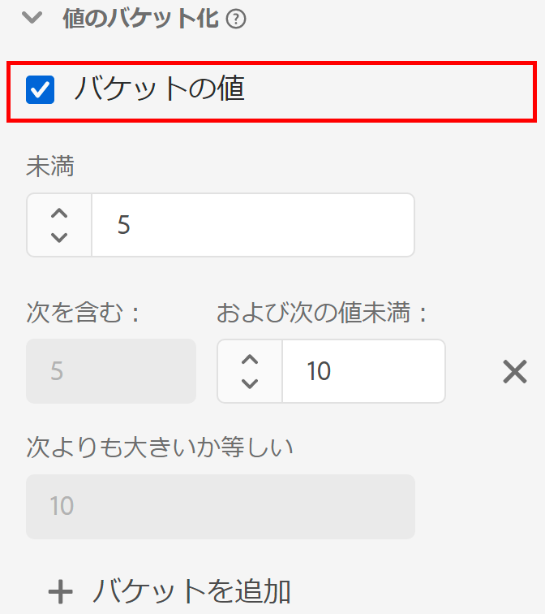

# [!UICONTROL 値のバケット化] コンポーネントの設定 {#value-bucketing-component-settings}

<!-- markdownlint-disable MD034 -->

>[!CONTEXTUALHELP]
>id="dataview_component_dimension_value_bucketing"
>title="値のバケット化"
>abstract="バケットの値を特定の範囲に収めます。 これらの範囲は、レポートでディメンション項目として表示されます。"

<!-- markdownlint-enable MD034 -->

データビューを作成または編集する際に、値のバケット化を使用すると、範囲に基づいて数値を組み合わせることができます。 整数または倍精度スキーマのデータタイプを使用するディメンションに対してのみ使用できます。

値のバケット化は、すべての一意の数を個別のディメンション項目として扱うのではなく、範囲をグループ化する場合に役立ちます。 例えば、「5 ～ 10」のバケットは、Analysis Workspace では行項目「5 ～ 10」として表示されます。

グループディメンションと非グループディメンションの両方に関するレポートを柔軟に作成する場合は、コンポーネントの 2 つのコピーを使用可能なディメンションリストにドラッグします。 一方のディメンションでバケット化を有効にし、もう一方のディメンションでバケット化を無効にします。

| 設定 | 説明 |
| --- | --- |
| [!UICONTROL バケットの値] | バケット化を有効にするためのチェックボックス。 |
| [!UICONTROL より小さい] | 1 つ目のディメンションバケットの上限。 |
| [!UICONTROL 含む] [!UICONTROL およびより小さい] | 後続のバケットの境界。 |
| [!UICONTROL 以上] | 最後のディメンションバケットの下限。 |
| [!UICONTROL バケットを追加] | 数値ディメンションバケットに別のバケットを追加できます。 1 つのディメンションに最大 20 個のバケットを追加できます。 |

{style="table-layout:auto"}
