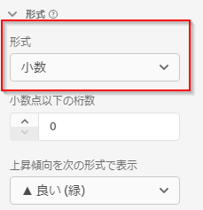
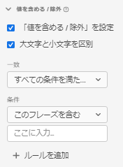
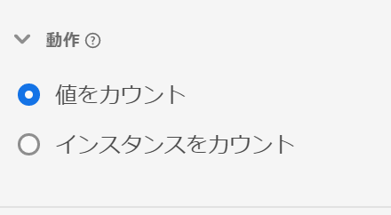
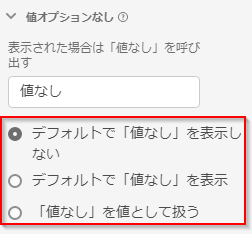
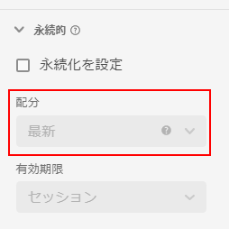
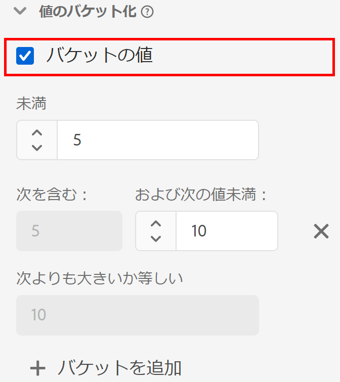

# 新しいデータビューの作成

データビューを作成するには、スキーマ要素から指標やディメンションを作成するか、標準コンポーネントを使用する必要があります。指標やディメンションを作成すると、柔軟性が大幅に向上します。以前は、Adobe Experience Platform にデータセットがある場合、文字列フィールドがディメンションとして使用され、数値フィールドが指標として使用されることが前提でした。これらのフィールドのいずれかを変更するには、Platform でスキーマを編集する必要がありました。データ表示 UI で使用できる、[指標とディメンションのフリーフォーム定義が増え](/help/data-views/data-views.md)ました。その他の使用例については、「[データビューの使用例](/help/data-views/data-views-usecases.md)」を参照してください。

## 1. データビューの設定とコンテナを構成する

1. Customer Journey Analytics で、「**[!UICONTROL データビュー]**」タブに移動します。
2. 「**[!UICONTROL 追加]**」をクリックして新しいデータビューを作成し、その設定を行います。

| 設定 | 説明／使用例 |
| --- | --- |
| [!UICONTROL 接続] | このフィールドは、データビューを、以前確立した接続（1 つ以上の Adobe Experience Platform データセットを含む）にリンクします。 |
| [!UICONTROL 名前] | データビューに名前を付ける必要があります。 |
| [!UICONTROL 説明] | 詳細な説明は必須ではありませんが、推奨します。 |
| [!UICONTROL タイムゾーン] | データを表示するタイムゾーンを選択します。 |
| [!UICONTROL タグ] | タグを使用すると、データビューをカテゴリ別に整理できます。 |
| [!UICONTROL コンテナ] | ここでコンテナの名前を変更できます。このデータビューに基づく Workspace プロジェクトで、コンテナはこの名前で表示されます。 コンテナは、フィルターやフォールアウト／フローなどで範囲やコンテキストの広さや狭さを定義するのに使用されます。 [詳細情報](https://experienceleague.adobe.com/docs/analytics-platform/using/cja-components/cja-filters/filters-overview.html?lang=ja#filter-containers) |
| [!UICONTROL 個人コンテナ名は…] | [!UICONTROL 個人]（デフォルト）。[!UICONTROL 個人]コンテナには、指定期間内に発生した訪問者による訪問とページビューがすべて含まれます。この名前は「ユーザー」またはその他の任意の語句に変更できます。 |
| [!UICONTROL セッションコンテナ名は…] | [!UICONTROL セッション]（デフォルト）。[!UICONTROL セッション]コンテナでは、特定のセッションのページインタラクション、キャンペーンまたはコンバージョンを識別できます。この名前は「訪問」またはその他の任意の語句に変更できます。 |
| [!UICONTROL イベントコンテナ名は…] | [!UICONTROL イベント]（デフォルト）。[!UICONTROL イベント]コンテナは、フィルターに含めるまたはフィルターから除外するページイベントを定義します。 |

次に、スキーマ要素から指標やディメンションを作成できます。標準コンポーネントも使用できます。

## 2. スキーマ要素から指標およびディメンションを作成する

1. [!UICONTROL Customer Journey Analytics]／[!UICONTROL データビュー]で、「[!UICONTROL コンポーネント]」タブをクリックします。

データセットを含む「[!UICONTROL 接続]」が左上に表示され、その「[!UICONTROL スキーマフィールド]」が下に表示されます。次の点に注意してください。

* 既に含まれているコンポーネントは、（システムにより生成された）標準の必須コンポーネントです。
* また、デフォルトで「**[!UICONTROL データを含む]**」フィルターを適用して、データを含むスキーマフィールドのみ表示されるようにします。 データを含まないフィールドを探している場合は、フィルターを削除します。

1. 次に、[!UICONTROL pageTitle]などのスキーマフィールドを左側のパネルから「指標」セクションまたは「ディメンション」セクションにドラッグします。

   同じスキーマフィールドをディメンションまたは指標セクションに複数回ドラッグし、同じディメンションまたは指標を異なる方法で設定できます。例えば、**[!UICONTROL pageTitle]** フィールドから、右側の&#x200B;**[!UICONTROL コンポーネント名]**&#x200B;の名前を変更することで、「製品ページ」というディメンションを作成したり、「エラーページ」というディメンションを作成したりできます。 **[!UICONTROL pageTitle]** フィールドの文字列値から指標を作成することもできます。例えば、異なるアトリビューション設定と異なる「含む / 除外する値」を持つ&#x200B;**[!UICONTROL 注文件数]**&#x200B;指標を 1 つ以上作成できます。

   

   >[!NOTE]
   >
   >スキーマフィールドフォルダー全体を左側のパネルからドラッグすると、従来のセクションに自動的に並べ替えられます。最終的に、文字列フィールドは「[!UICONTROL ディメンション]」セクションに、数値は「[!UICONTROL 指標]」セクションに表示されます。 または、「**[!UICONTROL すべて追加]**」をクリックすると、すべてのスキーマフィールドが追加されます。

1. コンポーネントを選択すると、右側に多数の設定が表示されます。以下の設定を使用して、コンポーネントを構成します。

### コンポーネントの設定

| 設定 | 説明／使用例 |
| --- | --- |
| [!UICONTROL コンポーネントの種類] | 必須。コンポーネントを指標からディメンションに、またはその逆に変更できます。 |
| [!UICONTROL コンポーネント名] | 必須。Analysis Workspace に表示されるわかりやすい名前を指定できます。コンポーネントの名前を変更して、データビュー固有の名前を付けることができます。 |
| [!UICONTROL 説明] | 他のユーザーにコンポーネントの情報を提供する場合は、オプションです（ただし推奨）。 |
| [!UICONTROL タグ] | （オプション）Analysis Workspace UI で検索／フィルタリングを行いやすくするために、カスタムタグまたは標準搭載のタグでコンポーネントにタグを付けることができます。 |
| [!UICONTROL フィールド名] | スキーマフィールドの名前。 |
| [!UICONTROL データセットタイプ] | 必須。コンポーネントの元となるデータセットタイプ（イベント、参照、プロファイル）を示す編集不可のフィールド。 |
| [!UICONTROL データセット] | 必須。コンポーネントの元となるフィールドのタイプ（文字列、整数など）を示す編集不可のフィールド。このフィールドには、複数のデータセットを含めることができます。 |
| [!UICONTROL スキーマタイプ] | コンポーネントが文字列、整数などかどうかを示します。 |
| [!UICONTROL コンポーネント ID] | 必須。[CJA API](https://adobe.io/cja-apis/docs)は、このフィールドを使用してコンポーネントを参照します。編集アイコンをクリックして、このコンポーネント ID を変更できます。ただし、このコンポーネント ID を変更すると、このコンポーネントを含んだ既存の Workspace プロジェクトがすべて機能しなくなります。 pageTitle ディメンションの異なるフィールドを使用する別のデータビューを作成する場合は、名前を変更して、ディメンションにデータビュー間の互換性を持たせることができます。 |
| [!UICONTROL パス] | 必須。コンポーネントの元となるスキーマパスを示す編集不可のフィールド。 |
| [!UICONTROL レポートのコンポーネントを非表示] | デフォルト = オフ。レポートで使用する場合に、データビューからコンポーネントをキュレーションできます。これは権限には影響しません。影響を受けるのは、コンポーネントのキュレーションだけです。つまり、レポートで管理者以外のユーザーに対してコンポーネントを非表示にできます。 管理者は、Analysis Workspace プロジェクトで「[!UICONTROL すべてのコンポーネントを表示]」をクリックしてアクセスできます。 |

### 形式の設定

形式の設定は指標に対してのみ有効です。

| 設定 | 説明／使用例 |
| --- | --- |
| [!UICONTROL 書式] | 指標の書式を、10 進数、時間、パーセント、通貨の形式で指定できます。 |
| [!UICONTROL 小数点以下の桁数] | 指標で表示する小数点以下の桁数を指定できます。 |
| [!UICONTROL 上昇傾向を次の形式で表示] | この指標の上昇傾向を良い（緑）と見なすか、悪い（赤）と見なすかを指定できます。 |
| [!UICONTROL 通貨] | この設定は、選択した指標の形式が[!UICONTROL 通貨]の場合にのみ表示されます。 通貨オプションのリストを使用できます。デフォルトは通貨以外です。これにより、レポートで選択した通貨で売上高を表すことができます。これは通貨換算ではなく、単なる UI 書式設定オプションです。 |

### アトリビューションの設定

| 設定 | 説明／使用例 |
| --- | --- |
| [!UICONTROL アトリビューションを設定] | この指標を使用する場合に、デフォルトでこの指標に適用するアトリビューション設定を指定できます。このデフォルトは、フリーフォームテーブルまたは計算指標で上書きできます。 |
| [!UICONTROL アトリビューションモデル] | デフォルトのアトリビューションモデルを指定できます。これは、「[!UICONTROL デフォルト以外のアトリビューションモデルを使用]」設定をオンにした場合にのみ有効です。デフォルトは「[!UICONTROL ラストタッチ]」です。オプションは、ラストタッチ、ファーストタッチ、リニア、パーティシペーション、同じタッチ、U 字型、J 曲線、逆 J、時間減衰、カスタム、アルゴリズムです。 これらのオプションの一部は、「カスタム」や「時間減衰」など、入力が必要な追加フィールドを作成します。同じフィールドを使用して複数の指標を作成できます。つまり、1 つの「[!UICONTROL ラストタッチ]」売上高指標と 1 つの「[!UICONTROL ファーストタッチ]」売上高指標を持つことができますが、これらはスキーマ内の同じ売上高フィールドに基づきます。 |
| [!UICONTROL ルックバックウィンドウ] | 指標に対するデフォルトのルックバックウィンドウを指定できます。これは、「[!UICONTROL デフォルト以外のアトリビューションモデルを使用]」設定をオンにした場合にのみ有効です。オプションは、個人（レポートウィンドウ）、セッション、カスタムです。「カスタム」を選択すると、Attribution IQ と同様に、任意の日数/週数/月数など（最長 90 日間）を選択するオプションも表示されます。同じスキーマフィールドを使用して複数の指標を設定できますが、指標ごとに別々のルックバックウィンドウがあります。 |

### 含む／除外する値の設定

この設定を使用すると、クエリ時にレポート対象の基になるデータを変更できます。フィルターとは異なります。 しかし、フィルターは、パスやアトリビューションと同様に、この新しいディメンションに従います。

例えば、pageTitle フィールドからディメンションを作成し、そのディメンションを「error pages」と呼び、「error」という[!UICONTROL フレーズを含む]ページを含めることができます。

| 設定 | 説明／使用例 |
| --- | --- |
| [!UICONTROL 大文字と小文字を区別] | デフォルト = オン。この設定は、「[!UICONTROL 含む / 除外する値]」セクションにのみ適用されます。これにより、適用する「含む / 除外する」ルールで大文字と小文字を区別する必要があるかどうかを判断できます。 |
| [!UICONTROL 次に一致] | アトリビューションとフィルターの前にレポート対象として考慮する値を指定できます（例：「エラー」というフレーズを含む値のみを使用する）。 「**[!UICONTROL すべての条件が満たされた場合]**」または「**[!UICONTROL いずれかの条件が満たされた場合]**」を指定できます。 |
| [!UICONTROL 条件] | 特定のフィルタールールに適用する一致ロジックを指定できます。<ul><li>**文字列**：「フレーズを含む」、「任意の語句を含む」、「すべての語句を含む」、「いずれも語句を含まない」、「フレーズを含まない」「次と等しい」、「次と等しくない」、「次の語句で始まる」、「次の語句で終わる」</li><li>**重複 / 整数**：等しい、等しくない、次より大きい、次より小さい、次よりも大きいか等しい、次よりも小さいか等しい</li><li>**日付**：等しい、等しくない、より後、より前、次の範囲内で発生</li></ul> |
| [!UICONTROL 一致オペランド] | 一致演算子の適用対象となる一致オペランドを指定できます。<ul><li>**文字列**：テキストフィールド</li><li>**倍精度整数 / 整数**：上向き／下向き矢印付きの数値用テキストフィールド</li><li>**日付**：日の精度の選択（カレンダー）</li><li>**日時**：日付と時間の精度の選択</li></ul> |
| [!UICONTROL ルールを追加] | 追加の一致演算子およびオペランドを指定できます。 |

### 動作の設定

| 設定 | 説明／使用例 |
| --- | --- |
| [!UICONTROL インスタンスをカウント] | 指標として使用する数値フィールドまたは日付タイプフィールドで、値そのものではなく設定回数をカウントするかどうかを指定できます。  数値フィールドのインスタンスを合計し、内部の実際の値ではなく、そのフィールドが&#x200B;*設定*&#x200B;された回数だけを合計する場合。 これは、例えば、[!UICONTROL 売上高]フィールドから [!UICONTROL 注文件数]指標を作成する場合に役立ちます。売上高が設定された場合、売上高の数値ではなく、1 件の注文をカウントする必要があります。 |

### [!UICONTROL 「値なし」オプション]の設定

[!UICONTROL 「値なし」オプション]の設定は、レポートの「[!UICONTROL 指定なし]」または「[!UICONTROL なし]」の値と同様です。データビュー UI では、これらの値をレポートでどのように扱うかをコンポーネント単位で指定できます。また、[!UICONTROL 値なし]を、「[!UICONTROL Null]」、「[!UICONTROL 設定しない]」など、環境に適した値に変更することもできます。

また、このフィールドで指定した内容は、 [!UICONTROL 「値なし」オプション]の設定に記載されているレポートの「[!UICONTROL 値なし]」行項目の特別な UI 処理に使用できます。

| 設定 | 説明／使用例 |
| --- | --- |
| [!UICONTROL 表示された場合は「値なし」を呼び出す...] | 「**[!UICONTROL 値なし]**」の名前を別の名前に変更できます。 |
| [!UICONTROL デフォルトで「値なし」を表示しない] | レポートでこの値を表示しません。 |
| [!UICONTROL デフォルトで「値なし」を表示する] | レポートでこの値を表示します。 |
| [!UICONTROL 「値なし」を値として扱う] | この設定は、データ内の空白の値を「[!UICONTROL If shown, call No value]」で指定したテキストに置き換えます。 例えば、モバイルデバイスのタイプをディメンションとして指定した場合、「**[!UICONTROL 値なし]**」項目の名前を「デスクトップ」に変更できます。 なお、このフィールドをカスタム値に変更すると、そのカスタム値は正当な文字列値として扱われます。したがって、このフィールドに「Red」と入力した場合、データそのものに「Red」という文字列が出現すると、指定した行項目の下にもロールします。 |

### 永続性の設定

詳しくは、[永続性](/help/data-views/persistence.md)に関するトピックを参照してください。

| 設定 | 説明／使用例 |
| --- | --- |
| [!UICONTROL 永続化を設定] | 切り替えキー |
| [!UICONTROL 配分] | ディメンションで永続性のために使用する配分モデルを指定できます。オプションは、「[!UICONTROL 最新の]」、「[!UICONTROL 元の]」、「[!UICONTROL インスタンス]」、「[!UICONTROL すべて]」です。（従来の Analytics の eVar と同様に）永続的な値にする場合は、ここで設定します。 主な違いは、設定できる最大永続性が 90 日であることだけです。また、「[!UICONTROL 無期限]」というオプションではありません。 |
| [!UICONTROL 有効期限] | ディメンションの永続性ウィンドウを指定できます。オプションは、「[!UICONTROL セッション]」（デフォルト）、「[!UICONTROL 個人]」、「[!UICONTROL 時間]」、「[!UICONTROL 指標]」です。場合によっては、購入時にディメンションの有効期限が切れるように設定できる必要があります（内部検索キーワードや他のマーチャンダイジングの使用例など）。[!UICONTROL 指標]を使用すると、定義済みの指標のいずれかをこのディメンションの有効期限として指定できます（[!UICONTROL 購入]指標など）。 **注意**:「すべて」の配分を選択した場合は、ディメンションのカスタム有効期限を設定 [!UICONTROL できません]。 |

### 値バケットの設定

例えば、「5 ～ 10」のバケットは、Workspace レポートに行項目「5 ～ 10」として表示されます。

| 設定 | 説明／使用例 |
| --- | --- |
| [!UICONTROL バケットの値] | 数値ディメンションのグループバージョンを作成できます。これにより、レポートで売上高のバケットやその他の数値をディメンションとして報告できます。 |
| [!UICONTROL ～] | 最初の数値ディメンションバケットの境界を指定できます。これは、数値ディメンションにのみ適用されます。 |
| [!UICONTROL 次の範囲内] | 後続の数値ディメンションバケットの境界を指定できます。 |
| [!UICONTROL バケットを追加] | 数値ディメンションバケットに別のバケットを追加できます。 |

### [!UICONTROL 標準コンポーネント]の使用

スキーマ要素から指標やディメンションを作成する以外に、データビューで標準コンポーネントを使用することもできます。

[!UICONTROL 標準]コンポーネントとは、データセットスキーマフィールドから生成されるのではなく、システムによって生成されるコンポーネントを指します。Analysis Workspace でのレポート機能を強化するためにあらゆるデータビューで必要となるシステムコンポーネントもあれば、オプションのシステムコンポーネントもあります。

これら必須の標準コンポーネントは、デフォルトで各データビューに追加されます。

| コンポーネント名 | ディメンションまたは指標 | メモ |
| --- | --- | --- |
| [!UICONTROL 人物] | 指標 | この指標は、「[!UICONTROL 接続]」で指定された個人 ID に基づいています。  |
| [!UICONTROL セッション] | 指標 | この指標は、以下で指定したセッション設定に基づいています。 |
| [!UICONTROL イベント] | 指標 | この指標は、「[!UICONTROL 接続]」に含まれるすべてのイベントデータセットの行数を表します。  |
| [!UICONTROL 日] | ディメンション | 「日」ディメンションは、特定の指標が発生した日をレポートします。 最初のディメンション項目は日付範囲の最初の日で、最後のディメンション項目は日付範囲の最後の日です。 |
| [!UICONTROL 週] | ディメンション | 「週」ディメンションは、特定の指標が発生した週をレポートします。 最初のディメンション項目は日付範囲の最初の週で、最後のディメンション項目は日付範囲の最後の週です。 |
| [!UICONTROL 月] | ディメンション | 「月」ディメンションは、特定の指標が発生した月をレポートします。 最初のディメンション項目は日付範囲の最初の月で、最後のディメンション項目は日付範囲の最後の月です。 |
| [!UICONTROL 四半期] | ディメンション | 「四半期」ディメンションは、特定の指標が発生した四半期をレポートします。 最初のディメンション項目は日付範囲の最初の四半期で、最後のディメンション項目は日付範囲の最後の四半期です。 |
| [!UICONTROL 年] | ディメンション | 「年」ディメンションは、特定の指標が発生した年を報告します。 最初のディメンション項目は日付範囲の最初の年で、最後のディメンション項目は日付範囲の最も新しい年です。 |
| [!UICONTROL 時間] | ディメンション | 「時間」ディメンションは、特定の指標が発生した時間（切り捨て）をレポートします。 最初のディメンション項目は日付範囲の最初の時間で、最後のディメンション項目は日付範囲の最後の時間です。 |
| [!UICONTROL 分] | ディメンション | 「分」ディメンションは、特定の指標が発生した分（切り捨て）をレポートします。 最初のディメンション項目は日付範囲の最初の分で、最後のディメンション項目は日付範囲の最後の分です。 |

### 標準コンポーネント（オプション）

オプションの標準コンポーネントは、「**[!UICONTROL 標準コンポーネント]**」タブで入手できます。

| コンポーネント名 | ディメンションまたは指標 | メモ |
| --- | --- | --- |
| [!UICONTROL セッション開始] | 指標 | この指標は、セッションの最初のイベントとなったイベントの数をカウントします。フィルター定義で使用する場合（例：「[!UICONTROL セッション開始]が存在する」）、各セッションの最初のイベントのみにフィルターされます。 |
| [!UICONTROL セッション終了] | 指標 | この指標は、セッションの最後のイベントとなったイベントの数をカウントします。「[!UICONTROL セッション開始]」と同様、これをフィルター定義で使用してフィルタリングし、各セッションの最後のイベントだけを残すこともできます。 |
| [!UICONTROL 滞在時間 (秒)] | 指標 | [!UICONTROL 滞在時間]指標は、1 つのディメンションの 2 つの異なる値の間の時間を合計します。 |
| [!UICONTROL イベント別滞在時間] | ディメンション | [!UICONTROL イベント別滞在時間]では、[!UICONTROL 滞在時間]指標を[!UICONTROL イベント]グループ別にまとめたものです。 |
| [!UICONTROL セッション別滞在時間] | ディメンション | [!UICONTROL セッション別滞在時間] は、[!UICONTROL 滞在時間]指標を[!UICONTROL セッション]グループ別にまとめたものです。 |
| [!UICONTROL ユーザー別滞在時間] | ディメンション | [!UICONTROL ユーザー別滞在時間] [!UICONTROL 滞在時間]指標を[!UICONTROL 個人]グループ別にまとめたものです。 |
| [!UICONTROL バッチ ID] | ディメンション | [!UICONTROL イベント]が含まれていた Experience Platform バッチを表します。 |
| [!UICONTROL データセット ID] | ディメンション | [!UICONTROL イベント]が含まれていた Experience Platform データセットを表します。 |

### フィルタースキーマフィールドおよびディメンション／指標

左側のパネルのスキーマフィールドは、次のデータタイプでフィルタリングできます。

また、データセットによって、およびデータがスキーマフィールドに含まれているか、またはデータが ID であるかによって、フィルタリングすることもできます。 デフォルトでは、「**[!UICONTROL データを含む]**」フィルターをすべてのデータビューに適用します。

## 3. データビューにグローバルフィルターを追加する

データビュー全体に適用するフィルターを追加できます。 このフィルターは、Workspace で実行する任意のレポートに適用されます。

1. [!UICONTROL データビュー]の「[!UICONTROL 設定]」タブをクリックします。
1. 左側のパネルのリストから「「[!UICONTROL フィルターを追加]」フィールドにフィルターをドラッグします。
