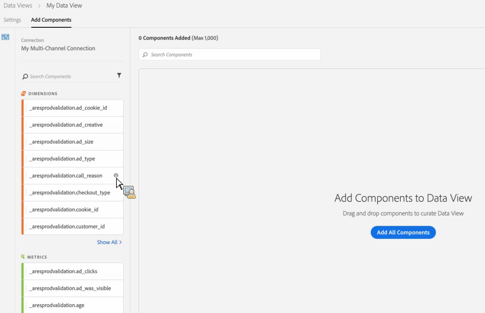
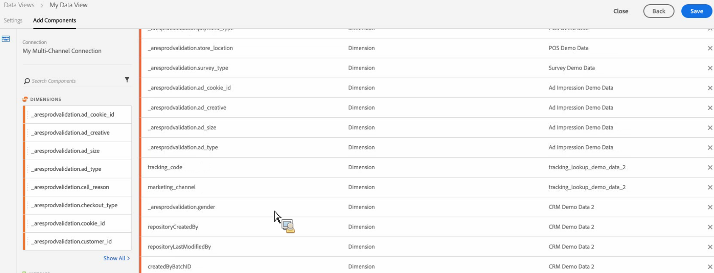

# データレイヤーの作成

データ表示は、データの「フィルタリング」された表示であるという点で、Analyticsの仮想レポートスイートに似ています。 同じ接続に対して異なるデータ表示を作成し、訪問のタイムアウトや属性などを異なる設定で指定できます。 1つのデータセットに対して複数の表示を作成することができます。 例えば、すべてのディメンションが「ラストタッチ」に設定されたデータ表示と、すべてのディメンションが「ファーストタッチ」に設定された別のデータ表示（同じデータセットに基づく）を同時に設定できます。

Customer Jeurney AnalyticsのWorkspaceプロジェクトは、データ表示に基づく。

ビデオの [概要について](https://docs.adobe.com/content/help/en/platform-learn/tutorials/cja/basic-configuration-for-data-views.html) 、ここをクリックしてください。

## 前提条件

データ表示を作成する前に、Experience Platform [データセットに1つ以上の接続を設定する必要があります] ](/help/connections/create-connection.md)。

## 設定する

1. Customer Jeurney Analyticsで、タブに移動し **[!UICONTROL Data Views]** ます。

1. をクリック **[!UICONTROL Add]** して、データ表示を追加し、設定します。

   | セッション設定 | 定義 |
   |---|---|
   | 接続 | このフィールドは、データ表示を、データセットを含む、以前に確立した接続にリ [!UICONTROL Experience Platform] ンクさせます。 |
   | 名前 | データ表示に名前を付ける必要があります。 |
   | 説明 | 詳細な説明は必須ではありませんが、お勧めします。 |
   | 追加タグ | タグを使用すると、データ表示を整理できます。 |
   | タイムゾーン | 使用するデータゾーンのタイムゾーンを表示します。 |
   | セッションタイムアウト | 「セッション」の定義を選択します。 セッションタイムアウトの設定は、新しいセッションが自動的に開始されるまでに固有の訪問者が持つ、無操作状態の時間を定義します。 デフォルトは30分です。 例えば、セッションのタイムアウトを45分に設定した場合、収集されたヒットの各シーケンスに対して、45分間の無操作状態が続くたびに新しいセッショングループが作成されます。 <!--This setting impacts not only your visit counts, but also how visit segment containers are evaluated, and the visit expiration logic for any eVars expiring on visit. Decreasing the session timeout will likely increase the total number of visits in your reporting, while increasing the visit timeout will likely decrease the total number of visits in your reporting. This needs to be reviewed.--> |
   | 開始の新しいセッションとイベント | セッションが開始したかどうかに関係なく、イベントが起動されたときの新しいセッションが発生します。 新しく作成されたセッションには、そのセッションを開始したイベントが含まれます。 また、複数のイベントを使用してセッションを開始でき、データ内でこれらのイベントが見つかると新しいセッションが発生します。 この設定は、訪問回数、セッション（以前の訪問）セグメントコンテナ、訪問の有効期限ロジックにディメンションに影響します。 |
   | フィルターを追加 | 「フィルター」は、Customer Jeurney Analyticsの「セグメント」を指します。 データをフィルターする場合は、左側のナビゲーションバーから該当するフィルターをここにドラッグします。 フィルターを選択しない場合、データ表示にすべてのデータが含まれます。 |

1. クリック **[!UICONTROL Continue]**.

## コンポーネントを追加

1. 次に、コンポーネント（ディメンション、指標）をデータ表示に追加します（仮想レポートスイートのキュレーションエクスペリエンスと同様）。データセット内の各フィールドがディメンションまたは指標に変換されます。 ディメンションと指標をパネルまたは **[!UICONTROL [すべて選択]にドラッグし、すべてのコンポーネントを** 追加します。

   

1. ディメンション **[!UICONTROL Add Components]** と指標をデータ表示に追加するには、タブをクリックします。

   

1. （オプション）コンポーネントの名前をわかりやすい名前に変更したり、コンポーネントを選択して設定を編集することで、アトリビューション設定を変更したりできます。 基本名は保持されます。 詳しくは、データのアトリビューシ [ョンと表示の設定を参照してくださ](/help/data-views/configure-dataviews.md)い。

1. 次の手順は、コンポーネントとア [トリビューションの設定を指定することで](/help/data-views/configure-dataviews.md)す。